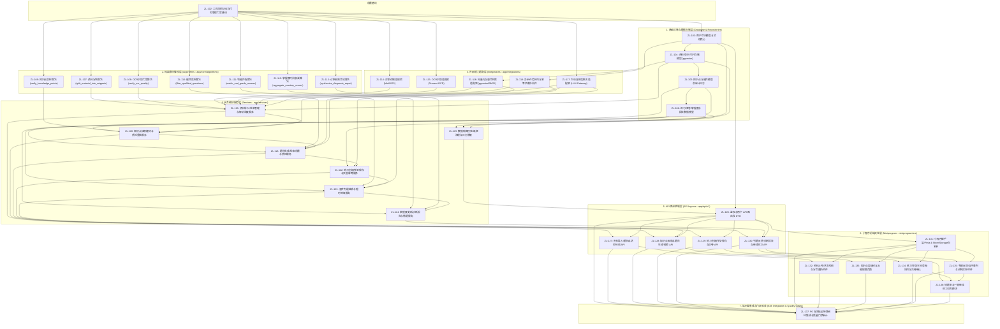

# 智练自主学习平台 - P0 交付范围原子任务拓扑矩阵 (ROADMAP.md)

> **定位说明**：  
> 本矩阵严格依据《软件需求规格说明书 V2.0》、《概要设计说明书 V1.0》与《代码管理工作介绍 V1.0》解构生成。  
> 避开已有任务 `ZL-102`（工程协议对齐），本路线图从 `ZL-103` 开始编排，共 **35 个聚焦单一关注点的原子任务**（ZL-103 至 ZL-137）。  
> **核心原则**：纯函数计算核先行、仓储与适配解耦、服务层统领事务、前端组件小步快跑、端到端物理闭环验收。

---

## 阶段拓扑与依赖流向 (Architecture & Task Dependency DAG)



---

## 1. 基础设施、数据模型与仓储层 (Database & Repositories)

*分层约束：封装数据表查询与写入，所有查询强制携带 `user_id`（防水平越权），严禁导入 `fastapi` 与 `app/integrations`。*

| 任务编号 | 任务名称 | 对应 PRD 章节与需求编号 | 绑定纯函数核 | 风险分级 | 前置依赖 | 交付产物与核心 DOD |
|---|---|---|---|---|---|---|
| `ZL-103` | 用户空间模型、多租户基类与鉴权安全核心 | FR-59, FR-60, NFR-13, NFR-14 | 无 | Tier 3 (鉴权底座/租户隔离) | `ZL-102` | 用户表 (`users`)、`TenantModelMixin`、JWT 双令牌签发验证；越权负向单测 100% 拦截，`security.py` 行覆盖 $\ge 95\%$ |
| `ZL-104` | 学习资料、版本与知识片段存储模型 (含 pgvector) | FR-01~03, FR-11~13, FR-61 | 无 | Tier 3 (向量扩展/表结构) | `ZL-103` | 资料主表 (`materials`)、版本表 (`material_versions`)、切片表 (`material_snippets` 含 1024 维向量 + HNSW 索引)、OCR 记录表；Alembic 升降级双向测试通过 |
| `ZL-105` | 知识点与题目持久化数据模型及审计日志 | FR-14, FR-20, FR-22, FR-24, FR-26 | 无 | Tier 3 (核心业务实体演进) | `ZL-104` | 知识点树模型 (`knowledge_points`)、题目表 (`questions` 含题干向量查重)、质检记录表、修改审计日志表；事务隔离与回滚测试通过 |
| `ZL-106` | 练习、答卷、掌握度与诊断报告数据模型 | FR-29, FR-34, FR-35, FR-37, FR-44, FR-45, FR-50, FR-54, FR-58 | 无 | Tier 3 (状态机/幂等约束) | `ZL-105` | 练习表 (`practices`)、答卷作答表 (`attempt_items` 带题目快照 JSONB 与外键解耦)、判题表、掌握度表、报告表、错题表；幂等冲突拦截测试通过 |

---

## 2. 纯函数计算核层 (Algorithms - app/core/algorithms)

*分层约束：绝对禁止导入 `fastapi`, `sqlalchemy`, `httpx`, `redis`, `boto3` 等 Web/ORM/网络库；严禁使用 Mock 替身打桩；行覆盖率 $\ge 95\%$，分支覆盖率 $\ge 90\%$。*

| 任务编号 | 任务名称 | 对应 PRD 章节与需求编号 | 绑定纯函数核 | 风险分级 | 前置依赖 | 交付产物与核心 DOD |
|---|---|---|---|---|---|---|
| `ZL-107` | 资料分块算法实现 | FR-07, NFR-22 | `split_material_into_snippets` | Tier 2 | `ZL-102` | 800 字上限、120 字重叠、句末标点降级、孤立短段合并、3000 片段超长截断；$V(G) \le 12$，分支覆盖率 100% |
| `ZL-108` | OCR 识别质量门禁算法 | FR-08, FR-09 | `verify_ocr_quality` | Tier 2 | `ZL-102` | 逐页乱码率 ($\le 15\%$)、有效字数 ($\ge 40$)、同批中位数完整度计算；判定覆盖率 100% |
| `ZL-109` | 知识点质检门禁算法 | FR-16~18, NFR-22 | `verify_knowledge_points` | Tier 2 | `ZL-102` | 四项一票否决决策矩阵（数量区间、层级 $2\sim 5$ 级、命名黑名单、关键章节覆盖 $\ge 80\%$）；判定覆盖率 100% (16 组全覆盖) |
| `ZL-110` | 题目质检与待处理过滤算法 | FR-24, FR-25, NFR-22 | `filter_qualified_questions` | Tier 2 | `ZL-102` | 无来源 ($<30\%$)、重复题 ($>0.90$)、答案冲突 ($>0.88$)、表述歧义 4 类严格过滤；条件组合覆盖 (MCC) 验证通过 |
| `ZL-111` | 判题阈值与匹配算法 | FR-37~40, NFR-22 | `match_and_grade_answer` | Tier 2 | `ZL-102` | 客观题规范化清洗、主观题要点与语义合成、双阈值判定 ($\ge 0.82$ 判对, $\le 0.45$ 判错, 中间转 AI)、4 类转 AI 决策；$V(G) \le 10$，分支覆盖 100%，成对否定词反转测试通过 |
| `ZL-112` | 掌握度时间衰减聚合算法 | FR-45~47, NFR-22, NFR-23 | `aggregate_mastery_scores` | Tier 2 | `ZL-102` | 权重衰减 (离线 1.0/AI 0.8/自评 0.5)、半衰期 30 天 ($\lambda=0.023$)、四档档次映射；显式传入当前时间戳；$V(G) \le 8$，分支覆盖 100% |
| `ZL-113` | 诊断规则合成算法 | FR-50, FR-51, FR-53 | `synthesize_diagnosis_report` | Tier 2 | `ZL-102` | 提取薄弱知识点（必须关联错题）、退步判定 ($\Delta \ge 0.05$)、四类成因规则匹配；单测分支覆盖率 100% |

---

## 3. 外部能力适配层 (Integrations - app/integrations)

*分层约束：通过 Protocol 接口解耦供应商，测试环境一律使用 Fake/Stub，严禁向外发起真实网络连接。*

| 任务编号 | 任务名称 | 对应 PRD 章节与需求编号 | 绑定纯函数核 | 风险分级 | 前置依赖 | 交付产物与核心 DOD |
|---|---|---|---|---|---|---|
| `ZL-114` | 对象存储适配器 (MinIO / S3) | FR-01, FR-11, NFR-26 | 无 | Tier 2 | `ZL-102` | `StorageProtocol` 抽象、`MemoryObjectStorage` (单测 Fake) 与 MinIO 客户端 (15min 临时签名凭证)；单测零网络通过 |
| `ZL-115` | OCR 识别适配器 (Tencent OCR) | FR-06, FR-08, NFR-11, NFR-26 | 无 | Tier 2 | `ZL-102` | `OCRProtocol` 抽象、`FakeOCR` (延迟/错误注入) 与真实客户端 (20s 超时退避重试)；业务代码与 SDK 解耦 |
| `ZL-116` | 向量化与混合检索适配器 | FR-21, NFR-01, NFR-26 | 无 | Tier 2 | `ZL-104` | `EmbeddingProtocol`、PG 中文分词 + pgvector 粗排 20 + 关键词重排 4 执行器；混合检索 P95 $< 200\text{ms}$ |
| `ZL-117` | 大语言模型网关适配器 (LLM Gateway) | FR-14, FR-20, FR-41, NFR-11, NFR-26 | 无 | Tier 2 | `ZL-102` | `LLMProtocol` 抽象、`FakeLLM` 与网关客户端 (出题 60s、判题 20s 超时、Pydantic 结构化校验、单次残缺重试) |
| `ZL-118` | 异步任务队列与幂等拦截中间件 | FR-04, FR-35, FR-58, NFR-08, NFR-12 | 无 | Tier 2 | `ZL-103` | 任务队列抽象 (单测内存即时执行, 生产接入 Redis)；Redis Idempotency-Key 拦截器；并发重复提交测试通过 |

---

## 4. 业务编排服务层 (Services - app/services)

*分层约束：全系统唯一允许开启数据库事务的层，负责编排与跨外设调度，行覆盖率强制 $\ge 85\%$。*

| 任务编号 | 任务名称 | 对应 PRD 章节与需求编号 | 绑定纯函数核 | 风险分级 | 前置依赖 | 交付产物与核心 DOD |
|---|---|---|---|---|---|---|
| `ZL-119` | 资料导入、多版本管理与解析调度服务 | FR-01~13, NFR-07 | `split_material_into_snippets`, `verify_ocr_quality` | Tier 3 (跨多外设流水线) | `ZL-104`, `ZL-107`, `ZL-108`, `ZL-114`, `ZL-115`, `ZL-116`, `ZL-118` | `MaterialService`：编排魔数校验、切分、OCR 门禁及重拍调度；重拍 3 次熔断与多版本覆盖隔离通过 |
| `ZL-120` | 知识点抽取建树与质检重抽服务 | FR-14~19 | `verify_knowledge_points` | Tier 2 | `ZL-105`, `ZL-109`, `ZL-117`, `ZL-119` | `KnowledgeService`：批次抽取 ($\le 40$ 片段)、向量去重 ($>0.92$)、建树、质检重抽 ($\le 2$ 次) 及低可信度标记 |
| `ZL-121` | 题目生成、检索前置与质检服务 | FR-20~28, NFR-29 | `filter_qualified_questions` | Tier 2 | `ZL-105`, `ZL-110`, `ZL-116`, `ZL-117`, `ZL-120` | `QuestionService`：检索前置门禁 (无来源直接拒绝)、生成 6 要素 + 评分细则、质检拦截入待处理区、编辑审计 |
| `ZL-122` | 练习创建、作答保存与交卷幂等服务 | FR-29~36, NFR-08, NFR-09 | 无 | Tier 2 | `ZL-106`, `ZL-118`, `ZL-121` | `PracticeService`：出题打散 (同知识点不相邻)、单题作答按序保存、未答题校验、交卷强幂等 |
| `ZL-123` | 混合判题编排与超时降级服务 | FR-37~44, NFR-04 | `match_and_grade_answer` | Tier 3 (核心判分状态机) | `ZL-106`, `ZL-111`, `ZL-117`, `ZL-122` | `GradingService`：客观题纯规则秒判、主观题双阈值分流、LLM 20s 超时降级至待重新判题 (严禁判错)、支持用户自评覆盖 |
| `ZL-124` | 掌握度更新、诊断报告与错题闭环服务 | FR-45~58 | `aggregate_mastery_scores`, `synthesize_diagnosis_report` | Tier 2 | `ZL-106`, `ZL-112`, `ZL-113`, `ZL-123` | `ReportService`：200 条衰减计算、薄弱退步分析、错题本更新、继续练习同源未练防重合并 (FR-58) |
| `ZL-125` | 数据隔离校验、级联清理与日志脱敏中间件 | FR-13, FR-61~64, NFR-16, NFR-17 | 无 | Tier 3 (安全合规与数据销毁) | `ZL-103`, `ZL-104`, `ZL-106` | 8 要素结构化日志脱敏 (资料/答案/密钥严禁打印)、软删除与 7 天定时物理级联清理；越权穿透测试全部拦截 |

---

## 5. API 路由控制层 (API Ingress - app/api/v1)

*分层约束：只做请求解析、Pydantic 参数校验、调用 Service 与响应转换；严禁直接访问数据库会话或跨层导入 repositories。*

| 任务编号 | 任务名称 | 对应 PRD 章节与需求编号 | 绑定纯函数核 | 风险分级 | 前置依赖 | 交付产物与核心 DOD |
|---|---|---|---|---|---|---|
| `ZL-126` | 鉴权与用户 API 路由及 DTO | FR-59, FR-60, FR-62 | 无 | Tier 2 | `ZL-103`, `ZL-125` | `POST /auth/login`, `POST /auth/refresh`, `DELETE /users/me`；未登录统一 20001 |
| `ZL-127` | 资料导入、重拍与状态轮询 API | FR-01~05, FR-09, FR-13 | 无 | Tier 2 | `ZL-119`, `ZL-126` | `POST /materials` (带幂等键)、`GET /materials/{id}/status`、`DELETE /materials/{id}`；频控限流生效 |
| `ZL-128` | 知识点图谱与题目生成/编辑 API | FR-14, FR-20, FR-26, FR-27 | 无 | Tier 2 | `ZL-120`, `ZL-121`, `ZL-126` | `GET /materials/{id}/knowledge-tree`, `POST /questions/generate`, `PUT/DELETE /questions/{id}`；参数校验全覆盖 |
| `ZL-129` | 练习创建、作答保存与交卷 API | FR-29, FR-34~36 | 无 | Tier 2 | `ZL-122`, `ZL-126` | `POST /attempts`, `PUT /attempts/{id}/answers`, `POST /attempts/{id}/submit`；未答确认阻断有效 |
| `ZL-130` | 判题反馈、诊断报告与继续练习 API | FR-43, FR-44, FR-48~58 | 无 | Tier 2 | `ZL-123`, `ZL-124`, `ZL-126` | `GET /attempts/{id}/diagnosis`, `POST /questions/{id}/re-grade`, `POST /questions/{id}/self-grade`, `POST /attempts/{id}/continue`, `GET /wrong-book` |

---

## 6. 小程序前端交互层 (Miniprogram - miniprogram/src)

*分层约束：单文件代码 $\le 300$ 行；Pinia 严格收敛为 4 个 Store；本地 Storage 仅限登录态、未交作答草稿与用户偏好，严禁存储资料与题目全文。*

| 任务编号 | 任务名称 | 对应 PRD 章节与需求编号 | 绑定纯函数核 | 风险分级 | 前置依赖 | 交付产物与核心 DOD |
|---|---|---|---|---|---|---|
| `ZL-131` | 小程序基础脚手架、Pinia 4-Store 与 Storage 白名单封装 | FR-59, FR-60, NFR-13, NFR-18 | 无 | Tier 2 | `ZL-126` | 收敛 4 个 Store、网络拦截与静默双令牌刷新、Storage 白名单校验；`pnpm run lint` 0 报错 |
| `ZL-132` | 资料上传、状态轮询与分页重拍前端组件 | FR-01~10, NFR-21 | 无 | Tier 2 | `ZL-127`, `ZL-131` | 选文件/拍照直传 MinIO、2s 轮询、不合格页逐页标记与就地替换重拍；单文件 $\le 300$ 行 |
| `ZL-133` | 知识点层级树与出题配置页面 | FR-14, FR-18, FR-26, FR-27 | 无 | Tier 2 | `ZL-128`, `ZL-131` | 树状展开（低可信度黄色提示）、出题配置抽屉（1~50 题、题型筛选）、题目行内编辑与修改审计展示 |
| `ZL-134` | 练习作答、本地草稿队列与交卷确认组件 | FR-29~36, NFR-09, NFR-21 | 无 | Tier 2 | `ZL-129`, `ZL-131` | 逐题作答界面、断网本地队列暂存与重连补发、未答二次确认弹窗；小程序主包控制在 2MB 内 |
| `ZL-135` | 判题反馈、主观题自评/重判与诊断报告组件 | FR-37~53 | 无 | Tier 2 | `ZL-130`, `ZL-131` | 逐题解析与原文溯源高亮定位、待重新判题黄色告警与自评面板、掌握度四档徽章与薄弱点列表呈现 |
| `ZL-136` | 错题本与一键继续练习交互模块 | FR-54~58 | 无 | Tier 2 | `ZL-130`, `ZL-134`, `ZL-135` | 错题按题型/知识点筛选刷题、诊断报告末尾“一键继续练习”防抖防重合并；分包加载测试通过 |

---

## 7. 端到端集成与门禁验收 (E2E Integration & Quality Gates)

| 任务编号 | 任务名称 | 对应 PRD 章节与需求编号 | 绑定纯函数核 | 风险分级 | 前置依赖 | 交付产物与核心 DOD |
|---|---|---|---|---|---|---|
| `ZL-137` | P0 端到端全链路闭环集成与质量门禁审计 | 全量 P0 需求与 NFR 指标 | 全量纯函数核 | Tier 3 (全系统验收) | `ZL-126`~`ZL-136` | 自动化跑通“导入 $\to$ 识别 $\to$ 抽取 $\to$ 出题 $\to$ 作答 $\to$ 判题 $\to$ 诊断 $\to$ 继续练习”完整主链；全量静态检查、全量单测与覆盖率门禁通过 (算法核 $\ge 90\%$，全局 $\ge 80\%$)，分层校验 `check_layers.py` 0 违规 |

---

## 8. 执行指引与工件流转

任意原子任务准备启动时，直接在终端执行：
```bash
python3 tooling/task_cli.py create <Task-ID> --title "<任务名称>" --tier <2|3> --owner "<Owner>"
```
系统将自动生成对应任务的 `docs/sdlc/<Task-ID>/intent.md`，并在其中展开具体契约与实施计划。
所有开发与提测必须严格遵循：`intent.md` $\to$ `spec.md` $\to$ `plan.md` $\to$ 编码/单测 $\to$ `REVIEW.md` 完整生命周期。
