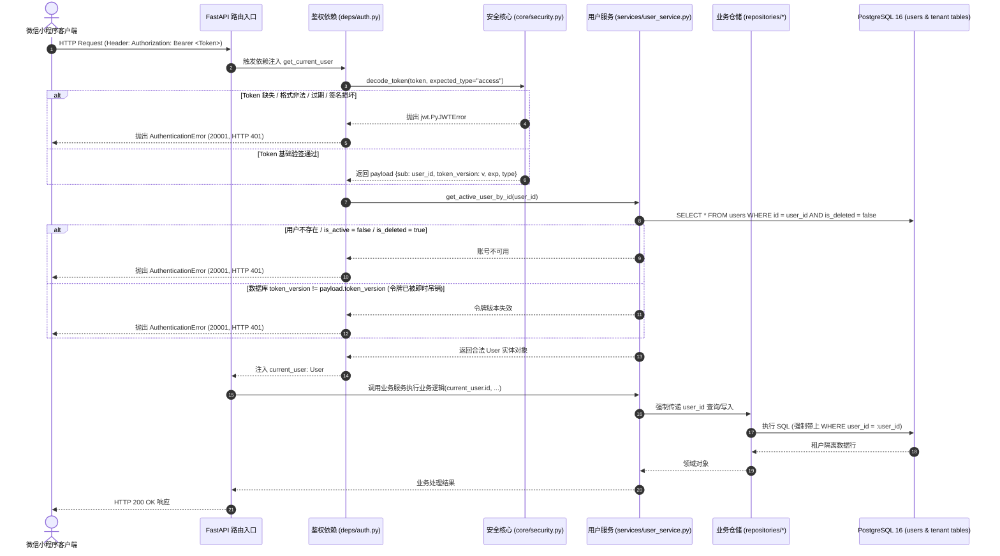
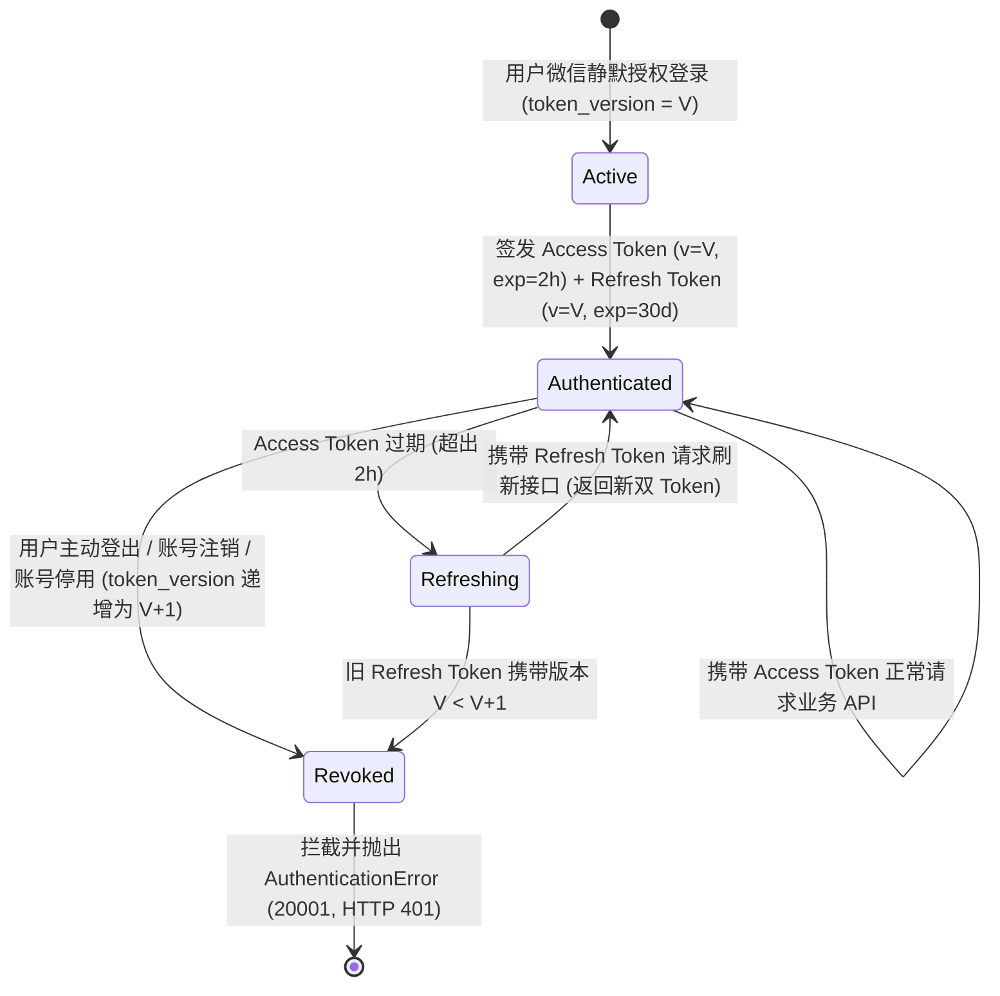

# Spec: 用户空间模型、多租户基类与鉴权安全核心 - 技术契约

- **关联 Intent**: ZL-103
- **主导设计人**: Dev
- **当前状态**: In-Review
- **任务评级**: Tier 3 (Cross-Domain Rewiring)

---

## 1. 架构流向与设计方案

### 1.1 多租户数据隔离与身份鉴权流向
智练平台定位于面向个人的自主学习助手，系统在架构设计上强制实施多租户数据隔离与最小权限原则。所有业务数据表均归属于特定用户，绝不允许无凭据访问或跨租户横向穿透。

调用链与数据流转拓扑如下：
1. **HTTP 访问入口**：客户端（微信小程序端）发起请求，在 HTTP 请求头携带 `Authorization: Bearer <access_token>`；
2. **依赖注入与凭证提取**：FastAPI 路由入口挂载 `app/api/deps/auth.py` 依赖项（`get_current_user_id` / `get_current_user`），通过 `HTTPBearer` 安全提取 Bearer 字符串；
3. **安全计算核心校验**：`app/core/security.py` 的纯函数 `decode_token` 执行 JWT 签名、算法匹配、过期时间（`exp`）与令牌类型（`type == "access"`）校验；
4. **用户版本强一致核验**：依赖项通过 `UserService`（严格遵循架构单向分层，路由与依赖严禁直接导入 `app/repositories`）加载 `User` 实体，校验 `token_version` 强一致性及 `is_active` 与 `is_deleted` 状态；
5. **租户上下文传递与数据防越权**：
   - 经校验合法的 `user_id` 注入路由与服务编排层（`app/services`）；
   - 所有租户数据模型继承 `TenantModelMixin`，具备不可为空的 `user_id` 外键与复合索引；
   - 仓储层（`app/repositories`）所有查询与持久化逻辑强制绑定当前 `user_id`，客户端入参中任何传参的 `user_id` 均被严格忽略；
6. **日志 8 要素安全脱敏**：任何涉及用户标识的日志记录，统一调用纯函数 `generate_user_ref(user_id)` 输出不可逆 SHA256 前 8 位十六进制摘要，严禁输出明文 `user_id`、微信 OpenID 或 Token 全文。



### 1.2 令牌生命周期与双令牌状态机
为了兼顾移动端网络弱连接免频繁授权的流畅体验与凭据被盗后的即时吊销能力，系统采用标准的 JWT 双令牌模型：
1. **Access Token (短效访问令牌)**:
   - 有效期：2 小时 (`ACCESS_TOKEN_EXPIRE_MINUTES = 120`)；
   - 载荷标识：`type = "access"`；
   - 作用域：用于常规业务 API 的快速无状态鉴权。
2. **Refresh Token (长效刷新令牌)**:
   - 有效期：30 天 (`REFRESH_TOKEN_EXPIRE_DAYS = 30`)；
   - 载荷标识：`type = "refresh"`；
   - 作用域：仅用于授权刷新接口 `POST /api/v1/auth/refresh`；
   - 轮换机制 (Rotation)：每次刷新换取全新的 Access Token 和全新的 Refresh Token，老 Refresh Token 随版本或签发记录失效。
3. **基于 `token_version` 的即时作废状态机 (Instant Invalidation)**:
   - 用户表 `users` 中维护整数类型的字段 `token_version`（默认初始值为 1）；
   - 当用户在客户端触发“退出登录”、“修改凭证”或“注销账号”时，系统将该用户的 `token_version` 累加 1 并持久化；
   - 只要当前库中 `token_version` 发生变化，历史上所有已签发且未过期的 Access Token 与 Refresh Token 的 Payload 中 `token_version` 均不再匹配，在鉴权依赖校验环节被毫秒级全量判定失效并返回 401；
   - 该方案避免了引入高可用分布式 Token 黑名单中间件，符合 KISS 原则。



---

## 2. API 与数据契约设计

### 2.1 实体模型契约 (SQLAlchemy 2.0 Declarative)

#### 2.1.1 基础基类与租户混入类 (`backend/app/models/base.py`)
```python
import uuid
from datetime import datetime
from sqlalchemy import DateTime, ForeignKey, func
from sqlalchemy.dialects.postgresql import UUID
from sqlalchemy.orm import DeclarativeBase, Mapped, mapped_column

class Base(DeclarativeBase):
    """智练持久化实体模型基类。"""
    pass

class TimestampMixin:
    """标准时间戳审计混入类。"""
    created_at: Mapped[datetime] = mapped_column(
        DateTime(timezone=True),
        server_default=func.now(),
        nullable=False,
        comment="创建时间",
    )
    updated_at: Mapped[datetime] = mapped_column(
        DateTime(timezone=True),
        server_default=func.now(),
        onupdate=func.now(),
        nullable=False,
        comment="最后更新时间",
    )

class TenantModelMixin:
    """声明式多租户数据隔离混入类。
    
    所有涉及用户专属数据的业务表必须继承此类，强制注入不可为空的 user_id 外键。
    外键级联设为 CASCADE，当用户注销并物理删除时自动清理专属业务数据。
    """
    user_id: Mapped[uuid.UUID] = mapped_column(
        UUID(as_uuid=True),
        ForeignKey("users.id", ondelete="CASCADE"),
        nullable=False,
        index=True,
        comment="归属用户标识 (租户隔离基石)",
    )
```

#### 2.1.2 用户空间实体模型 (`backend/app/models/user.py`)
```python
import uuid
from sqlalchemy import Boolean, Integer, String
from sqlalchemy.dialects.postgresql import UUID
from sqlalchemy.orm import Mapped, mapped_column
from app.models.base import Base, TimestampMixin

class User(Base, TimestampMixin):
    """用户空间核心实体模型。
    
    存储用户登录身份、小程序 OpenID、状态标记及令牌版本控制。
    """
    __tablename__ = "users"

    id: Mapped[uuid.UUID] = mapped_column(
        UUID(as_uuid=True),
        primary_key=True,
        default=uuid.uuid4,
        comment="用户主键 UUIDv4",
    )
    openid: Mapped[str] = mapped_column(
        String(64),
        unique=True,
        index=True,
        nullable=False,
        comment="微信小程序 OpenID (唯一索引)",
    )
    unionid: Mapped[str | None] = mapped_column(
        String(64),
        unique=False,
        index=True,
        nullable=True,
        comment="微信开放平台 UnionID (普通稀疏索引，用于未来跨端扩展)",
    )
    nickname: Mapped[str] = mapped_column(
        String(64),
        nullable=False,
        default="",
        comment="用户微信昵称",
    )
    avatar_url: Mapped[str] = mapped_column(
        String(512),
        nullable=False,
        default="",
        comment="用户头像 URL",
    )
    token_version: Mapped[int] = mapped_column(
        Integer,
        nullable=False,
        default=1,
        comment="令牌版本号，累加自增用于强制吊销全端历史令牌",
    )
    is_active: Mapped[bool] = mapped_column(
        Boolean,
        nullable=False,
        default=True,
        comment="账号是否激活启用",
    )
    is_deleted: Mapped[bool] = mapped_column(
        Boolean,
        nullable=False,
        default=False,
        comment="账号软删除标记",
    )
```

### 2.2 核心安全函数契约 (`backend/app/core/security.py`)
安全核心定位为纯函数与无状态加密计算工具，绝密脱敏红线严格执行：严禁输出明文凭证，严禁导入上层业务模块。

#### 2.2.1 常量依据
- `ALGORITHM: str = "HS256"`（依据：轻量级高频 HMAC-SHA256 签名，计算效率与安全性达标）；
- `ACCESS_TOKEN_EXPIRE_MINUTES: int = 120`（依据：软件需求规格说明书 NFR-13，2 小时覆盖单次深度自主学习周期）；
- `REFRESH_TOKEN_EXPIRE_DAYS: int = 30`（依据：微信小程序移动端免重新授权最佳实践周期）；
- `DEFAULT_SECRET_KEY: str`（生产环境从配置注入，测试与开发提供基线保护）。

#### 2.2.2 函数签名与规范
```python
def create_access_token(
    user_id: uuid.UUID,
    token_version: int,
    expires_delta: timedelta | None = None,
) -> str:
    """签发短效 Access Token。
    
    Payload 严格限制为 6 个字段，绝密脱敏红线禁止塞入业务或敏感数据：
    {"sub": str(user_id), "type": "access", "token_version": token_version, "exp": int, "iat": int, "jti": str}
    """

def create_refresh_token(
    user_id: uuid.UUID,
    token_version: int,
    expires_delta: timedelta | None = None,
) -> str:
    """签发长效 Refresh Token。
    
    Payload:
    {"sub": str(user_id), "type": "refresh", "token_version": token_version, "exp": int, "iat": int, "jti": str}
    """

def decode_token(
    token: str,
    expected_type: str | None = None,
) -> dict[str, Any]:
    """解码并校验 JWT 令牌有效性。
    
    校验签名合法性、未过期、非空 payload，以及类型匹配（若指定 expected_type）。
    若校验失败，统一转化为 AuthenticationError(20001, "身份认证失败或凭证已过期")。
    """

def verify_token_version(payload_version: int, current_version: int) -> bool:
    """核对令牌载荷中的版本号与数据库中当前版本号是否一致。"""

def generate_user_ref(user_id: uuid.UUID | str) -> str:
    """生成结构化日志 8 要素专用的不可逆用户标识脱敏摘要。
    
    采用 SHA-256 计算后取前 8 位十六进制字符，保证无法通过日志逆向反推明文用户 ID。
    示例: "550e8400-e29b-41d4-a716-446655440000" -> "a6c1e9f0"
    """
```

### 2.3 统一业务异常与错误码体系 (`backend/app/core/errors.py`)
严格遵循 `AGENTS.md` 第 4 节定义，构建 5 位数字错误码：
```python
from typing import Any

class AppError(Exception):
    """智练全系统统一业务异常基类。"""
    def __init__(
        self,
        error_code: int,
        message: str,
        status_code: int = 400,
        details: dict[str, Any] | None = None,
    ) -> None:
        super().__init__(message)
        self.error_code = error_code
        self.message = message
        self.status_code = status_code
        self.details = details or {}

class AuthenticationError(AppError):
    """身份认证异常 (错误码 20001, HTTP 401)。"""
    def __init__(
        self,
        message: str = "身份认证失败或凭证已过期",
        details: dict[str, Any] | None = None,
    ) -> None:
        super().__init__(
            error_code=20001,
            message=message,
            status_code=401,
            details=details,
        )

class PermissionDeniedError(AppError):
    """权限越权拒绝异常 (错误码 20002, HTTP 403)。"""
    def __init__(
        self,
        message: str = "无权访问此资源",
        details: dict[str, Any] | None = None,
    ) -> None:
        super().__init__(
            error_code=20002,
            message=message,
            status_code=403,
            details=details,
        )
```

统一响应错误格式（由全局异常拦截器处理后向客户端输出）：
```json
{
  "code": 20001,
  "message": "身份认证失败或凭证已过期",
  "request_id": "req-9b1deb4d-3b7d-4bad-9bdd-2b0d7b3dcb6d",
  "data": null
}
```

### 2.4 FastAPI 鉴权依赖注入契约 (`backend/app/api/deps/auth.py`)
```python
import uuid
from fastapi import Depends
from fastapi.security import HTTPAuthorizationCredentials, HTTPBearer
from app.core.errors import AuthenticationError
from app.core.security import decode_token, verify_token_version
from app.models.user import User

# 开启 auto_error=True 自动处理 Header 缺失
http_bearer = HTTPBearer(auto_error=True)

async def get_current_user_id(
    credentials: HTTPAuthorizationCredentials = Depends(http_bearer),
) -> uuid.UUID:
    """从 HTTP Authorization Header 中解析出当前合法用户的 UUID。
    
    用于轻量级只需 user_id 进行租户隔离查询的路由。
    """
    token = credentials.credentials
    payload = decode_token(token, expected_type="access")
    raw_sub = payload.get("sub")
    if not raw_sub:
        raise AuthenticationError("令牌格式无效: 缺少用户标识")
    try:
        return uuid.UUID(str(raw_sub))
    except (ValueError, TypeError) as exc:
        raise AuthenticationError("令牌格式无效: 用户标识格式错误") from exc

async def get_current_user(
    credentials: HTTPAuthorizationCredentials = Depends(http_bearer),
    # 遵循分层规则：通过服务层或会话获取，严禁直接跨层导入 app.repositories
) -> User:
    """解析并返回当前活跃用户实体，核验 token_version 与 active 状态。"""
```

### 2.5 工程环境与依赖管理契约 (uv 虚拟环境与 pyproject.toml)

为保障工程运行环境的高性能、强确定性与轻量隔离，后端工程（`backend/`）全面采用 **`uv`** 作为 Python 包与虚拟环境管理工具：

1. **虚拟环境规范**：
   - 虚拟环境路径固定为 `backend/.venv`；
   - 运行环境最低 Python 版本要求 $\ge 3.12$；
   - 采用 `uv venv` 快速创建与重建隔离环境。
2. **依赖元数据文件 (`backend/pyproject.toml`)**：
   - 生产依赖核心收敛：
     - `fastapi>=0.115.0`
     - `uvicorn[standard]>=0.30.0`
     - `pydantic>=2.8.0`
     - `pydantic-settings>=2.4.0`
     - `sqlalchemy[asyncio]>=2.0.30`
     - `alembic>=1.13.0`
     - `pyjwt>=2.8.0`
     - `cryptography>=43.0.0`
   - 开发与质量扫描依赖：
     - `pytest>=8.0.0`
     - `pytest-cov>=5.0.0`
     - `pytest-asyncio>=0.23.0`
     - `ruff>=0.5.0`
     - `mypy>=1.10.0`
     - `bandit>=1.7.0`
     - `pip-audit>=2.7.0`
   - 通过 `uv lock` 生成严格确定性的 `backend/uv.lock` 依赖锁文件，严禁依赖漂移。
3. **执行命令闭环**：
   - 支持 `cd backend && uv run pytest tests --cov=app --cov-branch`；
   - 支持 `cd backend && uv run ruff check .` 与 `uv run mypy app`。

---

## 3. 可测性设计 (Design for Testability)

### 3.1 独立纯函数计算核
1. **`generate_user_ref(user_id)`**:
   - 输入：UUID 或合法 UUID 字符串；
   - 输出：恰好 8 位的 16 进制字符；
   - 确定性与单向不可逆：相同入参输出恒定一致；任意两不同 ID 碰撞概率极低；不可逆性防反推。
2. **`create_access_token` / `create_refresh_token`**:
   - 纯 Python 字典序列化与 HMAC-SHA256 签名计算；
   - 支持通过显式入参 `expires_delta` 制造已过期令牌、临界令牌用于确定性测试。
3. **`decode_token`**:
   - 纯解包与验签逻辑，支持验证篡改签名、错误类型（将 refresh 当 access 使用）、恶意 payload 等；
   - 无任何网络和外部 I/O 依赖。
4. **`verify_token_version`**:
   - 纯比较逻辑，验证当前版本与令牌内签发版本的等价性。

### 3.2 外部依赖与 Mock/Stub 策略
1. **网络零连接阻断**：全套单元测试严格遵循 `conftest.py` 网络阻断 Fixture，运行时间控制在毫秒级，测试过程禁止任何外部公网连接；
2. **数据库会话隔离**：模型测试与集成依赖测试使用 SQLite 内存数据库或隔离的测试 PostgreSQL 实例，严格隔离测试数据；
3. **架构分层依赖测试**：利用 FastAPI 的 `app.dependency_overrides` 机制针对路由端点注入假用户或模拟失效令牌，免去真实数据库状态预置。

### 3.3 越权负向测试用例矩阵 (100% 拦截率保证)
针对鉴权与水平越权，设计完备的 10 维负向拦截矩阵，在自动化测试中全量断言通过：

| 用例编号 | 测试场景描述 | 构造输入条件 | 预期拦截行为 | 判定标准 |
| :--- | :--- | :--- | :--- | :--- |
| **AUTH-NEG-01** | 请求头缺失 Authorization | 无任何 Authorization Header | 抛出 `AuthenticationError` (20001) | HTTP 401, 统一错误响应 |
| **AUTH-NEG-02** | 请求头认证协议非 Bearer | `Authorization: Basic dXNlcjpwYXNz` | 抛出 `AuthenticationError` (20001) | HTTP 401, 统一错误响应 |
| **AUTH-NEG-03** | 伪造篡改的 Token 签名 | 合法 Payload + 随机无效密钥签名 | 抛出 `AuthenticationError` (20001) | HTTP 401, 阻断伪造凭证 |
| **AUTH-NEG-04** | Token 格式损坏截断 | `Bearer eyJhbGciOiJIUzI1NiI...invalid` | 抛出 `AuthenticationError` (20001) | HTTP 401, 阻断解析异常 |
| **AUTH-NEG-05** | 过期 Access Token (超出 2h) | `exp` 设置为当前时间 1 秒前 | 抛出 `AuthenticationError` (20001) | HTTP 401, 提示凭证已过期 |
| **AUTH-NEG-06** | 混淆 Token 类型越权调用 | 将 `type="refresh"` 传入业务路由 | 抛出 `AuthenticationError` (20001) | HTTP 401, 拒绝非 access 令牌 |
| **AUTH-NEG-07** | Payload 缺失关键字段 | Payload 缺少 `sub` 或 `token_version` | 抛出 `AuthenticationError` (20001) | HTTP 401, 校验字段完整性 |
| **AUTH-NEG-08** | 用户版本作废 (登出/注销) | 用户库中 `token_version=2`，Token 内 `v=1` | 抛出 `AuthenticationError` (20001) | HTTP 401, 即时吊销生效 |
| **AUTH-NEG-09** | 账号已被停用或软删除 | `is_active=False` 或 `is_deleted=True` | 抛出 `AuthenticationError` (20001) | HTTP 401, 阻断注销用户 |
| **AUTH-NEG-10** | 水平越权篡改入参 user_id | 用户 A 携带合法 Token，Body 传入用户 B 的 user_id | 业务逻辑强制使用当前用户 A ID，阻断数据串扰 | 100% 隔离，无法篡改他人数据 |

---

## 4. 替代方案与权衡考量 (Alternatives Considered & Trade-offs)

### 4.1 评估过的替代方案

#### 方案 A（当前采纳）：JWT 双令牌 + 数据库 `token_version` + 声明式 `TenantModelMixin`
- **实现原理**：
  - 采用标准 JWT 双令牌，短效 Access Token (2h) 降低数据库开销；
  - 在 `users` 表维护单调递增的 `token_version`，用户登出/重置时仅需执行一次单行数据库数值递增，所有历史令牌即刻因版本不符失效；
  - ORM 层面通过 `TenantModelMixin` 声明式约束所有业务表，建立 `user_id` 外键与复合索引，仓储层统一过滤。
- **优势分析**：
  - 架构优雅内聚，完全无需引入 Redis 集群或集中式 Token 吊销黑名单系统；
  - 严格满足单人自主学习助手的业务场景，运维复杂度与资源开销趋近于零。

#### 方案 B：纯集中式 Redis Session 方案
- **实现原理**：客户端请求生成随机 SessionID，所有用户状态与会话存储在 Redis 中，每次请求通过 Redis 验证。
- **未采纳原因**：
  - 本项目定位轻量级自主学习平台，单机/轻量部署场景下引入 Redis 强依赖增加了基础设施故障点；
  - 每次请求均产生集中式缓存网络 I/O，且无法利用 JWT Payload 携带不可变元数据的优势。

#### 方案 C：PostgreSQL 行级安全策略 (Row Level Security - RLS)
- **实现原理**：在数据库引擎层启用 `ALTER TABLE ... ENABLE ROW LEVEL SECURITY`，根据数据库连接会话变量 `SET LOCAL app.current_user_id` 自动拦截跨租户查询。
- **未采纳原因**：
  - 在 Python 异步连接池（如 `asyncpg`）模式下，每次复用连接前必须频繁重置与设置局部环境变量，显著降低连接池性能并增加连接泄露隐患；
  - 数据库级别策略不易在单元测试中使用内存数据库或 Mock 进行快速白盒覆盖，增加调试和迁移复杂度。

#### 方案 D：传统自增整数 ID 作为用户主键 (`BIGSERIAL`)
- **实现原理**：`users` 表使用自增整型作为主键，外键使用整数关联。
- **未采纳原因**：
  - 连续自增 ID 极易被爬虫或越权探测工具通过枚举步进（如 `user_id=1, 2, 3...`）进行水平遍历攻击；
  - UUIDv4 具备高熵与无序性，可物理阻断枚举猜测，且在后续数据分库、离线导出或端侧同步时零冲突风险。

---

## 5. 动态风险核验与回滚预案 (Risk & Rollback Verification)

### 5.1 7 大风险维度扫描 (Risk Scan)
1. **Files (涉及文件面)**:
   - 新增 `backend/app/models/base.py`：声明式基类、时间戳混入、租户混入；
   - 新增 `backend/app/models/user.py`：用户实体模型；
   - 新增 `backend/app/core/errors.py`：统一定义 `AppError` 体系；
   - 新增 `backend/app/core/security.py`：纯函数 JWT 签发/校验、用户摘要脱敏工具；
   - 新增 `backend/app/api/deps/auth.py`：FastAPI 鉴权与租户提取依赖；
   - 新增测试用例：`backend/tests/unit/core/test_security.py`、`backend/tests/unit/api/test_auth_deps.py`、`backend/tests/unit/models/test_user_model.py`。
2. **API (接口与契约面)**:
   - 依赖注入严格遵循 HTTP 401 与 403 规范返回 `AppError` 错误码（20001, 20002）；
   - 响应格式统一为标准 JSON，绝密脱敏红线杜绝泄露堆栈或敏感字段。
3. **Schema (数据表与索引面)**:
   - `users` 表：`id` (UUID 主键), `openid` (唯一索引), `unionid` (可选索引), `token_version` (整数防重放)；
   - `TenantModelMixin`：要求所有业务表建立 `(user_id, <business_key>)` 复合索引，规避全表扫描。
4. **Auth (认证与越权面)**:
   - 10 维越权负向矩阵覆盖无凭据、伪造、篡改、过期、混用、版本失效、账号停用等攻击；
   - 接口入参中的 `user_id` 统一由 Token 决定，阻断水平越权。
5. **Deps (三方依赖面)**:
   - 全面引入 `uv` 虚拟环境（`backend/.venv`）与声明式 `backend/pyproject.toml`；
   - 依赖严格收敛于生产核心库（`PyJWT`, `FastAPI`, `SQLAlchemy`, `pydantic` 等）与质检工具（`pytest`, `ruff`, `mypy`, `bandit`），通过 `uv.lock` 锁定版本，零不可控第三方库。
6. **Migration / Rollback (迁移与兼容面)**:
   - 数据库迁移使用 Alembic 脚本管理；
   - 回滚只需执行 `alembic downgrade -1`，由于为底层首张用户表，回滚具备完全干净的物理独立性。
7. **Blast Radius (爆炸半径与破坏面)**:
   - 爆炸半径受控：当前系统业务表尚未创建，用户模型与多租户基类作为正向基石提供给 ZL-104（资料）、ZL-105（题库）、ZL-106（练习），无存量数据迁移与破坏性兼容负担。

### 5.2 风险自检与确认
* [x] 已检查 7 大风险维度 (Files, API, Schema, Auth, Deps, Migration, Blast Radius)
* [x] 确认当前 Change Tier 评级准确（确属 Tier 3: Cross-Domain Rewiring，影响持久化与全局安全切面）

### 5.3 回滚与故障应急策略
1. **代码回滚**：若上线或集成验证失败，通过 Git 逆向提交或分支回退直接还原；
2. **数据库降级**：通过标准 Alembic `downgrade` 脚本执行回滚：
   ```bash
   cd backend && alembic downgrade -1
   ```
3. **密钥泄露应急响应**：若 `SECRET_KEY` 发生潜在泄露，通过配置中心轮换新密钥，并将全量活跃用户的 `token_version` 批量递增 1，强制全平台历史令牌在秒级内全量失效，引导全员重新静默认证；
4. **降级保障**：在鉴权服务发生未知异常时，全局异常捕获器统一返回规范的 50001 错误码，严禁向客户端抛出包含 SQL 语句或内部堆栈的原始报文。

---

## 6. 阶段准出签批 (Gate 2 Sign-off)
- [x] 架构流向与 API 契约已冻结
- [x] 替代方案已完成推演与权衡
- [x] 7 维风险已核验且具备明确回滚预案
- **审查结论**: Approved
- **签批人 / 日期**: yezisama / 2026-09-23

