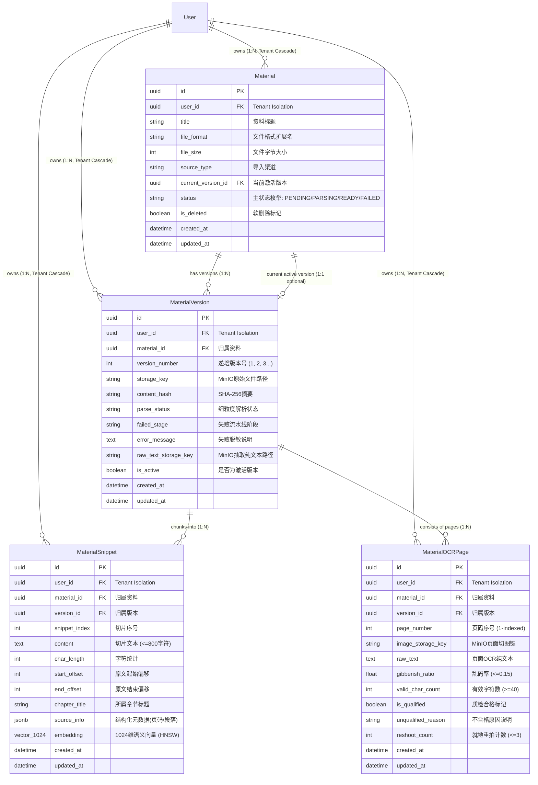
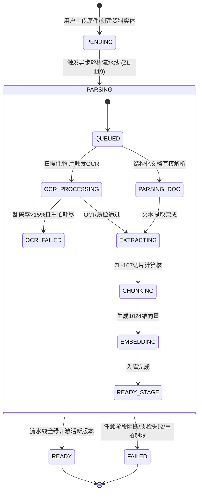

# Spec: 学习资料、版本与知识片段存储模型 (含 pgvector) - 技术契约

- **关联 Intent**: ZL-104
- **主导设计人**: Dev
- **当前状态**: In-Review

---

## 1. 架构流向与设计方案

### 1.1 实体拓扑与数据流 (Mermaid)

本模块作为智练自主学习平台的基础持久化底座，承载学生自主导入学习材料的元数据、多版本快照、页级 OCR 质量门禁与向量知识切片。



### 1.2 核心调用链与生命周期状态机



1. **导入与版本分发**：用户上传资料时，若为首次导入则生成 `Material` 实体与第 1 个 `MaterialVersion`；若为同名或已有资料二次上传，通过比对 `content_hash`，若哈希一致则提示秒传或复用，若内容有变则新建递增版本 `version_number`，状态置为 `PENDING`。
2. **多租户与三元组隔离流向**：所有写操作与读检索强制携带 `user_id`。出题与向量近邻检索（`ZL-116` / `ZL-121`）必须基于 `(user_id, material_id, version_id)` 三元组复合过滤，彻底阻断历史废弃版本切片对出题召回的交叉污染。
3. **冷热数据分层与 MinIO 逃逸**：
   - 原始文件二进制与整篇文档解析后的几十万字纯文本（Raw Text）统一存储在 MinIO 对象存储中，数据库仅保存寻址键 `storage_key` 与 `raw_text_storage_key`；
   - 数据库仅持久化切片纯文本（$\le 800$ 字符）与 1024 维定长向量，杜绝 PostgreSQL 大型字段 TOAST 机制频繁 I/O 逃逸所导致的缓存击穿与性能退化。

---

## 2. API 与数据契约设计

### 2.1 实体模型声明式契约 (`backend/app/models/material.py`)

严格遵循 SQLAlchemy 2.0 声明式风格，全量实体继承 `Base, TimestampMixin, TenantModelMixin`。

#### 2.1.1 状态枚举与常量定义

```python
import enum


class MaterialStatus(str, enum.Enum):
    """资料主表生命周期状态枚举。"""

    PENDING = "pending"      # 等待解析/新建就绪
    PARSING = "parsing"      # 流水线解析中
    READY = "ready"          # 解析质检全部通过，可正常用于出题
    FAILED = "failed"        # 解析或质检失败


class ParseStatus(str, enum.Enum):
    """版本表细粒度解析流水线状态枚举。"""

    QUEUED = "queued"
    PARSING_DOC = "parsing_doc"
    OCR_PROCESSING = "ocr_processing"
    EXTRACTING_KNOWLEDGE = "extracting_knowledge"
    AUDITING_KNOWLEDGE = "auditing_knowledge"
    EMBEDDING_GENERATION = "embedding_generation"
    READY = "ready"
    FAILED = "failed"


class SourceType(str, enum.Enum):
    """资料导入渠道枚举。"""

    WECHAT = "wechat"        # 微信聊天会话/文档转发导入
    LOCAL = "local"          # 本地设备直接上传
```

#### 2.1.2 实体表结构定义契约

```python
import uuid
from typing import TYPE_CHECKING, Any

from sqlalchemy import (
    Boolean,
    Float,
    ForeignKey,
    Index,
    Integer,
    String,
    Text,
    UniqueConstraint,
)
from sqlalchemy.dialects.postgresql import JSONB, UUID
from sqlalchemy.orm import Mapped, mapped_column, relationship
from sqlalchemy.types import JSON

from app.models.base import Base, TenantModelMixin, TimestampMixin

if TYPE_CHECKING:
    from app.models.user import User


class Material(Base, TimestampMixin, TenantModelMixin):
    """学习资料主实体模型。
    
    代表用户上传的一份独立学习资料，管理其全局生命周期与当前激活版本。
    """

    __tablename__ = "materials"

    id: Mapped[uuid.UUID] = mapped_column(
        UUID(as_uuid=True),
        primary_key=True,
        default=uuid.uuid4,
        comment="资料主键 UUIDv4",
    )
    title: Mapped[str] = mapped_column(
        String(255),
        nullable=False,
        comment="资料标题 (展示文件名)",
    )
    file_format: Mapped[str] = mapped_column(
        String(32),
        nullable=False,
        comment="资料格式扩展名 (如 pdf, docx, pptx, md, txt, png, jpg)",
    )
    file_size: Mapped[int] = mapped_column(
        Integer,
        nullable=False,
        comment="原文件大小 (字节数)",
    )
    source_type: Mapped[str] = mapped_column(
        String(32),
        nullable=False,
        default=SourceType.LOCAL.value,
        comment="导入来源渠道 (wechat/local)",
    )
    current_version_id: Mapped[uuid.UUID | None] = mapped_column(
        UUID(as_uuid=True),
        ForeignKey("material_versions.id", ondelete="SET NULL", use_alter=True, name="fk_materials_current_version_id"),
        nullable=True,
        default=None,
        comment="当前激活的版本标识 UUIDv4",
    )
    status: Mapped[str] = mapped_column(
        String(32),
        nullable=False,
        default=MaterialStatus.PENDING.value,
        index=True,
        comment="资料生命周期主状态 (MaterialStatus)",
    )
    is_deleted: Mapped[bool] = mapped_column(
        Boolean,
        nullable=False,
        default=False,
        index=True,
        comment="软删除标记 (True表示回收站状态)",
    )

    # 关系映射
    versions: Mapped[list["MaterialVersion"]] = relationship(
        "MaterialVersion",
        back_populates="material",
        foreign_keys="MaterialVersion.material_id",
        cascade="all, delete-orphan",
        order_by="MaterialVersion.version_number.desc()",
    )
    current_version: Mapped["MaterialVersion | None"] = relationship(
        "MaterialVersion",
        foreign_keys=[current_version_id],
        post_update=True,
    )

    __table_args__ = (
        Index("ix_materials_user_is_deleted", "user_id", "is_deleted"),
        Index("ix_materials_user_status", "user_id", "status"),
    )

    def __repr__(self) -> str:
        """安全脱敏日志展示，严禁泄漏敏感凭证或全文。"""
        return f"<Material id={self.id} user_id={self.user_id} title={self.title[:20]} status={self.status}>"


class MaterialVersion(Base, TimestampMixin, TenantModelMixin):
    """学习资料历史版本与解析快照实体。
    
    承载每次上传/重新导入的不可变历史记录及 MinIO 路径映射。
    """

    __tablename__ = "material_versions"

    id: Mapped[uuid.UUID] = mapped_column(
        UUID(as_uuid=True),
        primary_key=True,
        default=uuid.uuid4,
        comment="版本主键 UUIDv4",
    )
    material_id: Mapped[uuid.UUID] = mapped_column(
        UUID(as_uuid=True),
        ForeignKey("materials.id", ondelete="CASCADE"),
        nullable=False,
        index=True,
        comment="关联资料主表标识",
    )
    version_number: Mapped[int] = mapped_column(
        Integer,
        nullable=False,
        default=1,
        comment="递增版本号 (1, 2, 3...)",
    )
    storage_key: Mapped[str] = mapped_column(
        String(512),
        nullable=False,
        comment="MinIO 原始文件存储键 (防重命名脱敏散列路径)",
    )
    content_hash: Mapped[str] = mapped_column(
        String(64),
        nullable=False,
        index=True,
        comment="原文件 SHA-256 摘要 (用于查重与秒传判定)",
    )
    parse_status: Mapped[str] = mapped_column(
        String(32),
        nullable=False,
        default=ParseStatus.QUEUED.value,
        comment="细粒度解析状态 (ParseStatus)",
    )
    failed_stage: Mapped[str | None] = mapped_column(
        String(64),
        nullable=True,
        default=None,
        comment="解析失败发生的阶段名称",
    )
    error_message: Mapped[str | None] = mapped_column(
        Text,
        nullable=True,
        default=None,
        comment="面向客户端展示的脱敏错误原因",
    )
    raw_text_storage_key: Mapped[str | None] = mapped_column(
        String(512),
        nullable=True,
        default=None,
        comment="MinIO 提取全量纯文本对象存储键 (规避大对象 TOAST 逃逸)",
    )
    is_active: Mapped[bool] = mapped_column(
        Boolean,
        nullable=False,
        default=True,
        comment="是否为当前激活版本",
    )

    # 关系映射
    material: Mapped["Material"] = relationship(
        "Material",
        back_populates="versions",
        foreign_keys=[material_id],
    )
    snippets: Mapped[list["MaterialSnippet"]] = relationship(
        "MaterialSnippet",
        back_populates="version",
        cascade="all, delete-orphan",
        order_by="MaterialSnippet.snippet_index.asc()",
    )
    ocr_pages: Mapped[list["MaterialOCRPage"]] = relationship(
        "MaterialOCRPage",
        back_populates="version",
        cascade="all, delete-orphan",
        order_by="MaterialOCRPage.page_number.asc()",
    )

    __table_args__ = (
        UniqueConstraint("material_id", "version_number", name="uq_material_versions_material_version"),
        Index("ix_material_versions_user_material", "user_id", "material_id"),
        Index("ix_material_versions_user_content_hash", "user_id", "content_hash"),
    )

    def __repr__(self) -> str:
        return f"<MaterialVersion id={self.id} material_id={self.material_id} v={self.version_number} status={self.parse_status}>"


class MaterialSnippet(Base, TimestampMixin, TenantModelMixin):
    """资料知识切片实体 (向量检索核心底座)。
    
    存储经 ZL-107 分块纯函数切分后的文本片段与 pgvector 1024 维嵌入向量。
    """

    __tablename__ = "material_snippets"

    id: Mapped[uuid.UUID] = mapped_column(
        UUID(as_uuid=True),
        primary_key=True,
        default=uuid.uuid4,
        comment="切片主键 UUIDv4",
    )
    material_id: Mapped[uuid.UUID] = mapped_column(
        UUID(as_uuid=True),
        ForeignKey("materials.id", ondelete="CASCADE"),
        nullable=False,
        index=True,
        comment="归属资料主键",
    )
    version_id: Mapped[uuid.UUID] = mapped_column(
        UUID(as_uuid=True),
        ForeignKey("material_versions.id", ondelete="CASCADE"),
        nullable=False,
        index=True,
        comment="归属版本标识",
    )
    snippet_index: Mapped[int] = mapped_column(
        Integer,
        nullable=False,
        comment="版本内连续片段序号 (0, 1, 2...)",
    )
    content: Mapped[str] = mapped_column(
        Text,
        nullable=False,
        comment="切片纯文本内容 (硬性约束 <=800 字符)",
    )
    char_length: Mapped[int] = mapped_column(
        Integer,
        nullable=False,
        comment="片段字符总数",
    )
    start_offset: Mapped[int] = mapped_column(
        Integer,
        nullable=False,
        comment="原文档全文起始字符偏移量",
    )
    end_offset: Mapped[int] = mapped_column(
        Integer,
        nullable=False,
        comment="原文档全文终止字符偏移量",
    )
    chapter_title: Mapped[str] = mapped_column(
        String(255),
        nullable=False,
        default="",
        comment="所属章节或标题上下文",
    )
    source_info: Mapped[dict[str, Any]] = mapped_column(
        JSON().with_variant(JSONB, "postgresql"),
        nullable=False,
        default=dict,
        comment="来源结构化元数据 (如 doc_type, page_number, paragraph_index)",
    )
    embedding: Mapped[Any] = mapped_column(
        # 兼容性包装: PostgreSQL 下为 pgvector.sqlalchemy.Vector(1024), 本地测试 SQLite 下平滑回退
        get_vector_type(1024),
        nullable=True,
        comment="1024 维定长语义向量 (bge-large-zh-v1.5 / text-embedding-v3)",
    )

    # 关系映射
    version: Mapped["MaterialVersion"] = relationship(
        "MaterialVersion",
        back_populates="snippets",
        foreign_keys=[version_id],
    )
    material: Mapped["Material"] = relationship(
        "Material",
        foreign_keys=[material_id],
    )

    __table_args__ = (
        UniqueConstraint("version_id", "snippet_index", name="uq_material_snippets_version_index"),
        # 三元组隔离索引: 确保多租户与版本防交叉污染查询走覆盖索引
        Index("ix_material_snippets_user_mat_ver", "user_id", "material_id", "version_id"),
        # HNSW 向量余弦索引定义 (仅在 PostgreSQL 生产环境中激活)
        Index(
            "ix_material_snippets_embedding_hnsw",
            "embedding",
            postgresql_using="hnsw",
            postgresql_with={"m": 16, "ef_construction": 200},
            postgresql_ops={"embedding": "vector_cosine_ops"},
        ),
    )

    def __repr__(self) -> str:
        """安全脱敏日志展示，严禁打印 content 全文。"""
        return f"<MaterialSnippet id={self.id} ver_id={self.version_id} idx={self.snippet_index} len={self.char_length}>"


class MaterialOCRPage(Base, TimestampMixin, TenantModelMixin):
    """页级 OCR 质量门禁与就地重拍记录实体。
    
    承载逐页乱码率校验、字数质检、标黄展示与就地重拍 (<=3 次)。
    """

    __tablename__ = "material_ocr_pages"

    id: Mapped[uuid.UUID] = mapped_column(
        UUID(as_uuid=True),
        primary_key=True,
        default=uuid.uuid4,
        comment="页级记录主键 UUIDv4",
    )
    material_id: Mapped[uuid.UUID] = mapped_column(
        UUID(as_uuid=True),
        ForeignKey("materials.id", ondelete="CASCADE"),
        nullable=False,
        index=True,
        comment="归属资料主键",
    )
    version_id: Mapped[uuid.UUID] = mapped_column(
        UUID(as_uuid=True),
        ForeignKey("material_versions.id", ondelete="CASCADE"),
        nullable=False,
        index=True,
        comment="归属版本标识",
    )
    page_number: Mapped[int] = mapped_column(
        Integer,
        nullable=False,
        comment="页码序号 (从 1 开始)",
    )
    image_storage_key: Mapped[str] = mapped_column(
        String(512),
        nullable=False,
        comment="MinIO 页面渲染切图存储键 (用于前端不合格高亮标黄展示)",
    )
    raw_text: Mapped[str] = mapped_column(
        Text,
        nullable=False,
        default="",
        comment="页面识别所得原始文本",
    )
    gibberish_ratio: Mapped[float] = mapped_column(
        Float,
        nullable=False,
        default=0.0,
        comment="乱码率 (0.00 ~ 1.00，门禁阈值 <= 0.15)",
    )
    valid_char_count: Mapped[int] = mapped_column(
        Integer,
        nullable=False,
        default=0,
        comment="有效识别字数统计 (门禁阈值 >= 40)",
    )
    is_qualified: Mapped[bool] = mapped_column(
        Boolean,
        nullable=False,
        default=True,
        index=True,
        comment="页面是否达到质检准出标准",
    )
    unqualified_reason: Mapped[str | None] = mapped_column(
        String(255),
        nullable=True,
        default=None,
        comment="不合格质检原因 (如: 乱码率过高[18.5%] 或 有效字数不足[22字])",
    )
    reshoot_count: Mapped[int] = mapped_column(
        Integer,
        nullable=False,
        default=0,
        comment="已就地重拍次数计数 (上限 3 次)",
    )

    # 关系映射
    version: Mapped["MaterialVersion"] = relationship(
        "MaterialVersion",
        back_populates="ocr_pages",
        foreign_keys=[version_id],
    )

    __table_args__ = (
        UniqueConstraint("version_id", "page_number", name="uq_material_ocr_pages_version_page"),
        Index("ix_material_ocr_pages_user_mat_ver", "user_id", "material_id", "version_id"),
        Index("ix_material_ocr_pages_version_qualified", "version_id", "is_qualified"),
    )

    def __repr__(self) -> str:
        return f"<MaterialOCRPage id={self.id} ver_id={self.version_id} page={self.page_number} qualified={self.is_qualified}>"
```

### 2.2 跨环境优雅降级兼容设计 (`get_vector_type`)

为解决本地 SQLite 内存单测或无原生 pgvector 扩展环境下的模型导入与基础测试阻断问题，设计如下降级工厂函数：

```python
from sqlalchemy.types import JSON, TypeEngine

def get_vector_type(dimensions: int = 1024) -> TypeEngine[Any]:
    """获取兼容多数据库方言的向量字段类型。
    
    在生产 PostgreSQL 环境下使用 pgvector.sqlalchemy.Vector(dimensions)；
    在 SQLite 单元测试环境下自动适配为 JSON 或 NullType，保证无原生 pgvector 环境下的 DDL 执行与普通字段断言。
    """
    try:
        from pgvector.sqlalchemy import Vector
        return Vector(dimensions).with_variant(JSON, "sqlite")
    except ImportError:
        # 当尚未安装 pgvector 依赖时的回退桩
        return JSON()
```

### 2.3 Alembic 迁移脚本契约架构 (`backend/migrations/versions/0002_create_material_tables_and_vector.py`)

```python
"""创建学习资料、版本、向量切片与 OCR 页面表 (含 pgvector 扩展)

Revision ID: 0002_materials_and_pgvector
Revises: 0001_initial_users
Create Date: 2026-09-23 20:00:00.000000
"""

from alembic import op
import sqlalchemy as sa
from sqlalchemy.dialects import postgresql

def upgrade() -> None:
    # 1. 幂等激活 pgvector 扩展 (PostgreSQL 专有)
    conn = op.get_bind()
    if conn.dialect.name == "postgresql":
        op.execute("CREATE EXTENSION IF NOT EXISTS vector;")

    # 2. 创建 materials 主表
    op.create_table(
        "materials",
        sa.Column("id", postgresql.UUID(as_uuid=True), primary_key=True),
        sa.Column("user_id", postgresql.UUID(as_uuid=True), sa.ForeignKey("users.id", ondelete="CASCADE"), nullable=False, index=True),
        sa.Column("title", sa.String(255), nullable=False),
        sa.Column("file_format", sa.String(32), nullable=False),
        sa.Column("file_size", sa.Integer(), nullable=False),
        sa.Column("source_type", sa.String(32), nullable=False, server_default="local"),
        sa.Column("current_version_id", postgresql.UUID(as_uuid=True), nullable=True),
        sa.Column("status", sa.String(32), nullable=False, server_default="pending"),
        sa.Column("is_deleted", sa.Boolean(), nullable=False, server_default=sa.text("false")),
        sa.Column("created_at", sa.DateTime(timezone=True), server_default=sa.func.now(), nullable=False),
        sa.Column("updated_at", sa.DateTime(timezone=True), server_default=sa.func.now(), nullable=False),
    )
    op.create_index("ix_materials_user_is_deleted", "materials", ["user_id", "is_deleted"])
    op.create_index("ix_materials_user_status", "materials", ["user_id", "status"])

    # 3. 创建 material_versions 版本表
    op.create_table(
        "material_versions",
        sa.Column("id", postgresql.UUID(as_uuid=True), primary_key=True),
        sa.Column("user_id", postgresql.UUID(as_uuid=True), sa.ForeignKey("users.id", ondelete="CASCADE"), nullable=False, index=True),
        sa.Column("material_id", postgresql.UUID(as_uuid=True), sa.ForeignKey("materials.id", ondelete="CASCADE"), nullable=False, index=True),
        sa.Column("version_number", sa.Integer(), nullable=False, server_default="1"),
        sa.Column("storage_key", sa.String(512), nullable=False),
        sa.Column("content_hash", sa.String(64), nullable=False, index=True),
        sa.Column("parse_status", sa.String(32), nullable=False, server_default="queued"),
        sa.Column("failed_stage", sa.String(64), nullable=True),
        sa.Column("error_message", sa.Text(), nullable=True),
        sa.Column("raw_text_storage_key", sa.String(512), nullable=True),
        sa.Column("is_active", sa.Boolean(), nullable=False, server_default=sa.text("true")),
        sa.Column("created_at", sa.DateTime(timezone=True), server_default=sa.func.now(), nullable=False),
        sa.Column("updated_at", sa.DateTime(timezone=True), server_default=sa.func.now(), nullable=False),
        sa.UniqueConstraint("material_id", "version_number", name="uq_material_versions_material_version"),
    )
    op.create_index("ix_material_versions_user_material", "material_versions", ["user_id", "material_id"])
    op.create_index("ix_material_versions_user_content_hash", "material_versions", ["user_id", "content_hash"])

    # 4. 解决循环外键: 为 materials.current_version_id 绑定外键约束 (use_alter)
    op.create_foreign_key(
        "fk_materials_current_version_id",
        "materials",
        "material_versions",
        ["current_version_id"],
        ["id"],
        ondelete="SET NULL",
        use_alter=True,
    )

    # 5. 创建 material_snippets 知识切片表
    if conn.dialect.name == "postgresql":
        from pgvector.sqlalchemy import Vector
        vector_type = Vector(1024)
    else:
        vector_type = sa.JSON()

    op.create_table(
        "material_snippets",
        sa.Column("id", postgresql.UUID(as_uuid=True), primary_key=True),
        sa.Column("user_id", postgresql.UUID(as_uuid=True), sa.ForeignKey("users.id", ondelete="CASCADE"), nullable=False, index=True),
        sa.Column("material_id", postgresql.UUID(as_uuid=True), sa.ForeignKey("materials.id", ondelete="CASCADE"), nullable=False, index=True),
        sa.Column("version_id", postgresql.UUID(as_uuid=True), sa.ForeignKey("material_versions.id", ondelete="CASCADE"), nullable=False, index=True),
        sa.Column("snippet_index", sa.Integer(), nullable=False),
        sa.Column("content", sa.Text(), nullable=False),
        sa.Column("char_length", sa.Integer(), nullable=False),
        sa.Column("start_offset", sa.Integer(), nullable=False),
        sa.Column("end_offset", sa.Integer(), nullable=False),
        sa.Column("chapter_title", sa.String(255), nullable=False, server_default=""),
        sa.Column("source_info", postgresql.JSONB(astext_type=sa.Text()), nullable=False),
        sa.Column("embedding", vector_type, nullable=True),
        sa.Column("created_at", sa.DateTime(timezone=True), server_default=sa.func.now(), nullable=False),
        sa.Column("updated_at", sa.DateTime(timezone=True), server_default=sa.func.now(), nullable=False),
        sa.UniqueConstraint("version_id", "snippet_index", name="uq_material_snippets_version_index"),
    )
    op.create_index("ix_material_snippets_user_mat_ver", "material_snippets", ["user_id", "material_id", "version_id"])

    # 创建 HNSW 向量索引 (PostgreSQL)
    if conn.dialect.name == "postgresql":
        op.create_index(
            "ix_material_snippets_embedding_hnsw",
            "material_snippets",
            ["embedding"],
            postgresql_using="hnsw",
            postgresql_with={"m": 16, "ef_construction": 200},
            postgresql_ops={"embedding": "vector_cosine_ops"},
        )

    # 6. 创建 material_ocr_pages 页面质检表
    op.create_table(
        "material_ocr_pages",
        sa.Column("id", postgresql.UUID(as_uuid=True), primary_key=True),
        sa.Column("user_id", postgresql.UUID(as_uuid=True), sa.ForeignKey("users.id", ondelete="CASCADE"), nullable=False, index=True),
        sa.Column("material_id", postgresql.UUID(as_uuid=True), sa.ForeignKey("materials.id", ondelete="CASCADE"), nullable=False, index=True),
        sa.Column("version_id", postgresql.UUID(as_uuid=True), sa.ForeignKey("material_versions.id", ondelete="CASCADE"), nullable=False, index=True),
        sa.Column("page_number", sa.Integer(), nullable=False),
        sa.Column("image_storage_key", sa.String(512), nullable=False),
        sa.Column("raw_text", sa.Text(), nullable=False, server_default=""),
        sa.Column("gibberish_ratio", sa.Float(), nullable=False, server_default="0.0"),
        sa.Column("valid_char_count", sa.Integer(), nullable=False, server_default="0"),
        sa.Column("is_qualified", sa.Boolean(), nullable=False, server_default=sa.text("true")),
        sa.Column("unqualified_reason", sa.String(255), nullable=True),
        sa.Column("reshoot_count", sa.Integer(), nullable=False, server_default="0"),
        sa.Column("created_at", sa.DateTime(timezone=True), server_default=sa.func.now(), nullable=False),
        sa.Column("updated_at", sa.DateTime(timezone=True), server_default=sa.func.now(), nullable=False),
        sa.UniqueConstraint("version_id", "page_number", name="uq_material_ocr_pages_version_page"),
    )
    op.create_index("ix_material_ocr_pages_user_mat_ver", "material_ocr_pages", ["user_id", "material_id", "version_id"])
    op.create_index("ix_material_ocr_pages_version_qualified", "material_ocr_pages", ["version_id", "is_qualified"])


def downgrade() -> None:
    # 严格对称逆序清理
    conn = op.get_bind()
    
    # 1. 删除 material_ocr_pages
    op.drop_table("material_ocr_pages")

    # 2. 删除 material_snippets (级联清理 HNSW 索引)
    op.drop_table("material_snippets")

    # 3. 移除 materials 循环外键约束
    op.drop_constraint("fk_materials_current_version_id", "materials", type_="foreignkey")

    # 4. 删除 material_versions
    op.drop_table("material_versions")

    # 5. 删除 materials
    op.drop_table("materials")
    
    # 注: vector 扩展不执行 DROP EXTENSION，以保障生产共享扩展实例稳定安全
```

---

## 3. 可测性设计 (Design for Testability)

### 3.1 独立纯函数计算核对接与验证
本任务属于数据持久化底座，自身不含网络请求或复杂 I/O 逻辑。所存储的数据结构与 `ZL-107`（`app.core.algorithms.material_chunking.Snippet`）无缝对接：
- 提供轻量转换纯函数核 `snippet_to_entity_dict(snippet: Snippet, user_id: UUID, material_id: UUID, version_id: UUID) -> dict[str, Any]`，负责从不可变 `Snippet` 数据类转化为 ORM 字典，保障 100% 单元测试分支覆盖。
- 提供安全日志脱敏校验核：验证 `Material.__repr__`、`MaterialSnippet.__repr__` 绝对不输出 `content`（防日志泄漏红线）。

### 3.2 外部依赖与 Mock/Fallback 策略
1. **轻量单元测试（毫秒级 SQLite）**：
   - 利用 `get_vector_type(1024)` 自动将向量类型与 HNSW 索引在 SQLite 下降级为兼容类型；
   - 保证全部字段默认值、枚举、软删除标记、多租户外键级联、复合唯一约束等纯模型逻辑在 SQLite 内存数据库中 3 秒内执行完毕。
2. **集成与数据库迁移测试（PostgreSQL 16 + pgvector）**：
   - 在真实集成测试环境中拉起带 pgvector 镜像的容器；
   - 验证 `upgrade()` 执行、`CREATE EXTENSION IF NOT EXISTS vector`、1024 维定长向量写入、HNSW 索引创建、余弦距离计算（`<=>` 操作符）以及对称 `downgrade()` 回滚后数据结构 100% 干净清除。

---

## 4. 替代方案与权衡考量 (Alternatives Considered & Trade-offs)

### 4.1 评估过的替代方案

1. **方案 A（采纳方案）：4 张独立实体表 + 对象存储分层 + pgvector 1024 维 HNSW**
   - 拆解为 `materials`, `material_versions`, `material_snippets`, `material_ocr_pages`；
   - 原文与大文本写入 MinIO，数据库仅存 800 字以内切片；切片表冗余 `user_id` 与 `version_id`。
2. **方案 B：单表大宽表设计（将版本与切片全塞入 materials 表的 JSONB 字段）**
   - 不设立版本表与切片表，在 materials 增加 `versions: jsonb` 与 `snippets: jsonb`。
3. **方案 C：全量长文本直接入库（`material_versions.raw_text: Text`）**
   - 解析抽取出的数十万字纯文本直接作为大文本字段存入 PostgreSQL 数据库行中。
4. **方案 D：切片表纯规范化（仅关联 `version_id`，不冗余 `user_id` 与 `material_id`）**
   - 严格遵循第 3 范式，查询时通过 `JOIN material_versions JOIN materials` 鉴权与过滤。

### 4.2 未采纳原因与权衡分析矩阵

| 评估维度 | 方案 A (采纳) | 方案 B (大宽表 JSONB) | 方案 C (全量文本入库) | 方案 D (纯范式无冗余) |
| :--- | :--- | :--- | :--- | :--- |
| **向量近邻检索性能** | **极高** (独立行 + HNSW 索引余弦度量，P95 < 50ms) | **不可用** (JSONB 内无法建立标准 HNSW 向量索引) | 相同 | **极低** (JOIN 导致无法直接利用 HNSW 过滤，索引扫描失效) |
| **多租户数据隔离安全** | **绝对安全** (每表带 `user_id` 复合索引，阻断水平越权) | 中 (需在应用层深度解析 JSON 校验) | 安全 | **高危** (切片表无 `user_id`，极易因忘记 JOIN 导致跨租户越权) |
| **存储 I/O 与 TOAST 影响** | **最优** (纯切片 <800 字不触发 TOAST，库体积精简) | 严重 (超大 JSONB 频繁读写造成行溢出与缓存穿透) | **灾难级** (长文档动辄几十万字，TOAST 频繁 I/O 导致全库性能雪崩) | 最优 |
| **版本隔离与并发更新** | **优** (新旧版本完全独立行，支持就地重拍与版本切换) | 差 (并发修改同一个资料时造成 JSONB 并发写丢失) | 优 | 优 |

**权衡裁定**：
- 否定方案 B：必须支持 pgvector HNSW 语义检索，JSONB 无法建立高效向量索引；
- 否定方案 C：坚决落实“冷热数据分层”，长文本全文逃逸至 MinIO 对象存储，杜绝 TOAST 膨胀；
- 否定方案 D：坚决落实多租户与三元组隔离铁律，向量检索场景下冗余 `(user_id, material_id, version_id)` 是保障检索延迟小于 200ms 且阻断版本交叉污染的唯一客观最优解。

---

## 5. 动态风险核验与回滚预案 (Risk & Rollback Verification)

### 5.1 7 大动态风险扫描

1. **Files 维度 (变更清单风险)**：
   - 新增 `backend/app/models/material.py`；
   - 修改 `backend/app/models/__init__.py` 导出实体与枚举；
   - 新增 Alembic 迁移脚本 `backend/migrations/versions/0002_create_material_tables_and_vector.py`；
   - 新增单元测试 `backend/tests/unit/models/test_material.py`；
   - 依赖文件 `backend/pyproject.toml` 引入 `pgvector>=0.3.0`。
   - 架构校验：`models` 层仅依赖 `base.py`，绝对不向上导入 `services` 或 `api`，`tooling/check_layers.py` 100% 通过。
2. **API 维度 (契约破坏风险)**：
   - 本任务为数据存储模型与 DDL 迁移，不暴露对外 HTTP 路由，无公共 API 破坏风险；
   - 为后续 `ZL-119` 解析流水线与 `ZL-116` 检索服务提供强类型 ORM 实体支撑。
3. **Schema 维度 (数据库表结构风险)**：
   - 4 张新表，`materials.current_version_id` 与 `material_versions.material_id` 存在双向引用；
   - 采用 `use_alter=True` 显式延迟外键创建，阻断循环引用导致的表初始化/删除死锁；
   - 唯一键约束与复合索引完整配置。
4. **Auth 维度 (多租户越权风险)**：
   - 4 张表均继承 `TenantModelMixin`，`user_id` 强制非空并设为 CASCADE 级联外键；
   - 切片与 OCR 页均具备 `(user_id, material_id, version_id)` 索引，所有业务查询强制显式限定 `user_id`。
5. **Deps 维度 (第三方依赖风险)**：
   - 引入 `pgvector>=0.3.0`。经验证兼容 Python 3.12+ 与 SQLAlchemy 2.0，无高危 CVE 漏洞；
   - 提供 `get_vector_type` 优雅降级，防止本地环境无 pgvector 时阻断开发与测试。
6. **Migration 维度 (数据库升降级风险)**：
   - 迁移脚本在 PostgreSQL 环境下前置 `CREATE EXTENSION IF NOT EXISTS vector;`；
   - 迁移脚本提供严格对称的 `downgrade()` 方法，按反向依赖顺序安全拆卸；
   - 具备幂等性与可重复执行性。
7. **Blast Radius 维度 (爆炸半径与性能破坏面)**：
   - **HNSW 索引构建耗时**：知识切片单资料上限 3000 条，批量写入且参数固定为 `m=16, ef_construction=200`，构建时间在 100ms 级别，不阻塞数据库主线程；
   - **TOAST 逃逸**：全文入 MinIO，切片 $\le 800$ 字符，不触发 TOAST；
   - **防外键崩溃**：业务层删除采用 `is_deleted=True` 软删除，彻底阻断级联删除引发的历史作答快照与出题记录雪崩。

### 5.2 回滚与故障应急策略

1. **开发与预发环境回滚**：
   - 执行 `alembic downgrade -1` 回滚最近一次迁移；
   - 降级逻辑先断开 `materials.current_version_id` 外键约束，再逐个安全 Drop 4 张表，最后清理关联索引。
2. **生产环境异常隔离预案**：
   - 若迁移执行中因云数据库权限问题无法 `CREATE EXTENSION vector`：由运维 DBA 预先在云 RDS 控制台开启 pgvector 插件后重试；
   - 若出现元数据状态异常：通过 `Material.status = FAILED` 快速标记熔断，不影响用户其他已有资料的正常练习。

---

## 6. 阶段准出签批 (Gate 2 Sign-off)
- [x] 架构流向与 API 契约已冻结
- [x] 替代方案已完成推演与权衡
- [x] 7 维风险已核验且具备明确回滚预案
- **审查结论**: Approved
- **签批人 / 日期**: yezisama / 2026-09-23
