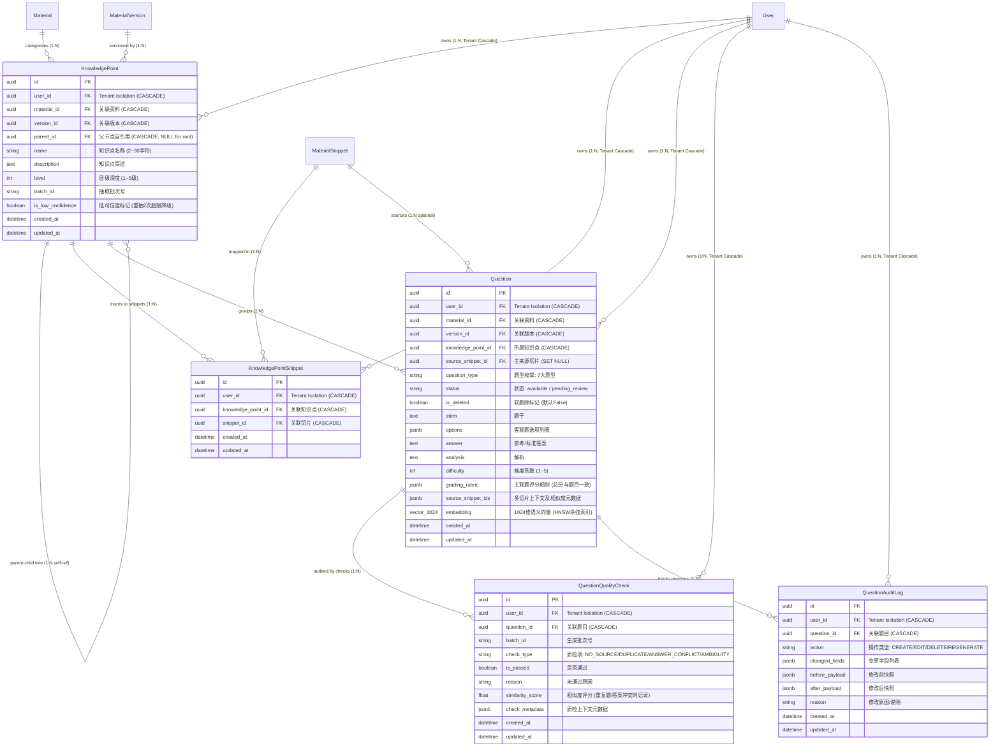
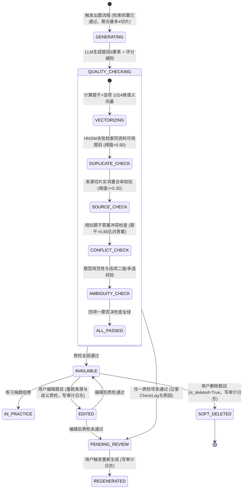

# Spec: 知识点与题目持久化数据模型及审计日志 - 技术契约

- **关联 Intent**: ZL-105
- **主导设计人**: Dev
- **当前状态**: In-Review

---

## 1. 架构流向与设计方案

### 1.1 实体拓扑与关系图 (Mermaid)

本模块作为智练自主学习平台的核心业务数据底座，承载全自动抽取知识点树形拓扑、知识点与切片双向溯源、7 大题型题目主实体（含 1024 维题干向量与 HNSW 查重索引）、四类质检拦截记录及修改痕迹审计日志。



### 1.2 核心调用链与生命周期状态机

#### 1.2.1 题目生成、质检过滤与状态流转



#### 1.2.2 多租户三元组隔离与版本防交叉污染数据流向

1. **三元组隔离流向**：系统所有针对知识点与题目的写操作和读检索，一律由服务层从有效 JWT 登录态注入 `user_id`。出题检索、组卷查询必须基于 `(user_id, material_id, version_id)` 三元组复合过滤，彻底阻断历史废弃版本数据和不同用户之间的交叉污染。
2. **知识点树拓扑管理**：落实 FR-14，知识点全自动抽取并建树，支持 2~5 级层级。根节点 `parent_id` 为 NULL（`level=1`），子节点指向父节点主键 `parent_id`。通过单表自引用邻接表配合应用层递归组装树形结构，避免深层递归 CTE 对数据库造成的性能抖动。
3. **向量去重作用域隔离**：题干语义向量查重检索作用域严格限定在同一租户同一资料已激活版本的可用题目集合（`user_id = :uid AND material_id = :mid AND status = 'available' AND is_deleted = false`），利用 HNSW 索引执行局部 Top-K 向量检索（P95 < 50ms）。

---

## 2. API 与数据契约设计

### 2.1 实体模型声明式契约

严格遵循 SQLAlchemy 2.0 声明式风格，全部实体继承 `Base, TimestampMixin, TenantModelMixin`。

#### 2.1.1 枚举类型定义契约

```python
import enum


class QuestionType(enum.StrEnum):
    """题目类型枚举 (覆盖需求 FR-20 规定的七大题型)。"""

    SINGLE_CHOICE = "single_choice"        # 单项选择题
    MULTIPLE_CHOICE = "multiple_choice"    # 多项选择题 (>=3选项, >=2正确项)
    TRUE_FALSE = "true_false"              # 判断题 (二值答案)
    FILL_IN_BLANK = "fill_in_blank"        # 填空题
    TERM_EXPLANATION = "term_explanation"  # 名词解释 (主观题)
    SHORT_ANSWER = "short_answer"          # 简答题 (主观题)
    CASE_ANALYSIS = "case_analysis"        # 案例分析 (主观题)


class QuestionStatus(enum.StrEnum):
    """题目状态生命周期枚举。"""

    AVAILABLE = "available"                # 质检合格，可用状态
    PENDING_REVIEW = "pending_review"      # 待处理区 (质检拦截/生成缺陷)


class QualityCheckType(enum.StrEnum):
    """题目质检检查项类型枚举 (覆盖需求 FR-24 四类一票否决检查)。"""

    NO_SOURCE = "NO_SOURCE"                # 无来源题目 (无片段或实词重合率<0.30)
    DUPLICATE = "DUPLICATE"                # 重复题 (向量相似度>0.90或字符相似度>0.85)
    ANSWER_CONFLICT = "ANSWER_CONFLICT"    # 答案冲突 (题干相似度>0.88但答案不同)
    AMBIGUITY = "AMBIGUITY"                # 明显歧义 (题干过短/选项冲突/答案不合规)


class AuditAction(enum.StrEnum):
    """题目生命周期审计操作动作枚举 (覆盖需求 FR-26 修改痕迹)。"""

    CREATE = "CREATE"                      # 初始生成入库
    EDIT = "EDIT"                          # 用户编辑修改
    DELETE = "DELETE"                      # 用户软删除
    REGENERATE = "REGENERATE"              # 重新生成替换
```

#### 2.1.2 知识点树与片段关联实体契约 (`backend/app/models/knowledge.py`)

```python
import uuid
from typing import TYPE_CHECKING

from sqlalchemy import (
    Boolean,
    ForeignKey,
    Index,
    Integer,
    String,
    Text,
    UniqueConstraint,
)
from sqlalchemy.dialects.postgresql import UUID
from sqlalchemy.orm import Mapped, mapped_column, relationship

from app.models.base import Base, TenantModelMixin, TimestampMixin

if TYPE_CHECKING:
    from app.models.material import Material, MaterialSnippet, MaterialVersion
    from app.models.question import Question


class KnowledgePoint(Base, TimestampMixin, TenantModelMixin):
    """知识点树形拓扑实体模型。

    承载大模型从知识片段中全自动抽取建树的知识点，支持 2~5 级层级结构。
    """

    __tablename__ = "knowledge_points"

    id: Mapped[uuid.UUID] = mapped_column(
        UUID(as_uuid=True),
        primary_key=True,
        default=uuid.uuid4,
        comment="知识点主键 UUIDv4",
    )
    material_id: Mapped[uuid.UUID] = mapped_column(
        UUID(as_uuid=True),
        ForeignKey("materials.id", ondelete="CASCADE"),
        nullable=False,
        index=True,
        comment="归属学习资料主键",
    )
    version_id: Mapped[uuid.UUID] = mapped_column(
        UUID(as_uuid=True),
        ForeignKey("material_versions.id", ondelete="CASCADE"),
        nullable=False,
        index=True,
        comment="归属资料版本标识",
    )
    parent_id: Mapped[uuid.UUID | None] = mapped_column(
        UUID(as_uuid=True),
        ForeignKey("knowledge_points.id", ondelete="CASCADE"),
        nullable=True,
        index=True,
        default=None,
        comment="父知识点主键 (自引用外键，根节点为空)",
    )
    name: Mapped[str] = mapped_column(
        String(255),
        nullable=False,
        comment="知识点名称 (质检约束 2~30 字符)",
    )
    description: Mapped[str] = mapped_column(
        Text,
        nullable=False,
        default="",
        comment="知识点简述/抽取摘要",
    )
    level: Mapped[int] = mapped_column(
        Integer,
        nullable=False,
        default=1,
        comment="知识点层级深度 (根节点为1，最大深度5)",
    )
    batch_id: Mapped[str] = mapped_column(
        String(64),
        nullable=False,
        index=True,
        comment="抽取批次号",
    )
    is_low_confidence: Mapped[bool] = mapped_column(
        Boolean,
        nullable=False,
        default=False,
        comment="低可信度标记 (重抽2次超限后降级标记，对应 FR-19/FR-53)",
    )

    # 关系映射
    parent: Mapped["KnowledgePoint | None"] = relationship(
        "KnowledgePoint",
        remote_side="KnowledgePoint.id",
        back_populates="children",
    )
    children: Mapped[list["KnowledgePoint"]] = relationship(
        "KnowledgePoint",
        back_populates="parent",
        cascade="all, delete-orphan",
    )
    snippet_mappings: Mapped[list["KnowledgePointSnippet"]] = relationship(
        "KnowledgePointSnippet",
        back_populates="knowledge_point",
        cascade="all, delete-orphan",
    )
    questions: Mapped[list["Question"]] = relationship(
        "Question",
        back_populates="knowledge_point",
        cascade="all, delete-orphan",
    )

    __table_args__ = (
        # 三元组隔离联合索引
        Index("ix_knowledge_points_user_mat_ver", "user_id", "material_id", "version_id"),
        # 父子拓扑检索索引
        Index("ix_knowledge_points_user_parent", "user_id", "parent_id"),
    )

    def __repr__(self) -> str:
        """安全脱敏表示，严禁泄漏敏感长文本。"""
        return (
            f"<KnowledgePoint id={self.id} user_id={self.user_id} "
            f"name={self.name[:20]} level={self.level} low_conf={self.is_low_confidence}>"
        )


class KnowledgePointSnippet(Base, TimestampMixin, TenantModelMixin):
    """知识点与切片双向溯源关联实体模型。

    落实需求 FR-15：从知识点可查到来源片段，从片段可查到知识点。
    """

    __tablename__ = "knowledge_point_snippets"

    id: Mapped[uuid.UUID] = mapped_column(
        UUID(as_uuid=True),
        primary_key=True,
        default=uuid.uuid4,
        comment="关联主键 UUIDv4",
    )
    knowledge_point_id: Mapped[uuid.UUID] = mapped_column(
        UUID(as_uuid=True),
        ForeignKey("knowledge_points.id", ondelete="CASCADE"),
        nullable=False,
        index=True,
        comment="关联知识点标识",
    )
    snippet_id: Mapped[uuid.UUID] = mapped_column(
        UUID(as_uuid=True),
        ForeignKey("material_snippets.id", ondelete="CASCADE"),
        nullable=False,
        index=True,
        comment="关联来源切片标识",
    )

    # 关系映射
    knowledge_point: Mapped["KnowledgePoint"] = relationship(
        "KnowledgePoint",
        back_populates="snippet_mappings",
    )
    snippet: Mapped["MaterialSnippet"] = relationship(
        "MaterialSnippet",
    )

    __table_args__ = (
        UniqueConstraint(
            "knowledge_point_id",
            "snippet_id",
            name="uq_knowledge_point_snippets_kp_snippet",
        ),
        Index("ix_kp_snippets_user_snippet", "user_id", "snippet_id"),
        Index("ix_kp_snippets_user_kp", "user_id", "knowledge_point_id"),
    )

    def __repr__(self) -> str:
        return f"<KnowledgePointSnippet id={self.id} kp_id={self.knowledge_point_id} snippet_id={self.snippet_id}>"
```

#### 2.1.3 题目主实体、质检记录与审计日志契约 (`backend/app/models/question.py`)

```python
import uuid
from typing import TYPE_CHECKING, Any

from sqlalchemy import (
    Boolean,
    Float,
    ForeignKey,
    Index,
    Integer,
    String,
    Text,
)
from sqlalchemy.dialects.postgresql import JSONB, UUID
from sqlalchemy.orm import Mapped, mapped_column, relationship
from sqlalchemy.types import JSON

from app.models.base import Base, TenantModelMixin, TimestampMixin
from app.models.material import get_vector_type

if TYPE_CHECKING:
    from app.models.knowledge import KnowledgePoint
    from app.models.material import MaterialSnippet


class Question(Base, TimestampMixin, TenantModelMixin):
    """题目主实体模型。

    覆盖单选、多选、判断、填空、名词解释、简答、案例分析 7 大题型；
    严格落实题目 6 要素及主观题评分细则；集成 1024 维语义向量与 HNSW 查重索引。
    """

    __tablename__ = "questions"

    id: Mapped[uuid.UUID] = mapped_column(
        UUID(as_uuid=True),
        primary_key=True,
        default=uuid.uuid4,
        comment="题目主键 UUIDv4",
    )
    material_id: Mapped[uuid.UUID] = mapped_column(
        UUID(as_uuid=True),
        ForeignKey("materials.id", ondelete="CASCADE"),
        nullable=False,
        index=True,
        comment="归属学习资料主键",
    )
    version_id: Mapped[uuid.UUID] = mapped_column(
        UUID(as_uuid=True),
        ForeignKey("material_versions.id", ondelete="CASCADE"),
        nullable=False,
        index=True,
        comment="归属资料版本标识",
    )
    knowledge_point_id: Mapped[uuid.UUID] = mapped_column(
        UUID(as_uuid=True),
        ForeignKey("knowledge_points.id", ondelete="CASCADE"),
        nullable=False,
        index=True,
        comment="所属知识点标识 (要素6)",
    )
    source_snippet_id: Mapped[uuid.UUID | None] = mapped_column(
        UUID(as_uuid=True),
        ForeignKey("material_snippets.id", ondelete="SET NULL"),
        nullable=True,
        index=True,
        comment="主来源切片标识 (要素5，支持外键追溯)",
    )
    question_type: Mapped[str] = mapped_column(
        String(32),
        nullable=False,
        index=True,
        comment="题型枚举 (QuestionType)",
    )
    status: Mapped[str] = mapped_column(
        String(32),
        nullable=False,
        default="available",
        index=True,
        comment="题目状态枚举: available(可用) / pending_review(待处理区)",
    )
    is_deleted: Mapped[bool] = mapped_column(
        Boolean,
        nullable=False,
        default=False,
        index=True,
        comment="软删除标记 (True表示已删除，与已有答卷解耦)",
    )

    # 题目 6 要素与扩展数据
    stem: Mapped[str] = mapped_column(
        Text,
        nullable=False,
        comment="题干全文 (要素1)",
    )
    options: Mapped[list[dict[str, Any]]] = mapped_column(
        JSON().with_variant(JSONB, "postgresql"),
        nullable=False,
        default=list,
        comment="客观题选项列表 (结构: [{'key': 'A', 'content': '...'}])",
    )
    answer: Mapped[str] = mapped_column(
        Text,
        nullable=False,
        comment="参考答案或标准答案 (要素2)",
    )
    analysis: Mapped[str] = mapped_column(
        Text,
        nullable=False,
        default="",
        comment="题目解析与知识点阐述 (要素3)",
    )
    difficulty: Mapped[int] = mapped_column(
        Integer,
        nullable=False,
        default=3,
        comment="难度系数 (要素4: 1~5 整数，默认3)",
    )
    grading_rubric: Mapped[dict[str, Any]] = mapped_column(
        JSON().with_variant(JSONB, "postgresql"),
        nullable=False,
        default=dict,
        comment="主观题评分细则 (JSONB: total_score, points清单及采分关键词)",
    )
    source_snippet_ids: Mapped[list[dict[str, Any]]] = mapped_column(
        JSON().with_variant(JSONB, "postgresql"),
        nullable=False,
        default=list,
        comment="多切片出题上下文列表 (含切片ID与相似度加权元数据)",
    )
    embedding: Mapped[Any] = mapped_column(
        get_vector_type(1024),
        nullable=True,
        comment="题干+选项 1024 维定长语义向量 (HNSW 余弦距离查重)",
    )

    # 关系映射
    knowledge_point: Mapped["KnowledgePoint"] = relationship(
        "KnowledgePoint",
        back_populates="questions",
    )
    source_snippet: Mapped["MaterialSnippet | None"] = relationship(
        "MaterialSnippet",
        foreign_keys=[source_snippet_id],
    )
    quality_checks: Mapped[list["QuestionQualityCheck"]] = relationship(
        "QuestionQualityCheck",
        back_populates="question",
        cascade="all, delete-orphan",
    )
    audit_logs: Mapped[list["QuestionAuditLog"]] = relationship(
        "QuestionAuditLog",
        back_populates="question",
        cascade="all, delete-orphan",
    )

    __table_args__ = (
        # 三元组与状态联合索引 (用于组卷与可用题目筛选)
        Index(
            "ix_questions_user_mat_ver_status",
            "user_id",
            "material_id",
            "version_id",
            "status",
            "is_deleted",
        ),
        # 知识点维度题目索引 (按知识点抽题与掌握度统计)
        Index("ix_questions_user_kp_deleted", "user_id", "knowledge_point_id", "is_deleted"),
        # pgvector HNSW 语义查重向量索引 (PostgreSQL)
        Index(
            "ix_questions_embedding_hnsw",
            "embedding",
            postgresql_using="hnsw",
            postgresql_with={"m": 16, "ef_construction": 200},
            postgresql_ops={"embedding": "vector_cosine_ops"},
        ),
    )

    def __repr__(self) -> str:
        """安全脱敏日志展示，严禁泄漏 stem, options, answer, analysis 与 grading_rubric。"""
        return (
            f"<Question id={self.id} user_id={self.user_id} type={self.question_type} "
            f"status={self.status} diff={self.difficulty} stem_len={len(self.stem)} "
            f"deleted={self.is_deleted}>"
        )


class QuestionQualityCheck(Base, TimestampMixin, TenantModelMixin):
    """题目质检检查结果记录实体。

    持久化四项一票否决式质检（无来源、重复题、答案冲突、明显歧义）明细。
    """

    __tablename__ = "question_quality_checks"

    id: Mapped[uuid.UUID] = mapped_column(
        UUID(as_uuid=True),
        primary_key=True,
        default=uuid.uuid4,
        comment="质检记录主键 UUIDv4",
    )
    question_id: Mapped[uuid.UUID] = mapped_column(
        UUID(as_uuid=True),
        ForeignKey("questions.id", ondelete="CASCADE"),
        nullable=False,
        index=True,
        comment="关联题目标识",
    )
    batch_id: Mapped[str] = mapped_column(
        String(64),
        nullable=False,
        index=True,
        comment="出题生成批次号",
    )
    check_type: Mapped[str] = mapped_column(
        String(32),
        nullable=False,
        comment="质检项类型 (QualityCheckType: NO_SOURCE/DUPLICATE/ANSWER_CONFLICT/AMBIGUITY)",
    )
    is_passed: Mapped[bool] = mapped_column(
        Boolean,
        nullable=False,
        comment="该质检项是否通过",
    )
    reason: Mapped[str | None] = mapped_column(
        String(255),
        nullable=True,
        default=None,
        comment="未通过原因说明 (如: 题干与题目[xxx]相似度0.93超限)",
    )
    similarity_score: Mapped[float | None] = mapped_column(
        Float,
        nullable=True,
        default=None,
        comment="比对相似度度量值 (重复题或答案冲突比对时保留)",
    )
    check_metadata: Mapped[dict[str, Any]] = mapped_column(
        JSON().with_variant(JSONB, "postgresql"),
        nullable=False,
        default=dict,
        comment="质检上下文诊断元数据 (如比对候选ID、关键词重合率等)",
    )

    # 关系映射
    question: Mapped["Question"] = relationship(
        "Question",
        back_populates="quality_checks",
    )

    __table_args__ = (
        Index("ix_question_quality_checks_user_batch", "user_id", "batch_id"),
        Index("ix_question_quality_checks_question_type", "question_id", "check_type"),
    )

    def __repr__(self) -> str:
        return (
            f"<QuestionQualityCheck id={self.id} q_id={self.question_id} "
            f"type={self.check_type} passed={self.is_passed}>"
        )


class QuestionAuditLog(Base, TimestampMixin, TenantModelMixin):
    """题目修改痕迹不可变审计日志实体。

    落实需求 FR-26：用户对题目的预览、修改、删除与重新生成全生命周期保留修改痕迹。
    """

    __tablename__ = "question_audit_logs"

    id: Mapped[uuid.UUID] = mapped_column(
        UUID(as_uuid=True),
        primary_key=True,
        default=uuid.uuid4,
        comment="审计日志主键 UUIDv4",
    )
    question_id: Mapped[uuid.UUID] = mapped_column(
        UUID(as_uuid=True),
        ForeignKey("questions.id", ondelete="CASCADE"),
        nullable=False,
        index=True,
        comment="关联题目标识",
    )
    action: Mapped[str] = mapped_column(
        String(32),
        nullable=False,
        comment="操作动作类型 (AuditAction: CREATE/EDIT/DELETE/REGENERATE)",
    )
    changed_fields: Mapped[list[str]] = mapped_column(
        JSON().with_variant(JSONB, "postgresql"),
        nullable=False,
        default=list,
        comment="本次变更涉及修改的字段名列表 (如: ['stem', 'options'])",
    )
    before_payload: Mapped[dict[str, Any]] = mapped_column(
        JSON().with_variant(JSONB, "postgresql"),
        nullable=False,
        default=dict,
        comment="修改前快照数据 (变更前字段键值摘要)",
    )
    after_payload: Mapped[dict[str, Any]] = mapped_column(
        JSON().with_variant(JSONB, "postgresql"),
        nullable=False,
        default=dict,
        comment="修改后快照数据 (变更后字段键值摘要)",
    )
    reason: Mapped[str | None] = mapped_column(
        String(255),
        nullable=True,
        default=None,
        comment="修改原因或操作备注",
    )

    # 关系映射
    question: Mapped["Question"] = relationship(
        "Question",
        back_populates="audit_logs",
    )

    __table_args__ = (
        Index("ix_question_audit_logs_user_q", "user_id", "question_id"),
        Index("ix_question_audit_logs_q_created", "question_id", "created_at"),
    )

    def __repr__(self) -> str:
        return (
            f"<QuestionAuditLog id={self.id} q_id={self.question_id} "
            f"action={self.action} fields={self.changed_fields}>"
        )
```

### 2.2 JSONB 模式约束契约

为杜绝非结构化数据脏读，规范以下 JSONB 列的内部 Schema：

1. **客观题选项字段 `options: list[dict]`**：
   ```json
   [
     {"key": "A", "content": "操作系统内核态与用户态的隔离机制"},
     {"key": "B", "content": "网络协议栈分层模型"},
     {"key": "C", "content": "虚拟内存分页管理机制"},
     {"key": "D", "content": "关系数据库 ACID 事务特性"}
   ]
   ```
2. **主观题评分细则字段 `grading_rubric: dict`**（严格满足 FR-22 要点分值总和与题目总分一致）：
   ```json
   {
     "total_score": 10,
     "points": [
       {
         "point_id": 1,
         "description": "准确解释分页机制的逻辑地址到物理地址转换过程",
         "score": 4,
         "keywords": ["页表", "页目录", "MMU", "物理页框"],
         "negative_keywords": ["分段", "无地址转换"]
       },
       {
         "point_id": 2,
         "description": "阐述快表 TLB 的加速查找原理与命中判定",
         "score": 3,
         "keywords": ["TLB", "快表", "命中率", "并行查找"],
         "negative_keywords": []
       },
       {
         "point_id": 3,
         "description": "说明缺页异常 Page Fault 的中断处理流程",
         "score": 3,
         "keywords": ["缺页中断", "调页", "页面置换", "磁盘I/O"],
         "negative_keywords": ["直接崩溃", "静默忽略"]
       }
     ]
   }
   ```
3. **多切片出题上下文 `source_snippet_ids: list[dict]`**（聚合 2~4 个切片）：
   ```json
   [
     {
       "snippet_id": "c1f7a049-74d3-460d-83b5-7798c19eb991",
       "is_primary": true,
       "similarity_score": 0.88,
       "keyword_hit_ratio": 0.45
     },
     {
       "snippet_id": "e2a3b4c5-89d1-4321-abcd-ef0123456789",
       "is_primary": false,
       "similarity_score": 0.76,
       "keyword_hit_ratio": 0.30
     }
   ]
   ```

### 2.3 Alembic 迁移脚本契约架构 (`0002_create_knowledge_and_question_tables.py`)

```python
"""Create knowledge_points, knowledge_point_snippets, questions, question_quality_checks, and question_audit_logs tables.

Revision ID: 0002_create_knowledge_and_question_tables
Revises: 0001_create_material_tables_and_vector
Create Date: 2026-09-23 21:00:00.000000
"""

from collections.abc import Sequence
import sqlalchemy as sa
from alembic import op
from sqlalchemy.dialects import postgresql

revision: str = "0002_create_knowledge_and_question_tables"
down_revision: str | None = "0001_create_material_tables_and_vector"
branch_labels: Sequence[str] | None = None
depends_on: Sequence[str] | None = None


def upgrade() -> None:
    conn = op.get_bind()

    # 类型方言判断
    if conn.dialect.name == "postgresql":
        from pgvector.sqlalchemy import Vector
        vector_type: sa.types.TypeEngine = Vector(1024)
        json_type: sa.types.TypeEngine = postgresql.JSONB(astext_type=sa.Text())
    else:
        vector_type = sa.JSON()
        json_type = sa.JSON()

    # 1. 创建 knowledge_points 表
    op.create_table(
        "knowledge_points",
        sa.Column("id", postgresql.UUID(as_uuid=True), primary_key=True),
        sa.Column("user_id", postgresql.UUID(as_uuid=True), sa.ForeignKey("users.id", ondelete="CASCADE"), nullable=False, index=True),
        sa.Column("material_id", postgresql.UUID(as_uuid=True), sa.ForeignKey("materials.id", ondelete="CASCADE"), nullable=False, index=True),
        sa.Column("version_id", postgresql.UUID(as_uuid=True), sa.ForeignKey("material_versions.id", ondelete="CASCADE"), nullable=False, index=True),
        sa.Column("parent_id", postgresql.UUID(as_uuid=True), sa.ForeignKey("knowledge_points.id", ondelete="CASCADE"), nullable=True, index=True),
        sa.Column("name", sa.String(255), nullable=False),
        sa.Column("description", sa.Text(), nullable=False, server_default=""),
        sa.Column("level", sa.Integer(), nullable=False, server_default="1"),
        sa.Column("batch_id", sa.String(64), nullable=False, index=True),
        sa.Column("is_low_confidence", sa.Boolean(), nullable=False, server_default=sa.text("false")),
        sa.Column("created_at", sa.DateTime(timezone=True), server_default=sa.func.now(), nullable=False),
        sa.Column("updated_at", sa.DateTime(timezone=True), server_default=sa.func.now(), nullable=False),
    )
    op.create_index("ix_knowledge_points_user_mat_ver", "knowledge_points", ["user_id", "material_id", "version_id"])
    op.create_index("ix_knowledge_points_user_parent", "knowledge_points", ["user_id", "parent_id"])

    # 2. 创建 knowledge_point_snippets 关联表
    op.create_table(
        "knowledge_point_snippets",
        sa.Column("id", postgresql.UUID(as_uuid=True), primary_key=True),
        sa.Column("user_id", postgresql.UUID(as_uuid=True), sa.ForeignKey("users.id", ondelete="CASCADE"), nullable=False, index=True),
        sa.Column("knowledge_point_id", postgresql.UUID(as_uuid=True), sa.ForeignKey("knowledge_points.id", ondelete="CASCADE"), nullable=False, index=True),
        sa.Column("snippet_id", postgresql.UUID(as_uuid=True), sa.ForeignKey("material_snippets.id", ondelete="CASCADE"), nullable=False, index=True),
        sa.Column("created_at", sa.DateTime(timezone=True), server_default=sa.func.now(), nullable=False),
        sa.Column("updated_at", sa.DateTime(timezone=True), server_default=sa.func.now(), nullable=False),
        sa.UniqueConstraint("knowledge_point_id", "snippet_id", name="uq_knowledge_point_snippets_kp_snippet"),
    )
    op.create_index("ix_kp_snippets_user_snippet", "knowledge_point_snippets", ["user_id", "snippet_id"])
    op.create_index("ix_kp_snippets_user_kp", "knowledge_point_snippets", ["user_id", "knowledge_point_id"])

    # 3. 创建 questions 题目主表
    op.create_table(
        "questions",
        sa.Column("id", postgresql.UUID(as_uuid=True), primary_key=True),
        sa.Column("user_id", postgresql.UUID(as_uuid=True), sa.ForeignKey("users.id", ondelete="CASCADE"), nullable=False, index=True),
        sa.Column("material_id", postgresql.UUID(as_uuid=True), sa.ForeignKey("materials.id", ondelete="CASCADE"), nullable=False, index=True),
        sa.Column("version_id", postgresql.UUID(as_uuid=True), sa.ForeignKey("material_versions.id", ondelete="CASCADE"), nullable=False, index=True),
        sa.Column("knowledge_point_id", postgresql.UUID(as_uuid=True), sa.ForeignKey("knowledge_points.id", ondelete="CASCADE"), nullable=False, index=True),
        sa.Column("source_snippet_id", postgresql.UUID(as_uuid=True), sa.ForeignKey("material_snippets.id", ondelete="SET NULL"), nullable=True, index=True),
        sa.Column("question_type", sa.String(32), nullable=False, index=True),
        sa.Column("status", sa.String(32), nullable=False, server_default="available", index=True),
        sa.Column("is_deleted", sa.Boolean(), nullable=False, server_default=sa.text("false"), index=True),
        sa.Column("stem", sa.Text(), nullable=False),
        sa.Column("options", json_type, nullable=False),
        sa.Column("answer", sa.Text(), nullable=False),
        sa.Column("analysis", sa.Text(), nullable=False, server_default=""),
        sa.Column("difficulty", sa.Integer(), nullable=False, server_default="3"),
        sa.Column("grading_rubric", json_type, nullable=False),
        sa.Column("source_snippet_ids", json_type, nullable=False),
        sa.Column("embedding", vector_type, nullable=True),
        sa.Column("created_at", sa.DateTime(timezone=True), server_default=sa.func.now(), nullable=False),
        sa.Column("updated_at", sa.DateTime(timezone=True), server_default=sa.func.now(), nullable=False),
    )
    op.create_index(
        "ix_questions_user_mat_ver_status",
        "questions",
        ["user_id", "material_id", "version_id", "status", "is_deleted"],
    )
    op.create_index("ix_questions_user_kp_deleted", "questions", ["user_id", "knowledge_point_id", "is_deleted"])

    # 创建 questions.embedding 的 HNSW 向量索引 (PostgreSQL)
    if conn.dialect.name == "postgresql":
        op.create_index(
            "ix_questions_embedding_hnsw",
            "questions",
            ["embedding"],
            postgresql_using="hnsw",
            postgresql_with={"m": 16, "ef_construction": 200},
            postgresql_ops={"embedding": "vector_cosine_ops"},
        )

    # 4. 创建 question_quality_checks 质检记录表
    op.create_table(
        "question_quality_checks",
        sa.Column("id", postgresql.UUID(as_uuid=True), primary_key=True),
        sa.Column("user_id", postgresql.UUID(as_uuid=True), sa.ForeignKey("users.id", ondelete="CASCADE"), nullable=False, index=True),
        sa.Column("question_id", postgresql.UUID(as_uuid=True), sa.ForeignKey("questions.id", ondelete="CASCADE"), nullable=False, index=True),
        sa.Column("batch_id", sa.String(64), nullable=False, index=True),
        sa.Column("check_type", sa.String(32), nullable=False),
        sa.Column("is_passed", sa.Boolean(), nullable=False),
        sa.Column("reason", sa.String(255), nullable=True),
        sa.Column("similarity_score", sa.Float(), nullable=True),
        sa.Column("check_metadata", json_type, nullable=False),
        sa.Column("created_at", sa.DateTime(timezone=True), server_default=sa.func.now(), nullable=False),
        sa.Column("updated_at", sa.DateTime(timezone=True), server_default=sa.func.now(), nullable=False),
    )
    op.create_index("ix_question_quality_checks_user_batch", "question_quality_checks", ["user_id", "batch_id"])
    op.create_index("ix_question_quality_checks_question_type", "question_quality_checks", ["question_id", "check_type"])

    # 5. 创建 question_audit_logs 审计日志表
    op.create_table(
        "question_audit_logs",
        sa.Column("id", postgresql.UUID(as_uuid=True), primary_key=True),
        sa.Column("user_id", postgresql.UUID(as_uuid=True), sa.ForeignKey("users.id", ondelete="CASCADE"), nullable=False, index=True),
        sa.Column("question_id", postgresql.UUID(as_uuid=True), sa.ForeignKey("questions.id", ondelete="CASCADE"), nullable=False, index=True),
        sa.Column("action", sa.String(32), nullable=False),
        sa.Column("changed_fields", json_type, nullable=False),
        sa.Column("before_payload", json_type, nullable=False),
        sa.Column("after_payload", json_type, nullable=False),
        sa.Column("reason", sa.String(255), nullable=True),
        sa.Column("created_at", sa.DateTime(timezone=True), server_default=sa.func.now(), nullable=False),
        sa.Column("updated_at", sa.DateTime(timezone=True), server_default=sa.func.now(), nullable=False),
    )
    op.create_index("ix_question_audit_logs_user_q", "question_audit_logs", ["user_id", "question_id"])
    op.create_index("ix_question_audit_logs_q_created", "question_audit_logs", ["question_id", "created_at"])


def downgrade() -> None:
    # 严格对称反向清理
    op.drop_table("question_audit_logs")
    op.drop_table("question_quality_checks")
    op.drop_table("questions")
    op.drop_table("knowledge_point_snippets")
    op.drop_table("knowledge_points")
```

---

## 3. 可测性设计 (Design for Testability)

### 3.1 独立纯函数计算核对接与脱敏校验

本模块属于核心数据持久化底座，遵循 KISS 原则与架构单向依赖。为保证高可靠性与可测性，设计以下纯函数校验逻辑：

1. **题目 6 要素完整性与评分细则分值核算纯函数 (`validate_question_payload`)**：
   - 纯函数签名：`validate_question_payload(question_data: dict[str, Any]) -> tuple[bool, str | None]`；
   - 校验逻辑：验证客观题选项列表是否非空，主观题 `grading_rubric` 内部的 `points` 分值之和是否严格等于 `total_score`，确保入库前数据绝对合规。
2. **实体安全脱敏断言测试 (`test_model_repr_redaction`)**：
   - 专门单测：遍历 `Question`, `KnowledgePoint`, `QuestionQualityCheck`, `QuestionAuditLog` 的 `__repr__` 输出；
   - 绝对断言：`stem`, `answer`, `analysis`, `options` 与 `grading_rubric` 的任何文本片段严禁出现在输出字符串中，防止生产日志引发绝密数据泄露。

### 3.2 外部依赖与 Mock/Fallback 策略

1. **轻量单元测试（毫秒级 SQLite 内存测试）**：
   - 借助 `get_vector_type(1024)`，SQLite 方言下将 `Vector(1024)` 自动降级映射为 `JSON`，HNSW 索引定义在非 PostgreSQL 环境下被 DDL 编译器安全忽略；
   - 覆盖所有实体的默认值、字段非空、自引用树级联删除、枚举有效性、软删除状态流转及复合索引。
2. **集成测试与数据库迁移（PostgreSQL 16 + pgvector）**：
   - 在真实 PG 16 环境中执行 `alembic upgrade`，验证 5 张表、全部外键索引与 HNSW 向量索引的创建；
   - 执行 `alembic downgrade -1`，验证表与索引双向 100% 干净回滚；
   - 验证向量插入与余弦距离度量（`<=>` 操作符），验证相似度大于 0.90 的查询能在毫秒级响应。

---

## 4. 替代方案与权衡考量 (Alternatives Considered & Trade-offs)

### 4.1 知识点层级拓扑方案权衡

- **方案 A（采纳方案）：邻接表（Adjacency List with `parent_id` 自引用外键）**
  - **实现**：`parent_id: UUID | None` 外键指向自身 `knowledge_points.id`，级联删除设置为 `CASCADE`。
  - **优势**：结构最简洁自然（KISS 原则），与需求 FR-14 规定的“2~5 级浅层结构”高度契合；创建与修改节点只需更新单行记录；删除父节点时由数据库外键机制自动级联清理全部子孙节点；应用层仅需一次单表查询（按 `material_id, version_id` 加载整树，单树节点一般几十个），在内存中通过字典一次性构建树形结构，耗时 < 1ms。
  - **权衡考量**：虽然无递归 CTE 查询时无法通过单一 SQL 取任意深度的子树，但由于本项目知识点树极其轻量（最大 5 级、单资料节点数 $\le 200$），全表加载后在应用层建树远比复杂的物化路径更稳健。
- **方案 B：物化路径（Materialized Path，如 `path: "root/kp1/kp2"`）**
  - **未采纳原因**：节点移动或重命名时需批量更新全部子孙节点的路径字符串；路径字符串拼接容易引入格式错误，破坏强类型一致性；无法利用外键约束保障树节点完整性。
- **方案 C：闭包表（Closure Table，独立存储 ancestor-descendant 关系）**
  - **未采纳原因**：过度抽象（违反 KISS 原则）。为 2~5 级的浅层树引入额外的关系表成倍增加了写入与删除的事务负担。

### 4.2 题目多题型存储模型权衡

- **方案 A（采纳方案）：单表多态 + JSONB 扩展（Single Table with polymorphic JSONB）**
  - **实现**：全部 7 大题型统一存储于 `questions` 表，共享 6 要素；客观题选项使用 `options: JSONB`，主观题评分细则使用 `grading_rubric: JSONB`，题干统一建立 1024 维 HNSW 索引。
  - **优势**：组卷出题时往往需要跨题型混合抽题（如“10道单选 + 5道多选 + 2道简答”），单表查询无需执行昂贵的多表 `OUTER JOIN`；题干向量去重检索只需在单一表上执行 HNSW 余弦度量，极大简化索引维护；开发复杂度低，性能最佳。
- **方案 B：类表继承（Joined-Table Inheritance）**
  - **未采纳原因**：为 7 个题型创建 7 张子表（如 `single_choice_questions`, `short_answer_questions` 等）。在生成题目、组卷以及跨题型去重时，需要全连接 8 张表，导致 SQL 查询计划极度臃肿，且向量索引分散难以统一查重。
- **方案 C：题型独立表（Concrete Table Inheritance）**
  - **未采纳原因**：完全独立的 7 张表导致无法统一定义外键关系（例如练习答卷和错题本需要引用题目 ID），严重破坏领域模型一致性。

### 4.3 知识点与切片映射关系权衡

- **方案 A（采纳方案）：独立关联表 `knowledge_point_snippets`**
  - **优势**：外键完整性约束（`CASCADE` 级联删除）；支持高效的双向索引反查（既能从知识点查来源切片，又能从切片反查覆盖的知识点，满足 FR-15）；在切片版本迭代或更新时，数据库引擎自动保障数据一致性。
- **方案 B：在 `knowledge_points` 表中通过 JSONB 数组 `snippet_ids` 存储**
  - **未采纳原因**：缺乏数据库级外键完整性约束，当切片被删除或资料被更新时，极易产生悬挂指针（幽灵 ID）；从切片反查知识点需要进行 JSONB 包含查询（`@>`），在大数据量下查询性能显著低于标准 B-Tree 索引。

### 4.4 方案权衡决策矩阵

| 评估维度 | 采纳方案 (方案 A) | 替代方案 B | 替代方案 C |
| :--- | :--- | :--- | :--- |
| **树拓扑维护性 (2~5级)** | **极优** (邻接表, 结构清晰, 级联删除安全) | 中 (物化路径, 字符串维护成本高) | 差 (闭包表, 过度抽象, 存储膨胀) |
| **组卷跨题型查询性能** | **极高** (单表加索引, P95 < 20ms) | 差 (7表 JOIN, 查询计划臃肿) | 极差 (需 Union 7张独立表) |
| **语义查重 HNSW 表现** | **最佳** (单表统一 1024 维向量索引) | 复杂 (需在多张子表分别建向量索引) | 复杂 (分散索引无法全局 Top-K) |
| **多切片双向溯源一致性** | **绝对可靠** (独立关联表, CASCADE 保证) | 差 (JSONB 数组容易出现悬挂外键) | - |

---

## 5. 动态风险核验与回滚预案 (Risk & Rollback Verification)

### 5.1 7 大动态风险扫描

1. **Files 维度 (变更清单风险)**：
   - 新增 `backend/app/models/knowledge.py`（定义 `KnowledgePoint`, `KnowledgePointSnippet`）；
   - 新增 `backend/app/models/question.py`（定义 `Question`, `QuestionQualityCheck`, `QuestionAuditLog` 及枚举）；
   - 修改 `backend/app/models/__init__.py`（导出新实体模型与枚举）；
   - 新增迁移脚本 `backend/migrations/versions/0002_create_knowledge_and_question_tables.py`；
   - 新增单测 `backend/tests/unit/models/test_knowledge.py` 与 `test_question.py`；
   - 架构校验：`models` 层绝对不向上导入 `services` 或 `api`，`tooling/check_layers.py` 严格 0 违规。
2. **API 维度 (契约破坏风险)**：
   - 本任务为数据存储模型与 DDL 迁移，不暴露对外 HTTP 路由，无破坏现有公共 API 契约风险；
   - 为后续 `ZL-120`（知识点建树抽取）与 `ZL-121`（题目生成与质检）提供标准强类型模型底座。
3. **Schema 维度 (数据库表结构风险)**：
   - 新增 5 张表，所有涉及自引用或父子引用的外键均明确指定 `ondelete="CASCADE"` 或 `ondelete="SET NULL"`，无悬空外键风险；
   - 字段约束完备：`status`, `question_type`, `level`, `difficulty` 均具备默认值与非空约束。
4. **Auth 维度 (多租户越权风险)**：
   - 5 张表均继承 `TenantModelMixin`，`user_id` 强制非空并设为 CASCADE 级联外键；
   - 均建立 `(user_id, ...)` 前导复合索引，所有业务查询强制携带 `user_id`，杜绝水平越权。
5. **Deps 维度 (第三方依赖风险)**：
   - 沿用现有 `pgvector>=0.3.0` 与 `SQLAlchemy>=2.0.0`，不引入任何新的第三方库依赖；
   - 向量类型使用 `get_vector_type(1024)` 保持跨数据库方言（SQLite / PG）兼容。
6. **Migration 维度 (数据库升降级风险)**：
   - 迁移脚本在 `upgrade()` 中按依赖顺序建表并建立 HNSW 索引；
   - 迁移脚本在 `downgrade()` 中严格逆序执行 `op.drop_table`，保障可重复降级与升降级双向测试 100% 成功。
7. **Blast Radius 维度 (爆炸半径与性能破坏面)**：
   - **HNSW 索引构建耗时**：题目数量单资料通常在 20~100 道，全库规模可控，HNSW 索引增量构建在毫秒级；
   - **题目软删除保护**：删除题目通过 `is_deleted=True` 软删除，绝不物理删除已有题目，彻底避免历史答卷和错题本快照失效；
   - **日志绝密脱敏**：`__repr__` 彻底规避题干、答案与评分细则原文输出，杜绝敏感内容泄露入结构化日志。

### 5.2 回滚与故障应急策略

1. **开发与预发环境回滚**：
   - 执行 `alembic downgrade -1`；
   - 降级逻辑按逆序安全移除 `question_audit_logs`、`question_quality_checks`、`questions`、`knowledge_point_snippets`、`knowledge_points` 5 张表及关联 HNSW 索引。
2. **生产环境异常隔离预案**：
   - 若出现题干向量维度不匹配或 HNSW 索引异常：服务层质检逻辑自动降级为纯文本字符相似度查重（阈值 0.85），不阻塞出题核心链路；
   - 若个别题目存在解析或质检异常：通过 `status = 'pending_review'` 将问题题目安全隔离在待处理区，不影响用户正常进行练习组卷。

---

## 6. 阶段准出签批 (Gate 2 Sign-off)
- [x] 架构流向与 API 契约已冻结
- [x] 替代方案已完成推演与权衡
- [x] 7 维风险已核验且具备明确回滚预案
- **审查结论**: Approved
- **签批人 / 日期**: User / 2026-09-23 20:25
