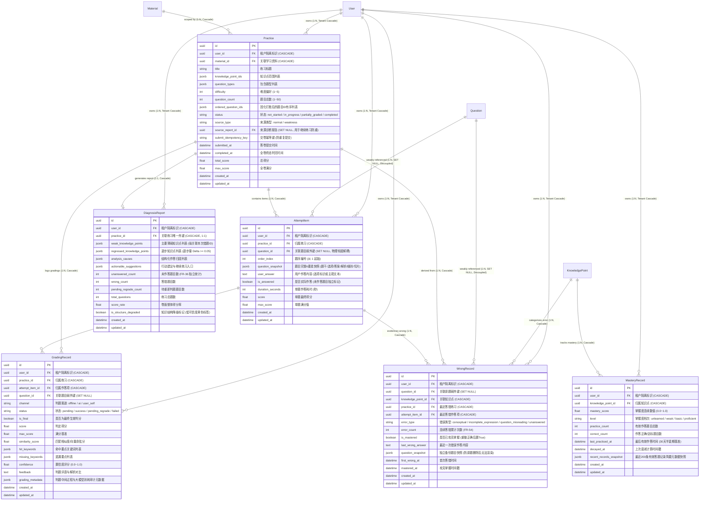
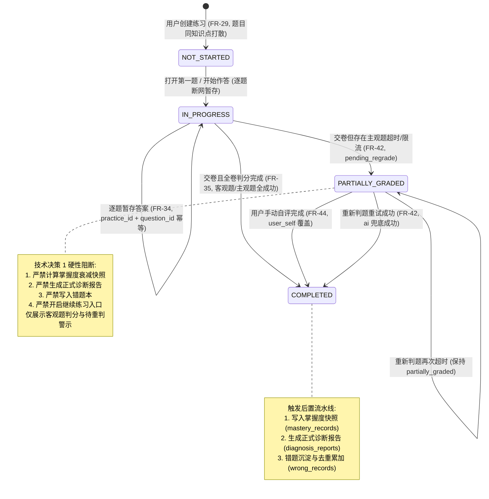
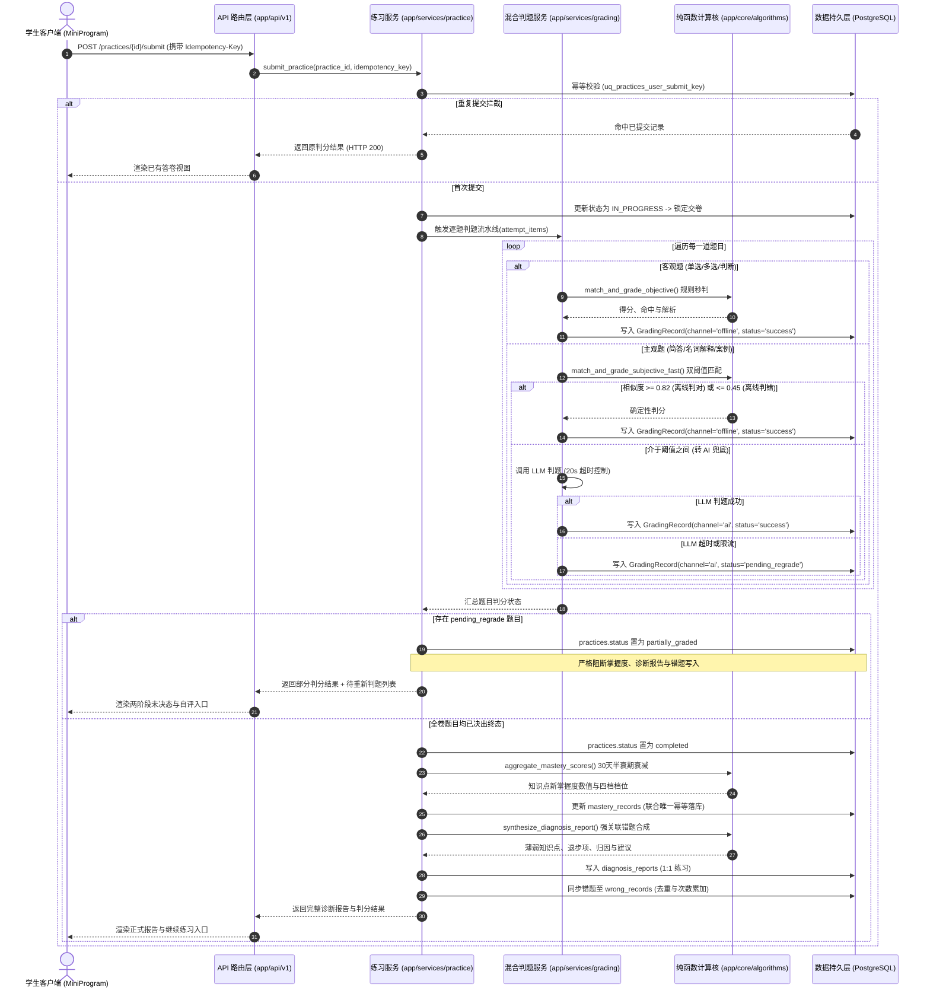
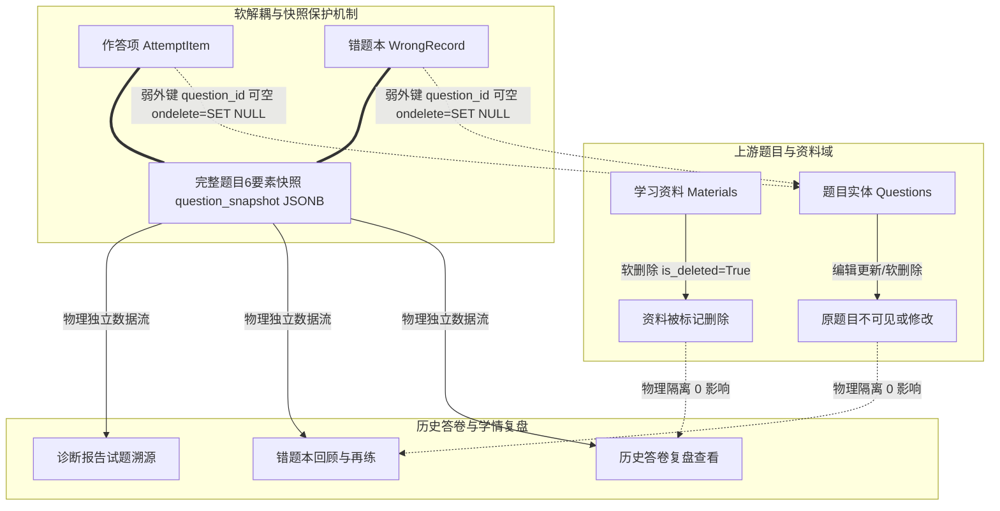

# Spec: 练习、答卷、掌握度与诊断报告数据模型 - 技术契约

- **关联 Intent**: ZL-106
- **主导设计人**: Dev
- **当前状态**: In-Review

---

## 1. 架构流向与设计方案

### 1.1 实体拓扑与关系图 (Mermaid)

本模块作为智练自主学习平台自主练习、学情闭环与诊断分析的数据核心底座，承载多维度自主练习生命周期管理、逐题作答暂存与断网恢复、题目快照解耦持久化、离线与 AI 混合判题明细追踪、两阶段状态机防错、基于遗忘曲线的掌握度衰减聚合、强错题归因诊断报告以及防重累加错题本体系。



---

### 1.2 核心调用链与生命周期状态机

#### 1.2.1 练习与两阶段答卷生命周期状态机

落实《LEADER_ALIGNMENT.md》技术决策 1，彻底阻断主观题 AI 判题超时降级（标记为 `pending_regrade`）引发的因果倒置与掌握度对账灾难。系统严格执行两阶段状态跃迁：
- 阶段 1：交卷后，客观题秒级完成离线判分；主观题若判定成功，练习直接跃迁至 `COMPLETED` 并触发掌握度沉淀与正式报告；
- 阶段 2（降级分支）：若存在主观题调用超时或限流（`pending_regrade`），练习进入 `PARTIALLY_GRADED`（部分判分/未决态）。在未决态下，**严格阻断掌握度快照计算、严格阻断生成正式诊断报告、严格阻断写入错题本、严格阻断开启“继续练习”**；
- 终态闭环：用户通过自评覆盖（`user_self`）或重试判题（`ai`）使得全卷题目均获得明确裁定后，练习状态跃迁为 `COMPLETED`，此时才触发一次性、确定性的掌握度快照计算、诊断报告生成与错题落库。



#### 1.2.2 混合判题、掌握度沉淀与报告生成调用链时序图



#### 1.2.3 题目快照软解耦与防级联崩溃流向 (技术决策 2)

落实《LEADER_ALIGNMENT.md》技术决策 2，彻底杜绝因资料软删除（FR-13）或题目版本更新（FR-26）导致历史答卷外键破坏或渲染白屏。



---

## 2. API 与数据契约设计

### 2.1 实体模型声明式契约 (`backend/app/models/practice.py`)

#### 2.1.1 枚举类型定义契约

```python
import enum


class PracticeStatus(enum.StrEnum):
    """练习生命周期状态枚举。
    
    遵循技术决策 1 两阶段状态机模型：
    NOT_STARTED: 已创建，尚未打开或作答
    IN_PROGRESS: 作答进行中
    PARTIALLY_GRADED: 部分判分/未决态 (存在 pending_regrade 主观题，阻断掌握度与报告)
    COMPLETED: 全卷终态判完 (已生成掌握度快照与正式诊断报告)
    """

    NOT_STARTED = "not_started"
    IN_PROGRESS = "in_progress"
    PARTIALLY_GRADED = "partially_graded"
    COMPLETED = "completed"


class PracticeSourceType(enum.StrEnum):
    """练习来源类型枚举。
    
    NORMAL: 常规创建练习 (选定资料与知识点范围)
    WEAKNESS: 薄弱知识点强化 / 诊断报告末尾一键继续练习 (FR-58)
    """

    NORMAL = "normal"
    WEAKNESS = "weakness"


class GradingChannel(enum.StrEnum):
    """判题渠道枚举 (覆盖需求 FR-43 规定的三类判题来源)。"""

    OFFLINE = "offline"  # 离线确定性判分 (客观题秒判 / 主观题高置信度双阈值匹配)
    AI = "ai"  # 大模型判题 (主观题兜底)
    USER_SELF = "user_self"  # 用户自评覆盖 (FR-44)


class GradingStatus(enum.StrEnum):
    """判题处理状态枚举。"""

    PENDING = "pending"  # 待判题 (进入队列)
    SUCCESS = "success"  # 判定成功并已计算分值
    PENDING_REGRADE = "pending_regrade"  # 待重新判题 (LLM 20s 超时或限流降级，严禁判错)
    FAILED = "failed"  # 判定异常失败


class MasteryLevel(enum.StrEnum):
    """知识点掌握度四档评级枚举 (覆盖需求 FR-48)。
    
    UNLEARNED: 未学 (mastery_score == 0.0 或无作答记录)
    WEAK: 薄弱 (0.0 < mastery_score < 0.40)
    BASIC: 基本掌握 (0.40 <= mastery_score < 0.70)
    PROFICIENT: 熟练 (0.70 <= mastery_score <= 1.0)
    """

    UNLEARNED = "unlearned"
    WEAK = "weak"
    BASIC = "basic"
    PROFICIENT = "proficient"


class ErrorType(enum.StrEnum):
    """错题错误归因类型枚举 (覆盖需求 FR-55 四类一票否决归因)。"""

    CONCEPTUAL = "conceptual"  # 概念性错误 (核心知识点理解偏差)
    INCOMPLETE_EXPRESSION = "incomplete_expression"  # 表述不全 (要点遗漏)
    QUESTION_MISREADING = "question_misreading"  # 审题偏差 (误解题干限定条件)
    UNANSWERED = "unanswered"  # 未作答 (FR-36 独立分类统计)
```

---

#### 2.1.2 练习主实体契约 (`Practice`)

- **表名**: `practices`
- **继承**: `Base, TimestampMixin, TenantModelMixin`
- **字段定义**:

| 字段名 | 类型 | 约束 / 默认值 | 业务含义与用途 |
|---|---|---|---|
| `id` | `UUID(as_uuid=True)` | PK, default=`uuid.uuid4` | 练习主键 UUIDv4 |
| `user_id` | `UUID(as_uuid=True)` | FK `users.id` (CASCADE), NOT NULL, Index | 多租户隔离基石 (TenantModelMixin 注入) |
| `material_id` | `UUID(as_uuid=True)` | FK `materials.id` (CASCADE), NOT NULL, Index | 所属学习资料标识 |
| `title` | `String(128)` | NOT NULL | 练习标题 (如: "计算机网络第3章-专项练习") |
| `knowledge_point_ids` | `JSONB` | NOT NULL, default=`list` | 练习覆盖的知识点 UUID 列表 |
| `question_types` | `JSONB` | NOT NULL, default=`list` | 包含的题型范围列表 |
| `difficulty` | `Integer` | Nullable, default=None | 期望难度偏好 (1~5，空为混合) |
| `question_count` | `Integer` | NOT NULL, default=0 | 练习题目总数 ($1 \sim 50$) |
| `ordered_question_ids` | `JSONB` | NOT NULL, default=`list` | 固化打散后的题目 ID 有序列表 (同知识点不相邻) |
| `status` | `String(32)` | NOT NULL, default=`PracticeStatus.NOT_STARTED.value` | 练习生命周期状态 |
| `source_type` | `String(32)` | NOT NULL, default=`PracticeSourceType.NORMAL.value` | 练习来源类型 |
| `source_report_id` | `UUID(as_uuid=True)` | FK `diagnosis_reports.id` (SET NULL), Nullable, Index | 来源诊断报告引用 (用于继续练习防重合并) |
| `submit_idempotency_key`| `String(64)` | Nullable | 交卷强幂等键 (客户端 UUIDv4 标识) |
| `submitted_at` | `DateTime(timezone=True)`| Nullable, default=None | 客户端答卷提交时间戳 (UTC) |
| `completed_at` | `DateTime(timezone=True)`| Nullable, default=None | 全卷所有题目判分完成时间戳 (UTC) |
| `total_score` | `Float` | Nullable, default=None | 卷面最终累计得分 |
| `max_score` | `Float` | Nullable, default=None | 卷面总满分分值 (各题 max_score 之和) |
| `created_at` | `DateTime(timezone=True)`| NOT NULL, server_default=`func.now()` | 创建时间戳 (UTC) |
| `updated_at` | `DateTime(timezone=True)`| NOT NULL, onupdate=`func.now()` | 最后修改时间戳 (UTC) |

- **索引与约束**:
  * 联合唯一索引: `Index("uq_practices_user_submit_key", "user_id", "submit_idempotency_key", unique=True, postgresql_where=text("submit_idempotency_key IS NOT NULL"))` —— 阻断 24 小时内的重复交卷请求 (FR-35)。
  * 继续练习防重复合并索引: `Index("ix_practices_user_source_status", "user_id", "source_report_id", "status")` —— 支持快速检索同来源且未开始的练习并复用 (FR-58)。
  * 资料维度练习列表索引: `Index("ix_practices_user_mat_status", "user_id", "material_id", "status")`。
  * 用户练习状态索引: `Index("ix_practices_user_status", "user_id", "status")`。

- **关系映射**:
  * `items`: `Mapped[list["AttemptItem"]] = relationship("AttemptItem", back_populates="practice", cascade="all, delete-orphan", order_by="AttemptItem.order_index")`
  * `grading_records`: `Mapped[list["GradingRecord"]] = relationship("GradingRecord", back_populates="practice", cascade="all, delete-orphan")`
  * `diagnosis_report`: `Mapped["DiagnosisReport | None"] = relationship("DiagnosisReport", back_populates="practice", uselist=False, cascade="all, delete-orphan")`

- **绝密脱敏 `__repr__`**:
```python
def __repr__(self) -> str:
    return (
        f"<Practice id={self.id} user_id={self.user_id} status={self.status} "
        f"count={self.question_count} score={self.total_score}/{self.max_score}>"
    )
```

---

#### 2.1.3 答卷作答项与快照实体契约 (`AttemptItem`)

- **表名**: `attempt_items`
- **继承**: `Base, TimestampMixin, TenantModelMixin`
- **字段定义**:

| 字段名 | 类型 | 约束 / 默认值 | 业务含义与用途 |
|---|---|---|---|
| `id` | `UUID(as_uuid=True)` | PK, default=`uuid.uuid4` | 作答项主键 UUIDv4 |
| `user_id` | `UUID(as_uuid=True)` | FK `users.id` (CASCADE), NOT NULL, Index | 租户隔离标识 |
| `practice_id` | `UUID(as_uuid=True)` | FK `practices.id` (CASCADE), NOT NULL, Index | 关联练习主键 |
| `question_id` | `UUID(as_uuid=True)` | FK `questions.id` (SET NULL), Nullable, Index | 弱关联题目标识 (物理彻底解耦，原题删除时不级联) |
| `order_index` | `Integer` | NOT NULL, default=1 | 题目在卷面中的序号 (从 1 起始) |
| `question_snapshot` | `JSONB` | NOT NULL | 题目完整6要素快照 (题干/选项/答案/解析/细则/切片) |
| `user_answer` | `Text` | Nullable, default=None | 用户作答文本或选项标识 (严禁写入日志) |
| `is_answered` | `Boolean` | NOT NULL, default=False | 是否作答 (未作答题目按零分计但独立统计展示，FR-36) |
| `duration_seconds` | `Integer` | NOT NULL, default=0 | 该题实际作答耗时 (秒) |
| `score` | `Float` | Nullable, default=None | 本题最终得分 |
| `max_score` | `Float` | NOT NULL, default=1.0 | 本题满分基准值 |
| `created_at` | `DateTime(timezone=True)`| NOT NULL, server_default=`func.now()` | 创建时间戳 (UTC) |
| `updated_at` | `DateTime(timezone=True)`| NOT NULL, onupdate=`func.now()` | 更新时间戳 (UTC) |

- **索引与约束**:
  * 联合唯一约束: `UniqueConstraint("practice_id", "question_id", name="uq_attempt_items_practice_question")` —— 支持逐题断网暂存与幂等保存 (FR-34)。
  * 卷面序号索引: `Index("ix_attempt_items_practice_order", "practice_id", "order_index")`。
  * 用户维度查询索引: `Index("ix_attempt_items_user_practice", "user_id", "practice_id")`。

- **关系映射**:
  * `practice`: `Mapped["Practice"] = relationship("Practice", back_populates="items")`
  * `grading_records`: `Mapped[list["GradingRecord"]] = relationship("GradingRecord", back_populates="attempt_item", cascade="all, delete-orphan")`

- **绝密脱敏 `__repr__`**:
```python
def __repr__(self) -> str:
    ans_len = len(self.user_answer) if self.user_answer else 0
    return (
        f"<AttemptItem id={self.id} practice_id={self.practice_id} q_id={self.question_id} "
        f"order={self.order_index} answered={self.is_answered} ans_len={ans_len} score={self.score}>"
    )
```

---

#### 2.1.4 混合判题记录实体契约 (`GradingRecord`)

- **表名**: `grading_records`
- **继承**: `Base, TimestampMixin, TenantModelMixin`
- **字段定义**:

| 字段名 | 类型 | 约束 / 默认值 | 业务含义与用途 |
|---|---|---|---|
| `id` | `UUID(as_uuid=True)` | PK, default=`uuid.uuid4` | 判题记录主键 UUIDv4 |
| `user_id` | `UUID(as_uuid=True)` | FK `users.id` (CASCADE), NOT NULL, Index | 租户隔离标识 |
| `practice_id` | `UUID(as_uuid=True)` | FK `practices.id` (CASCADE), NOT NULL, Index | 关联练习主键 |
| `attempt_item_id` | `UUID(as_uuid=True)` | FK `attempt_items.id` (CASCADE), NOT NULL, Index | 关联作答项主键 |
| `question_id` | `UUID(as_uuid=True)` | FK `questions.id` (SET NULL), Nullable, Index | 弱关联题目标识 |
| `channel` | `String(32)` | NOT NULL | 判题渠道 (`GradingChannel`: offline/ai/user_self) |
| `status` | `String(32)` | NOT NULL | 判题状态 (`GradingStatus`: pending/success/pending_regrade/failed) |
| `is_final` | `Boolean` | NOT NULL, default=True | 是否为最终生效判分结果 (用于自评或重判覆盖，FR-43) |
| `score` | `Float` | Nullable, default=None | 本次判定得分 |
| `max_score` | `Float` | NOT NULL, default=1.0 | 满分基准分值 |
| `similarity_score` | `Float` | Nullable, default=None | 文本/向量相似度评分 (主观题离线双阈值判题比对值) |
| `hit_keywords` | `JSONB` | NOT NULL, default=`list` | 命中要点关键词列表 |
| `missing_keywords` | `JSONB` | NOT NULL, default=`list` | 遗漏核心要点列表 |
| `confidence` | `Float` | Nullable, default=None | 判题置信度评分 ($0.0 \sim 1.0$) |
| `feedback` | `Text` | Nullable, default=None | 判题评语与得分反馈说明 (严禁直接记录日志) |
| `grading_metadata` | `JSONB` | NOT NULL, default=`dict` | 过程元数据 (LLM token/耗时/Prompt版本/离线特征等) |
| `created_at` | `DateTime(timezone=True)`| NOT NULL, server_default=`func.now()` | 创建时间戳 (UTC) |
| `updated_at` | `DateTime(timezone=True)`| NOT NULL, onupdate=`func.now()` | 更新时间戳 (UTC) |

- **索引与约束**:
  * 最终判分索引: `Index("ix_grading_records_item_final", "attempt_item_id", "is_final")` —— 快速定位当前题目有效得分。
  * 练习未决状态快查索引: `Index("ix_grading_records_practice_status", "practice_id", "status")` —— 毫秒级探测是否存在 `pending_regrade` 题目。
  * 用户练习索引: `Index("ix_grading_records_user_practice", "user_id", "practice_id")`。

- **关系映射**:
  * `practice`: `Mapped["Practice"] = relationship("Practice", back_populates="grading_records")`
  * `attempt_item`: `Mapped["AttemptItem"] = relationship("AttemptItem", back_populates="grading_records")`

- **绝密脱敏 `__repr__`**:
```python
def __repr__(self) -> str:
    return (
        f"<GradingRecord id={self.id} item_id={self.attempt_item_id} channel={self.channel} "
        f"status={self.status} final={self.is_final} score={self.score}/{self.max_score}>"
    )
```

---

#### 2.1.5 知识点掌握度实体契约 (`MasteryRecord`)

- **表名**: `mastery_records`
- **继承**: `Base, TimestampMixin, TenantModelMixin`
- **字段定义**:

| 字段名 | 类型 | 约束 / 默认值 | 业务含义与用途 |
|---|---|---|---|
| `id` | `UUID(as_uuid=True)` | PK, default=`uuid.uuid4` | 掌握度记录主键 UUIDv4 |
| `user_id` | `UUID(as_uuid=True)` | FK `users.id` (CASCADE), NOT NULL, Index | 租户隔离标识 |
| `knowledge_point_id` | `UUID(as_uuid=True)` | FK `knowledge_points.id` (CASCADE), NOT NULL, Index | 关联知识点主键 |
| `mastery_score` | `Float` | NOT NULL, default=0.0 | 连续掌握度得分 ($0.0 \sim 1.0$) |
| `level` | `String(32)` | NOT NULL, default=`MasteryLevel.UNLEARNED.value` | 掌握度等级 (unlearned/weak/basic/proficient) |
| `practice_count` | `Integer` | NOT NULL, default=0 | 累计有效作答次数 |
| `correct_count` | `Integer` | NOT NULL, default=0 | 累计判定正确/达标次数 |
| `last_practiced_at` | `DateTime(timezone=True)`| Nullable, default=None | 最后有效练习时间 (用于 30 天半衰期时间衰减) |
| `decayed_at` | `DateTime(timezone=True)`| Nullable, default=None | 上次时间衰减重算时间戳 (UTC) |
| `recent_records_snapshot`| `JSONB` | NOT NULL, default=`list` | 最近 200 条有效答题记录简要元数据快照 |
| `created_at` | `DateTime(timezone=True)`| NOT NULL, server_default=`func.now()` | 创建时间戳 (UTC) |
| `updated_at` | `DateTime(timezone=True)`| NOT NULL, onupdate=`func.now()` | 更新时间戳 (UTC) |

- **索引与约束**:
  * 联合唯一键约束: `UniqueConstraint("user_id", "knowledge_point_id", name="uq_mastery_records_user_kp")` —— 强保证每位用户对每个知识点仅存在唯一一条掌握度汇总记录 (FR-47)。
  * 薄弱知识点筛选索引: `Index("ix_mastery_records_user_level", "user_id", "level")` —— 支撑薄弱知识点继续练习与诊断过滤。

- **关系映射**:
  * `knowledge_point`: `Mapped["KnowledgePoint"] = relationship("KnowledgePoint")`

- **绝密脱敏 `__repr__`**:
```python
def __repr__(self) -> str:
    return (
        f"<MasteryRecord id={self.id} user_id={self.user_id} kp_id={self.knowledge_point_id} "
        f"score={self.mastery_score:.2f} level={self.level} count={self.practice_count}>"
    )
```

---

#### 2.1.6 诊断报告实体契约 (`DiagnosisReport`)

- **表名**: `diagnosis_reports`
- **继承**: `Base, TimestampMixin, TenantModelMixin`
- **字段定义**:

| 字段名 | 类型 | 约束 / 默认值 | 业务含义与用途 |
|---|---|---|---|
| `id` | `UUID(as_uuid=True)` | PK, default=`uuid.uuid4` | 诊断报告主键 UUIDv4 |
| `user_id` | `UUID(as_uuid=True)` | FK `users.id` (CASCADE), NOT NULL, Index | 租户隔离标识 |
| `practice_id` | `UUID(as_uuid=True)` | FK `practices.id` (CASCADE), NOT NULL, Unique | 关联练习主键 (1:1 强一致关系) |
| `weak_knowledge_points` | `JSONB` | NOT NULL, default=`list` | 主要薄弱知识点列表 (强关联本次错题ID，无错题必须为空) |
| `regressed_knowledge_points`| `JSONB` | NOT NULL, default=`list` | 退步知识点列表 (与上次快照相比退步量 Delta >= 0.05) |
| `analysis_causes` | `JSONB` | NOT NULL, default=`list` | 结构化归因分析 (结合题型/未作答/判题渠道综合分析) |
| `actionable_suggestions`| `JSONB` | NOT NULL, default=`list` | 行动建议与一键继续练习入口数据 |
| `unanswered_count` | `Integer` | NOT NULL, default=0 | 未作答题目数 (FR-36 独立统计) |
| `wrong_count` | `Integer` | NOT NULL, default=0 | 答错题目总数 |
| `pending_regrade_count`| `Integer` | NOT NULL, default=0 | 待重新判题题目数 (正式报告中应为 0) |
| `total_questions` | `Integer` | NOT NULL, default=0 | 卷面题目总数 |
| `score_rate` | `Float` | NOT NULL, default=0.0 | 卷面得分率 ($0.0 \sim 1.0$) |
| `is_structure_degraded` | `Boolean` | NOT NULL, default=False | 知识结构降级标记 (低可信度黄色标签，FR-53) |
| `created_at` | `DateTime(timezone=True)`| NOT NULL, server_default=`func.now()` | 生成时间戳 (UTC) |
| `updated_at` | `DateTime(timezone=True)`| NOT NULL, onupdate=`func.now()` | 更新时间戳 (UTC) |

- **索引与约束**:
  * 练习唯一关联键: `UniqueConstraint("practice_id", name="uq_diagnosis_reports_practice_id")` —— 保证单次练习仅产生一份唯一权威诊断报告。
  * 用户报告时间序索引: `Index("ix_diagnosis_reports_user_created", "user_id", "created_at")`。

- **关系映射**:
  * `practice`: `Mapped["Practice"] = relationship("Practice", back_populates="diagnosis_report")`

- **绝密脱敏 `__repr__`**:
```python
def __repr__(self) -> str:
    return (
        f"<DiagnosisReport id={self.id} practice_id={self.practice_id} score_rate={self.score_rate:.2f} "
        f"wrong={self.wrong_count} unanswered={self.unanswered_count} degraded={self.is_structure_degraded}>"
    )
```

---

#### 2.1.7 错题本实体契约 (`WrongRecord`)

- **表名**: `wrong_records`
- **继承**: `Base, TimestampMixin, TenantModelMixin`
- **字段定义**:

| 字段名 | 类型 | 约束 / 默认值 | 业务含义与用途 |
|---|---|---|---|
| `id` | `UUID(as_uuid=True)` | PK, default=`uuid.uuid4` | 错题记录主键 UUIDv4 |
| `user_id` | `UUID(as_uuid=True)` | FK `users.id` (CASCADE), NOT NULL, Index | 租户隔离标识 |
| `question_id` | `UUID(as_uuid=True)` | FK `questions.id` (SET NULL), Nullable, Index | 弱关联题目标识 (原题删除不影响错题记录) |
| `knowledge_point_id` | `UUID(as_uuid=True)` | FK `knowledge_points.id` (CASCADE), NOT NULL, Index | 关联知识点主键 (支持按知识点复习错题) |
| `practice_id` | `UUID(as_uuid=True)` | FK `practices.id` (CASCADE), NOT NULL, Index | 最近一次答错的练习标识 |
| `attempt_item_id` | `UUID(as_uuid=True)` | FK `attempt_items.id` (CASCADE), NOT NULL, Index | 最近一次答错的作答项标识 |
| `error_type` | `String(32)` | NOT NULL | 错误类型 (`ErrorType`: conceptual/incomplete_expression/question_misreading/unanswered) |
| `error_count` | `Integer` | NOT NULL, default=1 | 连续答错累计次数 (FR-54，重做答错自增) |
| `is_mastered` | `Boolean` | NOT NULL, default=False | 是否攻克掌握 (重做正确后置为 True 移出待练，但记录永久保留，FR-57) |
| `last_wrong_answer` | `Text` | Nullable, default=None | 最近一次错误作答内容 (严禁打印入日志) |
| `question_snapshot` | `JSONB` | NOT NULL | 冗余备份题目快照 (题干/选项/解析，保证原题被删除时错题本仍可独立完整渲染) |
| `first_wrong_at` | `DateTime(timezone=True)`| NOT NULL, server_default=`func.now()` | 首次答错时间戳 (UTC) |
| `mastered_at` | `DateTime(timezone=True)`| Nullable, default=None | 攻克掌握时间戳 (UTC) |
| `created_at` | `DateTime(timezone=True)`| NOT NULL, server_default=`func.now()` | 创建时间戳 (UTC) |
| `updated_at` | `DateTime(timezone=True)`| NOT NULL, onupdate=`func.now()` | 更新时间戳 (UTC) |

- **索引与约束**:
  * 联合唯一键约束: `UniqueConstraint("user_id", "question_id", name="uq_wrong_records_user_question")` —— 强保证同一用户同一道题在错题本中仅一条记录，重复答错累加 `error_count` (FR-54)。
  * 错题本待练筛选索引: `Index("ix_wrong_records_user_mastered_type", "user_id", "is_mastered", "error_type")`。
  * 知识点维度错题聚合索引: `Index("ix_wrong_records_user_kp_mastered", "user_id", "knowledge_point_id", "is_mastered")`。

- **关系映射**:
  * `knowledge_point`: `Mapped["KnowledgePoint"] = relationship("KnowledgePoint")`
  * `practice`: `Mapped["Practice"] = relationship("Practice")`
  * `attempt_item`: `Mapped["AttemptItem"] = relationship("AttemptItem")`

- **绝密脱敏 `__repr__`**:
```python
def __repr__(self) -> str:
    ans_len = len(self.last_wrong_answer) if self.last_wrong_answer else 0
    return (
        f"<WrongRecord id={self.id} user_id={self.user_id} q_id={self.question_id} "
        f"type={self.error_type} count={self.error_count} mastered={self.is_mastered} ans_len={ans_len}>"
    )
```

---

### 2.2 JSONB 模式约束契约

#### 2.2.1 `question_snapshot` 结构规范与校验规则

在 `AttemptItem` 与 `WrongRecord` 中强制持久化 `question_snapshot`，实现与 `questions` 表的物理级联解耦。必须包含题目 6 要素及元数据：

```json
{
  "question_id": "3fa85f64-5717-4562-b3fc-2c963f66afa6",
  "question_type": "single_choice",
  "difficulty": 3,
  "stem": "TCP 协议建立连接时，三次握手的第二次握手发送的报文中 SYN 与 ACK 标志位设置情况为？",
  "options": [
    {"key": "A", "content": "SYN=1, ACK=0"},
    {"key": "B", "content": "SYN=1, ACK=1"},
    {"key": "C", "content": "SYN=0, ACK=1"},
    {"key": "D", "content": "SYN=0, ACK=0"}
  ],
  "answer": "B",
  "analysis": "第二次握手为服务端回复客户端的 SYN 请求，需同时确认客户端报文段并表明建立连接意图，故 SYN=1 且 ACK=1。",
  "grading_rubric": {
    "total_score": 10.0,
    "dimensions": [
      {"name": "标志位确认", "points": 6.0, "criterion": "明确指出 SYN=1 且 ACK=1"},
      {"name": "时序原理解释", "points": 4.0, "criterion": "阐明服务端同时执行回应确认与发起连接"}
    ]
  },
  "knowledge_point_id": "c71a3d90-8452-4753-909d-cbbe6a053c12",
  "knowledge_point_name": "TCP三次握手与四次挥手",
  "source_snippet_ids": ["8b7f8c02-4d19-482d-8386-455b57d6e641"]
}
```

校验规则纯函数 `validate_question_snapshot(snapshot: dict[str, Any]) -> tuple[bool, str | None]`:
1. `question_type` 必须合法且属于 `QuestionType` 枚举之一；
2. `stem`、`answer` 必须为非空有效字符串；
3. 若题型为单选或多选，`options` 必须为包含至少 2 个元素的有效列表，且每项包含 `key` 与 `content`；
4. 若题型为主观题，`grading_rubric` 必须有效且分值核算一致。

---

#### 2.2.2 诊断报告四大核心 JSONB 模块规范

- **1. 薄弱知识点列表 (`weak_knowledge_points`) (FR-50 硬性红线: 无错题必须为空)**:
```json
[
  {
    "knowledge_point_id": "c71a3d90-8452-4753-909d-cbbe6a053c12",
    "name": "TCP三次握手与四次挥手",
    "mastery_score": 0.32,
    "level": "weak",
    "wrong_count": 2,
    "wrong_question_ids": [
      "3fa85f64-5717-4562-b3fc-2c963f66afa6",
      "871b2d41-3321-4112-98aa-124987114321"
    ]
  }
]
```

- **2. 退步知识点列表 (`regressed_knowledge_points`) (退步量 $\Delta \ge 0.05$)**:
```json
[
  {
    "knowledge_point_id": "e8123f11-9124-4111-a831-291129381273",
    "name": "IP数据报分片与重组",
    "previous_score": 0.82,
    "current_score": 0.70,
    "delta": 0.12
  }
]
```

- **3. 结构化归因分析 (`analysis_causes`) (FR-51)**:
```json
[
  {
    "cause_code": "UNANSWERED_DOMINANT",
    "title": "未作答比例偏高",
    "description": "本次练习中有 3 道题目未作答，导致知识点掌握度按零分折算。",
    "affected_knowledge_point_ids": ["c71a3d90-8452-4753-909d-cbbe6a053c12"]
  },
  {
    "cause_code": "SUBJECTIVE_MISSING_KEYWORDS",
    "title": "主观表述要点遗漏",
    "description": "简答题在'拥塞控制算法'核心机制上表述不全，遗漏快速重传要点。",
    "affected_knowledge_point_ids": ["d9231f22-1234-4321-9876-554433221100"]
  }
]
```

- **4. 行动建议与一键继续练习入口 (`actionable_suggestions`) (FR-52, FR-58)**:
```json
[
  {
    "knowledge_point_id": "c71a3d90-8452-4753-909d-cbbe6a053c12",
    "knowledge_point_name": "TCP三次握手与四次挥手",
    "suggestion_text": "建议针对三次握手序号同步与四次挥手TIME_WAIT状态重新回顾资料切片，并完成专项强化练习。",
    "continue_practice_payload": {
      "source_report_id": "5fa23d11-1234-5678-90ab-cdef12345678",
      "material_id": "1fa85f64-5717-4562-b3fc-2c963f66afa1",
      "knowledge_point_ids": ["c71a3d90-8452-4753-909d-cbbe6a053c12"],
      "question_count": 5
    }
  }
]
```

---

#### 2.2.3 掌握度快照 `recent_records_snapshot` 规范

用于快速复现掌握度加权衰减计算过程与数据对账，在 `MasteryRecord` 中记录最近最多 200 条记录：

```json
[
  {
    "attempt_item_id": "2bc85f64-5717-4562-b3fc-2c963f66af01",
    "practice_id": "1bc85f64-5717-4562-b3fc-2c963f66af00",
    "score_ratio": 1.0,
    "channel": "offline",
    "weight": 1.0,
    "timestamp": "2026-09-23T20:30:00Z"
  },
  {
    "attempt_item_id": "2bc85f64-5717-4562-b3fc-2c963f66af02",
    "practice_id": "1bc85f64-5717-4562-b3fc-2c963f66af00",
    "score_ratio": 0.8,
    "channel": "ai",
    "weight": 0.8,
    "timestamp": "2026-09-23T20:30:05Z"
  }
]
```

---

### 2.3 强幂等约束与并发安全机制

1. **交卷强幂等约束 (`uq_practices_user_submit_key`)**:
   - 客户端交卷时生成并携带 `Idempotency-Key` (UUIDv4)；
   - 数据库建立唯一索引：`(user_id, submit_idempotency_key)`；
   - 重复请求触发唯一键冲突时，数据库保证行级并发互斥，直接返回已处理完成的答卷结果，杜绝重复判题与重复扣分。
2. **逐题作答保存唯一约束 (`uq_attempt_items_practice_question`)**:
   - 作答项表建立 `(practice_id, question_id)` 联合唯一键；
   - 客户端逐题保存或重连重发时，后端采用 `INSERT ... ON CONFLICT (practice_id, question_id) DO UPDATE` 机制，保障多端暂存无竞态死锁。
3. **继续练习防重合并索引 (`ix_practices_user_source_status`)**:
   - 针对 `(user_id, source_report_id, status)` 建立高效组合索引；
   - 当用户从同一诊断报告多次点击“一键继续练习”时，若存在同来源且处于 `not_started` 状态的练习，直接返回已有练习实体，严禁重复生成。
4. **掌握度与错题去重累加约束 (`uq_mastery_records_user_kp`, `uq_wrong_records_user_question`)**:
   - 掌握度按 `(user_id, knowledge_point_id)` 唯一索引实施 UPSERT 聚合；
   - 错题本按 `(user_id, question_id)` 唯一索引实施 UPSERT 累加：若记录已存在且重做仍答错，则自增 `error_count` 并刷新 `last_wrong_answer`；若重做答对，则置 `is_mastered=True` 并记录 `mastered_at`。

---

### 2.4 日志绝密脱敏契约 (`__repr__` 规范)

严格执行《AGENTS.md》第 4 节“绝密脱敏红线”：
1. **练习模型 (`Practice`)**: 严禁打印题目题目全文与知识点具体名称，仅打印 ID、状态、题数与分值；
2. **作答项模型 (`AttemptItem`)**: 绝对禁止输出 `user_answer` 作答原文与 `question_snapshot` 题干/选项/解析，仅输出作答字符长度 `ans_len` 与判定得分；
3. **判题记录模型 (`GradingRecord`)**: 绝对禁止输出 `feedback` 评语、`hit_keywords` 命中要点与 `missing_keywords` 遗漏要点，仅输出判题渠道、置信度与状态；
4. **掌握度模型 (`MasteryRecord`)**: 仅输出知识点 ID、连续得分与档位枚举；
5. **诊断报告模型 (`DiagnosisReport`)**: 严禁输出归因描述与建议全文，仅输出统计数量与降级标记；
6. **错题本模型 (`WrongRecord`)**: 绝对禁止输出 `last_wrong_answer` 作答内容与 `question_snapshot` 题目详情，仅输出错误类型、错误次数与掌握标记。

---

### 2.5 Alembic 迁移脚本契约架构 (`0003_create_practice_tables.py`)

#### 2.5.1 upgrade() 6 表建表、级联与索引

```python
"""Create practices, attempt items, grading records, mastery, diagnosis, and wrong records tables.

Revision ID: 0003_create_practice_tables
Revises: 0002_create_knowledge_and_question_tables
Create Date: 2026-09-23 21:30:00.000000
"""

from collections.abc import Sequence

import sqlalchemy as sa
from alembic import op
from sqlalchemy.dialects import postgresql

revision: str = "0003_create_practice_tables"
down_revision: str | None = "0002_create_knowledge_and_question_tables"
branch_labels: Sequence[str] | None = None
depends_on: Sequence[str] | None = None


def upgrade() -> None:
    conn = op.get_bind()
    dialect = conn.dialect.name
    json_type = postgresql.JSONB(astext_type=sa.Text()) if dialect == "postgresql" else sa.JSON()

    # 1. 创建 practices 主表
    op.create_table(
        "practices",
        sa.Column("id", postgresql.UUID(as_uuid=True), primary_key=True),
        sa.Column("user_id", postgresql.UUID(as_uuid=True), sa.ForeignKey("users.id", ondelete="CASCADE"), nullable=False, index=True),
        sa.Column("material_id", postgresql.UUID(as_uuid=True), sa.ForeignKey("materials.id", ondelete="CASCADE"), nullable=False, index=True),
        sa.Column("title", sa.String(128), nullable=False),
        sa.Column("knowledge_point_ids", json_type, nullable=False),
        sa.Column("question_types", json_type, nullable=False),
        sa.Column("difficulty", sa.Integer(), nullable=True),
        sa.Column("question_count", sa.Integer(), nullable=False, server_default="0"),
        sa.Column("ordered_question_ids", json_type, nullable=False),
        sa.Column("status", sa.String(32), nullable=False, server_default="not_started"),
        sa.Column("source_type", sa.String(32), nullable=False, server_default="normal"),
        sa.Column("source_report_id", postgresql.UUID(as_uuid=True), nullable=True),
        sa.Column("submit_idempotency_key", sa.String(64), nullable=True),
        sa.Column("submitted_at", sa.DateTime(timezone=True), nullable=True),
        sa.Column("completed_at", sa.DateTime(timezone=True), nullable=True),
        sa.Column("total_score", sa.Float(), nullable=True),
        sa.Column("max_score", sa.Float(), nullable=True),
        sa.Column("created_at", sa.DateTime(timezone=True), server_default=sa.func.now(), nullable=False),
        sa.Column("updated_at", sa.DateTime(timezone=True), server_default=sa.func.now(), nullable=False),
    )
    op.create_index("ix_practices_user_source_status", "practices", ["user_id", "source_report_id", "status"])
    op.create_index("ix_practices_user_mat_status", "practices", ["user_id", "material_id", "status"])
    op.create_index("ix_practices_user_status", "practices", ["user_id", "status"])
    op.create_index(
        "uq_practices_user_submit_key",
        "practices",
        ["user_id", "submit_idempotency_key"],
        unique=True,
        postgresql_where=sa.text("submit_idempotency_key IS NOT NULL"),
    )

    # 2. 创建 attempt_items 作答项表 (question_id 弱外键 SET NULL)
    op.create_table(
        "attempt_items",
        sa.Column("id", postgresql.UUID(as_uuid=True), primary_key=True),
        sa.Column("user_id", postgresql.UUID(as_uuid=True), sa.ForeignKey("users.id", ondelete="CASCADE"), nullable=False, index=True),
        sa.Column("practice_id", postgresql.UUID(as_uuid=True), sa.ForeignKey("practices.id", ondelete="CASCADE"), nullable=False, index=True),
        sa.Column("question_id", postgresql.UUID(as_uuid=True), sa.ForeignKey("questions.id", ondelete="SET NULL"), nullable=True, index=True),
        sa.Column("order_index", sa.Integer(), nullable=False, server_default="1"),
        sa.Column("question_snapshot", json_type, nullable=False),
        sa.Column("user_answer", sa.Text(), nullable=True),
        sa.Column("is_answered", sa.Boolean(), nullable=False, server_default="false"),
        sa.Column("duration_seconds", sa.Integer(), nullable=False, server_default="0"),
        sa.Column("score", sa.Float(), nullable=True),
        sa.Column("max_score", sa.Float(), nullable=False, server_default="1.0"),
        sa.Column("created_at", sa.DateTime(timezone=True), server_default=sa.func.now(), nullable=False),
        sa.Column("updated_at", sa.DateTime(timezone=True), server_default=sa.func.now(), nullable=False),
        sa.UniqueConstraint("practice_id", "question_id", name="uq_attempt_items_practice_question"),
    )
    op.create_index("ix_attempt_items_practice_order", "attempt_items", ["practice_id", "order_index"])
    op.create_index("ix_attempt_items_user_practice", "attempt_items", ["user_id", "practice_id"])

    # 3. 创建 grading_records 混合判题表
    op.create_table(
        "grading_records",
        sa.Column("id", postgresql.UUID(as_uuid=True), primary_key=True),
        sa.Column("user_id", postgresql.UUID(as_uuid=True), sa.ForeignKey("users.id", ondelete="CASCADE"), nullable=False, index=True),
        sa.Column("practice_id", postgresql.UUID(as_uuid=True), sa.ForeignKey("practices.id", ondelete="CASCADE"), nullable=False, index=True),
        sa.Column("attempt_item_id", postgresql.UUID(as_uuid=True), sa.ForeignKey("attempt_items.id", ondelete="CASCADE"), nullable=False, index=True),
        sa.Column("question_id", postgresql.UUID(as_uuid=True), sa.ForeignKey("questions.id", ondelete="SET NULL"), nullable=True, index=True),
        sa.Column("channel", sa.String(32), nullable=False),
        sa.Column("status", sa.String(32), nullable=False),
        sa.Column("is_final", sa.Boolean(), nullable=False, server_default="true"),
        sa.Column("score", sa.Float(), nullable=True),
        sa.Column("max_score", sa.Float(), nullable=False, server_default="1.0"),
        sa.Column("similarity_score", sa.Float(), nullable=True),
        sa.Column("hit_keywords", json_type, nullable=False),
        sa.Column("missing_keywords", json_type, nullable=False),
        sa.Column("confidence", sa.Float(), nullable=True),
        sa.Column("feedback", sa.Text(), nullable=True),
        sa.Column("grading_metadata", json_type, nullable=False),
        sa.Column("created_at", sa.DateTime(timezone=True), server_default=sa.func.now(), nullable=False),
        sa.Column("updated_at", sa.DateTime(timezone=True), server_default=sa.func.now(), nullable=False),
    )
    op.create_index("ix_grading_records_item_final", "grading_records", ["attempt_item_id", "is_final"])
    op.create_index("ix_grading_records_practice_status", "grading_records", ["practice_id", "status"])
    op.create_index("ix_grading_records_user_practice", "grading_records", ["user_id", "practice_id"])

    # 4. 创建 mastery_records 掌握度记录表
    op.create_table(
        "mastery_records",
        sa.Column("id", postgresql.UUID(as_uuid=True), primary_key=True),
        sa.Column("user_id", postgresql.UUID(as_uuid=True), sa.ForeignKey("users.id", ondelete="CASCADE"), nullable=False, index=True),
        sa.Column("knowledge_point_id", postgresql.UUID(as_uuid=True), sa.ForeignKey("knowledge_points.id", ondelete="CASCADE"), nullable=False, index=True),
        sa.Column("mastery_score", sa.Float(), nullable=False, server_default="0.0"),
        sa.Column("level", sa.String(32), nullable=False, server_default="unlearned"),
        sa.Column("practice_count", sa.Integer(), nullable=False, server_default="0"),
        sa.Column("correct_count", sa.Integer(), nullable=False, server_default="0"),
        sa.Column("last_practiced_at", sa.DateTime(timezone=True), nullable=True),
        sa.Column("decayed_at", sa.DateTime(timezone=True), nullable=True),
        sa.Column("recent_records_snapshot", json_type, nullable=False),
        sa.Column("created_at", sa.DateTime(timezone=True), server_default=sa.func.now(), nullable=False),
        sa.Column("updated_at", sa.DateTime(timezone=True), server_default=sa.func.now(), nullable=False),
        sa.UniqueConstraint("user_id", "knowledge_point_id", name="uq_mastery_records_user_kp"),
    )
    op.create_index("ix_mastery_records_user_level", "mastery_records", ["user_id", "level"])

    # 5. 创建 diagnosis_reports 诊断报告表
    op.create_table(
        "diagnosis_reports",
        sa.Column("id", postgresql.UUID(as_uuid=True), primary_key=True),
        sa.Column("user_id", postgresql.UUID(as_uuid=True), sa.ForeignKey("users.id", ondelete="CASCADE"), nullable=False, index=True),
        sa.Column("practice_id", postgresql.UUID(as_uuid=True), sa.ForeignKey("practices.id", ondelete="CASCADE"), nullable=False, unique=True),
        sa.Column("weak_knowledge_points", json_type, nullable=False),
        sa.Column("regressed_knowledge_points", json_type, nullable=False),
        sa.Column("analysis_causes", json_type, nullable=False),
        sa.Column("actionable_suggestions", json_type, nullable=False),
        sa.Column("unanswered_count", sa.Integer(), nullable=False, server_default="0"),
        sa.Column("wrong_count", sa.Integer(), nullable=False, server_default="0"),
        sa.Column("pending_regrade_count", sa.Integer(), nullable=False, server_default="0"),
        sa.Column("total_questions", sa.Integer(), nullable=False, server_default="0"),
        sa.Column("score_rate", sa.Float(), nullable=False, server_default="0.0"),
        sa.Column("is_structure_degraded", sa.Boolean(), nullable=False, server_default="false"),
        sa.Column("created_at", sa.DateTime(timezone=True), server_default=sa.func.now(), nullable=False),
        sa.Column("updated_at", sa.DateTime(timezone=True), server_default=sa.func.now(), nullable=False),
    )
    op.create_index("ix_diagnosis_reports_user_created", "diagnosis_reports", ["user_id", "created_at"])

    # 6. 创建 wrong_records 错题本表
    op.create_table(
        "wrong_records",
        sa.Column("id", postgresql.UUID(as_uuid=True), primary_key=True),
        sa.Column("user_id", postgresql.UUID(as_uuid=True), sa.ForeignKey("users.id", ondelete="CASCADE"), nullable=False, index=True),
        sa.Column("question_id", postgresql.UUID(as_uuid=True), sa.ForeignKey("questions.id", ondelete="SET NULL"), nullable=True, index=True),
        sa.Column("knowledge_point_id", postgresql.UUID(as_uuid=True), sa.ForeignKey("knowledge_points.id", ondelete="CASCADE"), nullable=False, index=True),
        sa.Column("practice_id", postgresql.UUID(as_uuid=True), sa.ForeignKey("practices.id", ondelete="CASCADE"), nullable=False, index=True),
        sa.Column("attempt_item_id", postgresql.UUID(as_uuid=True), sa.ForeignKey("attempt_items.id", ondelete="CASCADE"), nullable=False, index=True),
        sa.Column("error_type", sa.String(32), nullable=False),
        sa.Column("error_count", sa.Integer(), nullable=False, server_default="1"),
        sa.Column("is_mastered", sa.Boolean(), nullable=False, server_default="false"),
        sa.Column("last_wrong_answer", sa.Text(), nullable=True),
        sa.Column("question_snapshot", json_type, nullable=False),
        sa.Column("first_wrong_at", sa.DateTime(timezone=True), server_default=sa.func.now(), nullable=False),
        sa.Column("mastered_at", sa.DateTime(timezone=True), nullable=True),
        sa.Column("created_at", sa.DateTime(timezone=True), server_default=sa.func.now(), nullable=False),
        sa.Column("updated_at", sa.DateTime(timezone=True), server_default=sa.func.now(), nullable=False),
        sa.UniqueConstraint("user_id", "question_id", name="uq_wrong_records_user_question"),
    )
    op.create_index("ix_wrong_records_user_mastered_type", "wrong_records", ["user_id", "is_mastered", "error_type"])
    op.create_index("ix_wrong_records_user_kp_mastered", "wrong_records", ["user_id", "knowledge_point_id", "is_mastered"])
```

#### 2.5.2 downgrade() 逆序安全回滚逻辑

严格按照外键依赖深度逆序安全清理表与关联索引：

```python
def downgrade() -> None:
    # 严格逆序删除数据表
    op.drop_table("wrong_records")
    op.drop_table("diagnosis_reports")
    op.drop_table("mastery_records")
    op.drop_table("grading_records")
    op.drop_table("attempt_items")
    op.drop_table("practices")
```

---

## 3. 可测性设计 (Design for Testability)

### 3.1 独立纯函数计算核对接与边界校验

为了保障高内聚、低耦合与毫秒级白盒单测覆盖，以下核心校验与决策逻辑必须封装为独立纯函数：
1. **题目快照校验纯函数 (`validate_question_snapshot`)**:
   - 输入原生字典 `snapshot: dict[str, Any]`，输出 `tuple[bool, str | None]`；
   - 验证题干、选项、参考答案、评分细则的完整性与数值自洽性；
   - 纯函数分支覆盖率门禁 $100\%$。
2. **两阶段状态机跃迁校验纯函数 (`validate_practice_transition`)**:
   - 输入 `(current_status: PracticeStatus, has_pending_regrade: bool, all_items_graded: bool)`；
   - 输出合法的下一阶段 `PracticeStatus`，非法跃迁直接抛出业务异常或返回拒绝；
   - 判定覆盖率 $100\%$。
3. **模型 `__repr__` 绝密脱敏校验**:
   - 为全部 6 个实体编写脱敏单元测试，向题干、答案、作答全文注入特征指纹（如 `SENSITIVE_ANSWER_TOKEN_999`）；
   - 断言调用 `repr()` 得到的结果串中绝对不包含特征指纹。

### 3.2 外部依赖与 Mock/Fallback 策略

1. **数据库引擎方言自适应策略**:
   - 生产环境采用 PostgreSQL 16 原生 `JSONB` 与 `UUID`；
   - 单元测试环境下自动退化为兼容 SQLite 内存库的 `JSON` 与标准 `String/UUID` 方言变体（`JSON().with_variant(JSONB, "postgresql")`）；
2. **测试网络阻断红线 (NFR-04)**:
   - 单测与模型测试严禁触碰任何外部网络与真实 LLM 接口；
   - 针对大模型判题与 OCR 适配器，统一采用假实现（Fake / Stub），确保单用例执行时间在毫秒级，后端全量模型单测在 5 秒内执行完毕。

---

## 4. 替代方案与权衡考量 (Alternatives Considered & Trade-offs)

### 4.1 练习与答卷主表粒度设计

- **方案 A (单表合一模式 - 最终采纳)**:
  - 以 `practices` 作为练习与答卷的统一主实体，直接关联 `attempt_items`（逐题作答项）；
  - 理由：智练自主学习平台定位于轻量级、个人化场景，一次练习对应一次单向提交与批改生命周期（`not_started` $\to$ `in_progress` $\to$ `partially_graded` $\to$ `completed`）。单表合一避免了不必要的 1:1 冗余联表查询，简化状态机管理，同时通过 `submit_idempotency_key` 完美保障交卷强幂等。
- **方案 B (经典主从双表模式 - 未采纳)**:
  - 拆分为 `practices`（练习配置）与 `practice_attempts`（答卷作答记录）两张表；
  - 放弃原因：在当前个人自主学习 P0 范围内，不存在“保留同一练习配置由多人多次答题”的教务场景（属于明确不做项），双表设计会引入空转包装、外键级联链条膨胀与不必要的多表 Join 性能损耗。

### 4.2 混合判题过程记录存储形态

- **方案 A (单条作答项合并 JSONB - 未采纳)**:
  - 在 `attempt_items` 表中设置 `offline_result: JSONB` 与 `ai_result: JSONB`；
  - 放弃原因：当用户发生自评覆盖（FR-44）或后台发起异步重判（FR-42）时，单表 JSONB 字段覆盖会彻底丢失判题历史演进轨迹，破坏审计溯源链条，且不利于针对判题置信度、渠道分布建立精确 SQL 聚合索引。
- **方案 B (独立多版本追加判题记录实体 - 最终采纳)**:
  - 建立独立的 `GradingRecord` 实体，通过 `is_final` 区分当前生效裁定；
  - 理由：支持离线规则判题、AI 判题与用户自评历史完整并存，具备完备的审计痕迹，并可通过 `(attempt_item_id, is_final)` 与 `(practice_id, status)` 建立高效索引，支撑两阶段状态机的毫秒级未决检测。

### 4.3 题目外键关联与快照存储模式

- **方案 A (题目强外键级联绑定 - 未采纳)**:
  - `attempt_items.question_id` 设置强外键与 `ON DELETE CASCADE`；
  - 放弃原因：用户执行资料删除（FR-13）或题目软删除更新（FR-26）时，将直接引发数据库级联破坏历史答卷数据或抛出外键完整性异常（50001），严重违反《LEADER_ALIGNMENT.md》技术决策 2。
- **方案 B (题目弱外键关联 + JSONB 全量快照 - 最终采纳)**:
  - `question_id` 设为可空弱外键，强制存储 `question_snapshot`；
  - 理由：原题被修改或删除后，历史答卷仍能完整渲染并复盘原题干、选项、答案与解析，实现物理与逻辑的彻底解耦。

### 4.4 方案权衡决策矩阵

| 评估维度 | 方案 A (强耦合/多表拆分) | 方案 B (当前采纳方案: 紧凑主表+快照解耦+两阶段) | 权衡判定结论 |
|---|---|---|---|
| **契约解耦性** | 差 (原题删除影响历史答卷) | 优 (题目快照彻底解耦，原资料删除答卷仍可复盘) | 采纳方案 B (技术决策 2) |
| **状态防错能力**| 差 (超时未决强行写入导致掌握度失真) | 优 (两阶段状态机，未决态硬性阻断后置沉淀) | 采纳方案 B (技术决策 1) |
| **查询性能** | 中 (主从答卷多次 Join) | 优 (单主表+组合索引覆盖，查询响应 P95 < 50ms) | 采纳方案 B |
| **审计追溯力** | 弱 (过程覆盖，无独立判分日志) | 优 (独立记录离线、AI、自评明细与元数据) | 采纳方案 B |
| **复杂度控制** | 较复杂 (表膨胀、外键嵌套过深) | 符合 KISS 原则，兼具扩展性与简洁性 | 采纳方案 B |

---

## 5. 动态风险核验与回滚预案 (Risk & Rollback Verification)

### 5.1 7 大动态风险扫描

1. **Files (文件变更面)**:
   - 新增 `backend/app/models/practice.py`；
   - 更新 `backend/app/models/__init__.py` (导出 6 大实体模型与相关枚举)；
   - 新增 `backend/migrations/versions/0003_create_practice_tables.py`；
   - 新增 `backend/tests/unit/models/test_practice.py`；
   - 新增 `backend/tests/unit/models/test_practice_migrations.py`。
   - 变更边界清晰，无废弃文件堆积。
2. **API (接口契约兼容性)**:
   - 本任务为数据层底座任务，不破坏任何已有 API 路由；
   - 预先冻结数据模型与约束，为后续 ZL-122（出题）、ZL-123（判题）、ZL-124（掌握度）与 ZL-125（报告）奠定不可动摇的契约基础。
3. **Schema (数据库演进与兼容性)**:
   - 新增 6 张实体表，无修改或删除既有表结构；
   - 所有外键均指向稳定主表（`users.id`, `materials.id`, `knowledge_points.id`）；
   - `attempt_items` 与 `wrong_records` 采用可空弱外键，彻底消除历史脏数据外键风险。
4. **Auth (多租户隔离与越权防御)**:
   - 全部 6 张表强制继承 `TenantModelMixin`，非空 `user_id` 列并强制建立索引；
   - 上层所有业务查询强制携带 `user_id` 条件，底层物理阻断水平越权。
5. **Deps (依赖关系与安全漏洞)**:
   - 零新增第三方依赖包；
   - 严格遵循五层架构规范，模型层绝对不导入 `app/services`、`app/api` 或网络库；
   - 通过 `pip-audit --strict` 零安全漏洞扫描。
6. **Migration (迁移升降级可靠性)**:
   - Alembic 迁移脚本 `0003_create_practice_tables.py` 严格测试双向对称执行；
   - 自动化集成测试覆盖 `upgrade()` $\to$ `downgrade()` $\to$ `upgrade()` 全流程验证。
7. **Blast Radius (爆炸半径与破坏面)**:
   - 影响仅局限于新增练习数据域；
   - 既有资料解析、知识点建树与题目生成业务与测试 $100\%$ 不受影响。

### 5.2 回滚与故障应急策略

1. **数据库迁移回滚预案**:
   - 若迁移部署发生任何非预期异常，通过终端执行命令实施快速逆序回滚：
     ```bash
     cd backend && alembic downgrade 0002_create_knowledge_and_question_tables
     ```
   - 自动化升降级测试保障 `downgrade()` 能够完全、干净地清理全部 6 张新表与对应索引，零残留污染。
2. **紧急数据修复预案**:
   - 若出现弱网异常导致的幂等并发死锁，通过 `submit_idempotency_key` 唯一索引拦截日志快速定位；
   - 若主观题判题因外部服务波动产生堆积，系统两阶段状态机自动将答卷置于 `PARTIALLY_GRADED` 保护态，不损坏用户已沉淀的掌握度数据，待后台恢复后发起重新判题重试。

---

## 6. 阶段准出签批 (Gate 2 Sign-off)

- [x] 架构流向与实体数据契约已冻结
- [x] 替代方案已完成推演与权衡
- [x] 7 维风险已核验且具备明确回滚预案
- **审查结论**: Approved
- **签批人 / 日期**: User / 2026-09-23 20:50
