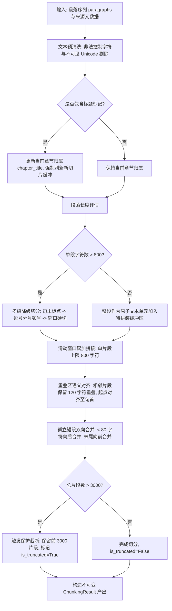

# Spec: 资料分块算法实现 - 技术契约

- **关联 Intent**: ZL-107
- **主导设计人**: Dev
- **当前状态**: Draft / In-Review / Approved

---

## 1. 架构流向与设计方案

### 1.1 模块定位与分层防线
资料分块算法位于智练后端五层架构的纯函数计算核：
- **物理路径**: `backend/app/core/algorithms/material_chunking.py`
- **分层约束**: 严格属于纯函数计算核（Pure Functional Kernel），依赖仅限 Python 标准库（`re`, `dataclasses`, `typing`, `unicodedata`）。绝对禁止导入 `fastapi`, `sqlalchemy`, `httpx`, `redis`, `boto3` 等网络、数据库与 Web 框架依赖，严禁导入上层业务模块 `app/services` 与 `app/repositories`。

### 1.2 核心数据流与状态机
资料分块算法接收解析层输出的原始段落序列与可选来源元数据，执行清洗、断句、窗口聚合、重叠回溯与短段合并，最终输出不可变的切分结果：



### 1.3 白盒复杂度控制与函数拆分设计 ($V(G) \le 12$)
为严格遵守《代码管理工作介绍》第 4.2 节关于主切分函数环路复杂度 $V(G) \le 12$ 的红线要求，将切分流程解耦为 5 个无状态独立子函数：

1. `clean_text_and_count_removals(text: str) -> tuple[str, int]` ($V(G) \le 3$)
   - 过滤非法控制字符（除 `\n` 和 `\t` 外的 ASCII `\x00-\x08`, `\x0b-\x0c`, `\x0e-\x1f`, `\x7f`）及零宽字符（`\u200b-\u200f`, `\ufeff` 等）。
   - 返回清洗后文本及剔除字符数。
2. `split_long_paragraph_into_sentences(text: str, max_chars: int) -> list[str]` ($V(G) \le 8$)
   - 标点多级降级切分：
     - 一级切分：句末标点（中文 `。！？` 与英文 `.!?.` 以及换行符 `\n`）；
     - 二级降级：若单句仍超长，在窗口内寻找次级标点（中文 `，；、` 与英文 `,;`）；
     - 三级降级：仍无标点或单块超长，按 `max_chars` 窗口硬切；
     - 10 倍超长单段（> 8000 字符）：前置按固定窗口硬切，再在窗口内按标点二次微调。
3. `align_overlap_sentence_boundary(prev_text: str, overlap_chars: int) -> str` ($V(G) \le 5$)
   - 提取上一个片段末尾 `overlap_chars` 范围的子串；
   - 优先寻找最近的句子或子句起始位置进行对齐；若无合适标点，则直接使用原切片，避免破坏词句。
4. `merge_isolated_short_snippets(snippets: list[Snippet], min_chars: int) -> list[Snippet]` ($V(G) \le 6$)
   - 扫描初步切片列表，对字符数 $< 80$ 的孤立片段执行合并：
     - 非末尾短片段：向后合并入下一个片段，换行符分隔；
     - 末尾短片段：向前合并入上一个片段；
     - 全文仅一个短段：保持原样，不报错。
5. `split_material_into_snippets(...) -> ChunkingResult` ($V(G) \le 10$)
   - 主流程纯函数，协调清洗、章节标题追踪、段落装配、重叠滑动、3000 上限安全截断与不可变对象生成。

---

## 2. API 与数据契约设计

### 2.1 依赖与调用契约
本模块为底层纯算法计算核，不直接暴露 HTTP 接口，由上层服务 `backend/app/services/material_service.py` 导入调用。输入输出均采用强类型不可变领域模型（基于 Python `dataclasses.dataclass(frozen=True)`）。

### 2.2 数据结构设计 (DTO)

```python
from dataclasses import dataclass
from typing import Sequence

@dataclass(frozen=True)
class ParagraphInput:
    """输入段落结构化描述（可选扩展格式）"""
    text: str
    source_ref: str = "段落"         # 原文溯源信息（如: '第 1 页', '幻灯片 3', '照片第 2 页'）
    doc_type: str = "txt"           # 资料类型（'pdf', 'pptx', 'txt', 'ocr'）
    is_title: bool = False          # 是否为章节标题标记
    title_level: int = 0            # 标题层级（1 为一级标题，依此类推）

@dataclass(frozen=True)
class Snippet:
    """输出的不可变知识片段"""
    index: int                      # 片段在整份资料中的顺序号（从 0 开始自增）
    content: str                    # 片段正文文本
    char_count: int                 # 片段字符数（len(content)）
    start_offset: int               # 在清洗后整篇材料全局文本中的起始字符偏移量
    end_offset: int                 # 在清洗后整篇材料全局文本中的结束字符偏移量
    chapter_title: str              # 所属章节标题（未识别则为空字符串 ""）
    source_ref: str                 # 来源标记（继承自首个归属段落）
    doc_type: str                   # 资料类型标记（继承自首个归属段落）

@dataclass(frozen=True)
class ChunkingResult:
    """资料分块算法统一输出包装对象"""
    snippets: tuple[Snippet, ...]   # 产出的不可变知识片段元组（保障只读安全）
    total_count: int                # 切分实际产出的片段总数（截断前）
    is_truncated: bool              # 是否触发 3000 片段保护截断
    max_chars: int                  # 生效的片段字符数上限
    overlap_chars: int              # 实际生效的重叠字符数
    cleaned_chars_count: int        # 预清洗阶段剔除的非法字符总数
    warnings: tuple[str, ...]       # 告警与降级信息列表（如重叠超限优雅降级、超长截断等）
```

### 2.3 主函数签名
```python
def split_material_into_snippets(
    paragraphs: Sequence[str | ParagraphInput],
    max_chars: int = 800,
    overlap_chars: int = 120,
    default_doc_type: str = "txt",
    default_source_ref: str = "段落",
) -> ChunkingResult:
    """把解析后的段落序列切分为可检索的知识片段。

    Args:
        paragraphs: 段落序列，支持原生字符串或 ParagraphInput 结构体。
        max_chars: 单个片段字符数上限，默认 800。
        overlap_chars: 相邻片段字符重叠量，默认 120（约 15%）。
        default_doc_type: 字符串段落默认的资料类型标记。
        default_source_ref: 字符串段落默认的来源标记。

    Returns:
        ChunkingResult: 包含只读知识片段列表、截断状态与审计元数据的包装对象。

    Raises:
        ValueError: 当 max_chars <= 0 或 overlap_chars < 0 时抛出。
    """
```

### 2.4 异常与降级约定
- **非致命异常优雅降级**:
  - 当 `overlap_chars >= max_chars` 时：系统不抛出崩溃异常，自动优雅退化为无重叠切分（`effective_overlap = 0`），并在 `warnings` 中记录 `"overlap_chars >= max_chars, degraded to 0 overlap"`；
  - 当输入全部为空字符串或仅空白字符时：返回空片段元组 `snippets = ()`，`total_count = 0`，`is_truncated = False`；
- **致命参数校验**:
  - 若 `max_chars <= 0` 或 `overlap_chars < 0`，属于调用方致命逻辑错误，显式抛出 `ValueError`。
- **业务错误码映射（供服务层映射）**:
  - `10001`: 参数校验失败（当底层抛出 ValueError 时上层捕获转换）；
  - `40001`: 资料质量不达标（当切分结果有效片段数为 0 且原文非空时由服务层阻断）。

---

## 3. 可测性设计 (Design for Testability)

### 3.1 独立纯函数计算核
- 算法完全封装在 `backend/app/core/algorithms/material_chunking.py`；
- 无任何 I/O、时间戳（`datetime.now()`）、随机数或系统环境变量依赖；
- 相同输入在任意 OS、任意时区执行必定产生完全一致的切分序列与偏移量（绝对确定性）。

### 3.2 外部依赖与 Mock 策略
- **0 Mock 策略**: 根据项目架构规范，纯函数计算核测试**严格禁止使用 Mock/Patch 替身打桩**；
- 单元测试运行在毫秒级，后端全套单测必须在 30 秒内完成；
- 分支覆盖率目标：**100% 分支覆盖率**，行覆盖率 $\ge 95\%$。

### 3.3 等价类与边界值测试用例表

| 用例编号 | 测试场景 / 等价类划分 | 输入特征与边界参数 | 预期断言与行为判定 | 对应规范要求 |
| :--- | :--- | :--- | :--- | :--- |
| **TC-CHUNK-01** | 空输入与空段落 | `paragraphs = []` | 返回 `total_count = 0`, `snippets = ()`, `is_truncated = False` | 边界值：空输入 |
| **TC-CHUNK-02** | 全空白字符段落 | `paragraphs = ["   ", "\n\t", "  \n  "]` | 过滤后有效内容为空，返回 `total_count = 0`, `snippets = ()` | 边界值：全空白输入 |
| **TC-CHUNK-03** | 单字符极小边界 | `paragraphs = ["A"]` | 返回 1 个片段，`char_count = 1`，偏移量正确 | 边界值：长度取 1 |
| **TC-CHUNK-04** | 恰好等于上限 | 单段长度正好 800 字符 | 单独成为 1 个片段，不触发切分，无重叠 | 边界值：恰等于上限 |
| **TC-CHUNK-05** | 上限加一越界 | 单段长度 801 字符 | 触发切分，分为 2 个片段，且按标点切断 | 边界值：上限加一 |
| **TC-CHUNK-06** | 重叠量下界 | `overlap_chars = 0` | 正常切分，相邻片段间无字符重叠 | 边界值：重叠取 0 |
| **TC-CHUNK-07** | 重叠量等于上限 | `overlap_chars = 800, max_chars = 800` | 优雅降级为 0 重叠，`warnings` 包含降级说明，程序不崩溃 | 边界值：重叠等于上限 |
| **TC-CHUNK-08** | 重叠量超过上限 | `overlap_chars = 1000, max_chars = 800` | 优雅降级为 0 重叠，`warnings` 包含降级说明，程序不崩溃 | 异常边界：重叠超限 |
| **TC-CHUNK-09** | 致命参数防御 | `max_chars = 0` 或 `overlap_chars = -1` | 抛出 `ValueError` | 参数校验防御 |
| **TC-CHUNK-10** | 一级句末标点降级 | 1200 字段落，含 `。！？\n` | 优先在句末标点处断句，片段字符数 $\le 800$ | 降级机制：一级标点 |
| **TC-CHUNK-11** | 二级标点降级 | 1200 字段落，无句末标点，仅含 `，；、` | 降级在逗号/分号处断句，片段字符数 $\le 800$ | 降级机制：二级标点 |
| **TC-CHUNK-12** | 三级硬切降级 | 1200 字无标点连续字符串 | 严格按 800 字符窗口硬切，保障程序正常执行 | 降级机制：三级硬切 |
| **TC-CHUNK-13** | 10 倍超长单段 | 单段长度 8500 字符（> 8000 字） | 先按固定窗口硬切，再在窗口内二次微调，无内存暴涨 | 极端边界：单段超长 |
| **TC-CHUNK-14** | 孤立短段中间向后合并 | 段落 A(700字), 段落 B(50字), 段落 C(600字) | 段落 B (<80字) 自动合并到段落 C 所在切片中 | 业务规则：孤立短段合并 |
| **TC-CHUNK-15** | 孤立短段末尾向前合并 | 段落 A(700字), 段落 B(50字) (无后续) | 段落 B (<80字) 自动合并到段落 A 所在切片中 | 业务规则：末尾短段向前合并 |
| **TC-CHUNK-16** | 章节标题标记处理 | 段落含 `is_title = True` | 标题强制开启新切片，作为后续切片的 `chapter_title`，自身不出切片 | 业务规则：标题继承 |
| **TC-CHUNK-17** | 3000 片段保护截断 | 生成 3100 个片段的大型资料 | `is_truncated = True`, `total_count = 3100`, `len(snippets) == 3000` | 安全保护：片段截断 |
| **TC-CHUNK-18** | 非法 Unicode 清洗 | 文本含 `\x00`, `\u200b`, `\ufeff` 等 | 字符被剔除，`cleaned_chars_count > 0`，偏移量与清洗后内容一致 | 数据安全：字符清洗 |
| **TC-CHUNK-19** | 20 万字性能吞吐基准 | 20 万汉字教材解析文本 | 算法切分全过程耗时 $\le 2\text{s}$，循环内无低效字符串拼接 | 性能红线：NFR-22 |

---

## 4. 替代方案与权衡考量 (Alternatives Considered & Trade-offs)

### 4.1 评估过的替代方案

- **方案 A (当前采纳方案)**: 基于多级标点降级、滑动窗口回溯对齐与纯函数状态机的轻量自研实现。
- **方案 B**: 采用 LangChain 社区标准 `RecursiveCharacterTextSplitter`。
- **方案 C**: 基于 Jieba / Spacy 等中文自然语言分词与依存句法分析库的切分方案。

### 4.2 未采纳原因与权衡分析

| 维度 | 方案 A: 纯函数状态机 (当前方案) | 方案 B: LangChain 文本切分器 | 方案 C: NLP 分词句法切分器 |
| :--- | :--- | :--- | :--- |
| **分层依赖合规性** | **完全合规**：纯 Python 标准库，0 外部依赖，完全符合架构分层 | **严重违规**：违背纯函数核禁止导入第三方重型框架的红线 | **部分违规**：引入重型分词 C 扩展库与内存字典 |
| **业务契约匹配度** | **完美匹配**：原生支持章节标题继承、来源元数据跨页继承、孤立短段向后合并与 3000 片段只读封装 | **匹配差**：无法直接处理标题绑定、短段合并及多层级来源映射，需大量二次包装外围修补 | **匹配度中**：对分句有帮助，但无法处理智练特有的章节继承与来源元数据绑定 |
| **中文标点与重叠对齐** | **精细化控制**：句末标点 $\rightarrow$ 次级标点 $\rightarrow$ 强制硬切三级降级，重叠起点对齐至句首 | **粗粒度切分**：多按字符列表遍历，容易出现重叠切断在中文词汇中间的截断现象 | **开销过大**：分词对 800 字粒度知识片段属于过度计算，得不偿失 |
| **执行性能与测试开销** | **极高**：20 万字符耗时 $< 0.3\text{s}$，单测毫秒级，无字典加载开销 | **中等**：依赖对象创建开销与复杂递归栈 | **极差**：模型与字典加载需数秒，严重拖慢单测 30 秒整体门禁 |

综合上述权衡，方案 A 在分层架构纯洁性、业务规则适配度、算法可控性与执行性能上全面胜出。

---

## 5. 动态风险核验与回滚预案 (Risk & Rollback Verification)

### 5.1 七维风险动态核验矩阵

- [x] **Files (文件破坏面)**:
  - 仅新增纯算法实现 `backend/app/core/algorithms/material_chunking.py` 与单测 `backend/tests/unit/core/algorithms/test_material_chunking.py`；
  - 核心已有文件无任何修改，无 Git 冲突与代码合并破坏风险。
- [x] **API (对外接口契约)**:
  - 本模块仅为内部纯函数 DTO 契约，不暴露任何 HTTP 路由或改变现有公共 API 契约。
- [x] **Schema (数据库模型与存储)**:
  - 无任何数据库 Schema、表字段或 pgvector 索引变更，纯内存无状态计算。
- [x] **Auth (鉴权与越权风险)**:
  - 纯函数不参与鉴权与权限校验；用户隔离由上层 `material_service` 在调用本算法前后通过 `user_id` 物理保障。
- [x] **Deps (第三方依赖变更)**:
  - 纯标准库实现（`re`, `dataclasses`, `typing`, `unicodedata`），0 引入第三方库，无需更新 `requirements.txt`。
- [x] **Rollback (回滚难度与迁移)**:
  - 无数据库迁移升级/降级问题；若出现严重线上缺陷，通过 Git Revert 回滚代码后重新部署即可在 1 分钟内完成，无任何状态残留。
- [x] **Blast Radius (爆炸半径评估)**:
  - 爆炸半径严格限定在“学习资料解析导入后的切分环节”；不波及用户管理、已存在题目、判题引擎与诊断报告主流程。

### 5.2 回滚与故障应急策略
- **线上发布回滚**: 若切分算法在线上集成测试或灰度发布中出现未预期的边界缺陷，执行标准 Git Revert 撤销合并提交并自动化重新部署，业务数据库无需任何逆向修复。
- **服务层降级保护**: 上层 `material_service` 针对切分调用设有兜底保护：若分块算法抛出参数异常或返回有效片段数为 0，任务状态标记为解析失败并记录详细脱敏审计指标，不会造成系统死锁或数据库脏写入。

---

## 6. 阶段准出签批 (Gate 2 Sign-off)
- [x] 架构流向与 API 契约已冻结
- [x] 替代方案已完成推演与权衡
- [x] 7 维风险已核验且具备明确回滚预案
- **审查结论**: Approved
- **签批人 / 日期**: yezisama / 2026-09-23
