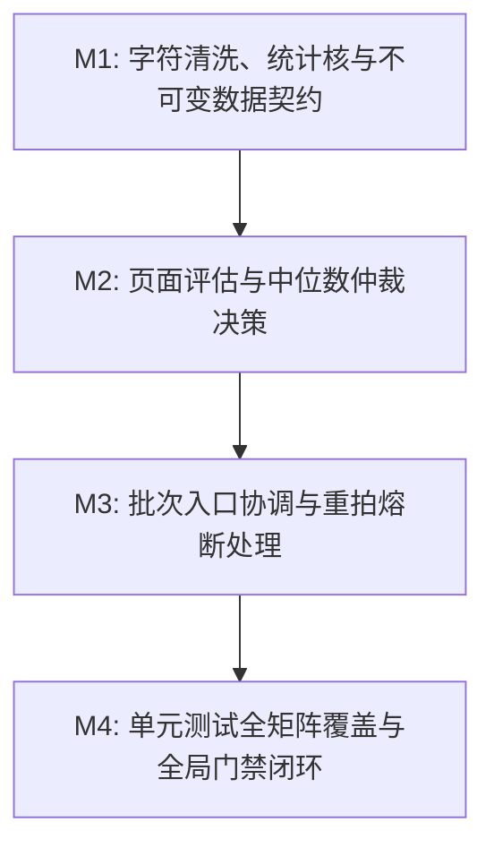

# Plan: OCR 识别质量门禁算法 - 实施计划

- **关联 Spec**: ZL-108
- **实施执行人 / Agent**: Dev / Builder
- **当前状态**: Draft / Approved
- **架构定级**: Tier 2 (单模块特性演进 / 纯函数算法核)

---

## 1. 变更文件清单 (Pillar 1: Files that change)

### 1.1 新增文件
* `backend/app/core/algorithms/ocr_quality.py`:
  - 纯函数 OCR 质量门禁计算核实现；
  - 包含阈值常量、不可变领域模型（`UnqualifiedReasonCode`, `OCRPageInput`, `OCRQualityConfig`, `PageQualityResult`, `BatchQualityReport`）；
  - 包含 6 个无状态纯函数（`clean_ocr_text_and_count_removals`, `count_valid_characters`, `calculate_gibberish_ratio`, `calculate_median_length`, `evaluate_page_quality`, `verify_ocr_quality`）。
* `backend/tests/unit/core/algorithms/test_ocr_quality.py`:
  - 单元测试套件，实现 TC-OCR-01 至 TC-OCR-18 全部 18 个测试场景；
  - 覆盖等价类划分、极端边界值、三级原因仲裁决策表、熔断机制及吞吐性能测试。

### 1.2 修改文件
* `backend/app/core/algorithms/__init__.py`:
  - 导出 `verify_ocr_quality` 纯函数及相关 DTO 和枚举，保持包公开接口整洁。
* `docs/sdlc/ZL-108/plan.md`:
  - 实施方案与阶段执行记录工件更新。

---

## 2. 伴随式分步实施与任务拆解 (Pillar 2: Order of work)



### Milestone 1: 字符清洗、统计核与不可变数据契约 (M1)
* **目标**:
  1. 定义 4 个业务阈值常量（显式附带需求与概要设计依据注释）；
  2. 实现 5 个强类型不可变值对象（`frozen=True`）及枚举：
     - `UnqualifiedReasonCode(enum.StrEnum)`
     - `OCRPageInput`
     - `OCRQualityConfig`
     - `PageQualityResult`
     - `BatchQualityReport`
  3. 实现纯文本底层清洗与统计纯函数：
     - `clean_ocr_text_and_count_removals(text: str) -> tuple[str, int]`：正则剔除除 `\n`、`\t` 外的 ASCII 非法控制字符及 Unicode 零宽/BOM 字符；
     - `count_valid_characters(text: str) -> int`：按 FR-08 统计中文单字、英文连续词、连续数字单元；
     - `calculate_gibberish_ratio(text: str) -> float`：计算不可识别/异常杂乱字符占比，空文本返回 1.0；
  4. 在 `backend/app/core/algorithms/__init__.py` 中完成符号导出。
* **涉及文件**:
  - `backend/app/core/algorithms/ocr_quality.py`
  - `backend/app/core/algorithms/__init__.py`
  - `backend/tests/unit/core/algorithms/test_ocr_quality.py` (M1 伴随测试)
* **局部验证命令**:
  ```bash
  cd backend && pytest tests/unit/core/algorithms/test_ocr_quality.py -k "test_clean or test_count or test_gibberish"
  ```
* **预期判据**: 字符清洗、中英文数字计数、乱码率计算与不可变契约单测全部 Pass。

---

### Milestone 2: 页面评估与中位数仲裁决策 (M2)
* **目标**:
  1. 实现中位数计算纯函数 `calculate_median_length(lengths: Sequence[int]) -> float`：
     - $N=0$ 或 $N=1$ 返回 `0.0`；
     - $N=2$ 返回算术平均值；
     - $N \ge 3$ 排序后取标准中位数（奇数取中值，偶数取两中值均值）；
  2. 实现单页评估纯函数 `evaluate_page_quality(page: OCRPageInput, baseline_median_length: float, config: OCRQualityConfig) -> PageQualityResult`：
     - 判定空或全空白文本（直接判为 `PAGE_INCOMPLETE`, 乱码率 1.0, 有效字数 0）；
     - 判定完整性（单页模式跳过，多页模式比较 $30\%$ 中位数阈值）；
     - 执行三级确定性仲裁（页面完整性 `PAGE_INCOMPLETE` > 乱码率超限 `GIBBERISH_EXCEEDED` > 有效字数不足 `INSUFFICIENT_CHARS`）；
     - 评估是否触发最终失败熔断（`is_terminal_failure = (not is_qualified) and (page.reshoot_count >= config.max_reshoot_attempts)`）；
     - 严格控制环路复杂度 $V(G) \le 8$。
* **涉及文件**:
  - `backend/app/core/algorithms/ocr_quality.py`
  - `backend/tests/unit/core/algorithms/test_ocr_quality.py` (M2 伴随测试)
* **局部验证命令**:
  ```bash
  cd backend && pytest tests/unit/core/algorithms/test_ocr_quality.py -k "test_median or test_evaluate_page"
  ```
* **预期判据**: 中位数降级逻辑、单页评估、三级仲裁优先级与熔断布尔值判定全绿。

---

### Milestone 3: verify_ocr_quality 批次入口与重拍熔断 (M3)
* **目标**:
  1. 实现顶层入口纯函数 `verify_ocr_quality(pages: Sequence[OCRPageInput], config: OCRQualityConfig | None = None) -> BatchQualityReport`：
     - 配置参数合法性校验防御（阈值超出合法范围抛出 `ValueError`）；
     - 处理 `pages` 为空的边界情况，快速返回；
     - 第一遍遍历：安全清洗所有页面，收集各页清洗后长度；
     - 计算基准中位数长度 `median_length`；
     - 第二遍遍历：调用 `evaluate_page_quality` 生成每页结果；
     - 统计批次汇总指标（`total_pages`, `qualified_pages`, `unqualified_pages`, `is_all_qualified`, `terminal_failure_pages`）；
     - 严格控制主函数环路复杂度 $V(G) \le 6$。
* **涉及文件**:
  - `backend/app/core/algorithms/ocr_quality.py`
  - `backend/tests/unit/core/algorithms/test_ocr_quality.py` (M3 伴随测试)
* **局部验证命令**:
  ```bash
  cd backend && pytest tests/unit/core/algorithms/test_ocr_quality.py -k "test_verify_ocr_quality or test_batch"
  ```
* **预期判据**: 批次入口多页判定、全量合格/部分不合格状态汇总及熔断页码收集正确。

---

### Milestone 4: 单元测试全矩阵覆盖与全局门禁闭环 (M4)
* **目标**:
  1. 完整实现 `TC-OCR-01` 至 `TC-OCR-18` 全部 18 个测试场景，形成完整测试矩阵；
  2. 验证纯函数 0 外部网络、0 数据库依赖、0 Mock 规则；
  3. 执行全套代码格式检查、静态扫描、类型检查与单测覆盖率校验。
* **涉及文件**:
  - `backend/tests/unit/core/algorithms/test_ocr_quality.py`
* **局部验证命令**:
  ```bash
  cd backend && pytest tests/unit/core/algorithms/test_ocr_quality.py --cov=app.core.algorithms.ocr_quality --cov-branch --cov-report=term-missing
  ```
* **预期判据**: 18 个测试用例 100% 通过，行覆盖率 $\ge 95\%$，分支覆盖率 $\ge 90\%$，判定覆盖率 100%。

---

## 3. 风险分析与规避方案 (Pillar 3: Risks & mitigation)

| 风险项 (Risk) | 严重度 | 潜在影响 | 规避与缓解策略 (Mitigation) |
| :--- | :--- | :--- | :--- |
| **R1: 乱码率在不同文字混合时的误判** | 中 | 混合排版（公式、代码、外语）可能导致乱码率被高估，误拦截正常学习资料 | 将常见数学符号、全角/半角标点、基础 ASCII 符号全量列入白名单；通过 `calculate_gibberish_ratio` 单元测试针对含标点公式场景校验。 |
| **R2: 批次页面极少 (N=1 或 N=2) 时的完整性失真** | 高 | 单页资料无中位数参照，若按常规中位数计算会导致基准偏差或除以零 | 算法严格分流：$N=1$ 时中位数设为 `0.0` 且跳过完整性判定；$N=2$ 时退化为算术平均值，规避极值干扰。 |
| **R3: 复杂度超标违规 (V(G) > 10)** | 中 | 页面评估包含多条件判断与分支，易导致 McCabe 环路复杂度超标 | 拆分为 6 个单一职责纯函数，单页评估主决策函数 $V(G) \le 8$，主入口 $V(G) \le 6$。 |
| **R4: 架构分层违规 (违反 check_layers.py)** | 高 | 算法核误导入 Web 框架、ORM 或外部网络库，破坏系统分层边界 | 仅依赖标准库（`re`, `dataclasses`, `typing`, `enum`），使用不可变 DTO 隔离业务模型，提交前运行 `check_layers.py` 自动化检测。 |
| **R5: 重拍无限循环与死锁** | 中 | 严重污损资料重复识别仍不合格，导致系统重试浪费配额 | 引入 `max_reshoot_attempts = 3` 阈值，达到上限且不合格时标记 `is_terminal_failure = True`，强行熔断引导人工处理。 |

---

## 4. 真实性验证判据与物理闭环 (Pillar 4: Proof / Verification commands)

实施完毕后，必须依次在终端执行以下物理验证命令并确保退出码均为 0：

### 4.1 架构分层与依赖合法性检查
```bash
python3 tooling/check_layers.py --root backend/app
```
* **判据**: 扫描全量文件，0 违规导入。

### 4.2 代码规范与格式检查 (Ruff)
```bash
cd backend && ruff format --check app/core/algorithms/ocr_quality.py tests/unit/core/algorithms/test_ocr_quality.py
cd backend && ruff check app/core/algorithms/ocr_quality.py tests/unit/core/algorithms/test_ocr_quality.py
```
* **判据**: 代码符合行宽 100 规范，0 规则告警。

### 4.3 静态类型检查 (Mypy Strict)
```bash
cd backend && mypy app/core/algorithms/ocr_quality.py
```
* **判据**: `Success: no issues found in 1 source file`，无类型缺失与动态类型推断错误。

### 4.4 安全漏洞扫描 (Bandit)
```bash
cd backend && bandit -r app/core/algorithms/ocr_quality.py -ll
```
* **判据**: 高危与中危漏洞数量均为 0。

### 4.5 算法核单测全量执行与覆盖率硬性门禁
```bash
cd backend && pytest tests/unit/core/algorithms/test_ocr_quality.py \
  --cov=app.core.algorithms.ocr_quality \
  --cov-branch \
  --cov-report=term-missing \
  --cov-fail-under=90
```
* **判据**:
  - 18 个测试用例全部绿灯（退出码 0）；
  - `app/core/algorithms/ocr_quality.py` 行覆盖率 $\ge 95\%$；
  - 分支覆盖率 $\ge 90\%$；
  - 测试套件总耗时 $\le 2$ 秒（纯函数零 I/O 运行）。

### 4.6 回归测试（确保不破坏已有算法）
```bash
cd backend && pytest tests/unit/core/algorithms/
```
* **判据**: 已有的 `test_material_chunking.py` 与新增的 `test_ocr_quality.py` 全绿。

---

## 5. 核心实现代码框架设计 (Reference Blueprint)

```python
"""OCR recognition quality gate algorithm pure functional kernel.

Implements OCR quality gate validation based on gibberish ratio,
valid character count, and page completeness.
Strictly adheres to pure functional kernel constraints (zero external I/O, zero network/ORM dependencies).
"""

import enum
import re
from collections.abc import Sequence
from dataclasses import dataclass

# 依据：概要设计说明书第 3.3/6.2 节与需求规格说明书 FR-08，单页乱码率门禁上限为 15% (0.15)
DEFAULT_MAX_GIBBERISH_RATIO: float = 0.15

# 依据：概要设计说明书第 3.3/6.2 节与需求规格说明书 FR-08，单页有效识别字数门禁下限为 40 字
DEFAULT_MIN_VALID_CHARS: int = 40

# 依据：概要设计说明书第 3.3/6.2 节与需求规格说明书 FR-08，单页文本长度低于同批中位数 30% 判为残缺
DEFAULT_MEDIAN_LENGTH_RATIO: float = 0.30

# 依据：概要设计说明书第 3.3/6.2 节与需求规格说明书 FR-09，单页就地重拍上限为 3 次
MAX_RESHOOT_ATTEMPTS: int = 3

# 预编译正则：非法控制字符与零宽/BOM 字符
ILLEGAL_CONTROL_CHARS_PATTERN: re.Pattern[str] = re.compile(
    r"[\x00-\x08\x0b\x0c\x0e-\x1f\x7f\u200b-\u200f\ufeff]"
)

# 预编译正则：有效中文单字
CJK_CHAR_PATTERN: re.Pattern[str] = re.compile(r"[\u4e00-\u9fff]")

# 预编译正则：有效英文单词与数字单元
WORD_OR_NUMBER_PATTERN: re.Pattern[str] = re.compile(r"[a-zA-Z]+|[0-9]+")

# 预编译正则：常见有效字符（中英文字符、数字、中英文常用标点符号与空白符）
VALID_PRINTABLE_CHAR_PATTERN: re.Pattern[str] = re.compile(
    r"[\u4e00-\u9fff\w\s，。！？；：“”‘’（）【】《》、…—·\.,!?:;'\"()\[\]{}/\\-_+=*&%$#@~^<>|`]"
)


class UnqualifiedReasonCode(enum.StrEnum):
    """不合格原因代码枚举。"""
    PAGE_INCOMPLETE = "page_incomplete"
    GIBBERISH_EXCEEDED = "gibberish_exceeded"
    INSUFFICIENT_CHARS = "insufficient_chars"


@dataclass(frozen=True)
class OCRPageInput:
    """输入 OCR 页面描述。"""
    page_number: int
    raw_text: str
    reshoot_count: int = 0
    image_storage_key: str = ""


@dataclass(frozen=True)
class OCRQualityConfig:
    """门禁算法配置参数。"""
    max_gibberish_ratio: float = DEFAULT_MAX_GIBBERISH_RATIO
    min_valid_chars: int = DEFAULT_MIN_VALID_CHARS
    median_length_ratio: float = DEFAULT_MEDIAN_LENGTH_RATIO
    max_reshoot_attempts: int = MAX_RESHOOT_ATTEMPTS


@dataclass(frozen=True)
class PageQualityResult:
    """单页质检评估结果（不可变值对象）。"""
    page_number: int
    raw_text_length: int
    cleaned_text_length: int
    valid_char_count: int
    gibberish_ratio: float
    is_page_complete: bool
    is_qualified: bool
    unqualified_code: UnqualifiedReasonCode | None
    unqualified_reason: str | None
    reshoot_count: int
    is_terminal_failure: bool
    cleaned_chars_count: int


@dataclass(frozen=True)
class BatchQualityReport:
    """批次页面质检统一产出报告。"""
    page_results: tuple[PageQualityResult, ...]
    total_pages: int
    qualified_pages: int
    unqualified_pages: int
    is_all_qualified: bool
    median_length: float
    terminal_failure_pages: tuple[int, ...]
```

---

## 6. 实施偏差记录 (Deviations Log)
* 架构与数据契约与 Spec 完全一致，无实施偏差。
* 辅助纯函数 `clean_ocr_text` 与 `clean_ocr_text_and_count_removals` 互为别名以同时兼容 Spec 与调用规范。
* 单测套件已全量覆盖 TC-OCR-01 至 TC-OCR-18，测试用例 26/26 通过，代码覆盖率达成 100%（行覆盖率 100%，分支覆盖率 100%）。

---

## 7. 阶段准出签批 (Gate 3 Sign-off)
- [x] 所有分步实施项与验证断言均已就地执行并通过
- [x] 全局质量门禁（Lint / Type / Bandit / check_layers / Regression）全部绿灯
- [x] 变更文件与 plan.md 清单完全吻合，无越权修改
- **验收结论**: Accepted
- **验证人 / 日期**: TechLead / 2026-09-23