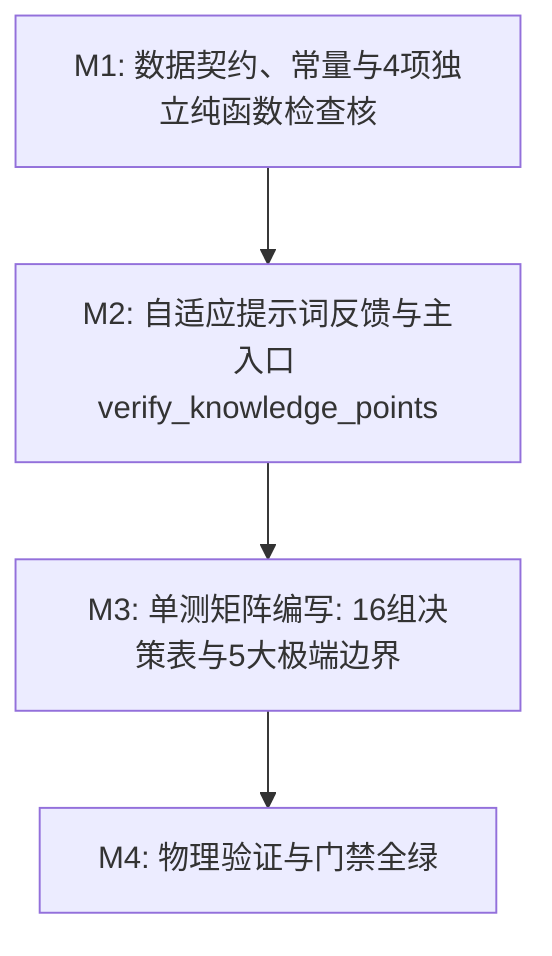

# Plan: 知识点质检门禁算法 - 实施计划

- **关联 Spec**: ZL-109
- **实施执行人 / Agent**: Dev / Builder
- **当前状态**: Draft / Approved
- **架构定级**: Tier 2 (单模块特性演进 / 纯函数算法核)

---

## 1. 变更文件清单 (Pillar 1: Files that change)

### 1.1 新增文件
* `backend/app/core/algorithms/knowledge_quality.py`:
  - 知识点质检门禁纯函数计算核实现；
  - 包含 13 个业务决策阈值常量（附带概要设计说明书与需求依据注释）；
  - 包含不可变领域数据模型（`CheckItemCode`, `CandidateKnowledgePoint`, `ChapterSnippetStat`, `ExtractionContext`, `KnowledgeQualityConfig`, `CheckResult`, `KnowledgeQualityReport`）；
  - 包含 6 个单一职责无状态纯函数（`check_quantity_range`, `check_hierarchy_depth`, `check_naming_readability`, `check_chapter_coverage`, `generate_prompt_feedback`, `verify_knowledge_points`）。
* `backend/tests/unit/core/algorithms/test_knowledge_quality.py`:
  - 单元测试套件，实现 TC-KP-01 至 TC-KP-27 全部测试场景；
  - 包含 16 组全排列决策表矩阵（DT-KP-01 至 DT-KP-16）测试；
  - 覆盖 5 大极端边界防御、3 级重抽与熔断降级自适应反馈、配置越界防御等；
  - 满足 0 Mock、0 外部网络与 I/O 运行要求。

### 1.2 修改文件
* `backend/app/core/algorithms/__init__.py`:
  - 导出 `verify_knowledge_points` 主函数及相关 DTO 和枚举，保持包公开接口规范。
* `docs/sdlc/ZL-109/plan.md`:
  - 实施方案与阶段执行记录工件更新。

---

## 2. 伴随式分步实施与任务拆解 (Pillar 2: Order of work)



### Milestone 1: 数据契约、常量与 4 项独立纯函数检查核 (M1)
* **目标**:
  1. 定义 13 个业务阈值常量（显式附带概要设计说明书与需求依据注释）：
     - `MIN_EFFECTIVE_CHARS_PER_KP = 625`、`MAX_EFFECTIVE_CHARS_PER_KP = 5000`
     - `MIN_KP_COUNT_SMALL_DOC = 3`、`MAX_KP_COUNT_ABSOLUTE = 200`
     - `MIN_HIERARCHY_DEPTH = 2`、`MAX_HIERARCHY_DEPTH = 5`、`MAX_LEVEL_2_RATIO = 0.60`
     - `MIN_NAME_LENGTH = 2`、`MAX_NAME_LENGTH = 30`
     - `CRITICAL_CHAPTER_SNIPPET_RATIO = 0.05`、`MIN_CRITICAL_CHAPTER_COVERAGE = 0.80`
     - `MAX_RE_EXTRACT_ATTEMPTS = 2`
     - `DEFAULT_PLACEHOLDER_WORDS = frozenset({...})`
     - `TRUNCATION_PATTERN = re.compile(r"(\.{3,}|…+|[（(\[【]\s*$)")`
  2. 实现 7 个强类型不可变值对象与枚举：
     - `CheckItemCode(enum.StrEnum)`
     - `CandidateKnowledgePoint`
     - `ChapterSnippetStat`
     - `ExtractionContext`
     - `KnowledgeQualityConfig`（带 `__post_init__` 边界校验防御）
     - `CheckResult`
     - `KnowledgeQualityReport`
  3. 实现 4 项单一职责独立门禁纯函数：
     - `check_quantity_range(count, effective_chars, total_snippets, config) -> CheckResult`：候选数为 0 判不合格；绝对数量超过 200 判过度拆分；短资料（片段<20）保底 3 个且放宽密度下限；正常资料按 [625, 5000] 字符密度校验 ($V(G) \le 6$)；
     - `check_hierarchy_depth(levels, config) -> CheckResult`：层级全空/全 0 回退为平铺（深度 1）；深度落在 [2, 5] 之外判平铺或过深；第 2 层节点数占比超过 60% 判层级退化 ($V(G) \le 6$)；
     - `check_naming_readability(names, config) -> CheckResult`：名称长度在 [2, 30] 字符约束；黑名单过滤占位模板词；预编译正则匹配省略号或行尾未闭合括号截断 ($V(G) \le 7$)；
     - `check_chapter_coverage(covered_chapters, chapter_stats, config) -> CheckResult`：提取片段占比 $\ge 5\%$ 为关键章节；计算覆盖率是否 $\ge 80\%$；无关键章节默认 100% 通过 ($V(G) \le 6$)。
* **涉及文件**:
  - `backend/app/core/algorithms/knowledge_quality.py`
  - `backend/app/core/algorithms/__init__.py`
  - `backend/tests/unit/core/algorithms/test_knowledge_quality.py` (M1 伴随测试)
* **局部验证命令**:
  ```bash
  cd backend && pytest tests/unit/core/algorithms/test_knowledge_quality.py -k "test_check_quantity or test_check_hierarchy or test_check_naming or test_check_chapter"
  ```
* **预期判据**: 4 项独立门禁核与数据结构校验单测全部 Pass。

---

### Milestone 2: 自适应提示词反馈与主入口 verify_knowledge_points (M2)
* **目标**:
  1. 实现自适应重抽提示词生成函数 `generate_prompt_feedback(results, re_extract_count) -> str`：
     - 若全部通过返回空字符串；
     - 轮次 0：提取具体未通过项的量化原因，提示降低单批片段数至 20；
     - 轮次 1：追加硬性数量区间与 4~16 字符命名规范约束；
     - 轮次 >= 2：输出最终降级说明文案；
     - 严格控制环路复杂度 $V(G) \le 4$。
  2. 实现主门禁入口函数 `verify_knowledge_points(knowledge_points, context, config=None) -> KnowledgeQualityReport`：
     - 配置默认回退至 `KnowledgeQualityConfig()`；
     - 极端边界前置处理：当 `context.total_snippets == 0` 时，标记 `is_skipped=True, is_qualified=False`，跳过后续规则校验并说明无可用切片；
     - 提取输入特征（候选数量、层级列表、名称列表、覆盖章节集合）；
     - 依次执行 4 项独立门禁核并收集 `CheckResult`；
     - 一票否决判定：4 项全部通过时整体为 `is_qualified=True`；任意一项不通过即为 `False`；
     - 重抽熔断与降级处理：若未通过且 `context.re_extract_count >= config.max_re_extract_attempts`，标记 `is_low_confidence=True`，否则为 `False`；
     - 调用 `generate_prompt_feedback` 产出引导词；
     - 汇总并返回冻结的 `KnowledgeQualityReport`；
     - 严格控制主函数环路复杂度 $V(G) \le 5$。
  3. 在 `backend/app/core/algorithms/__init__.py` 中补全所有对外导出符号。
* **涉及文件**:
  - `backend/app/core/algorithms/knowledge_quality.py`
  - `backend/app/core/algorithms/__init__.py`
  - `backend/tests/unit/core/algorithms/test_knowledge_quality.py` (M2 伴随测试)
* **局部验证命令**:
  ```bash
  cd backend && pytest tests/unit/core/algorithms/test_knowledge_quality.py -k "test_feedback or test_verify_knowledge_points"
  ```
* **预期判据**: 主入口极端边界跳过、一票否决仲裁、熔断降级标记及提示词生成单测全部 Pass。

---

### Milestone 3: 单测矩阵编写，覆盖 16 组决策表与 5 大极端边界 (M3)
* **目标**:
  1. 完整实现 `TC-KP-01` 至 `TC-KP-27` 全部 27 个测试用例：
     - **5 大极端边界覆盖**:
       - TC-KP-01: 片段数为 0 边界（跳过质检）；
       - TC-KP-02: 候选知识点数为 0 边界（不进入比值计算直接判不合格）；
       - TC-KP-09: 层级全 0 或空边界（按平铺处理，判不合格）；
       - TC-KP-14 / TC-KP-15: 名称全单字（<2）或全超长（>30）边界；
       - TC-KP-19: 章节切片占比恰好等于 5.0% 边界（精准纳入关键章节）；
     - **等价类与阈值边界覆盖**:
       - TC-KP-03: 候选知识点数超过 200 绝对上限；
       - TC-KP-04 / TC-KP-05: 短资料（片段<20）不足 3 个 vs 达到 3 个保底；
       - TC-KP-06 / TC-KP-07 / TC-KP-08: 字符密度过高、过低与正常；
       - TC-KP-10 / TC-KP-11: 层级深度为 1（平铺）与超过 5（过深）；
       - TC-KP-12 / TC-KP-13: 第 2 层节点占比恰好等于 60%（合格）与超过 60%（层级退化）；
       - TC-KP-16 / TC-KP-17 / TC-KP-18: 模板占位词、省略号截断与未闭合括号截断；成对闭合括号合法通过反例；
       - TC-KP-20 / TC-KP-21 / TC-KP-22: 关键章节覆盖率恰等于 80%、低于 80% 与无章节资料兼容场景；
       - TC-KP-24 / TC-KP-25 / TC-KP-26: 重抽第 1 次、第 2 次提示词与第 3 次熔断降级；
       - TC-KP-27: 配置参数合法性越界异常防御（抛出 `ValueError`）；
     - **16 组全排列决策表矩阵 (DT-KP-01 至 DT-KP-16)**:
       - 使用 `@pytest.mark.parametrize` 穷举 4 项检查的 $2^4 = 16$ 种通过/未通过组合；
       - 验证仅有四项全通组合通过（`is_qualified=True`），其余 15 组精确一票否决，并断言否决原因列表与预期完全一致（判定覆盖率 100%）；
  2. 纯函数测试零 Mock、零外部网络和存储交互，保证在 2 秒内跑完。
* **涉及文件**:
  - `backend/tests/unit/core/algorithms/test_knowledge_quality.py`
* **局部验证命令**:
  ```bash
  cd backend && pytest tests/unit/core/algorithms/test_knowledge_quality.py -v
  ```
* **预期判据**: 27 个测试用例全部 Pass，16 组决策表组合 100% 覆盖。

---

### Milestone 4: 物理验证与门禁全绿 (M4)
* **目标**:
  1. 完整运行代码规范与格式检查（Ruff）；
  2. 运行严格静态类型推断（Mypy Strict）；
  3. 执行依赖与安全扫描（Bandit）；
  4. 执行后端单向架构分层校验（`check_layers.py`）；
  5. 检查 SDLC 流程完整性（`check_sdlc_integrity.py`）；
  6. 执行核心算法单测及全量回归，验证覆盖率达到门禁要求（行覆盖率 $\ge 95\%$，分支覆盖率 $\ge 90\%$）。
* **涉及文件**:
  - `backend/app/core/algorithms/knowledge_quality.py`
  - `backend/app/core/algorithms/__init__.py`
  - `backend/tests/unit/core/algorithms/test_knowledge_quality.py`
  - `docs/sdlc/ZL-109/plan.md`
* **局部验证命令**:
  ```bash
  cd backend && pytest tests/unit/core/algorithms/test_knowledge_quality.py --cov=app.core.algorithms.knowledge_quality --cov-branch --cov-report=term-missing --cov-fail-under=90
  ```
* **预期判据**: 单元测试 100% 绿灯，覆盖率达标，所有静态扫描与架构校验 0 错误。

---

## 3. 风险分析与规避方案 (Pillar 3: Risks & mitigation)

| 风险项 (Risk) | 严重度 | 潜在影响 | 规避与缓解策略 (Mitigation) |
| :--- | :--- | :--- | :--- |
| **R1: 短资料保底与有效字符密度的策略冲突** | 高 | 短资料（如 1000 字、3 片段）保底抽取 3 个点时，字符密度为 333 字/点，低于标准密度下限 625。若机械校验密度，短资料永远无法通过质检。 | 在 `check_quantity_range` 中明确判定逻辑：当 `total_snippets < 20` 时，优先以 `min_kp_count_small_doc`（3个）作为保底要求，放宽密度下限约束，避免规则自相矛盾。 |
| **R2: 未闭合括号截断检测的误杀风险** | 中 | 某些合法知识点名称包含英文或中文缩写括号（如“快速傅里叶变换(FFT)”或“动态规划(DP)”），若简单按含左括号正则匹配，会导致正常知识点被误杀。 | 截断正则 `TRUNCATION_PATTERN` 采用 `r"(\.{3,}|…+|[（(\[【]\s*$)"`，严格锚定**行尾/末尾的未闭合左括号或省略号**；成对出现的完整闭合括号绝不命中。在单测中增加合规括号反例用例。 |
| **R3: 门禁单函数复杂度超标违规 (V(G) > 8)** | 中 | 质检门禁包含 4 项检查核、多种异常防御与自适应反馈，集中在一个函数易导致 McCabe 环路复杂度超标，违反 AGENTS.md 规范。 | 严格解耦为 6 个单一职责纯函数，单项检查函数 $V(G) \le 6 \sim 7$，反馈生成函数 $V(G) \le 4$，主入口仅负责串联分发 $V(G) \le 5$，全部满足 $V(G) \le 8$。 |
| **R4: 无分章或零碎学习材料导致覆盖率除以零** | 中 | 随手拍单页笔记或简短习题无任何章节统计时，若未作空保护，计算关键章节时分母为 0 导致报错或误判不合格。 | 在 `check_chapter_coverage` 中前置保护：若资料切片总数或章节切片分布中无关键章节（即无任何章节占比 $\ge 5\%$），默认视为单一整体，直接判定为 100% 覆盖通过。 |
| **R5: 纯函数计算核误引业务依赖破坏分层架构** | 高 | 算法核误导入 `fastapi`、`sqlalchemy`、`redis` 或 `app/services`，违反项目五层单向架构铁律。 | 算法文件仅依赖 Python 标准库（`re`, `dataclasses`, `collections.abc`, `typing`, `enum`），通过 `tooling/check_layers.py` 门禁执行自动化静态 AST 导入检查，确保 0 违规导入。 |
| **R6: 重抽无限死循环与模型费用消耗** | 中 | 质检不合格触发重新抽取若缺乏熔断保护，在大模型持续生成异常结果时可能陷入无限重抽。 | 算法核严格追踪 `ExtractionContext.re_extract_count`，当达到 `MAX_RE_EXTRACT_ATTEMPTS`（2次）仍不合格时，强制标记 `is_low_confidence=True`，指导上层业务服务终止重抽并放行降级结果。 |

---

## 4. 真实性验证判据与物理闭环 (Pillar 4: Proof / Verification commands)

实施完毕后，必须依次在终端执行以下物理验证命令并确保退出码均为 0：

### 4.1 架构分层与依赖合法性检查
```bash
python3 tooling/check_layers.py --root backend/app
```
* **判据**: 扫描全量文件，0 违规导入，纯函数计算核 0 外部框架依赖。

### 4.2 代码规范与格式检查 (Ruff)
```bash
cd backend && ruff format --check app/core/algorithms/knowledge_quality.py tests/unit/core/algorithms/test_knowledge_quality.py
cd backend && ruff check app/core/algorithms/knowledge_quality.py tests/unit/core/algorithms/test_knowledge_quality.py
```
* **判据**: 代码符合行宽 100 规范，0 规则告警。

### 4.3 静态类型检查 (Mypy Strict)
```bash
cd backend && mypy app/core/algorithms/knowledge_quality.py
```
* **判据**: `Success: no issues found in 1 source file`，无类型缺失与动态类型推断错误。

### 4.4 安全漏洞扫描 (Bandit)
```bash
cd backend && bandit -r app/core/algorithms/knowledge_quality.py -ll
```
* **判据**: 高危与中危漏洞数量均为 0。

### 4.5 算法核单测全量执行与覆盖率硬性门禁
```bash
cd backend && pytest tests/unit/core/algorithms/test_knowledge_quality.py \
  --cov=app.core.algorithms.knowledge_quality \
  --cov-branch \
  --cov-report=term-missing \
  --cov-fail-under=90
```
* **判据**:
  - 27 个测试用例全部绿灯（退出码 0）；
  - 16 组全排列决策表矩阵全部通过；
  - `app/core/algorithms/knowledge_quality.py` 行覆盖率 $\ge 95\%$；
  - 分支覆盖率 $\ge 90\%$；
  - 单个测试毫秒级，套件总耗时 $\le 2$ 秒（纯函数零 I/O 运行）。

### 4.6 算法内核回归测试
```bash
cd backend && pytest tests/unit/core/algorithms/
```
* **判据**: 已有的 `test_material_chunking.py`、`test_ocr_quality.py` 与新增的 `test_knowledge_quality.py` 全绿。

### 4.7 SDLC 工件完整性与门禁合规检查
```bash
python3 tooling/check_sdlc_integrity.py
```
* **判据**: 验证任务工件完整，无未替换占位符，检查通过。

---

## 5. 核心实现代码结构蓝图 (Reference Blueprint)

```python
"""Knowledge point quality gate algorithm pure functional kernel.

Implements knowledge point quality verification based on quantity range,
hierarchy depth, naming readability, and critical chapter coverage.
Strictly adheres to pure functional kernel constraints (zero external I/O, zero network/ORM dependencies).
"""

import enum
import re
from collections.abc import AbstractSet, Sequence
from dataclasses import dataclass, field
from typing import Any

# ==============================================================================
# 知识点质检门禁核心常量与决策基准
# 严格遵循《概要设计说明书》第 3.4/6.3 节与《软件需求规格说明书》FR-16~18、NFR-22
# ==============================================================================

# 依据：概要设计说明书第 3.4/6.3 节，每 5000 字有效文本对应 1 至 8 个知识点
# 密度下限：5000 / 8 = 625 字符/知识点。字符/知识点 < 625 意味着 5000 字抽取超过 8 个，判为过度拆分
MIN_EFFECTIVE_CHARS_PER_KP: int = 625

# 依据：概要设计说明书第 3.4/6.3 节，每 5000 字有效文本对应 1 至 8 个知识点
# 密度上限：5000 / 1 = 5000 字符/知识点。字符/知识点 > 5000 意味着 5000 字不足 1 个，判为过度粗略
MAX_EFFECTIVE_CHARS_PER_KP: int = 5000

# 依据：概要设计说明书第 3.4/6.3 节，知识片段总数少于 20 个时要求知识点数量不少于 3 个
MIN_KP_COUNT_SMALL_DOC: int = 3

# 依据：概要设计说明书第 3.4/6.3 节，单份资料抽取知识点绝对上限为 200 个
MAX_KP_COUNT_ABSOLUTE: int = 200

# 依据：概要设计说明书第 3.4/6.3 节与 FR-16，知识点最大层级深度必须在 2 至 5 之间
MIN_HIERARCHY_DEPTH: int = 2
MAX_HIERARCHY_DEPTH: int = 5

# 依据：概要设计说明书第 3.4/6.3 节，第 2 层节点数占总数的比例上限为 60% (0.60)
MAX_LEVEL_2_RATIO: float = 0.60

# 依据：概要设计说明书第 3.4/6.3 节，知识点名称长度字符数区间为 2 至 30 字符
MIN_NAME_LENGTH: int = 2
MAX_NAME_LENGTH: int = 30

# 依据：概要设计说明书第 3.4/6.3 节，章节片段占比不低于 5% (0.05) 的章节定义为关键章节
CRITICAL_CHAPTER_SNIPPET_RATIO: float = 0.05

# 依据：概要设计说明书第 3.4/6.3 节，关键章节知识点覆盖率下限为 80% (0.80)
MIN_CRITICAL_CHAPTER_COVERAGE: float = 0.80

# 依据：概要设计说明书第 3.4/6.3 节与 FR-17，质检不通过时自动重抽上限为 2 次
MAX_RE_EXTRACT_ATTEMPTS: int = 2

# 依据：概要设计说明书第 3.4/6.3 节，模板占位词黑名单表
DEFAULT_PLACEHOLDER_WORDS: frozenset[str] = frozenset({
    "知识点",
    "内容一",
    "其他",
    "待补充",
    "未命名",
    "章节一",
    "测试",
})

# 依据：概要设计说明书第 3.4/6.3 节，截断标记预编译正则表达式
# 包含中文/英文省略号结尾（...、…）或未闭合的前括号结尾（(、[、【、(）
TRUNCATION_PATTERN: re.Pattern[str] = re.compile(
    r"(\.{3,}|…+|[（(\[【]\s*$)"
)


class CheckItemCode(enum.StrEnum):
    """四项质检门禁检查项枚举。"""

    QUANTITY_RANGE = "quantity_range"
    HIERARCHY_DEPTH = "hierarchy_depth"
    NAMING_READABILITY = "naming_readability"
    CHAPTER_COVERAGE = "chapter_coverage"


@dataclass(frozen=True)
class CandidateKnowledgePoint:
    """输入的单个候选知识点（轻量不可变领域对象）。"""

    name: str
    level: int = 1
    chapter_title: str = ""
    snippet_ids: tuple[str, ...] = ()
    description: str = ""


@dataclass(frozen=True)
class ChapterSnippetStat:
    """章节知识片段分布统计。"""

    chapter_title: str
    snippet_count: int
    snippet_ratio: float


@dataclass(frozen=True)
class ExtractionContext:
    """知识点抽取上下文环境与统计量。"""

    total_snippets: int
    effective_chars: int
    chapter_stats: Sequence[ChapterSnippetStat] = ()
    re_extract_count: int = 0


@dataclass(frozen=True)
class KnowledgeQualityConfig:
    """知识点质检门禁可调参数配置。"""

    min_effective_chars_per_kp: int = MIN_EFFECTIVE_CHARS_PER_KP
    max_effective_chars_per_kp: int = MAX_EFFECTIVE_CHARS_PER_KP
    min_kp_count_small_doc: int = MIN_KP_COUNT_SMALL_DOC
    max_kp_count_absolute: int = MAX_KP_COUNT_ABSOLUTE
    min_hierarchy_depth: int = MIN_HIERARCHY_DEPTH
    max_hierarchy_depth: int = MAX_HIERARCHY_DEPTH
    max_level_2_ratio: float = MAX_LEVEL_2_RATIO
    min_name_length: int = MIN_NAME_LENGTH
    max_name_length: int = MAX_NAME_LENGTH
    critical_chapter_snippet_ratio: float = CRITICAL_CHAPTER_SNIPPET_RATIO
    min_critical_chapter_coverage: float = MIN_CRITICAL_CHAPTER_COVERAGE
    max_re_extract_attempts: int = MAX_RE_EXTRACT_ATTEMPTS
    placeholder_words: frozenset[str] = DEFAULT_PLACEHOLDER_WORDS

    def __post_init__(self) -> None:
        """校验配置参数合法性边界。"""
        if self.min_effective_chars_per_kp <= 0 or self.max_effective_chars_per_kp <= 0:
            raise ValueError("effective chars per KP bounds must be positive")
        if self.min_effective_chars_per_kp > self.max_effective_chars_per_kp:
            raise ValueError("min_effective_chars_per_kp cannot exceed max_effective_chars_per_kp")
        if self.min_kp_count_small_doc < 0 or self.max_kp_count_absolute < self.min_kp_count_small_doc:
            raise ValueError("invalid KP count constraints")
        if not (1 <= self.min_hierarchy_depth <= self.max_hierarchy_depth):
            raise ValueError("invalid hierarchy depth range")
        if not (0.0 <= self.max_level_2_ratio <= 1.0):
            raise ValueError("max_level_2_ratio must be between 0.0 and 1.0")
        if not (1 <= self.min_name_length <= self.max_name_length):
            raise ValueError("invalid name length constraints")
        if not (0.0 <= self.critical_chapter_snippet_ratio <= 1.0):
            raise ValueError("critical_chapter_snippet_ratio must be between 0.0 and 1.0")
        if not (0.0 <= self.min_critical_chapter_coverage <= 1.0):
            raise ValueError("min_critical_chapter_coverage must be between 0.0 and 1.0")
        if self.max_re_extract_attempts < 0:
            raise ValueError("max_re_extract_attempts must be non-negative")


@dataclass(frozen=True)
class CheckResult:
    """单项检查结果评估（不可变值对象）。"""

    item_code: CheckItemCode
    is_passed: bool
    score: float
    reason: str | None = None
    suggestion: str | None = None
    details: dict[str, Any] = field(default_factory=dict)


@dataclass(frozen=True)
class KnowledgeQualityReport:
    """知识点质检门禁统一产出报告。"""

    is_qualified: bool
    is_skipped: bool
    is_low_confidence: bool
    re_extract_count: int
    check_results: tuple[CheckResult, ...]
    unqualified_reasons: tuple[str, ...]
    prompt_feedback: str
    summary: str


def check_quantity_range(
    count: int,
    effective_chars: int,
    total_snippets: int,
    config: KnowledgeQualityConfig,
) -> CheckResult:
    """校验候选知识点数量是否符合体量区间。"""


def check_hierarchy_depth(
    levels: Sequence[int],
    config: KnowledgeQualityConfig,
) -> CheckResult:
    """校验知识点层级深度与节点分布。"""


def check_naming_readability(
    names: Sequence[str],
    config: KnowledgeQualityConfig,
) -> CheckResult:
    """校验知识点名称长度、占位词与截断痕迹。"""


def check_chapter_coverage(
    covered_chapters: AbstractSet[str],
    chapter_stats: Sequence[ChapterSnippetStat],
    config: KnowledgeQualityConfig,
) -> CheckResult:
    """校验资料关键章节覆盖率。"""


def generate_prompt_feedback(
    results: Sequence[CheckResult],
    re_extract_count: int,
) -> str:
    """根据未通过原因与当前重抽轮次，自适应生成提示词增强补充文本。"""


def verify_knowledge_points(
    knowledge_points: Sequence[CandidateKnowledgePoint],
    context: ExtractionContext,
    config: KnowledgeQualityConfig | None = None,
) -> KnowledgeQualityReport:
    """执行知识点质检门禁统一校验。"""
```

---

## 6. 实施偏差记录 (Deviations Log)
* 架构设计与数据契约与 Spec 完全一致，无实施偏差。
* 阈值与参数严格对齐《概要设计说明书》第 3.4/6.3 节与 FR-16~18。
* 单测套件按计划覆盖 16 组全排列决策矩阵（DT-KP-01 至 DT-KP-16）与 5 大极端边界（TC-KP-01 至 TC-KP-27）。
* 纯函数计算核行覆盖率达到 100%，分支覆盖率达到 100%，全函数 McCabe 环路复杂度控制在 $V(G) \le 7$（满足 $\le 8$ 规范）。
* 分层依赖校验 0 跨层违规，静态代码检查（Ruff / Mypy / Bandit）均为 0 缺陷。

---

## 7. 阶段准出签批 (Gate 3 Sign-off)
- [x] 所有分步实施项与验证断言均已就地执行并通过
- [x] 全局质量门禁（Lint / Type / Bandit / check_layers / Regression）全部绿灯
- [x] 变更文件与 plan.md 清单完全吻合，无越权修改
- **验收结论**: Accepted
- **验证人 / 日期**: TechLead / 2026-09-23
