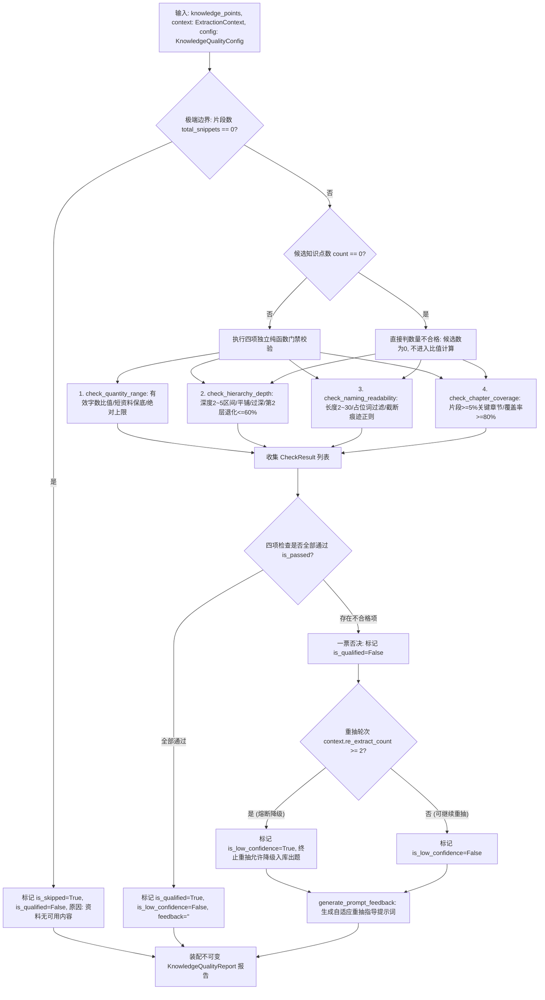

# Spec: 知识点质检门禁算法 - 技术契约

- **关联 Intent**: ZL-109
- **主导设计人**: Dev
- **当前状态**: In-Review
- **任务评级**: Tier 2 (Single-Module Feature)

---

## 1. 架构流向与设计方案

### 1.1 模块定位与分层防线
知识点质检门禁算法（`verify_knowledge_points`）位于智练系统后端五层单向架构的核心纯函数计算核：
- **物理路径**: `backend/app/core/algorithms/knowledge_quality.py`
- **分层约束**: 严格属于纯函数计算核（Pure Functional Kernel），依赖仅限 Python 标准库（`re`, `dataclasses`, `typing`, `enum`, `math`, `collections.abc`）。绝对禁止导入 `fastapi`, `sqlalchemy`, `httpx`, `redis`, `boto3` 等网络、数据库与 Web 框架依赖，严禁导入上层业务模块 `app/services` 与 `app/repositories`。
- **与业务模型解耦**: 彻底与 `backend/app/models/knowledge.py` 中的 `KnowledgePoint` ORM 实体解耦。上层 `knowledge_service` 负责将 LLM 抽取结果转换为纯函数轻量输入 `CandidateKnowledgePoint` 与 `ExtractionContext`，调用算法核获得不可变输出 `KnowledgeQualityReport` 后，再由服务层决策是否触发重抽、持久化落库或标记低可信度（`is_low_confidence=True`）。

### 1.2 核心数据流与状态机
知识点质检门禁接收大模型抽取生成的候选知识点序列与资料切片上下文统计量，执行极端边界防御、并行/分步评估四项门禁（数量区间、层级深度、命名可读性、关键章节覆盖率），按“一票否决”原则产出综合结论与可解释的不通过指标，并根据重抽轮次生成自适应提示词补充段落：



### 1.3 白盒复杂度控制与函数拆分设计 ($V(G) \le 8$)
为严格遵守《概要设计说明书》第 7.1 节与 AGENTS.md 关于纯函数计算核单函数 McCabe 环路复杂度 $V(G) \le 8$ 的硬性红线要求，质检核心拆解为 6 个高内聚、无状态的独立纯函数：

1. `check_quantity_range(count: int, effective_chars: int, total_snippets: int, config: KnowledgeQualityConfig) -> CheckResult` ($V(G) \le 6$)
   - 校验知识点数量区间。覆盖候选数为 0、超过绝对上限 200、短资料（片段数 $< 20$）数量保底 3 个，以及每 5000 字 $1 \sim 8$ 个知识点（字数/知识点落在 $625 \sim 5000$ 之间）的动态密度校验。
2. `check_hierarchy_depth(levels: Sequence[int], config: KnowledgeQualityConfig) -> CheckResult` ($V(G) \le 6$)
   - 校验树形结构层级深度。覆盖层级为空/全 0 处理（平铺）、最大深度落在 $2 \sim 5$ 之外判定，以及第 2 层节点数占比超过 60% 的“层级退化”判定。
3. `check_naming_readability(names: Sequence[str], config: KnowledgeQualityConfig) -> CheckResult` ($V(G) \le 7$)
   - 校验知识点命名质量。覆盖字符长度 $2 \sim 30$ 区间约束、预编译正则匹配截断标记（省略号或未闭合括号），以及占位模板词黑名单拦截。
4. `check_chapter_coverage(covered_chapters: AbstractSet[str], chapter_stats: Sequence[ChapterSnippetStat], config: KnowledgeQualityConfig) -> CheckResult` ($V(G) \le 6$)
   - 校验教材/讲义核心章节覆盖率。自动提取片段占比 $\ge 5.0\%$ 的关键章节，核验覆盖率是否达到 $80\%$（无关键章节或无分章默认 100% 通过）。
5. `generate_prompt_feedback(results: Sequence[CheckResult], re_extract_count: int) -> str` ($V(G) \le 4$)
   - 生成重抽反馈增强提示词。依据重抽轮次自适应输出不同强度的引导策略（首轮追加具体原因并降低单批片段数至 20；次轮追加严格区间与命名规范约束）。
6. `verify_knowledge_points(knowledge_points: Sequence[CandidateKnowledgePoint], context: ExtractionContext, config: KnowledgeQualityConfig | None = None) -> KnowledgeQualityReport` ($V(G) \le 5$)
   - 顶层门禁入口：编排输入防御、分发四项检查、执行一票否决仲裁与降级标记，聚合输出完整质量报告。

---

## 2. API 与数据契约设计

### 2.1 依赖与调用契约
本模块为底层独立纯算法计算核，不直接暴露外部网络路由，由业务服务层 `knowledge_service` 直接调用。所有输入出参均采用强类型不可变领域模型（基于 Python `dataclasses.dataclass(frozen=True)`）。

### 2.2 阈值常量与依据规范
```python
# ==============================================================================
# 知识点质检门禁核心常量与决策基准
# 严格遵循《概要设计说明书》第 3.4/6.3 节与《软件需求规格说明书》FR-16~18、NFR-22
# ==============================================================================

# 依据：概要设计说明书第 3.4/6.3 节，每 5000 字有效文本对应 1 至 8 个知识点
# 密度下限：5000 / 8 = 625 字符/知识点。字符/知识点 < 625 意味着 5000 字抽取超过 8 个，判为过度拆分
MIN_EFFECTIVE_CHARS_PER_KP: int = 625

# 依据：概要设计说明书第 3.4/6.3 节，每 5000 字有效文本对应 1 至 8 个知识点
# 密度上限：5000 / 1 = 5000 字符/知识点。字符/知识点 > 5000 意味着 5000 字不足 1 个，判为过度粗略
MAX_EFFECTIVE_CHARS_PER_KP: int = 5000

# 依据：概要设计说明书第 3.4/6.3 节，知识片段总数少于 20 个时要求知识点数量不少于 3 个
# 短资料内容集中，必须至少形成三元微型知识结构，防止模型偷懒仅抽取单一宽泛概念
MIN_KP_COUNT_SMALL_DOC: int = 3

# 依据：概要设计说明书第 3.4/6.3 节，单份资料抽取知识点绝对上限为 200 个
# 超过 200 个不仅导致树形可视化严重卡顿，且必然破坏后续考纲聚焦，直接判为过度拆分
MAX_KP_COUNT_ABSOLUTE: int = 200

# 依据：概要设计说明书第 3.4/6.3 节与 FR-16，知识点最大层级深度必须在 2 至 5 之间
# 深度为 1 判为“平铺 (FLAT)”；深度 > 5 判为“嵌套过深 (TOO_DEEP)”
MIN_HIERARCHY_DEPTH: int = 2
MAX_HIERARCHY_DEPTH: int = 5

# 依据：概要设计说明书第 3.4/6.3 节，第 2 层节点数占总数的比例上限为 60% (0.60)
# 超过 60% 表明模型未建立合理的纵深细分体系，产生“伞状横向拥挤”，判为“层级退化 (LAYER_DEGENERATE)”
MAX_LEVEL_2_RATIO: float = 0.60

# 依据：概要设计说明书第 3.4/6.3 节，知识点名称长度字符数区间为 2 至 30 字符
# 单字多为无意义缩略或标点，超过 30 字符多为模型将正文解释误作为标题输出
MIN_NAME_LENGTH: int = 2
MAX_NAME_LENGTH: int = 30

# 依据：概要设计说明书第 3.4/6.3 节，章节片段占比不低于 5% (0.05) 的章节定义为关键章节
# 边界约定：片段占比恰好等于 5.0% 同样纳入关键章节计算
CRITICAL_CHAPTER_SNIPPET_RATIO: float = 0.05

# 依据：概要设计说明书第 3.4/6.3 节，关键章节知识点覆盖率下限为 80% (0.80)
# 必须保证核心章节不被大模型遗漏，覆盖率低于 80% 判为不合格
MIN_CRITICAL_CHAPTER_COVERAGE: float = 0.80

# 依据：概要设计说明书第 3.4/6.3 节与 FR-17，质检不通过时自动重抽上限为 2 次
# 达到 2 次重抽仍不通过时，触发熔断并降级标记 is_low_confidence=True (FR-18/FR-53)
MAX_RE_EXTRACT_ATTEMPTS: int = 2

# 依据：概要设计说明书第 3.4/6.3 节，模板占位词黑名单表
# 命中占位词表明大模型产生模板化灌水输出，命名可读性一票否决
DEFAULT_PLACEHOLDER_WORDS: frozenset[str] = frozenset({
    "知识点",
    "内容一",
    "其他",
    "待补充",
    "未命名",
    "章节一",
    "测试",
})

# 依据：概要设计说明书第 3.4/6.3 节，截断标记预编译正则表达式
# 包含中文/英文省略号结尾（...、…）或未闭合的前括号结尾（(、[、【、(）
TRUNCATION_PATTERN: re.Pattern[str] = re.compile(
    r"(\.{3,}|…+|[（(\[【]\s*$)"
)
```

### 2.3 数据结构设计 (DTO)

```python
import enum
from collections.abc import AbstractSet, Sequence
from dataclasses import dataclass, field
from typing import Any


class CheckItemCode(enum.StrEnum):
    """四项质检门禁检查项枚举。"""

    QUANTITY_RANGE = "quantity_range"          # 知识点数量区间
    HIERARCHY_DEPTH = "hierarchy_depth"        # 层级深度与结构
    NAMING_READABILITY = "naming_readability"  # 命名可读性与占位词
    CHAPTER_COVERAGE = "chapter_coverage"      # 关键章节覆盖率


@dataclass(frozen=True)
class CandidateKnowledgePoint:
    """输入的单个候选知识点（轻量不可变领域对象）。"""

    name: str                                  # 知识点名称
    level: int = 1                             # 层级深度（根节点为 1，支持 1~5）
    chapter_title: str = ""                    # 归属章节标题（若有）
    snippet_ids: tuple[str, ...] = ()          # 关联来源片段唯一标识元组
    description: str = ""                      # 知识点简述（可选）


@dataclass(frozen=True)
class ChapterSnippetStat:
    """章节知识片段分布统计。"""

    chapter_title: str                         # 章节标题
    snippet_count: int                         # 该章节包含的切片数量
    snippet_ratio: float                       # 切片数占资料切片总数的比例 (0.0 ~ 1.0)


@dataclass(frozen=True)
class ExtractionContext:
    """知识点抽取上下文环境与统计量。"""

    total_snippets: int                        # 资料切片总数
    effective_chars: int                       # 资料有效清洗字符总数
    chapter_stats: Sequence[ChapterSnippetStat] = ()  # 章节切片分布统计
    re_extract_count: int = 0                  # 当前重抽计数（首次抽取为 0，上限 2）


@dataclass(frozen=True)
class KnowledgeQualityConfig:
    """知识点质检门禁可调参数配置。"""

    min_effective_chars_per_kp: int = MIN_EFFECTIVE_CHARS_PER_KP
    max_effective_chars_per_kp: int = MAX_EFFECTIVE_CHARS_PER_KP
    min_kp_count_small_doc: int = MIN_KP_COUNT_SMALL_DOC
    max_kp_count_absolute: int = MAX_KP_COUNT_ABSOLUTE
    min_hierarchy_depth: int = MIN_HIERARCHY_DEPTH
    max_hierarchy_depth: int = MAX_HIERARCHY_DEPTH
    max_level_2_ratio: float = MAX_LEVEL_2_RATIO
    min_name_length: int = MIN_NAME_LENGTH
    max_name_length: int = MAX_NAME_LENGTH
    critical_chapter_snippet_ratio: float = CRITICAL_CHAPTER_SNIPPET_RATIO
    min_critical_chapter_coverage: float = MIN_CRITICAL_CHAPTER_COVERAGE
    max_re_extract_attempts: int = MAX_RE_EXTRACT_ATTEMPTS
    placeholder_words: frozenset[str] = DEFAULT_PLACEHOLDER_WORDS

    def __post_init__(self) -> None:
        """校验配置参数合法性边界。"""
        if self.min_effective_chars_per_kp <= 0 or self.max_effective_chars_per_kp <= 0:
            raise ValueError("effective chars per KP bounds must be positive")
        if self.min_effective_chars_per_kp > self.max_effective_chars_per_kp:
            raise ValueError("min_effective_chars_per_kp cannot exceed max_effective_chars_per_kp")
        if self.min_kp_count_small_doc < 0 or self.max_kp_count_absolute < self.min_kp_count_small_doc:
            raise ValueError("invalid KP count constraints")
        if not (1 <= self.min_hierarchy_depth <= self.max_hierarchy_depth):
            raise ValueError("invalid hierarchy depth range")
        if not (0.0 <= self.max_level_2_ratio <= 1.0):
            raise ValueError("max_level_2_ratio must be between 0.0 and 1.0")
        if not (1 <= self.min_name_length <= self.max_name_length):
            raise ValueError("invalid name length constraints")
        if not (0.0 <= self.critical_chapter_snippet_ratio <= 1.0):
            raise ValueError("critical_chapter_snippet_ratio must be between 0.0 and 1.0")
        if not (0.0 <= self.min_critical_chapter_coverage <= 1.0):
            raise ValueError("min_critical_chapter_coverage must be between 0.0 and 1.0")
        if self.max_re_extract_attempts < 0:
            raise ValueError("max_re_extract_attempts must be non-negative")


@dataclass(frozen=True)
class CheckResult:
    """单项检查结果评估（不可变值对象）。"""

    item_code: CheckItemCode                   # 质检项枚举代码
    is_passed: bool                            # 单项是否通过
    score: float                               # 得分（1.0 为通过，0.0 为未通过）
    reason: str | None = None                  # 未通过具体原因（包含量化指标）
    suggestion: str | None = None              # 针对性整改建议
    details: dict[str, Any] = field(default_factory=dict)  # 结构化量化指标


@dataclass(frozen=True)
class KnowledgeQualityReport:
    """知识点质检门禁统一产出报告。"""

    is_qualified: bool                         # 整体是否达到门禁要求（一票否决）
    is_skipped: bool                           # 是否因极端边界（如无内容）跳过质检
    is_low_confidence: bool                    # 是否达重抽上限触发低可信度降级标记
    re_extract_count: int                      # 当前已重抽次数
    check_results: tuple[CheckResult, ...]     # 四项检查明细元组
    unqualified_reasons: tuple[str, ...]       # 全部未通过原因列表
    prompt_feedback: str                       # 指导下一次抽取或记录的重抽提示词段落
    summary: str                               # 综合评价摘要
```

### 2.4 主函数与辅助函数契约

```python
def check_quantity_range(
    count: int,
    effective_chars: int,
    total_snippets: int,
    config: KnowledgeQualityConfig,
) -> CheckResult:
    """校验候选知识点数量是否符合体量区间。
    
    规则：
    1. 候选数量 count == 0: 立即判不合格 (score=0.0)，不进入比值计算；
    2. count > config.max_kp_count_absolute (200): 判为过度拆分；
    3. total_snippets < 20 且 count < config.min_kp_count_small_doc (3): 判为过粗；
    4. 针对正常资料，计算期望数量区间 [floor(chars/5000), ceil(chars/625)]，
       若 count 不在合理区间内，给出超限或不足原因。
    """


def check_hierarchy_depth(
    levels: Sequence[int],
    config: KnowledgeQualityConfig,
) -> CheckResult:
    """校验知识点层级深度与节点分布。
    
    规则：
    1. levels 为空或全为 0: 按平铺 (FLAT, depth=1) 处理，判不合格；
    2. 最大深度 < 2: 判为平铺 (FLAT)；
    3. 最大深度 > 5: 判为嵌套过深 (TOO_DEEP)；
    4. 第 2 层节点数占比 > 60%: 判为层级退化 (LAYER_DEGENERATE)；
    5. 否则通过。
    """


def check_naming_readability(
    names: Sequence[str],
    config: KnowledgeQualityConfig,
) -> CheckResult:
    """校验知识点名称长度、占位词与截断痕迹。
    
    规则：
    1. names 为空: 判不合格；
    2. 针对每个名称校验：
       a. 长度是否在 [min_name_length, max_name_length] (2~30) 之间；
       b. 是否包含模板占位词 (如“知识点”、“内容一”等)；
       c. 是否命中省略号或未闭合括号截断正则；
    3. 收集违规条目，若违规数量 > 0 则整体判不合格，并输出首批违规样本。
    """


def check_chapter_coverage(
    covered_chapters: AbstractSet[str],
    chapter_stats: Sequence[ChapterSnippetStat],
    config: KnowledgeQualityConfig,
) -> CheckResult:
    """校验资料关键章节覆盖率。
    
    规则：
    1. 提取 snippet_ratio >= 0.05 的章节作为关键章节；
    2. 若无关键章节（无分章或单一整体）: 视为 100% 覆盖通过；
    3. 统计关键章节中被 covered_chapters 命中的比例；
    4. 若 coverage_ratio < 0.80: 判为覆盖率不足，输出遗漏章节；否则通过。
    """


def generate_prompt_feedback(
    results: Sequence[CheckResult],
    re_extract_count: int,
) -> str:
    """根据未通过原因与当前重抽轮次，自适应生成提示词增强补充文本。
    
    规则：
    1. 若全部通过，返回空字符串；
    2. 轮次 0 (为第 1 次重抽做准备): 拼接具体未通过原因，提示降低单批片段数至 20；
    3. 轮次 1 (为第 2 次重抽做准备): 追加严格数量区间与命名规范约束（4~16 字符，无编号）；
    4. 轮次 >= 2: 输出最终降级说明文案。
    """


def verify_knowledge_points(
    knowledge_points: Sequence[CandidateKnowledgePoint],
    context: ExtractionContext,
    config: KnowledgeQualityConfig | None = None,
) -> KnowledgeQualityReport:
    """执行知识点质检门禁统一校验。
    
    Args:
        knowledge_points: 大模型抽取的候选知识点序列。
        context: 抽取上下文（切片总数、有效字数、章节统计、重抽计数）。
        config: 可选配置，未传则采用系统标准默认配置。
        
    Returns:
        KnowledgeQualityReport: 包含四项评估结果、一票否决结论与提示词反馈的不可变报告。
    """
```

### 2.5 16 组全覆盖决策表 (Decision Table)
根据需求规格说明书 FR-16 与概要设计说明书第 7.1 节，质检实行**四项一票否决制**。对于四项条件：
- $C_1$: 数量区间检查 (`check_quantity_range`)
- $C_2$: 层级深度检查 (`check_hierarchy_depth`)
- $C_3$: 命名可读性检查 (`check_naming_readability`)
- $C_4$: 关键章节覆盖率检查 (`check_chapter_coverage`)

$2^4 = 16$ 组全组合决策矩阵严格定义如下：

| 决策规则编号 | $C_1$ 数量区间 | $C_2$ 层级深度 | $C_3$ 命名可读性 | $C_4$ 章节覆盖率 | 最终准出 (`is_qualified`) | 一票否决项 / 判定原因 |
| :--- | :--- | :--- | :--- | :--- | :--- | :--- |
| **DT-KP-01** | **Pass (T)** | **Pass (T)** | **Pass (T)** | **Pass (T)** | **True (合格)** | 四项门禁全量达标，通过质检 |
| **DT-KP-02** | Pass (T) | Pass (T) | Pass (T) | **Fail (F)** | **False (不合格)** | 否决于 $C_4$：关键章节覆盖率不足 |
| **DT-KP-03** | Pass (T) | Pass (T) | **Fail (F)** | Pass (T) | **False (不合格)** | 否决于 $C_3$：名称过短/过长/含占位词/截断 |
| **DT-KP-04** | Pass (T) | Pass (T) | **Fail (F)** | **Fail (F)** | **False (不合格)** | 否决于 $C_3, C_4$：命名不合格且关键章节遗漏 |
| **DT-KP-05** | Pass (T) | **Fail (F)** | Pass (T) | Pass (T) | **False (不合格)** | 否决于 $C_2$：层级平铺、嵌套过深或第2层退化 |
| **DT-KP-06** | Pass (T) | **Fail (F)** | Pass (T) | **Fail (F)** | **False (不合格)** | 否决于 $C_2, C_4$：层级结构失真且章节遗漏 |
| **DT-KP-07** | Pass (T) | **Fail (F)** | **Fail (F)** | Pass (T) | **False (不合格)** | 否决于 $C_2, C_3$：层级与命名双重不合格 |
| **DT-KP-08** | Pass (T) | **Fail (F)** | **Fail (F)** | **Fail (F)** | **False (不合格)** | 否决于 $C_2, C_3, C_4$：仅数量合格，结构命名覆盖全挂 |
| **DT-KP-09** | **Fail (F)** | Pass (T) | Pass (T) | Pass (T) | **False (不合格)** | 否决于 $C_1$：数量过度拆分、过少或短资料不足 |
| **DT-KP-10** | **Fail (F)** | Pass (T) | Pass (T) | **Fail (F)** | **False (不合格)** | 否决于 $C_1, C_4$：数量超限且章节遗漏 |
| **DT-KP-11** | **Fail (F)** | Pass (T) | **Fail (F)** | Pass (T) | **False (不合格)** | 否决于 $C_1, C_3$：数量与命名双重不合格 |
| **DT-KP-12** | **Fail (F)** | Pass (T) | **Fail (F)** | **Fail (F)** | **False (不合格)** | 否决于 $C_1, C_3, C_4$：仅层级合格，其余三项均不合格 |
| **DT-KP-13** | **Fail (F)** | **Fail (F)** | Pass (T) | Pass (T) | **False (不合格)** | 否决于 $C_1, C_2$：数量与层级双重不合格 |
| **DT-KP-14** | **Fail (F)** | **Fail (F)** | Pass (T) | **Fail (F)** | **False (不合格)** | 否决于 $C_1, C_2, C_4$：仅命名合格，其余三项均不合格 |
| **DT-KP-15** | **Fail (F)** | **Fail (F)** | **Fail (F)** | Pass (T) | **False (不合格)** | 否决于 $C_1, C_2, C_3$：仅覆盖率合格，其余三项均不合格 |
| **DT-KP-16** | **Fail (F)** | **Fail (F)** | **Fail (F)** | **Fail (F)** | **False (不合格)** | 否决于 $C_1, C_2, C_3, C_4$：四项门禁全部不合格 |

### 2.6 重抽策略与提示词增强设计 (FR-17, FR-18)
大模型生成质量受 Prompt 引导影响显著。质检算法核在判定未通过时，根据当前 `re_extract_count` 动态生成提示词反馈：
1. **第 1 次重抽引导 (`re_extract_count == 0`)**:
   - 提取所有未通过检查项的具体数值原因（例如：“知识点数量为 268 个，超出同规模资料区间上限 96 个”；“最大深度为 1 级，缺乏层级划分”；“包含占位词‘内容一’与截断标记”）；
   - 生成提示词指导：“【知识点质检未通过】请针对上述缺陷重新梳理知识树，已自动降低单批片段数至 20 个以提升抽取精度。”
2. **第 2 次重抽引导 (`re_extract_count == 1`)**:
   - 追加硬性数量区间约束与严格命名规范：“【严格规范】1. 知识点总数必须在 [X, Y] 个之间；2. 知识点名称长度必须在 4 至 16 字符之间且严禁包含编号（如 1.1、一、）与占位词；3. 最大层级必须划分至 2~5 级。”
3. **重抽熔断与降级处理 (`re_extract_count >= 2`)**:
   - 达到最大重抽上限（2次）仍不合格时，`is_low_confidence=True`，不再指导重抽；
   - 生成降级诊断说明：“资料知识结构经多次抽取仍未达到质量门禁标准，已采用本次结果降级处理，标记低可信度并在报告中提示。”

### 2.7 五大极端边界与异常防御策略
1. **切片总数为 0 (`total_snippets == 0`)**:
   - 资料导入解析异常或完全无文字，跳过质检，标记 `is_skipped=True, is_qualified=False`，原因说明“资料无可用知识切片”。
2. **候选知识点数为 0 (`len(knowledge_points) == 0`)**:
   - 模型未抽取出任何知识点，直接判定不合格，不进入任何除法比值计算，阻断 `ZeroDivisionError`。
3. **层级全部为空或 0**:
   - 容错处理：若所有候选点的 `level` 字段未赋值或为 0，统一回退为平铺（深度 1），判定 `HIERARCHY_DEPTH` 不通过（原因：平铺）。
4. **名称全为单字符或全超过 30 字符**:
   - 命名检查精准统计不合格率，若全部不符合长度要求，立即判定 `NAMING_READABILITY` 不通过。
5. **章节切片占比恰好等于 5.0% (`snippet_ratio == 0.05`)**:
   - 严格边界测试：使用 `>= 0.05` 包含恰好等于 5% 的边界情况，正确将其纳入关键章节集合。

### 2.8 异常与错误码约定
- **配置参数校验防御**:
  - 若 `min_effective_chars_per_kp > max_effective_chars_per_kp` 或 `max_kp_count_absolute < min_kp_count_small_doc`，抛出 `ValueError`。
- **业务错误码映射（供服务层映射）**:
  - `10001`: 参数校验失败（当算法配置参数非法时捕获抛出）；
  - `40002`: 知识点质检未通过（当 `is_qualified=False` 且 `re_extract_count < 2` 时触发重抽；重抽超限时记录 40002 降级事件）。

---

## 3. 可测性设计 (Design for Testability)

### 3.1 独立纯函数计算核
- 算法完全封装在 `backend/app/core/algorithms/knowledge_quality.py`；
- 无任何数据库、Redis、HTTP、MinIO 或文件 I/O 依赖；
- 相同的输入参数在任意平台、任意时刻执行，绝对产生一致的 `KnowledgeQualityReport`（100% 确定性）。

### 3.2 外部依赖与 Mock 策略
- **0 Mock 策略**: 根据项目架构规范，纯函数计算核测试**严格禁止使用 Mock/Patch 替身打桩**；
- 单元测试单用例在毫秒级完成，全套单测在 2 秒内执行完毕；
- 覆盖率硬性门禁：判定覆盖率 100%，行覆盖率 $\ge 95\%$，分支覆盖率 $\ge 90\%$。

### 3.3 等价类与边界值测试用例矩阵

| 用例编号 | 测试场景 / 等价类划分 | 输入特征与边界参数 | 预期断言与行为判定 | 对应规范要求 |
| :--- | :--- | :--- | :--- | :--- |
| **TC-KP-01** | 切片数为 0 边界 | `total_snippets = 0, points = []` | `is_skipped=True, is_qualified=False`，跳过质检 | 5大边界 1 |
| **TC-KP-02** | 候选知识点数为 0 | `total_snippets = 10, points = []` | `is_qualified=False, quantity_range.is_passed=False` | 5大边界 2 |
| **TC-KP-03** | 绝对数量超过 200 节点 | `points` 包含 201 个合法知识点 | 判定数量不通过（过度拆分，超绝对上限） | 数量门禁 |
| **TC-KP-04** | 短资料 (片段<20) 不足 3 个 | `total_snippets = 15, points` 仅 2 个点 | 判定数量不通过（短资料知识点数量不足3个） | 数量门禁 |
| **TC-KP-05** | 短资料 (片段<20) 达到 3 个 | `total_snippets = 15, points` 3 个点 | 数量项通过（短资料满足保底 3 个要求） | 数量门禁 |
| **TC-KP-06** | 密度超限 (字数/KP < 625) | 5000 字生成 10 个知识点 (500字/个) | 判定数量不通过（超出每5000字1~8个上限） | 密度校验 |
| **TC-KP-07** | 密度过低 (字数/KP > 5000) | 20000 字生成 3 个知识点 (6666字/个) | 判定数量不通过（低于每5000字1~8个下限） | 密度校验 |
| **TC-KP-08** | 标准密度通过 | 10000 字生成 8 个知识点 (1250字/个) | 数量项通过 (`is_passed=True`) | 正常等价类 |
| **TC-KP-09** | 层级全为 0 或空 | 所有候选点 `level = 0` | 深度项判定不通过（平铺 FLAT，最大深度1） | 5大边界 3 |
| **TC-KP-10** | 最大层级为 1 (平铺) | 所有候选点 `level = 1` | 深度项判定不通过（平铺 FLAT） | 结构门禁 |
| **TC-KP-11** | 最大层级超过 5 (过深) | 存在候选点 `level = 6` | 深度项判定不通过（嵌套过深 TOO_DEEP） | 结构门禁 |
| **TC-KP-12** | 第 2 层节点占比恰好等于 60% | 总计 10 个点，第 2 层 6 个点 (60.0%) | 深度项通过 (`is_passed=True`) | 边界值：恰等于上限 |
| **TC-KP-13** | 第 2 层节点占比超过 60% | 总计 10 个点，第 2 层 7 个点 (70.0%) | 深度项不通过（层级退化 LAYER_DEGENERATE） | 结构门禁 |
| **TC-KP-14** | 名称全单字 (长度 1) | 名称列表为 `["树", "图", "栈"]` | 命名项不通过（长度过短，低于2字符） | 5大边界 4 |
| **TC-KP-15** | 名称全超长 (长度 31) | 名称列表全部为 31 字符 | 命名项不通过（长度过长，超30字符） | 5大边界 4 |
| **TC-KP-16** | 包含模板占位词 | 候选点包含“知识点”、“内容一”等 | 命名项不通过（命中占位词黑名单） | 命名门禁 |
| **TC-KP-17** | 包含截断标记 (省略号) | 候选点名称以 `...` 或 `…` 结尾 | 命名项不通过（命中截断标记正则） | 命名门禁 |
| **TC-KP-18** | 包含截断标记 (未闭合括号) | 名称以 `(`、`（`、`[`、`【` 结尾 | 命名项不通过（命中未闭合括号截断） | 命名门禁 |
| **TC-KP-19** | 切片占比恰好等于 5.0% | 某章节切片 5/100 (5.0%) | 正确识别为关键章节，纳入覆盖率统计 | 5大边界 5 |
| **TC-KP-20** | 关键章节覆盖率恰好等于 80% | 5 个关键章节覆盖 4 个 (80.0%) | 章节覆盖率项通过 (`is_passed=True`) | 边界值：恰等于下限 |
| **TC-KP-21** | 关键章节覆盖率低于 80% | 5 个关键章节覆盖 3 个 (60.0%) | 章节覆盖率项不通过，输出遗漏章节 | 覆盖率门禁 |
| **TC-KP-22** | 无分章资料 (单一章节) | 资料无章节统计或单章节 | 章节覆盖率项默认 100% 通过 | 兼容场景 |
| **TC-KP-23** | 决策表 16 组全排列矩阵 | 构造 16 组不同通过/失败组合 | 仅全通组合合格，其余 15 组精确一票否决 | 判定覆盖 100% |
| **TC-KP-24** | 首次未通过生成重抽反馈 | `re_extract_count = 0`，质检失败 | 反馈包含具体未通过原因，提示调至 20 片段 | 重抽策略 |
| **TC-KP-25** | 二次未通过生成严格规范反馈 | `re_extract_count = 1`，质检失败 | 反馈包含严格区间与 4~16 字符命名规范 | 重抽策略 |
| **TC-KP-26** | 重抽 2 次超限降级标记 | `re_extract_count = 2`，质检失败 | `is_low_confidence=True`，允许降级交付 | 熔断降级 |
| **TC-KP-27** | 配置参数越界异常防御 | `min_kp_count_small_doc = -1` | 抛出 `ValueError` | 配置防御 |

---

## 4. 替代方案与权衡考量 (Alternatives Considered & Trade-offs)

### 4.1 评估过的替代方案
- **方案 A (当前采纳方案)**: 独立纯函数规则与统计指标门禁核。
- **方案 B**: 引入大模型进行二次审查（LLM as a Judge）。
- **方案 C**: 引入外部词典/知识图谱对齐（如 CN-DBpedia/百度百科实体对齐）。

### 4.2 未采纳原因与权衡分析

| 维度 | 方案 A: 纯函数规则核 (当前采纳) | 方案 B: 大模型二次审查 (LLM Judge) | 方案 C: 外部通用图谱实体对齐 |
| :--- | :--- | :--- | :--- |
| **架构分层合规性** | **完全合规**：纯 Python 标准库，0 依赖，完全符合纯函数核铁律 | **严重违规**：引入外部网络/HTTP 调用，破坏 NFR-22 可测性要求 | **不推荐**：引入数百 MB 外部图谱依赖与网络/磁盘 I/O |
| **确定性与可测试性** | **100% 确定**：相同输入输出绝对一致，支持 100% 判定覆盖 | **不可控**：受模型温度与幻觉影响，边界判定无法稳定复现 | **中等**：依赖外部图谱实体库覆盖率，冷门专业课无法命中 |
| **执行时延与开销** | **极高**：单次质检耗时 $< 2\text{ms}$，0 外部 Token 费用 | **极慢且昂贵**：增加一次模型调用（耗时 2~5s），增加成本 | **较慢**：图谱检索查询 50~200ms，需持久化图数据库支持 |
| **提示词针对性反馈** | **极强**：精准提取违规指标（超出的数量、遗漏的章节），指导重抽 | **模糊**：模型反馈多为泛化自然语言，缺乏量化边界约束 | **一般**：仅能提供实体规范化名称，无法提供结构性指导 |

---

## 5. 动态风险核验与回滚预案 (Risk & Rollback Verification)

### 5.1 七维风险动态核验矩阵
- [x] **Files (文件破坏面)**:
  - 仅新增纯算法实现 `backend/app/core/algorithms/knowledge_quality.py` 与单元测试 `backend/tests/unit/core/algorithms/test_knowledge_quality.py`；
  - 仅在 `backend/app/core/algorithms/__init__.py` 中补全导出符号，不修改任何已有业务逻辑，无 Git 冲突与覆盖风险。
- [x] **API (对外接口契约)**:
  - 属于纯算法内核 DTO 契约，不变更任何对外 HTTP 接口路由或返回数据结构。
- [x] **Schema (数据库模型与存储)**:
  - 数据模型 `KnowledgePoint` 已在 `ZL-105` 中就绪，包含 `level`, `name`, `is_low_confidence`, `batch_id` 等字段，本算法产出与模型完全契合，无数据库迁移或表结构修改。
- [x] **Auth (鉴权与安全隔离)**:
  - 纯算法函数不感知用户身份，无越权风险；上层服务通过 `user_id` 保证数据物理隔离。
- [x] **Deps (第三方依赖变动)**:
  - 仅依赖 Python 标准库（`re`, `dataclasses`, `collections.abc`, `typing`, `enum`），0 外部三方库引入。
- [x] **Rollback (回滚难度与迁移)**:
  - 纯无状态代码变动，若出现意外逻辑阻塞，可直接通过 `git revert` 秒级回滚并重新部署，无需数据库逆向修复。
- [x] **Blast Radius (爆炸半径评估)**:
  - 爆炸半径严格限定在“知识点抽取完成后的质检门禁”环节；不影响已存在的资料、切片、题目或历史练习作答。

### 5.2 核心关注点与策略冲突规避 (Flagged Concerns)
1. **短资料保底与有效字符密度的策略冲突**:
   - **关注点**: 若短资料（例如 1000 字符、3 个片段）按小文档要求至少抽取 3 个知识点，则其有效字符密度为 $1000 / 3 = 333$ 字符/点，低于标准密度下限 625。若机械校验密度，短资料将永远无法通过。
   - **规避方案**: 在 `check_quantity_range` 中明确逻辑分支：当 `total_snippets < 20` 时，优先以 `min_kp_count_small_doc`（3个）作为保底数量要求，放宽密度下限限制，避免规则自相矛盾。
2. **截断标记与中英文括号的误杀防御**:
   - **关注点**: 某些合法知识点可能包含配对括号（如“快速傅里叶变换(FFT)”），若正则匹配不当可能误杀。
   - **规避方案**: 截断正则表达式 `r"(\.{3,}|…+|[（(\[【]\s*$)"` 严格锚定**行尾/末尾的未闭合左括号或省略号**；成对出现的封闭括号（如 `(...)`）绝不触发截断拦截。
3. **无章节与单一整体资料的覆盖率判定**:
   - **关注点**: 用户导入单篇文献或拍照笔记无任何章节信息时，若直接校验章节覆盖率可能因分母为 0 导致报错或误拦截。
   - **规避方案**: 在 `check_chapter_coverage` 中前置判定：若资料无关键章节（所有章节占比均 $< 5\%$ 或无章节数据），默认作为单一整体，覆盖率判定为 100% 通过。
4. **重抽熔断与降级低可信度的确定性保障**:
   - **关注点**: 质检不通过触发重抽若未设熔断，可能导致大模型死循环调用消耗巨额费用。
   - **规避方案**: 算法核强制依赖 `ExtractionContext.re_extract_count`，当其达到 `MAX_RE_EXTRACT_ATTEMPTS`（2次）且质检仍不合格时，强制标记 `is_low_confidence=True`，指导上层业务服务终止重抽并放行降级结果。

### 5.3 回滚与故障应急策略
- **Git 秒级回滚**: 若新算法在线上产生不可预期的极端拦截，直接撤销提交并构建，无任何持久化副作用。
- **服务层降级保护**: 上层 `knowledge_service` 调用本算法时具备结构化异常捕获；若算法抛出未处理异常，服务层自动捕获并标记低可信度放行，记录脱敏指标，主流程不中断。

---

## 6. 阶段准出签批 (Gate 2 Sign-off)
- [x] 架构流向与 API 契约已冻结
- [x] 替代方案已完成推演与权衡
- [x] 7 维风险已核验且具备明确回滚预案
- **审查结论**: Accepted
- **签批人 / 日期**: TechLead、SecLead / 2026-09-23
