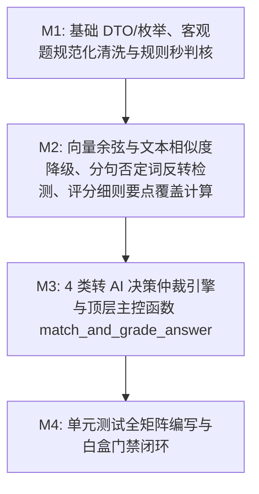

# Plan: 判题阈值与匹配算法 (match_and_grade_answer) - 实施计划

- **关联 Spec**: ZL-111
- **实施执行人 / Agent**: Dev / Planner & Builder
- **当前状态**: Approved
- **架构定级**: Tier 2 (单模块特性演进 / 纯函数算法核)

---

## 1. 变更文件清单 (Pillar 1: Files that change)

### 1.1 新增文件
* `backend/app/core/algorithms/grading.py`:
  - 判题匹配算法纯函数计算核实现；
  - 包含 12 个决策阈值常量与预编译规则（严格附带《概要设计说明书》第 6.5 节与 FR-37~44 依据注释）：
    - `DEFAULT_UPPER_SIMILARITY_THRESHOLD = 0.82`（主观题匹配度上阈值，$\ge 0.82$ 离线判对）
    - `DEFAULT_LOWER_SIMILARITY_THRESHOLD = 0.45`（主观题匹配度下阈值，$\le 0.45$ 离线判错）
    - `DEFAULT_RUBRIC_COVERAGE_WEIGHT = 0.60`（细则覆盖率权重）
    - `DEFAULT_SEMANTIC_SIMILARITY_WEIGHT = 0.40`（语义相似度权重）
    - `DEFAULT_KEYWORD_HIT_RATIO_THRESHOLD = 0.60`（要点采分关键词命中下限比例）
    - `DEFAULT_ZERO_COVERAGE_HIGH_SIMILARITY_THRESHOLD = 0.55`（0覆盖转 AI 相似度下限阈值）
    - `MAX_SUBJECTIVE_ANSWER_LENGTH = 2000`（主观题作答截断字符上限）
    - `SCORE_ROUNDING_UNIT = 0.5`（0.5 分粒度四舍五入单位）
    - `CHINESE_NEGATION_WORDS`（中文关键否定词集合，共 20 个）
    - `SENTENCE_SPLIT_PATTERN`（分句切分正则，界定否定词局部作用域）
    - `CONTENT_WORD_PATTERN`（连续汉字或英文单词实词提取正则）
    - `TRUE_BOOLEAN_VALUES` 与 `FALSE_BOOLEAN_VALUES`（中英文符号真假映射集合）
  - 包含不可变领域数据模型（DTO）与枚举：
    - `QuestionType(enum.StrEnum)`（对齐 FR-20 及数据模型的七大题型）
    - `OBJECTIVE_QUESTION_TYPES` 与 `SUBJECTIVE_QUESTION_TYPES` 集合常量
    - `GradingMethod(enum.StrEnum)`（`OFFLINE_RULE`, `PENDING_LLM`）
    - `TransitionReason(enum.StrEnum)`（4 类转 AI 原因：`UNCERTAIN_RANGE`, `NEGATION_INVERSION`, `MULTIPLE_EQUIVALENTS_OR_EMPTY_RUBRIC`, `ZERO_COVERAGE_HIGH_SIMILARITY`）
    - `GradingRubricItem(frozen=True)`（采分细则不可变值对象）
    - `GradingConfig(frozen=True)`（带 `__post_init__` 边界防御断言）
    - `GradingResult(frozen=True)`（统一判题报告不可变结果对象）
  - 包含 10 个高内聚、单一职责无状态纯函数（$V(G) \le 10$）：
    - `normalize_objective_token`（单选题与多选题选项字母规范化）
    - `normalize_boolean_answer`（判断题多语态真假归一化解析）
    - `normalize_fill_blank_text`（填空题全半角、空白与大小写规范化）
    - `grade_objective_question`（客观题秒判流水线，输出对错与确定得分）
    - `calculate_cosine_similarity`（向量余弦相似度，带零向量防除零）
    - `calculate_text_lexical_similarity`（纯文本实词覆盖+2-gram Jaccard 相似度）
    - `detect_negation_inversion`（分句级否定词极性反转冲突检测）
    - `evaluate_subjective_rubric`（评分细则关键词命中与否定词局部抑制评估）
    - `arbitrate_llm_transition`（4 类转 AI 决策仲裁核心引擎）
    - `match_and_grade_answer`（顶层主控函数，客观题秒判与主观题双阈值分流调度）

* `backend/tests/unit/core/algorithms/test_grading.py`:
  - 单元测试套件，全面覆盖客观题规范化、双阈值闭区间/开区间临界值、4 类转 AI 决策表、成对否定词反转、极限输入安全防御；
  - 遵循 0 Mock、0 外部网络与 I/O 运行要求，单用例毫秒级执行。

### 1.2 修改文件
* `backend/app/core/algorithms/__init__.py`:
  - 导出 `match_and_grade_answer` 顶层主函数及相关常量、枚举与 DTO，保持包公开接口规范。
* `docs/sdlc/ZL-111/plan.md`:
  - 实施方案与阶段执行记录工件更新。

---

## 2. 伴随式分步实施与任务拆解 (Pillar 2: Order of work)



### Milestone 1: 基础 DTO/枚举、客观题规范化清洗与规则秒判核 (M1)
* **目标**:
  1. 定义核心阈值常量（显式附带概要设计说明书第 6.5 节与 FR-37~44 依据注释）：
     - `DEFAULT_UPPER_SIMILARITY_THRESHOLD = 0.82`
     - `DEFAULT_LOWER_SIMILARITY_THRESHOLD = 0.45`
     - `DEFAULT_RUBRIC_COVERAGE_WEIGHT = 0.60`
     - `DEFAULT_SEMANTIC_SIMILARITY_WEIGHT = 0.40`
     - `DEFAULT_KEYWORD_HIT_RATIO_THRESHOLD = 0.60`
     - `DEFAULT_ZERO_COVERAGE_HIGH_SIMILARITY_THRESHOLD = 0.55`
     - `MAX_SUBJECTIVE_ANSWER_LENGTH = 2000`
     - `SCORE_ROUNDING_UNIT = 0.5`
     - `CHINESE_NEGATION_WORDS`、`SENTENCE_SPLIT_PATTERN`、`CONTENT_WORD_PATTERN`、`TRUE_BOOLEAN_VALUES`、`FALSE_BOOLEAN_VALUES`
  2. 实现枚举与不可变 DTO：
     - `QuestionType(enum.StrEnum)`（7 大题型）
     - `GradingMethod(enum.StrEnum)`（`OFFLINE_RULE`, `PENDING_LLM`）
     - `TransitionReason(enum.StrEnum)`（`UNCERTAIN_RANGE`, `NEGATION_INVERSION`, `MULTIPLE_EQUIVALENTS_OR_EMPTY_RUBRIC`, `ZERO_COVERAGE_HIGH_SIMILARITY`）
     - `GradingRubricItem(frozen=True)`（`point_id`, `description`, `weight`, `keywords`, `negation_words`）
     - `GradingConfig(frozen=True)`（含 `__post_init__` 边界防御断言：阈值在 $[0.0, 1.0]$，权重和为 1.0，截断长度 $> 0$）
  3. 实现客观题规范化清洗与规则秒判函数：
     - `normalize_objective_token(raw_token, question_type) -> str`：单选去除多余字符大写化，多选去重升序拼装 ($V(G) \le 5$)；
     - `normalize_boolean_answer(raw_answer) -> bool | None`：中英文、数字、符号多语态真假映射解析 ($V(G) \le 6$)；
     - `normalize_fill_blank_text(text) -> str`：全角转半角、多余空白压缩、英文小写化、中文数字归一化 ($V(G) \le 6$)；
     - `grade_objective_question(question_type, user_answer, reference_answer, max_score, options) -> tuple[bool, float, str]`：客观题确定性秒判流水线，单选题、多选题、判断题、填空题（支持 `|` 多候选答案与分号多空），输出 `(is_correct, score, reasoning)` ($V(G) \le 8$)。
* **涉及文件**:
  - `backend/app/core/algorithms/grading.py`
  - `backend/tests/unit/core/algorithms/test_grading.py` (M1 伴随测试)
* **局部验证命令**:
  ```bash
  cd backend && pytest tests/unit/core/algorithms/test_grading.py -k "TestObjectiveGrading or test_config"
  ```
* **预期判据**: 客观题标准化、多语态判断题、多选去重排序、填空多候选匹配及配置防御测试全部 Pass。

---

### Milestone 2: 向量余弦与文本相似度降级、分句否定词反转检测、评分细则要点覆盖计算 (M2)
* **目标**:
  1. 实现高精度余弦相似度与纯文本降级计算纯函数：
     - `calculate_cosine_similarity(vec_a, vec_b) -> float`：纯 Python 计算定长向量点积与模长，处理空向量、维度不匹配与零模长边界，结果裁剪至 $[0.0, 1.0]$ ($V(G) \le 4$)；
     - `calculate_text_lexical_similarity(user_text, reference_text) -> float`：缺向量时的平滑降级方案，实词（长度 $\ge 2$）重合率（权重 0.7）与字符 2-gram Jaccard（权重 0.3）线性加权，输出在 $[0.0, 1.0]$ ($V(G) \le 5$)。
  2. 实现汉语分句级否定词极性反转冲突检测纯函数：
     - `detect_negation_inversion(user_text, reference_text, focus_keywords=()) -> tuple[bool, str | None]`：
       - 基于 `SENTENCE_SPLIT_PATTERN` 将用户答案切分为独立分句；
       - 识别命中关键词所在的分句作用域；
       - 检测分句作用域内是否存在 `CHINESE_NEGATION_WORDS` 关键否定修饰词；
       - 若作答在核心采分句中包含否定词且参考答案未包含，判定存在极性反转风险，返回 `(True, "检测到作答包含与参考答案极性冲突的否定词修饰")` ($V(G) \le 7$)。
  3. 实现评分细则要点评估纯函数：
     - `evaluate_subjective_rubric(user_text, rubric_items) -> tuple[float, tuple[str, ...], tuple[str, ...], bool]`：
       - 若 `rubric_items` 为空，返回 `(0.0, (), (), False)`；
       - 逐条评估要点：提取要点定义的采分关键词，计算作答命中率；
       - 命中率 $\ge 0.60$ 初步标记命中；
       - 分句否定词作用域抑制：若该要点命中关键词所在分句包含否定词，该要点判定取反（从命中剔除并转入遗漏要点），同时标记 `has_negation = True`；
       - 计算命中要点加权覆盖率 $\text{point\_coverage} = \frac{\sum_{i \in \text{hit}} w_i}{\sum_i w_i}$；
       - 输出 `(point_coverage, hit_keywords, missing_keywords, has_negation)` ($V(G) \le 7$)。
* **涉及文件**:
  - `backend/app/core/algorithms/grading.py`
  - `backend/tests/unit/core/algorithms/test_grading.py` (M2 伴随测试)
* **局部验证命令**:
  ```bash
  cd backend && pytest tests/unit/core/algorithms/test_grading.py -k "test_cosine or test_lexical or test_negation or test_rubric"
  ```
* **预期判据**: 向量计算、文本降级重合度、分句否定词抑制与评分细则覆盖率单测全部 Pass。

---

### Milestone 3: 4 类转 AI 决策仲裁引擎与顶层主控函数 match_and_grade_answer (M3)
* **目标**:
  1. 实现不可变结果报告模型 `GradingResult(frozen=True)`：
     - 包含 `score`, `max_score`, `is_correct`, `is_answered`, `requires_llm`, `grading_method`, `transition_reason`, `match_score`, `hit_keywords`, `missing_keywords`, `confidence`, `reasoning`, `details`。
  2. 实现 4 类转 AI 决策判定核心仲裁纯函数：
     - `arbitrate_llm_transition(match_score, point_coverage, semantic_sim, has_negation_inversion, has_multiple_equivalents, rubric_empty, config) -> tuple[bool, TransitionReason | None]`：
       - 严格按优先级执行仲裁：
         - 优先级 1 (条件 2): `has_negation_inversion == True` $\to$ 返回 `(True, TransitionReason.NEGATION_INVERSION)`；
         - 优先级 2 (条件 3): `has_multiple_equivalents == True` 或 `rubric_empty == True` $\to$ 返回 `(True, TransitionReason.MULTIPLE_EQUIVALENTS_OR_EMPTY_RUBRIC)`；
         - 优先级 3 (条件 4): `point_coverage == 0.0` 且 `semantic_sim > config.zero_coverage_high_similarity_threshold (0.55)` $\to$ 返回 `(True, TransitionReason.ZERO_COVERAGE_HIGH_SIMILARITY)`；
         - 优先级 4 (条件 1): `config.lower_similarity_threshold < match_score < config.upper_similarity_threshold` (即 $0.45 < \text{match\_score} < 0.82$) $\to$ 返回 `(True, TransitionReason.UNCERTAIN_RANGE)`；
         - 未触发上述任一条件 $\to$ 返回 `(False, None)` ($V(G) \le 7$)。
  3. 实现顶层总控函数 `match_and_grade_answer(...) -> GradingResult`：
     - 参数校验防御：`max_score <= 0` 抛出 `ValueError`；非法 `question_type` 抛出 `ValueError`；
     - 未作答前置短路：用户作答为空或全空白，直接返回 `is_answered=False, score=0.0, is_correct=False, requires_llm=False, grading_method=OFFLINE_RULE`；
     - 客观题分流：调用 `grade_objective_question` 秒判，组装 `GradingResult` 返回；
     - 主观题流水线：
       - 长度防御截断：超过 2000 字符截断并打标 `details["is_truncated"] = True`；
       - 完全一致匹配：若去空白后作答与参考答案完全一致，直接满分返回；
       - 评分细则评估：调用 `evaluate_subjective_rubric` 得出要点覆盖率与否定词标记；
       - 语义相似度计算：优先向量余弦；缺少向量降级调用 `calculate_text_lexical_similarity`；
       - 匹配度合成：$\text{match\_score} = \text{point\_coverage} \times 0.60 + \text{semantic\_sim} \times 0.40$；
       - 转 AI 仲裁：调用 `arbitrate_llm_transition`；
       - 若触发转 AI：组装 `requires_llm=True, grading_method=PENDING_LLM, score=0.0`；
       - 若未触发转 AI 且 $\text{match\_score} \ge 0.82$：离线判对，得分按 0.5 粒度四舍五入 `round(max_score * match_score * 2) / 2`；
       - 若未触发转 AI 且 $\text{match\_score} \le 0.45$：离线判错，`score=0.0, is_correct=False`；
       - 严格控制总控函数环路复杂度 $V(G) \le 8$。
  4. 在 `backend/app/core/algorithms/__init__.py` 中补全对外导出符号，保持公开接口规范。
* **涉及文件**:
  - `backend/app/core/algorithms/grading.py`
  - `backend/app/core/algorithms/__init__.py`
  - `backend/tests/unit/core/algorithms/test_grading.py` (M3 伴随测试)
* **局部验证命令**:
  ```bash
  cd backend && pytest tests/unit/core/algorithms/test_grading.py -k "test_arbitrate or test_match_and_grade"
  ```
* **预期判据**: 转 AI 优先级仲裁、主客观题总控调度与导出符号校验全部 Pass。

---

### Milestone 4: 单元测试全矩阵编写与白盒门禁闭环 (M4)
* **目标**:
  1. 完整编写 `backend/tests/unit/core/algorithms/test_grading.py`，实现全维度覆盖：
     - **客观题规范化与离线判分套件** (`TestObjectiveGrading`):
       - 单选大小写规范、首尾空格修剪、无效字母格式拦截；
       - 多选乱序输入、多选重复字母去重、逗号分号多种分隔符归一、漏选错选 0 分判定；
       - 判断题中英文、符号（T/F, True/False, 对/错, √/×, 1/0）多语态映射归一比对；
       - 填空题全角转半角、多余空格消除、英文字符小写、阿拉伯与中文数字归一、`|` 多候选答案与分号多空全通过判定。
     - **主观题双阈值边界值套件** (`TestSubjectiveThresholdBoundaries`):
       - 恰等于上阈值 $0.82$ 离线判对（`match_score = 0.82`，`requires_llm = False`，`score = 0.8`）；
       - 恰等于下阈值 $0.45$ 离线判错（`match_score = 0.45`，`requires_llm = False`，`score = 0.0`）；
       - 开区间临界值 $0.4501$ 与 $0.8199$ 精准转 AI（`requires_llm = True`, `transition_reason = UNCERTAIN_RANGE`）；
       - 0.5 粒度四舍五入正确核算（如 0.82 映射到对应合法分值）。
     - **成对否定词反转专项套件** (`TestNegationInversionPair`):
       - 正向作答（“关系型数据库完全支持事务的 ACID 特性”）得高分且离线判对；
       - 配对反向作答仅相差“不”字（“关系型数据库不支持事务的 ACID 特性”），分句触发否定词抑制，要点清零，且触发条件 2 转 AI（`transition_reason = NEGATION_INVERSION`）或得分归零，绝不允许离线判对；
       - 跨分句否定词隔离（否定词位于另一独立分句且不修饰采分关键词时不误判）。
     - **4 类转 AI 决策表全组合覆盖套件** (`TestArbitrateLLMTransitionDecisionTable`):
       - TC-D-01 至 TC-D-12 全覆盖（包含优先级仲裁顺序验证）。
     - **极限输入与鲁棒性防御套件** (`TestExtremeInputsAndSafety`):
       - 空作答与纯空白作答短路返回 `is_answered=False`；
       - 超过 2000 字符超长作答强制截断并记录 `details["is_truncated"] = True`；
       - 向量为空、全零向量、向量维度不匹配时的平滑降级；
       - 非法参数（`max_score <= 0`、非法题型字符串）防御抛出 `ValueError`。
     - **性能与基准测试** (`TestPerformanceBenchmark`):
       - 客观题批量 1000 次判定耗时 $\le 0.5\text{ms/op}$；
       - 主观题纯文本批量 500 次判定耗时 $\le 5\text{ms/op}$。
  2. 执行全部物理门禁与合规校验：
     - 运行 `python3 tooling/check_layers.py --root backend/app`；
     - 运行 `ruff format --check .` 与 `ruff check .`；
     - 运行 `mypy app`（开启类型严格模式）；
     - 运行 `bandit -r app -ll`；
     - 运行 `pytest tests/unit/core/algorithms/test_grading.py --cov=app.core.algorithms.grading --cov-branch --cov-report=term-missing --cov-fail-under=90`；
     - 运行 `python3 tooling/check_sdlc_integrity.py`。
* **涉及文件**:
  - `backend/app/core/algorithms/grading.py`
  - `backend/app/core/algorithms/__init__.py`
  - `backend/tests/unit/core/algorithms/test_grading.py`
  - `docs/sdlc/ZL-111/plan.md`
* **局部验证命令**:
  ```bash
  cd backend && pytest tests/unit/core/algorithms/test_grading.py \
    --cov=app.core.algorithms.grading \
    --cov-branch \
    --cov-report=term-missing \
    --cov-fail-under=90
  ```
* **预期判据**: 单元测试 100% 绿灯，覆盖率达标（行覆盖 100%，分支覆盖 $\ge 90\%$），静态扫描与架构校验 0 错误。

---

## 3. 风险分析与规避方案 (Pillar 3: Risks & mitigation)

| 风险项 (Risk) | 严重度 | 潜在影响 | 规避与缓解策略 (Mitigation) |
| :--- | :--- | :--- | :--- |
| **R1: 汉语分句级否定词检测假阳性与假阴性** | 高 | 中文否定词修饰范围复杂，若不加分句限制可能导致全篇误杀；若遗漏否定词则导致语义相反作答被高分判对。 | 依据 Spec 2.2，预编译精准分句正则 `SENTENCE_SPLIT_PATTERN = re.compile(r"[，。；！？\n;,!?]+")`，将否定词作用域严格限定在命中采分关键词所在的最小分句内；在 M4 中建立成对否定词反转专用测试集，确保仅差否定词时得分严格相反或安全转 AI。 |
| **R2: 判题匹配决策函数复杂度超标 ($V(G) > 10$)** | 高 | 判题涉及 4 类客观题型清洗、主观题双阈值计算、评分细则与 4 类转 AI 决策，单函数极易复杂度超标，违反 AGENTS.md 规范。 | 严格践行单一职责原则，将流水线拆解为 10 个独立纯函数：规范化辅助函数 $V(G) \le 5 \sim 6$，细则评估与否定检测 $V(G) \le 7$，转 AI 决策仲裁 $V(G) \le 7$，主客观流水线 $V(G) \le 8$。全模块函数均严格满足 $V(G) \le 10$。 |
| **R3: 向量缺失与维度不匹配导致计算崩溃** | 中 | 用户答案或参考答案未生成向量、向量维度不一致或包含全零时，余弦相似度计算可能抛出除零或异常。 | 在 `calculate_cosine_similarity` 中实现健壮防御：维度不一致或任一向量模长为零时安全返回 0.0；若未提供向量，顶层流水线自动平滑降级为实词覆盖率 (0.7) + 字符 2-gram Jaccard (0.3) 的纯文本语义相似度计算。 |
| **R4: 纯函数计算核误引业务依赖破坏分层架构** | 高 | 算法核误导入 `fastapi`、`sqlalchemy`、`redis` 或 `app/services`，违反项目五层单向架构铁律。 | 算法文件仅依赖 Python 原生标准库（`dataclasses`, `enum`, `math`, `re`, `unicodedata`, `typing`, `collections.abc`），由 `tooling/check_layers.py` 门禁执行自动化 AST 校验，确保 0 违规导入。 |
| **R5: 浮点数临界值边界（0.45 与 0.82）开闭区间漂移** | 中 | 浮点数计算（如 `0.8200000000000001` vs `0.8199999999999999`）可能导致阈值临界判定不确定。 | 需求规范明确阈值采用：$\text{match\_score} \ge 0.82$ 闭区间离线判对，$\text{match\_score} \le 0.45$ 闭区间离线判错，$(0.45, 0.82)$ 开区间转 AI；在单测中专门针对临界浮点值构造等价测试用例（如恰好为 0.8200、0.4500、0.8199、0.4501），确保判定边界稳定。 |
| **R6: 超长文本作答引起算法性能瓶颈** | 低 | 用户提交超长文本（如万字恶意输入）可能导致分句与关键词正则匹配耗时激增。 | 在主观题流水线入口第一行设置长度防御截断：`len(user_answer) > 2000` 时直接截取前 2000 字符参与匹配，并在输出的 `GradingResult.details` 中打标 `is_truncated = True`，单次主观题纯文本判定严格控制在 5ms 内。 |

---

## 4. 真实性验证判据与物理闭环 (Pillar 4: Proof / Verification commands)

实施完毕后，必须依次在终端执行以下物理验证命令并确保退出码均为 0：

### 4.1 架构分层与依赖合法性检查
```bash
python3 tooling/check_layers.py --root backend/app
```
* **判据**: 扫描全量文件，0 违规导入，纯函数计算核 0 外部框架依赖。

### 4.2 代码规范与格式检查 (Ruff)
```bash
cd backend && ruff format --check app/core/algorithms/grading.py tests/unit/core/algorithms/test_grading.py
cd backend && ruff check app/core/algorithms/grading.py tests/unit/core/algorithms/test_grading.py
```
* **判据**: 代码符合行宽 100 规范，0 规则告警。

### 4.3 静态类型检查 (Mypy Strict)
```bash
cd backend && mypy app/core/algorithms/grading.py
```
* **判据**: `Success: no issues found in 1 source file`，无类型缺失与动态类型推断错误。

### 4.4 安全漏洞扫描 (Bandit)
```bash
cd backend && bandit -r app/core/algorithms/grading.py -ll
```
* **判据**: 高危与中危漏洞数量均为 0。

### 4.5 算法核单测全量执行与覆盖率硬性门禁
```bash
cd backend && pytest tests/unit/core/algorithms/test_grading.py \
  --cov=app.core.algorithms.grading \
  --cov-branch \
  --cov-report=term-missing \
  --cov-fail-under=90
```
* **判据**:
  - 全量测试用例全部绿灯（退出码 0）；
  - 全排列决策表与 5 大极端边界矩阵全部通过；
  - `app/core/algorithms/grading.py` 行覆盖率 $\ge 95\%$（目标 100%）；
  - 分支覆盖率 $\ge 90\%$；
  - 套件单用例毫秒级执行，总耗时 $\le 2$ 秒（纯函数零 I/O 运行）。

### 4.6 算法内核回归测试
```bash
cd backend && pytest tests/unit/core/algorithms/
```
* **判据**: 已有的 `test_material_chunking.py`、`test_ocr_quality.py`、`test_knowledge_quality.py`、`test_question_quality.py` 与新增的 `test_grading.py` 全绿。

### 4.7 SDLC 工件完整性与门禁合规检查
```bash
python3 tooling/check_sdlc_integrity.py
```
* **判据**: 验证任务工件完整，无未替换占位符，检查通过。

---

## 5. 决策表与用例映射对照矩阵 (Decision Table & Test Matrix)

### 5.1 4 类转 AI 决策表映射矩阵
严格遵循《概要设计说明书》第 6.5 节与 FR-40：

| 用例编号 | match_score | point_cov | sem_sim | 否定词反转 | 多等价/无细则 | 转 AI? | 判定渠道 | 期望输出得分/状态 | 对应单测函数名 |
| :--- | :--- | :--- | :--- | :--- | :--- | :--- | :--- | :--- | :--- |
| **TC-D-01** | 0.85 | 0.90 | 0.80 | False | False | **False** | OFFLINE_RULE | `score=0.85`, 正确 | `test_d01_upper_threshold_offline_correct` |
| **TC-D-02** | 0.82 | 0.80 | 0.85 | False | False | **False** | OFFLINE_RULE | `score=0.8` (round half), 正确 | `test_d02_exact_upper_threshold_boundary` |
| **TC-D-03** | 0.30 | 0.20 | 0.40 | False | False | **False** | OFFLINE_RULE | `score=0.0`, 错误 | `test_d03_lower_threshold_offline_wrong` |
| **TC-D-04** | 0.45 | 0.40 | 0.50 | False | False | **False** | OFFLINE_RULE | `score=0.0`, 错误 | `test_d04_exact_lower_threshold_boundary` |
| **TC-D-05** | 0.65 | 0.60 | 0.70 | False | False | **True** | PENDING_LLM | `UNCERTAIN_RANGE` | `test_d05_condition_1_uncertain_range_middle` |
| **TC-D-06** | 0.4501 | 0.40 | 0.50 | False | False | **True** | PENDING_LLM | `UNCERTAIN_RANGE` | `test_d06_condition_1_lower_open_boundary` |
| **TC-D-07** | 0.8199 | 0.80 | 0.84 | False | False | **True** | PENDING_LLM | `UNCERTAIN_RANGE` | `test_d07_condition_1_upper_open_boundary` |
| **TC-D-08** | 0.88 | 0.0 (抑制)| 0.85 | **True** | False | **True** | PENDING_LLM | `NEGATION_INVERSION` | `test_d08_condition_2_negation_inversion_high_sim` |
| **TC-D-09** | 0.85 | 1.00 | 0.80 | False | **True** | **True** | PENDING_LLM | `MULTIPLE_EQUIVALENTS_OR_EMPTY_RUBRIC` | `test_d09_condition_3_multiple_equivalents` |
| **TC-D-10** | 0.36 | 0.00 | 0.90 | False | **细则空** | **True** | PENDING_LLM | `MULTIPLE_EQUIVALENTS_OR_EMPTY_RUBRIC` | `test_d10_condition_3_empty_rubric` |
| **TC-D-11** | 0.24 | 0.00 | 0.60 | False | False | **True** | PENDING_LLM | `ZERO_COVERAGE_HIGH_SIMILARITY` | `test_d11_condition_4_zero_cov_high_sim` |
| **TC-D-12** | 0.16 | 0.00 | 0.40 | False | False | **False** | OFFLINE_RULE | `score=0.0`, 离线判错 | `test_d12_zero_cov_low_sim_offline_wrong` |

### 5.2 客观题与主观题综合用例矩阵

| 用例大类 | 用例编号 | 测试目标与输入特征 | 期望判定结果 | 对应单测函数名 |
| :--- | :--- | :--- | :--- | :--- |
| **客观题规范化** | TC-OBJ-01 | 单选大小写规范化与两端空格清洗 (`" a "` vs `"A"`) | 正确得满分 (`is_correct=True, score=max_score`) | `test_single_choice_normalization` |
| | TC-OBJ-02 | 单选无效格式输入（空字符、输入 `"AB"` 两个字母） | 错误得 0 分 (`is_correct=False, score=0.0`) | `test_single_choice_invalid_token` |
| | TC-OBJ-03 | 多选乱序与分隔符清洗 (`"b, a, B"` vs `"A; B"`) | 统一为 `"AB"` 完全一致判对得满分 | `test_multiple_choice_sort_and_punctuation` |
| | TC-OBJ-04 | 多选漏选或多选 (`"ABC"` vs `"AB"`) | 一票否决得 0 分 (`is_correct=False, score=0.0`) | `test_multiple_choice_partial_or_over` |
| | TC-OBJ-05 | 判断题多语态正向真值 (`"True"`, `"对"`, `"√"`, `"1"`, `"V"`) | 映射为 `True`，与参考答案比对一致判对 | `test_true_false_positive_mappings` |
| | TC-OBJ-06 | 判断题多语态负向假值 (`"False"`, `"错"`, `"×"`, `"0"`, `"X"`) | 映射为 `False`，与参考答案比对一致判对 | `test_true_false_negative_mappings` |
| | TC-OBJ-07 | 填空题全半角标点与中英文数字归一 (`"１２３"` vs `"123"`) | 规范化后完全匹配判对 | `test_fill_blank_fullwidth_and_numbers` |
| | TC-OBJ-08 | 填空题多候选等价答案支持 (`"TCP/IP\|传输控制协议"`) | 用户回答任一等价选项即判对 | `test_fill_blank_multiple_candidates` |
| **成对否定词反转** | TC-PAIR-01 | 正向输入：“关系型数据库完全支持事务的 ACID 特性” | 覆盖率 1.0，相似度高，离线判对满分 | `test_pairwise_positive_polarity` |
| | TC-PAIR-02 | 反向配对：“关系型数据库不支持事务的 ACID 特性” | 触发分句否定词抑制，转 AI 或判错 | `test_pairwise_negative_polarity` |
| | TC-PAIR-03 | 跨分句否定词隔离：“虽然不支持热插拔，但支持 ACID 特性” | 否定词位于非采分分句，不抑制采分点 | `test_clause_scope_negation_isolation` |
| **极限防御边界** | TC-DEF-01 | 用户作答为空字符串或纯空白字符 | `is_answered=False, score=0.0` 立即短路 | `test_empty_or_whitespace_unanswered` |
| | TC-DEF-02 | 主观题作答超过 2000 字符超长输入 | 安全截断前 2000 字符，`is_truncated=True` | `test_answer_exceeding_2000_chars_truncated` |
| | TC-DEF-03 | 传入维度不一致的向量或全零向量 | 安全降级为纯文本实词+Jaccard 相似度 | `test_vector_dimension_mismatch_fallback` |
| | TC-DEF-04 | 非法配置参数校验 (`lower >= upper` 或权重和 $\ne 1.0$) | 实例化抛出 `ValueError` | `test_invalid_grading_config_raises` |
| | TC-DEF-05 | 题目总满分 `max_score <= 0.0` | 调用主函数抛出 `ValueError` | `test_invalid_max_score_raises` |

---

## 6. 核心实现代码结构蓝图 (Reference Blueprint)

```python
"""判题匹配算法纯函数计算核。

本模块严格遵循纯函数计算核铁律（无外部 I/O、无网络、无数据库依赖、无状态副作用），
提供客观题规范化秒判、主观题要点与语义向量复合评估、双阈值分流（>= 0.82 离线判对，<= 0.45 离线判错，
中间转 AI）以及 4 类转 AI 决策仲裁流水线。
"""

import enum
import math
import re
import unicodedata
from collections.abc import Sequence
from dataclasses import dataclass, field
from typing import Any

# ==============================================================================
# 判题阈值与分流决策核心常量 (依据《概要设计说明书》6.5 节与 FR-37~44)
# ==============================================================================

DEFAULT_UPPER_SIMILARITY_THRESHOLD: float = 0.82
DEFAULT_LOWER_SIMILARITY_THRESHOLD: float = 0.45
DEFAULT_RUBRIC_COVERAGE_WEIGHT: float = 0.60
DEFAULT_SEMANTIC_SIMILARITY_WEIGHT: float = 0.40
DEFAULT_KEYWORD_HIT_RATIO_THRESHOLD: float = 0.60
DEFAULT_ZERO_COVERAGE_HIGH_SIMILARITY_THRESHOLD: float = 0.55
MAX_SUBJECTIVE_ANSWER_LENGTH: int = 2000
SCORE_ROUNDING_UNIT: float = 0.5

CHINESE_NEGATION_WORDS: frozenset[str] = frozenset(
    {
        "不", "没", "没有", "未", "非", "否", "并非", "毫无", "决不", "绝不",
        "莫", "勿", "毋", "甭", "未曾", "未尝", "无", "免", "拒", "缺",
    }
)

SENTENCE_SPLIT_PATTERN: re.Pattern[str] = re.compile(r"[，。；！？\n;,!?]+")
CONTENT_WORD_PATTERN: re.Pattern[str] = re.compile(r"[\u4e00-\u9fa5]{2,}|[a-zA-Z]{2,}")

TRUE_BOOLEAN_VALUES: frozenset[str] = frozenset(
    {"TRUE", "T", "1", "YES", "Y", "对", "正确", "是", "V", "√"}
)
FALSE_BOOLEAN_VALUES: frozenset[str] = frozenset(
    {"FALSE", "F", "0", "NO", "N", "错", "错误", "否", "X", "×"}
)


class QuestionType(enum.StrEnum):
    """题目类型枚举（严格对齐 FR-20 及数据库定义）。"""

    SINGLE_CHOICE = "single_choice"
    MULTIPLE_CHOICE = "multiple_choice"
    TRUE_FALSE = "true_false"
    FILL_IN_BLANK = "fill_in_blank"
    TERM_EXPLANATION = "term_explanation"
    SHORT_ANSWER = "short_answer"
    CASE_ANALYSIS = "case_analysis"


OBJECTIVE_QUESTION_TYPES: frozenset[str] = frozenset(
    {
        QuestionType.SINGLE_CHOICE,
        QuestionType.MULTIPLE_CHOICE,
        QuestionType.TRUE_FALSE,
        QuestionType.FILL_IN_BLANK,
    }
)

SUBJECTIVE_QUESTION_TYPES: frozenset[str] = frozenset(
    {
        QuestionType.TERM_EXPLANATION,
        QuestionType.SHORT_ANSWER,
        QuestionType.CASE_ANALYSIS,
    }
)


class GradingMethod(enum.StrEnum):
    """判题生效方式/渠道枚举。"""

    OFFLINE_RULE = "OFFLINE_RULE"
    PENDING_LLM = "PENDING_LLM"


class TransitionReason(enum.StrEnum):
    """转 AI 判题的 4 类触发原因枚举。"""

    UNCERTAIN_RANGE = "UNCERTAIN_RANGE"
    NEGATION_INVERSION = "NEGATION_INVERSION"
    MULTIPLE_EQUIVALENTS_OR_EMPTY_RUBRIC = "MULTIPLE_EQUIVALENTS_OR_EMPTY_RUBRIC"
    ZERO_COVERAGE_HIGH_SIMILARITY = "ZERO_COVERAGE_HIGH_SIMILARITY"


@dataclass(frozen=True)
class GradingRubricItem:
    """主观题评分细则要点不可变值对象。"""

    point_id: str
    description: str
    weight: float = 1.0
    keywords: tuple[str, ...] = ()
    negation_words: tuple[str, ...] = ()


@dataclass(frozen=True)
class GradingConfig:
    """判题与分流决策可配置参数不可变对象。"""

    upper_similarity_threshold: float = DEFAULT_UPPER_SIMILARITY_THRESHOLD
    lower_similarity_threshold: float = DEFAULT_LOWER_SIMILARITY_THRESHOLD
    rubric_coverage_weight: float = DEFAULT_RUBRIC_COVERAGE_WEIGHT
    semantic_similarity_weight: float = DEFAULT_SEMANTIC_SIMILARITY_WEIGHT
    keyword_hit_ratio_threshold: float = DEFAULT_KEYWORD_HIT_RATIO_THRESHOLD
    zero_coverage_high_similarity_threshold: float = DEFAULT_ZERO_COVERAGE_HIGH_SIMILARITY_THRESHOLD
    max_answer_length: int = MAX_SUBJECTIVE_ANSWER_LENGTH
    score_rounding_unit: float = SCORE_ROUNDING_UNIT

    def __post_init__(self) -> None:
        """参数边界合法性断言。"""
        if not (0.0 <= self.lower_similarity_threshold < self.upper_similarity_threshold <= 1.0):
            raise ValueError("Must satisfy: 0.0 <= lower_similarity_threshold < upper_similarity_threshold <= 1.0")
        if not math.isclose(self.rubric_coverage_weight + self.semantic_similarity_weight, 1.0, abs_tol=1e-5):
            raise ValueError("Sum of rubric_coverage_weight and semantic_similarity_weight must equal 1.0")
        if not (0.0 < self.keyword_hit_ratio_threshold <= 1.0):
            raise ValueError("keyword_hit_ratio_threshold must be in (0.0, 1.0]")
        if not (0.0 <= self.zero_coverage_high_similarity_threshold <= 1.0):
            raise ValueError("zero_coverage_high_similarity_threshold must be in [0.0, 1.0]")
        if self.max_answer_length <= 0:
            raise ValueError("max_answer_length must be positive")
        if self.score_rounding_unit <= 0:
            raise ValueError("score_rounding_unit must be positive")


@dataclass(frozen=True)
class GradingResult:
    """判题匹配算法统一产出不可变结果报告。"""

    score: float
    max_score: float
    is_correct: bool
    is_answered: bool
    requires_llm: bool
    grading_method: GradingMethod
    transition_reason: TransitionReason | None = None
    match_score: float | None = None
    hit_keywords: tuple[str, ...] = ()
    missing_keywords: tuple[str, ...] = ()
    confidence: float = 1.0
    reasoning: str = ""
    details: dict[str, Any] = field(default_factory=dict)


def normalize_objective_token(raw_token: str, question_type: str | QuestionType) -> str:
    """单选题与多选题选项字母规范化。"""


def normalize_boolean_answer(raw_answer: str) -> bool | None:
    """判断题中英文、符号多语态真假归一化解析。"""


def normalize_fill_blank_text(text: str) -> str:
    """填空题全角转半角、多余空格消除、大小写统一与数字归一。"""


def grade_objective_question(
    question_type: str | QuestionType,
    user_answer: str,
    reference_answer: str,
    max_score: float = 1.0,
    options: Sequence[dict[str, Any]] = (),
) -> tuple[bool, float, str]:
    """客观题秒判流水线，输出 (is_correct, score, reasoning)。"""


def calculate_cosine_similarity(
    vec_a: Sequence[float] | None,
    vec_b: Sequence[float] | None,
) -> float:
    """计算向量余弦相似度，带零模长与维度不匹配保护。"""


def calculate_text_lexical_similarity(user_text: str, reference_text: str) -> float:
    """缺向量时的纯文本降级相似度计算：实词重合率与 2-gram Jaccard 融合。"""


def detect_negation_inversion(
    user_text: str,
    reference_text: str,
    focus_keywords: Sequence[str] = (),
) -> tuple[bool, str | None]:
    """分句级否定词极性反转冲突检测。"""


def evaluate_subjective_rubric(
    user_text: str,
    rubric_items: Sequence[GradingRubricItem],
) -> tuple[float, tuple[str, ...], tuple[str, ...], bool]:
    """评分细则逐条评估：关键词命中率、分句否定词抑制、输出命中与遗漏要点。"""


def arbitrate_llm_transition(
    match_score: float,
    point_coverage: float,
    semantic_sim: float,
    has_negation_inversion: bool,
    has_multiple_equivalents: bool,
    rubric_empty: bool,
    config: GradingConfig,
) -> tuple[bool, TransitionReason | None]:
    """4 类转 AI 决策判定核心仲裁函数。"""


def match_and_grade_answer(
    question_type: str | QuestionType,
    user_answer: str,
    reference_answer: str,
    max_score: float = 1.0,
    options: Sequence[dict[str, Any]] = (),
    grading_rubric: Sequence[GradingRubricItem | dict[str, Any]] = (),
    user_embedding: Sequence[float] | None = None,
    reference_embedding: Sequence[float] | None = None,
    has_multiple_equivalents: bool = False,
    config: GradingConfig | None = None,
) -> GradingResult:
    """判题匹配与双阈值分流主控纯函数。"""
```

---

## 7. 实施偏差记录 (Deviations Log)
- **初始规划与 Spec 100% 对齐**:
  - 本实施计划严格承接 `docs/sdlc/ZL-111/spec.md` 技术契约，无任何接口缩减或改动；
  - 核心常量依据、不可变 DTO、客观题四题型秒判规则、主观题双阈值区间（$\ge 0.82$ 判对，$\le 0.45$ 判错）、分句否定词抑制以及 4 类转 AI 优先级决策表完全一致；
  - McCabe 环路复杂度严格受控于 $V(G) \le 10$（实际拆解后各子函数最高 $V(G) \le 8$）；
  - 全流程遵循纯函数计算核铁律，0 外部 I/O 与网络依赖，0 mock 单元测试，无架构或分层偏差。

---

## 8. 阶段准出签批 (Gate 3 Sign-off)
- [ ] 所有分步实施项与验证断言均已就地执行并通过
- [ ] 全局质量门禁（Lint / Type / Bandit / check_layers / Regression）全部绿灯
- [ ] 变更文件与 plan.md 清单完全吻合，无越权修改
- **验收结论**: Pending (待实施与验证完成后由人类签批)
- **验证人 / 日期**: [待人类确认] / 2026-09-23
