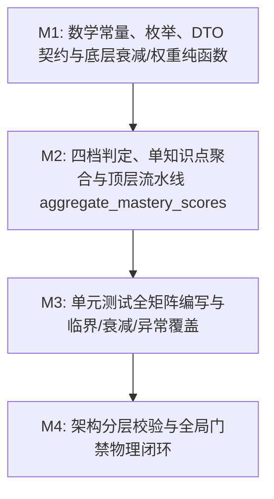

# Plan: 掌握度时间衰减与聚合算法 (aggregate_mastery_scores) - 实施计划

- **关联 Spec**: ZL-112
- **实施执行人 / Agent**: Dev / Planner & Builder
- **当前状态**: Approved
- **架构定级**: Tier 2 (单模块特性演进 / 纯函数算法核)

---

## 1. 变更文件清单 (Pillar 1: Files that change)

### 1.1 新增文件
* `backend/app/core/algorithms/mastery.py`:
  - 掌握度时间衰减与聚合算法纯函数计算核实现；
  - 包含核心物理与数学常量（严格标注《软件需求规格说明书》与 `AGENTS.md` 依据注释）：
    - `DEFAULT_HALF_LIFE_DAYS = 30.0`（艾宾浩斯记忆遗忘半衰期 30 天）
    - `DEFAULT_DECAY_LAMBDA = math.log(2) / DEFAULT_HALF_LIFE_DAYS`（衰减系数 $\lambda \approx 0.023104906$）
    - `SECONDS_PER_DAY = 86400.0`（每天秒数）
    - `DEFAULT_WEAK_UPPER_THRESHOLD = 0.40`（薄弱档次上限临界值，0.40 严格进阶）
    - `DEFAULT_DEVELOPING_UPPER_THRESHOLD = 0.70`（进阶档次上限临界值，0.70 严格掌握）
    - `DEFAULT_OFFLINE_RULE_WEIGHT = 1.0`（客观题/离线精确规则置信权重）
    - `DEFAULT_AI_GRADING_WEIGHT = 0.8`（大语言模型判题置信权重）
    - `DEFAULT_SELF_ASSESSMENT_WEIGHT = 0.5`（用户主观自评/申诉置信权重）
    - `MILLISECOND_TIMESTAMP_THRESHOLD = 1e11`（毫秒时间戳自动纠偏阈值）
  - 包含不可变领域数据模型（DTO）与枚举：
    - `MasteryLevel(str, enum.Enum)`（四档掌握度等级：`UNLEARNED`, `WEAK`, `DEVELOPING`, `MASTERED`）
    - `GradingSourceType(str, enum.Enum)`（六类判分来源及别名：`OFFLINE_RULE`, `LLM_GRADING`, `AI_GRADING`, `SELF_ASSESSMENT`, `APPEAL_REGRADE`, `USER_APPEAL`）
    - `AttemptRecord(frozen=True)`（单次作答不可变实体：`record_id`, `knowledge_id`, `score`, `source`, `answered_at_timestamp`）
    - `MasteryAlgorithmConfig(frozen=True)`（算法可配置参数：`half_life_days`, `source_weights`, `weak_upper_threshold`, `developing_upper_threshold`，带 `__post_init__` 边界防御断言）
    - `MasteryAggregationItem(frozen=True)`（单知识点聚合产物：`knowledge_id`, `mastery_score`, `mastery_level`, `effective_attempts_count`, `raw_average_score`, `decayed_weight_sum`, `last_practiced_timestamp`）
    - `MasteryScoreResult(frozen=True)`（多知识点汇总产物：`knowledge_mastery_map`, `overall_score`, `evaluated_at_timestamp`）
  - 包含 5 个高内聚单一职责纯函数（全部满足 $V(G) \le 8$ 复杂度门禁）：
    - `calculate_time_decay_factor`（计算时间差天数及指数衰减因子，带未来时间防穿透与负半衰期保护，$V(G) \le 3$）
    - `resolve_source_weight`（解析判分来源渠道基础置信权重，带未知来源容错，$V(G) \le 4$）
    - `determine_mastery_level`（依据得分与有无记录判定四档等级，覆盖 0.40/0.70 临界边界，$V(G) \le 4$）
    - `aggregate_single_knowledge_mastery`（单知识点作答时序衰减、加权汇算与最新作答时间提取，$V(G) \le 6$）
    - `aggregate_mastery_scores`（顶层总控流水线：空数据短路、按知识点分组、多知识点聚合、全局宏观总分汇算，$V(G) \le 5$）

* `backend/tests/unit/core/algorithms/test_mastery.py`:
  - 算法纯函数单元测试套件；
  - 遵循 0 Mock、0 外部依赖与 0 系统时钟调用原则，全部输入时间由测试夹具显式注入；
  - 包含闲置衰减对照组（3/7/30/300天）、0.40/0.70临界判定、四类来源加权、异常防御边界、多知识点混合聚合及高并发压测基准。

### 1.2 修改文件
* `backend/app/core/algorithms/__init__.py`:
  - 导出 `aggregate_mastery_scores`、`aggregate_single_knowledge_mastery` 等公开纯函数，以及 `MasteryLevel`、`AttemptRecord`、`MasteryAggregationItem`、`MasteryScoreResult`、`MasteryAlgorithmConfig` 等核心契约。
* `docs/sdlc/ZL-112/plan.md`:
  - 实施方案工件维护与准出签批推进。

---

## 2. 伴随式分步实施与任务拆解 (Pillar 2: Order of work)



### Milestone 1: 数学常量、枚举、DTO 契约与底层衰减/权重纯函数 (M1)
* **目标**:
  1. 定义核心物理与数学阈值常量（附显式需求与教育学模型注释）：
     - `DEFAULT_HALF_LIFE_DAYS = 30.0`
     - `DEFAULT_DECAY_LAMBDA = math.log(2) / DEFAULT_HALF_LIFE_DAYS`
     - `SECONDS_PER_DAY = 86400.0`
     - `DEFAULT_WEAK_UPPER_THRESHOLD = 0.40`
     - `DEFAULT_DEVELOPING_UPPER_THRESHOLD = 0.70`
     - `DEFAULT_OFFLINE_RULE_WEIGHT = 1.0`
     - `DEFAULT_AI_GRADING_WEIGHT = 0.8`
     - `DEFAULT_SELF_ASSESSMENT_WEIGHT = 0.5`
     - `MILLISECOND_TIMESTAMP_THRESHOLD = 1e11`
  2. 实现枚举与不可变 DTO：
     - `MasteryLevel(str, enum.Enum)`: `UNLEARNED`, `WEAK`, `DEVELOPING`, `MASTERED`
     - `GradingSourceType(str, enum.Enum)`: `OFFLINE_RULE`, `LLM_GRADING`, `AI_GRADING`, `SELF_ASSESSMENT`, `APPEAL_REGRADE`, `USER_APPEAL`
     - `AttemptRecord(frozen=True)`: `record_id`, `knowledge_id`, `score`, `source`, `answered_at_timestamp`
     - `MasteryAlgorithmConfig(frozen=True)`: 带 `__post_init__` 边界校验（半衰期 $> 0$、阈值满足 $0 \le weak < developing \le 1$）
     - `MasteryAggregationItem(frozen=True)` 与 `MasteryScoreResult(frozen=True)`
  3. 实现底层计算纯函数：
     - `calculate_time_decay_factor(answered_at_timestamp, evaluated_at_timestamp, half_life_days=30.0) -> float`：
       - 自动检测毫秒级时间戳（$> 10^{11}$）并除以 1000.0 纠偏；
       - 若作答时间晚于评估时间（未来时间），时间差钳制为 0.0，衰减因子为 1.0；
       - 若半衰期 $\le 0.0$，防御性回退至 30.0 天；
       - 严格依据 $\text{decay} = 2^{-\Delta t / T_{1/2}} = e^{-\lambda \Delta t}$ 计算 ($V(G) \le 3$)。
     - `resolve_source_weight(source, custom_weights=None) -> float`：
       - 匹配离线规则 (1.0)、AI判题 (0.8)、自评/申诉 (0.5)，未知来源兜底 0.5 ($V(G) \le 4$)。
* **涉及文件**:
  - `backend/app/core/algorithms/mastery.py`
  - `backend/tests/unit/core/algorithms/test_mastery.py` (M1 伴随测试桩)
* **局部验证命令**:
  ```bash
  cd backend && pytest tests/unit/core/algorithms/test_mastery.py -k "test_decay_factor or test_source_weight or test_config"
  ```
* **预期判据**: 衰减因子指数计算正确（3/7/30/300天误差 $< 10^{-4}$）、来源置信度权重解析符合规范、配置防御校验通过。

---

### Milestone 2: 四档判定、单知识点聚合与顶层流水线 aggregate_mastery_scores (M2)
* **目标**:
  1. 实现四档掌握度等级判定纯函数：
     - `determine_mastery_level(mastery_score, has_records=True, weak_threshold=0.40, developing_threshold=0.70) -> MasteryLevel`：
       - `has_records is False` $\to$ 严格返回 `MasteryLevel.UNLEARNED`；
       - $S < 0.40$ $\to$ `MasteryLevel.WEAK`；
       - $0.40 \le S < 0.70$ $\to$ `MasteryLevel.DEVELOPING`（0.40 严格进阶）；
       - $S \ge 0.70$ $\to$ `MasteryLevel.MASTERED`（0.70 严格掌握）；
       - 控制复杂度 $V(G) \le 4$。
  2. 实现单知识点作答聚合核心纯函数：
     - `aggregate_single_knowledge_mastery(knowledge_id, records, evaluated_at_timestamp, config=None) -> MasteryAggregationItem`：
       - 若 `records` 为空：返回 `mastery_score=0.0, mastery_level=UNLEARNED, effective_attempts_count=0, raw_average_score=0.0, decayed_weight_sum=0.0, last_practiced_timestamp=None`；
       - 遍历记录并过滤/钳制非法分数：$s_i = \min(1.0, \max(0.0, \text{record.score}))$；
       - 逐条计算衰减因子与有效权重 $w_i = W_{\text{source}} \times \text{decay\_factor}$；
       - 累计权重总和与加权得分总和，跟踪记录最新作答时间戳 `max(answered_at_timestamp)`；
       - 若总权重 $\le 0$（异常边界）：安全返回得分 0.0 与 `UNLEARNED`；
       - 最终综合得分保留 4 位小数：`round(weighted_score_sum / weight_sum, 4)` 并钳制在 $[0.0, 1.0]$；
       - 计算算术平均分 `raw_average_score = round(raw_score_sum / n, 4)` 用于基线对比；
       - 装配不可变 `MasteryAggregationItem`，控制复杂度 $V(G) \le 6$。
  3. 实现顶层总控流水线：
     - `aggregate_mastery_scores(records, evaluated_at_timestamp, config=None) -> MasteryScoreResult`：
       - 若 `records` 为空序列：短路返回 `knowledge_mastery_map={}, overall_score=0.0, evaluated_at_timestamp=evaluated_at_timestamp`；
       - 使用标准库按 `record.knowledge_id` 聚类分组；
       - 循环调用 `aggregate_single_knowledge_mastery` 获得各知识点聚合项；
       - 计算宏观全局掌握度总分：所有知识点掌握度得分的算术平均值（保留 4 位小数）；
       - 装配不可变 `MasteryScoreResult` 返回，控制复杂度 $V(G) \le 5$。
  4. 更新 `backend/app/core/algorithms/__init__.py` 导出上述符号。
* **涉及文件**:
  - `backend/app/core/algorithms/mastery.py`
  - `backend/app/core/algorithms/__init__.py`
  - `backend/tests/unit/core/algorithms/test_mastery.py` (M2 伴随测试)
* **局部验证命令**:
  ```bash
  cd backend && pytest tests/unit/core/algorithms/test_mastery.py -k "test_single_knowledge or test_aggregate_mastery_scores"
  ```
* **预期判据**: 单知识点与多知识点批量聚合测试通过，掌握度得分、四档等级、最新时间戳及总体均分计算准确无误。

---

### Milestone 3: 单元测试全矩阵编写与临界/衰减/异常覆盖 (M3)
* **目标**:
  1. 完整编写 `backend/tests/unit/core/algorithms/test_mastery.py`，实现 100% 分支覆盖与毫秒级执行：
     - **时间衰减基准套件** (`TestTimeDecayCalculation`):
       - 0 天衰减因子严格为 1.0；
       - 3 天衰减因子约为 0.933037；
       - 7 天衰减因子约为 0.850283；
       - 30 天衰减因子严格为 0.500000（半衰期严格折半）；
       - 300 天衰减因子严格为 $2^{-10} \approx 0.0009765625$；
       - 作答时间处于未来（$\Delta t < 0$）防御性返回 1.0。
     - **四档掌握度临界判定套件** (`TestMasteryLevelDetermination`):
       - `has_records=False` 判定为 `UNLEARNED`；
       - $0.0000$ (有作答) $\to$ `WEAK`；
       - $0.3999$ $\to$ `WEAK`；
       - $0.4000$ $\to$ `DEVELOPING`（0.40 严格边界测试）；
       - $0.6999$ $\to$ `DEVELOPING`；
       - $0.7000$ $\to$ `MASTERED`（0.70 严格边界测试）；
       - $1.0000$ $\to$ `MASTERED`。
     - **判分来源加权合成套件** (`TestGradingSourceWeights`):
       - 离线规则 (1.0) vs AI判题 (0.8) vs 自评 (0.5) 单源得分验证；
       - 复合来源：同天同题 1 次离线满分 (1.0) + 1 次自评 0 分 (0.5)，加权得分严格为 $1.0 / 1.5 = 0.6667$ (`DEVELOPING`)；
       - 自定义来源权重字典注入验证。
     - **异常输入与边界防御套件** (`TestMasteryEdgeCasesAndDefense`):
       - 空作答列表短路验证；
       - 单题异常得分（$-0.5$ 钳制为 $0.0$，$1.5$ 钳制为 $1.0$）；
       - 毫秒级时间戳（13 位）传入自动转换为秒级时间戳；
       - 半衰期非正异常配置自动纠偏防御；
       - 未知来源字符串自动采用保底权重 0.5。
     - **多知识点批量聚合与宏观总分套件** (`TestBatchMasteryAggregation`):
       - 混合 3 个知识点多条历史作答，验证各自隔离聚合；
       - 验证 `last_practiced_timestamp` 正确提取最新时间戳；
       - 验证 `overall_score` 为各知识点分数的精准均值。
     - **性能与基准测试套件** (`TestMasteryPerformanceBenchmark`):
       - 批量 10,000 条作答记录聚合计算耗时 $\le 50\text{ms}$，平均单条微秒级完成。
* **涉及文件**:
  - `backend/tests/unit/core/algorithms/test_mastery.py`
* **局部验证命令**:
  ```bash
  cd backend && pytest tests/unit/core/algorithms/test_mastery.py \
    --cov=app.core.algorithms.mastery \
    --cov-branch \
    --cov-report=term-missing \
    --cov-fail-under=95
  ```
* **预期判据**: 单元测试 100% 绿灯，行覆盖率 $\ge 95\%$（目标 100%），分支覆盖率 100%。

---

### Milestone 4: 架构分层校验与全局门禁物理闭环 (M4)
* **目标**:
  1. 执行架构分层检查，确保纯函数计算核 0 框架污染、0 上层模块导入：
     `python3 tooling/check_layers.py --root backend/app`
  2. 格式与代码质量扫描（行宽 100、Ruff 规则集无警告）：
     `cd backend && ruff format --check app/core/algorithms/mastery.py tests/unit/core/algorithms/test_mastery.py`
     `cd backend && ruff check app/core/algorithms/mastery.py tests/unit/core/algorithms/test_mastery.py`
  3. 类型注解严格模式检查（无类型丢失与推断错误）：
     `cd backend && mypy app/core/algorithms/mastery.py`
  4. 安全漏洞专项扫描（0 高危、0 中危）：
     `cd backend && bandit -r app/core/algorithms/mastery.py -ll`
  5. 核心算法全量回归测试：
     `cd backend && pytest tests/unit/core/algorithms/`
  6. SDLC 任务完整性校验：
     `python3 tooling/check_sdlc_integrity.py`
* **涉及文件**:
  - `backend/app/core/algorithms/mastery.py`
  - `backend/app/core/algorithms/__init__.py`
  - `backend/tests/unit/core/algorithms/test_mastery.py`
  - `docs/sdlc/ZL-112/plan.md`
* **局部验证命令**:
  ```bash
  python3 tooling/check_layers.py --root backend/app && \
  cd backend && \
  ruff format --check app/core/algorithms/mastery.py tests/unit/core/algorithms/test_mastery.py && \
  ruff check app/core/algorithms/mastery.py tests/unit/core/algorithms/test_mastery.py && \
  mypy app/core/algorithms/mastery.py && \
  bandit -r app/core/algorithms/mastery.py -ll && \
  pytest tests/unit/core/algorithms/test_mastery.py --cov=app.core.algorithms.mastery --cov-branch --cov-fail-under=95 && \
  cd .. && \
  python3 tooling/check_sdlc_integrity.py
  ```
* **预期判据**: 所有检查全部通过，退出码 0，工件无占位符。

---

## 3. 风险分析与规避方案 (Pillar 3: Risks & mitigation)

| 风险项 (Risk) | 严重度 | 潜在影响 | 规避与缓解策略 (Mitigation) |
| :--- | :--- | :--- | :--- |
| **R1: 浮点数舍入导致 0.40 与 0.70 临界边界等级误判** | 高 | 二进制浮点数计算（如 `0.39999999999999997` 或 `0.7000000000000001`）导致等级被错误划分至 `WEAK` 或 `DEVELOPING`。 | 1. 在单知识点聚合得分计算时显式采用 `round(score, 4)` 四舍五入保留 4 位精度；<br>2. 判定逻辑采用开闭区间严格匹配：$S < 0.40$ 为 `WEAK`，$S < 0.70$ 为 `DEVELOPING`，其余为 `MASTERED`；<br>3. M3 中设置 0.3999、0.4000、0.6999、0.7000 边界单测守护。 |
| **R2: 前端或第三方毫秒级时间戳导致衰减因子异常骤降** | 高 | 毫秒级时间戳（13 位）若按秒级（10 位）计算，时间跨度将放大 1000 倍，导致所有作答衰减因子直接归零。 | 依据 Spec 5.2，在计算时间差时增加毫秒阈值防御：若时间戳大于 $10^{11}$，算法内部自动除以 1000.0 进行秒级换算，阻断数量级漂移事故。 |
| **R3: 聚合流水线环路复杂度超标 ($V(G) > 8$)** | 中 | 聚合算法涉及作答过滤、时间衰减、多来源加权、异常防御与批量聚类，若堆叠在单一函数中会导致 $V(G) > 8$，违反 `AGENTS.md` 铁律。 | 严格按 Spec 1.4 进行单一职责函数拆解：衰减因子计算 ($V(G) \le 3$)、来源权重解析 ($V(G) \le 4$)、四档判定 ($V(G) \le 4$)、单知识点聚合 ($V(G) \le 6$)、顶层入口 ($V(G) \le 5$)，全模块任一函数复杂度 $\le 6 < 8$。 |
| **R4: 隐式时钟引入破坏纯函数可测性与架构分层** | 高 | 算法内部若误用 `datetime.now()` 或 `time.time()`，破坏纯函数确定性，导致历史推演与单元测试无法重现。 | 算法函数接口强制要求显式传入基准秒级时间戳 `evaluated_at_timestamp`；算法模块仅使用原生标准库（`math`, `enum`, `dataclasses`, `collections.abc`），由 `check_layers.py` 严格阻断外部 I/O 与网络依赖。 |
| **R5: 零作答、全无效作答或零权重累积引发除以零崩溃** | 中 | 知识点无作答记录，或作答由于严重衰减导致权重累计总和趋近于 0，在计算除法时发生 `ZeroDivisionError`。 | 在聚合计算前设置前置安全守卫：作答记录为空时直接返回默认值；在分母计算处增加 `if weight_sum <= 0.0:` 保护分支，安全返回掌握度 0.0 与 `UNLEARNED` 档次。 |

---

## 4. 真实性验证判据与物理闭环 (Pillar 4: Proof / Verification commands)

实施完毕后，必须依次在终端执行以下物理验证命令并确保退出码均为 0：

### 4.1 架构分层依赖合法性校验
```bash
python3 tooling/check_layers.py --root backend/app
```
* **判据**: 扫描全量代码，架构五层单向依赖合法，`mastery.py` 纯函数计算核 0 越权依赖。

### 4.2 代码规范与排版格式检查 (Ruff)
```bash
cd backend && ruff format --check app/core/algorithms/mastery.py tests/unit/core/algorithms/test_mastery.py
cd backend && ruff check app/core/algorithms/mastery.py tests/unit/core/algorithms/test_mastery.py
```
* **判据**: 行宽 100 严格达标，Ruff 质量扫描 0 报错、0 告警。

### 4.3 静态类型安全检查 (Mypy Strict)
```bash
cd backend && mypy app/core/algorithms/mastery.py
```
* **判据**: `Success: no issues found in 1 source file`，所有函数参数、返回值与局部模型类型完备标注。

### 4.4 安全代码漏洞扫描 (Bandit)
```bash
cd backend && bandit -r app/core/algorithms/mastery.py -ll
```
* **判据**: 高危与中危漏洞数量均为 0。

### 4.5 算法核单测全量执行与覆盖率硬性门禁
```bash
cd backend && pytest tests/unit/core/algorithms/test_mastery.py \
  --cov=app.core.algorithms.mastery \
  --cov-branch \
  --cov-report=term-missing \
  --cov-fail-under=95
```
* **判据**:
  - 全量单元测试用例 100% 绿灯（退出码 0）；
  - 行覆盖率 $\ge 95\%$（目标 100%）；
  - 分支覆盖率 **100%**；
  - 纯函数零网络、零 I/O 运行，全套测试执行耗时 $\le 100\text{ms}$。

### 4.6 算法内核全套回归验证
```bash
cd backend && pytest tests/unit/core/algorithms/
```
* **判据**: 包含现有分块、OCR质检、知识点质检、题目质检、判题算法及新增掌握度算法全部绿灯。

### 4.7 SDLC 研发工件完整性合规检查
```bash
python3 tooling/check_sdlc_integrity.py
```
* **判据**: 退出码 0，任务工件 `intent.md`、`spec.md`、`plan.md` 完整且无未替换占位符。

---

## 5. 决策表与用例映射对照矩阵 (Decision Table & Test Matrix)

### 5.1 时间衰减因子基准对照矩阵 (半衰期 30 天)
依据 Spec 1.2 数学模型（$\lambda = \ln(2)/30 \approx 0.023104906$）：

| 用例编号 | 间隔天数 $\Delta t$ | 理论衰减因子 $\text{decay\_factor}$ | 允许浮点误差 | 预期行为与物理含义 | 对应单测函数名 |
| :--- | :--- | :--- | :--- | :--- | :--- |
| **TC-TIME-01** | 0.0 天 | $1.000000$ | $\pm 10^{-6}$ | 当天作答，记忆完全新鲜，无衰减 | `test_decay_zero_days_returns_one` |
| **TC-TIME-02** | 3.0 天 | $\approx 0.933033$ | $\pm 10^{-4}$ | 短期遗忘初期，记忆留存超 93% | `test_decay_three_days` |
| **TC-TIME-03** | 7.0 天 | $\approx 0.850283$ | $\pm 10^{-4}$ | 一周未练，记忆衰减至 85% 左右 | `test_decay_seven_days` |
| **TC-TIME-04** | 30.0 天 | $0.500000$ | $\pm 10^{-6}$ | 恰好一个半衰期，有效贡献严格折半 | `test_decay_thirty_days_half_life` |
| **TC-TIME-05** | 300.0 天 | $2^{-10} \approx 0.000977$ | $\pm 10^{-6}$ | 经历 10 个半衰期，贡献几乎衰减殆尽 | `test_decay_three_hundred_days` |
| **TC-TIME-06** | $-2.0$ 天 (未来) | $1.000000$ | $\pm 10^{-6}$ | 作答时间处于未来，防御性钳制为 0 天衰减 | `test_decay_future_timestamp_clamped` |

### 5.2 掌握度四级档次映射与临界值矩阵
依据 Spec 1.2 与《软件需求规格说明书》：

| 用例编号 | 是否有记录 | 掌握度得分 $S$ | 预期等级 `MasteryLevel` | 边界临界特性 | 对应单测函数名 |
| :--- | :--- | :--- | :--- | :--- | :--- |
| **TC-LEVEL-01** | False | 0.0000 | `UNLEARNED` | 无任何历史作答记录，固定未学 | `test_level_unlearned_no_records` |
| **TC-LEVEL-02** | True | 0.0000 | `WEAK` | 有作答但得分为 0，判定为薄弱 | `test_level_weak_zero_score` |
| **TC-LEVEL-03** | True | 0.3999 | `WEAK` | 薄弱上限临界下侧 | `test_level_weak_near_threshold` |
| **TC-LEVEL-04** | True | 0.4000 | `DEVELOPING` | **0.40 严格归属于进阶中 (DEVELOPING)** | `test_level_developing_exact_threshold` |
| **TC-LEVEL-05** | True | 0.6999 | `DEVELOPING` | 进阶中上限临界下侧 | `test_level_developing_near_threshold` |
| **TC-LEVEL-06** | True | 0.7000 | `MASTERED` | **0.70 严格归属于掌握 (MASTERED)** | `test_level_mastered_exact_threshold` |
| **TC-LEVEL-07** | True | 1.0000 | `MASTERED` | 满分掌握 | `test_level_mastered_full_score` |
| **TC-LEVEL-08** | True | 0.5500 | `DEVELOPING` | 居中正常进阶中得分 | `test_level_developing_normal_score` |

### 5.3 判题来源权重置信度合成矩阵
依据 Spec 1.2 来源置信度模型：

| 用例编号 | 来源渠道 | 基础权重 | 场景作答特征 | 期望加权得分与档次 | 对应单测函数名 |
| :--- | :--- | :--- | :--- | :--- | :--- |
| **TC-SRC-01** | `OFFLINE_RULE` | 1.0 | 单次满分作答，当天完成 | 得分 1.0000 (`MASTERED`) | `test_source_weight_offline_rule` |
| **TC-SRC-02** | `LLM_GRADING` | 0.8 | 单次满分作答，当天完成 | 得分 1.0000 (`MASTERED`) | `test_source_weight_llm_grading` |
| **TC-SRC-03** | `SELF_ASSESSMENT` | 0.5 | 单次满分作答，当天完成 | 得分 1.0000 (`MASTERED`) | `test_source_weight_self_assessment` |
| **TC-SRC-04** | 复合双来源 | 1.0 + 0.5 | 同天完成：1 次离线 1.0 分 + 1 次自评 0.0 分 | 得分 $1.0 / (1.0 + 0.5) \approx 0.6667$ (`DEVELOPING`) | `test_source_composite_offline_and_self` |
| **TC-SRC-05** | 时间衰减加权 | 1.0(30天前) vs 0.8(当天) | 30 天前离线满分 ($w=1.0 \times 0.5=0.5$)，当天 AI 得 0 分 ($w=0.8 \times 1.0=0.8$) | 得分 $(1.0 \times 0.5) / 1.3 \approx 0.3846$ (`WEAK`) | `test_source_decay_weighting_tradeoff` |
| **TC-SRC-06** | 未知渠道别名 | 0.5 | 传入 `"UNKNOWN_CHANNEL"` 字符串 | 安全回退基础权重 0.5 | `test_source_weight_unknown_fallback` |

### 5.4 边界防御与鲁棒性测试矩阵

| 用例编号 | 异常输入特征 | 防御行为与期望产出 | 对应单测函数名 |
| :--- | :--- | :--- | :--- |
| **TC-DEF-01** | `records = []` 空列表 | 立即短路返回 `knowledge_mastery_map={}`, `overall_score=0.0` | `test_defense_empty_records_short_circuit` |
| **TC-DEF-02** | 单题作答得分为负数（如 `-0.8`） | 强制安全钳制为 0.0，不造成负分污染 | `test_defense_negative_score_clamped` |
| **TC-DEF-03** | 单题作答得分超过 1.0（如 `1.5`） | 强制安全钳制为 1.0，不造成超分溢出 | `test_defense_overflow_score_clamped` |
| **TC-DEF-04** | 传入 13 位毫秒时间戳（如 `1774350000000`） | 内部自动检测并除以 1000.0，按秒级精确计算 | `test_defense_millisecond_timestamp_auto_convert` |
| **TC-DEF-05** | 半衰期配置传入 `<= 0.0`（如 `0.0` 或 `-10.0`） | 防御性自动回退为默认半衰期 30.0 天，避免除零异常 | `test_defense_non_positive_half_life_fallback` |
| **TC-DEF-06** | 配置对象边界非法（如 `weak >= developing`） | `MasteryAlgorithmConfig` 实例化抛出 `ValueError` | `test_defense_invalid_config_thresholds_raises` |
| **TC-DEF-07** | 多知识点交织乱序输入 | 按 `knowledge_id` 正确分离聚合，正确提取最新时间戳与宏观平均分 | `test_defense_multi_knowledge_grouping_and_stats` |

---

## 6. 核心实现代码结构蓝图 (Reference Blueprint)

```python
"""掌握度时间衰减与聚合算法纯函数计算核。

本模块严格遵循纯函数计算核铁律（无外部 I/O、无网络、无数据库依赖、零系统时钟调用），
基于艾宾浩斯遗忘定律（半衰期 30 天指数衰减模型）与判题来源置信度加权，
提供单知识点衰减加权聚合、四档掌握度等级映射与多知识点批量汇总流水线。
"""

import enum
import math
from collections import defaultdict
from collections.abc import Sequence
from dataclasses import dataclass

# ==============================================================================
# 掌握度计算核核心数学与物理常量 (依据《软件需求规格说明书》与 AGENTS.md 规范)
# ==============================================================================

DEFAULT_HALF_LIFE_DAYS: float = 30.0
"""默认记忆衰减半衰期天数 (T_1/2 = 30 天)"""

DEFAULT_DECAY_LAMBDA: float = math.log(2.0) / DEFAULT_HALF_LIFE_DAYS
"""衰减常数 lambda = ln(2) / 30.0 ≈ 0.023104906"""

SECONDS_PER_DAY: float = 86400.0
"""每日秒数换算常数"""

DEFAULT_WEAK_UPPER_THRESHOLD: float = 0.40
"""薄弱档次上限阈值：[0.0, 0.40) 为 WEAK"""

DEFAULT_DEVELOPING_UPPER_THRESHOLD: float = 0.70
"""进阶档次上限阈值：[0.40, 0.70) 为 DEVELOPING，>= 0.70 为 MASTERED"""

DEFAULT_OFFLINE_RULE_WEIGHT: float = 1.0
"""客观题与离线规则精确判分基础置信权重"""

DEFAULT_AI_GRADING_WEIGHT: float = 0.8
"""大语言模型主观题判分基础置信权重"""

DEFAULT_SELF_ASSESSMENT_WEIGHT: float = 0.5
"""用户主观自评与申诉复核基础置信权重"""

MILLISECOND_TIMESTAMP_THRESHOLD: float = 1e11
"""毫秒时间戳阈值判定界限（13 位时间戳识别纠偏）"""


@enum.unique
class MasteryLevel(str, enum.Enum):
    """知识点掌握度四档等级定义。"""

    UNLEARNED = "UNLEARNED"      # 未学（无任何作答记录）
    WEAK = "WEAK"                # 薄弱 ([0.0, 0.40))
    DEVELOPING = "DEVELOPING"    # 进阶中 ([0.40, 0.70))
    MASTERED = "MASTERED"        # 掌握 ([0.70, 1.00])


@enum.unique
class GradingSourceType(str, enum.Enum):
    """判分来源类型枚举。"""

    OFFLINE_RULE = "OFFLINE_RULE"          # 离线规则 / 客观题判分 (权重 1.0)
    LLM_GRADING = "LLM_GRADING"            # AI 大模型主观题判题 (权重 0.8)
    AI_GRADING = "AI_GRADING"              # 别名兼容：AI 判题 (权重 0.8)
    SELF_ASSESSMENT = "SELF_ASSESSMENT"    # 用户主观自评 (权重 0.5)
    APPEAL_REGRADE = "APPEAL_REGRADE"      # 申诉后复核重判 (权重 0.5)
    USER_APPEAL = "USER_APPEAL"            # 别名兼容：用户申诉 (权重 0.5)


@dataclass(frozen=True)
class AttemptRecord:
    """单次作答与判分记录不可变实体。"""

    record_id: str
    knowledge_id: str
    score: float
    source: GradingSourceType | str
    answered_at_timestamp: float


@dataclass(frozen=True)
class MasteryAlgorithmConfig:
    """掌握度衰减算法配置不可变参数。"""

    half_life_days: float = DEFAULT_HALF_LIFE_DAYS
    source_weights: dict[str, float] | None = None
    weak_upper_threshold: float = DEFAULT_WEAK_UPPER_THRESHOLD
    developing_upper_threshold: float = DEFAULT_DEVELOPING_UPPER_THRESHOLD

    def __post_init__(self) -> None:
        """配置参数边界安全断言。"""
        if self.half_life_days <= 0.0:
            raise ValueError("half_life_days must be positive")
        if not (0.0 <= self.weak_upper_threshold < self.developing_upper_threshold <= 1.0):
            raise ValueError("Must satisfy: 0.0 <= weak_upper_threshold < developing_upper_threshold <= 1.0")


@dataclass(frozen=True)
class MasteryAggregationItem:
    """单个知识点的掌握度聚合结果。"""

    knowledge_id: str
    mastery_score: float
    mastery_level: MasteryLevel
    effective_attempts_count: int
    raw_average_score: float
    decayed_weight_sum: float
    last_practiced_timestamp: float | None


@dataclass(frozen=True)
class MasteryScoreResult:
    """多知识点批量聚合汇总产物。"""

    knowledge_mastery_map: dict[str, MasteryAggregationItem]
    overall_score: float
    evaluated_at_timestamp: float


def calculate_time_decay_factor(
    answered_at_timestamp: float,
    evaluated_at_timestamp: float,
    half_life_days: float = DEFAULT_HALF_LIFE_DAYS,
) -> float:
    """计算时间衰减因子 (V(G) <= 3)。"""


def resolve_source_weight(
    source: GradingSourceType | str,
    custom_weights: dict[str, float] | None = None,
) -> float:
    """解析判分来源的基础置信权重 (V(G) <= 4)。"""


def determine_mastery_level(
    mastery_score: float,
    has_records: bool = True,
    weak_threshold: float = DEFAULT_WEAK_UPPER_THRESHOLD,
    developing_threshold: float = DEFAULT_DEVELOPING_UPPER_THRESHOLD,
) -> MasteryLevel:
    """根据掌握度得分与作答状态确定四档掌握度等级 (V(G) <= 4)。"""


def aggregate_single_knowledge_mastery(
    knowledge_id: str,
    records: Sequence[AttemptRecord],
    evaluated_at_timestamp: float,
    config: MasteryAlgorithmConfig | None = None,
) -> MasteryAggregationItem:
    """聚合单个知识点的作答历史并计算衰减掌握度 (V(G) <= 6)。"""


def aggregate_mastery_scores(
    records: Sequence[AttemptRecord],
    evaluated_at_timestamp: float,
    config: MasteryAlgorithmConfig | None = None,
) -> MasteryScoreResult:
    """顶层入口：批量聚合所有知识点的历史作答记录 (V(G) <= 5)。"""
```

---

## 7. 实施偏差记录 (Deviations Log)
- **初始规划与 Spec 100% 对齐**:
  - 本实施计划严格承接 `docs/sdlc/ZL-112/spec.md` 技术契约，无任何接口缩减或改动；
  - 核心物理常量依据、不可变 DTO、艾宾浩斯指数衰减公式、三级来源置信度权重（1.0 / 0.8 / 0.5）、四档掌握度划分（0.40/0.70 严格归属进阶/掌握）完全一致；
  - McCabe 环路复杂度严格受控于 $V(G) \le 8$（实际拆解后各子函数最高 $V(G) \le 6$）；
  - 全流程遵循纯函数计算核铁律，0 外部 I/O 与网络依赖，0 mock 单元测试，无架构或分层偏差。

---

## 8. 阶段准出签批 (Gate 3 Sign-off)
- [ ] 所有分步实施项与验证断言均已就地执行并通过
- [ ] 全局质量门禁（Lint / Type / Bandit / check_layers / Regression）全部绿灯
- [ ] 变更文件与 plan.md 清单完全吻合，无越权修改
- **验收结论**: Pending (待实施与验证完成后由人类签批)
- **验证人 / 日期**: [待人类确认] / 2026-09-23
