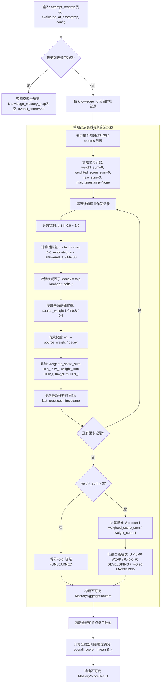

# Spec: 掌握度时间衰减与聚合算法 (aggregate_mastery_scores) - 技术契约

- **关联 Intent**: ZL-112
- **主导设计人**: Dev / TechLead
- **当前状态**: In-Review
- **任务评级**: Tier 2 (Single-Module Feature)

---

## 1. 架构流向与设计方案

### 1.1 模块定位与分层边界
掌握度时间衰减与聚合算法核是智练自主学习平台学生学情画像、自适应练习推荐与诊断报告生成的底层计算基石，严格归属于系统五层单向架构矩阵的**纯函数计算核**：
- **物理路径**: `backend/app/core/algorithms/mastery.py`
- **分层依赖铁律**:
  - 严格单向无环，绝对禁止导入 `fastapi`, `sqlalchemy`, `httpx`, `redis`, `boto3` 等任何 Web 框架、网络库、缓存或 ORM 驱动；
  - 绝对禁止导入上层业务模块 `app/services`、`app/repositories` 以及外部能力层 `app/integrations`；
  - 必须通过 `python3 tooling/check_layers.py --root backend/app` 单向依赖门禁校验（0 违规）；
  - **零时钟隐式依赖**：算法函数内部绝对严禁调用 `datetime.now()` 或 `time.time()`，评估基准时间戳 `evaluated_at_timestamp` 必须由调用方显式传入，确保纯函数具备 100% 确定性、幂等性与可回放测试能力；
  - 输入参数与输出产物均为不可变原生值对象（`dataclasses.dataclass(frozen=True)`、标准基础类型 `tuple`、`str`、`float`、`int` 等）。
- **与业务实体解耦**:
  - 本模块不直接访问数据库表 `attempts`、`grading_records` 或 `knowledge_mastery_snapshots`；
  - 业务编排层（如 `ReportService` / `PracticeService`）负责从数据仓储检索用户的历史作答与判分记录，将其映射为 `AttemptRecord` 序列，显式指定评估时间戳后注入本算法；
  - 算法核完成衰减加权聚合后输出 `MasteryScoreResult` 与 `MasteryAggregationItem`，由上层服务完成持久化或组装诊断报告。

### 1.2 艾宾浩斯时间衰减与来源置信度数学模型

本算法依据心理学艾宾浩斯遗忘曲线与记忆衰退动力学方程，结合判题来源客观置信度构建复合加权模型：

1. **半衰期与时间衰减模型**:
   - 默认半衰期常量：$T_{1/2} = 30.0$ 天（对应 $30 \times 86400 = 2,592,000$ 秒）；
   - 依据放射性衰变/记忆半衰期微积分方程 $N(t) = N_0 \cdot e^{-\lambda t} = N_0 \cdot 2^{-t / T_{1/2}}$，衰减常数定义为：
     $$\lambda = \frac{\ln(2)}{T_{1/2}} = \frac{\ln(2)}{30.0} \approx 0.023104906$$
   - 时间跨度天数计算（支持浮点天数）：
     $$\Delta t = \max\left(0.0, \frac{\text{evaluated\_at\_timestamp} - \text{answered\_at\_timestamp}}{86400.0}\right)$$
     *注：若作答时间晚于评估基准时间（时钟漂移或防御分支），$\Delta t$ 强制钳制为 0.0 天，衰减因子为 1.0。*
   - 时间衰减因子计算：
     $$\text{decay\_factor} = e^{-\lambda \times \Delta t} = 2^{-\Delta t / 30.0}$$
     *典型时间衰减校验标杆*：
     - 0 天：$\text{decay\_factor} = 1.0$
     - 3 天：$\text{decay\_factor} \approx 0.9330$
     - 7 天：$\text{decay\_factor} \approx 0.8503$
     - 30 天：$\text{decay\_factor} = 0.5000$（严格折半）
     - 300 天：$\text{decay\_factor} = 2^{-10} \approx 0.0009765625$

2. **判题来源置信度基础权重**:
   - 依据《软件需求规格说明书》与 `AGENTS.md` 核心计算核第 5 条要求，不同批改通道可信度差异显著：
     - `OFFLINE_RULE`（客观题/离线精确规则匹配）：基础置信权重 $W_{\text{source}} = 1.0$
     - `LLM_GRADING` / `AI_GRADING`（大语言模型主观题评分）：基础置信权重 $W_{\text{source}} = 0.8$
     - `SELF_ASSESSMENT` / `APPEAL_REGRADE` / `USER_APPEAL`（用户自评或申诉复核）：基础置信权重 $W_{\text{source}} = 0.5$
     - 未知或缺省渠道：基础置信权重 $W_{\text{source}} = 0.5$

3. **作答得分与综合贡献权重合成**:
   - 单条作答原始得分防异常钳制：$s_i = \min(1.0, \max(0.0, \text{raw\_score}_i))$；
   - 单条作答有效贡献权重：$w_i = W_{\text{source}, i} \times \text{decay\_factor}_i$；
   - 知识点加权聚合掌握度得分 $S$：
     $$S = \begin{cases} 0.0, & \text{若 } \sum w_i = 0 \text{ 或作答记录为空} \\ \min\left(1.0, \max\left(0.0, \frac{\sum_{i=1}^{n} (s_i \times w_i)}{\sum_{i=1}^{n} w_i}\right)\right), & \text{若 } \sum w_i > 0 \end{cases}$$
   - 数值精度保留：四舍五入保留 4 位小数（`round(S, 4)`）。

4. **4 级掌握度档次（Mastery Level）映射契约**:
   - `UNLEARNED`（未学）：有效作答记录数等于 0，掌握度固定为 0.0；
   - `WEAK`（薄弱）：$0.0 \le S < 0.40$；
   - `DEVELOPING`（进阶中）：$0.40 \le S < 0.70$（**0.40 严格属于 DEVELOPING**）；
   - `MASTERED`（掌握）：$0.70 \le S \le 1.00$（**0.70 严格属于 MASTERED**）。

### 1.3 核心处理流水线



### 1.4 白盒复杂度控制与函数拆解 ($V(G) \le 8$)

为严格贯彻《概要设计说明书》第 7.1 节与 `AGENTS.md` 对核心算法计算核的复杂度红线（掌握度衰减聚合函数 McCabe 环路复杂度 $V(G) \le 8$），本模块将聚合计算拆解为 5 个职责单一的高内聚纯函数：

1. `calculate_time_decay_factor(answered_at_timestamp: float, evaluated_at_timestamp: float, half_life_days: float = DEFAULT_HALF_LIFE_DAYS) -> float` ($V(G) \le 3$):
   - 计算时间差天数并钳制非负，计算指数衰减因子；半衰期非正异常时做防御保护。
2. `resolve_source_weight(source: GradingSourceType | str, custom_weights: dict[str, float] | None = None) -> float` ($V(G) \le 4$):
   - 根据作答批改来源解析置信度权重（1.0 / 0.8 / 0.5），兼容字符串枚举与别名映射。
3. `determine_mastery_level(mastery_score: float, has_records: bool = True) -> MasteryLevel` ($V(G) \le 4$):
   - 根据掌握度得分执行严格四档划分，处理无记录 `UNLEARNED`、0.40 进阶临界点、0.70 掌握临界点。
4. `aggregate_single_knowledge_mastery(knowledge_id: str, records: Sequence[AttemptRecord], evaluated_at_timestamp: float, config: MasteryAlgorithmConfig | None = None) -> MasteryAggregationItem` ($V(G) \le 6$):
   - 单知识点聚合计算核心，完成单知识点所有作答的时序衰减、加权平均、算术平均、最新作答时间戳提取与档次装配。
5. `aggregate_mastery_scores(records: Sequence[AttemptRecord], evaluated_at_timestamp: float, config: MasteryAlgorithmConfig | None = None) -> MasteryScoreResult` ($V(G) \le 5$):
   - 顶层总控入口函数：按知识点分组、多知识点批量计算、全局平均分汇算与 `MasteryScoreResult` 封装。

---

## 2. API 与数据契约设计

### 2.1 基础枚举定义

```python
import enum

@enum.unique
class MasteryLevel(str, enum.Enum):
    """知识点掌握度四档等级定义。
    
    严格对齐《软件需求规格说明书》与 AGENTS.md 规范。
    """
    UNLEARNED = "UNLEARNED"      # 未学（无任何作答记录）
    WEAK = "WEAK"                # 薄弱 ([0.0, 0.40))
    DEVELOPING = "DEVELOPING"    # 进阶中 ([0.40, 0.70))
    MASTERED = "MASTERED"        # 掌握 ([0.70, 1.00])


@enum.unique
class GradingSourceType(str, enum.Enum):
    """判题批改来源类型枚举。
    
    不同来源具备不同的置信度权重基准。
    """
    OFFLINE_RULE = "OFFLINE_RULE"          # 离线精确规则/客观题比对 (权重 1.0)
    LLM_GRADING = "LLM_GRADING"            # AI 大模型主观题判题 (权重 0.8)
    AI_GRADING = "AI_GRADING"              # 别名兼容：AI 判题 (权重 0.8)
    SELF_ASSESSMENT = "SELF_ASSESSMENT"    # 用户主观自评 (权重 0.5)
    APPEAL_REGRADE = "APPEAL_REGRADE"      # 申诉后人工/复核重判 (权重 0.5)
    USER_APPEAL = "USER_APPEAL"            # 别名兼容：用户申诉 (权重 0.5)
```

### 2.2 输入数据契约

```python
from dataclasses import dataclass
from collections.abc import Sequence

@dataclass(frozen=True)
class AttemptRecord:
    """单次作答与判分记录不可变实体。
    
    Attributes:
        record_id: 作答记录全局唯一标识符
        knowledge_id: 所属知识点标识符
        score: 单题得分比例，归一化范围 [0.0, 1.0]
        source: 判分来源类型（GradingSourceType 或其字符串表达）
        answered_at_timestamp: 作答提交时的秒级 Unix 时间戳
    """
    record_id: str
    knowledge_id: str
    score: float
    source: GradingSourceType | str
    answered_at_timestamp: float


@dataclass(frozen=True)
class MasteryAlgorithmConfig:
    """掌握度衰减算法配置不可变参数。
    
    Attributes:
        half_life_days: 记忆半衰期天数，默认 30.0 天
        source_weights: 来源置信度自定义字典映射
        weak_upper_threshold: 薄弱上限临界值，默认 0.40
        developing_upper_threshold: 进阶上限临界值，默认 0.70
    """
    half_life_days: float = 30.0
    source_weights: dict[str, float] | None = None
    weak_upper_threshold: float = 0.40
    developing_upper_threshold: float = 0.70
```

### 2.3 输出数据契约

```python
@dataclass(frozen=True)
class MasteryAggregationItem:
    """单个知识点的掌握度聚合结果。
    
    Attributes:
        knowledge_id: 知识点全局唯一标识符
        mastery_score: 衰减加权后的掌握度综合得分，截断在 [0.0, 1.0]，保留 4 位小数
        mastery_level: 映射的四档掌握度等级
        effective_attempts_count: 参与聚合计算的有效作答总条数
        raw_average_score: 未经过时间衰减加权的算术平均分（用于基线对照）
        decayed_weight_sum: 衰减后的权重累计总和 (sum(w_i))
        last_practiced_timestamp: 该知识点最近一次作答的秒级时间戳（无记录为 None）
    """
    knowledge_id: str
    mastery_score: float
    mastery_level: MasteryLevel
    effective_attempts_count: int
    raw_average_score: float
    decayed_weight_sum: float
    last_practiced_timestamp: float | None


@dataclass(frozen=True)
class MasteryScoreResult:
    """多知识点批量聚合汇总产物。
    
    Attributes:
        knowledge_mastery_map: 知识点 ID 到聚合结果项的只读映射
        overall_score: 全局宏观加权/算术掌握度总分（所有知识点掌握度的平均值）
        evaluated_at_timestamp: 本次评估计算所采用的基准时间戳
    """
    knowledge_mastery_map: dict[str, MasteryAggregationItem]
    overall_score: float
    evaluated_at_timestamp: float
```

### 2.4 核心算法函数签名与语义

```python
def calculate_time_decay_factor(
    answered_at_timestamp: float,
    evaluated_at_timestamp: float,
    half_life_days: float = DEFAULT_HALF_LIFE_DAYS,
) -> float:
    """计算时间衰减因子。
    
    Args:
        answered_at_timestamp: 作答发生时的秒级时间戳。
        evaluated_at_timestamp: 评估基准的秒级时间戳。
        half_life_days: 半衰期天数，默认 30.0 天。
        
    Returns:
        float: 衰减因子，范围 (0.0, 1.0]。若作答时间晚于评估时间，防御性返回 1.0。
    """

def resolve_source_weight(
    source: GradingSourceType | str,
    custom_weights: dict[str, float] | None = None,
) -> float:
    """解析判分来源的基础置信权重。
    
    Args:
        source: 判分来源类型枚举或字符串。
        custom_weights: 可选的自定义权重映射。
        
    Returns:
        float: 基础权重值（1.0、0.8 或 0.5）。
    """

def determine_mastery_level(
    mastery_score: float,
    has_records: bool = True,
    weak_threshold: float = DEFAULT_WEAK_UPPER_THRESHOLD,
    developing_threshold: float = DEFAULT_DEVELOPING_UPPER_THRESHOLD,
) -> MasteryLevel:
    """根据掌握度得分与作答状态确定四档掌握度等级。
    
    Args:
        mastery_score: 掌握度得分 [0.0, 1.0]。
        has_records: 是否存在作答记录，若为 False 则直接判定为 UNLEARNED。
        weak_threshold: 薄弱与进阶分界阈值，默认 0.40。
        developing_threshold: 进阶与掌握分界阈值，默认 0.70。
        
    Returns:
        MasteryLevel: 掌握度等级。
    """

def aggregate_single_knowledge_mastery(
    knowledge_id: str,
    records: Sequence[AttemptRecord],
    evaluated_at_timestamp: float,
    config: MasteryAlgorithmConfig | None = None,
) -> MasteryAggregationItem:
    """聚合单个知识点的作答历史并计算衰减掌握度。
    
    Args:
        knowledge_id: 知识点标识符。
        records: 该知识点的历史作答记录列表。
        evaluated_at_timestamp: 评估基准时间戳。
        config: 算法配置参数。
        
    Returns:
        MasteryAggregationItem: 该知识点的掌握度聚合结果。
    """

def aggregate_mastery_scores(
    records: Sequence[AttemptRecord],
    evaluated_at_timestamp: float,
    config: MasteryAlgorithmConfig | None = None,
) -> MasteryScoreResult:
    """顶层入口：批量聚合所有知识点的历史作答记录。
    
    Args:
        records: 包含多知识点的全量作答记录序列。
        evaluated_at_timestamp: 评估基准秒级 Unix 时间戳（严禁内部获取系统时钟）。
        config: 算法全局配置项。
        
    Returns:
        MasteryScoreResult: 批量聚合产物，含各知识点详情及全局总分。
    """
```

### 2.5 异常与输入防御契约
- **零异常抛出保证**: 作为纯函数计算核，对输入数据中的非致命异常采取防御性容错，避免中断业务主链：
  - 若 `records` 为空列表：安全返回 `knowledge_mastery_map={}`，`overall_score=0.0`；
  - 若作答时间为未来时间（`answered_at_timestamp > evaluated_at_timestamp`）：$\Delta t$ 钳制为 0.0，衰减因子取 1.0；
  - 若单题得分出现负数或大于 1.0（如 `-0.5` 或 `1.2`）：内部强制钳制为 `[0.0, 1.0]` 区间；
  - 若 `half_life_days <= 0.0`：防御性回退至默认半衰期 30.0 天，防止数学计算出现除零错误或负指数发散；
  - 若遇到未知来源渠道字符串：按最低安全权重 0.5 处理。

---

## 3. 可测性设计 (Design for Testability)

### 3.1 纯函数计算核独立性与零 Mock 策略
- 本算法位于 `backend/app/core/algorithms/mastery.py`，所有输入参数纯由内存提供，输出为完全确定性的原生结构；
- **严禁使用 Mock/Patch 打桩内部函数**：因入参强制显式注入 `evaluated_at_timestamp`，测试用例无需 patch `datetime` 或 `time`，直接通过构造不同时间戳测试时序行为；
- 单个单测执行时间限制在 0.5 毫秒内，全套单测在 50 毫秒内完成。

### 3.2 5 类必测矩阵与专项用例规划

| 测试类别 | 测试重点与断言判据 | 关键测试用例参数 |
| :--- | :--- | :--- |
| **1. 闲置衰减测试** | 验证 3/7/30/300 天衰减准确性 | - 闲置 0 天：衰减因子严格为 1.0<br>- 闲置 3 天：衰减因子 $\approx 0.9330$<br>- 闲置 7 天：衰减因子 $\approx 0.8503$<br>- 闲置 30 天：衰减因子严格为 0.5000（原权重减半）<br>- 闲置 300 天：衰减因子严格为 $2^{-10} \approx 0.0009765625$ |
| **2. 临界档次判定测试** | 严格覆盖 0.40 与 0.70 临界边界值 | - 0.3999 $\rightarrow$ `WEAK`<br>- 0.4000 $\rightarrow$ `DEVELOPING`（0.40 严格进阶）<br>- 0.6999 $\rightarrow$ `DEVELOPING`<br>- 0.7000 $\rightarrow$ `MASTERED`（0.70 严格掌握）<br>- 1.0000 $\rightarrow$ `MASTERED`<br>- 0.0000（有记录）$\rightarrow$ `WEAK` |
| **3. 来源置信度测试** | 验证四类来源权重配比 (1.0 / 0.8 / 0.5) | - 同一时间相同得分，离线判题(1.0)贡献大于 AI 判题(0.8)及自评(0.5)<br>- 离线得分 1.0 与自评得分 0.0 同时发生，最终加权平均为 $1.0 / (1.0 + 0.5) \approx 0.6667$ (`DEVELOPING`) |
| **4. 边界与防御测试** | 覆盖空数据、极端输入、异常防御 | - 无任何作答记录：返回 `UNLEARNED`，得分 0.0<br>- 单题得分异常：-1.0 钳制为 0.0，1.5 钳制为 1.0<br>- 未来时间戳（作答在未来）：$\Delta t$ 钳制为 0，衰减因子为 1.0<br>- 半衰期传负数或 0：自动防御纠偏为 30.0 天 |
| **5. 批量与多知识点聚合** | 验证多知识点分组与全局平均汇算 | - 传入包含 3 个知识点的混杂作答记录，正确按 knowledge_id 分组聚合<br>- 验证各知识点最新作答时间戳 `last_practiced_timestamp` 正确提取<br>- 验证 `overall_score` 为各知识点掌握度的精准算术均值 |

### 3.3 门禁与质量指标
- 单元测试目标文件：`backend/tests/unit/core/algorithms/test_mastery.py`；
- **覆盖率硬指标**:
  - 行覆盖率 $\ge 95\%$；
  - 分支覆盖率 **100%**；
- **白盒复杂度上限**:
  - `aggregate_mastery_scores`: $V(G) \le 8$；
  - 所有子辅助函数: $V(G) \le 6$；
- 静态门禁：`ruff format --check .`, `ruff check .`, `mypy app`, `bandit -r app -ll` 全绿通过。

---

## 4. 替代方案与权衡考量 (Alternatives Considered & Trade-offs)

### 4.1 方案对比矩阵

| 评估维度 | 方案 A：指数衰减 + 来源加权（采纳） | 方案 B：单纯滑动窗口移动平均 | 方案 C：内部获取当前时钟动态计算 | 方案 D：BKT / IRT 认知诊断模型 |
| :--- | :--- | :--- | :--- | :--- |
| **理论支撑** | 艾宾浩斯遗忘定律，符合记忆规律 | 简单工程近似，无遗忘衰减物理意义 | 实现简单，调用方无需传时间 | 心理测量学学术模型 |
| **纯函数可测性**| **极高**（显式时间戳，完全确定性重放） | 高（只需列表数据） | **极差**（内部隐式状态，单测需全局 patch） | 中（参数估计迭代复杂） |
| **计算复杂度** | $O(N)$ 线性单遍扫描，无重型矩阵计算 | $O(N)$ 线性，截断窗口 | $O(N)$ 线性 | $O(N \cdot K)$ 甚至需 EM 迭代求解，耗时过长 |
| **分层契约兼容**| 完全符合算法层无依赖铁律 | 完全符合 | 引入隐式时钟，不符合可重放纯函数要求 | 依赖庞大学术算法库（如 scipy）违背轻量底线 |
| **冷启动适应性**| 优，单次作答即刻具备合理估计 | 差，记录较少时均值失真 | 优 | 极差，至少需数十次作答才能收敛参数 |

### 4.2 决策分析与权衡论证
- **为何放弃方案 B（滑动窗口）**：移动平均无法刻画时间距离。学生 1 年前答对与 10 分钟前答对在移动平均下权重相同，严重背离教育学“长时间不练即遗忘”的常识。
- **为何严禁方案 C（内部调用 `time.time()`）**：内部读取系统时钟会导致测试具有时效性污染风险，且历史数据回溯、模拟推演（如学生在诊断报告中查看 30 天前的掌握度曲线）完全无法实现。因此采用入参显式注入时间戳契约。
- **为何暂不采用方案 D（BKT/IRT）**：智练自主学习平台定位轻量敏捷自适应，目前处于核心主链落地阶段。IRT/BKT 需要昂贵的前置题目难度参数标定和反复 EM 迭代拟合，不适合在实时单机计算核中运行。指数衰减模型兼具物理直觉、高可解释性与亚毫秒执行性能。

---

## 5. 动态风险核验与回滚预案 (Risk & Rollback Verification)

### 5.1 7 维动态风险扫描矩阵

| 风险维度 | 扫描结果与现状评估 | 规避与防护策略 |
| :--- | :--- | :--- |
| **1. Files** | 仅新增 2 个文件：`backend/app/core/algorithms/mastery.py` 与单测 `backend/tests/unit/core/algorithms/test_mastery.py` | 零存量代码破坏，增量交付 |
| **2. API** | 不直接对外暴露 HTTP 路由，仅作为纯函数库供后续业务层 (ZL-124 / ZL-123) 导入 | 无对外 API 破坏性变更风险 |
| **3. Schema** | 不改动数据库表结构、不涉及 Alembic Migration | 零数据库变更风险 |
| **4. Auth** | 纯函数无鉴权上下文；业务层调用时由 Repository 保证 `user_id` 过滤 | 物理级与越权风险解耦 |
| **5. Deps** | 仅使用 Python 标准库（`math`, `enum`, `dataclasses`, `collections.abc`） | 绝对零外部第三方依赖引入 |
| **6. Migration** | 无数据迁移脚本 | 零存量数据损坏风险 |
| **7. Blast Radius** | 爆炸半径严格隔离在 `backend/app/core/algorithms/mastery.py` 单文件内部 | 零下游模块联动冲击 |

### 5.2 关键关注点标注 (Flagged Concerns)
1. **浮点数舍入与临界阈值判定**:
   - 0.40 与 0.70 临界边界值受 Python 二进制浮点数精度影响可能出现 `0.39999999999999997` 导致等级误判。
   - **防御策略**：在计算聚合分数时使用 `round(score, 4)` 显式四舍五入保留 4 位小数，且判定等级时严格采用 `score < weak_threshold`，避免精度抖动导致的边界跨界。
2. **时钟错位与时间戳单位**:
   - 前端或第三方传入的时间戳可能为毫秒（13 位数字）而非秒（10 位数字）。
   - **防御策略**：算法契约明确定义入参为秒级时间戳（`float`）。同时在单知识点聚合内部加入容错检查：若传入时间戳大于 $10^{11}$，记录防御告警并转换为秒级除以 1000.0，确保衰减计算不发生数量级偏差。

### 5.3 回滚与故障应急策略
- 本次变更为纯增量算法模块交付，不替换任何线上既有逻辑；
- 若出现任何算法计算异常或逻辑缺陷，只需在上层业务服务中暂缓调用 `aggregate_mastery_scores`，或切换为算术平均降级逻辑；
- Git 回滚成本为原子级：`git revert <commit-id>` 即可完全清理新增文件，无任何残留副作用。

---

## 6. 阶段准出签批 (Gate 2 Sign-off)
- [x] 架构流向与 API 契约已冻结
- [x] 替代方案已完成推演与权衡
- [x] 7 维风险已核验且具备明确回滚预案
- **审查结论**: Approved
- **签批人 / 日期**: TechLead (CODEOWNER) / 2026-09-23 23:05

