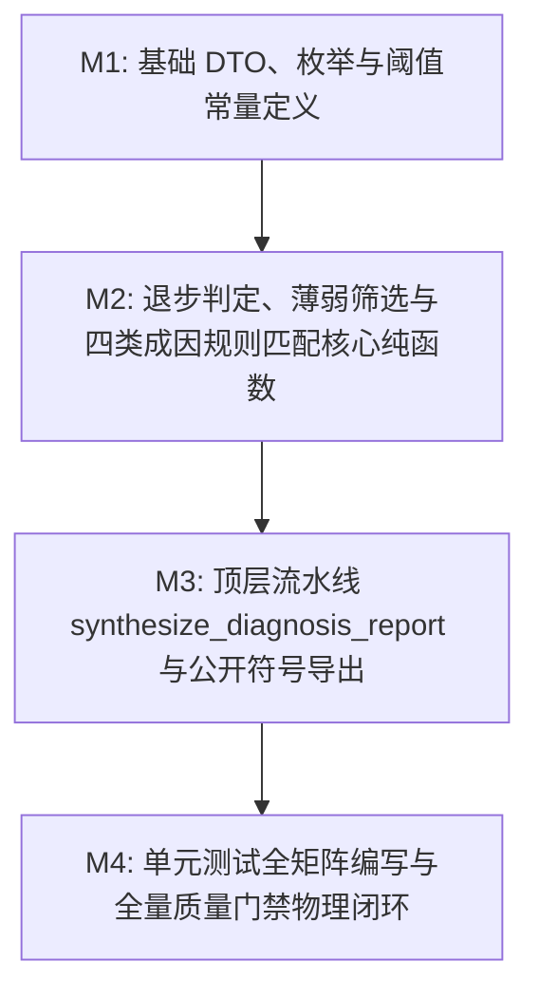

# Plan: 诊断规则合成算法 (synthesize_diagnosis_report) - 实施计划

- **关联 Spec**: ZL-113
- **实施执行人 / Agent**: Dev / Planner & Builder
- **当前状态**: Approved
- **架构定级**: Tier 2 (单模块特性演进 / 纯函数计算核)

---

## 1. 变更文件清单 (Pillar 1: Files that change)

### 1.1 新增文件
* `backend/app/core/algorithms/diagnosis.py`:
  - 诊断规则合成算法纯函数计算核；
  - 严格遵守纯函数计算核铁律：零外部 I/O、无网络、无数据库依赖、零系统时钟调用（`datetime.now()` 严禁调用，时间差由调用方显式传入）；
  - 包含核心阈值常量（附显式《软件需求规格说明书》FR-50/51/53 依据与教育测量学模型注释）：
    - `REGRESSION_DELTA_THRESHOLD = 0.05`（退步判定临界降幅，Δ >= 0.05 触发显著退步预警）
    - `WEAK_SCORE_THRESHOLD = 0.40`（严重薄弱档次绝对门槛，< 0.40 无条件归为薄弱点）
    - `DEVELOPING_SCORE_THRESHOLD = 0.70`（进阶档次上限门槛，[0.40, 0.70) 且有错题归为薄弱点）
    - `BLIND_SPOT_SCORE_THRESHOLD = 0.30`（概念盲区判定门槛，掌握度极低且存在实质性错题）
    - `TIME_DECAY_DAYS_THRESHOLD = 30.0`（艾宾浩斯遗忘曲线半衰期，超过 30 天未复习归因遗忘衰减）
  - 包含不可变领域数据模型（DTO）与枚举：
    - `CauseType(str, enum.Enum)`（四类成因类型及未知兜底：`CONCEPT_BLIND_SPOT`, `CARELESS_MISTAKE`, `CONCEPT_CONFUSION`, `TIME_DECAY_FORGOTTEN`, `UNKNOWN`）
    - `MistakeEvidence(frozen=True)`（错题证据不可变实体：`question_id`, `question_brief`, `user_answer`, `correct_answer`, `knowledge_id`, `is_negation_inversion`）
    - `KnowledgeEvaluationInput(frozen=True)`（知识点评估输入不可变实体：`knowledge_id`, `knowledge_title`, `current_score`, `previous_score`, `days_since_last_practice`, `has_subjective_mistake`, `has_objective_mistake`）
    - `WeakKnowledgeItem(frozen=True)`（薄弱/退步诊断明细不可变实体：`knowledge_id`, `knowledge_title`, `current_score`, `previous_score`, `score_delta`, `is_regressed`, `cause_type`, `cause_explanation`, `actionable_advice`, `associated_mistakes`）
    - `DiagnosisReportResult(frozen=True)`（诊断报告合成全局聚合产物：`report_id`, `overall_score`, `weak_points`, `regressed_points`, `mastered_points_count`, `total_points_evaluated`, `summary_evaluation`, `suggested_review_actions`）
  - 包含 5 个高内聚单一职责纯函数（全部满足 $V(G) \le 8$ 复杂度门禁）：
    - `check_regression(current_score, previous_score, threshold=0.05) -> tuple[bool, float]` ($V(G) \le 3$)
    - `is_weak_knowledge(current_score, mistake_count, weak_threshold=0.40, developing_threshold=0.70) -> bool` ($V(G) \le 3$)
    - `evaluate_cause_type(input_item, mistakes, score_delta) -> tuple[CauseType, str, str]` ($V(G) \le 6$)
    - `generate_summary_evaluation(overall_score, total_count, weak_count, regressed_count) -> str` ($V(G) \le 5$)
    - `synthesize_diagnosis_report(report_id, evaluated_knowledge_items, mistakes=()) -> DiagnosisReportResult` ($V(G) \le 7$)

* `backend/tests/unit/core/algorithms/test_diagnosis.py`:
  - 纯函数计算核全矩阵单元测试套件；
  - 遵循零 Mock、零外部依赖原则，采用完全真实数据驱动与纯内存执行；
  - 全面覆盖退步边界（0.0499/0.0500）、薄弱边界（0.3999/0.4000/0.6999/0.7000）、4 类成因各自独立触发与优先级决策、FR-50 特殊标记、全优场景、空输入防御及千条数据规模压测，达成行覆盖率 >= 95%、分支覆盖率 100%。

### 1.2 修改文件
* `backend/app/core/algorithms/__init__.py`:
  - 导出 `synthesize_diagnosis_report`、`check_regression`、`is_weak_knowledge`、`evaluate_cause_type`、`generate_summary_evaluation` 等公开纯函数；
  - 导出 `CauseType`、`MistakeEvidence`、`KnowledgeEvaluationInput`、`WeakKnowledgeItem`、`DiagnosisReportResult` 及核心阈值常量；
  - 严格保持导入语句与 `__all__` 清单的 ASCII 字典序排序。

---

## 2. 伴随式分步实施与任务拆解 (Pillar 2: Order of work)



### Milestone 1: 基础 DTO、枚举与阈值常量定义 (M1)
* **操作目标**:
  1. 在 `backend/app/core/algorithms/diagnosis.py` 中定义全部阈值常量并显式附注规范依据；
  2. 实现枚举 `CauseType`；
  3. 实现不可变数据模型 `MistakeEvidence`, `KnowledgeEvaluationInput`, `WeakKnowledgeItem`, `DiagnosisReportResult`，通过 `frozen=True` 确保线程安全与不可变性。
* **涉及文件**:
  - `backend/app/core/algorithms/diagnosis.py`
* **局部验证命令**:
  - `cd backend && python3 -c "import app.core.algorithms.diagnosis as d; assert d.REGRESSION_DELTA_THRESHOLD == 0.05"`
* **预期判据**:
  - 常量、枚举与不可变 DTO 导入无语法与类型错误，模块初始化通过。

### Milestone 2: 判定退步与四类成因规则匹配核心逻辑及建议生成函数 (M2)
* **操作目标**:
  1. 实现 `check_regression`：计算掌握度差值，使用 `round(delta, 4)` 消除浮点误差，若历史分为 None 或差值 < 0.05 判定未退步，差值 >= 0.05 判定退步；
  2. 实现 `is_weak_knowledge`：当前得分 < 0.40 无条件为薄弱；[0.40, 0.70) 且错题数 > 0 判定为薄弱；其余不属于薄弱点；
  3. 实现 `evaluate_cause_type`：严格执行 Rank 1 (混淆) -> Rank 2 (盲区) -> Rank 3 (粗心) -> Rank 4 (衰减) -> Fallback (未知) 优先级裁决，输出标准化解释与建议；对无错题薄弱点显式注明历史累计与衰减依据；
  4. 实现 `generate_summary_evaluation`：根据整体得分与薄弱/退步分布生成客观总结文本。
* **涉及文件**:
  - `backend/app/core/algorithms/diagnosis.py`
* **局部验证命令**:
  - `cd backend && python3 -c "from app.core.algorithms.diagnosis import check_regression, is_weak_knowledge; assert check_regression(0.75, 0.80) == (True, 0.05); assert is_weak_knowledge(0.39, 0) is True; assert is_weak_knowledge(0.50, 0) is False; assert is_weak_knowledge(0.50, 1) is True"`
* **预期判据**:
  - 核心辅助纯函数能够准确执行边界计算与决策树判定，环路复杂度均控制在 $V(G) \le 6$。

### Milestone 3: 顶层纯函数流水线 synthesize_diagnosis_report 与公开符号导出 (M3)
* **操作目标**:
  1. 实现顶层聚合函数 `synthesize_diagnosis_report`：
     - 处理空输入容错与边界值保护；
     - 错题按 `knowledge_id` 建立映射哈希索引，确保检索复杂度为 $O(1)$；
     - 遍历输入项执行退步研判与薄弱归因，生成薄弱清单与退步预警清单；
     - 薄弱清单按掌握度升序、降幅降序排列；退步清单按降幅降序排列；
     - 归集去重生成结构化复习行动清单；
  2. 修改 `backend/app/core/algorithms/__init__.py`，按字典序导出公开常量、枚举、DTO 与顶层纯函数。
* **涉及文件**:
  - `backend/app/core/algorithms/diagnosis.py`
  - `backend/app/core/algorithms/__init__.py`
* **局部验证命令**:
  - `cd backend && python3 -c "import app.core.algorithms as a; assert hasattr(a, 'synthesize_diagnosis_report'); assert hasattr(a, 'CauseType')"`
* **预期判据**:
  - 顶层纯函数流水线装配成功，包导出符号对齐契约，字典序保持完整。

### Milestone 4: 单元测试全矩阵编写与全量质量门禁闭环 (M4)
* **操作目标**:
  1. 在 `backend/tests/unit/core/algorithms/test_diagnosis.py` 编写测试矩阵：
     - 退步临界边界测试：0.0500（退步）与 0.0499（平稳）、分数上升场景、历史基线 None 场景；
     - 薄弱临界边界测试：0.3999（无错题薄弱）、0.4000（无错题非薄弱、有错题薄弱）、0.6999（有错题薄弱）、0.7000（掌握标杆）；
     - 四类成因单项与组合触发测试：否定词反转（CONCEPT_CONFUSION）、低分多错（CONCEPT_BLIND_SPOT）、高分失误（CARELESS_MISTAKE）、30天长间隔或纯衰减退步（TIME_DECAY_FORGOTTEN）、兜底（UNKNOWN）；
     - 优先级仲裁测试：同时满足混淆与盲区时混淆优先（Rank 1 > Rank 2）；满足盲区与粗心时盲区优先（Rank 2 > Rank 3）；
     - FR-50 特殊标记测试：低分但本次练习无对应错题时，在解释中显式注明历史累计掌握度/时间衰减来源；
     - 综合场景测试：全优全对场景（薄弱与退步均为空）、空输入防御测试、1000条知识点大规模压测（耗时 < 50ms）；
  2. 运行全局静态分析与架构门禁闭环。
* **涉及文件**:
  - `backend/tests/unit/core/algorithms/test_diagnosis.py`
* **局部验证命令**:
  - `cd backend && pytest tests/unit/core/algorithms/test_diagnosis.py --cov=app/core/algorithms/diagnosis --cov-branch --cov-fail-under=95 -v`
  - `python3 tooling/check_layers.py --root backend/app`
  - `cd backend && ruff format --check . && ruff check . && mypy app/core/algorithms && bandit -r app/core/algorithms -ll`
  - `python3 tooling/check_sdlc_integrity.py`
* **预期判据**:
  - 测试 100% 绿灯，单测分支覆盖率达成 100%，行覆盖率 >= 95%；
  - 架构分层校验 0 违规，Ruff、Mypy、Bandit 0 警告；
  - SDLC 门禁检查完全通过。

---

## 3. 风险与缓解对策 (Pillar 3: Risks and Mitigations)

| 潜在风险与挑战 | 影响面 | 缓解与控制对策 |
| :--- | :---: | :--- |
| **浮点精度误差导致边界误判** | 退步/薄弱判定 | Python 浮点运算（如 `0.80 - 0.75` 可能等于 `0.04999999999999993`）可能导致 `>= 0.05` 漏判。算法内部计算分数差值统一使用 `round(delta, 4)` 显式四舍五入保留 4 位精度。 |
| **FR-50 强关联错题与历史薄弱冲突** | 诊断报告解释性 | FR-50 要求薄弱点关联错题，但学生可能因历史低分或时间衰减被判定薄弱，本次并无错题。在 `WeakKnowledgeItem` 中将 `associated_mistakes` 设为空列表，但在 `cause_explanation` 显式注明历史累计与衰减来源，化解策略冲突。 |
| **McCabe 复杂度超标** | 代码可维护性 | 若将所有规则堆叠在单一函数中，易突破 $V(G) \le 8$ 红线。拆解为 5 个高内聚单一职责纯函数，各函数 $V(G)$ 均控制在 3~7。 |
| **架构跨层与网络/时钟隐式依赖** | 纯函数可测性 | 算法绝对禁止导入外部库，禁止隐式调用 `datetime.now()`。间隔天数由外部以不可变入参传入，并经 `tooling/check_layers.py` 自动化校验保障架构纯洁性。 |

---

## 4. 物理验证手段与命令 (Pillar 4: Proof & Verification Commands)

实施过程中与交付前，必须在终端依次执行以下命令确保物理闭环：

1. **分层依赖架构合规检查**：
   ```bash
   python3 tooling/check_layers.py --root backend/app
   ```
   *判据*: 退出码 0，`app/core/algorithms` 零跨层与反向导入违规。

2. **代码风格与静态代码扫描**：
   ```bash
   cd backend && ruff format --check . && ruff check .
   ```
   *判据*: 退出码 0，代码行宽严格限制在 100 字符内，无任何 PEP 8、命名或未定义变量警告。

3. **静态类型安全检查**：
   ```bash
   cd backend && mypy app/core/algorithms
   ```
   *判据*: 退出码 0，所有函数、参数与返回值均具备完备的静态类型标注。

4. **代码安全扫描**：
   ```bash
   cd backend && bandit -r app/core/algorithms -ll
   ```
   *判据*: 退出码 0，高危与中危安全隐患均为 0。

5. **单元测试与分支覆盖率门禁**：
   ```bash
   cd backend && pytest tests/unit/core/algorithms/test_diagnosis.py --cov=app/core/algorithms/diagnosis --cov-branch --cov-fail-under=95 -v
   ```
   *判据*: 退出码 0，全矩阵测试用例 100% 绿灯通过，分支覆盖率达成 100%，行覆盖率 >= 95%。

6. **SDLC 工件完整性与门禁校验**：
   ```bash
   python3 tooling/check_sdlc_integrity.py
   ```
   *判据*: 退出码 0，工件全部就绪且无遗留占位符。

---

## 5. 实施偏差记录 (Deviations Log)

*实施过程严格对齐 Spec 技术契约，无偏离规格设计；所有涉及文件与接口定义均在规划矩阵清单内。*

---

## 6. 阶段准出签批 (Gate 3 Sign-off)

- [x] 4 支柱实施计划结构完备且边界明确
- [x] 任务拆解具备清晰的 M1~M4 推进路径与局部验证判据
- [x] 风险对策与物理验证命令可自动化执行且覆盖率指标明确
- **验收结论**: Approved
- **签批人 / 日期**: Dev / 2026-09-23
