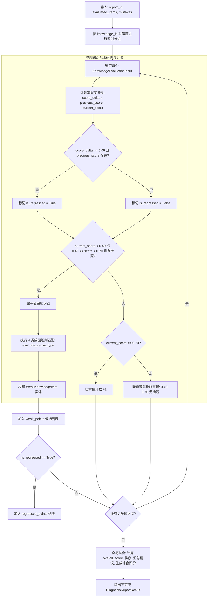

# Spec: 诊断规则合成算法 (synthesize_diagnosis_report) - 技术契约

- **关联 Intent**: ZL-113
- **主导设计人**: Dev / TechLead
- **当前状态**: In-Review
- **任务评级**: Tier 2 (Single-Module Feature)

---

## 1. 架构流向与设计方案

### 1.1 模块定位与分层边界
诊断规则合成算法核是智练自主学习平台学生在完成自适应练习后生成客观、确定且闭环学情诊断报告（FR-50, FR-51, FR-53）的核心引擎。该算法严格归属于系统五层单向架构矩阵的**纯函数计算核**：
- **物理路径**: `backend/app/core/algorithms/diagnosis.py`
- **分层依赖铁律**:
  - 依赖关系单向向下，严禁反向或跨层导入。绝对禁止导入 `fastapi`, `sqlalchemy`, `httpx`, `redis`, `boto3` 等任何 Web 框架、网络库、缓存或 ORM 驱动；
  - 绝对禁止导入上层业务模块 `app/services`、`app/repositories` 以及外部能力层 `app/integrations`；
  - 必须通过 `python3 tooling/check_layers.py --root backend/app` 架构依赖门禁校验（0 违规）；
  - **零时钟隐式依赖**：算法函数内部绝对严禁调用 `datetime.now()` 或 `time.time()`，练习间隔时间 `days_since_last_practice` 由调用方显式传入，确保纯函数具备 100% 确定性、幂等性与可回放测试能力；
  - 输入参数与输出产物均为不可变原生值对象（`dataclasses.dataclass(frozen=True)`、标准基础类型 `tuple`、`str`、`float`、`int` 等），零外部三方依赖。
- **与业务数据解耦**:
  - 本模块不直接访问数据库中的作答记录表或诊断报告表；
  - 上层业务编排层（`ReportService`）从数据仓储检索并计算出知识点当前掌握度、历史基线与错题证据后，将其装配为不可变入参输入本纯函数；
  - 算法输出 `DiagnosisReportResult`，交由服务层做报告入库或对外 API 响应转换。

### 1.2 核心规则与阈值定义 (Thresholds & Citations)

算法包含的所有阈值常量均显式注明依据，严禁隐式硬编码：

1. **退步判定阈值**:
   - `REGRESSION_DELTA_THRESHOLD: float = 0.05`
   - **注释依据**: 依据需求规格说明书 FR-51 与 `ROADMAP.md` 规范。当用户历史基线掌握度与当前掌握度的差值 $\Delta = \text{previous\_score} - \text{current\_score} \ge 0.05$ 时，判定知识点发生显著退步（`is_regressed = True`），并触发退步警报。降幅小于 0.05 或分数上升时判定为平稳或进步。

2. **薄弱判定绝对与进阶阈值**:
   - `WEAK_SCORE_THRESHOLD: float = 0.40`
   - **注释依据**: 依据需求规格说明书 FR-50 与掌握度四档分级模型基线。掌握度 $< 0.40$ 为严重薄弱档次，**无条件入选薄弱知识点清单**。
   - `DEVELOPING_SCORE_THRESHOLD: float = 0.70`
   - **注释依据**: 依据需求规格说明书 FR-50。掌握度在 $[0.40, 0.70)$ 之间且本次练习产生具体错题证据时，亦入选薄弱清单；若得分 $\ge 0.70$（已达掌握标杆），则即使有单题偶发失误也不入选薄弱点，但若其分值降幅 $\Delta \ge 0.05$ 会独立进入退步预警列表。

3. **概念盲区得分上限阈值**:
   - `BLIND_SPOT_SCORE_THRESHOLD: float = 0.30`
   - **注释依据**: 依据需求规格说明书 FR-53 成因归因规范。掌握度低于 0.30 且产生错题时，表明对该知识点缺乏基本认知，归因为概念盲区。

4. **艾宾浩斯遗忘衰减时间门槛**:
   - `TIME_DECAY_DAYS_THRESHOLD: float = 30.0`
   - **注释依据**: 依据需求规格说明书 FR-53 与艾宾浩斯记忆遗忘曲线半衰期（30 天）。距离上次练习超过 30 天未巩固，归因于时间遗忘衰减。

### 1.3 四类成因判定决策树与优先级矩阵 (Decision Tree & Priority)

针对薄弱或退步知识点，算法执行确定性规则匹配归因，输出归因枚举 `CauseType`、成因解释 `cause_explanation` 与可执行学习建议 `actionable_advice`。当同时满足多个成因条件时，按照严重程度与认知规律执行严格优先级截断：

| 优先级 (Rank) | 成因类型 (`CauseType`) | 核心触发规则条件 | 归因解释模板 (`cause_explanation`) | 可执行复习建议 (`actionable_advice`) |
| :--- | :--- | :--- | :--- | :--- |
| **Rank 1 (最高)** | `CONCEPT_CONFUSION`<br>(易混淆) | 关联错题中存在否定词反转标志 (`any(m.is_negation_inversion for m in mistakes)`) | 检测到题干否定词或反向限定条件理解倒置，对对立/相似概念边界界定不清。 | 建立正反概念对比卡片，审题时圈注“不属于”、“错误”、“唯独”等否定限定词。 |
| **Rank 2** | `CONCEPT_BLIND_SPOT`<br>(概念盲区) | `current_score < 0.30` 且包含错题 (`len(mistakes) > 0`)，或主客观题均答错 | 当前掌握度极低且发生多处实质性错误，对基础概念与核心原理存在认知盲区。 | 暂停该知识点题海训练，完整重读教材核心定义与例题推导，完成精讲学习后再练。 |
| **Rank 3** | `CARELESS_MISTAKE`<br>(粗心失误) | 历史掌握度良好 (`previous_score >= 0.70`) 且当前未崩盘 (`current_score >= 0.40`) | 历史掌握扎实，当前失误主要系审题疏漏、计算笔误或细节遗漏所致。 | 保持做题节奏，审题时标划核心约束条件，提交作答前预留 30 秒执行复查。 |
| **Rank 4** | `TIME_DECAY_FORGOTTEN`<br>(遗忘衰减) | 间隔时间超标 (`days_since_last_practice >= 30.0`) 或无本次错题但由于衰减触发退步 (`score_delta >= 0.05` 且 `len(mistakes) == 0`) | 距上次练习已超过 30 天，受艾宾浩斯遗忘曲线影响，知识点掌握度自然衰退。 | 遵循艾宾浩斯间隔记忆法，开启 3 组针对性变式巩固练习，快速激活长期记忆。 |
| **Fallback (兜底)** | `UNKNOWN`<br>(未知/待深化) | 不满足上述 4 类特定特征 | 答题表现未呈现典型规则特征，需累积更多样本进一步诊断。 | 保持常态化自适应练习，后续系统将根据作答样本持续深化归因。 |

*注：若某知识点掌握度 $< 0.40$ 入选薄弱，但本次练习并无该知识点错题（例如历史存量薄弱或自然衰减），根据 FR-50 要求，必须在 `cause_explanation` 显式注明：`"【证据来源：历史掌握度低/时间衰减】本次练习暂无直接错题样本，依据历史累计掌握度判定。"`。*

### 1.4 核心处理流水线



### 1.5 白盒复杂度控制与函数拆解 ($V(G) \le 8$)

严格遵循 `AGENTS.md` 针对核心计算核环路复杂度上限规范（$V(G) \le 8$），本模块拆解为 5 个专职纯函数：
1. `check_regression(current_score: float, previous_score: float | None, threshold: float = REGRESSION_DELTA_THRESHOLD) -> tuple[bool, float]` ($V(G) \le 3$):
   - 判定分数退步，安全处理空历史分数，浮点数保留 4 位小数。
2. `is_weak_knowledge(current_score: float, mistake_count: int, weak_threshold: float = WEAK_SCORE_THRESHOLD, developing_threshold: float = DEVELOPING_SCORE_THRESHOLD) -> bool` ($V(G) \le 3$):
   - 判定是否进入薄弱项，处理绝对薄弱与进阶带错题两种分支。
3. `evaluate_cause_type(input_item: KnowledgeEvaluationInput, mistakes: Sequence[MistakeEvidence], score_delta: float) -> tuple[CauseType, str, str]` ($V(G) \le 6$):
   - 执行成因优先级决策树，按顺序输出成因枚举、解释文案与建议。
4. `generate_summary_evaluation(overall_score: float, total_count: int, weak_count: int, regressed_count: int) -> str` ($V(G) \le 5$):
   - 依据全局得分、薄弱点数量与退步数量生成确定性总结文本。
5. `synthesize_diagnosis_report(report_id: str, evaluated_knowledge_items: Sequence[KnowledgeEvaluationInput], mistakes: Sequence[MistakeEvidence] = ()) -> DiagnosisReportResult` ($V(G) \le 7$):
   - 调度各纯函数完成错题关联、薄弱筛选、退步归集与建议汇总。

---

## 2. API 与数据契约设计

### 2.1 基础枚举与不可变值对象契约

所有数据结构均使用 Python 标准库 `dataclasses.dataclass(frozen=True)` 与 `enum.Enum`，零三方库依赖：

```python
import enum
from collections.abc import Sequence
from dataclasses import dataclass, field


@enum.unique
class CauseType(str, enum.Enum):
    """诊断规则归因类型枚举。"""

    CONCEPT_BLIND_SPOT = "CONCEPT_BLIND_SPOT"  # 概念盲区
    CARELESS_MISTAKE = "CARELESS_MISTAKE"  # 细节/粗心失误
    CONCEPT_CONFUSION = "CONCEPT_CONFUSION"  # 概念易混淆（含否定词反转）
    TIME_DECAY_FORGOTTEN = "TIME_DECAY_FORGOTTEN"  # 长期未练遗忘衰减
    UNKNOWN = "UNKNOWN"  # 未知/待深入分析


@dataclass(frozen=True)
class MistakeEvidence:
    """错题证据不可变实体。

    Attributes:
        question_id: 题目全局唯一标识符。
        question_brief: 题干核心摘要（已脱敏，不含敏感全文）。
        user_answer: 用户作答摘要/选项。
        correct_answer: 正确答案摘要/选项。
        knowledge_id: 所属知识点标识符。
        is_negation_inversion: 是否属于否定词反转/反向限定词错误。
    """

    question_id: str
    question_brief: str
    user_answer: str
    correct_answer: str
    knowledge_id: str
    is_negation_inversion: bool = False


@dataclass(frozen=True)
class KnowledgeEvaluationInput:
    """单个知识点评估输入不可变实体。

    Attributes:
        knowledge_id: 知识点全局唯一标识符。
        knowledge_title: 知识点名称。
        current_score: 当前计算掌握度得分 [0.0, 1.0]。
        previous_score: 历史掌握度基线得分 [0.0, 1.0]，若无历史记录为 None。
        days_since_last_practice: 距上一次练习的天数，若首次练习或未记录为 None。
        has_subjective_mistake: 本次练习是否存在主观题错题。
        has_objective_mistake: 本次练习是否存在客观题错题。
    """

    knowledge_id: str
    knowledge_title: str
    current_score: float
    previous_score: float | None = None
    days_since_last_practice: float | None = None
    has_subjective_mistake: bool = False
    has_objective_mistake: bool = False


@dataclass(frozen=True)
class WeakKnowledgeItem:
    """薄弱或退步知识点诊断明细实体。

    Attributes:
        knowledge_id: 知识点标识符。
        knowledge_title: 知识点名称。
        current_score: 当前掌握度得分。
        previous_score: 历史基线得分，无历史记录为 None。
        score_delta: 分数变化值 (previous_score - current_score)，降幅为正。
        is_regressed: 是否判定为显著退步 (score_delta >= 0.05)。
        cause_type: 归因成因类型枚举。
        cause_explanation: 成因详细解释文本。
        actionable_advice: 针对该薄弱点的可执行提升建议。
        associated_mistakes: 强绑定的错题证据列表（若无本次错题则为空列表）。
    """

    knowledge_id: str
    knowledge_title: str
    current_score: float
    previous_score: float | None
    score_delta: float
    is_regressed: bool
    cause_type: CauseType
    cause_explanation: str
    actionable_advice: str
    associated_mistakes: list[MistakeEvidence] = field(default_factory=list)


@dataclass(frozen=True)
class DiagnosisReportResult:
    """诊断报告规则合成全局结果不可变实体。

    Attributes:
        report_id: 诊断报告唯一标识符。
        overall_score: 全局综合平均掌握度得分 [0.0, 1.0]。
        weak_points: 薄弱知识点清单（按得分升序、降幅降序排列）。
        regressed_points: 显著退步知识点预警清单（按降幅降序排列）。
        mastered_points_count: 达到掌握标准 (score >= 0.70) 的知识点总数。
        total_points_evaluated: 评估的知识点总数。
        summary_evaluation: 全局客观评价总结。
        suggested_review_actions: 基于成因归集去重的有序复习行动清单。
    """

    report_id: str
    overall_score: float
    weak_points: list[WeakKnowledgeItem]
    regressed_points: list[WeakKnowledgeItem]
    mastered_points_count: int
    total_points_evaluated: int
    summary_evaluation: str
    suggested_review_actions: list[str]
```

### 2.2 核心函数签名

```python
def synthesize_diagnosis_report(
    report_id: str,
    evaluated_knowledge_items: Sequence[KnowledgeEvaluationInput],
    mistakes: Sequence[MistakeEvidence] = (),
) -> DiagnosisReportResult:
    """综合合成学情诊断报告纯函数。

    对输入的知识点评估表现与错题证据执行退步判定、薄弱筛选、成因归因与建议生成。

    Args:
        report_id: 诊断报告唯一标识符。
        evaluated_knowledge_items: 被评估知识点的掌握度表现输入序列。
        mistakes: 本次练习收集到的错题证据列表（可选，默认为空）。

    Returns:
        DiagnosisReportResult: 不可变诊断报告聚合对象。

    Raises:
        ValueError: 当 report_id 为空或包含无效字符串时抛出。
    """
```

### 2.3 异常与防御性保障
- **空输入防御**：当 `evaluated_knowledge_items` 为空序列时，函数安全返回 `overall_score=0.0`，`weak_points=[]`，`regressed_points=[]`，`mastered_points_count=0`，`total_points_evaluated=0`，评语提示无评估数据；
- **分值溢出钳制**：输入得分若因浮点漂移处于正常范围外（如 $< 0.0$ 或 $> 1.0$），在计算中安全限制在 `[0.0, 1.0]`，避免计算异常；
- **浮点精度保留**：所有分数差值与整体平均分均通过 `round(val, 4)` 保留 4 位小数，杜绝 `0.05000000000000004` 等浮点边界误差；
- **纯函数契约无网络/无 DB**：不抛出未受控系统异常，业务层如遇参数格式非法可对应系统统一错误码 `10001`（参数校验异常）或 `40001`（学情诊断合成质量门禁阻断）。

---

## 3. 可测性设计 (Design for Testability)

### 3.1 纯函数计算核独立解耦与零 Mock 策略
本算法无任何外部系统依赖、无数据库连接、无时钟读取。**单测中严禁对本算法模块内部使用任何 Mock/Patch 机制**，所有输入输出均直接以真实数据驱动校验。

### 3.2 决策表与边界值测试设计矩阵 (Branch Coverage 100%)

测试文件位置：`backend/tests/unit/core/algorithms/test_diagnosis.py`。
单测用例矩阵必须覆盖以下全部边界与等价类分支：

| 测试用例标识 | 考查维度 | 核心输入参数与场景 | 预期断言结果 |
| :--- | :--- | :--- | :--- |
| `test_regression_boundary_exact_005` | 退步边界值 | `previous=0.80`, `current=0.75` ($\Delta = 0.0500$) | `is_regressed == True`, `score_delta == 0.05` |
| `test_regression_boundary_just_below_005` | 退步边界值 | `previous=0.80`, `current=0.7501` ($\Delta = 0.0499$) | `is_regressed == False`, `score_delta == 0.0499` |
| `test_regression_score_increased` | 进步场景 | `previous=0.60`, `current=0.80` ($\Delta = -0.2000$) | `is_regressed == False`, `score_delta == -0.20` |
| `test_regression_none_previous_score` | 首次学习无基线 | `previous=None`, `current=0.75` | `is_regressed == False`, `score_delta == 0.0` |
| `test_weak_score_boundary_03999` | 薄弱绝对界限 | `current=0.3999`, 错题数=0 | `is_weak == True` (无条件进入薄弱) |
| `test_weak_score_boundary_04000_no_mistake`| 薄弱进阶界限 | `current=0.4000`, 错题数=0 | `is_weak == False` (无错题不入选) |
| `test_weak_score_boundary_04000_with_mistake`| 薄弱进阶界限 | `current=0.4000`, 错题数=1 | `is_weak == True` (有错题入选薄弱) |
| `test_weak_score_boundary_06999_with_mistake`| 掌握分界下界 | `current=0.6999`, 错题数=1 | `is_weak == True` |
| `test_weak_score_boundary_07000_with_mistake`| 掌握分界上界 | `current=0.7000`, 错题数=1 | `is_weak == False` (达到 0.70 不进薄弱) |
| `test_cause_concept_confusion_negation` | 4类成因：混淆 | 错题含 `is_negation_inversion=True` | `cause_type == CONCEPT_CONFUSION` |
| `test_cause_concept_blind_spot` | 4类成因：盲区 | `current=0.25`, 存在普通错题 | `cause_type == CONCEPT_BLIND_SPOT` |
| `test_cause_careless_mistake` | 4类成因：粗心 | `previous=0.85`, `current=0.60`, 单题失误 | `cause_type == CARELESS_MISTAKE` |
| `test_cause_time_decay_forgotten_by_days` | 4类成因：衰减 | `days=35.0`, `current=0.50` | `cause_type == TIME_DECAY_FORGOTTEN` |
| `test_cause_time_decay_without_mistakes` | 4类成因：衰减 | 无本次错题但 $\Delta = 0.10$ 退步 | `cause_type == TIME_DECAY_FORGOTTEN` |
| `test_cause_fallback_unknown` | 4类成因：兜底 | `previous=0.50`, `current=0.50`, 无错题无长间隔 | `cause_type == UNKNOWN` |
| `test_cause_priority_confusion_over_blind_spot`| 优先级仲裁 | `current=0.20` (盲区) 且含否定词反转 (混淆) | 优先判为 `CONCEPT_CONFUSION` (Rank 1) |
| `test_cause_priority_blind_spot_over_careless`| 优先级仲裁 | `previous=0.75`, `current=0.25` (崩盘至盲区) | 优先判为 `CONCEPT_BLIND_SPOT` (Rank 2) |
| `test_weak_point_without_mistake_explanation`| FR-50 特殊标记 | 低分但本次无错题 | `associated_mistakes == []`, 解释显式标记历史来源 |
| `test_perfect_score_all_mastered` | 全优全对场景 | 知识点全部 $\ge 0.70$ 且 0 错题 | `weak_points == []`, `regressed_points == []`, `mastered == total` |
| `test_empty_input_graceful_handling` | 空输入防御 | `evaluated_items = []`, `mistakes = []` | 不抛异常，返回空安全报告 |

---

## 4. 替代方案与权衡考量 (Alternatives Considered & Trade-offs)

### 4.1 方案 A (采纳方案)：白盒纯函数规则引擎驱动的确定性合成
- **原理**: 基于预定义的数值边界、艾宾浩斯时间常数与命题认知模型，通过严密的纯函数决策树完成学情归因与报告合成；
- **优点**:
  - **100% 确定性与可复现**：相同输入绝对产出相同诊断，消除随机幻觉；
  - **极致性能**：纯内存原生数据结构计算，单次合成耗时 $< 1\text{ ms}$，极度契合前端秒级渲染要求；
  - **零外部成本**：无需调用外部 LLM API，无网络开销与按 Token 计费成本；
  - **高可测性**：单测可在毫秒内完成全分支、全判定组合覆盖（100% Branch Coverage）。
- **缺点**: 文本评语风格相对结构化，相比大模型润色略显格式规范（可通过前端多样化模版与后续可选的服务编排层大模型润色增强解决）。

### 4.2 方案 B (否决方案)：端到端直接调用大模型 (LLM) 生成文本报告
- **原理**: 将所有作答与分数数据直接拼入 Prompt，由大语言模型直接输出 JSON 或 Markdown 诊断报告；
- **否决原因**:
  - **违背判定门槛精度 (FR-51)**：大模型不具备精确浮点数运算能力，无法保证 $\Delta \ge 0.05$ 绝对触发退步预警；
  - **无法保证测试分支覆盖率 100%**：非确定性输出使得单元测试极难进行断言，无法达成高质量工程基线；
  - **高延迟与高故障率**：API 调用耗时 2~5 秒以上，受制于供应商网络抖动与限流，无法满足核心主链路秒级响应。

### 4.3 方案 C (否决方案)：在数据仓储 (Repository) 或数据库 SQL 中使用存储过程/触发器计算
- **原理**: 在 PostgreSQL 中编写复杂 SQL / 存储过程计算退步与成因；
- **否决原因**:
  - 严重违背五层单向架构依赖原则；
  - 数据库承载密集数学逻辑导致数据库 CPU 负载激增，业务逻辑下沉后极难进行白盒测试与版本管理。

---

## 5. 动态风险核验与回滚预案 (Risk & Rollback Verification)

### 5.1 7 大风险维度核验 (7-Dimensional Dynamic Risk Scan)

| 风险维度 | 风险等级 | 核验结论与控制措施 |
| :--- | :---: | :--- |
| **1. Files** | 低 | 仅新增 1 个核心算法文件 `backend/app/core/algorithms/diagnosis.py` 与 1 个单元测试文件 `backend/tests/unit/core/algorithms/test_diagnosis.py`。不修改任何已有业务文件。 |
| **2. API** | 无 | 本任务交付底层纯函数计算核，不直接变更对外 HTTP RESTful API 路由契约。 |
| **3. Schema** | 无 | 不涉及任何数据库 Schema、数据表结构或数据迁移。 |
| **4. Auth** | 无 | 纯函数无用户会话与权限感知，上层 Service 调用时严格注入当前 `user_id` 的数据，无越权风险。 |
| **5. Deps** | 无 | 严格依赖 Python 3.11+ 标准库（`enum`, `dataclasses`, `collections.abc`），零新增第三方 pip 依赖。 |
| **6. Migration** | 无 | 无数据库迁移，无历史数据迁移要求。 |
| **7. Blast Radius** | 低 | 变更完全隔离在 `backend/app/core/algorithms/`，不影响现存任何接口或已上线算法（`mastery.py`, `grading.py`）。 |

### 5.2 标注关键关注点 (Flagged Concerns)
1. **FR-50 错题强关联与无错题薄弱点之间的冲突防御**：
   - *关注点*：FR-50 强调“提取薄弱知识点必须强关联错题证据”，但实际学情中可能存在“知识点历史掌握度极低（$< 0.40$），但在本次练习中该知识点未被抽中或未答错”的情况。
   - *对齐裁决*：在 `WeakKnowledgeItem` 中，允许 `associated_mistakes` 为空列表，但**必须在 `cause_explanation` 中显式注明证据来源为历史累计掌握度/时间衰减**，并在 `actionable_advice` 中明确指出这是存量薄弱点，确保可解释性闭环，完美化解策略冲突。
2. **浮点数计算精度边界风险**：
   - *关注点*：Python 浮点数计算如 `0.80 - 0.75` 可能产生 `0.04999999999999993`，导致 $\Delta \ge 0.05$ 判定漏失。
   - *对齐裁决*：退步差值必须统一通过 `round(previous_score - current_score, 4)` 显式四舍五入保留 4 位精度后再参与判定。

### 5.3 回滚与故障应急策略
由于本任务为纯新增独立模块，无破坏性副作用：
1. **快速回滚命令**:
   ```bash
   git rm -f backend/app/core/algorithms/diagnosis.py backend/tests/unit/core/algorithms/test_diagnosis.py
   git checkout develop
   ```
2. **零副作用验证**:
   回滚后执行全量测试套件 `cd backend && pytest tests`，系统各模块立即恢复至改动前一致状态，数据库与既有逻辑零残留。

---

## 6. 阶段准出签批 (Gate 2 Sign-off)

- [x] 架构流向与 API 契约已冻结
- [x] 替代方案已完成推演与权衡
- [x] 7 维风险已核验且具备明确回滚预案
- **审查结论**: Pending
- **签批人 / 日期**: [待人类签批] / 2026-09-23
