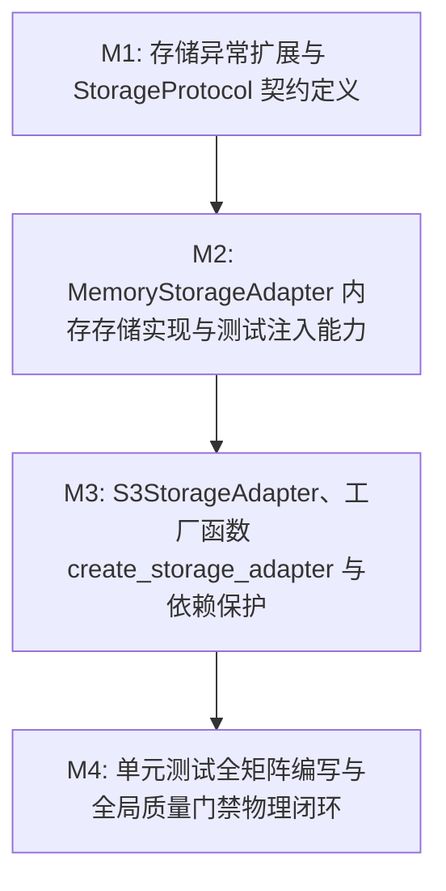

# Plan: 对象存储适配器 (MinIO/S3) - 实施计划

- **关联 Spec**: ZL-114
- **实施执行人 / Agent**: Dev / Planner & Builder
- **当前状态**: Approved
- **架构定级**: Tier 2 (Single-Module Feature / External Integrations)

---

## 1. 变更文件清单 (Pillar 1: Files that change)

### 1.1 修改文件
* `backend/app/core/errors.py`:
  - 在 30xxx 外部能力网段扩充 3 个标准存储异常类（均继承自 `AppError`）：
    - `StorageError` (`error_code=30001`, `status_code=500`): 通用对象存储处理与配置异常基类；
    - `StorageNotFoundError` (`error_code=30002`, `status_code=404`): 请求的存储桶或对象键不存在异常；
    - `StorageConnectionError` (`error_code=30003`, `status_code=502`): 存储服务网络连接超时、Endpoint 无法解析或第三方驱动缺失异常；
  - 在模块的 `__all__` 导出列表中增加新增异常类，保持 ASCII 字典序严格排列。

### 1.2 新增文件
* `backend/app/integrations/storage/__init__.py`:
  - 存储适配模块公开入口包；
  - 导出核心契约与适配实现：`StorageProtocol`, `MemoryStorageAdapter`, `S3StorageAdapter`, `create_storage_adapter`；
  - 维护显式 `__all__` 列表，严格维持 ASCII 字典序。

* `backend/app/integrations/storage/protocol.py`:
  - 定义 `@runtime_checkable class StorageProtocol(Protocol)` 抽象协议契约；
  - 声明 8 个标准对象存储交互方法并标注完整类型签名与 Google 风格 Docstring：
    - `put_object(bucket: str, key: str, data: bytes, content_type: str = "application/octet-stream") -> str`
    - `get_object(bucket: str, key: str) -> bytes`
    - `get_object_stream(bucket: str, key: str, chunk_size: int = 65536) -> Iterator[bytes]`
    - `generate_presigned_upload_url(bucket: str, key: str, expires_in: int = 900) -> str`
    - `generate_presigned_download_url(bucket: str, key: str, expires_in: int = 900) -> str`
    - `delete_object(bucket: str, key: str) -> bool`
    - `object_exists(bucket: str, key: str) -> bool`
    - `ensure_bucket_exists(bucket: str) -> None`

* `backend/app/integrations/storage/memory.py`:
  - 实现 `MemoryStorageAdapter(StorageProtocol)` 内存虚拟存储适配器；
  - 专为单元测试与本地离线开发设计，零网络连接；
  - 内部基于 `threading.Lock` 与字典结构维护桶和对象：`_objects: dict[str, dict[str, tuple[bytes, str]]]`；
  - 完整实现 8 个标准协议方法；
  - 预签名 URL 模拟规范格式：`https://mock-storage.local/{bucket}/{key}?X-Amz-Algorithm=AWS4-HMAC-SHA256&X-Amz-Expires={expires_in}&X-Amz-Signature=mock-{token}`；
  - 强制执行时效防御性拦截：`1 <= expires_in <= 604800`，越界抛出 `StorageError`；
  - 具备测试扩展控制方法：
    - `inject_failure(method_name: str, exception: Exception) -> None`: 注入模拟故障异常；
    - `inject_latency(seconds: float) -> None`: 注入模拟调用网络延迟；
    - `clear() -> None`: 清空当前内存所有桶与对象；
  - 绝密脱敏保护：`__repr__` 仅输出桶数量与对象统计，禁止输出任何字节内容。

* `backend/app/integrations/storage/s3.py`:
  - 实现 `S3StorageAdapter(StorageProtocol)`（及别名 `MinioStorageAdapter`），面向生产 MinIO 与 AWS S3；
  - 依赖动态防御：延迟或按需导入 `boto3` 与 `botocore.exceptions`，环境缺失 `boto3` 时初始化显式抛出 `StorageConnectionError`；
  - 绝密脱敏红线：`__repr__` 严格脱敏 `secret_key="******"`；禁止在日志与调试打印中泄露凭据与原始数据二进制；
  - 时效防御拦截：`generate_presigned_*` 校验 `1 <= expires_in <= 604800`；
  - 异常转译映射：捕获 `botocore.exceptions.ClientError`，HTTP 404 / `NoSuchKey` / `NoSuchBucket` 统一映射为 `StorageNotFoundError`；网络超时与连接失败映射为 `StorageConnectionError`；其他底层异常转译为 `StorageError`。

* `backend/app/integrations/storage/factory.py`:
  - 实现工厂函数 `create_storage_adapter(storage_type: str = "memory", *, endpoint_url: str | None = None, access_key: str | None = None, secret_key: str | None = None, region_name: str = "us-east-1", secure: bool = True) -> StorageProtocol`；
  - 支持 `memory`、`s3`、`minio` 类型分发；传入未知存储类型时抛出 `StorageError`；
  - 生产配置校验：类型为 `s3`/`minio` 时校验必要参数。

* `backend/tests/unit/integrations/storage/test_storage.py`:
  - 单元测试全套套件，覆盖率目标 $\ge 90\%$；
  - 覆盖 `MemoryStorageAdapter` CRUD、流式分块、并发安全性、预签名时效与格式、故障与延迟注入；
  - 覆盖 `S3StorageAdapter` 脱敏 `__repr__`、boto3 依赖缺失保护、时效越界拦截、ClientError 404/502 异常映射；
  - 覆盖 `create_storage_adapter` 工厂分发与参数校验。

---

## 2. 伴随式分步实施与任务拆解 (Pillar 2: Order of work)



### Milestone 1: 存储异常与 StorageProtocol 契约定义 (M1)
* **操作目标**:
  1. 在 `backend/app/core/errors.py` 中新增 `StorageError`, `StorageNotFoundError`, `StorageConnectionError`，并更新 `__all__`；
  2. 创建目录 `backend/app/integrations/storage/`；
  3. 在 `backend/app/integrations/storage/protocol.py` 中定义 `@runtime_checkable class StorageProtocol(Protocol)`，声明 8 个标准方法；
  4. 编写基础包导出入口 `backend/app/integrations/storage/__init__.py`。
* **涉及文件**:
  - `backend/app/core/errors.py`
  - `backend/app/integrations/storage/__init__.py`
  - `backend/app/integrations/storage/protocol.py`
* **局部验证命令**:
  - `cd backend && python3 -c "from app.core.errors import StorageError, StorageNotFoundError, StorageConnectionError; from app.integrations.storage.protocol import StorageProtocol; assert issubclass(StorageNotFoundError, StorageError)"`
* **预期判据**:
  - 异常类与协议接口成功导入，继承关系无误，`python -c` 命令以退出码 0 返回。

### Milestone 2: MemoryStorageAdapter 内存存储实现与测试注入机制 (M2)
* **操作目标**:
  1. 在 `backend/app/integrations/storage/memory.py` 中实现 `MemoryStorageAdapter`；
  2. 实现基于 `threading.Lock` 的并发安全存储字典（支持分桶管理与自动建桶）；
  3. 实现流式读取 `get_object_stream`，按 `chunk_size` 分块 Yield 输出；
  4. 实现 `generate_presigned_upload_url` 与 `generate_presigned_download_url`，并强制校验 `1 <= expires_in <= 604800`；
  5. 实现测试支持桩 `inject_failure`, `inject_latency`, `clear`；
  6. 实现脱敏 `__repr__`；
  7. 更新 `__init__.py` 导出 `MemoryStorageAdapter`。
* **涉及文件**:
  - `backend/app/integrations/storage/memory.py`
  - `backend/app/integrations/storage/__init__.py`
* **局部验证命令**:
  - `cd backend && python3 -c "from app.integrations.storage.memory import MemoryStorageAdapter; from app.integrations.storage.protocol import StorageProtocol; adapter = MemoryStorageAdapter(); assert isinstance(adapter, StorageProtocol); adapter.put_object('test', 'a.txt', b'hello'); assert adapter.get_object('test', 'a.txt') == b'hello'"`
* **预期判据**:
  - `MemoryStorageAdapter` 满足 `isinstance(..., StorageProtocol)` 协议判定，CRUD 与流式读写逻辑正常执行，退出码 0。

### Milestone 3: S3StorageAdapter、工厂函数与依赖保护机制 (M3)
* **操作目标**:
  1. 在 `backend/app/integrations/storage/s3.py` 中实现 `S3StorageAdapter` 与别名 `MinioStorageAdapter`；
  2. 实现 boto3 依赖按需加载机制，在缺失 boto3 时抛出 `StorageConnectionError`；
  3. 实现 `__repr__` 脱敏逻辑，确保 `secret_key` 格式化为 `******`；
  4. 实现预签名 URL 生成与时效校验（`1 <= expires_in <= 604800`）；
  5. 实现底层异常转译机制，将 `ClientError` (404/502) 与连接错误映射为 `AppError` 体系；
  6. 在 `backend/app/integrations/storage/factory.py` 中实现 `create_storage_adapter` 工厂函数；
  7. 更新 `__init__.py` 完整导出所有公开符号并维持字典序。
* **涉及文件**:
  - `backend/app/integrations/storage/s3.py`
  - `backend/app/integrations/storage/factory.py`
  - `backend/app/integrations/storage/__init__.py`
* **局部验证命令**:
  - `cd backend && python3 -c "from app.integrations.storage.factory import create_storage_adapter; m = create_storage_adapter('memory'); assert m is not None; from app.integrations.storage.s3 import S3StorageAdapter; s = S3StorageAdapter('http://localhost:9000', 'ak', 'sk'); assert '******' in repr(s) and 'sk' not in repr(s)"`
* **预期判据**:
  - 工厂函数分发正常，`S3StorageAdapter` 的 `repr` 严格屏蔽明文 SecretKey，退出码 0。

### Milestone 4: 单元测试全套编写与全量质量门禁闭环 (M4)
* **操作目标**:
  1. 创建 `backend/tests/unit/integrations/storage/test_storage.py`，组织完备测试矩阵：
     - `test_memory_crud`: 正常上传、获取、删除（幂等性）及存在性检查；
     - `test_memory_not_found`: 不存在对象读取抛出 `StorageNotFoundError` (30002, 404)；
     - `test_memory_stream`: 大数据分块读取及拼接完整性；
     - `test_presigned_url_valid_and_bounds`: 预签名参数格式与时效边界拦截（0 与 604801）；
     - `test_memory_inject_failure_and_latency`: 故障注入自动触发与延迟生效验证；
     - `test_memory_concurrency`: 多线程并发写入竞态测试；
     - `test_s3_secret_masking`: 凭据 `__repr__` 脱敏断言；
     - `test_s3_dependency_missing`: 模拟无 boto3 时抛出 `StorageConnectionError`；
     - `test_s3_client_error_mapping`: 404 转译 `StorageNotFoundError`，网络错误转译 `StorageConnectionError`；
     - `test_factory_dispatch_and_errors`: memory/s3/minio 类型分发与未知类型校验拦截；
  2. 运行静态类型检查、分层架构校验与全量单元测试覆盖率门禁。
* **涉及文件**:
  - `backend/tests/unit/integrations/storage/test_storage.py`
* **局部验证命令**:
  - `cd backend && pytest tests/unit/integrations/storage/test_storage.py --cov=app/integrations/storage --cov-branch --cov-fail-under=90 -v`
  - `python3 tooling/check_layers.py --root backend/app`
  - `cd backend && ruff format --check . && ruff check . && mypy app/integrations/storage app/core/errors.py && bandit -r app/integrations/storage -ll`
  - `python3 tooling/check_sdlc_integrity.py`
* **预期判据**:
  - 单测 100% 绿灯，覆盖率 $\ge 90\%$；
  - 架构分层校验 0 违规，Ruff、Mypy、Bandit 0 报错；
  - SDLC 完整性校验通过。

---

## 3. 风险与缓解对策 (Pillar 3: Risks and Mitigations)

| 潜在风险与挑战 | 影响面 | 缓解与控制对策 |
| :--- | :---: | :--- |
| **敏感凭据与数据泄露风险** | 安全合规 | S3 适配器的 `__repr__` 显式将 `secret_key` 格式化为 `******`；日志记录仅允许打印桶名、键名与数据字节长度，严禁打印明文凭据与原始数据二进制。 |
| **单测环境意外触发外部网络连接** | 测试隔离与稳定性 | 单元测试强制 100% 基于 `MemoryStorageAdapter` 或局部 Mock Client 运行；`conftest.py` 配置全局网络阻断断言，坚决杜绝任何外部网络请求。 |
| **未安装 boto3 导致模块导入崩溃** | 运行稳定性与移植性 | `S3StorageAdapter` 采用按需延迟导入与 `ImportError` 捕获封装；未安装 boto3 时仅在显式初始化 S3 客户端时抛出 `StorageConnectionError`，不影响单纯使用 Memory 适配器的轻量化环境。 |
| **预签名 URL 长期有效被滥用** | 凭据时效安全 | 严格校验 `expires_in` 参数，默认设置为 900 秒（15 分钟），且强制限制在 `[1, 604800]`（1 秒至 7 天）合法区间，越界立即抛出 `StorageError` 终止生成。 |
| **内存 Fake 适配器多线程并发竞态** | 并发测试准确性 | `MemoryStorageAdapter` 内部所有对 `_buckets` 与 `_objects` 字典的读写操作均由 `threading.Lock` 上下文保护，确保并发写入原子性与线程安全。 |
| **架构违规反向导入业务层** | 架构分层整洁性 | 外部适配层严禁导入 `app.services` 或 `app.repositories`；持续通过 `tooling/check_layers.py` 自动化检查守护单向依赖边界。 |

---

## 4. 物理验证手段与命令 (Pillar 4: Proof & Verification Commands)

实施过程中与阶段准出前，必须在终端依次执行以下命令确保物理闭环：

1. **分层依赖架构合规检查**：
   ```bash
   python3 tooling/check_layers.py --root backend/app
   ```
   *判据*: 退出码 0，`app/integrations` 绝无反向导入上层业务模块违规。

2. **代码风格与静态质量扫描**：
   ```bash
   cd backend && ruff format --check . && ruff check .
   ```
   *判据*: 退出码 0，代码行宽不超过 100 字符，无未引用变量与格式问题。

3. **静态类型安全检查**：
   ```bash
   cd backend && mypy app/integrations/storage app/core/errors.py
   ```
   *判据*: 退出码 0，类型严格模式全覆盖，所有接口入参与出参标注完备。

4. **安全隐患扫描**：
   ```bash
   cd backend && bandit -r app/integrations/storage -ll
   ```
   *判据*: 退出码 0，高危与中危安全隐患数为 0。

5. **单元测试与分支覆盖率门禁**：
   ```bash
   cd backend && pytest tests/unit/integrations/storage/test_storage.py --cov=app/integrations/storage --cov-branch --cov-fail-under=90 -v
   ```
   *判据*: 退出码 0，全部测试用例绿灯通过，代码覆盖率 $\ge 90\%$。

6. **SDLC 工件完整性与门禁校验**：
   ```bash
   python3 tooling/check_sdlc_integrity.py
   ```
   *判据*: 退出码 0，所有工件就绪，无残留占位符。

---

## 5. 实施偏差记录 (Deviations Log)

*实施过程严格对齐 Spec 技术契约，无偏离规格设计；所有涉及文件与接口定义均在规划矩阵清单内。*

---

## 6. 阶段准出签批 (Gate 3 Sign-off)

- [x] 4 支柱实施计划结构完备且边界明确
- [x] 任务拆解具备清晰的 M1~M4 推进路径与局部验证判据
- [x] 风险对策与物理验证命令可自动化执行且覆盖率指标明确
- **验收结论**: Approved
- **签批人 / 日期**: Dev / 2026-09-23
