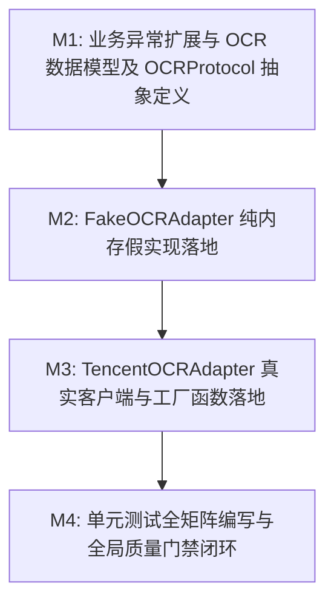

# Plan: OCR 识别适配器 (Tencent OCR) - 实施计划

- **关联 Spec**: ZL-115
- **实施执行人 / Agent**: Dev / Planner & Builder
- **当前状态**: Approved
- **架构定级**: Tier 2 (Single-Module Feature / External Integrations)

---

## 1. 变更文件清单 (Pillar 1: Files that change)

### 1.1 修改文件
* `backend/app/core/errors.py`:
  - 在 30xxx 外部能力网段扩充 3 个标准 OCR 异常类（均继承自 `AppError`）：
    - `OCRError` (`error_code=30004`, `status_code=502`): OCR 识别服务通用业务异常与底层第三方 SDK 故障基类；
    - `OCRTimeoutError` (`error_code=30005`, `status_code=504`): OCR 服务调用网络连接或等待响应超时异常；
    - `OCRAuthError` (`error_code=30006`, `status_code=502`): 腾讯云凭证密钥失效、权限不足或未开通服务异常；
  - 在模块的 `__all__` 导出列表中新增以上 3 个异常类，保持严格 ASCII 字典序。

### 1.2 新增文件
* `backend/app/integrations/ocr/__init__.py`:
  - OCR 适配器模块顶级入口包；
  - 导出核心契约与适配实现：`FakeOCRAdapter`, `OCROptions`, `OCRPoint`, `OCRPolygon`, `OCRProtocol`, `OCRResult`, `OCRTextBlock`, `TencentOCRAdapter`, `create_ocr_adapter`；
  - 维护显式 `__all__` 列表，严格维持 ASCII 字典序。

* `backend/app/integrations/ocr/protocol.py`:
  - 定义强类型数据契约与标准协议：
    - `@dataclass(frozen=True) class OCRPoint`: 二维平面坐标点 (`x`, `y`)；
    - `@dataclass(frozen=True) class OCRPolygon`: 文本包围框多边形 (`points`)，提供工厂方法 `from_coordinates`；
    - `@dataclass(frozen=True) class OCRTextBlock`: 单行/段文字块 (`text`, `confidence`, `polygon`, `line_number`)；
    - `@dataclass(frozen=True) class OCRResult`: 完整识别结果 (`full_text`, `blocks`, `duration_ms`, `image_width`, `image_height`, `provider`, `raw_payload`)；
    - `@dataclass(frozen=True) class OCROptions`: 识别控制选项 (`language_type`, `need_location`, `timeout`)，包含 `timeout > 0` 校验；
    - `@runtime_checkable class OCRProtocol(Protocol)`: 声明 `recognize_image(image_bytes, options)` 与 `recognize_url(image_url, options)`。

* `backend/app/integrations/ocr/fake.py`:
  - 实现 `FakeOCRAdapter(OCRProtocol)` 纯内存假适配器；
  - 专为单元测试与离线环境设计，零网络外联；
  - 内部基于 `threading.Lock` 保证并发安全；
  - 提供开箱即用确定性解析结果返回与默认保底数据；
  - 提供测试扩展控制方法：
    - `set_canned_result(key: str | bytes, result: OCRResult) -> None`: 针对特定哈希或 URL 预置结果；
    - `inject_failure(method_name: str, exception: Exception) -> None`: 注入模拟故障异常；
    - `inject_latency(seconds: float) -> None`: 注入模拟网络延迟；
    - `clear() -> None`: 重置内部缓存、预置结果与注入项；
  - 绝密脱敏保护：`__repr__` 仅输出缓存统计与状态，禁止输出任何图像二进制或识别文本全文。

* `backend/app/integrations/ocr/tencent.py`:
  - 实现 `TencentOCRAdapter(OCRProtocol)`，封装腾讯云通用印刷体识别（`GeneralBasicOCR` / `GeneralAccurateOCR`）；
  - 依赖动态隔离：按需导入 `tencentcloud-sdk-python`，若环境未安装在客户端初始化时显式抛出 `OCRError`；
  - 绝密脱敏红线：`__repr__` 强制将 `secret_key` 脱敏格式化为 `******`，日志禁止打印图像 Base64 全文或明文签名；
  - 多模态识别支持：`recognize_image` 自动进行 Base64 编码，`recognize_url` 传入合法图片网络地址；
  - 指数退避重试：针对限流 `RequestLimitExceeded` 与网络抖动超时，按 $0.5 \times 2^{\text{attempt}}$ 退避重试最多 3 次；
  - 异常转译映射：将 `AuthFailure.*` 映射为 `OCRAuthError`，超时映射为 `OCRTimeoutError`，其他错误映射为 `OCRError`。

* `backend/app/integrations/ocr/factory.py`:
  - 实现工厂函数 `create_ocr_adapter(adapter_type: str = "fake", *, secret_id: str | None = None, secret_key: str | None = None, region: str = "ap-guangzhou", endpoint: str = "ocr.tencentcloudapi.com", timeout: float = 20.0, max_retries: int = 3, client: Any | None = None) -> OCRProtocol`；
  - 默认分发 `fake` 适配器；分发 `tencent` 适配器时执行必要凭据参数校验，非法类型抛出 `OCRError`。

* `backend/tests/unit/integrations/ocr/test_ocr.py`:
  - 完整单元测试套件，覆盖率目标 $\ge 90\%$，毫秒级执行且零真实网络套接字连接；
  - 覆盖异常类层次、模型不可变性与参数校验；
  - 覆盖 `FakeOCRAdapter` 确定性识别、预置映射、故障与延迟注入、线程并发安全；
  - 覆盖 `TencentOCRAdapter` 凭据脱敏 `__repr__`、SDK 依赖缺失捕获、重试机制、异常分类转译；
  - 覆盖 `create_ocr_adapter` 工厂分发与参数校验。

---

## 2. 伴随式分步实施与任务拆解 (Pillar 2: Order of work)



### Milestone 1: 业务异常扩展与 OCR 数据模型及 OCRProtocol 抽象定义 (M1)
* **操作目标**:
  1. 在 `backend/app/core/errors.py` 中扩充 30004~30006 异常类：`OCRError`, `OCRTimeoutError`, `OCRAuthError`，并更新 `__all__` 字典序；
  2. 创建适配器目录 `backend/app/integrations/ocr/`；
  3. 在 `backend/app/integrations/ocr/protocol.py` 中定义强类型数据契约 (`OCRPoint`, `OCRPolygon`, `OCRTextBlock`, `OCRResult`, `OCROptions`) 与抽象协议 `@runtime_checkable class OCRProtocol(Protocol)`；
  4. 创建入口包文件 `backend/app/integrations/ocr/__init__.py`，初步导出协议契约。
* **涉及文件**:
  - `backend/app/core/errors.py`
  - `backend/app/integrations/ocr/__init__.py`
  - `backend/app/integrations/ocr/protocol.py`
* **局部验证命令**:
  - `cd backend && python3 -c "from app.core.errors import OCRError, OCRTimeoutError, OCRAuthError; from app.integrations.ocr.protocol import OCRProtocol, OCRResult, OCROptions; assert issubclass(OCRTimeoutError, OCRError); assert issubclass(OCRAuthError, OCRError)"`
* **预期判据**:
  - 异常类与协议模块成功导入，继承关系无误，`python3 -c` 命令以退出码 0 返回。

### Milestone 2: FakeOCRAdapter 纯内存假实现落地 (M2)
* **操作目标**:
  1. 在 `backend/app/integrations/ocr/fake.py` 中实现 `FakeOCRAdapter(OCRProtocol)`；
  2. 实现基于 `threading.Lock` 的并发安全字典存储，支持默认确定性返回与基于 SHA-256 哈希/URL 的预置结果匹配；
  3. 实现辅助测试方法：`set_canned_result`, `inject_failure`, `inject_latency`, `clear`；
  4. 实现绝密脱敏的 `__repr__` 展现；
  5. 在 `backend/app/integrations/ocr/__init__.py` 中导出 `FakeOCRAdapter`。
* **涉及文件**:
  - `backend/app/integrations/ocr/fake.py`
  - `backend/app/integrations/ocr/__init__.py`
* **局部验证命令**:
  - `cd backend && python3 -c "from app.integrations.ocr.fake import FakeOCRAdapter; from app.integrations.ocr.protocol import OCRProtocol; adapter = FakeOCRAdapter(); assert isinstance(adapter, OCRProtocol); res = adapter.recognize_image(b'fake_image'); assert len(res.full_text) > 0"`
* **预期判据**:
  - `FakeOCRAdapter` 满足 `isinstance(..., OCRProtocol)` 协议判定，默认识别返回非空文本与分块，退出码 0。

### Milestone 3: TencentOCRAdapter 真实客户端与工厂函数落地 (M3)
* **操作目标**:
  1. 在 `backend/app/integrations/ocr/tencent.py` 中实现 `TencentOCRAdapter(OCRProtocol)`；
  2. 落地 `tencentcloud-sdk-python` 按需导入与缺失依赖保护，未安装时显式抛出 `OCRError`；
  3. 落地凭据掩码脱敏 `__repr__`，确保 `secret_key` 格式化为 `******`；
  4. 落地基于指数退避的容错重试循环（最多 3 次，初始等待 0.5s，指数 2.0），并转译限流、超时与认证异常为统一业务异常；
  5. 落地响应结构体解析，将腾讯云原生返回转化为强类型 `OCRResult` 与 `OCRTextBlock`（含包围框多边形）；
  6. 在 `backend/app/integrations/ocr/factory.py` 中实现 `create_ocr_adapter` 工厂函数，支持 `fake` 与 `tencent` 类型分发与必填凭据校验；
  7. 更新 `backend/app/integrations/ocr/__init__.py` 完整导出所有公开符号并维持字典序。
* **涉及文件**:
  - `backend/app/integrations/ocr/tencent.py`
  - `backend/app/integrations/ocr/factory.py`
  - `backend/app/integrations/ocr/__init__.py`
* **局部验证命令**:
  - `cd backend && python3 -c "from app.integrations.ocr.factory import create_ocr_adapter; from app.integrations.ocr.tencent import TencentOCRAdapter; f = create_ocr_adapter('fake'); assert f is not None; t = TencentOCRAdapter('id', 'secret'); assert '******' in repr(t) and 'secret' not in repr(t)"`
* **预期判据**:
  - 工厂分发正常，`TencentOCRAdapter` 对象的 `repr` 严格屏蔽明文 SecretKey，退出码 0。

### Milestone 4: 单元测试全矩阵编写与全局质量门禁闭环 (M4)
* **操作目标**:
  1. 创建 `backend/tests/unit/integrations/ocr/test_ocr.py`，组织完备测试矩阵：
     - `test_ocr_errors_hierarchy`: 30004~30006 异常继承、HTTP 状态码与默认文案验证；
     - `test_ocr_data_structures`: `OCRPoint`, `OCRPolygon`, `OCRResult`, `OCROptions` 不可变性与参数校验；
     - `test_fake_ocr_default_recognition`: 默认图片字节与 URL 识别返回一致性与结构化分块；
     - `test_fake_ocr_canned_result_match`: 针对特定输入精确命中预置识别结果；
     - `test_fake_ocr_inject_failure_and_latency`: 故障注入自动触发、时延生效及 `clear` 重置恢复；
     - `test_fake_ocr_concurrency`: 10 线程并发调用无竞态报错；
     - `test_tencent_ocr_secret_masking`: 适配器 `__repr__` 密钥脱敏断言；
     - `test_tencent_ocr_dependency_missing`: 模拟缺少 `tencentcloud` SDK 时的防御捕获；
     - `test_tencent_ocr_auth_failure_mapping`: 认证异常立即映射为 `OCRAuthError` 且不重试；
     - `test_tencent_ocr_timeout_retry_and_mapping`: 超时重试 3 次后转译为 `OCRTimeoutError`；
     - `test_tencent_ocr_rate_limit_retry_success`: 限流触发退避重试并在第 2 次成功返回；
     - `test_tencent_ocr_generic_error_mapping`: 图像解码等业务失败转译为 `OCRError`；
     - `test_ocr_factory_dispatch_and_errors`: fake/tencent 类型分发及非法类型、缺失密钥防御拦截；
  2. 运行静态代码风格、类型检查、架构依赖单向性与全量单元测试覆盖率门禁。
* **涉及文件**:
  - `backend/tests/unit/integrations/ocr/test_ocr.py`
* **局部验证命令**:
  - `cd backend && pytest tests/unit/integrations/ocr/test_ocr.py --cov=app/integrations/ocr --cov-branch --cov-fail-under=90 -v`
  - `python3 tooling/check_layers.py --root backend/app`
  - `cd backend && ruff format --check . && ruff check . && mypy app/integrations/ocr app/core/errors.py && bandit -r app/integrations/ocr -ll`
  - `python3 tooling/check_sdlc_integrity.py`
* **预期判据**:
  - 单测 100% 绿灯，覆盖率 $\ge 90\%$；
  - 架构分层校验 0 违规，Ruff、Mypy、Bandit 0 报错；
  - SDLC 完整性校验通过。

---

## 3. 风险与缓解对策 (Pillar 3: Risks and Mitigations)

| 潜在风险与挑战 | 影响面 | 缓解与控制对策 |
| :--- | :---: | :--- |
| **敏感凭据与图像 Base64 泄露风险** | 安全合规 | `TencentOCRAdapter` 的 `__repr__` 显式将 `secret_key` 格式化为 `******`；日志记录仅允许打印图片字节大小、识别耗时、文本字符数与置信度，严禁在日志中记录明文凭据与待识别图片二进制/Base64 全文。 |
| **单测环境意外触发外部网络连接或消耗配额** | 测试隔离与稳定性 | 单元测试强制 100% 基于 `FakeOCRAdapter` 或局部 Mock 客户端执行；测试套件遵循零外联红线，毫秒级执行完成，杜绝消耗公网配额。 |
| **未安装腾讯云 SDK 导致模块导入崩溃** | 运行稳定性与移植性 | `TencentOCRAdapter` 采用按需延迟导入与 `ImportError` 捕获封装；未安装 SDK 时仅在显式初始化腾讯云客户端时抛出 `OCRError`，不影响使用 Fake 适配器的本地与 CI 容器环境。 |
| **公网 API 偶发网络抖动与限流雪崩** | 服务可靠性与可用性 | 生产适配器内置针对限流（`RequestLimitExceeded`）与网络抖动的指数退避重试（初始 0.5s，指数 2.0，上限 3 次）；单次请求设定 20.0s 总超时硬约束，防止任务执行器死锁挂起。 |
| **内存假适配器多线程并发竞态** | 并发测试准确性 | `FakeOCRAdapter` 内部所有对预置结果字典、注入状态与调用统计的操作均由 `threading.Lock` 上下文保护，确保并发读写原子性。 |
| **架构分层违规反向导入业务层与数据仓储** | 架构分层整洁性 | 外部适配层严禁导入 `app.services` 或 `app.repositories`；持续通过 `tooling/check_layers.py` 自动化检查守护单向依赖边界。 |

---

## 4. 物理验证手段与命令 (Pillar 4: Proof & Verification Commands)

实施过程中与阶段准出前，必须在终端依次执行以下命令确保物理闭环：

1. **分层依赖架构合规检查**：
   ```bash
   python3 tooling/check_layers.py --root backend/app
   ```
   *判据*: 退出码 0，`app/integrations` 绝无反向导入上层业务模块或仓储层违规。

2. **代码风格与静态质量扫描**：
   ```bash
   cd backend && ruff format --check . && ruff check .
   ```
   *判据*: 退出码 0，代码行宽不超过 100 字符，无未引用变量与格式问题。

3. **静态类型安全检查**：
   ```bash
   cd backend && mypy app/integrations/ocr app/core/errors.py
   ```
   *判据*: 退出码 0，类型严格模式全覆盖，所有接口入参与出参标注完备。

4. **安全隐患扫描**：
   ```bash
   cd backend && bandit -r app/integrations/ocr -ll
   ```
   *判据*: 退出码 0，高危与中危安全隐患数为 0。

5. **单元测试与分支覆盖率门禁**：
   ```bash
   cd backend && pytest tests/unit/integrations/ocr/test_ocr.py --cov=app/integrations/ocr --cov-branch --cov-fail-under=90 -v
   ```
   *判据*: 退出码 0，全部测试用例绿灯通过，代码覆盖率 $\ge 90\%$。

6. **SDLC 工件完整性与门禁校验**：
   ```bash
   python3 tooling/check_sdlc_integrity.py
   ```
   *判据*: 退出码 0，所有工件就绪，无残留占位符。

---

## 5. 实施偏差记录 (Deviations Log)

*实施过程严格对齐 Spec 技术契约，无偏离规格设计；所有涉及文件与接口定义均在规划矩阵清单内。*

---

## 6. 阶段准出签批 (Gate 3 Sign-off)

- [x] 4 支柱实施计划结构完备且边界明确
- [x] 任务拆解具备清晰的 M1~M4 推进路径与局部验证判据
- [x] 风险对策与物理验证命令可自动化执行且覆盖率指标明确
- **验收结论**: Approved
- **签批人 / 日期**: Dev / 2026-09-24
