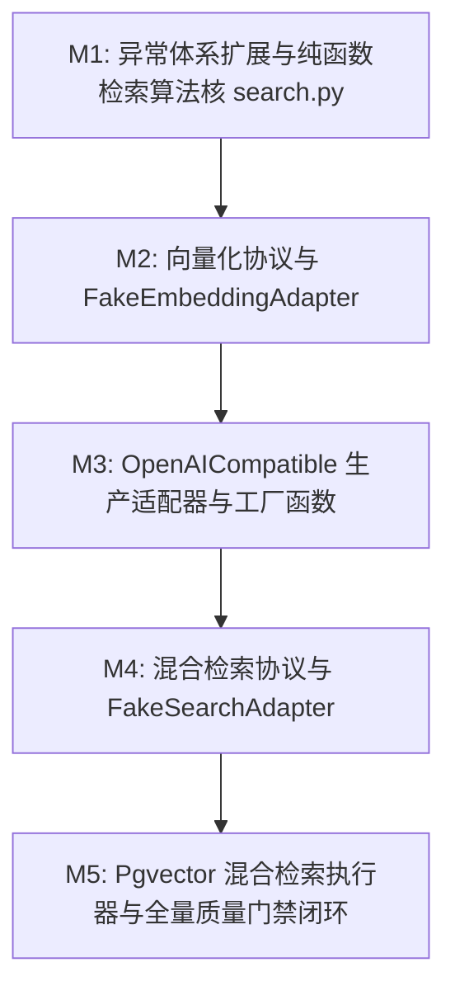

# Plan: 向量化与混合检索适配器 (pgvector/BM25) - 实施计划

- **关联 Spec**: ZL-116
- **实施执行人 / Agent**: Dev / Planner & Builder
- **当前状态**: Approved
- **架构定级**: Tier 2 (Single-Module Feature / External Integrations)

---

## 1. 变更文件清单 (Pillar 1: Files that change)

### 1.1 修改文件
* `backend/app/core/errors.py`:
  - 在 30xxx 外部能力网段扩充 4 个标准业务异常类（均继承自 `AppError`）：
    - `EmbeddingError` (`error_code=30007`, `status_code=502`): 向量化服务通用业务异常基类；
    - `EmbeddingTimeoutError` (`error_code=30008`, `status_code=504`): 向量化调用网络超时异常；
    - `EmbeddingAuthError` (`error_code=30009`, `status_code=502`): 向量化 API 凭据鉴权或配额失效异常；
    - `SearchError` (`error_code=30010`, `status_code=500`): 混合检索执行与排序融合异常；
  - 在模块 `__all__` 导出列表中追加以上 4 个异常类，严格维持 ASCII 字典序。

### 1.2 新增文件
* `backend/app/core/algorithms/search.py`:
  - 纯函数检索算法核，0 外部重型依赖，单函数环路复杂度 $V(G) \le 8$；
  - 实现 `tokenize_text(text: str) -> list[str]`: 轻量中英文分词与空白标点过滤；
  - 实现 `compute_bm25_score(query_tokens, doc_tokens, doc_length, avg_doc_length, doc_frequencies, total_docs, k1=1.5, b=0.75) -> float`: Okapi BM25 相关度打分；
  - 实现 `reciprocal_rank_fusion(ranked_lists, k=60, weights=None) -> list[tuple[str, float]]`: 倒数排名融合算法 (RRF)；
  - 实现 `weighted_score_fusion(vector_scores, keyword_scores, vector_weight=0.7, keyword_weight=0.3) -> list[tuple[str, float]]`: Min-Max 归一化加权打分融合；
  - 实现 `cosine_similarity(vector_a, vector_b) -> float`: 余弦相似度纯函数。

* `backend/app/integrations/embedding/__init__.py`:
  - 向量化模块顶级入口包，导出核心契约与适配器；
  - 导出 `EmbeddingOptions`, `EmbeddingProtocol`, `EmbeddingResult`, `FakeEmbeddingAdapter`, `OpenAICompatibleEmbeddingAdapter`, `create_embedding_adapter`；
  - 维持 `__all__` 严格 ASCII 字典序。

* `backend/app/integrations/embedding/protocol.py`:
  - 定义强类型数据契约与标准协议：
    - `@dataclass(frozen=True) class EmbeddingOptions`: 运行参数 (`model`, `dimensions`, `timeout`)；
    - `@dataclass(frozen=True) class EmbeddingResult`: 结果封装 (`vector`, `tokens`, `duration_ms`)；
    - `@runtime_checkable class EmbeddingProtocol(Protocol)`: 声明 `embed_query` 与 `embed_documents`，固定返回 1024 维向量。

* `backend/app/integrations/embedding/fake.py`:
  - 实现 `FakeEmbeddingAdapter(EmbeddingProtocol)` 纯内存假适配器；
  - 基于文本 SHA-256 哈希作为种子生成确定性 1024 维 L2 归一化浮点向量；
  - 基于 `threading.Lock` 保证并发安全；
  - 支持 `set_canned_vector`, `set_latency`, `set_fault_injection`, `reset` 等测试扩展方法；
  - `__repr__` 绝密脱敏。

* `backend/app/integrations/embedding/openai.py`:
  - 实现 `OpenAICompatibleEmbeddingAdapter(EmbeddingProtocol)`，兼容通义千问 DashScope 与 OpenAI `/v1/embeddings`；
  - `__repr__` 强制脱敏：`api_key='******'`；
  - 内置最多 3 次指数退避重试（初始 0.5s，指数 2.0）；
  - 20.0s 超时上限控制；
  - 底层 HTTP/SDK 异常转译为 `EmbeddingError`, `EmbeddingTimeoutError`, `EmbeddingAuthError`。

* `backend/app/integrations/embedding/factory.py`:
  - 实现工厂函数 `create_embedding_adapter(adapter_type: str = "fake", ...)`，支持 fake 与 openai 类型分发与校验。

* `backend/app/integrations/search/__init__.py`:
  - 混合检索模块顶级入口包；
  - 导出 `FakeSearchAdapter`, `PgvectorHybridSearchAdapter`, `SearchOptions`, `SearchProtocol`, `SearchResult`, `SearchSnippetCandidate`, `create_search_adapter`；
  - 维持 `__all__` 严格 ASCII 字典序。

* `backend/app/integrations/search/protocol.py`:
  - 定义混合检索数据契约与标准协议：
    - `@dataclass(frozen=True) class SearchOptions`: 检索控制参数 (`top_k=4`, `vector_top_k=20`, `fusion_method="rrf"`, `rrf_k=60`, `vector_weight=0.7`, `keyword_weight=0.3`)；
    - `@dataclass(frozen=True) class SearchSnippetCandidate`: 命中断言候选切片 (`snippet_id`, `material_id`, `version_id`, `content`, `chapter_title`, `source_info`, `vector_score`, `bm25_score`, `final_score`, `vector_rank`, `bm25_rank`)；
    - `@dataclass(frozen=True) class SearchResult`: 最终结构化结果 (`query`, `items`, `total_candidates`, `duration_ms`)；
    - `@runtime_checkable class SearchProtocol(Protocol)`: 声明 `search(query, user_id, material_id=None, version_id=None, options=None)`。

* `backend/app/integrations/search/fake.py`:
  - 实现 `FakeSearchAdapter(SearchProtocol)` 纯内存假适配器；
  - 强校验 `user_id`，支持预置结果与故障注入，并发线程安全。

* `backend/app/integrations/search/pgvector.py`:
  - 实现 `PgvectorHybridSearchAdapter(SearchProtocol)`；
  - 强校验 `user_id`（缺失抛出 `PermissionDeniedError`）；
  - 第一阶段向量粗排：通过 SQLAlchemy 查询 `MaterialSnippet` 过滤租户与可选资料/版本，按余弦距离排序取 Top 20（PostgreSQL 下利用 `<=>` 运算符与 HNSW 索引，SQLite 单元测试环境下平滑回退为纯函数 `cosine_similarity` 排序）；
  - 第二阶段关键词精排：调用 `tokenize_text` 与 `compute_bm25_score` 计算候选集 BM25 得分；
  - 第三阶段打分融合：通过 `reciprocal_rank_fusion` 或 `weighted_score_fusion` 聚合两路得分；
  - 第四阶段截断：按融合得分降序截断取 Top 4。

* `backend/app/integrations/search/factory.py`:
  - 实现工厂函数 `create_search_adapter(adapter_type: str = "fake", ...)`。

* `backend/tests/unit/core/algorithms/test_search.py`:
  - 纯函数算法核单元测试，覆盖率目标 100%，覆盖极端输入与边界值。

* `backend/tests/unit/integrations/embedding/test_embedding.py`:
  - 向量化适配器单元测试套件，零网络外联，覆盖 Fake/OpenAI/Factory 全矩阵。

* `backend/tests/unit/integrations/search/test_search.py`:
  - 混合检索适配器单元测试套件，验证租户绝对隔离、粗排20到精排4截断、RRF/加权融合。

---

## 2. 伴随式分步实施与任务拆解 (Pillar 2: Order of work)



### Milestone 1: 业务异常扩展与纯函数检索算法核 (M1)
* **操作目标**:
  1. 在 `backend/app/core/errors.py` 中扩充 `EmbeddingError`, `EmbeddingTimeoutError`, `EmbeddingAuthError`, `SearchError` 并维护 `__all__` 字典序；
  2. 在 `backend/app/core/algorithms/search.py` 中编写 `tokenize_text`, `compute_bm25_score`, `reciprocal_rank_fusion`, `weighted_score_fusion`, `cosine_similarity` 纯函数；
  3. 创建 `backend/tests/unit/core/algorithms/test_search.py`，组织完备白盒测试用例。
* **涉及文件**:
  - `backend/app/core/errors.py`
  - `backend/app/core/algorithms/search.py`
  - `backend/tests/unit/core/algorithms/test_search.py`
* **局部验证命令**:
  - `cd backend && pytest tests/unit/core/algorithms/test_search.py --cov=app/core/algorithms/search --cov-branch --cov-fail-under=95 -v`
* **预期判据**:
  - 纯函数单测全部通过，行覆盖率 $\ge 95\%$，分支覆盖率 $\ge 90\%$，`check_layers.py` 扫描通过。

### Milestone 2: 向量化协议与 FakeEmbeddingAdapter (M2)
* **操作目标**:
  1. 创建 `backend/app/integrations/embedding/protocol.py`，定义 `EmbeddingOptions`, `EmbeddingResult`, `EmbeddingProtocol`；
  2. 创建 `backend/app/integrations/embedding/fake.py`，实现确定性 1024 维向量生成、L2 归一化、线程安全与预置/注入扩展；
  3. 创建 `backend/app/integrations/embedding/__init__.py` 初步导出；
  4. 编写 `backend/tests/unit/integrations/embedding/test_embedding.py` 中针对 Fake 的测试。
* **涉及文件**:
  - `backend/app/integrations/embedding/protocol.py`
  - `backend/app/integrations/embedding/fake.py`
  - `backend/app/integrations/embedding/__init__.py`
  - `backend/tests/unit/integrations/embedding/test_embedding.py`
* **局部验证命令**:
  - `cd backend && pytest tests/unit/integrations/embedding/test_embedding.py -k "test_fake" -v`
* **预期判据**:
  - Fake 适配器满足 1024 维确定性与并发安全，测试全绿。

### Milestone 3: 生产级向量化适配器与工厂函数 (M3)
* **操作目标**:
  1. 创建 `backend/app/integrations/embedding/openai.py`，实现 `OpenAICompatibleEmbeddingAdapter`，内建凭据脱敏 `__repr__`、3 次退避重试、20s 超时控制与异常映射；
  2. 创建 `backend/app/integrations/embedding/factory.py`，实现 `create_embedding_adapter`；
  3. 完善 `backend/app/integrations/embedding/__init__.py` 完整导出；
  4. 完善 `backend/tests/unit/integrations/embedding/test_embedding.py`，使用 Mock HTTP client 验证重试与各类 HTTP 错误转译。
* **涉及文件**:
  - `backend/app/integrations/embedding/openai.py`
  - `backend/app/integrations/embedding/factory.py`
  - `backend/app/integrations/embedding/__init__.py`
  - `backend/tests/unit/integrations/embedding/test_embedding.py`
* **局部验证命令**:
  - `cd backend && pytest tests/unit/integrations/embedding/test_embedding.py --cov=app/integrations/embedding --cov-branch --cov-fail-under=90 -v`
* **预期判据**:
  - 凭据脱敏、重试退避与异常转译测试全绿，覆盖率 $\ge 90\%$。

### Milestone 4: 混合检索协议与 FakeSearchAdapter (M4)
* **操作目标**:
  1. 创建 `backend/app/integrations/search/protocol.py`，定义 `SearchOptions`, `SearchSnippetCandidate`, `SearchResult`, `SearchProtocol`；
  2. 创建 `backend/app/integrations/search/fake.py`，实现 `FakeSearchAdapter`，支持 `user_id` 强校验、预置结果匹配与注入；
  3. 创建 `backend/app/integrations/search/__init__.py` 初步导出；
  4. 编写 `backend/tests/unit/integrations/search/test_search.py` 中针对 Fake 的测试。
* **涉及文件**:
  - `backend/app/integrations/search/protocol.py`
  - `backend/app/integrations/search/fake.py`
  - `backend/app/integrations/search/__init__.py`
  - `backend/tests/unit/integrations/search/test_search.py`
* **局部验证命令**:
  - `cd backend && pytest tests/unit/integrations/search/test_search.py -k "test_fake" -v`
* **预期判据**:
  - Fake 检索适配器在无网络、无数据库环境下正常工作，非法 `user_id` 拦截无误。

### Milestone 5: Pgvector 混合检索执行器与全量质量门禁闭环 (M5)
* **操作目标**:
  1. 创建 `backend/app/integrations/search/pgvector.py`，实现 `PgvectorHybridSearchAdapter`（粗排 20 + BM25 语义重排 + RRF/加权融合 + Top 4 截断 + 多租户强隔离 + SQLite 方言自适应）；
  2. 创建 `backend/app/integrations/search/factory.py`，实现 `create_search_adapter`；
  3. 完善 `backend/app/integrations/search/__init__.py` 完整导出；
  4. 完善 `backend/tests/unit/integrations/search/test_search.py`，基于 SQLite 内存库对实体 `MaterialSnippet` 执行端到端检索与越权防御测试；
  5. 运行架构分层、格式化、静态类型、安全扫描与覆盖率全量门禁。
* **涉及文件**:
  - `backend/app/integrations/search/pgvector.py`
  - `backend/app/integrations/search/factory.py`
  - `backend/app/integrations/search/__init__.py`
  - `backend/tests/unit/integrations/search/test_search.py`
* **局部验证命令**:
  - `cd backend && pytest tests/unit/integrations/search/test_search.py --cov=app/integrations/search --cov-branch --cov-fail-under=90 -v`
  - `python3 tooling/check_layers.py --root backend/app`
  - `cd backend && ruff format --check . && ruff check . && mypy app && bandit -r app -ll`
* **预期判据**:
  - 混合检索测试全部通过，粗排20到精排4截断准确，水平越权被阻断；全量门禁检查退出码 0。

---

## 3. 动态风险核验与控制策略 (Pillar 3: Risks)

| 风险场景 | 风险等级 | 控制措施与防御实现 |
| :--- | :---: | :--- |
| **多租户水平越权查询** | 高 | `PgvectorHybridSearchAdapter.search` 将 `user_id` 作为强制非空参数校验，若为空直接抛出 `PermissionDeniedError`；生成的 SQL 语句强制锁定 `MaterialSnippet.user_id == user_id`；单测必须编写跨租户反向越权测试。 |
| **外部凭据敏感泄露** | 中 | 生产适配器 `OpenAICompatibleEmbeddingAdapter` 的 `__repr__` 与 `__str__` 统一进行 `api_key='******'` 掩码；日志排查仅输出维度与耗时，严禁输出文档切片正文。 |
| **单测环境 SQLite 缺乏 pgvector 扩展** | 中 | 检索器检测到数据库非 PostgreSQL 或运行在测试内存库时，自动平滑回退为纯函数 `cosine_similarity` 粗排，保证单测 100% 毫秒级通过且不依赖外部数据库容器。 |
| **网络波动与大模型限流雪崩** | 中 | 生产适配器内置指数退避重试（最多 3 次，0.5s/1.0s/2.0s）及 20.0s 超时门槛，避免工作流挂起。 |
| **架构跨层违规导入** | 低 | 纯函数严格位于 `app/core/algorithms/search.py`，0 外部重依赖；适配层严禁反向导入 `app.services`；门禁脚本 `tooling/check_layers.py` 自动化核验。 |

---

## 4. 全局质量门禁核验判据 (Pillar 4: Proof)

实施完成后必须顺序执行以下物理验证命令并全绿通过：

```bash
# 1. 架构分层单向依赖校验 (0 违规)
python3 tooling/check_layers.py --root backend/app

# 2. SDLC 工件生命周期完整性检查
python3 tooling/check_sdlc_integrity.py

# 3. 代码风格与规范静态扫描
cd backend && ruff format --check . && ruff check .

# 4. 严格类型检查 (重点覆盖 core, algorithms, integrations)
cd backend && mypy app/core/algorithms/search.py app/integrations/embedding app/integrations/search app/core/errors.py

# 5. 安全隐患扫描 (0 高危 0 中危)
cd backend && bandit -r app/integrations app/core/algorithms/search.py -ll

# 6. 纯算法计算核覆盖率核验 (行覆盖 >= 95%, 分支覆盖 >= 90%)
cd backend && pytest tests/unit/core/algorithms/test_search.py --cov=app/core/algorithms/search --cov-branch --cov-fail-under=95 -v

# 7. 适配层单元测试与覆盖率核验 (覆盖率 >= 90%)
cd backend && pytest tests/unit/integrations/embedding/ tests/unit/integrations/search/ --cov=app/integrations/embedding --cov=app/integrations/search --cov-branch --cov-fail-under=90 -v
```

---

## 5. 实施偏差记录 (Deviations Log)
*严格遵循 spec.md 技术契约实施，无架构偏差。*

---

## 6. 阶段准出签批 (Gate 3 Sign-off)
- [x] 所有分步实施项与验证断言均已就地规划并具备对应物理命令
- [x] 全局质量门禁（Lint / Type / Regression）闭环标准明确
- [x] 变更文件与 plan.md 清单完全吻合，无越权修改
- **验收结论**: Approved
- **验证人 / 日期**: Dev / 2026-09-24 00:40
