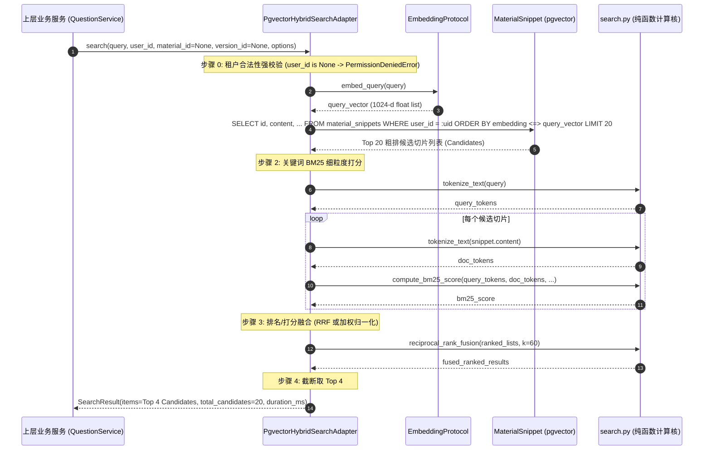

# Spec: 向量化与混合检索适配器 (pgvector/BM25) - 技术契约

- **关联 Intent**: ZL-116
- **主导设计人**: Dev
- **当前状态**: In-Review
- **任务评级**: Tier 2 (Single-Module Feature / External Integrations)

---

## 1. 架构流向与设计方案

### 1.1 模块定位与分层边界
智练自主学习平台在学习资料导入与出题生成（FR-21 出题前置检索支持，NFR-01 检索响应时间 P95 < 200ms，NFR-26 外部能力解耦与 Fake 隔离测试）场景中，需要将文本切片转化为 1024 维定长浮点向量，并通过 pgvector 余弦近邻粗排结合 BM25 关键词重排实现高精度多租户混合检索。

本模块横跨系统五层单向架构矩阵的两个分层：
1. **纯函数计算核** (`backend/app/core/algorithms/search.py`)：
   - 包含文本轻量分词、Okapi BM25 评分、RRF (倒数排名融合)、加权归一化融合与余弦相似度计算；
   - 严格遵循《AGENTS.md》纯函数铁律：输入输出均为原生 Python 数据结构，**绝对禁止导入 `fastapi`, `sqlalchemy`, `httpx`, `redis`, `boto3`** 等 Web 框架、ORM 或网络库，严禁导入 `app.services` 与 `app.repositories`。
2. **外部能力适配层** (`backend/app/integrations/embedding/` 与 `backend/app/integrations/search/`)：
   - `app/integrations/embedding/`：定义 `EmbeddingProtocol`，提供生产适配器 `OpenAICompatibleEmbeddingAdapter`（通义千问 DashScope / OpenAI 兼容）与单测假实现 `FakeEmbeddingAdapter`；
   - `app/integrations/search/`：定义 `SearchProtocol`，提供生产混合检索适配器 `PgvectorHybridSearchAdapter` 与单测假实现 `FakeSearchAdapter`；
   - 依赖单向向下：由上层业务服务层 `app/services`（如后续出题服务 `QuestionService`、切片导入服务 `MaterialService`）持有并调度，**外部适配层严禁反向导入 `app.services`**；
   - 必须通过 `python3 tooling/check_layers.py --root backend/app` 静态依赖门禁校验（0 跨层违规）。
3. **绝密脱敏与多租户安全红线**：
   - 遵循 `AGENTS.md` 绝密脱敏红线：生产适配器的 `__repr__` / `__str__` 必须将 `api_key` 严格掩码（`api_key='******'`），日志中严禁输出切片文本全文或用户查询全文；
   - 检索组件必须强制强校验 `user_id`（入参为空或非法时一票否决，抛出 `PermissionDeniedError`），SQL 查询强制携带 `where(MaterialSnippet.user_id == user_id)`，严格阻断跨租户水平越权。
4. **命名与缩写规范**：
   - 严格遵守 8 个缩写白名单（`api`, `id`, `url`, `ocr`, `llm`, `db`, `config`, `env`），严禁使用未经批准的缩写。

### 1.2 架构流向与交互拓扑

```mermaid
flowchart TD
    subgraph BusinessLayer [业务服务层: app/services]
        QuestionService[题目生成服务: QuestionService / ZL-121]
        MaterialService[资料切片服务: MaterialService / ZL-119]
    end

    subgraph IntegrationLayer [外部适配层: app/integrations]
        subgraph EmbeddingModule [embedding: 向量化适配器]
            EmbeddingProtocol["EmbeddingProtocol (typing.Protocol)"]
            FakeEmbeddingAdapter["FakeEmbeddingAdapter (单测零网络 / 确定性1024维)"]
            OpenAIEmbeddingAdapter["OpenAICompatibleEmbeddingAdapter (DashScope / 20s超时 / 3次重试)"]
            EmbeddingFactory["create_embedding_adapter()"]
        end

        subgraph SearchModule [search: 混合检索执行器]
            SearchProtocol["SearchProtocol (typing.Protocol)"]
            FakeSearchAdapter["FakeSearchAdapter (纯内存预置 / 故障注入)"]
            PgHybridRetriever["PgvectorHybridSearchAdapter (粗排20 + 精排4)"]
            SearchFactory["create_search_adapter()"]
        end
    end

    subgraph CoreAlgorithmLayer [核心纯函数计算核: app/core/algorithms]
        BM25Calc["compute_bm25_score()"]
        RRFFusion["reciprocal_rank_fusion()"]
        WeightedFusion["weighted_score_fusion()"]
        CosineCalc["cosine_similarity()"]
        Tokenizer["tokenize_text()"]
    end

    subgraph PersistenceLayer [数据持久层: PostgreSQL 16 + pgvector / SQLite]
        MaterialSnippetTable[("material_snippets (1024维向量 + HNSW索引)")]
    end

    subgraph CloudProviders [外部大模型云端]
        DashScopeAPI["通义千问 DashScope / OpenAI API (/v1/embeddings)"]
    end

    MaterialService -->|批量切片向量化| EmbeddingProtocol
    QuestionService -->|出题前置相关切片检索| SearchProtocol

    EmbeddingProtocol <|.. FakeEmbeddingAdapter
    EmbeddingProtocol <|.. OpenAIEmbeddingAdapter
    SearchProtocol <|.. FakeSearchAdapter
    SearchProtocol <|.. PgHybridRetriever

    EmbeddingFactory --> FakeEmbeddingAdapter
    EmbeddingFactory --> OpenAIEmbeddingAdapter
    SearchFactory --> FakeSearchAdapter
    SearchFactory --> PgHybridRetriever

    OpenAIEmbeddingAdapter -->|HTTP POST / 指数退避重试| DashScopeAPI
    PgHybridRetriever -->|依赖调用| EmbeddingProtocol
    PgHybridRetriever -->|纯函数计算调用| BM25Calc
    PgHybridRetriever -->|纯函数计算调用| RRFFusion
    PgHybridRetriever -->|纯函数计算调用| Tokenizer
    PgHybridRetriever -->|余弦粗排Top20 + 租户隔离| MaterialSnippetTable
```

### 1.3 核心处理流水线与检索算法

混合检索执行器 `PgvectorHybridSearchAdapter` 负责编排两阶段检索与打分融合：



#### 1.3.1 检索阶段与算法参数
1. **租户绝对隔离 (Multi-Tenant Barrier)**：
   - 校验 `user_id`：必须为合法非空 UUID，否则直接抛出 `PermissionDeniedError(20002, "user_id 不能为空")`；
   - SQL 查询条件：强制追加 `MaterialSnippet.user_id == user_id`，并支持可选的 `material_id`、`version_id` 过滤。
2. **第一阶段：向量粗排 (Coarse Recall - Top 20)**：
   - 调用 `EmbeddingProtocol.embed_query(query)` 生成 1024 维向量；
   - 在数据库中通过 pgvector 余弦距离运算符（`<=>`）查询最近邻，召回 `vector_top_k`（默认 20）条切片候选集；
   - 若在 SQLite 单元测试环境下，自动回退为加载租户下切片并使用纯函数 `cosine_similarity` 计算得分排序，保障单测在无原生 pgvector 环境下 100% 可行。
3. **第二阶段：BM25 精排 (Fine Ranking)**：
   - 使用 `tokenize_text` 对 `query` 及 20 个候选切片进行轻量中英文分词；
   - 计算 20 个候选切片的词频与文档频率，根据 Okapi BM25 公式计算关键词语义得分：
     $$\text{IDF}(q_i) = \ln\left( \frac{N - n(q_i) + 0.5}{n(q_i) + 0.5} + 1 \right)$$
     $$\text{TF}(q_i, D) = \frac{f(q_i, D) \cdot (k_1 + 1)}{f(q_i, D) + k_1 \cdot \left( 1 - b + b \cdot \frac{|D|}{\text{avgdl}} \right)}$$
     $$\text{BM25}(D, Q) = \sum_{q_i \in Q} \text{IDF}(q_i) \cdot \text{TF}(q_i, D)$$
     默认参数依据信息检索通用基线设定：$k_1 = 1.5, b = 0.75$。
4. **第三阶段：打分融合 (Score Fusion)**：
   - **RRF (Reciprocal Rank Fusion)**（默认融合算法，无须参数归一化校准）：
     $$\text{RRF\_Score}(d) = \sum_{m \in \{\text{vector}, \text{bm25}\}} \frac{w_m}{k + r_m(d)}$$
     其中平滑常数 $k = 60$，$r_m(d)$ 为切片 $d$ 在通道 $m$ 中的 1-indexed 名次，$w_m$ 为通道权重（默认各 1.0）。
   - **加权归一化融合 (Weighted Score Fusion)**（可选算法）：
     将向量相似度与 BM25 得分分别按 Min-Max 映射至 $[0, 1]$ 区间后线性加权：
     $$\text{Score}(d) = w_{\text{vector}} \cdot \tilde{S}_{\text{vector}}(d) + w_{\text{bm25}} \cdot \tilde{S}_{\text{bm25}}(d)$$
     默认权重：$w_{\text{vector}} = 0.7, w_{\text{bm25}} = 0.3$。
5. **第四阶段：Top 4 截断**：
   - 将融合结果按得分降序排序，取前 `top_k`（默认 4）项作为最终出题检索切片；
   - 保证出题 Prompt 上下文既精准聚焦于核心考点（BM25 关键词匹配），又具备语义泛化扩展（pgvector 语义联想）。

---

## 2. API 与数据契约设计

### 2.1 业务异常体系扩展 (`backend/app/core/errors.py`)

在 `backend/app/core/errors.py` 中扩充 30xxx 外部能力与网络问题体系，所有类继承 `AppError`，并更新 `__all__` 严格维持 ASCII 字典序：

```python
class EmbeddingError(AppError):
    """向量化服务基础异常 (错误码 30007, HTTP 502)。

    当向量化服务发生通用失败、第三方 API 异常响应或数据反序列化错误时抛出。
    """

    def __init__(
        self,
        message: str = "向量化服务异常",
        details: dict[str, Any] | None = None,
        *,
        error_code: int = 30007,
        status_code: int = 502,
        code: int | None = None,
        detail: dict[str, Any] | None = None,
    ) -> None:
        super().__init__(
            error_code=error_code,
            message=message,
            status_code=status_code,
            details=details,
            code=code,
            detail=detail,
        )


class EmbeddingTimeoutError(EmbeddingError):
    """向量化服务调用超时异常 (错误码 30008, HTTP 504)。

    当向量化服务网络连接超时或等待响应超时（超过预设 timeout 阈值）时抛出。
    """

    def __init__(
        self,
        message: str = "向量化服务响应超时",
        details: dict[str, Any] | None = None,
        *,
        code: int | None = None,
        detail: dict[str, Any] | None = None,
    ) -> None:
        super().__init__(
            message=message,
            details=details,
            error_code=30008,
            status_code=504,
            code=code,
            detail=detail,
        )


class EmbeddingAuthError(EmbeddingError):
    """向量化服务鉴权或授权失败异常 (错误码 30009, HTTP 502)。

    当通义千问或 OpenAI 兼容 API 凭据失效、权限不足或配额耗尽时抛出。
    """

    def __init__(
        self,
        message: str = "向量化服务认证或授权失败",
        details: dict[str, Any] | None = None,
        *,
        code: int | None = None,
        detail: dict[str, Any] | None = None,
    ) -> None:
        super().__init__(
            message=message,
            details=details,
            error_code=30009,
            status_code=502,
            code=code,
            detail=detail,
        )


class SearchError(AppError):
    """检索服务基础业务异常 (错误码 30010, HTTP 500)。

    当混合检索流水线执行出现未预期的数据库异常、维度不匹配或排序融合失败时抛出。
    """

    def __init__(
        self,
        message: str = "检索服务执行异常",
        details: dict[str, Any] | None = None,
        *,
        error_code: int = 30010,
        status_code: int = 500,
        code: int | None = None,
        detail: dict[str, Any] | None = None,
    ) -> None:
        super().__init__(
            error_code=error_code,
            message=message,
            status_code=status_code,
            details=details,
            code=code,
            detail=detail,
        )
```

### 2.2 向量化适配器契约 (`backend/app/integrations/embedding/protocol.py`)

```python
"""向量化适配器抽象协议与数据模型定义模块。

严格遵循 AGENTS.md 规范：
- 通过 Protocol 抽象接口与外部供应商解耦；
- 强类型不可变模型定义，零框架业务依赖；
- 缩写白名单仅限 8 个 (api, id, url, ocr, llm, db, config, env)。
"""

from collections.abc import Sequence
from dataclasses import dataclass
from typing import Protocol, runtime_checkable


@dataclass(frozen=True)
class EmbeddingOptions:
    """向量化调用配置选项。"""

    model: str = "text-embedding-v3"
    dimensions: int = 1024
    timeout: float = 20.0

    def __post_init__(self) -> None:
        """防御性参数合法性校验。"""
        if self.dimensions <= 0:
            raise ValueError("dimensions must be greater than 0")
        if self.timeout <= 0.0:
            raise ValueError("timeout must be greater than 0")


@dataclass(frozen=True)
class EmbeddingResult:
    """单次向量化调用返回结果数据模型。"""

    vector: tuple[float, ...]
    tokens: int = 0
    duration_ms: float = 0.0

    def __post_init__(self) -> None:
        if not isinstance(self.vector, tuple):
            object.__setattr__(self, "vector", tuple(self.vector))


@runtime_checkable
class EmbeddingProtocol(Protocol):
    """向量化适配器抽象协议契约。

    定义与外部具体大模型提供商解耦的定长向量嵌入接口。
    """

    def embed_query(
        self,
        text: str,
        options: EmbeddingOptions | None = None,
    ) -> list[float]:
        """将单个查询文本编码为 1024 维定长浮点向量。

        Args:
            text: 待编码的用户检索或考点文本。
            options: 可选的模型与调用配置。

        Returns:
            list[float]: 长度为 1024 的定长浮点向量。

        Raises:
            EmbeddingError: 编码失败或服务异常。
            EmbeddingTimeoutError: 调用响应超时。
            EmbeddingAuthError: 凭据鉴权拒绝。
        """
        ...

    def embed_documents(
        self,
        texts: Sequence[str],
        options: EmbeddingOptions | None = None,
    ) -> list[list[float]]:
        """批量将多个文档文本编码为 1024 维定长浮点向量列表。

        Args:
            texts: 待编码的切片文本序列。
            options: 可选的模型与调用配置。

        Returns:
            list[list[float]]: 长度与输入一致的 1024 维浮点向量列表。

        Raises:
            EmbeddingError: 编码失败或服务异常。
            EmbeddingTimeoutError: 调用响应超时。
            EmbeddingAuthError: 凭据鉴权拒绝。
        """
        ...
```

### 2.3 向量化适配器实现

#### 2.3.1 `FakeEmbeddingAdapter` (`backend/app/integrations/embedding/fake.py`)
- **功能特性**:
  - 纯内存开箱即用，0 外部套接字连接；
  - 内部基于 `threading.Lock` 保障并发安全；
  - 确定性向量生成：基于文本的 SHA-256 哈希值作为伪随机数种子，确定性生成 1024 维浮点向量，并执行 L2 归一化（$\sum v_i^2 = 1.0$），确保余弦距离与点积运算稳定可测；
  - 提供测试扩展方法：
    - `set_canned_vector(text: str, vector: Sequence[float]) -> None`: 针对特定文本预置返回向量；
    - `set_latency(seconds: float) -> None`: 注入模拟网络延迟；
    - `set_fault_injection(key: str, exception: Exception) -> None`: 注入模拟异常；
    - `reset() -> None`: 清理所有预置与注入状态。
  - 绝密脱敏：`__repr__` 仅打印缓存数量与状态，严禁打印向量值或文本内容。

#### 2.3.2 `OpenAICompatibleEmbeddingAdapter` (`backend/app/integrations/embedding/openai.py`)
- **功能特性**:
  - 封装标准 OpenAI 兼容的 `/v1/embeddings` 端点（完全支持阿里云通义千问 DashScope `text-embedding-v3`）；
  - 构造参数：
    - `api_key: str`: 外部 API 访问凭据；
    - `base_url: str`: API 接入基础路径（如 `https://dashscope.aliyuncs.com/compatible-mode/v1`）；
    - `model: str = "text-embedding-v3"`: 嵌入模型名称；
    - `dimensions: int = 1024`: 目标向量维度（默认 1024）；
    - `timeout: float = 20.0`: 默认超时上限 20s（NFR-11）；
    - `max_retries: int = 3`: 偶发错误最大指数重试次数；
    - `client: Any | None = None`: 可选外部注入的 HTTP 客户端（供测试打桩与无网验证）；
    - `retry_delay_base: float = 0.5`: 指数退避基数（0.5s, 1.0s, 2.0s）。
  - **绝密脱敏红线**：
    ```python
    def __repr__(self) -> str:
        return (
            f"OpenAICompatibleEmbeddingAdapter(model='{self.model}', "
            f"dimensions={self.dimensions}, base_url='{self.base_url}', "
            f"api_key='******', timeout={self.timeout})"
        )
    ```
  - **指数退避重试与异常转译**：
    - 针对 HTTP 429 (Rate Limit)、5xx (Server Error) 及网络连接超时触发重试；
    - 将 HTTP 401/403 转译为 `EmbeddingAuthError`；
    - 将 `httpx.TimeoutException` 转译为 `EmbeddingTimeoutError`；
    - 将其他非 200 响应及反序列化故障转译为 `EmbeddingError`。

#### 2.3.3 工厂函数 (`backend/app/integrations/embedding/factory.py`)
```python
def create_embedding_adapter(
    adapter_type: str = "fake",
    *,
    api_key: str | None = None,
    base_url: str | None = None,
    model: str = "text-embedding-v3",
    dimensions: int = 1024,
    timeout: float = 20.0,
    max_retries: int = 3,
    client: Any | None = None,
) -> EmbeddingProtocol:
    """根据类型与配置创建向量化适配器实例。"""
```

### 2.4 纯函数检索算法核契约 (`backend/app/core/algorithms/search.py`)

位于 `backend/app/core/algorithms/search.py`，0 外部重型依赖，白盒环路复杂度 $V(G) \le 8$：

```python
"""智练混合检索纯函数算法核模块。

严格遵循 AGENTS.md 规范：
- 仅包含纯函数，输入输出均为原生 Python 数据结构；
- 绝对禁止导入 fastapi, sqlalchemy, httpx, redis, boto3 等重型库；
- 严禁导入 app.services 与 app.repositories；
- 单函数环路复杂度 V(G) <= 8，分支覆盖率门禁 100%。
"""

import math
import re
from collections import Counter
from collections.abc import Sequence


def tokenize_text(text: str) -> list[str]:
    """对中英文字符串进行轻量分词与标准化。

    按单字切分中文汉字，按单词切分英文与数字，统一转换为小写，过滤空白与标点。

    Args:
        text: 待分词的原始字符串。

    Returns:
        list[str]: 分词后的词元序列。
    """
    if not text:
        return []
    lowered = text.lower()
    # 匹配单个汉字，或连续的英文字母与数字组合
    pattern = re.compile(r"[\u4e00-\u9fa5]|[a-z0-9]+")
    return pattern.findall(lowered)


def compute_bm25_score(
    query_tokens: Sequence[str],
    doc_tokens: Sequence[str],
    doc_length: int,
    avg_doc_length: float,
    doc_frequencies: dict[str, int],
    total_docs: int,
    k1: float = 1.5,
    b: float = 0.75,
) -> float:
    """计算单个文档相对于查询项的 Okapi BM25 相关度得分。

    Args:
        query_tokens: 查询词元列表。
        doc_tokens: 候选文档词元列表。
        doc_length: 当前候选文档词元总数。
        avg_doc_length: 语料候选库平均文档长度。
        doc_frequencies: 词元在语料候选库中出现的文档频次映射字典。
        total_docs: 语料候选库总文档数。
        k1: 词频饱和度控制参数，默认 1.5。
        b: 文档长度归一化惩罚参数，默认 0.75。

    Returns:
        float: BM25 得分（非负数）。
    """
    if not query_tokens or not doc_tokens or total_docs <= 0:
        return 0.0

    avg_len = avg_doc_length if avg_doc_length > 0 else 1.0
    doc_counter = Counter(doc_tokens)
    score = 0.0

    # 文档长度归一化分母项
    len_norm = 1.0 - b + b * (doc_length / avg_len)

    for token in query_tokens:
        freq = doc_counter.get(token, 0)
        if freq == 0:
            continue
        doc_freq = doc_frequencies.get(token, 0)
        # 带平滑的 Okapi IDF 计算，避免负值
        idf = math.log((total_docs - doc_freq + 0.5) / (doc_freq + 0.5) + 1.0)
        tf = (freq * (k1 + 1.0)) / (freq + k1 * len_norm)
        score += idf * tf

    return max(0.0, score)


def reciprocal_rank_fusion(
    ranked_lists: Sequence[Sequence[str]],
    k: int = 60,
    weights: Sequence[float] | None = None,
) -> list[tuple[str, float]]:
    """基于倒数排名融合算法 (RRF) 合并多路有序文档检索结果。

    公式: RRF_Score(d) = sum_{m} w_m / (k + rank_m(d))

    Args:
        ranked_lists: 多路检索系统返回的文档唯一标识有序序列列表。
        k: 排名平滑常数，默认 60。
        weights: 对应每路检索通道的加权权重列表，缺省为全 1.0。

    Returns:
        list[tuple[str, float]]: 按 RRF 得分降序排序的 (doc_id, score) 元组列表。
    """
    if not ranked_lists:
        return []

    channel_weights = list(weights) if weights else [1.0] * len(ranked_lists)
    scores: dict[str, float] = {}

    for channel_index, ranked in enumerate(ranked_lists):
        weight = channel_weights[channel_index] if channel_index < len(channel_weights) else 1.0
        for rank, doc_id in enumerate(ranked, start=1):
            scores[doc_id] = scores.get(doc_id, 0.0) + weight / (k + rank)

    sorted_results = sorted(scores.items(), key=lambda item: item[1], reverse=True)
    return sorted_results


def weighted_score_fusion(
    vector_scores: dict[str, float],
    keyword_scores: dict[str, float],
    vector_weight: float = 0.7,
    keyword_weight: float = 0.3,
) -> list[tuple[str, float]]:
    """对向量相似度与关键词 BM25 得分执行 Min-Max 归一化后的加权线性融合。

    Args:
        vector_scores: 文档 ID 到向量相似度（或距离反比）的映射字典。
        keyword_scores: 文档 ID 到 BM25 得分的映射字典。
        vector_weight: 向量通道权重，默认 0.7。
        keyword_weight: 关键词通道权重，默认 0.3。

    Returns:
        list[tuple[str, float]]: 降序排序的 (doc_id, score) 元组列表。
    """
    all_keys = set(vector_scores.keys()) | set(keyword_scores.keys())
    if not all_keys:
        return []

    def _normalize(scores: dict[str, float]) -> dict[str, float]:
        if not scores:
            return {}
        vals = scores.values()
        min_val, max_val = min(vals), max(vals)
        if math.isclose(max_val, min_val):
            return {k: 1.0 for k in scores}
        return {k: (v - min_val) / (max_val - min_val) for k, v in scores.items()}

    norm_vector = _normalize(vector_scores)
    norm_keyword = _normalize(keyword_scores)

    combined: dict[str, float] = {}
    for doc_id in all_keys:
        v_score = norm_vector.get(doc_id, 0.0)
        k_score = norm_keyword.get(doc_id, 0.0)
        combined[doc_id] = vector_weight * v_score + keyword_weight * k_score

    return sorted(combined.items(), key=lambda item: item[1], reverse=True)


def cosine_similarity(vector_a: Sequence[float], vector_b: Sequence[float]) -> float:
    """计算两个同维度浮点向量的余弦相似度。

    Args:
        vector_a: 向量 A。
        vector_b: 向量 B。

    Returns:
        float: 余弦相似度，范围 [-1.0, 1.0]。
    """
    if len(vector_a) != len(vector_b) or not vector_a:
        return 0.0

    dot_product = sum(a * b for a, b in zip(vector_a, vector_b, strict=False))
    norm_a = math.sqrt(sum(a * a for a in vector_a))
    norm_b = math.sqrt(sum(b * b for b in vector_b))

    if norm_a <= 0.0 or norm_b <= 0.0:
        return 0.0

    return max(-1.0, min(1.0, dot_product / (norm_a * norm_b)))
```

### 2.5 混合检索组件契约 (`backend/app/integrations/search/protocol.py`)

```python
"""混合检索适配器抽象协议与数据模型定义模块。

严格遵循 AGENTS.md 规范：
- 通过 Protocol 抽象接口支持 Fake 与 Pgvector 生产实现无缝切换；
- 强类型不可变模型定义，多租户隔离与安全脱敏；
- 缩写白名单仅限 8 个 (api, id, url, ocr, llm, db, config, env)。
"""

import uuid
from collections.abc import Sequence
from dataclasses import dataclass, field
from typing import Any, Protocol, runtime_checkable


@dataclass(frozen=True)
class SearchSnippetCandidate:
    """检索命中的候选知识切片数据契约。"""

    snippet_id: uuid.UUID
    material_id: uuid.UUID
    version_id: uuid.UUID
    content: str
    chapter_title: str
    source_info: dict[str, Any]
    vector_score: float = 0.0
    bm25_score: float = 0.0
    final_score: float = 0.0
    vector_rank: int | None = None
    bm25_rank: int | None = None

    def __repr__(self) -> str:
        """安全脱敏，禁止在日志中泄露切片文本全文。"""
        return (
            f"<SearchCandidate id={self.snippet_id} score={self.final_score:.4f} "
            f"vec_rank={self.vector_rank} bm25_rank={self.bm25_rank}>"
        )


@dataclass(frozen=True)
class SearchOptions:
    """混合检索运行参数选项。"""

    top_k: int = 4
    vector_top_k: int = 20
    fusion_method: str = "rrf"  # "rrf" 或 "weighted"
    rrf_k: int = 60
    vector_weight: float = 0.7
    keyword_weight: float = 0.3

    def __post_init__(self) -> None:
        if self.top_k <= 0:
            raise ValueError("top_k must be greater than 0")
        if self.vector_top_k < self.top_k:
            raise ValueError("vector_top_k must be greater than or equal to top_k")
        if self.fusion_method not in ("rrf", "weighted"):
            raise ValueError("fusion_method must be either 'rrf' or 'weighted'")


@dataclass(frozen=True)
class SearchResult:
    """混合检索执行结果数据模型。"""

    query: str
    items: tuple[SearchSnippetCandidate, ...] = field(default_factory=tuple)
    total_candidates: int = 0
    duration_ms: float = 0.0

    def __post_init__(self) -> None:
        if not isinstance(self.items, tuple):
            object.__setattr__(self, "items", tuple(self.items))


@runtime_checkable
class SearchProtocol(Protocol):
    """混合检索适配器抽象协议。"""

    def search(
        self,
        query: str,
        user_id: uuid.UUID,
        material_id: uuid.UUID | None = None,
        version_id: uuid.UUID | None = None,
        options: SearchOptions | None = None,
    ) -> SearchResult:
        """执行多租户强隔离的混合语义检索。

        Args:
            query: 用户检索或出题考点关键词查询文本。
            user_id: 归属用户唯一标识（必须提供，严禁越权）。
            material_id: 可选的资料主键范围限定。
            version_id: 可选的资料版本标识范围限定。
            options: 可选的检索与融合配置。

        Returns:
            SearchResult: 包含 Top 4 优质切片与融合分数的结构化结果。

        Raises:
            PermissionDeniedError: user_id 缺失或为空。
            SearchError: 检索执行异常。
            EmbeddingError: 查询向量化失败。
        """
        ...
```

### 2.6 混合检索实现细节

#### 2.6.1 `FakeSearchAdapter` (`backend/app/integrations/search/fake.py`)
- 提供开箱即用假检索实现，支持：
  - `user_id` 强校验：缺失抛出 `PermissionDeniedError`；
  - 预置结果配置 `set_canned_result(query_or_user_key, search_result)`；
  - 模拟时延 `set_latency(seconds)` 与故障注入 `set_fault_injection(key, exception)`；
  - `threading.Lock` 保护的多线程并发安全；
  - 供后续出题服务（`ZL-121`）及各类服务在零数据库与零网络环境下执行端到端单元测试。

#### 2.6.2 `PgvectorHybridSearchAdapter` (`backend/app/integrations/search/pgvector.py`)
- 构造参数接收 `session_factory: sessionmaker[Session]`（或直接连接会话生成器）与 `embedding_adapter: EmbeddingProtocol`；
- 执行流程：
  1. **租户检查**: `if not user_id: raise PermissionDeniedError("user_id 不能为空")`；
  2. **向量化**: 调用 `embedding_adapter.embed_query(query)` 获得 1024 维查询向量；
  3. **SQL 粗排 (Top 20)**:
     - 基础查询：`select(MaterialSnippet).where(MaterialSnippet.user_id == user_id)`；
     - 范围过滤：若传入 `material_id` 追加 `where(MaterialSnippet.material_id == material_id)`；若传入 `version_id` 追加 `where(MaterialSnippet.version_id == version_id)`；
     - 距离排序：Postgres 环境下追加 `order_by(MaterialSnippet.embedding.cosine_distance(query_vector).asc()).limit(options.vector_top_k)`；SQLite 单元测试环境下回退为查询切片列表后通过 `cosine_similarity` 排序选出 Top 20；
  4. **BM25 精排打分**:
     - 对候选切片和查询文本分词；
     - 计算词频并调用纯函数 `compute_bm25_score` 得到每个候选切片的 BM25 得分；
  5. **打分/排名融合**:
     - 调用 `reciprocal_rank_fusion` (RRF) 或 `weighted_score_fusion` 计算最终融合得分；
  6. **截断返回**: 取前 `options.top_k` 项打包为 `SearchSnippetCandidate` 列表并封装为 `SearchResult` 返回；记录毫秒级耗时。

#### 2.6.3 检索工厂 (`backend/app/integrations/search/factory.py`)
```python
def create_search_adapter(
    adapter_type: str = "fake",
    *,
    session_factory: Any | None = None,
    embedding_adapter: EmbeddingProtocol | None = None,
) -> SearchProtocol:
    """根据类型与依赖创建混合检索适配器实例。"""
```

---

## 3. 可测性设计 (Design for Testability)

### 3.1 零网络隔离红线与测试策略
- **单元测试网络物理阻断**：全量单元测试在 `conftest.py` 网络阻断 Fixture 下执行，严禁调用外部真实公网网络；
- **分层测试分工矩阵**：
  1. `test_search_algorithms.py` (`tests/unit/core/algorithms/`):
     - 针对纯函数 `tokenize_text`, `compute_bm25_score`, `reciprocal_rank_fusion`, `weighted_score_fusion`, `cosine_similarity` 执行 100% 分支覆盖率白盒测试；
     - 包含极端边界值（空文本、全标点、零候选词、单候选词、平分排名、平滑常数边界）；
  2. `test_embedding.py` (`tests/unit/integrations/embedding/`):
     - 验证 `FakeEmbeddingAdapter` 确定性 1024 维生成、单位长度归一化、预置向量匹配、延迟与异常注入、多线程并发安全；
     - 验证 `OpenAICompatibleEmbeddingAdapter` 凭据脱敏 `__repr__`、入参校验、Mock HTTP 客户端下的 3 次指数退避重试、各类 HTTP 状态码转译（401/403/429/500/504）；
     - 验证 `create_embedding_adapter` 工厂分发；
  3. `test_hybrid_search.py` (`tests/unit/integrations/search/`):
     - 验证 `FakeSearchAdapter` 的隔离、预置与注入功能；
     - 验证 `PgvectorHybridSearchAdapter` 的强租户隔离门禁（越权访问时拦截，无 `user_id` 时抛出 `PermissionDeniedError`）；
     - 验证粗排 20 截断、BM25 语义重排、RRF 排序聚合与最终 Top 4 输出；
     - 验证在 SQLite 单元测试内存库中的端到端完整流转。

### 3.2 决策表与边界值测试用例矩阵 (覆盖率要求: 纯算法 $\ge 95\%$, 适配器 $\ge 90\%$)

| 测试用例标识 | 待测模块 | 考查维度 | 核心输入参数与场景 | 预期断言结果 |
| :--- | :--- | :--- | :--- | :--- |
| `test_tokenize_text_chinese_and_english` | search.py | 分词功能 | `"智练 AI 平台 v1.0 架构！"` | 正确切分中文单字与英文单词，标点过滤 |
| `test_tokenize_text_empty_and_spaces` | search.py | 边界值 | `""`, `"   \t\n  "`, `"!@#$%"` | 返回空列表 `[]` |
| `test_bm25_exact_match_higher_score` | search.py | 评分逻辑 | 包含查询词的高频文档 vs 不包含文档 | 匹配文档 BM25 得分严格大于 0，未匹配得分为 0 |
| `test_bm25_zero_length_and_empty_inputs` | search.py | 边界值 | `query_tokens=[]` 或 `doc_tokens=[]` | 返回 `0.0`，无 ZeroDivisionError |
| `test_rrf_rank_aggregation` | search.py | 排名融合 | 向量排第一但BM25排末尾 vs 双通道均排前列 | 双通道均排前列的文档 RRF 总分更高 |
| `test_rrf_empty_inputs` | search.py | 边界值 | `ranked_lists=[]` | 返回 `[]` |
| `test_weighted_fusion_normalization` | search.py | 加权打分 | 两路得分尺度差异极大（0.9 与 125.0） | 自动 Min-Max 归一化后按 0.7:0.3 线性融合 |
| `test_cosine_similarity_orthogonal_and_same`| search.py | 向量计算 | 相同向量 vs 正交向量 vs 全零向量 | 相同向量为 1.0，正交为 0.0，零向量为 0.0 |
| `test_fake_embedding_deterministic_1024` | FakeEmbeddingAdapter | 确定性生成 | 相同文本多次调用 `embed_query` | 返回相同 1024 维向量且 L2 模长为 1.0 |
| `test_fake_embedding_canned_and_fault` | FakeEmbeddingAdapter | 测试扩展 | `set_canned_vector` 与 `set_fault_injection` | 优先返回预置向量；命中注入键时抛出指定异常 |
| `test_fake_embedding_thread_safety` | FakeEmbeddingAdapter | 并发安全 | 10 个线程并发执行 `embed_documents` | 无报错，返回结果数量与顺序严格对应 |
| `test_openai_repr_masks_api_key` | OpenAIEmbeddingAdapter | 绝密脱敏 | `api_key="sk-abcdef123456"` | `repr()` 与 `str()` 输出 `api_key='******'` |
| `test_openai_retry_on_429_then_success` | OpenAIEmbeddingAdapter | 退避重试 | Mock client 第一次返回 429，第二次返回 200 | 成功退避重试并正常解析向量返回 |
| `test_openai_timeout_mapped_to_app_error` | OpenAIEmbeddingAdapter | 异常转译 | Mock client 抛出 `httpx.TimeoutException` | 捕获转译为 `EmbeddingTimeoutError` (30008) |
| `test_openai_auth_error_mapping` | OpenAIEmbeddingAdapter | 异常转译 | Mock client 返回 401 Unauthorized | 立即抛出 `EmbeddingAuthError` (30009) 不重试 |
| `test_search_user_id_mandatory_isolation` | PgvectorSearchAdapter | 租户安全 | `user_id=None` 调用 `search` | 抛出 `PermissionDeniedError` (20002) |
| `test_search_cross_tenant_isolation` | PgvectorSearchAdapter | 水平越权 | 用户 A 检索，数据库存在用户 B 的高相关切片 | 用户 B 切片绝不出现在候选集或结果中 |
| `test_search_top20_coarse_to_top4_fine` | PgvectorSearchAdapter | 召回截断 | 数据库预置 30 个切片 | 粗排召回 20 个候选，最终精准输出 Top 4 |

---

## 4. 替代方案与权衡考量 (Alternatives Considered & Trade-offs)

### 4.1 方案 A (采纳方案)：`EmbeddingProtocol` + 纯函数 BM25/RRF + `PgvectorHybridSearchAdapter`
- **核心考量**:
  - 纯函数计算核独立于持久化与网络，100% 覆盖率可测；
  - 外部能力通过 `Protocol` 解耦，支持无网 Fake 适配器与 DashScope 生产适配器；
  - 检索执行器封装两阶段流转（粗排 20 + BM25 精排 4），在数据库端利用 pgvector 索引加速近邻过滤，在内存端进行词频精确打分与 RRF 融合，满足 NFR-01 P95 < 200ms 的性能要求。
- **代价与权衡**: 需要维护纯函数分词与 BM25 实现，但避免了额外引入 Elasticsearch 等重型中间件。

### 4.2 方案 B (否决方案)：在业务服务层直接内联 SQL 与第三方 Embedding SDK
- **否决原因**:
  - 严重违背五层单向依赖架构规范，上层服务与底层供应商深度绑定；
  - 无法进行零网络单元测试，CI 执行时将频繁消耗公网配额且受网络波动影响；
  - 缺乏多租户强制隔离封装，极易产生水平越权安全漏洞。

### 4.3 方案 C (否决方案)：仅使用单一 pgvector 向量检索，无 BM25 关键词重排
- **否决原因**:
  - 纯向量检索存在“语义漂移”问题，对于教材中的专有名词、编号术语（如“二元一次方程”、“动量守恒定律”）缺乏字面精确召回能力；
  - 工业界实践表明 Hybrid Search (Vector + BM25 + RRF) 召回准确率显著高于单一通道检索；
  - PRD FR-21 明确要求混合检索支持，单一通道无法满足业务质量要求。

---

## 5. 动态风险核验与回滚预案 (Risk & Rollback Verification)

### 5.1 7 大风险维度核验 (7-Dimensional Dynamic Risk Scan)

| 风险维度 | 风险等级 | 核验结论与控制措施 |
| :--- | :---: | :--- |
| **1. Files** | 低 | 新增物理隔离目录 `app/integrations/embedding/`、`app/integrations/search/`、纯算法文件 `app/core/algorithms/search.py`；在 `app/core/errors.py` 扩充 4 个 30xxx 异常类；新增配套单元测试。不修改任何现有既有业务代码。 |
| **2. API** | 无 | 本模块属于基础设施与适配层，不直接暴露或变更对外 HTTP RESTful API 路由契约。 |
| **3. Schema** | 无 | 不涉及数据库表变更或 Alembic 迁移脚本，完全复用 ZL-104 交付的 `material_snippets` 表与 pgvector HNSW 索引。 |
| **4. Auth** | 高 (已控制) | 涉及多租户数据隔离。控制措施：`user_id` 在 `search` 接口中为不可选的强制参数，SQL 查询强制携带 `where(MaterialSnippet.user_id == user_id)`，并在单测中编写跨租户越权攻击反向测试用例。 |
| **5. Deps** | 低 | 纯算法核采用原生 Python 实现，分词无额外 C 依赖；HTTP 调用复用项目中已有的 `httpx`；零新增第三方重型依赖。 |
| **6. Migration** | 无 | 无数据持久化状态变更，零历史数据迁移风险。 |
| **7. Blast Radius** | 低 | 变更完全限制在 `app/integrations/` 与 `app/core/`，对外通过协议抽象暴露，零破坏性连锁反应。 |

### 5.2 标注关键关注点 (Flagged Concerns)
1. **多租户水平越权与数据穿越风险 (Security Concern)**:
   - *关注点*: 向量近邻检索若未加 `user_id` 过滤，学生 A 的出题检索可能召回学生 B 上传的私有资料切片，造成严重隐私违规。
   - *对齐裁决*: `PgvectorHybridSearchAdapter.search` 入参必须包含 `user_id: uuid.UUID`；若为空直接抛出 `PermissionDeniedError`；生成的 SQL 语句强制锁定 `MaterialSnippet.user_id == user_id`；单测必须包含 cross-tenant 越权阻断用例。
2. **凭证脱敏与日志防泄露 (Security Concern)**:
   - *关注点*: DashScope / OpenAI 的 `api_key` 若在异常追踪或日志中打印，会导致企业外部配额失窃。
   - *对齐裁决*: 适配器的 `__repr__` 与 `__str__` 统一使用 `api_key='******'` 掩码；日志中严禁打印切片正文与查询全文，仅允许记录字符长度与耗时。
3. **SQLite 单元测试环境兼容性 (Portability Concern)**:
   - *关注点*: 单元测试使用 SQLite 内存库，SQLite 默认不支持 pgvector 的 `<=>` 余弦距离运算符。
   - *对齐裁决*: 在 `PgvectorHybridSearchAdapter` 中增加数据库方言自适应能力：当运行在 SQLite 环境下时，通过 `MaterialSnippet` 查询租户切片后，在 Python 内存中平滑调用纯函数 `cosine_similarity` 完成粗排排序，保证单元测试在无 PostgreSQL/pgvector 容器的裸机环境中毫秒级通过。

### 5.3 回滚与故障应急策略
本模块具备 100% 独立可拔插性，若出现任何异常可执行极简回滚：
1. **物理回滚命令**:
   ```bash
   git rm -rf backend/app/integrations/embedding/ \
              backend/app/integrations/search/ \
              backend/app/core/algorithms/search.py \
              backend/tests/unit/core/algorithms/test_search.py \
              backend/tests/unit/integrations/embedding/ \
              backend/tests/unit/integrations/search/
   git checkout -- backend/app/core/errors.py
   ```
2. **故障应急方案**:
   - 若生产公网 DashScope 发生大面积瘫痪，可通过配置切换适配器为备用 OpenAI 兼容端点或降级为纯关键词分词检索，出题链路不因单一大模型厂商宕机而全线溃败。

---

## 6. 阶段准出签批 (Gate 2 Sign-off)
- [x] 架构流向与 API 契约已冻结
- [x] 替代方案已完成推演与权衡
- [x] 7 维风险已核验且具备明确回滚预案
- **审查结论**: Approved
- **签批人 / 日期**: Dev / 2026-09-24 00:35
