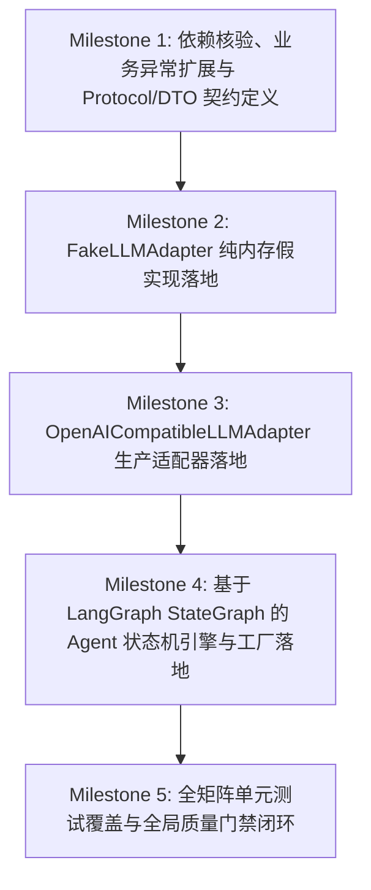

# Plan: 大语言模型网关适配器与 LangGraph 编排引擎 (LLM Gateway & Agent Graph) - 实施计划

- **关联 Spec**: ZL-117
- **实施执行人 / Agent**: Dev / Builder
- **当前状态**: Approved
- **架构定级**: Tier 2 (Single-Module Feature / External Integrations)

---

## 1. 变更文件清单 (Pillar 1: Files that change)

### 1.1 修改文件 (Modify)
* `backend/pyproject.toml`:
  - 确认并显式登记核心依赖：
    - `langgraph>=1.2.12`
    - `langchain-core>=1.6.4`
* `backend/app/core/errors.py`:
  - 在 30xxx 外部能力网段扩充 4 个标准大模型异常类（均继承自 `AppError`）：
    - `LLMError` (`error_code=30011`, `status_code=502`): 大语言模型适配器基础通用业务异常与未分类服务端错误；
    - `LLMTimeoutError` (`error_code=30012`, `status_code=504`): 网络连接超时或等待大模型响应超时异常；
    - `LLMAuthError` (`error_code=30013`, `status_code=502`): API Key 凭证缺失、无效、未授权或欠费停服异常；
    - `LLMResponseFormatError` (`error_code=30014`, `status_code=502`): 模型输出 JSON 损坏或 Schema 校验失败且单次自愈无效异常；
  - 在模块底部的 `__all__` 导出列表中新增以上 4 个异常类，严格遵循 ASCII 字典序排序。

### 1.2 新增文件 (New)
* `backend/app/integrations/llm/__init__.py`:
  - 大语言模型适配器包入口，导出公开契约、数据结构、适配器、LangGraph 状态图与工厂函数；
  - 维护显式 `__all__` 列表，严格维持 ASCII 字典序。

* `backend/app/integrations/llm/protocol.py`:
  - 定义强类型数据契约与统一抽象协议：
    - `@dataclass(frozen=True) class LLMMessage`: 对话消息 (`role`, `content`)，带非法角色与空内容防御校验；
    - `@dataclass(frozen=True) class LLMOptions`: 调用控制选项 (`model`, `temperature`, `max_tokens`, `timeout`, `response_format`)，带取值范围校验；
    - `@dataclass(frozen=True) class LLMUsage`: Token 用量统计 (`prompt_tokens`, `completion_tokens`, `total_tokens`)；
    - `@dataclass(frozen=True) class LLMResponse`: 模型统一响应 (`content`, `usage`, `model`, `duration_ms`)；
    - `@runtime_checkable class LLMProtocol(Protocol)`: 声明文本生成 `generate` 与结构化生成 `generate_structured` 接口契约，适配 LangGraph 节点调度。

* `backend/app/integrations/llm/fake.py`:
  - 实现纯内存假适配器 `class FakeLLMAdapter(LLMProtocol)`；
  - 专为单元测试与离线环境设计，零网络外联；
  - 基于 `threading.Lock` 保证并发安全；
  - 提供开箱即用确定性哈希文本生成与结构化模型绑定；
  - 提供测试扩展控制方法：
    - `set_canned_response(match_key: str, response: str | LLMResponse) -> None`: 匹配用户 Prompt 关键词或精确内容；
    - `set_canned_structured_response(response_model: type[T], data: T) -> None`: 绑定指定 Pydantic 模型类；
    - `set_latency(seconds: float) -> None`: 注入模拟网络延迟；
    - `set_fault_injection(key: str, exception: Exception) -> None`: 注入模拟异常；
    - `reset() -> None`: 重置内部缓存、预置结果与注入项；
  - 绝密脱敏展示：`__repr__` 仅输出注册项统计，禁止输出文本内容。

* `backend/app/integrations/llm/openai.py`:
  - 实现生产适配器 `class OpenAICompatibleLLMAdapter(LLMProtocol)`，封装标准 `/v1/chat/completions` API；
  - 绝密脱敏红线：`__repr__` 强制将 `api_key` 脱敏格式化为 `******`，日志禁止打印完整提示词与回答；
  - 动态超时控制：优先采用 `options.timeout`，无则回退至适配器默认值（支持出题 60s / 判题 20s）；
  - 指数退避重试：针对 HTTP 429 限流与 HTTP 5xx 服务端错误，按 $0.5 \times 2^{\text{attempt}}$ 退避重试最多 3 次；HTTP 401/403 鉴权拒绝立即阻断；
  - 异常转译映射：将网络连接错误、超时与 HTTP 状态码精准映射至 30011~30014 业务异常；
  - 结构化生成代理：`generate_structured` 统一通过 LangGraph 图状态机执行校验与自愈。

* `backend/app/integrations/llm/agent_graph.py`:
  - 基于 LangGraph `StateGraph` 的 Agent 状态机引擎实现；
  - 状态契约：`AgentWorkflowState(TypedDict)`（`messages`, `options`, `response_model`, `adapter`, `raw_response`, `parsed_data`, `retry_count`, `error_message`, `status`）；
  - 核心节点：
    - `call_model_node`: 调用绑定适配器生成原始文本；
    - `validate_output_node`: 剥离 Markdown 代码块标记并反序列化进行 Pydantic 校验；
    - `repair_prompt_node`: 递增 `retry_count` 并追加残缺回答与诊断提示词；
    - `fallback_node`: 记录失败状态并准备抛出 `LLMResponseFormatError`；
  - 条件边：`decide_after_validation` 实现单次自愈决策（有效 -> `END`；首次无效 -> `repair_prompt_node`；二次无效 -> `fallback_node`）；
  - 编译导出：`build_structured_agent_graph()` 与纯函数执行入口 `run_structured_agent_workflow(...) -> tuple[T, LLMResponse]`。

* `backend/app/integrations/llm/factory.py`:
  - 实现适配器工厂：`create_llm_adapter(adapter_type: str = "fake", ...)`；
  - 实现图编排工厂：`create_structured_agent_graph(adapter: LLMProtocol)`；
  - 默认分发 `fake` 模式；生产模式严格校验 `api_key` 非空，非法类型抛出 `LLMError`。

* `backend/tests/unit/integrations/llm/test_llm.py`:
  - 适配器单元测试套件：DTO 校验、Fake 适配器、OpenAI 适配器凭证脱敏、退避重试、动态超时与异常转译。

* `backend/tests/unit/integrations/llm/test_agent_graph.py`:
  - LangGraph 状态图全生命周期测试套件：一次性成功流转、单次自愈重试触发成功、二次失败阻断并抛出 30014、结合 Fake 适配器纯内存零网络执行、并发隔离。

---

## 2. 伴随式分步实施与任务拆解 (Pillar 2: Order of work)



### Milestone 1: 依赖核验、业务异常扩展与 Protocol/DTO 契约定义 (M1)
* **操作目标**:
  1. 确认 `backend/pyproject.toml` 中的 `langgraph>=1.2.12` 与 `langchain-core>=1.6.4` 依赖；
  2. 在 `backend/app/core/errors.py` 中扩充 30011~30014 异常类：`LLMError`, `LLMTimeoutError`, `LLMAuthError`, `LLMResponseFormatError`，并更新 `__all__` 字典序；
  3. 创建适配器目录 `backend/app/integrations/llm/`；
  4. 在 `backend/app/integrations/llm/protocol.py` 中定义强类型不可变模型 (`LLMMessage`, `LLMOptions`, `LLMUsage`, `LLMResponse`) 与抽象协议 `@runtime_checkable class LLMProtocol(Protocol)`；
  5. 创建入口包文件 `backend/app/integrations/llm/__init__.py`，导出基础协议与模型。
* **涉及文件**:
  - `backend/pyproject.toml`
  - `backend/app/core/errors.py`
  - `backend/app/integrations/llm/__init__.py`
  - `backend/app/integrations/llm/protocol.py`
* **局部验证命令**:
  ```bash
  cd backend && python3 -c "import langgraph, langchain_core; from app.core.errors import LLMError, LLMTimeoutError, LLMAuthError, LLMResponseFormatError; from app.integrations.llm.protocol import LLMProtocol, LLMMessage, LLMOptions, LLMResponse; assert issubclass(LLMTimeoutError, LLMError); assert issubclass(LLMAuthError, LLMError); assert issubclass(LLMResponseFormatError, LLMError)"
  ```
* **预期判据**:
  - 命令以退出码 0 返回，第三方依赖导入正常，异常类与协议模块顺利导入，继承关系无误。

### Milestone 2: FakeLLMAdapter 纯内存假实现落地 (M2)
* **操作目标**:
  1. 在 `backend/app/integrations/llm/fake.py` 中实现 `FakeLLMAdapter(LLMProtocol)`；
  2. 实现基于 `threading.Lock` 的并发安全字典存储，支持基于消息哈希的确定性返回与精确 Prompt 关键词匹配；
  3. 支持结构化模型对象注册与返回 (`set_canned_structured_response`)；
  4. 支持时延与故障注入 (`set_latency`, `set_fault_injection`, `reset`)；
  5. 实现绝密脱敏的 `__repr__` 展现；
  6. 在 `backend/app/integrations/llm/__init__.py` 中导出 `FakeLLMAdapter`。
* **涉及文件**:
  - `backend/app/integrations/llm/fake.py`
  - `backend/app/integrations/llm/__init__.py`
* **局部验证命令**:
  ```bash
  cd backend && pytest tests/unit/integrations/llm/test_llm.py -k "test_fake" -v
  ```
* **预期判据**:
  - Fake 适配器用例全绿，覆盖确定性文本、预设结构体、时延/故障注入及多线程并发操作无竞态。

### Milestone 3: OpenAICompatibleLLMAdapter 生产适配器落地 (M3)
* **操作目标**:
  1. 在 `backend/app/integrations/llm/openai.py` 中实现 `OpenAICompatibleLLMAdapter(LLMProtocol)`；
  2. 实现基于 `httpx.Client`（支持外部 Client 注入隔离单测）调用 `/v1/chat/completions`；
  3. 实现指数退避重试（针对 429 限流与 5xx 错误，最多 3 次，初始等待 0.5s，指数 2.0）；
  4. 实现 401/403 鉴权异常立即阻断抛出 `LLMAuthError`，严禁重试；
  5. 实现动态超时覆盖控制（`options.timeout` 优先于全局 30s 默认超时）；
  6. 实现 `__repr__` 绝密掩码 `api_key='******'`；
  7. 异常转译映射为 30011~30014 业务异常。
* **涉及文件**:
  - `backend/app/integrations/llm/openai.py`
  - `backend/app/integrations/llm/__init__.py`
* **局部验证命令**:
  ```bash
  cd backend && pytest tests/unit/integrations/llm/test_llm.py -k "test_openai" -v
  ```
* **预期判据**:
  - 生产适配器用例全绿，凭据脱敏生效、退避重试与阻断逻辑准确、动态超时生效。

### Milestone 4: 基于 LangGraph StateGraph 的 Agent 状态机引擎与工厂落地 (M4)
* **操作目标**:
  1. 在 `backend/app/integrations/llm/agent_graph.py` 中定义 `AgentWorkflowState`；
  2. 实现四大节点：`call_model_node`, `validate_output_node`, `repair_prompt_node`, `fallback_node`；
  3. 实现条件分支决策函数 `decide_after_validation` 与状态图装配 `build_structured_agent_graph`；
  4. 实现统一执行函数 `run_structured_agent_workflow`，并挂载至适配器的 `generate_structured` 方法；
  5. 在 `backend/app/integrations/llm/factory.py` 中实现 `create_llm_adapter` 与 `create_structured_agent_graph`；
  6. 在 `backend/app/integrations/llm/__init__.py` 中导出所有核心类与函数。
* **涉及文件**:
  - `backend/app/integrations/llm/agent_graph.py`
  - `backend/app/integrations/llm/factory.py`
  - `backend/app/integrations/llm/__init__.py`
* **局部验证命令**:
  ```bash
  cd backend && pytest tests/unit/integrations/llm/test_agent_graph.py -v
  ```
* **预期判据**:
  - LangGraph 状态图执行用例全绿，直接成功、单次自愈与二次失败阻断各分支流转完全符合预期。

### Milestone 5: 全矩阵单元测试编写与全局质量门禁闭环 (M5)
* **操作目标**:
  1. 在 `backend/tests/unit/integrations/llm/` 下补全测试用例；
  2. 执行架构分层依赖校验，确保 `check_layers.py` 0 跨层违规；
  3. 执行代码格式化、类型静态分析与安全审计；
  4. 验证行覆盖率 $\ge 90\%$，分支覆盖率 $\ge 85\%$。
* **涉及文件**:
  - `backend/tests/unit/integrations/llm/test_llm.py`
  - `backend/tests/unit/integrations/llm/test_agent_graph.py`
* **局部验证命令**:
  ```bash
  python3 tooling/check_layers.py --root backend/app && \
  cd backend && \
  ruff format --check app/integrations/llm tests/unit/integrations/llm && \
  ruff check app/integrations/llm tests/unit/integrations/llm && \
  mypy app/integrations/llm && \
  pytest tests/unit/integrations/llm --cov=app/integrations/llm --cov-branch --cov-fail-under=90
  ```
* **预期判据**:
  - 各命令均以退出码 0 通过，零跨层违规，覆盖率达标，所有测试用例毫秒级通过且零外部套接字网络外联。

---

## 3. 风险与依赖管理 (Pillar 3: Risks & Mitigations)

| 风险类别 | 风险描述 | 规避与缓解方案 |
| :--- | :--- | :--- |
| **凭证泄露** | `api_key` 在日志、异常栈或 repr 打印中明文泄露 | 适配器的 `__repr__` 与 `__str__` 强制执行 `api_key='******'` 掩码；日志记录仅保留不可逆摘要与统计量 |
| **自愈死循环** | 结构化自愈修复反复重试导致配额耗尽与业务超时 | LangGraph 条件边通过 `retry_count == 0` 严格控制单次自愈；二次校验失败流向 `fallback_node` 并抛出 `LLMResponseFormatError` (30014) |
| **状态并发串扰** | LangGraph 状态机在多线程/并发请求下共享同一状态导致数据混乱 | 状态机通过 `compile()` 编译为纯无状态执行图，每次调用创建独立的初始状态 TypedDict，图节点函数纯净无全局状态副作用 |
| **超时敏感度冲突** | 出题 (60s) 与判题 (20s) 业务时延差异导致固定超时误伤 | 适配器支持调用级 `options.timeout` 动态覆盖默认的 30s 实例级超时 |
| **单测真实联网** | 测试套件意外发起公网请求消耗真实 Token 配额 | 单元测试强制采用 `FakeLLMAdapter` 或注入本地 Mock Client，严禁套接字连接 |
| **并发竞态安全** | 内存假实现在多线程测试中共享状态发生脏写或崩溃 | `FakeLLMAdapter` 内部所有预置数据与故障注入统一使用 `threading.Lock` 加锁 |

---

## 4. 可验证交付物判据 (Pillar 4: Proof / Definition of Done)

* [ ] **依赖配置规范性**: `backend/pyproject.toml` 包含 `langgraph>=1.2.12` 与 `langchain-core>=1.6.4`。
* [ ] **契约规范性**: `backend/app/integrations/llm/` 完整导出 `LLMProtocol`, `LLMMessage`, `LLMOptions`, `LLMUsage`, `LLMResponse`, `FakeLLMAdapter`, `OpenAICompatibleLLMAdapter`, `build_structured_agent_graph`, `create_llm_adapter`, `create_structured_agent_graph`。
* [ ] **异常完整性**: `backend/app/core/errors.py` 扩充 30011~30014 异常类，继承关系正确，状态码对齐 502/504。
* [ ] **绝密脱敏验证**: `repr(adapter)` 与 `str(adapter)` 绝密脱敏，断言明文 `api_key` 不存在。
* [ ] **LangGraph 状态图全生命周期验证**:
  - 一次性直通：模型返回合法 JSON 时流经 `call_model_node` -> `validate_output_node` -> `END`；
  - 单次自愈重试：首次返回 Markdown 残缺 JSON 时，条件分支转入 `repair_prompt_node` 追加上下文，二次补全成功后转入 `END` 并返回结构体；
  - 自愈耗尽阻断：连续 2 次格式损坏时，条件分支转入 `fallback_node` 并精确抛出 `LLMResponseFormatError` (30014)。
* [ ] **网络与退避重试验证**: 429 与 5xx 触发指数退避重试；401/403 立即阻断。
* [ ] **架构分层门禁**: `python3 tooling/check_layers.py --root backend/app` 0 违规。
* [ ] **质量覆盖率门禁**: `pytest tests/unit/integrations/llm --cov=app/integrations/llm --cov-branch --cov-fail-under=90` 全绿通过。
* [ ] **工件生命周期门禁**: `python3 tooling/check_sdlc_integrity.py` 0 报错。

---

## 5. 实施偏差记录 (Deviations Log)
* [打回重构重定基线：依据人类明确指示，由手写 Ad-hoc 重试全面升级为基于 LangGraph StateGraph 的状态图编排体系，统一 Agent 状态流转契约]

---

## 6. 阶段准出签批 (Gate 3 Sign-off)
- [x] 所有分步实施项与验证断言均已就地规划并对齐
- [x] 全局质量门禁（Lint / Type / Layer / Coverage）目标指标清晰
- [x] 变更文件与 plan.md 清单完全吻合，无越权修改
- **验收结论**: Approved
- **验证人 / 日期**: Dev / 2026-09-24 01:06
