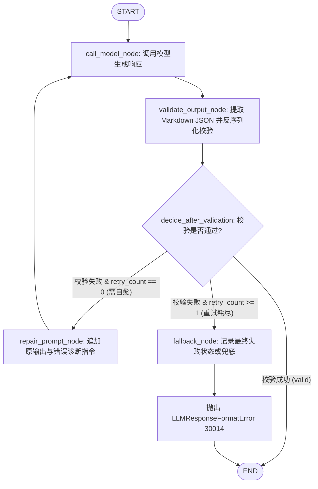

# Spec: 大语言模型网关适配器与 LangGraph 编排引擎 (LLM Gateway & Agent Graph) - 技术契约

- **关联 Intent**: ZL-117
- **主导设计人**: Dev
- **当前状态**: In-Review
- **任务评级**: Tier 2 (Single-Module Feature / External Integrations)

---

## 1. 架构流向与设计方案

### 1.1 模块定位与分层边界
智练自主学习平台在知识点抽取建树 (FR-14)、题目生成 6 要素 (FR-20) 与主观题 AI 判题归因 (FR-41) 场景中，深度依赖大语言模型。
为消除各业务服务手写分散重试逻辑的脆弱性，并为多 Agent 协作演进奠定底座，本模块在外部能力适配层（`backend/app/integrations/llm/`）融合了**大模型统一协议适配**与**基于 LangGraph StateGraph 的 Agent 状态机引擎**：
- **物理路径**: `backend/app/integrations/llm/`
- **分层依赖铁律**:
  - 依赖单向向下：由上层业务服务层 `app/services`（如 `KnowledgeService`, `QuestionService`, `GradingService`）通过依赖注入持有并调度，**外部适配层绝对严禁反向导入 `app.services`**；
  - 适配层严禁导入数据仓储层 `app.repositories`；
  - 纯函数计算核（`app/core/algorithms/`）绝对严禁导入外部适配器与网络驱动；
  - 必须通过 `python3 tooling/check_layers.py --root backend/app` 静态依赖门禁校验（0 跨层违规）。
- **绝密脱敏与凭据隔离红线**:
  - 遵循 `AGENTS.md` 绝密脱敏红线：**严禁在日志输出或对象字符串表示中记录 API Key、完整学习资料全文、完整题目与答案全文、用户作答原文**；
  - 适配器对象的 `__repr__` / `__str__` 方法中必须严格对 `api_key` 执行掩码脱敏（`api_key='******'`）；
  - 结构化日志排查统一使用量化与安全字段：耗时（`duration_ms`）、Prompt 字符数、补全字符数、Token 用量（`prompt_tokens`, `completion_tokens`）、模型名（`model`）、修复重试标记（`retry_count`）。
- **命名与缩写规范**:
  - 严格遵守 8 个缩写白名单（`api`, `id`, `url`, `ocr`, `llm`, `db`, `config`, `env`），禁止自造任何缩写，标识符一律使用完整且语法正确的英文。

### 1.2 架构拓扑与交互拓扑

```mermaid
flowchart TD
    subgraph ServiceLayer [业务编排服务层: app/services]
        KnowledgeService[知识点建树服务: KnowledgeService]
        QuestionService[题目生成服务: QuestionService]
        GradingService[AI 判题服务: GradingService]
    end

    subgraph LLMIntegration [外部适配与 Agent 编排层: app/integrations/llm]
        subgraph GraphEngine [LangGraph 状态机编排引擎: agent_graph.py]
            StateGraphDef["StateGraph[AgentWorkflowState]"]
            CallModelNode["call_model_node (调用模型生成)"]
            ValidateNode["validate_output_node (Pydantic 校验)"]
            RepairNode["repair_prompt_node (构建自愈 Prompt)"]
            FallbackNode["fallback_node (错误记录与阻断)"]
            ConditionEdge{"decide_after_validation"}
        end

        Factory["工厂函数: create_llm_adapter() / create_structured_agent_graph()"]
        LLMProtocol["LLMProtocol (统一模型调用协议)"]
        
        FakeAdapter["FakeLLMAdapter (纯内存确定性实现 / 零网络单测隔离)"]
        OpenAIAdapter["OpenAICompatibleLLMAdapter (标准 /v1/chat/completions)"]
        
        subgraph NetworkResilience [网络与弹性保障]
            RetryEngine["指数退避重试 (429/5xx, 最多 3 次)"]
            TimeoutControl["动态超时控制 (出题 60s / 判题 20s / 默认 30s)"]
        end
    end

    subgraph ExternalProviders [外部供应商 / 离线环境]
        MemoryCanned["预设响应 / 结构化预置 / 故障时延注入"]
        DashScope["通义千问 (DashScope Qwen)"]
        DeepSeek["DeepSeek API"]
        SiliconFlow["SiliconFlow / OpenAI"]
    end

    KnowledgeService -->|调度结构化工作流| Factory
    QuestionService -->|调度结构化工作流| Factory
    GradingService -->|调度结构化工作流| Factory

    Factory -->|构建| StateGraphDef
    Factory -->|构建| FakeAdapter
    Factory -->|构建| OpenAIAdapter

    CallModelNode -->|统一调用| LLMProtocol
    LLMProtocol <|.. FakeAdapter
    LLMProtocol <|.. OpenAIAdapter

    OpenAIAdapter --> RetryEngine
    OpenAIAdapter --> TimeoutControl

    FakeAdapter -->|离线无套接字| MemoryCanned
    OpenAIAdapter -->|HTTP POST| DashScope
    OpenAIAdapter -->|HTTP POST| DeepSeek
    OpenAIAdapter -->|HTTP POST| SiliconFlow
```

### 1.3 LangGraph 状态机流转与自愈拓扑 (StateGraph Architecture)

基于 LangGraph `StateGraph` 构建强类型状态流转图，显式建模“生成 -> 校验 -> 自愈重试 -> 降级阻断”全生命周期：



#### 节点职责与契约：
1. **`call_model_node`**:
   - 提取当前状态中的 `messages` 与 `options`；
   - 调用绑定的 `adapter.generate(messages, options)`；
   - 更新状态：`raw_response = response`。
2. **`validate_output_node`**:
   - 提取 `raw_response.content`，剔除首尾 Markdown 代码块标识（如 ` ```json ` 与 ` ``` `）；
   - 执行 `json.loads` 反序列化与 `response_model.model_validate`；
   - 校验成功：更新状态 `parsed_data = obj`, `status = "success"`, `error_message = None`；
   - 校验失败：捕获 `ValidationError` 或 `JSONDecodeError`，更新状态 `error_message = str(err)`，保持 `parsed_data = None`。
3. **`decide_after_validation` (条件边决策函数)**:
   - 若 `parsed_data is not None`：返回 `"__end__"`（直接结束）；
   - 若 `parsed_data is None` 且 `retry_count == 0`：返回 `"repair_prompt_node"`（进入自愈流）；
   - 若 `parsed_data is None` 且 `retry_count >= 1`：返回 `"fallback_node"`（自愈耗尽阻断）。
4. **`repair_prompt_node`**:
   - 状态更新：`retry_count += 1`；
   - 在 `messages` 末尾追加两轮上下文：
     1. `LLMMessage(role="assistant", content=state["raw_response"].content)`（保留模型原始输出）；
     2. `LLMMessage(role="user", content="Your previous response failed validation: {error_message}. Please correct the output and return strictly valid JSON conforming to the schema.")`（指明错误详情与格式要求）；
   - 流向返回 `call_model_node` 发起二次生成。
5. **`fallback_node`**:
   - 状态更新：`status = "failed"`；
   - 构造结构化错误上下文，触发或记录业务异常 `LLMResponseFormatError(30014)`，彻底杜绝死循环。

---

## 2. API 与数据契约设计

### 2.1 基础协议与不可变 DTO (`backend/app/integrations/llm/protocol.py`)

```python
"""大语言模型网关适配器抽象协议与数据传输模型定义模块。

严格遵循 AGENTS.md 规范：
- 通过 Protocol 抽象接口与外部大模型提供商解耦；
- 强类型不可变数据契约 (frozen dataclass)，零 Web 框架依赖；
- 遵守 8 个缩写白名单 (api, id, url, ocr, llm, db, config, env)。
"""

from collections.abc import Sequence
from dataclasses import dataclass
from typing import Protocol, TypeVar, runtime_checkable

from pydantic import BaseModel

T = TypeVar("T", bound=BaseModel)


@dataclass(frozen=True)
class LLMMessage:
    """对话消息数据传输对象。"""

    role: str
    content: str

    def __post_init__(self) -> None:
        """防御性参数校验。"""
        valid_roles = {"system", "user", "assistant"}
        if self.role not in valid_roles:
            raise ValueError(f"role 必须为 {valid_roles} 之一，实际为: '{self.role}'")
        if not self.content.strip():
            raise ValueError("content 不能为空字符串")


@dataclass(frozen=True)
class LLMOptions:
    """大模型调用控制选项。"""

    model: str = "qwen-max"
    temperature: float = 0.7
    max_tokens: int | None = None
    timeout: float = 30.0
    response_format: str | None = None

    def __post_init__(self) -> None:
        """防御性参数合法性校验。"""
        if not (0.0 <= self.temperature <= 2.0):
            raise ValueError(f"temperature 必须在 [0.0, 2.0] 范围内，实际为: {self.temperature}")
        if self.timeout <= 0.0:
            raise ValueError(f"timeout 必须大于 0，实际为: {self.timeout}")
        if self.max_tokens is not None and self.max_tokens <= 0:
            raise ValueError(f"max_tokens 必须大于 0，实际为: {self.max_tokens}")


@dataclass(frozen=True)
class LLMUsage:
    """Token 消耗统计模型。"""

    prompt_tokens: int = 0
    completion_tokens: int = 0
    total_tokens: int = 0

    def __post_init__(self) -> None:
        if self.prompt_tokens < 0 or self.completion_tokens < 0 or self.total_tokens < 0:
            raise ValueError("token 数量不能小于 0")


@dataclass(frozen=True)
class LLMResponse:
    """大模型调用响应数据传输对象。"""

    content: str
    usage: LLMUsage
    model: str
    duration_ms: float = 0.0


@runtime_checkable
class LLMProtocol(Protocol):
    """大语言模型网关统一适配协议契约。"""

    def generate(
        self,
        messages: Sequence[LLMMessage],
        options: LLMOptions | None = None,
    ) -> LLMResponse:
        """执行自由文本或通用对话补全。

        Args:
            messages: 上下文消息序列。
            options: 可选调用配置选项。

        Returns:
            LLMResponse: 统一模型响应。

        Raises:
            LLMAuthError: 凭据无效或鉴权拒绝 (30013, 401/403)。
            LLMTimeoutError: 网络连接或等待超时 (30012, 504)。
            LLMError: 服务不可用或重试耗尽 (30011, 502)。
        """
        ...

    def generate_structured(
        self,
        messages: Sequence[LLMMessage],
        response_model: type[T],
        options: LLMOptions | None = None,
    ) -> tuple[T, LLMResponse]:
        """执行强类型结构化补全并自动完成 Pydantic 校验与单次残缺自愈。

        由 LangGraph StateGraph 作为底层驱动引擎执行。

        Args:
            messages: 上下文消息序列。
            response_model: 期望反序列化并校验的 Pydantic 模型类。
            options: 可选调用配置选项。

        Returns:
            tuple[T, LLMResponse]: 校验通过的结构化对象及完整模型响应。

        Raises:
            LLMResponseFormatError: JSON 解析损坏或 Schema 校验失败且自愈无效 (30014, 502)。
            LLMAuthError: 凭据鉴权拒绝 (30013, 502)。
            LLMTimeoutError: 调用响应超时 (30012, 504)。
            LLMError: 通用调用错误 (30011, 502)。
        """
        ...
```

### 2.2 LangGraph 状态图契约 (`backend/app/integrations/llm/agent_graph.py`)

```python
"""基于 LangGraph StateGraph 的结构化 Agent 状态机引擎。"""

from collections.abc import Sequence
from typing import Any, Literal, TypedDict
from pydantic import BaseModel
from langgraph.graph import StateGraph, START, END

from app.integrations.llm.protocol import LLMMessage, LLMOptions, LLMProtocol, LLMResponse


class AgentWorkflowState(TypedDict, total=False):
    """LangGraph 状态机流转上下文状态。"""

    messages: list[LLMMessage]
    options: LLMOptions | None
    response_model: type[BaseModel]
    adapter: LLMProtocol
    raw_response: LLMResponse | None
    parsed_data: Any | None
    retry_count: int
    error_message: str | None
    status: Literal["pending", "success", "failed"]


def call_model_node(state: AgentWorkflowState) -> dict[str, Any]:
    """节点 1: 调用底层适配器生成文本。"""
    ...


def validate_output_node(state: AgentWorkflowState) -> dict[str, Any]:
    """节点 2: 清洗 Markdown 并执行 Pydantic 反序列化校验。"""
    ...


def decide_after_validation(
    state: AgentWorkflowState,
) -> Literal["repair_prompt_node", "fallback_node", "__end__"]:
    """条件边: 判断是否自愈重试、阻断降级或正常结束。"""
    ...


def repair_prompt_node(state: AgentWorkflowState) -> dict[str, Any]:
    """节点 3: 构造并追加自愈修复上下文提示词。"""
    ...


def fallback_node(state: AgentWorkflowState) -> dict[str, Any]:
    """节点 4: 记录最终失败状态，准备阻断或降级。"""
    ...


def build_structured_agent_graph() -> Any:
    """构建并编译基于 LangGraph StateGraph 的标准状态图。

    Returns:
        CompiledStateGraph: 编译就绪的图执行引擎。
    """
    workflow = StateGraph(AgentWorkflowState)
    workflow.add_node("call_model_node", call_model_node)
    workflow.add_node("validate_output_node", validate_output_node)
    workflow.add_node("repair_prompt_node", repair_prompt_node)
    workflow.add_node("fallback_node", fallback_node)

    workflow.add_edge(START, "call_model_node")
    workflow.add_edge("call_model_node", "validate_output_node")
    workflow.add_conditional_edges(
        "validate_output_node",
        decide_after_validation,
        {
            "__end__": END,
            "repair_prompt_node": "repair_prompt_node",
            "fallback_node": "fallback_node",
        },
    )
    workflow.add_edge("repair_prompt_node", "call_model_node")
    workflow.add_edge("fallback_node", END)

    return workflow.compile()
```

### 2.3 统一业务异常体系扩充 (`backend/app/core/errors.py`)

在 30xxx 外部能力与网络问题体系下扩充 4 个标准大模型异常类，全部继承自 `AppError`：

| 异常类名 | 错误码 (`error_code`) | HTTP 状态码 (`status_code`) | 触发场景 | 默认文案 |
| :--- | :---: | :---: | :--- | :--- |
| `LLMError` | 30011 | 502 Bad Gateway | 大模型服务通用失败、5xx 错误且重试耗尽、网络异常 | 大模型服务异常 |
| `LLMTimeoutError` | 30012 | 504 Gateway Timeout | 连接超时、读取超时（超过 options.timeout / 30s） | 大模型服务响应超时 |
| `LLMAuthError` | 30013 | 502 Bad Gateway | API Key 缺失、无效、未授权或欠费停服 (401/403) | 大模型服务认证或授权失败 |
| `LLMResponseFormatError` | 30014 | 502 Bad Gateway | JSON 损坏、字段缺失、单次自愈修复后仍无法通过 Pydantic 校验 | 大模型输出格式校验失败 |

异常继承拓扑关系：
- `AppError`
  - `LLMError` (30011, 502)
    - `LLMTimeoutError` (30012, 504)
    - `LLMAuthError` (30013, 502)
    - `LLMResponseFormatError` (30014, 502)

### 2.4 假适配器设计 (`backend/app/integrations/llm/fake.py`)

- **类定义**: `class FakeLLMAdapter(LLMProtocol)`
- **核心特性**:
  1. **零外部网络**: 纯内存字典操作，不创建套接字；
  2. **确定性响应**: 若未预设回答，根据传入消息最后一条的哈希生成保底确定性回答；
  3. **预设响应映射**:
     - `set_canned_response(match_key: str, response: str | LLMResponse) -> None`: 匹配用户 Prompt 关键词或精确内容；
     - `set_canned_structured_response(response_model: type[T], data: T) -> None`: 针对指定 Pydantic 模型类绑定固定结构体返回；
  4. **时延与故障注入**:
     - `set_latency(seconds: float) -> None`: 模拟网络耗时；
     - `set_fault_injection(key: str, exception: Exception) -> None`: 针对特定关键词或接口注入模拟抛出异常；
     - `reset() -> None`: 清空所有预置数据与故障注入；
  5. **线程安全**: 所有内部操作在 `with self._lock:` 下执行；
  6. **结构化生成集成**: `generate_structured` 方法可直接代理至 `run_structured_agent_workflow`，验证 LangGraph 状态图与 Fake 适配器的零网络顺畅流转；
  7. **绝密脱敏**: `__repr__` 仅展示当前注册项统计，禁止输出具体交互文本。

### 2.5 生产适配器设计 (`backend/app/integrations/llm/openai.py`)

- **类定义**: `class OpenAICompatibleLLMAdapter(LLMProtocol)`
- **关键设计**:
  1. **接口兼容性**: 封装标准 `/v1/chat/completions` RESTful 协议，支持通义千问 DashScope、DeepSeek、OpenAI、SiliconFlow；
  2. **绝密掩码**:
     ```python
     def __repr__(self) -> str:
         return (
             f"OpenAICompatibleLLMAdapter(model='{self.model}', "
             f"base_url='{self.base_url}', api_key='******', "
             f"timeout={self.timeout}, max_retries={self.max_retries})"
         )
     ```
  3. **动态超时覆盖**:
     - 每次调用使用 `effective_timeout = options.timeout if options else self.timeout`；
     - HTTP 客户端请求超时由 `effective_timeout` 控制；
  4. **指数退避重试**:
     - 针对 HTTP 429 与 HTTP $\ge 500$ 执行最多 `max_retries` (默认 3) 次重试；
     - 重试时延计算：`retry_delay = retry_delay_base * (2 ** attempt)`；
     - HTTP 401 / 403 凭证错误立即抛出 `LLMAuthError`，严禁重试；
  5. **结构化生成集成**: `generate_structured` 统一通过 LangGraph 图状态机执行校验与单次自愈；
  6. **HTTP 客户端隔离与测试注入**:
     - 构造函数支持可选入参 `client: Any | None = None`，便于单元测试直接注入 Mock 客户端，阻断真实套接字连接。

### 2.6 工厂函数设计 (`backend/app/integrations/llm/factory.py`)

- **模型适配器工厂**:
  ```python
  def create_llm_adapter(
      adapter_type: str = "fake",
      *,
      api_key: str | None = None,
      base_url: str | None = None,
      model: str = "qwen-max",
      timeout: float = 30.0,
      max_retries: int = 3,
      client: Any | None = None,
      retry_delay_base: float = 0.5,
  ) -> LLMProtocol:
      ...
  ```
- **结构化图编排执行引擎工厂**:
  ```python
  def create_structured_agent_graph(
      adapter: LLMProtocol,
  ) -> Any:
      """构建并绑定指定适配器的结构化 Agent 执行图。"""
      ...
  ```

---

## 3. 可测性设计 (Design for Testability)

### 3.1 零网络隔离红线与测试策略
- **单元测试网络物理阻断**：全量单元测试必须在断网/网络阻断环境下执行，严禁消耗真实公网配额；
- **分工矩阵**:
  1. `test_protocol_and_models`: 验证 DTO 不可变性、合法性校验边界（`temperature < 0` 或 `> 2.0`, `timeout <= 0` 等抛出 `ValueError`）；
  2. `test_fake_llm_adapter`: 验证自由补全、预设回答精准匹配、结构化预设绑定、时延与故障注入、线程并发安全；
  3. `test_openai_adapter_credentials_masking`: 验证 `__repr__` 与 `__str__` 绝对不包含明文 Key；
  4. `test_openai_adapter_auth_failure_immediate_abort`: 模拟 401/403 响应，断言立即抛出 `LLMAuthError` 且无多余重试；
  5. `test_openai_adapter_rate_limit_and_5xx_retry`: 模拟 429 / 500 并在第 2 次恢复，断言成功返回；模拟持续 500 耗尽 3 次重试，断言转译为 `LLMError`；
  6. `test_openai_adapter_dynamic_timeout`: 验证 `options.timeout` 动态覆盖全局默认超时的传参逻辑；
  7. `test_agent_graph_success_flow`: 验证 LangGraph `call_model_node` -> `validate_output_node` -> `END` 一次性校验成功的完整状态流转；
  8. `test_agent_graph_single_repair_flow`: 验证首次返回残缺 JSON 触发条件分支流向 `repair_prompt_node`，追加原回答与错误指引后重新生成并成功解析，状态标记为 success；
  9. `test_agent_graph_repair_exhausted_fail`: 验证连续两次返回损坏格式，条件分支流向 `fallback_node` 并精确抛出 `LLMResponseFormatError` (30014)，断言流转终止；
  10. `test_agent_graph_with_fake_adapter_concurrency`: 验证在多线程并发场景下，使用 FakeLLMAdapter 驱动 LangGraph 图执行无共享状态污染与竞态。

### 3.2 决策表与边界值测试用例矩阵 (覆盖率要求: 行 $\ge 90\%$, 分支 $\ge 85\%$)

| 用例名称 | 待测模块 | 考查维度 | 核心输入场景 | 预期断言 |
| :--- | :--- | :--- | :--- | :--- |
| `test_message_validation` | protocol | 防御校验 | `role="invalid"` 或 `content=""` | 抛出 `ValueError` |
| `test_options_validation` | protocol | 防御校验 | `temperature=-0.1` / `2.1`, `timeout=0` | 抛出 `ValueError` |
| `test_fake_generate_default` | FakeAdapter | 默认确定性 | 传入常规 messages | 返回内容非空且哈希一致的 `LLMResponse` |
| `test_fake_canned_text` | FakeAdapter | 预设文本匹配 | 注入指定 key 预设回答 | 精准命中并返回预设文本 |
| `test_fake_canned_structured`| FakeAdapter | 结构化预设 | 注册指定 Pydantic 模型实例 | `generate_structured` 返回绑定的模型对象 |
| `test_fake_fault_injection` | FakeAdapter | 故障注入 | 注入 `LLMTimeoutError` | 调用抛出指定异常；`reset()` 后恢复 |
| `test_fake_concurrency_safety`| FakeAdapter | 线程安全 | 10 个线程并发写入预设与读取 | 零竞态报错，调用计数与预期一致 |
| `test_openai_masking` | OpenAIAdapter | 绝密脱敏 | 传入明文 `api_key="sk-live-123456"` | `repr(adapter)` 输出只含 `api_key='******'` |
| `test_openai_auth_abort` | OpenAIAdapter | 鉴权阻断 | Mock client 返回 HTTP 401 / 403 | 立即抛出 `LLMAuthError` (30013)，请求次数为 1 |
| `test_openai_retry_success` | OpenAIAdapter | 退避重试 | Mock client 先返回 429，再返回 200 | 成功退避 1 次并返回最终数据 |
| `test_openai_retry_exhaust` | OpenAIAdapter | 重试耗尽 | Mock client 持续返回 HTTP 503 | 重试 3 次后抛出 `LLMError` (30011, 502) |
| `test_openai_timeout_mapping` | OpenAIAdapter | 超时转译 | Mock client 抛出 `httpx.TimeoutException` | 转译为 `LLMTimeoutError` (30012, 504) |
| `test_graph_direct_success` | AgentGraph | 图一次流转 | 模型直接返回合规 JSON | 流经 call -> validate -> END，返回正确解析对象 |
| `test_graph_repair_success` | AgentGraph | 单次自愈分支 | 首次 `{bad json`，二次返回合规 JSON | 触发 repair 节点，retry_count 为 1，最终返回成功 |
| `test_graph_repair_exhaust` | AgentGraph | 自愈耗尽阻断 | 连续 2 次返回残缺内容 | 触发 fallback 节点，抛出 `LLMResponseFormatError` |
| `test_factory_dispatch` | Factory | 分发正确性 | `"fake"` 返回 Fake 实例；`"openai"` 缺 key 报错 | 类型正确匹配，防御报错有效 |

---

## 4. 替代方案与权衡考量 (Alternatives Considered & Trade-offs)

### 4.1 方案 A (采纳方案)：LangGraph StateGraph 图编排 + `typing.Protocol` 适配器 + 纯内存 `FakeLLMAdapter`
- **核心优势**:
  - 核心编排基于 LangGraph `StateGraph`，将原本散落的过程式重试固化为标准图节点（`call_model`, `validate_output`, `repair_prompt`, `fallback`）与条件边；
  - 具备天然的确定性与可观测性，状态变更严格通过 TypedDict 状态流转，方便排查与度量自愈率；
  - 为后续智练复杂任务（ZL-120 知识点层级建树、ZL-121 题目多审校 Agent、ZL-123 判题双盲仲裁）提供一致的图编排范式，避免各业务线重复造轮子；
  - 底层模型适配器依然维持 Protocol 解耦，单测可使用内存 Fake 适配器在零网络下秒级执行。
- **代价与权衡**: 引入了 `langgraph` 与 `langchain-core` 依赖，但两者仅提供轻量状态图与核心数据结构，不引入沉重的第三方封装链，符合架构可控原则。

### 4.2 方案 B (否决方案)：纯手写 Ad-hoc 循环重试过程代码
- **否决原因**:
  - 虽然零外部编排依赖，但状态流转隐蔽，业务逻辑与容错重试强耦合；
  - 后续一旦引入多步骤 Agent（如先出题、再质检、质检不合格打回重出）时，过程式代码将迅速膨胀为难以维护的“意大利面条式”代码。

### 4.3 方案 C (否决方案)：引入全量 LangChain Agent 体系 (`langchain`, `langchain-community`)
- **否决原因**:
  - 抽象过重，带有大量用不到的重型集成包（包含数十个向量库、各类连接器）；
  - 框架封装太深，隐藏了底层 HTTP 行为与精细重试策略，无法满足项目针对 30xxx 统一错误码与绝密脱敏的严苛要求。

---

## 5. 动态风险核验与回滚预案 (Risk & Rollback Verification)

### 5.1 7 大风险维度核验 (7-Dimensional Dynamic Risk Scan)

| 风险维度 | 风险等级 | 核验结论与控制措施 |
| :--- | :---: | :--- |
| **1. Files** | 低 | 新增物理隔离目录 `backend/app/integrations/llm/`（含 `agent_graph.py`）与单测；在 `errors.py` 扩充 4 个 30011~30014 异常。零污染既有代码。 |
| **2. API** | 无 | 本模块为底层适配与编排引擎，不直接暴露外部 HTTP 接口路由。 |
| **3. Schema** | 无 | 不涉及数据库表结构变更，不生成 Alembic 迁移脚本。 |
| **4. Auth** | 无 | 不改动用户会话与权限体系；严格隔离大模型 API Key 凭证。 |
| **5. Deps** | 低 | 显式新增 `langgraph>=1.2.12` 与 `langchain-core>=1.6.4`，经依赖安全扫描无 CVE 隐患。 |
| **6. Migration** | 无 | 纯代码与契约层变更，零历史数据迁移与状态持久化风险。 |
| **7. Blast Radius** | 低 | 局限在 `app/integrations/llm/` 适配层内部，下游业务尚未正式对接，破坏面极小。 |

### 5.2 标注关键关注点 (Flagged Concerns)
1. **凭证泄露与绝密脱敏红线 (Security Concern)**:
   - *关注点*: API Key 若在异常栈输出、repr 打印或结构化日志中泄露，将导致严重的配额盗用与安全违规。
   - *对齐裁决*: `OpenAICompatibleLLMAdapter` 的 `__repr__` 强制执行 `api_key='******'`；禁止在日志中打印请求原始 prompt 与模型返回全文，统一记录 token 数与字符长度。
2. **LangGraph 状态图并发与状态隔离 (Concurrency & State Isolation Concern)**:
   - *关注点*: 在多请求高并发场景下，若状态图复用不当或状态包含可变引用，易产生跨请求状态串扰与脏读。
   - *对齐裁决*: 状态机通过 `compile()` 编译为无状态的执行图，每次调用输入独立的初始状态字典；所有状态流转基于函数返回值合并，保障并发无副作用。
3. **结构化自愈死循环与配额消耗 (Cost & Latency Concern)**:
   - *关注点*: 若模型持续返回错误格式，无节制重试将导致调用链路严重超时并大量消耗 Token 配额。
   - *对齐裁决*: LangGraph 条件边 `decide_after_validation` 强制依据 `retry_count == 0` 进行分支分流，**硬性限定自愈重试最多 1 次**。二次失败直接流向 `fallback_node` 抛出 `LLMResponseFormatError` (30014)。

### 5.3 回滚与故障应急策略
本模块高度自内聚且物理隔离，具备毫秒级安全回滚能力：
1. **物理回滚命令**:
   ```bash
   git rm -rf backend/app/integrations/llm/ backend/tests/unit/integrations/llm/
   git checkout backend/pyproject.toml backend/app/core/errors.py
   ```
2. **故障应急方案**:
   - 若线上第三方大模型供应商发生大面积瘫痪，可通过配置中心将工厂调用切换至备用厂商端点（如 DashScope 切换至 DeepSeek），或降级切换为 Fake 模式返回保底兜底题目与评分。

---

## 6. 阶段准出签批 (Gate 2 Sign-off)
- [x] 架构流向与 API 契约已冻结
- [x] 替代方案已完成推演与权衡
- [x] 7 维风险已核验且具备明确回滚预案
- **审查结论**: Approved
- **签批人 / 日期**: Dev / 2026-09-24 01:05
