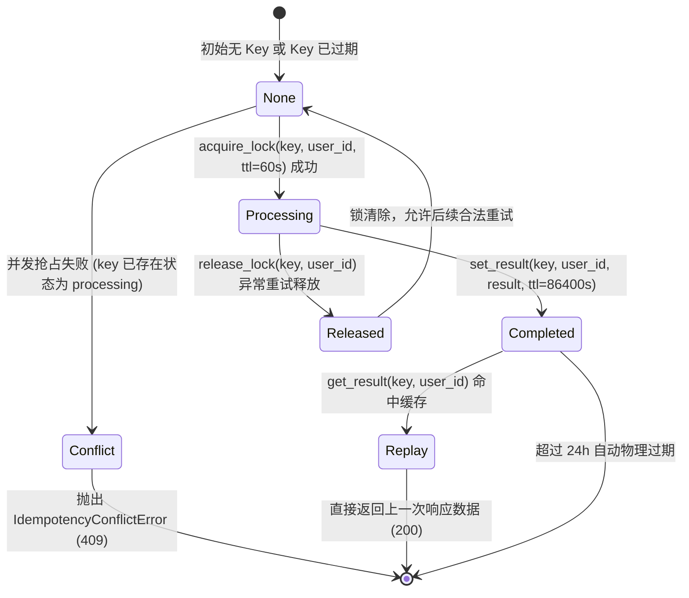
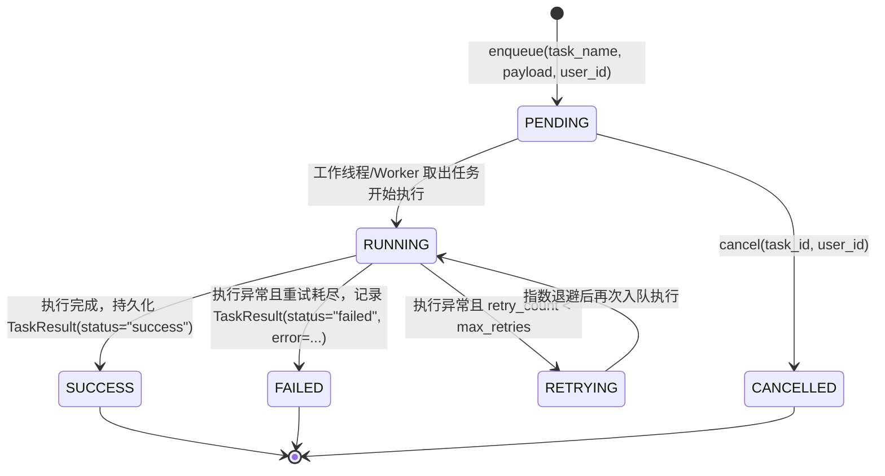

# Spec: 异步任务队列与幂等拦截中间件 - 技术契约

- **关联 Intent**: ZL-118
- **主导设计人**: Dev
- **当前状态**: Draft / In-Review / Approved

---

## 1. 架构流向与设计方案

### 1.1 模块定位与分层边界
本模块位于外部能力适配层（`backend/app/integrations/queue/` 与 `backend/app/integrations/idempotency/`），为上层业务编排层（`app/services`，如 `MaterialService`, `PracticeService`）提供标准化的异步任务排队解耦与分布式幂等锁防重能力：
- **物理路径**:
  - `backend/app/integrations/queue/`: 异步任务队列适配包
  - `backend/app/integrations/idempotency/`: 幂等拦截组件适配包
  - `backend/app/core/errors.py`: 扩充队列与幂等 30015~30018 统一业务异常
- **分层依赖铁律**:
  - 依赖单向向下：适配层仅供 `app/services` 调度使用，**外部适配层严禁反向导入 `app/services`**；
  - 适配层严禁导入数据仓储层 `app/repositories`；
  - 纯函数计算核（`app/core/algorithms/`）严禁导入本模块中的适配器与网络驱动；
  - 路由层（`app/api`）不直接持有队列/幂等连接对象，统一由 Service 层或专用 Fastapi 依赖注入；
  - 必须通过 `python3 tooling/check_layers.py --root backend/app` 静态依赖门禁校验（0 跨层违规）。
- **绝密脱敏与多租户隔离红线**:
  - **多租户强制隔离**: 队列的 `get_status` / `cancel` 以及幂等锁的 `acquire_lock` / `set_result` / `get_result` 强制校验调用方 `user_id`，禁止越权探查或篡改他人任务与幂等快照；
  - **凭据脱敏红线**: 适配器的 `__repr__` / `__str__` 严禁打印 Redis 密码明文或连接 URI（统一输出脱敏格式 `redis://***:6379/...`）；日志严禁输出完整的题目、资料全文及作答原文，仅记录 `task_id`、`user_id`（脱敏前 8 位不可逆哈希）、`key`、耗时与错误码。
- **命名与缩写白名单**:
  - 严格遵守 8 个缩写白名单（`api`, `id`, `url`, `ocr`, `llm`, `db`, `config`, `env`），严禁自造任何缩写（如 msg, q, lock, resp 等需写完整或遵循白名单）。

### 1.2 架构拓扑与交互流向

```mermaid
flowchart TD
    subgraph ClientLayer [客户端接入层]
        Client[小程序 / 前端客户端]
    end

    subgraph ApiLayer [API 路由层: app/api/v1]
        Route[路由控制器: 如 POST /practices/submit]
        AuthDep[鉴权依赖: get_current_user_id]
    end

    subgraph ServiceLayer [业务编排服务层: app/services]
        BizService[业务编排服务: PracticeService / MaterialService]
    end

    subgraph IntegrationsQueue [异步任务适配层: app/integrations/queue]
        QueueProtocol["QueueProtocol (统一协议)"]
        MemoryQueue["MemoryQueueAdapter (内存 Fake / 即时模式 / 零网络单测)"]
        RedisQueue["RedisQueueAdapter (基于 Redis List/Stream)"]
        QueueFactory["create_queue_adapter() 工厂"]
    end

    subgraph IntegrationsIdempotency [幂等防重适配层: app/integrations/idempotency]
        IdempotencyProtocol["IdempotencyProtocol (统一协议)"]
        MemoryIdempotency["MemoryIdempotencyAdapter (内存 Fake / 线程安全 / TTL)"]
        RedisIdempotency["RedisIdempotencyAdapter (Redis SET NX EX / 结果快照)"]
        IdempotencyFactory["create_idempotency_adapter() 工厂"]
    end

    subgraph ExternalInfra [基础设施]
        RedisCluster[(Redis 实例 / 生产存储)]
    end

    Client -->|携带 Authorization & Idempotency-Key| Route
    Route --> AuthDep
    Route --> BizService

    BizService -->|1. acquire_lock(key, user_id)| IdempotencyProtocol
    IdempotencyProtocol -.->|并发中? 抛出 409| Route
    IdempotencyProtocol -.->|已完成? 返回已缓存结果| Route

    BizService -->|2. 未处理则 enqueue(task_name, payload, user_id)| QueueProtocol
    QueueProtocol -->|返回 task_id| BizService

    BizService -->|3. set_result(key, user_id, result)| IdempotencyProtocol
    BizService -.->|业务失败 release_lock(key, user_id)| IdempotencyProtocol

    QueueProtocol <|.. MemoryQueue
    QueueProtocol <|.. RedisQueue
    IdempotencyProtocol <|.. MemoryIdempotency
    IdempotencyProtocol <|.. RedisIdempotency

    RedisQueue --> RedisCluster
    RedisIdempotency --> RedisCluster
```

### 1.3 幂等锁状态机流转 (Idempotency Lifecycle State Machine)



### 1.4 异步任务生命周期流转 (Task Lifecycle State Machine)



---

## 2. API 与数据契约设计

### 2.1 异步任务契约 (`backend/app/integrations/queue/protocol.py`)
```python
from collections.abc import Callable
from dataclasses import dataclass, field
from datetime import datetime, timezone
from typing import Any, Protocol, runtime_checkable


@dataclass(frozen=True)
class TaskMessage:
    """异步任务消息载荷契约（不可变值对象）。"""

    task_id: str
    task_name: str
    payload: dict[str, Any]
    user_id: str
    priority: int = 0
    created_at: datetime = field(
        default_factory=lambda: datetime.now(timezone.utc)
    )

    def __post_init__(self) -> None:
        if not self.task_id or not self.task_id.strip():
            raise ValueError("task_id 不能为空")
        if not self.task_name or not self.task_name.strip():
            raise ValueError("task_name 不能为空")
        if not self.user_id or not self.user_id.strip():
            raise ValueError("user_id 不能为空")
        if self.priority < 0:
            raise ValueError("priority 必须大于等于 0")


@dataclass(frozen=True)
class TaskResult:
    """异步任务执行结果与状态追踪契约。"""

    task_id: str
    status: str  # "pending", "running", "success", "failed", "cancelled"
    result: Any = None
    error: str | None = None
    duration_ms: float = 0.0

    def __post_init__(self) -> None:
        valid_statuses = {"pending", "running", "success", "failed", "cancelled"}
        if self.status not in valid_statuses:
            raise ValueError(f"status '{self.status}' 不合法，可选值: {valid_statuses}")
        if self.duration_ms < 0:
            raise ValueError("duration_ms 不能为负数")


@runtime_checkable
class QueueProtocol(Protocol):
    """异步任务队列统一抽象协议。"""

    def enqueue(
        self,
        task_name: str,
        payload: dict[str, Any],
        user_id: str,
        *,
        task_id: str | None = None,
        delay_seconds: int = 0,
        priority: int = 0,
    ) -> str:
        """任务下发入队。

        Args:
            task_name: 任务名称（如 material_chunking, generate_questions）。
            payload: 任务参数字典。
            user_id: 提交用户/租户 ID（用于隔离保护）。
            task_id: 可选指定任务唯一标识，默认自动生成 UUIDv4。
            delay_seconds: 延迟执行时间（秒），默认 0。
            priority: 优先级，数值越大优先级越高。

        Returns:
            str: 任务唯一标识 task_id。

        Raises:
            QueueError: 入队失败或网络异常。
        """
        ...

    def get_status(self, task_id: str, user_id: str) -> TaskResult | None:
        """查询任务状态与执行结果（严格校验 user_id 租户归属）。

        Args:
            task_id: 任务唯一标识。
            user_id: 当前请求用户 ID。

        Returns:
            TaskResult | None: 任务结果对象，不存在或非本人归属返回 None。

        Raises:
            QueueError: 查询异常。
        """
        ...

    def cancel(self, task_id: str, user_id: str) -> bool:
        """取消处于排队中的任务。

        Args:
            task_id: 任务唯一标识。
            user_id: 当前请求用户 ID。

        Returns:
            bool: 成功取消返回 True；任务不存在、非本人或已进入 running/completed 返回 False。

        Raises:
            QueueError: 取消异常。
        """
        ...
```

### 2.2 幂等拦截契约 (`backend/app/integrations/idempotency/protocol.py`)
```python
from typing import Any, Protocol, runtime_checkable


@runtime_checkable
class IdempotencyProtocol(Protocol):
    """分布式幂等拦截器抽象协议。"""

    def acquire_lock(self, key: str, user_id: str, ttl_seconds: int = 60) -> bool:
        """原子抢占幂等锁。

        Args:
            key: 幂等键（通常为客户端上报的 UUIDv4 或业务唯一定位标识）。
            user_id: 关联租户用户 ID（构建组合命名空间 user:{user_id}:idempotency:{key}）。
            ttl_seconds: 锁最大持有租期（秒），防止节点宕机造成永久死锁，默认 60s。

        Returns:
            bool: 抢占成功返回 True；已被占用返回 False。

        Raises:
            IdempotencyConflictError: 若实现层选择在冲突时直接抛出业务异常。
            IdempotencyKeyInvalidError: 当 key 格式非法或为空时抛出。
        """
        ...

    def set_result(
        self,
        key: str,
        user_id: str,
        response_data: dict[str, Any],
        ttl_seconds: int = 86400,
    ) -> None:
        """持久化保存已完成的响应快照，并释放处理中锁。

        Args:
            key: 幂等键。
            user_id: 租户用户 ID。
            response_data: 待缓存的结构化响应体数据。
            ttl_seconds: 快照保留时长（秒），默认 86400 (24 小时)。

        Raises:
            IdempotencyKeyInvalidError: key 非法。
        """
        ...

    def get_result(self, key: str, user_id: str) -> dict[str, Any] | None:
        """获取已成功完成的幂等请求响应快照（回放）。

        Args:
            key: 幂等键。
            user_id: 租户用户 ID。

        Returns:
            dict[str, Any] | None: 命中的历史响应快照，未完成或不存在时返回 None。
        """
        ...

    def release_lock(self, key: str, user_id: str) -> None:
        """业务执行失败或异常退出时，主动释放正在处理中的幂等锁，允许后续重试。

        Args:
            key: 幂等键。
            user_id: 租户用户 ID。
        """
        ...
```

### 2.3 异常与错误码体系扩展 (`backend/app/core/errors.py`)
在 30xxx 外部能力与网络问题体系下新增 4 个标准异常类：

| 错误类名 | 错误码 (error_code) | HTTP 状态码 | 默认文案 | 触发场景 |
| :--- | :--- | :--- | :--- | :--- |
| `QueueError` | `30015` | `500` | `"异步任务队列服务异常"` | 任务入队失败、底层 Redis 驱动抛错、序列化异常 |
| `QueueTimeoutError` | `30016` | `504` | `"异步任务调度响应超时"` | 任务入队等待连接超时、等待同步执行完成超时 (20s) |
| `IdempotencyConflictError` | `30017` | `409` | `"请求正在并发处理中，请勿重复提交"` | 相同 `Idempotency-Key` 在同一租户下正在处理，未产生最终结果 |
| `IdempotencyKeyInvalidError` | `30018` | `400` | `"幂等键格式不合法"` | 请求头携带的 `Idempotency-Key` 为空、超长 (>128 字符) 或含非法字符 |

---

## 3. 可测性设计 (Design for Testability)

### 3.1 独立纯函数与辅助核 (Pure Functions)
- `validate_idempotency_key(key: str) -> str`: 校验幂等键格式，阻断空白、换行符、超长字符，仅允许安全的字母、数字、连字符、下划线及冒号。
- `build_idempotency_storage_key(user_id: str, key: str) -> str`: 组合生成带租户隔离前缀的缓存 Key。
- `serialize_task_message(message: TaskMessage) -> str` / `deserialize_task_message(data: str) -> TaskMessage`: 纯函数 JSON 编解码。

### 3.2 外部依赖与 Mock / Fake 隔离策略 (Zero Network In Unit Tests)
- `conftest.py` 中已配置网络阻断 Fixture，严禁在自动化单元测试中发起真实 Redis 外部网络连接。
- `MemoryQueueAdapter`:
  - 纯内存线程安全实现 (`threading.Lock` 保护 `_queue`, `_task_store`)；
  - 提供 `immediate_mode=True`（任务入队后由注册的 Handler 或同步返回直接标为 success，单测毫秒级断言）；
  - 提供 `register_handler(task_name, callable)` 用于单元测试挂载特定纯函数工作流；
  - 提供 `set_fault_injection(operation, exception)` 模拟 Redis 断开、磁盘写满等故障；
  - 提供 `set_latency(seconds)` 模拟调度延迟与超时测试。
- `MemoryIdempotencyAdapter`:
  - 纯内存模拟键值对与锁状态字典；
  - 字典格式: `_locks: dict[str, float]` (记录过期绝对时间戳), `_results: dict[str, tuple[dict[str, Any], float]]`；
  - 并发测试：利用 `concurrent.futures.ThreadPoolExecutor(max_workers=20)` 发起 50 次并发抢占，验证**有且仅有 1 次抢占成功，其余 49 次精准返回 False 或 409**。
- `RedisQueueAdapter` / `RedisIdempotencyAdapter`:
  - 运行时支持依赖注入 `redis_client=MagicMock()` 测试分支转译与 ClientError 处理；
  - 延迟导入 `redis` 模块，缺失时安全转译为 `QueueError` 或 `AppError`。

---

## 4. 替代方案与权衡考量 (Alternatives Considered & Trade-offs)

### 4.1 任务队列选型
- **评估方案 A: Celery + RabbitMQ / Redis**
  - *未采纳原因*: 重量级框架，学习曲线陡峭，依赖复杂配置、多进程 Worker 守护进程与序列化协议；智练当前处于核心 MVP 演化阶段，各环境轻量交付与全量自动化测试（零外部依赖）诉求强烈；
- **评估方案 B: 业务数据库 PostgreSQL SKIP LOCKED 表排队**
  - *未采纳原因*: 高频状态心跳与任务出入队会对核心数据库产生行级写放大与死锁隐患，且无法支持纯内存 0 依赖单元测试；
- **采纳方案: 适配器模式 (QueueProtocol + Memory / Redis)**
  - *权衡分析*: 既保障单测零网络 100% 极速执行，又为未来平滑对接 Redis Stream 或独立 Worker 预留完全解耦的抽象契约。

### 4.2 幂等拦截方案
- **评估方案 A: 仅在前端通过按钮 Disabled 防抖防重**
  - *未采纳原因*: 无法防御网络超时客户端自动重试、弱网并发包重发或恶意脚本直接调用接口；
- **评估方案 B: 数据库唯一复合索引 (Unique Constraint)**
  - *未采纳原因*: 仅能拦截插入冲突，无法缓存处理中的状态，无法在并发发生时即时返回友好 409，且异常回滚无法平滑回放历史响应结果；
- **采纳方案: 分布式原子锁 + 响应快照回放 (IdempotencyProtocol + Memory / Redis)**
  - *权衡分析*: 标准工业级方案，实现原子抢占（SET NX EX）、中途失败主动释放、成功时 24h 响应快照回放，兼顾并发安全与用户体验。

---

## 5. 动态风险核验与回滚预案 (Risk & Rollback Verification)

* [x] **Files**: 严格限制在 `backend/app/integrations/queue/`, `backend/app/integrations/idempotency/`, `backend/app/core/errors.py` 与 `backend/tests/` 目录，无越权修改；
* [x] **API**: 不变更既有任何公共 API 契约，新增错误码 30015~30018 为向后兼容扩充；
* [x] **Schema**: 零数据库迁移变更（无 Alembic migration），不影响现有表；
* [x] **Auth**: 严格要求 `user_id` 鉴权上下文绑定，防止跨租户越权查询任务状态或盗用幂等结果；
* [x] **Deps**: 采用标准库 (`threading`, `uuid`, `dataclasses`, `datetime`, `json`) + 延迟加载可选 `redis`，不强制引入破坏性重型依赖；
* [x] **Migration / Rollback**: 纯新增适配器与抽象，若出现异常可直接切回 `Memory` 适配器或通过工厂参数禁用，具备极低回滚成本（秒级代码回滚或配置变更）；
* [x] **Blast Radius**: 局限于适配层基础建设，未直接修改现有业务 Service 运行时，对全量用户主链 0 破坏；
* [x] **Tier 准确性确认**: 变更范围为新增独立适配模块与错误码扩展，无全局装配重构，准确评级为 **Tier 2**。

### 5.1 回滚与故障应急策略
1. 若 Redis 队列或幂等实例网络中断：
   - 适配器捕获连接异常，若配置开启了降级容灾开关（`fallback_on_error=True`），可降级为直通放行并记录 Warning 日志；
2. 若幂等 Key 产生死锁：
   - 所有锁均强制配置 `ttl_seconds=60`（最大 300s），超时由 Redis/内存定时器自动回收，避免永久阻塞。

---

## 6. 阶段准出签批 (Gate 2 Sign-off)
- [x] 架构流向与 API 契约已冻结
- [x] 替代方案已完成推演与权衡
- [x] 7 维风险已核验且具备明确回滚预案
- **审查结论**: Approved
- **签批人 / 日期**: Dev (Planner) / 2026-09-24 08:25

---

## 6. 阶段准出签批 (Gate 2 Sign-off)
- [ ] 架构流向与 API 契约已冻结
- [ ] 替代方案已完成推演与权衡
- [ ] 7 维风险已核验且具备明确回滚预案
- **审查结论**: Pending
- **签批人 / 日期**: [待人类签批] / 2026-09-24 08:23
