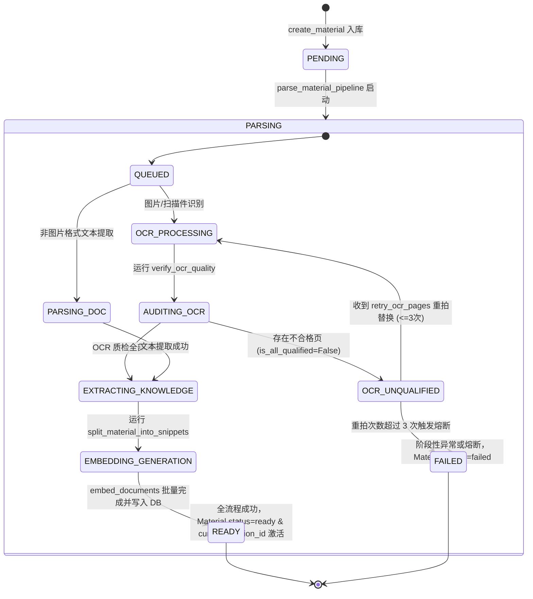

# Spec: 资料导入、多版本管理与解析调度服务 - 技术契约

- **关联 Intent**: ZL-119
- **主导设计人**: Dev
- **当前状态**: In-Review

---

## 1. 架构流向与设计方案

### 1.1 模块定位与分层边界
本模块位于业务编排服务层（`backend/app/services/material.py`）与数据仓储层（`backend/app/repositories/material.py`），负责将底层数据模型（ZL-104）、纯函数算法核（ZL-107 分块切分、ZL-108 OCR 门禁）与外部能力适配层（ZL-114 对象存储、ZL-115 OCR 识别、ZL-116 向量化嵌入、ZL-118 任务队列与幂等拦截）编排为完整的业务流水线：
- **物理路径与分层职责**:
  - `backend/app/repositories/material.py` (`MaterialRepository`): 封装针对 `materials`, `material_versions`, `material_snippets`, `material_ocr_pages` 的数据库交互。**全仓储方法强制要求 `user_id` 参数并作为 SQL 过滤条件，严格阻断水平越权**；严禁导入 `fastapi` 与 `app/integrations`；
  - `backend/app/services/material.py` (`MaterialService`): **全系统唯一允许开启数据库事务的层**。负责编排事务边界、魔数格式预检、MinIO 隔离存取、任务队列异步调度、OCR 逐页门禁与重拍熔断、纯函数分块及批量向量化入库；
  - `backend/app/core/errors.py`: 扩充 40001 (资料不达标/格式错误/大小超限)、40002 (重拍次数超限熔断)、40003 (资料解析处理失败) 统一业务异常；
- **分层依赖与代码规范铁律**:
  - 单向依赖：`app/services` $\rightarrow$ `app/repositories`，仓储层只面向 SQLAlchemy 会话与原生实体，不反向依赖服务层；
  - 纯函数计算核隔离：`app/core/algorithms/` 保持 100% 纯函数，严禁被注入任何 I/O、DB 会话或网络驱动；
  - 缩写白名单：严格遵守 8 个白名单（`api`, `id`, `url`, `ocr`, `llm`, `db`, `config`, `env`），内部变量与方法名严禁使用非白名单缩写；
  - 日志绝密脱敏红线：结构化日志输出严格遵循 8 要素，绝禁向日志打印资料全文、OCR 识别明文、作答原文或存储凭据，用户标识统一使用 `generate_user_ref(user_id)` 8 位脱敏哈希。

### 1.2 架构拓扑与交互数据流向

```mermaid
flowchart TD
    subgraph Client [接入客户端 / 小程序]
        UserApp[小程序端 / 路由控制器]
    end

    subgraph ServiceLayer [业务编排服务层: MaterialService]
        CreateMaterial["create_material(user_id, title, format, ...)"]
        ParsePipeline["parse_material_pipeline(material_id, version_id, user_id)"]
        RetryOCR["retry_ocr_pages(material_id, version_id, user_id, replaces)"]
        DeleteService["soft_delete / hard_delete_material"]
    end

    subgraph RepoLayer [数据仓储层: MaterialRepository]
        MaterialCRUD["Material CRUD (强制 user_id 隔离)"]
        VersionCRUD["MaterialVersion CRUD"]
        SnippetCRUD["MaterialSnippet 批量写入 / 覆盖删除"]
        OCRPageCRUD["MaterialOCRPage CRUD & 逐页替换"]
    end

    subgraph PureAlgorithms [纯函数计算核: app/core/algorithms]
        ChunkingKernel["split_material_into_snippets (ZL-107)"]
        OCRGateKernel["verify_ocr_quality (ZL-108)"]
    end

    subgraph Integrations [外部能力适配层: app/integrations]
        StorageAdapter["StorageProtocol (MinIO/S3 - ZL-114)"]
        OCRAdapter["OCRProtocol (Tencent OCR - ZL-115)"]
        EmbeddingAdapter["EmbeddingProtocol (1024维向量 - ZL-116)"]
        QueueAdapter["QueueProtocol (异步排队 - ZL-118)"]
        IdempotencyAdapter["IdempotencyProtocol (分布式防重 - ZL-118)"]
    end

    subgraph Database [PostgreSQL 16 + pgvector]
        DB[(DB Tables + HNSW Index)]
    end

    UserApp -->|1. 上传文件请求 (带可选 Idempotency-Key)| CreateMaterial
    CreateMaterial -->|校验防重| IdempotencyAdapter
    CreateMaterial -->|计算 SHA-256 查重秒传| RepoLayer
    CreateMaterial -->|写入文件| StorageAdapter
    CreateMaterial -->|创建 Material & Version 记录| RepoLayer
    CreateMaterial -->|派发异步解析任务| QueueAdapter

    QueueAdapter -.->| Worker / 即时调度 | ParsePipeline
    ParsePipeline -->|读取文件内容| StorageAdapter
    ParsePipeline -->|图片格式 / 扫描件提取| OCRAdapter
    ParsePipeline -->|逐页质检门禁| OCRGateKernel
    OCRGateKernel -.->|未达标| RepoLayer
    ParsePipeline -->|纯文本/门禁通过文本分块| ChunkingKernel
    ParsePipeline -->|批量 1024 维向量编码| EmbeddingAdapter
    ParsePipeline -->|事务写入切片与向量并激活版本| RepoLayer

    UserApp -->|重拍不合格页| RetryOCR
    RetryOCR -->|单页重识| OCRAdapter
    RetryOCR -->|重新质检 / 检查 <=3 次熔断| OCRGateKernel
    RetryOCR -->|更新页记录 / 达到全合格触发重切片| ParsePipeline

    UserApp -->|软/硬删除| DeleteService
    DeleteService -->|清理 DB 记录| RepoLayer
    DeleteService -->|清理 MinIO 文件| StorageAdapter

    RepoLayer --> DB
```

### 1.3 资料生命周期与细粒度解析状态机 (Lifecycle & Parse State Machine)



---

## 2. API 与数据契约设计

### 2.1 仓储层契约 (`backend/app/repositories/material.py`)
```python
from collections.abc import Sequence
import uuid
from typing import Any
from sqlalchemy.orm import Session
from app.models.material import Material, MaterialVersion, MaterialSnippet, MaterialOCRPage

class MaterialRepository:
    """学习资料领域数据仓储。
    
    铁律：所有涉及数据检索与变更的方法强制携带 user_id 参数，严格阻断水平越权。
    严禁导入 fastapi 与 app.integrations。
    """
    def __init__(self, session: Session) -> None:
        self.session = session

    # --- Material 主表操作 ---
    def create_material(
        self,
        *,
        user_id: uuid.UUID,
        title: str,
        file_format: str,
        file_size: int,
        source_type: str = "local",
    ) -> Material: ...

    def get_material_by_id(
        self,
        material_id: uuid.UUID,
        user_id: uuid.UUID,
        *,
        include_deleted: bool = False,
    ) -> Material | None: ...

    def list_materials_by_user(
        self,
        user_id: uuid.UUID,
        *,
        is_deleted: bool = False,
        limit: int = 20,
        offset: int = 0,
    ) -> tuple[Sequence[Material], int]: ...

    def update_material_status(
        self,
        material_id: uuid.UUID,
        user_id: uuid.UUID,
        status: str,
        *,
        current_version_id: uuid.UUID | None = None,
    ) -> bool: ...

    def soft_delete_material(self, material_id: uuid.UUID, user_id: uuid.UUID) -> bool: ...

    def hard_delete_material(self, material_id: uuid.UUID, user_id: uuid.UUID) -> bool: ...

    # --- MaterialVersion 版本表操作 ---
    def create_version(
        self,
        *,
        user_id: uuid.UUID,
        material_id: uuid.UUID,
        version_number: int,
        storage_key: str,
        content_hash: str,
        raw_text_storage_key: str | None = None,
    ) -> MaterialVersion: ...

    def get_version_by_id(
        self,
        version_id: uuid.UUID,
        user_id: uuid.UUID,
    ) -> MaterialVersion | None: ...

    def get_latest_version_by_hash(
        self,
        user_id: uuid.UUID,
        content_hash: str,
    ) -> MaterialVersion | None: ...

    def update_version_status(
        self,
        version_id: uuid.UUID,
        user_id: uuid.UUID,
        parse_status: str,
        *,
        failed_stage: str | None = None,
        error_message: str | None = None,
        raw_text_storage_key: str | None = None,
        is_active: bool | None = None,
    ) -> bool: ...

    # --- MaterialSnippet 切片表操作 ---
    def bulk_create_snippets(
        self,
        snippets: Sequence[dict[str, Any]],
        user_id: uuid.UUID,
    ) -> int: ...

    def list_snippets_by_version(
        self,
        version_id: uuid.UUID,
        user_id: uuid.UUID,
    ) -> Sequence[MaterialSnippet]: ...

    def delete_snippets_by_version(
        self,
        version_id: uuid.UUID,
        user_id: uuid.UUID,
    ) -> int: ...

    # --- MaterialOCRPage OCR页表操作 ---
    def bulk_create_ocr_pages(
        self,
        pages: Sequence[dict[str, Any]],
        user_id: uuid.UUID,
    ) -> int: ...

    def get_ocr_page(
        self,
        version_id: uuid.UUID,
        page_number: int,
        user_id: uuid.UUID,
    ) -> MaterialOCRPage | None: ...

    def list_ocr_pages_by_version(
        self,
        version_id: uuid.UUID,
        user_id: uuid.UUID,
    ) -> Sequence[MaterialOCRPage]: ...

    def update_ocr_page_result(
        self,
        page_id: uuid.UUID,
        user_id: uuid.UUID,
        *,
        raw_text: str,
        gibberish_ratio: float,
        valid_char_count: int,
        is_qualified: bool,
        unqualified_reason: str | None,
        reshoot_count: int,
        image_storage_key: str | None = None,
    ) -> bool: ...
```

### 2.2 服务编排层契约 (`backend/app/services/material.py`)
```python
from collections.abc import Sequence
import uuid
from typing import Any
from sqlalchemy.orm import Session
from app.models.material import Material, MaterialVersion
from app.integrations.storage.protocol import StorageProtocol
from app.integrations.ocr.protocol import OCRProtocol
from app.integrations.embedding.protocol import EmbeddingProtocol
from app.integrations.queue.protocol import QueueProtocol
from app.integrations.idempotency.protocol import IdempotencyProtocol

class MaterialService:
    """学习资料领域服务编排。
    
    全系统唯一允许开启数据库事务的层，负责编排各外设与纯函数计算核。
    """
    def __init__(
        self,
        session: Session,
        storage_adapter: StorageProtocol,
        ocr_adapter: OCRProtocol,
        embedding_adapter: EmbeddingProtocol,
        queue_adapter: QueueProtocol,
        idempotency_adapter: IdempotencyProtocol | None = None,
    ) -> None:
        self.session = session
        self.storage = storage_adapter
        self.ocr = ocr_adapter
        self.embedding = embedding_adapter
        self.queue = queue_adapter
        self.idempotency = idempotency_adapter

    def create_material(
        self,
        *,
        user_id: uuid.UUID,
        title: str,
        file_format: str,
        file_size: int,
        file_content: bytes,
        source_type: str = "local",
        idempotency_key: str | None = None,
    ) -> Material:
        """上传创建资料：魔数校验、查重秒传、MinIO隔离写入、创建版本并调度异步解析。"""
        ...

    def parse_material_pipeline(
        self,
        *,
        material_id: uuid.UUID,
        version_id: uuid.UUID,
        user_id: uuid.UUID,
    ) -> MaterialVersion:
        """异步/同步资料解析调度流水线主入口。"""
        ...

    def retry_ocr_pages(
        self,
        *,
        material_id: uuid.UUID,
        version_id: uuid.UUID,
        user_id: uuid.UUID,
        page_replaces: dict[int, bytes],
    ) -> MaterialVersion:
        """逐页重拍替换：单页重识、门禁评估、递增重拍计数、超3次熔断保护。"""
        ...

    def get_material(
        self,
        *,
        material_id: uuid.UUID,
        user_id: uuid.UUID,
    ) -> Material:
        """查询资料及激活版本详情（阻断跨租户越权）。"""
        ...

    def list_materials(
        self,
        *,
        user_id: uuid.UUID,
        is_deleted: bool = False,
        limit: int = 20,
        offset: int = 0,
    ) -> tuple[Sequence[Material], int]:
        """分页获取用户所属资料列表。"""
        ...

    def soft_delete_material(
        self,
        *,
        material_id: uuid.UUID,
        user_id: uuid.UUID,
    ) -> bool:
        """软删除资料：标记 is_deleted=True，不破坏历史练习记录。"""
        ...

    def hard_delete_material(
        self,
        *,
        material_id: uuid.UUID,
        user_id: uuid.UUID,
    ) -> bool:
        """物理级联销毁资料：删除切片、版本、OCR页、资料表记录及 MinIO 对象存储文件。"""
        ...
```

### 2.3 文件格式魔数与大小限制规范 (Magic Numbers & Constraints)
支持格式与魔数映射字典常量（定义于 `app/services/material.py`）：
- **PDF**: `%PDF-` (`bytes: [0x25, 0x50, 0x44, 0x46, 0x2D]`)
- **DOCX / PPTX**: `PK\x03\x04` (`bytes: [0x50, 0x4B, 0x03, 0x04]`)
- **PNG**: `\x89PNG\r\n\x1a\n` (`bytes: [0x89, 0x50, 0x4E, 0x47, 0x0D, 0x0A, 0x1A, 0x0A]`)
- **JPEG / JPG**: `\xFF\xD8\xFF` (`bytes: [0xFF, 0xD8, 0xFF]`)
- **TXT / MD**: 纯文本格式允许 UTF-8 / ASCII 可解码字符验证（尝试 decode utf-8，并校验控制字符占比）
- **大小门限**:
  - 文档类 (PDF, DOCX, PPTX): 最大 `20 * 1024 * 1024` 字节 (20MB)
  - 图片类 (PNG, JPG): 最大 `10 * 1024 * 1024` 字节 (10MB)
  - 纯文本类 (TXT, MD): 最大 `5 * 1024 * 1024` 字节 (5MB)
- **MinIO 隔离路径规范**:
  - 原始文件: `users/{user_id}/materials/{material_id}/v{version_number}/{content_hash[:16]}.{ext}`
  - OCR 切图: `users/{user_id}/materials/{material_id}/v{version_number}/pages/page_{page_num}.png`
  - 提取纯文本: `users/{user_id}/materials/{material_id}/v{version_number}/raw_text.txt`

### 2.4 统一业务异常体系扩充 (`app/core/errors.py`)
在 40xxx 算法与质量门禁及业务处理体系中登记新增异常类：

| 异常类名 | error_code | HTTP Code | 默认文案 | 触发场景 |
| :--- | :--- | :--- | :--- | :--- |
| `MaterialInvalidError` | `40001` | `400` | `"学习资料格式不合法或内容不达标"` | 魔数不匹配、文件损坏、超大超限、非空文档切分出 0 切片 |
| `OCRReshootExceededError` | `40002` | `400` | `"页面重拍次数已达上限熔断，请重新上传清晰文件"` | 某页 `reshoot_count >= 3` 且仍未达到质检合格标准 |
| `MaterialParseError` | `40003` | `500` | `"学习资料解析处理失败"` | 解析流水线执行过程中捕获底层提取异常或状态机死锁 |
| `MaterialNotFoundError` | `40004` | `404` | `"请求的学习资料不存在或已被删除"` | 查询资料 `material_id` 不存在或已被软删除 |

---

## 3. 可测性设计 (Design for Testability)

### 3.1 独立纯函数计算核
- `validate_file_magic(content: bytes, declared_format: str) -> bool`:
  - 校验给定二进制前缀是否与声明格式魔数严格匹配；纯函数，无任何外部 I/O。
- `extract_text_from_raw_content(content: bytes, file_format: str) -> list[str]`:
  - 将原生文件提取为段落字符串序列。针对 TXT/MD 使用纯 UTF-8 解析；针对测试环境预留标准化 Mock/Fake 提取器，避免重型 C 依赖。
- `build_material_storage_key(user_id: uuid.UUID, material_id: uuid.UUID, version_number: int, content_hash: str, ext: str) -> str`:
  - 确定性生成多租户对象存储 Key 路径。

### 3.2 外部依赖与 Mock/Fake 隔离策略 (Zero Network Redline)
- 单元测试与集成测试严格依托已有适配器 Fake 集合：
  - `MemoryStorageAdapter`: 内存模拟 MinIO 对象读写与删除；
  - `FakeOCRAdapter`: 支持注入多页识别结果、延迟与异常；
  - `FakeEmbeddingAdapter`: 固定返回 1024 维全 0.01 向量；
  - `MemoryQueueAdapter(immediate_mode=True)`: 任务入队即时同步执行，保证单元测试毫秒级闭环；
  - `MemoryIdempotencyAdapter`: 内存模拟原子锁与快照回放；
- 数据库层：使用 SQLite 内存库 (`sqlite:///:memory:`)，结合 `with_variant(JSON, "sqlite")` 兼容 pgvector 向量存储。

---

## 4. 替代方案与权衡考量 (Alternatives Considered & Trade-offs)

### 4.1 资料版本更新模型
- **评估方案 A: 原地覆盖更新 (In-place overwrite)**
  - *未采纳原因*: 破坏已产生的历史答卷、练习作答溯源及错题本关联，直接违反《LEADER_ALIGNMENT.md》技术决策 2；
- **采纳方案: 递增独立版本快照 (`MaterialVersion` + 独立 `MaterialSnippet`)**
  - *权衡分析*: 每次上传或内容变更生成新版本 (`version_number += 1`)，旧版本的切片与向量永久固化，历史答卷完全不受影响；当前激活版本指向最新通过的 Version。

### 4.2 OCR 质量不达标阻断机制
- **评估方案 A: 只要有 1 页不合格直接整体抛错失败并丢弃全部数据**
  - *未采纳原因*: 用户体验极差，长达 20 页的文档仅因 1 页折角就需要全部重新拍摄；
- **采纳方案: 逐页持久化与就地重拍熔断 (FR-08, FR-09)**
  - *权衡分析*: 批次通过的页保留文本，未通过页前端标黄并提供就地替换重拍；通过 `reshoot_count` 跟踪单页重试，上限 3 次触发 `40002` 熔断，兼顾易用性与计算成本防刷。

---

## 5. 动态风险核验与回滚预案 (Risk & Rollback Verification)

* [x] **Files**: 涉及 `backend/app/repositories/material.py` (New), `backend/app/services/material.py` (New), `backend/app/core/errors.py` (Modify), 以及对应 `tests/unit/` 测试集，无越权污染；
* [x] **API**: 为 Service 层内部技术契约，为后续 ZL-127 路由提供坚实基础，不破坏既有 HTTP 契约；
* [x] **Schema**: 完全复用 ZL-104 已冻结的 4 张表实体，无需额外 DDL 迁移；
* [x] **Auth & Security**: 仓储层与服务层所有核心入口均强制注入 `user_id`，查询强制增加租户过滤，绝密脱敏 8 要素彻底落地；
* [x] **Dependencies**: 零新增外部三方库依赖，完全复用标准库与当前已就绪的 Protocol 适配层；
* [x] **Migration & Rollback**: 纯业务服务与仓储层实现，如遇严重 Bug，可通过 Git 秒级 Revert 源码，旧数据依然兼容；
* [x] **Blast Radius**: 局限于资料域服务与仓储，不影响已有的用户鉴权与练习纯函数模块；
* [x] **Tier 3 确认**: 涉及跨对象存储、OCR、向量、异步队列与幂等 5 大外部适配器编排，属于高复杂度流水线，准确评级为 **Tier 3**。

### 5.1 回滚与故障应急策略
1. 若 MinIO 存储服务瞬时故障：
   - 事务保证：文件写入失败时，数据库事务尚未提交，不残留脏数据记录；
2. 若异步解析队列堵塞：
   - 支持 Service 提供同步直接解析模式（通过工厂或配置降级），保障关键单机或离线场景正常运行；
3. 若发生越权检测异常：
   - 仓储层 `get_material_by_id` 统一对 `user_id` 做严格相等过滤，查询不到立即抛出 `MaterialNotFoundError` 或 `PermissionDeniedError`。

---

## 6. 阶段准出签批 (Gate 2 Sign-off)
- [ ] 架构流向与 API 契约已冻结
- [ ] 替代方案已完成推演与权衡
- [ ] 7 维风险已核验且具备明确回滚预案
- **审查结论**: Pending
- **签批人 / 日期**: [待人类签批] / 2026-09-24 08:52
