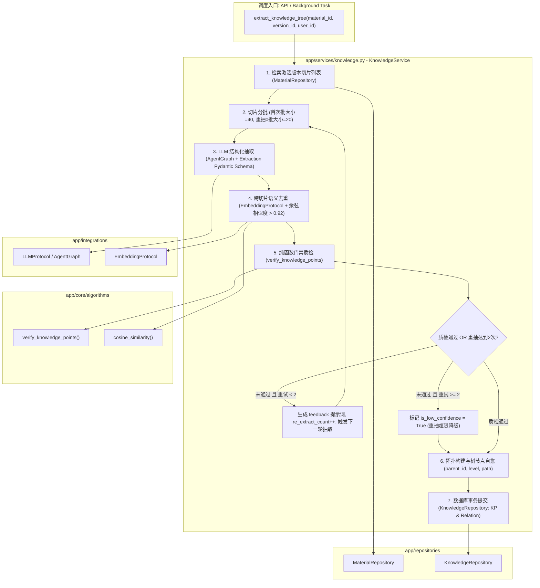

# Spec: 知识点抽取建树与质检重抽服务 - 技术契约

- **关联 Intent**: ZL-120
- **主导设计人**: Dev
- **当前状态**: Draft / In-Review / Approved

---

## 1. 架构流向与设计方案

`KnowledgeService` 遵循智练五层架构规范，处于 `app/services` 层。作为全系统唯一开启数据库事务的编排者，协调 `MaterialRepository` 读取切片、`EmbeddingProtocol` 计算知识点语义向量、`LLMProtocol` 与 `AgentGraph` 执行结构化抽取、纯函数算法 `verify_knowledge_points` 进行四项一票否决式质检，以及 `KnowledgeRepository` 进行数据库写入。



### 核心编排状态流转说明：
1. **输入前置检查**：校验 `material_id`、`version_id` 存在性及归属（`user_id` 校验，未通过抛出 `MaterialNotFoundError`）；获取切片列表，若切片为空则抛出 `MaterialInvalidError`；
2. **切片分批与抽取上下文**：
   - 默认单批次切片数量 $N = 40$；若当前为重抽轮次 0（首次重抽），按质检规则将批次大小调整为 $N = 20$；
   - 提取统计数据：`effective_chars`、`chapter_stats`（各章节切片数与占比）；
3. **结构化抽取**：
   - 构造上下文 Prompt（切片序号、章节、正文片段），结合当前轮次的 `prompt_feedback`；
   - 调用 `run_structured_agent_workflow`，返回 `RawExtractionResult`（包含知识点候选列表、层级结构或父子引用、章节归属、来源切片序号映射）；
4. **跨切片语义去重与来源合并**：
   - 对抽取出的所有知识点名称/摘要，调用 `EmbeddingProtocol.embed_documents` 批量生成 1024 维向量；
   - 两两计算 `cosine_similarity`；若余弦相似度 $> 0.92$，判定为同义重复知识点，执行合并：保留名称更简洁规范者，并聚合双方的来源 `snippet_ids`；
5. **门禁质检验证**：
   - 将去重后的候选知识点构造成 `CandidateKnowledgePoint` 列表；
   - 调用纯函数 `verify_knowledge_points(knowledge_points, context, config)`；
   - 若 `report.is_qualified == True`，质检通过；
   - 若不合格且 `re_extract_count < 2`：生成 `report.prompt_feedback`，自适应调整抽取参数，进入下一轮重抽循环；
   - 若不合格且 `re_extract_count >= 2`：触发熔断降级，保留当前最新候选结果，并在知识点实体中标记 `is_low_confidence = True`；
6. **知识树拓扑构建与层级自愈**：
   - 解析节点引用：根节点 `parent_id = None, level = 1`；子节点根据名称引用找到对应的父节点 UUID，设置 `parent_id = parent.id, level = parent.level + 1`；
   - 孤儿节点自愈：若子节点引用的父节点不存在，或者形成环形引用，自动降级为根节点（`level = 1`）或挂在对应章节首节点之下，确保深度严格符合 $2 \sim 5$ 级；
7. **事务性落库**：
   - 开启单次数据库事务，清理该版本历史残留的知识点及关联关系；
   - 批量插入 `KnowledgePoint` 与 `KnowledgePointSnippet` 关联记录；
   - 更新版本解析状态 `ParseStatus.AUDITING_KNOWLEDGE` -> `ParseStatus.READY`；
   - 提交事务并输出 8 要素脱敏日志。

---

## 2. API 与数据契约设计

### 2.1 结构化 LLM 提取 DTO (Pydantic Models)

```python
class ExtractedKnowledgeItem(BaseModel):
    """大模型抽取的单个知识点 DTO。"""
    temp_id: str = Field(description="临时标识符，用于建立父子层级关系，例如 kp_1")
    parent_temp_id: str | None = Field(default=None, description="父知识点临时标识符，根节点为 None")
    name: str = Field(description="知识点名称，2~30 字符，严禁数字编号与占位词")
    description: str = Field(default="", description="知识点概念简述与核心考点")
    level: int = Field(default=1, ge=1, le=5, description="知识点层级深度 1~5")
    chapter_title: str = Field(default="", description="归属章节名称")
    source_snippet_indices: list[int] = Field(default_factory=list, description="来源片段序号列表")

class KnowledgeExtractionOutput(BaseModel):
    """大模型批次知识点抽取输出 DTO。"""
    knowledge_points: list[ExtractedKnowledgeItem] = Field(default_factory=list)
```

### 2.2 仓储层契约 (`KnowledgeRepository`)

```python
class KnowledgeRepository:
    def __init__(self, session: Session) -> None: ...

    def create_knowledge_points(
        self,
        points: Sequence[KnowledgePoint],
        user_id: uuid.UUID,
    ) -> list[KnowledgePoint]:
        """批量创建知识点记录。强制带 user_id 租户校验。"""
        ...

    def create_knowledge_point_snippets(
        self,
        mappings: Sequence[KnowledgePointSnippet],
        user_id: uuid.UUID,
    ) -> list[KnowledgePointSnippet]:
        """批量建立知识点与切片双向溯源关联。"""
        ...

    def get_knowledge_points_by_version(
        self,
        material_id: uuid.UUID,
        version_id: uuid.UUID,
        user_id: uuid.UUID,
    ) -> list[KnowledgePoint]:
        """按版本与用户获取全部知识点列表，默认按拓扑层级递增排序。"""
        ...

    def get_knowledge_point_by_id(
        self,
        knowledge_point_id: uuid.UUID,
        user_id: uuid.UUID,
    ) -> KnowledgePoint | None:
        """按 ID 查询单个知识点（租户隔离）。"""
        ...

    def get_snippets_by_knowledge_point(
        self,
        knowledge_point_id: uuid.UUID,
        user_id: uuid.UUID,
    ) -> list[MaterialSnippet]:
        """反向溯源：通过知识点查询关联的所有来源切片。"""
        ...

    def get_knowledge_points_by_snippet(
        self,
        snippet_id: uuid.UUID,
        user_id: uuid.UUID,
    ) -> list[KnowledgePoint]:
        """正向溯源：通过切片查询关联的所有知识点。"""
        ...

    def delete_knowledge_points_by_version(
        self,
        material_id: uuid.UUID,
        version_id: uuid.UUID,
        user_id: uuid.UUID,
    ) -> int:
        """级联清除指定资料版本的全部知识点及关联映射。"""
        ...
```

### 2.3 服务层契约 (`KnowledgeService`)

```python
class KnowledgeService:
    def __init__(
        self,
        session: Session,
        llm: LLMProtocol,
        embedding: EmbeddingProtocol,
    ) -> None: ...

    def extract_and_build_knowledge_tree(
        self,
        *,
        material_id: uuid.UUID,
        version_id: uuid.UUID,
        user_id: uuid.UUID,
        batch_size: int = 40,
    ) -> list[KnowledgePoint]:
        """端到端编排切片批次抽取、余弦去重、门禁质检、熔断重抽与建树落库。"""
        ...

    def get_knowledge_tree(
        self,
        *,
        material_id: uuid.UUID,
        version_id: uuid.UUID,
        user_id: uuid.UUID,
    ) -> list[dict[str, Any]]:
        """获取结构化嵌套的树形拓扑结构。"""
        ...
```

### 2.4 统一错误码扩展 (`app/core/errors.py`)
- `KnowledgePointQualityError` (40005, HTTP 400): 知识点质检门禁严重拦截；
- `KnowledgeExtractionRetryExceededError` (40006, HTTP 500): 知识点抽取内部异常耗尽重试；
- `KnowledgeNotFoundError` (40007, HTTP 404): 请求的知识点不存在或无权访问。

---

## 3. 可测性设计 (Design for Testability)

### 3.1 独立纯函数计算核
1. `backend/app/core/algorithms/knowledge_quality.py`: `verify_knowledge_points`、`check_quantity_range`、`check_hierarchy_depth`、`check_naming_readability`、`check_chapter_coverage`；
2. `backend/app/core/algorithms/search.py`: `cosine_similarity`；
3. `deduplicate_candidate_points`: 服务层内部实现的纯数据结构去重函数，接收候选知识点列表与向量序列，返回去重并合并切片引用的纯数据结构；
4. `assemble_tree_hierarchy`: 纯逻辑拓扑解析与环形自愈函数，输入扁平节点字典，解析为具备合法 `parent_id` 与 `level (1~5)` 的树结构。

### 3.2 外部依赖与 Mock 策略
- **数据库**：使用 SQLite In-Memory 数据库（`sqlite:///:memory:`），验证真实 SQLAlchemy Session 事务与唯一约束；
- **大模型 (LLM)**：使用 `FakeLLMAdapter`，预设合规 JSON 返回、残缺 JSON（触发 StateGraph 自愈）、以及违规占位词/深度超限输出（验证重抽与降级标记）；严禁任何外部网络连接；
- **向量化 (Embedding)**：使用 `FakeEmbeddingAdapter`，支持根据文本生成确定性或控制余弦相似度（如构造相似度 0.95 和 0.80 的向量对），精准测试去重合并分支；
- **耗时**：全套单测在 2 秒内完成，无等待睡眠。

---

## 4. 替代方案与权衡考量 (Alternatives Considered & Trade-offs)

### 方案 A：全量片段一次性 Prompt 输入大模型
- **优势**：大模型具备全局视野，一次性直接输出完整知识树；
- **缺陷**：大资料可能包含数百个切片（数万字），远超上下文窗口，易发生注意力分散、末尾严重遗漏或输出截断。
- **结论**：否决。采用 PRD 规定的分批抽取（默认 40 片段，重抽 20 片段）结合跨批语义去重。

### 方案 B：由数据库 pgvector 实时计算相似度做去重
- **优势**：利用 PostgreSQL 向量索引计算；
- **缺陷**：候选知识点尚未入库（质检通过前不应产生持久化垃圾数据），若写入临时表开销大且破坏事务清晰性。
- **结论**：采纳在内存中基于 `EmbeddingProtocol` 生成向量并调用纯函数 `cosine_similarity` 矩阵比对去重（知识点总数 <= 200，内存计算仅需几毫秒），质检通过后再执行批量数据库写入。

---

## 5. 动态风险核验与回滚预案 (Risk & Rollback Verification)

* [x] **Files**: 4 个新建/变更文件（`repositories/knowledge.py`, `services/knowledge.py`, `core/errors.py`, 单测文件），范围紧凑，模块聚焦；
* [x] **Public API**: 本任务为服务与仓储层实现，不修改也不暴露对外 HTTP API，零兼容破坏；
* [x] **Data Schema**: 复用 ZL-105 已落地的 `knowledge_points` 与 `knowledge_point_snippets` 表，零 Schema 变更与迁移；
* [x] **Auth & Security**: 严格贯彻租户隔离，仓储层所有 SQL 过滤强制校验 `user_id`；日志严格执行 8 要素与知识内容绝对脱敏；
* [x] **Dependencies**: 零新增外部依赖，复用现有 LangGraph、Pydantic 与 SQLAlchemy；
* [x] **Rollback Difficulty**: 纯业务服务逻辑，若发现问题直接回滚代码，无状态迁移锁定；
* [x] **Blast Radius**: 局限于知识点抽取与建树阶段，失败仅将版本状态标记为 `FAILED`，不影响资料上传与已发布练习。

### 回滚与故障应急策略
- 若大模型抽取服务发生持续格式解析失败，降级捕获异常，将版本标记为 `ParseStatus.FAILED`，记录结构化错误日志，不导致后台进程崩溃；
- 事务一致性保障：若建树或持久化过程发生任何未捕获异常，`KnowledgeService` 立即执行 `session.rollback()`，保证数据库零脏数据残留。

## 6. 阶段准出签批 (Gate 2 Sign-off)
- [ ] 架构流向与 API 契约已冻结
- [ ] 替代方案已完成推演与权衡
- [ ] 7 维风险已核验且具备明确回滚预案
- **审查结论**: Pending
- **签批人 / 日期**: [待人类签批] / 2026-09-24 10:41 (Gate 2 Sign-off)
- [ ] 架构流向与 API 契约已冻结
- [ ] 替代方案已完成推演与权衡
- [ ] 7 维风险已核验且具备明确回滚预案
- **审查结论**: Pending
- **签批人 / 日期**: [待人类签批] / 2026-09-24 10:41
