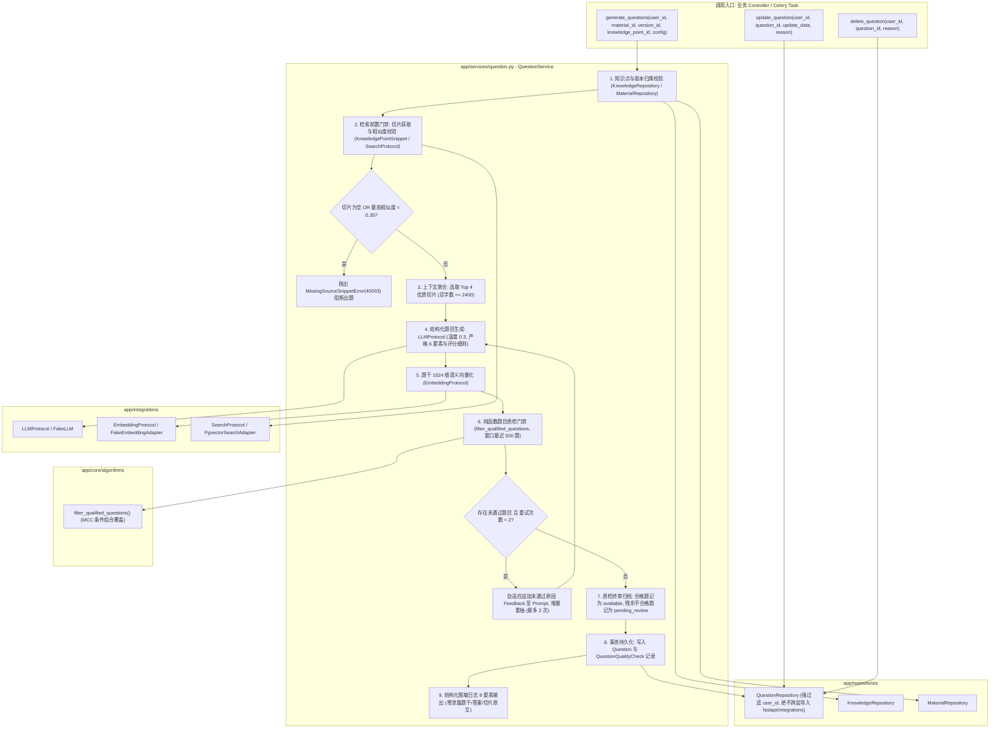

# Spec: 题目生成、质检过滤与来源溯源服务 - 技术契约

- **关联 Intent**: ZL-121
- **主导设计人**: Dev
- **当前状态**: Draft / In-Review / Approved

---

## 1. 架构流向与设计方案

`QuestionService` 严格遵循智练五层单向架构依赖矩阵，位于 `app/services` 层。作为全系统唯一允许开启数据库事务的编排者，负责协调 `MaterialRepository`、`KnowledgeRepository`、`SearchProtocol`、`EmbeddingProtocol`、`LLMProtocol` 与 `QuestionRepository`，并调用纯函数算法核 `filter_qualified_questions` 执行四项一票否决式质检门禁。



### 核心编排流转说明：
1. **检索先于生成门禁 (FR-21)**：
   - 优先通过 `KnowledgeRepository.get_snippets_for_point` 获取知识点直接绑定的切片；若切片不足 4 个，调用 `SearchProtocol.search` 混合检索补齐；
   - 校验检索结果：若最终候选切片列表为空，或候选切片最高相似度（或向量/文本匹配置信度）$< 0.35$，判定该知识点脱离资料依据，立即抛出 `MissingSourceSnippetError` (40003)，严格阻断大模型出题调用；
2. **上下文聚合与题型约束 (FR-20, FR-22)**：
   - 截取 Top 4 切片，拼接切片纯文本，总长度上限控制在 2400 字符内；
   - 构造出题 Prompt，支持 7 大题型（`single_choice`, `multiple_choice`, `true_false`, `fill_in_blank`, `term_explanation`, `short_answer`, `case_analysis`）；
   - 大模型调用设定较低采样温度（`temperature=0.3`），确保事实确定性；严格生成题目 6 要素及主观题评分细则（各分项分值总和与 `total_score` 绝对一致）；
3. **题干语义向量化与查重 (FR-24)**：
   - 生成题目后，针对题干与选项（若有）拼接文本调用 `EmbeddingProtocol.embed_documents` 获得 1024 维向量；
4. **纯函数质检核集成与滑动窗口 (FR-24, FR-28)**：
   - 从 `QuestionRepository` 获取同资料下最近入库的通过质检题目（最多 500 道）作为比对基准；
   - 组装 `CandidateQuestion` 与 `ExistingQuestionReference`，调用纯函数 `filter_qualified_questions` 执行四项一票否决式质检（无来源、重复题、答案冲突、明显歧义）；
5. **重抽反馈循环与熔断保护 (FR-25)**：
   - 若批次内存在不合格题目且当前重抽轮次 $< 2$，提取具体不合格原因构造反馈提示（Feedback），对未通过题目发起增量重抽；
   - 重抽最多 2 次；达到 2 次后仍未通过的题目，状态设为 `pending_review`（待处理区），合格题目状态设为 `available`；
6. **事务原子落库与审计日志 (FR-24, FR-26)**：
   - 在单一数据库事务中，调用 `QuestionRepository` 批量保存 `Question` 实体；
   - 对所有生成题目的质检项（无论通过与否）批量写入 `QuestionQualityCheck` 表，关联对应的 `batch_id`；
   - 针对用户后续的更新或软删除操作，严格写入 `QuestionAuditLog` 记录修改前后差量快照。

---

## 2. API 与数据契约设计

### 2.1 业务服务层契约定义 (`QuestionService`)

#### 核心出题入参 DTO
```python
@dataclass(frozen=True)
class GenerateQuestionsOptions:
    """题目生成高级配置选项。"""
    question_types: Sequence[str] = (
        QuestionType.SINGLE_CHOICE.value,
        QuestionType.MULTIPLE_CHOICE.value,
        QuestionType.TRUE_FALSE.value,
        QuestionType.SHORT_ANSWER.value,
    )
    count: int = 5  # 期望生成题目总数 (1~20)
    difficulty: int = 3  # 目标难度 (1~5)
    max_retries: int = 2  # 质检未通过重抽上限 (最多 2 次)
```

#### 生成结果出参 DTO
```python
@dataclass(frozen=True)
class QuestionGenerationResult:
    """出题服务执行结果传输对象。"""
    batch_id: str
    material_id: uuid.UUID
    version_id: uuid.UUID
    knowledge_point_id: uuid.UUID
    total_generated: int
    qualified_questions: Sequence[Question]
    pending_questions: Sequence[Question]
    quality_checks: Sequence[QuestionQualityCheck]
    retry_count: int
```

#### 大模型结构化出题响应 Pydantic Schema
```python
class LLMQuestionOptionItem(BaseModel):
    key: str = Field(description="选项标识，如 A, B, C, D")
    content: str = Field(description="选项文本内容")

class LLMGradingPointItem(BaseModel):
    point: str = Field(description="采分要点阐述")
    score: int = Field(ge=1, description="本要点分值")

class LLMGradingRubric(BaseModel):
    total_score: int = Field(ge=1, description="主观题总分")
    points: list[LLMGradingPointItem] = Field(default_factory=list, description="采分要点列表")

class LLMGeneratedQuestionItem(BaseModel):
    question_type: str = Field(description="题型枚举")
    stem: str = Field(description="题干内容，至少 6 字符")
    options: list[LLMQuestionOptionItem] = Field(default_factory=list, description="客观题选项")
    answer: str = Field(description="参考答案或标准答案")
    analysis: str = Field(default="", description="题目解析")
    difficulty: int = Field(default=3, ge=1, le=5, description="题目难度")
    grading_rubric: LLMGradingRubric | None = Field(default=None, description="主观题评分细则")
    source_snippet_index: int = Field(default=0, description="主要依据的切片序号 (0~3)")

class LLMQuestionBatchOutput(BaseModel):
    questions: list[LLMGeneratedQuestionItem] = Field(default_factory=list)
```

### 2.2 仓储层契约定义 (`QuestionRepository`)

所有仓储方法强制要求 `user_id: uuid.UUID`，并在 SQL `WHERE` 条件中做强制绑定：
1. `create_question(question: Question, user_id: uuid.UUID) -> Question`
2. `batch_create_questions(questions: Sequence[Question], user_id: uuid.UUID) -> list[Question]`
3. `get_question_by_id(question_id: uuid.UUID, user_id: uuid.UUID) -> Question | None`
4. `list_questions_by_knowledge_point(knowledge_point_id: uuid.UUID, user_id: uuid.UUID, status: str | None = None, include_deleted: bool = False) -> list[Question]`
5. `list_questions_by_material(material_id: uuid.UUID, version_id: uuid.UUID, user_id: uuid.UUID, status: str | None = None, limit: int = 500) -> list[Question]`
6. `update_question(question_id: uuid.UUID, user_id: uuid.UUID, updates: dict[str, Any]) -> Question | None`
7. `soft_delete_question(question_id: uuid.UUID, user_id: uuid.UUID) -> bool`
8. `batch_create_quality_checks(checks: Sequence[QuestionQualityCheck], user_id: uuid.UUID) -> list[QuestionQualityCheck]`
9. `list_quality_checks_by_batch(batch_id: str, user_id: uuid.UUID) -> list[QuestionQualityCheck]`
10. `create_audit_log(audit_log: QuestionAuditLog, user_id: uuid.UUID) -> QuestionAuditLog`
11. `list_audit_logs_by_question(question_id: uuid.UUID, user_id: uuid.UUID) -> list[QuestionAuditLog]`

### 2.3 异常与错误码定义 (`app/core/errors.py`)
- `MissingSourceSnippetError` (40003, HTTP 400): "检索不到与知识点匹配的有效资料片段，拒绝出题"
- `QuestionQualityCheckError` (40008, HTTP 400): "题目质检未达到合格门禁标准"
- `QuestionNotFoundError` (40009, HTTP 404): "请求的题目不存在或无权访问"

---

## 3. 可测性设计 (Design for Testability)

* **独立纯函数计算核对接**:
  - `backend/app/core/algorithms/question_quality.py` 的 `filter_qualified_questions` 是已经达到条件组合覆盖 (MCC) 的无状态纯函数，直接作为服务的判定依赖，单测无需 mock 质检逻辑；
* **外部依赖 Fake 适配与网络完全阻断 (NFR-26)**:
  - `LLMProtocol`: 在单测中注入 `StubLLM` 或 `FakeLLM`，可配置固定返回合法 6 要素题目、残缺题目或包含重复/无来源的题目，毫秒级响应；
  - `EmbeddingProtocol`: 注入 `FakeEmbeddingAdapter`，输出定长 1024 维确定性向量；
  - `SearchProtocol`: 注入 `FakeSearchAdapter`，根据 query 确定性返回切片或返回空列表触发 40003；
  - 数据库交互：使用 in-memory SQLite 会话，验证多租户越权隔离及事务原子性（保存失败自动 rollback）。

---

## 4. 替代方案与权衡考量 (Alternatives Considered & Trade-offs)

* **替代方案 A：在出题前不执行切片校验，全部交由大模型自由发挥，质检时再由 NO_SOURCE 规则拦截**
  - *未采纳原因*：大模型生成耗时较长且消耗配额，对于本身无切片或资料不相关的知识点，前置阻断（FR-21 检索先于生成）可以在 <10ms 内拦截，避免无谓消耗 Token 与长时等待，同时避免生成荒谬题目污染待处理区。
* **替代方案 B：质检未通过时整批全部废弃并重新生成**
  - *未采纳原因*：若 5 道题中仅 1 道由于实词重合率低被拦截，整批重生成本过高且引入不确定性。采用增量重抽（保留已通过题目，仅重抽未通过者）既节约成本又极大提高出题成功率。
* **替代方案 C：将质检拦截题目直接丢弃不入库**
  - *未采纳原因*：违反需求 FR-24 与 FR-25。将未通过题目以 `pending_review` 状态入库并持久化 `QuestionQualityCheck` 记录，有助于后续系统诊断、出题提示词自愈演进以及人工审核与改写。

---

## 5. 动态风险核验与回滚预案 (Risk & Rollback Verification)

* [x] **1. Affected Files**: 涉及 5 个核心文件（`errors.py`, `repositories/question.py`, `services/question.py`, 及对应 2 个测试文件），模块内聚，不影响其他已有业务服务。
* [x] **2. Public API**: 本任务为领域服务与仓储层落地，未改动公共 HTTP 入口契约；新增的 3 个专用业务异常符合 5 位错误码规范。
* [x] **3. Data Schema**: 完全基于已通过迁移验证的 `questions`、`question_quality_checks`、`question_audit_logs` 表，无需修改任何数据库 DDL。
* [x] **4. Auth & Security**: 仓储层 100% 绑定 `user_id`；日志格式严格执行脱敏，绝不输出题干、选项、答案与材料正文。
* [x] **5. Dependencies**: 零新增外部第三方包，纯标准库与已声明依赖。
* [x] **6. Rollback Difficulty**: 无持久化 Schema 变动，若代码存在缺陷可直接回滚 Git commit。
* [x] **7. Blast Radius**: 仅限于题目生成业务调用链路，不影响资料上传与知识点建树功能。

* **评级结论**：确认归属 **Tier 2 (Normal)**，无跨域重大破坏面。
* **回滚与故障应急策略**：若生产环境调用大模型出题发生大面积超时或异常，服务自动在事务中执行 rollback，不产生脏数据；异常通过标准 `AppError` 抛出并返回给客户端明确的提示信息。

---

## 6. 阶段准出签批 (Gate 2 Sign-off)
- [ ] 架构流向与 API 契约已冻结
- [ ] 替代方案已完成推演与权衡
- [ ] 7 维风险已核验且具备明确回滚预案
- **审查结论**: Pending
- **签批人 / 日期**: [待人类签批] / 2026-09-24 11:22
