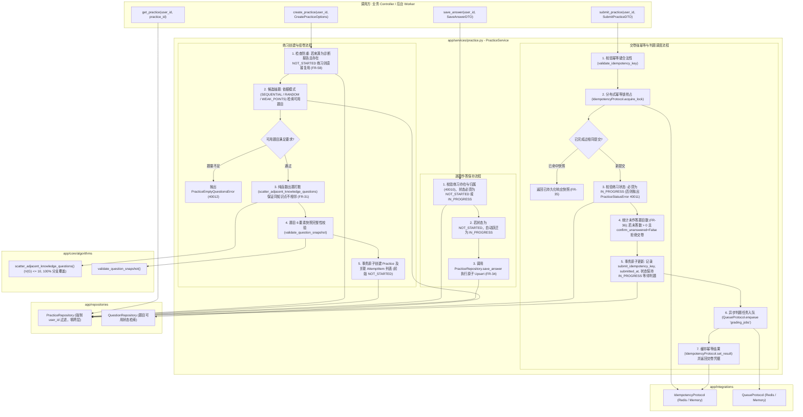

# Spec: 练习组卷、作答保存与交卷调度服务 - 技术契约

- **关联 Intent**: ZL-122
- **主导设计人**: Dev
- **当前状态**: Draft / In-Review / Approved

---

## 1. 架构流向与设计方案

`PracticeService` 严格遵循智练五层单向架构依赖矩阵，位于 `app/services` 层。作为系统核心业务编排者与唯一允许开启事务的层，协调 `PracticeRepository`、`QuestionRepository`、`IdempotencyProtocol`、`QueueProtocol`，并调用纯函数算法核 `scatter_adjacent_knowledge_questions`（同知识点不相邻打散）与 `validate_question_snapshot`（快照完整性门禁）。



---

## 2. API 与数据契约设计

### 2.1 业务服务层契约与枚举 (`PracticeService`)

#### 练习组卷模式枚举
```python
class PracticeAssemblyMode(enum.StrEnum):
    """练习组卷抽题模式枚举。"""
    SEQUENTIAL = "sequential"      # 顺序抽取 (按题库创建序号排列)
    RANDOM = "random"              # 随机打乱抽取
    WEAK_POINTS = "weak_points"    # 薄弱知识点与错题优先模式
```

#### 组卷创建配置 DTO
```python
@dataclass(frozen=True)
class CreatePracticeOptions:
    """创建练习与组卷高级配置选项。"""
    title: str
    material_id: uuid.UUID
    knowledge_point_ids: Sequence[uuid.UUID]
    question_count: int = 10                       # 题目总数 (1~50)
    question_types: Sequence[str] | None = None   # 题型范围过滤 (空为全选)
    difficulty: int | None = None                  # 目标难度 (1~5, 空为混合)
    mode: PracticeAssemblyMode = PracticeAssemblyMode.SEQUENTIAL
    source_type: str = "normal"                    # PracticeSourceType: normal / weakness
    source_report_id: uuid.UUID | None = None      # 来源报告标识 (用于继续练习防重合并, FR-58)
```

#### 逐题作答保存 DTO
```python
@dataclass(frozen=True)
class SaveAnswerDTO:
    """逐题作答暂存请求数据传输对象。"""
    practice_id: uuid.UUID
    question_id: uuid.UUID
    user_answer: str | None                        # 用户作答文本或选项标识
    duration_seconds: int = 0                      # 单题耗时 (累加秒数)
```

#### 交卷提交请求 DTO
```python
@dataclass(frozen=True)
class SubmitPracticeDTO:
    """交卷提交请求数据传输对象。"""
    practice_id: uuid.UUID
    idempotency_key: str                           # 客户端生成的强幂等键 (UUIDv4)
    confirm_unanswered: bool = False               # 未作答确认标记 (FR-36 二次确认)
```

#### 交卷返回结果 DTO
```python
@dataclass(frozen=True)
class PracticeSubmissionResult:
    """交卷调度执行结果。"""
    practice_id: uuid.UUID
    task_id: str                                  # 异步判题任务 task_id
    status: str                                   # 练习状态 (in_progress)
    unanswered_count: int                         # 未作答题目数量 (FR-36 独立统计)
    total_questions: int                          # 题目总数
    submitted_at: datetime                        # 交卷时间戳 (UTC)
```

### 2.2 仓储层契约定义 (`PracticeRepository`)

所有仓储方法强制要求 `user_id: uuid.UUID` 过滤，严禁越权，严禁导入 `fastapi` 与 `app.integrations`：
1. `create_practice(practice: Practice, user_id: uuid.UUID) -> Practice`: 持久化练习主实体；
2. `get_practice_by_id(practice_id: uuid.UUID, user_id: uuid.UUID, include_items: bool = True) -> Practice | None`: 单条获取练习详情；
3. `find_active_by_source_report(source_report_id: uuid.UUID, user_id: uuid.UUID) -> Practice | None`: 检索同来源且处于 `not_started` 状态的待练练习（用于 FR-58 防重合并）；
4. `list_practices(user_id: uuid.UUID, material_id: uuid.UUID | None = None, status: str | None = None, limit: int = 20, offset: int = 0) -> list[Practice]`: 分页多维查询练习；
5. `update_practice_status(practice_id: uuid.UUID, user_id: uuid.UUID, status: str, submit_idempotency_key: str | None = None, submitted_at: datetime | None = None) -> Practice | None`: 更新练习主状态及交卷时间；
6. `create_attempt_items(items: Sequence[AttemptItem], user_id: uuid.UUID) -> list[AttemptItem]`: 批量创建题目作答快照项；
7. `list_attempt_items(practice_id: uuid.UUID, user_id: uuid.UUID) -> list[AttemptItem]`: 获取练习题目作答项（按 `order_index` 升序）；
8. `get_attempt_item(practice_id: uuid.UUID, question_id: uuid.UUID, user_id: uuid.UUID) -> AttemptItem | None`: 获取单题作答项；
9. `save_answer(practice_id: uuid.UUID, question_id: uuid.UUID, user_id: uuid.UUID, user_answer: str | None, duration_seconds: int) -> AttemptItem`: 逐题作答保存（原子 Upsert 更新 `user_answer`, `duration_seconds`, `is_answered`）；
10. `count_unanswered_items(practice_id: uuid.UUID, user_id: uuid.UUID) -> int`: 统计练习中未作答题目数量（`is_answered == False`）。

### 2.3 异常与错误码体系 (`app/core/errors.py`)

统一继承 `AppError`：
- `PracticeNotFoundError` (40010, HTTP 404): "请求的练习不存在或无权访问" (别名 `PracticeSessionNotFoundError` 兼容导出)；
- `PracticeStatusError` (40011, HTTP 400): "练习状态流转不合法，当前状态禁止该操作" (别名 `PracticeSessionStatusError` 兼容导出)；
- `PracticeEmptyQuestionsError` (40012, HTTP 400): "题库可用题目不足，无法满足当前出题配置要求"。

---

## 3. 可测性设计 (Design for Testability)

### 3.1 独立纯函数打散核 (`scatter_adjacent_knowledge_questions`)
- **位置**: `backend/app/core/algorithms/practice.py`
- **函数签名**:
  ```python
  def scatter_adjacent_knowledge_questions(
      questions: Sequence[QuestionCandidateItem],
  ) -> list[QuestionCandidateItem]:
      """根据知识点贪心打散题目序列，使得来自同一知识点的题目不相邻。

      算法契约:
      1. 若知识点唯一或题目总数 <= 1，直接返回原列表；
      2. 采用最大堆/贪心频次交替排列策略；
      3. 若某知识点题目占比超过 (N+1)//2 导致数学上必然相邻，尽可能最大化相邻间距并返回最优排列；
      4. 纯函数实现，不包含任何 I/O 与时间依赖；环路复杂度 V(G) <= 10；分支覆盖率 100%。
      """
  ```

### 3.2 外部依赖与 Mock 策略
- `IdempotencyProtocol`: 单测注入 `MemoryIdempotencyAdapter`，验证并发加锁失败、释放锁与结果回放；
- `QueueProtocol`: 单测注入 `MemoryQueueAdapter`，验证交卷后任务投递到 `grading_jobs` 队列以及 payload 完整性；
- 数据库: 内存 SQLite 结合 SQLAlchemy `sessionmaker`，全内存高速执行，毫秒级单测闭环。

---

## 4. 替代方案与权衡考量 (Alternatives Considered & Trade-offs)

* **替代方案 A：在创建练习时不固化题目快照，作答与判题时动态关联 `questions` 表**
  - *未采纳原因*：严重违反历史答卷数据不可变性原则。一旦用户在资料库中编辑、删除或重新生成题目，历史练习与作答记录将产生悬垂外键或内容漂移。采用 `AttemptItem.question_snapshot` (JSONB) 物理彻底解耦（技术决策 2），彻底消除原题变动对历史练习的影响。
* **替代方案 B：交卷时直接同步完成客观题与主观题判分并返回结果**
  - *未采纳原因*：主观题大模型判题可能需要 3~10 秒，在移动端高并发与弱网环境下容易导致 HTTP 超时或客户端重复提交。采用“交卷落库更新状态 + 异步投递判题队列 + 幂等响应”设计，解耦交卷与判题生命周期，实现前端秒级交互反馈。
* **替代方案 C：纯随机打散题目，不限制同知识点相邻**
  - *未采纳原因*：违反需求 FR-31。知识点题目集中出现会产生学习定势与提示泄漏。纯贪心打散算法能以极小算力开销达成同知识点间隔分布。

---

## 5. 动态风险核验与回滚预案 (Risk & Rollback Verification)

* [x] **1. Affected Files**: 预计改动 6 个核心代码文件与 3 个测试文件，模块严格内聚；
* [x] **2. Public API**: 属于领域服务与仓储层内部契约落地，为后续 ZL-129 路由铺路，不破坏现有外部 API；
* [x] **3. Data Schema**: 完全复用已通过迁移验证的 `practices` 与 `attempt_items` 表，零 DDL 变动；
* [x] **4. Auth & Security**: 仓储层 100% 强制 `user_id` 过滤阻断水平越权；日志 8 要素严格脱敏（零泄漏题干与答案原文）；
* [x] **5. Dependencies**: 零新增第三方外部依赖，纯原生 Python + SQLAlchemy + 已就绪 Protocol；
* [x] **6. Rollback Difficulty**: 纯业务逻辑增量，无破坏性持久化迁移，代码缺陷可秒级 Git revert；
* [x] **7. Blast Radius**: 影响面严格收敛在练习业务模块内部，不影响已有资料解析与知识点抽取。

* **评级结论**：确认归属 **Tier 2 (Normal)**。
* **回滚与故障应急策略**：若生产运行发生队列积压或未捕获异常，由于 `PracticeService` 在独立事务中运行且支持幂等锁自愈释放，事务回滚保证不留脏数据，客户端可安全重试。

---

## 6. 阶段准出签批 (Gate 2 Sign-off)
- [ ] 架构流向与 API 契约已冻结
- [ ] 替代方案已完成推演与权衡
- [ ] 7 维风险已核验且具备明确回滚预案
- **审查结论**: Pending
- **签批人 / 日期**: [待人类签批] / 2026-09-24 12:57

---

## 6. 阶段准出签批 (Gate 2 Sign-off)
- [ ] 架构流向与 API 契约已冻结
- [ ] 替代方案已完成推演与权衡
- [ ] 7 维风险已核验且具备明确回滚预案
- **审查结论**: Pending
- **签批人 / 日期**: [待人类签批] / 2026-09-24 12:57
