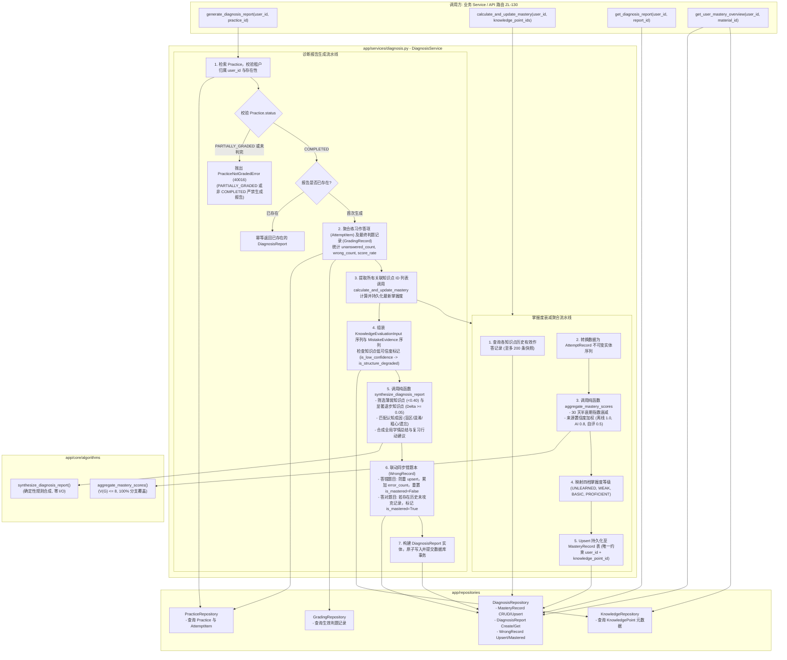

# Spec: 掌握度衰减聚合与诊断报告生成服务 - 技术契约

- **关联 Intent**: ZL-124
- **主导设计人**: Dev
- **当前状态**: In-Review

---

## 1. 架构流向与设计方案

`DiagnosisService` 遵循智练五层单向架构依赖矩阵，位于 `app/services` 层。作为系统核心业务编排者与唯一允许开启事务的层，协调 `DiagnosisRepository`、`PracticeRepository`、`KnowledgeRepository` 与 `GradingRepository`，调用纯函数算法核 `aggregate_mastery_scores`（掌握度 30 天半衰期衰减聚合）与 `synthesize_diagnosis_report`（薄弱/退步归因与报告合成），完成掌握度落库、诊断报告持久化与错题本联动。



---

## 2. API 与数据契约设计

### 2.1 仓储层契约 (`DiagnosisRepository`)
位于 `backend/app/repositories/diagnosis.py`，全量方法必须强制接收 `user_id: uuid.UUID` 作为租户隔离参数，杜绝水平越权：

```python
class DiagnosisRepository:
    def __init__(self, session: Session) -> None: ...

    # --- MasteryRecord 掌握度持久化 ---
    def get_mastery_record(
        self,
        knowledge_point_id: uuid.UUID,
        user_id: uuid.UUID,
    ) -> MasteryRecord | None: ...

    def list_mastery_records_by_knowledge_point_ids(
        self,
        knowledge_point_ids: Sequence[uuid.UUID],
        user_id: uuid.UUID,
    ) -> list[MasteryRecord]: ...

    def list_mastery_records_by_user(
        self,
        user_id: uuid.UUID,
    ) -> list[MasteryRecord]: ...

    def upsert_mastery_record(
        self,
        *,
        user_id: uuid.UUID,
        knowledge_point_id: uuid.UUID,
        mastery_score: float,
        level: str,
        practice_count: int,
        correct_count: int,
        last_practiced_at: datetime | None,
        decayed_at: datetime | None,
        recent_records_snapshot: list[dict[str, Any]],
    ) -> MasteryRecord: ...

    # --- DiagnosisReport 诊断报告持久化 ---
    def create_diagnosis_report(
        self,
        report: DiagnosisReport,
        user_id: uuid.UUID,
    ) -> DiagnosisReport: ...

    def get_diagnosis_report_by_id(
        self,
        report_id: uuid.UUID,
        user_id: uuid.UUID,
    ) -> DiagnosisReport | None: ...

    def get_diagnosis_report_by_practice_id(
        self,
        practice_id: uuid.UUID,
        user_id: uuid.UUID,
    ) -> DiagnosisReport | None: ...

    def list_diagnosis_reports_by_user(
        self,
        user_id: uuid.UUID,
        limit: int = 20,
        offset: int = 0,
    ) -> list[DiagnosisReport]: ...

    # --- WrongRecord 错题本持久化 ---
    def get_wrong_record(
        self,
        question_id: uuid.UUID,
        user_id: uuid.UUID,
    ) -> WrongRecord | None: ...

    def get_wrong_record_by_id(
        self,
        record_id: uuid.UUID,
        user_id: uuid.UUID,
    ) -> WrongRecord | None: ...

    def upsert_wrong_record(
        self,
        *,
        user_id: uuid.UUID,
        question_id: uuid.UUID | None,
        knowledge_point_id: uuid.UUID,
        practice_id: uuid.UUID,
        attempt_item_id: uuid.UUID,
        error_type: str,
        question_snapshot: dict[str, Any],
        last_wrong_answer: str | None = None,
    ) -> WrongRecord: ...

    def mark_wrong_record_mastered(
        self,
        question_id: uuid.UUID,
        user_id: uuid.UUID,
    ) -> WrongRecord | None: ...

    def list_wrong_records(
        self,
        user_id: uuid.UUID,
        is_mastered: bool | None = None,
        knowledge_point_id: uuid.UUID | None = None,
        limit: int = 50,
        offset: int = 0,
    ) -> list[WrongRecord]: ...

    def delete_wrong_record(
        self,
        record_id: uuid.UUID,
        user_id: uuid.UUID,
    ) -> bool: ...
```

### 2.2 服务层契约 (`DiagnosisService`)
位于 `backend/app/services/diagnosis.py`（同时导出别名 `ReportService = DiagnosisService` 以对齐 ROADMAP）：

```python
@dataclass(frozen=True)
class KnowledgeMasterySummaryDTO:
    knowledge_point_id: uuid.UUID
    knowledge_name: str
    mastery_score: float
    level: str
    practice_count: int
    correct_count: int
    last_practiced_at: datetime | None

@dataclass(frozen=True)
class UserMasteryOverviewDTO:
    material_id: uuid.UUID
    overall_mastery_score: float
    total_knowledge_points: int
    unlearned_count: int
    weak_count: int
    basic_count: int
    proficient_count: int
    weak_knowledge_points: list[KnowledgeMasterySummaryDTO]

class DiagnosisService:
    def __init__(
        self,
        session: Session,
        diagnosis_repo: DiagnosisRepository | None = None,
        practice_repo: PracticeRepository | None = None,
        knowledge_repo: KnowledgeRepository | None = None,
        grading_repo: GradingRepository | None = None,
    ) -> None: ...

    def calculate_and_update_mastery(
        self,
        user_id: uuid.UUID,
        knowledge_point_ids: Sequence[uuid.UUID],
        current_time: datetime | None = None,
    ) -> dict[uuid.UUID, MasteryRecord]: ...

    def generate_diagnosis_report(
        self,
        user_id: uuid.UUID,
        practice_id: uuid.UUID,
        request_id: str | None = None,
    ) -> DiagnosisReport: ...

    def get_diagnosis_report(
        self,
        user_id: uuid.UUID,
        report_id: uuid.UUID,
    ) -> DiagnosisReport: ...

    def get_diagnosis_report_by_practice(
        self,
        user_id: uuid.UUID,
        practice_id: uuid.UUID,
    ) -> DiagnosisReport: ...

    def get_user_mastery_overview(
        self,
        user_id: uuid.UUID,
        material_id: uuid.UUID,
    ) -> UserMasteryOverviewDTO: ...

    def list_wrong_records(
        self,
        user_id: uuid.UUID,
        is_mastered: bool | None = None,
        knowledge_point_id: uuid.UUID | None = None,
        limit: int = 50,
        offset: int = 0,
    ) -> list[WrongRecord]: ...

    def remove_wrong_record(
        self,
        user_id: uuid.UUID,
        record_id: uuid.UUID,
    ) -> bool: ...
```

### 2.3 异常与错误码定义
在 `backend/app/core/errors.py` 登记并继承 `AppError`：
- `PracticeNotGradedError` (错误码 `40016`, HTTP `400`): 练习尚未完成全量判题（处于 `PARTIALLY_GRADED` 存在待重判题目或未判完），无法生成诊断报告；
- `DiagnosisReportNotFoundError` (错误码 `40017`, HTTP `404`): 请求的学情诊断报告不存在或无权访问；
- `MasteryRecordNotFoundError` (错误码 `40018`, HTTP `404`): 请求的知识点掌握度记录不存在或无权访问。

---

## 3. 可测性设计 (Design for Testability)

### 3.1 独立纯函数计算核
- `aggregate_mastery_scores` (`backend/app/core/algorithms/mastery.py`):
  输入不可变 `AttemptRecord` 列表与评估时间戳，执行 30 天半衰期指数衰减加权，纯函数计算掌握度得分与等级，无任何外部 I/O 与网络。
- `synthesize_diagnosis_report` (`backend/app/core/algorithms/diagnosis.py`):
  输入 `KnowledgeEvaluationInput` 列表与 `MistakeEvidence` 列表，执行认知成因规则匹配、退步判定与复习建议合成，确定性输出，白盒覆盖率 100%。

### 3.2 外部依赖与 Mock 策略
- **数据库隔离与事务**：单测采用 isolated SQLite 内存数据库（`sqlite:///:memory:`），真实执行外键约束、唯一约束（如 `(user_id, knowledge_point_id)`）与多租户过滤。无需外部数据库服务。
- **纯函数免 Mock**：核心衰减计算与诊断合成直接调用真实算法纯函数，严禁在纯函数外层注入 Mock 替身。
- **时间可控性**：允许测试显式传入 `current_time` 参数，便于构造相隔 3 天、7 天、30 天、300 天的闲置遗忘衰减确定性断言。

---

## 4. 替代方案与权衡考量 (Alternatives Considered & Trade-offs)

### 4.1 方案对比
- **方案 A：练习每次作答时即时增量更新掌握度**
  用户每做一题或每交一道题即更新一次 `MasteryRecord`。
  *缺陷*：产生大量高频数据库写放大，且未完成判题的主观题分数尚未确定，会导致掌握度频繁抖动误导用户；违背两阶段状态机防错准则。
- **方案 B：交卷判题完成后整卷批量结算（已采纳）**
  在整卷判题终态（`COMPLETED`）触发 `generate_diagnosis_report`，统一提取练习涉及的知识点，结合历史至多 200 条作答快照批量执行衰减聚合，并在同一事务内落库报告与更新错题本。
  *优势*：事务边界清晰，避免中间态数据污染；计算集中且天然幂等；满足 FR-49 报告阻断要求。

### 4.2 错题本同步策略权衡
- **独立错题本快照 vs. 动态关联原题**：
  若错题本仅存储 `question_id`，原题被教师或系统修改、软删除后，错题本将损坏无法渲染。
  *设计裁决*：在 `WrongRecord` 中冗余存储 `question_snapshot`（包含题干、选项、答案、解析），原题即便解耦删除，学生错题本仍可独立完整呈现。

---

## 5. 动态风险核验与回滚预案 (Risk & Rollback Verification)

* [x] **Files**: 
  - 修改: `backend/app/core/errors.py`, `backend/app/repositories/__init__.py`, `backend/app/services/__init__.py`, `backend/tests/unit/core/test_errors.py`
  - 新增: `backend/app/repositories/diagnosis.py`, `backend/app/services/diagnosis.py`, `backend/tests/unit/repositories/test_diagnosis_repo.py`, `backend/tests/unit/services/test_diagnosis_service.py`
* [x] **API**: 不增加对外 HTTP 路由，仅新增内部领域服务与仓储契约，契约向后兼容无破坏性变动。
* [x] **Schema**: 表结构 `mastery_records`, `diagnosis_reports`, `wrong_records` 已由 ZL-106 预建就绪，无需执行数据库迁移。
* [x] **Auth**: 全仓储与服务方法强制校验 `user_id`，全面防护水平越权穿透。
* [x] **Deps**: 仅依赖项目内部已有的算法核与模型，零新增第三方依赖。
* [x] **Migration & Rollback**: 无数据库 Schema 变动；若服务发生异常可直接代码级回滚；已写入的数据均为标准审计与聚合记录，回滚后不造成脏数据扩散。
* [x] **Blast Radius**: 局限于学情诊断与掌握度展示；若报告生成失败，练习仍处于 `COMPLETED`，可安全重试生成；不影响交卷与判题主链路。

**回滚与故障应急策略**:
- 若诊断报告生成偶发崩溃，接口支持传入相同 `practice_id` 重新调用；若已成功创建则幂等返回，若事务失败则全部回滚至未生成状态；
- 若出现因存在待重判题目导致的生成阻断，系统抛出 40016 友好提示，待后台完成重判或用户自主评分后即可平滑解除阻断。

---

## 6. 阶段准出签批 (Gate 2 Sign-off)
- [ ] 架构流向与 API 契约已冻结
- [ ] 替代方案已完成推演与权衡
- [ ] 7 维风险已核验且具备明确回滚预案
- **审查结论**: Pending
- **签批人 / 日期**: 人类架构评审人 (待签批) / 2026-09-24 18:29
