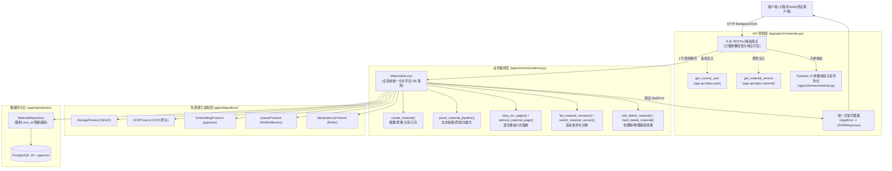

# Spec: 资料管理与解析调度 API 路由 - 技术契约

- **关联 Intent**: ZL-125
- **主导设计人**: Dev
- **当前状态**: In-Review

---

## 1. 架构流向与设计方案

`MaterialRouter` 位于智练系统五层单向架构矩阵的 API 路由控制层（`app/api/v1`）。本模块严格遵守分层约束：**只负责 HTTP 请求协议解析、Pydantic 参数校验、调用 Service 服务编排层、以及响应 DTO 序列化转换**。
严禁在路由中直接导入 `app.repositories`，严禁在路由层执行超过 1 行的业务判断，严禁在路由层开启数据库 Session 事务。



---

## 2. API 与数据契约设计

### 2.1 资料上传创建 (`POST /api/v1/materials/upload`)
* **接口路由**: `POST /api/v1/materials/upload`
* **协议类型**: `multipart/form-data`
* **入参定义**:
  - `file: UploadFile = File(...)`：待上传的文件流，支持 PDF, DOCX, PPTX, PNG, JPG, JPEG, TXT, MD。
  - `title: str | None = Form(None)`：资料展示标题；若未传入，自动提取并清洗原始文件名（截断至 255 字符）。
  - `source_type: str = Form("local")`：导入来源（`local` 或 `wechat`）。
  - `idempotency_key: str | None = Header(None, alias="Idempotency-Key")`：可选的防重幂等键。
* **出参 Schema (`MaterialUploadResponse`)**:
  ```python
  class MaterialUploadResponse(BaseModel):
      id: uuid.UUID
      version_id: uuid.UUID
      title: str
      file_format: str
      file_size: int
      source_type: str
      status: str  # pending / parsing / ready / failed
      created_at: datetime
  ```
* **响应状态码**: `201 Created`

### 2.2 资料详情查询 (`GET /api/v1/materials/{material_id}`)
* **接口路由**: `GET /api/v1/materials/{material_id}`
* **路径参数**: `material_id: uuid.UUID`
* **鉴权**: 必须属于当前登录用户，否则抛出 `MaterialNotFoundError` (404) 避免泄露资源存在性。
* **出参 Schema (`MaterialDetailResponse`)**:
  ```python
  class MaterialDetailResponse(BaseModel):
      id: uuid.UUID
      title: str
      file_format: str
      file_size: int
      source_type: str
      status: str
      current_version_id: uuid.UUID | None
      versions_count: int
      created_at: datetime
      updated_at: datetime
  ```
* **响应状态码**: `200 OK`

### 2.3 资料分页检索列表 (`GET /api/v1/materials`)
* **接口路由**: `GET /api/v1/materials`
* **查询参数**:
  - `limit: int = Query(20, ge=1, le=100)`：单页数量。
  - `offset: int = Query(0, ge=0)`：游标偏移量。
  - `keyword: str | None = Query(None, max_length=100)`：标题模糊检索词。
  - `status: str | None = Query(None)`：状态筛选（`pending`, `parsing`, `ready`, `failed`）。
* **出参 Schema (`MaterialListResponse`)**:
  ```python
  class MaterialListItem(BaseModel):
      id: uuid.UUID
      title: str
      file_format: str
      file_size: int
      source_type: str
      status: str
      current_version_id: uuid.UUID | None
      created_at: datetime
      updated_at: datetime

  class MaterialListResponse(BaseModel):
      items: list[MaterialListItem]
      total: int
      limit: int
      offset: int
  ```
* **响应状态码**: `200 OK`

### 2.4 解析流水线调度触发/重试 (`POST /api/v1/materials/{material_id}/parse`)
* **接口路由**: `POST /api/v1/materials/{material_id}/parse`
* **路径参数**: `material_id: uuid.UUID`
* **入参 Schema (`MaterialParseRequest`)**:
  ```python
  class MaterialParseRequest(BaseModel):
      version_id: uuid.UUID | None = None
      sync: bool = False
  ```
* **出参 Schema (`MaterialParseResponse`)**:
  ```python
  class MaterialParseResponse(BaseModel):
      material_id: uuid.UUID
      version_id: uuid.UUID
      parse_status: str
      is_active: bool
      message: str
  ```
* **响应状态码**: `200 OK` (若为同步解析或快速入队) / `202 Accepted`

### 2.5 历史版本列表查询 (`GET /api/v1/materials/{material_id}/versions`)
* **接口路由**: `GET /api/v1/materials/{material_id}/versions`
* **路径参数**: `material_id: uuid.UUID`
* **出参 Schema (`MaterialVersionListResponse`)**:
  ```python
  class MaterialVersionItem(BaseModel):
      id: uuid.UUID
      material_id: uuid.UUID
      version_number: int
      parse_status: str
      content_hash: str
      is_active: bool
      created_at: datetime

  class MaterialVersionListResponse(BaseModel):
      material_id: uuid.UUID
      versions: list[MaterialVersionItem]
  ```
* **响应状态码**: `200 OK`

### 2.6 切换激活版本 (`POST /api/v1/materials/{material_id}/versions/{version_id}/switch`)
* **接口路由**: `POST /api/v1/materials/{material_id}/versions/{version_id}/switch`
* **路径参数**: `material_id: uuid.UUID`, `version_id: uuid.UUID`
* **业务校验**: 必须属于同一资料且属于当前用户，版本必须处于 `ready` 状态。
* **出参 Schema**: `MaterialDetailResponse` (返回切换后的最新资料详情)
* **响应状态码**: `200 OK`

### 2.7 资料分页重拍 (`POST /api/v1/materials/{material_id}/reshoot`)
* **接口路由**: `POST /api/v1/materials/{material_id}/reshoot`
* **协议类型**: `multipart/form-data`
* **入参定义**:
  - `page_index: int = Form(..., ge=1)`：重拍的目标页码（1-based 序号）。
  - `file: UploadFile = File(...)`：重新拍摄的高清图片数据流（PNG/JPG/JPEG）。
  - `version_id: uuid.UUID | None = Form(None)`：可选指定版本，未传默认使用 `material.current_version_id`。
* **熔断约束**: 单页重拍次数达 3 次且仍未合格，触发 `ReshootLimitExceededError` (40002) 熔断拦截。
* **出参 Schema (`MaterialReshootResponse`)**:
  ```python
  class MaterialReshootResponse(BaseModel):
      material_id: uuid.UUID
      version_id: uuid.UUID
      page_index: int
      is_qualified: bool
      reshoot_count: int
      parse_status: str
      unqualified_reason: str | None = None
  ```
* **响应状态码**: `200 OK`

### 2.8 资料软删除 (`DELETE /api/v1/materials/{material_id}`)
* **接口路由**: `DELETE /api/v1/materials/{material_id}`
* **路径参数**: `material_id: uuid.UUID`
* **出参 Schema (`MaterialDeleteResponse`)**:
  ```python
  class MaterialDeleteResponse(BaseModel):
      material_id: uuid.UUID
      is_deleted: bool
      permanent: bool
      message: str
  ```
* **响应状态码**: `200 OK`

### 2.9 资料物理级联硬删除 (`DELETE /api/v1/materials/{material_id}/hard`)
* **接口路由**: `DELETE /api/v1/materials/{material_id}/hard`
* **路径参数**: `material_id: uuid.UUID`
* **查询参数**: `permanent: bool = Query(True)`：二次确认标记。
* **级联范围**: 物理级联清空 `material_snippets`, `material_ocr_pages`, `material_versions`, `materials` 表记录，并同步删除 MinIO 中的原件、纯文本及切片图片。
* **出参 Schema**: `MaterialDeleteResponse(material_id=..., is_deleted=True, permanent=True, message=...)`
* **响应状态码**: `200 OK`

### 2.10 异常映射与 5 位错误码矩阵
所有路由操作发生异常时，统一由 FastAPI `AppError` 异常处理器捕获，序列化为统一格式：
```json
{
  "code": 40001,
  "message": "学习资料格式不合法或内容不达标",
  "details": {},
  "data": null
}
```
| 业务异常类 | 5 位错误码 | HTTP 状态码 | 触发场景 |
|---|---|---|---|
| `MaterialInvalidError` | `40001` | 400 | 文件为空、文件过大、不支持的扩展名、二进制魔数不匹配 |
| `ReshootLimitExceededError` | `40002` | 400 | 单页图片重拍超过 3 次熔断上限 |
| `MaterialParseError` | `40003` | 500 | 文本提取失败、OCR 不达标、或知识切分异常 |
| `MaterialNotFoundError` | `40004` | 404 | 资料不存在、已删除或跨租户水平越权访问 |
| `AuthenticationError` | `20001` | 401 | 缺少 Authorization 头、非 Bearer 格式或 Token 失效 |
| `PermissionDeniedError` | `20002` | 403 | 无权限操作或越权操作已被拦截 |

---

## 3. 可测性设计 (Design for Testability)

### 3.1 独立纯函数与 DTO 校验核
- `backend/app/schemas/material.py`：纯 Pydantic 数据契约核。通过 Field 参数设定 `ge=1`, `le=100`, `max_length=255` 等边界约束，无需依赖网络或数据库即可针对各种异常 Payload 进行 100% 静态与单元断言。
- 文件名清洗纯函数 `sanitize_material_title(filename: str | None, default_title: str = "未命名资料") -> str`：独立提取、去除首尾空格、截断超长字符、去除非法控制字符。

### 3.2 外部依赖与 Mock 策略
- **单元测试解耦 (FastAPI Dependency Overrides)**：
  在 `tests/unit/api/test_material_router.py` 中，使用 `app.dependency_overrides[get_current_user]` 注入固定测试用户，使用 `app.dependency_overrides[get_material_service]` 注入 Mock 或 Fake `MaterialService`。
  测试可在无需真实数据库连接、无需真实 MinIO、无需真实 OCR 的毫秒级时间内执行完毕。
- **端到端集成测试 (Fake/Memory Adapters)**：
  在集成测试中，使用已有的内存适配器栈（`MemoryStorageAdapter`, `FakeOCRAdapter`, `FakeEmbeddingAdapter`, `MemoryQueueAdapter`, `MemoryIdempotencyAdapter`）与 SQLite 内存数据库结合，验证从 HTTP 请求发起、Form 解析、Service 调度至 SQLite 数据落库的完整闭环。

---

## 4. 替代方案与权衡考量 (Alternatives Considered & Trade-offs)

### 4.1 方案对比
- **方案 A：路由层直接注入数据库 Session 并由路由执行轻量查询**
  - *做法*: 在 `materials.py` 路由中注入 `db: Session`，对于获取详情、列表等简单只读请求，直接调用 `MaterialRepository` 查询并返回。
  - *未采纳原因*: 严重违背 `AGENTS.md` 架构单向依赖红线（`app/api` 严禁跨层导入 `app.repositories`）。路由层直连仓储会导致事务边界不清、权限过滤分散在两处，降低系统维护性。
- **方案 B：前端直传 MinIO (Presigned URL) 方案**
  - *做法*: 客户端先请求后端生成 MinIO 上传预签名 URL，直传 MinIO 成功后再回调后端创建资料记录。
  - *未采纳原因*: 前端直传绕过了后端的二进制魔数纯函数门禁校验（`validate_file_magic`）与 SHA-256 秒传查重，使得假冒文件或重复垃圾大文件直接进入存储桶；且在微信小程序环境下需要复杂的分步上传重试逻辑与签名维护。经权衡，后端代理上传配合大小与魔数实时拦截更安全可靠。
- **方案 C：全接口严格遵循 Service 1 行委托 (已采纳)**
  - *做法*: 路由层仅提取参数，打包传递给 `MaterialService`，所有业务状态判断、多版本处理与事务均由 Service 统领。
  - *采纳原因*: 严格满足单一职责原则与分层检测工具 `tooling/check_layers.py`，测试中可直接对 Service 进行细粒度 Mock 隔离。

---

## 5. 动态风险核验与回滚预案 (Risk & Rollback Verification)

* [x] **Files**:
  - 新增: `backend/app/schemas/material.py`, `backend/app/schemas/__init__.py`, `backend/app/api/v1/materials.py`, `backend/app/api/deps/material.py`, `backend/tests/unit/api/test_material_router.py`, `backend/tests/unit/schemas/test_material_schema.py`
  - 修改: `backend/app/services/material.py` (补充 `list_material_versions`, `switch_material_version`, `reshoot_material_page` 领域方法), `backend/app/repositories/material.py` (增强 `keyword` 与 `status` 过滤), `backend/app/api/deps/__init__.py` (导出 `get_material_service`)
* [x] **API**:
  - 全新挂载 `/api/v1/materials` 路由空间，为纯增量接口，向后完全兼容。
* [x] **Schema**:
  - 无需任何数据库模型变更或 Alembic 迁移脚本，复用已有 `materials` 表结构。
* [x] **Auth**:
  - 100% 路由强制受控于 `get_current_user`，透传当前用户 `user.id`，坚决杜绝水平越权。
* [x] **Deps**:
  - 零新增第三方 Python 库，使用现存的 fastapi, pydantic, python-multipart。
* [x] **Migration / Rollback**:
  - 零数据迁移风险。如需回滚，只需从 API 路由注册中注销 `materials_router`，或直接执行 Git Revert。
* [x] **Blast Radius**:
  - 变更局限在资料 API 接入层与服务层适配，不会对下游题目生成、练习作答或判题模块产生任何负面连锁反应。

* **回滚与故障应急策略**:
  - 若路由上线后发生未知异常，可通过在应用入口处注释路由挂载 `app.include_router(materials_router)` 实现秒级熔断阻断；
  - 故障排查依据结构化脱敏日志中的 `request_id` 与 `user_ref` 进行排查，不泄露用户敏感资料。

---

## 6. 阶段准出签批 (Gate 2 Sign-off)
- [x] 架构流向与 API 契约已冻结
- [x] 替代方案已完成推演与权衡
- [x] 7 维风险已核验且具备明确回滚预案
- **审查结论**: Passed
- **签批人 / 日期**: Dev / 2026-09-24