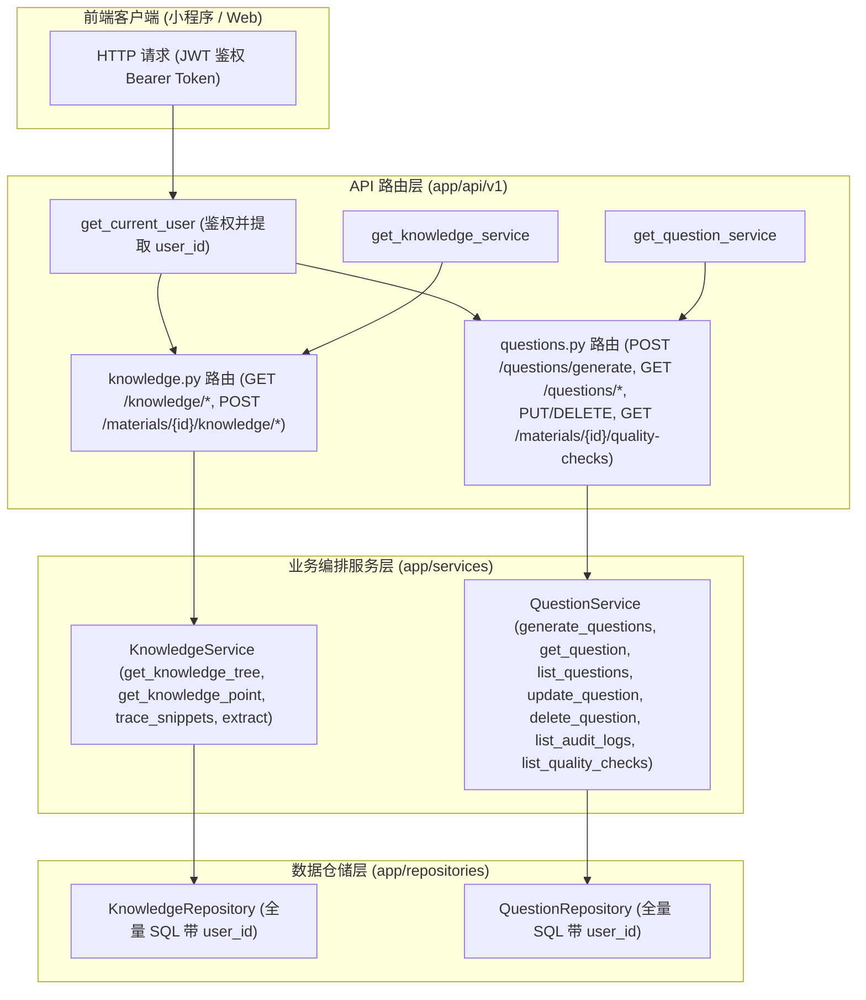

# Spec: 知识点树与题目管理 API 路由 - 技术契约

- **关联 Intent**: ZL-126
- **主导设计人**: Dev
- **当前状态**: Draft / In-Review / Approved

---

## 1. 架构流向与设计方案

本任务实现智练系统的知识点与题目管理 API 路由（ZL-126），严格遵守五层单向架构矩阵与 AGENTS.md 约束：
- 客户端请求进入 FastAPI 路由层（`app/api/v1/knowledge.py` 与 `app/api/v1/questions.py`）；
- 路由层只负责 HTTP 协议适配、Pydantic DTO 入参校验、通过依赖注入解析 Service 实例与鉴权 User，调用 Service 编排层，禁止导入 `app/repositories`；
- Service 层（`KnowledgeService` 与 `QuestionService`）统一管理租户过滤、事务边界与核心领域流程；
- 仓储层（`KnowledgeRepository` 与 `QuestionRepository`）负责底层 ORM 映射与数据交互。



### 关键关注点标注 (Flagged Concerns)
1. **多租户与水平越权防护**：所有路由必须通过 `get_current_user` 强鉴权获取 `user.id`，并在调用 Service 时作为不可信参数重写的唯一来源；严禁信任客户端传入的 `user_id`。
2. **跨层导入阻断**：严禁在 `app/api/v1/` 中导入 `app.repositories` 或任何 Model 内部的仓储方法；针对 Service 层尚未暴露的查询（如查看切片溯源、查看修改日志、多条件检索题目），必须在 `KnowledgeService` 与 `QuestionService` 暴露对应代理编排方法。
3. **出题前置门禁 40003**：当请求的知识点不存在有效切片或切片向量相似度低于阈值时，`QuestionService._retrieve_and_gate_snippets` 抛出 `MissingSourceSnippetError`，API 捕获并统一返回 HTTP 400（错误码 40003）。

---

## 2. API 与数据契约设计

### 2.1 知识点与溯源 API (`app/api/v1/knowledge.py`)

#### 1) 获取资料知识树
- **路由**: `GET /api/v1/materials/{material_id}/knowledge-tree`
- **Query 参数**: `version_id: uuid.UUID | None = None`
- **响应 Schema (`KnowledgeTreeResponse`)**:
  ```json
  {
    "material_id": "uuid",
    "version_id": "uuid",
    "nodes": [
      {
        "id": "uuid",
        "material_id": "uuid",
        "version_id": "uuid",
        "parent_id": "uuid | null",
        "name": "string",
        "description": "string",
        "level": 1,
        "is_low_confidence": false,
        "children": []
      }
    ]
  }
  ```
- **错误码**: `40010` (MaterialNotFoundError, HTTP 404), `20001` (HTTP 401)

#### 2) 获取知识点详情
- **路由**: `GET /api/v1/knowledge/{id}`
- **响应 Schema (`KnowledgePointDetailResponse`)**:
  ```json
  {
    "id": "uuid",
    "material_id": "uuid",
    "version_id": "uuid",
    "parent_id": "uuid | null",
    "name": "string",
    "description": "string",
    "level": 1,
    "is_low_confidence": false,
    "batch_id": "string",
    "created_at": "datetime",
    "updated_at": "datetime"
  }
  ```
- **错误码**: `40007` (KnowledgeNotFoundError, HTTP 404)

#### 3) 反向溯源：通过知识点查关联来源切片列表
- **路由**: `GET /api/v1/knowledge/{id}/snippets`
- **响应 Schema (`KnowledgeSnippetsResponse`)**:
  ```json
  {
    "knowledge_point_id": "uuid",
    "snippets": [
      {
        "id": "uuid",
        "material_id": "uuid",
        "version_id": "uuid",
        "page_index": 1,
        "snippet_index": 1,
        "chapter_title": "string",
        "content": "string",
        "char_length": 120
      }
    ]
  }
  ```
- **错误码**: `40007` (KnowledgeNotFoundError, HTTP 404)

#### 4) 正向溯源：通过切片查关联知识点
- **路由**: `GET /api/v1/knowledge/snippets/{snippet_id}/knowledge-points`
- **响应 Schema (`SnippetKnowledgePointsResponse`)**:
  ```json
  {
    "snippet_id": "uuid",
    "knowledge_points": [
      {
        "id": "uuid",
        "material_id": "uuid",
        "version_id": "uuid",
        "parent_id": "uuid | null",
        "name": "string",
        "description": "string",
        "level": 1,
        "is_low_confidence": false
      }
    ]
  }
  ```

#### 5) 触发知识点抽取与建树
- **路由**: `POST /api/v1/materials/{material_id}/knowledge/extract`
- **入参 Schema (`KnowledgeExtractRequest`)**:
  ```json
  {
    "version_id": "uuid | null"
  }
  ```
- **响应 Schema (`KnowledgeExtractResponse`)**:
  ```json
  {
    "material_id": "uuid",
    "version_id": "uuid",
    "extracted_count": 12,
    "has_low_confidence": false,
    "status": "ready"
  }
  ```

---

### 2.2 题目管理 API (`app/api/v1/questions.py`)

#### 1) 触发出题生成
- **路由**: `POST /api/v1/questions/generate`
- **入参 Schema (`QuestionGenerateRequest`)**:
  ```json
  {
    "material_id": "uuid",
    "version_id": "uuid",
    "knowledge_point_id": "uuid",
    "count": 5,
    "difficulty": 3,
    "question_types": ["single_choice", "multiple_choice", "true_false", "short_answer"],
    "max_retries": 2
  }
  ```
- **响应 Schema (`QuestionGenerateResponse`)**:
  ```json
  {
    "batch_id": "string",
    "material_id": "uuid",
    "version_id": "uuid",
    "knowledge_point_id": "uuid",
    "total_generated": 5,
    "qualified_count": 4,
    "pending_count": 1,
    "retry_count": 1,
    "qualified_questions": [
      {
        "id": "uuid",
        "stem": "string",
        "question_type": "single_choice",
        "options": [{"key": "A", "content": "..."}],
        "answer": "A",
        "analysis": "...",
        "difficulty": 3,
        "grading_rubric": {},
        "status": "available",
        "source_snippet_id": "uuid | null"
      }
    ],
    "pending_questions": []
  }
  ```
- **错误码**: `40003` (MissingSourceSnippetError, HTTP 400), `40007` (KnowledgeNotFoundError, HTTP 404), `40010` (MaterialNotFoundError, HTTP 404)

#### 2) 获取题目详情（含 6 要素、来源切片溯源、质检状态）
- **路由**: `GET /api/v1/questions/{id}`
- **响应 Schema (`QuestionDetailResponse`)**:
  ```json
  {
    "id": "uuid",
    "material_id": "uuid",
    "version_id": "uuid",
    "knowledge_point_id": "uuid",
    "source_snippet_id": "uuid | null",
    "question_type": "string",
    "status": "available",
    "stem": "string",
    "options": [],
    "answer": "string",
    "analysis": "string",
    "difficulty": 3,
    "grading_rubric": {},
    "created_at": "datetime",
    "updated_at": "datetime"
  }
  ```
- **错误码**: `40009` (QuestionNotFoundError, HTTP 404)

#### 3) 题目多条件筛选列表
- **路由**: `GET /api/v1/questions`
- **Query 参数**:
  - `material_id: uuid.UUID | None = None`
  - `knowledge_point_id: uuid.UUID | None = None`
  - `question_type: str | None = None`
  - `difficulty: int | None = None`
  - `status: str | None = None`
  - `limit: int = Query(default=20, ge=1, le=100)`
  - `offset: int = Query(default=0, ge=0)`
- **响应 Schema (`QuestionListResponse`)**:
  ```json
  {
    "items": [ /* QuestionListItem */ ],
    "total": 42,
    "limit": 20,
    "offset": 0
  }
  ```

#### 4) 题目审核与人工修改（写入 QuestionEditLog）
- **路由**: `PUT /api/v1/questions/{id}`
- **入参 Schema (`QuestionUpdateRequest`)**:
  ```json
  {
    "stem": "string | None",
    "options": "list[dict] | None",
    "answer": "string | None",
    "analysis": "string | None",
    "difficulty": "int | None",
    "grading_rubric": "dict | None",
    "status": "string | None",
    "reason": "string | None"
  }
  ```
- **响应 Schema (`QuestionDetailResponse`)**
- **错误码**: `40009` (QuestionNotFoundError, HTTP 404)

#### 5) 软删除题目
- **路由**: `DELETE /api/v1/questions/{id}`
- **Query/Body 参数**: `reason: str | None = None`
- **响应 Schema (`QuestionDeleteResponse`)**:
  ```json
  {
    "id": "uuid",
    "is_deleted": true,
    "message": "题目已软删除"
  }
  ```

#### 6) 查看题目修改审计日志
- **路由**: `GET /api/v1/questions/{id}/edit-logs`
- **响应 Schema (`QuestionAuditLogsResponse`)**:
  ```json
  {
    "question_id": "uuid",
    "logs": [
      {
        "id": "uuid",
        "action": "EDIT",
        "changed_fields": ["stem", "difficulty"],
        "before_payload": {},
        "after_payload": {},
        "reason": "string | null",
        "created_at": "datetime"
      }
    ]
  }
  ```

#### 7) 查看该资料下被质检拦截的题目记录与拦截原因
- **路由**: `GET /api/v1/materials/{material_id}/quality-checks`
- **响应 Schema (`MaterialQualityChecksResponse`)**:
  ```json
  {
    "material_id": "uuid",
    "quality_checks": [
      {
        "id": "uuid",
        "question_id": "uuid",
        "batch_id": "string",
        "check_type": "DUPLICATE",
        "is_passed": false,
        "reason": "题干相似度超限",
        "similarity_score": 0.94,
        "created_at": "datetime"
      }
    ]
  }
  ```

---

## 3. 可测性设计 (Design for Testability)

### 3.1 独立纯函数计算核
- 题目 6 要素及结构合法性验证纯函数：`validate_question_payload(question_data)` 已存在并保持 100% 覆盖。
- 知识树嵌套结构构建纯函数：`build_knowledge_hierarchy` 与 `get_knowledge_tree` 内部树装配逻辑。

### 3.2 外部依赖与 Mock 策略
- 路由单测通过 FastAPI 测试脚手架 `create_test_app()` 结合 `app.dependency_overrides`：
  - `get_current_user` 注入假用户实体 `mock_user`；
  - `get_knowledge_service` 注入 `mock_knowledge_service`；
  - `get_question_service` 注入 `mock_question_service`；
- 所有网络传输使用 `httpx.AsyncClient` + `ASGITransport`，完全隔离外部网络，单用例执行时间控制在毫秒级。

---

## 4. 替代方案与权衡考量 (Alternatives Considered & Trade-offs)

### 4.1 替代方案：将 `/materials/{material_id}/quality-checks` 置于 materials.py
- **考虑**: 质检拦截针对的是题目，但路径前缀是 materials。
- **权衡**: materials 模块属于资料生命周期，而质检拦截记录（QuestionQualityCheck）隶属于题目域。将其放在 questions 路由（或引入专用 APIRouter）处理，可以避免 materials 模块与题目服务强耦合。为保证契约统一与单一职责，在 questions router 或关联 router 中实现挂载，Service 调用走 `QuestionService`。

### 4.2 替代方案：在路由层直接调用 Repository 查询切片溯源
- **未采纳原因**: 严厉违反 AGENTS.md 核心红线：“路由层严禁跨层导入 `app.repositories`”。任何数据存取必须经由 Service 层包装，哪怕是透传查询。

---

## 5. 动态风险核验与回滚预案 (Risk & Rollback Verification)

### 7 大风险维度核验
1. **Affected Files**: 仅新增 schemas、deps、routers 与单测，在现有 services 补充代理方法，涉及 ~7 个文件，无全局破坏。
2. **Public API**: 新增 RESTful 路由，不改变既有 `/api/v1/materials` 契约，向下完全兼容。
3. **Data Schema**: 不做任何 DB Migration，使用现有数据表结构。
4. **Auth & Security**: 全接口强依赖 `get_current_user` 并强制传入 `user_id`，无越权风险。
5. **Dependencies**: 零新增外部第三方依赖。
6. **Rollback Difficulty**: 纯无状态代码增量，发生问题可直接 Git revert 路由挂载，回滚难度极低。
7. **Blast Radius**: 仅影响知识点与题目新增端点，对既有资料与用户流程无任何破坏。

### 回滚与故障应急策略
- 若新路由引起意外 500 异常，只需在 `app/api/v1/__init__.py` 中注释相应 `include_router` 即可完全隔离该模块，恢复系统稳定性。

---

## 6. 阶段准出签批 (Gate 2 Sign-off)
- [ ] 架构流向与 API 契约已冻结
- [ ] 替代方案已完成推演与权衡
- [ ] 7 维风险已核验且具备明确回滚预案
- **审查结论**: Pending
- **签批人 / 日期**: [待人类签批] / 2026-09-24 20:10
