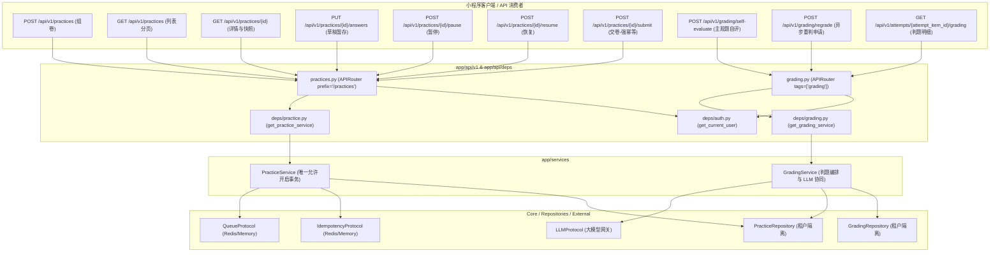

# Spec: 练习会话与判题自评 API 路由 - 技术契约

- **关联 Intent**: ZL-127
- **主导设计人**: TechLead
- **当前状态**: In-Review
- **Change Tier**: Tier 2 (单模块特性演进 / 外部接口与协议入口)

---

## 1. 架构流向与设计方案

本模块位于智练五层单向架构矩阵的 `app/api/v1`（路由控制层）与 `app/api/deps`（依赖注入层），向下单向依赖 `app/services`。严格遵循 AGENTS.md 规范与单向分层铁律：
1. **纯解析与透传**：路由处理函数仅做入参 Pydantic 解析、参数格式校验、依赖注入装配、调用 Service 层编排方法与响应 DTO 序列化，严禁在路由层执行超过 1 行的业务判断；
2. **绝对防越权与无事务**：所有路由强制通过 `Depends(get_current_user)` 获取已认证用户实体，并将 `user.id` 100% 显式透传至 Service 层方法；路由层严禁开启数据库事务，事务边界与回滚完全由 `PracticeService` 与 `GradingService` 内部管控；
3. **单向禁止跨层**：路由层与依赖层绝对禁止导入 `app.repositories` 或 ORM 原生会话，通过 `tooling/check_layers.py` 自动化静态检查。

### 架构调用链与端点拓扑



---

## 2. API 与数据契约设计

### 2.1 练习会话路由与 DTO (`app/api/v1/practices.py` & `app/schemas/practice.py`)

#### (1) `POST /api/v1/practices` - 创建练习会话 (组卷)
- **HTTP 状态码**: 201 Created
- **鉴权**: 必须 (`Depends(get_current_user)`)
- **入参 DTO (`PracticeCreateRequest`)**:
  ```json
  {
    "title": "计算机网络第3章-专项练习",
    "material_id": "3fa85f64-5717-4562-b3fc-2c963f66afa6",
    "knowledge_point_ids": [
      "9a181ce4-6ef6-4df0-b80c-03c734b07c91"
    ],
    "question_count": 10,
    "question_types": ["single_choice", "multiple_choice", "short_answer"],
    "difficulty": 3,
    "mode": "sequential",
    "source_type": "normal",
    "source_report_id": null
  }
  ```
  - 字段约束：
    - `title`: `str`, min_length=1, max_length=128
    - `material_id`: `UUID`
    - `knowledge_point_ids`: `list[UUID]`, min_length=1
    - `question_count`: `int`, ge=1, le=50, default=10
    - `question_types`: `list[str] | None`, 可选题型过滤
    - `difficulty`: `int | None`, ge=1, le=5
    - `mode`: `str`, 枚举值 `sequential` | `random` | `weak_points`，默认 `sequential`
    - `source_type`: `str`, 枚举值 `normal` | `weakness`，默认 `normal`
    - `source_report_id`: `UUID | None`
- **出参 DTO (`PracticeCreateResponse`)**:
  ```json
  {
    "id": "7c9e6679-7425-40de-944b-e07fc1f90ae7",
    "material_id": "3fa85f64-5717-4562-b3fc-2c963f66afa6",
    "title": "计算机网络第3章-专项练习",
    "status": "not_started",
    "question_count": 10,
    "source_type": "normal",
    "source_report_id": null,
    "created_at": "2026-09-24T12:00:00Z"
  }
  ```
- **异常响应**:
  - 400 (`PracticeEmptyQuestionsError` / 40012): 可用题目不足以满足组卷出题要求。

#### (2) `GET /api/v1/practices` - 练习会话历史列表 (分页与过滤)
- **HTTP 状态码**: 200 OK
- **查询参数**:
  - `material_id`: `UUID | None`
  - `status`: `str | None` (过滤 `not_started`, `in_progress`, `partially_graded`, `completed`, `paused`)
  - `limit`: `int = 20`, ge=1, le=100
  - `offset`: `int = 0`, ge=0
- **出参 DTO (`PracticeListResponse`)**:
  ```json
  {
    "items": [
      {
        "id": "7c9e6679-7425-40de-944b-e07fc1f90ae7",
        "material_id": "3fa85f64-5717-4562-b3fc-2c963f66afa6",
        "title": "计算机网络第3章-专项练习",
        "status": "in_progress",
        "question_count": 10,
        "total_score": null,
        "max_score": 10.0,
        "source_type": "normal",
        "created_at": "2026-09-24T12:00:00Z",
        "submitted_at": null,
        "completed_at": null
      }
    ],
    "total": 1,
    "limit": 20,
    "offset": 0
  }
  ```

#### (3) `GET /api/v1/practices/{id}` - 练习会话详情与作答题目快照
- **HTTP 状态码**: 200 OK
- **路径参数**: `id: UUID`
- **出参 DTO (`PracticeDetailResponse`)**:
  - 包含卷面信息及按 `order_index` 升序排序的题目作答项列表：
  ```json
  {
    "id": "7c9e6679-7425-40de-944b-e07fc1f90ae7",
    "material_id": "3fa85f64-5717-4562-b3fc-2c963f66afa6",
    "title": "计算机网络第3章-专项练习",
    "status": "in_progress",
    "question_count": 10,
    "total_score": null,
    "max_score": 10.0,
    "source_type": "normal",
    "source_report_id": null,
    "created_at": "2026-09-24T12:00:00Z",
    "submitted_at": null,
    "completed_at": null,
    "items": [
      {
        "id": "8d0f778a-8536-41ef-a55c-f18fd2f01bf8",
        "question_id": "1a2b3c4d-5e6f-7a8b-9c0d-1e2f3a4b5c6d",
        "order_index": 1,
        "question_snapshot": {
          "stem": "TCP 建立连接需要几次握手？",
          "question_type": "single_choice",
          "options": [
            {"key": "A", "content": "1次"},
            {"key": "B", "content": "2次"},
            {"key": "C", "content": "3次"},
            {"key": "D", "content": "4次"}
          ],
          "answer": "C",
          "analysis": "TCP通过三次握手建立可靠连接",
          "difficulty": 2
        },
        "user_answer": "C",
        "is_answered": true,
        "duration_seconds": 15,
        "score": 1.0,
        "max_score": 1.0
      }
    ]
  }
  ```
- **异常响应**:
  - 404 (`PracticeNotFoundError` / 40010): 练习不存在或越权访问。

#### (4) `PUT /api/v1/practices/{id}/answers` - 逐题作答草稿实时暂存
- **HTTP 状态码**: 200 OK
- **路径参数**: `id: UUID`
- **入参 DTO (`PracticeSaveAnswerRequest`)**:
  ```json
  {
    "question_id": "1a2b3c4d-5e6f-7a8b-9c0d-1e2f3a4b5c6d",
    "user_answer": "C",
    "duration_seconds": 15
  }
  ```
  - 字段约束：
    - `question_id`: `UUID`
    - `user_answer`: `str | None`
    - `duration_seconds`: `int = 0`, ge=0
- **出参 DTO (`PracticeSaveAnswerResponse`)**:
  ```json
  {
    "attempt_item_id": "8d0f778a-8536-41ef-a55c-f18fd2f01bf8",
    "practice_id": "7c9e6679-7425-40de-944b-e07fc1f90ae7",
    "question_id": "1a2b3c4d-5e6f-7a8b-9c0d-1e2f3a4b5c6d",
    "user_answer": "C",
    "is_answered": true,
    "duration_seconds": 15
  }
  ```
- **异常响应**:
  - 404 (`PracticeNotFoundError` / 40010): 练习或题目作答项不存在。
  - 400 (`PracticeStatusError` / 40011): 练习已处于 `completed` 终态，禁止修改作答。

#### (5) `POST /api/v1/practices/{id}/pause` 与 `POST /api/v1/practices/{id}/resume` - 练习暂停与恢复
- **HTTP 状态码**: 200 OK
- **出参 DTO (`PracticeStatusActionResponse`)**:
  ```json
  {
    "id": "7c9e6679-7425-40de-944b-e07fc1f90ae7",
    "status": "paused"
  }
  ```
- **异常响应**:
  - 400 (`PracticeStatusError` / 40011): 当前状态不允许暂停或恢复。

#### (6) `POST /api/v1/practices/{id}/submit` - 提交交卷 (强幂等拦截与队列调度)
- **HTTP 状态码**: 200 OK
- **路径参数**: `id: UUID`
- **请求头**: `Idempotency-Key` (强幂等键，必填，1~64 字符 UUIDv4 格式)
- **入参 DTO (`PracticeSubmitRequest`)**:
  ```json
  {
    "confirm_unanswered": false
  }
  ```
- **出参 DTO (`PracticeSubmitResponse`)**:
  ```json
  {
    "practice_id": "7c9e6679-7425-40de-944b-e07fc1f90ae7",
    "task_id": "task_grading_7c9e6679",
    "status": "completed",
    "total_questions": 10,
    "answered_questions": 10,
    "unanswered_count": 0,
    "submitted_at": "2026-09-24T12:30:00Z"
  }
  ```
- **异常响应**:
  - 400 (`IdempotencyKeyInvalidError` / 30018): 幂等键缺失、格式非法或超长。
  - 409 (`IdempotencyConflictError` / 30017): 并发交卷冲突处理中。
  - 400 (`PracticeStatusError` / 40011): 存在未作答题目且 `confirm_unanswered=False`，或练习状态不处于 `in_progress` / `not_started` / `paused`。
  - 404 (`PracticeNotFoundError` / 40010): 练习不存在或越权。

---

### 2.2 判题自评与重判路由与 DTO (`app/api/v1/grading.py` & `app/schemas/grading.py`)

#### (1) `POST /api/v1/grading/self-evaluate` - 主观题用户自主评分
- **HTTP 状态码**: 200 OK
- **入参 DTO (`SelfEvaluateRequest`)**:
  ```json
  {
    "attempt_item_id": "8d0f778a-8536-41ef-a55c-f18fd2f01bf8",
    "score": 4.5,
    "is_correct": true,
    "feedback": "回答涵盖了握手过程但丢失了 SYN-ACK 具体包头标志阐述"
  }
  ```
  - 字段约束：
    - `attempt_item_id`: `UUID`
    - `score`: `float`, ge=0.0
    - `is_correct`: `bool | None`, 若为 None 则服务端依据 `score > 0` 自动判定
    - `feedback`: `str | None`, max_length=1000
- **出参 DTO (`GradingRecordResponse`)**:
  ```json
  {
    "id": "b3e94472-3580-48e0-bb15-62bb82a87311",
    "practice_id": "7c9e6679-7425-40de-944b-e07fc1f90ae7",
    "attempt_item_id": "8d0f778a-8536-41ef-a55c-f18fd2f01bf8",
    "question_id": "1a2b3c4d-5e6f-7a8b-9c0d-1e2f3a4b5c6d",
    "channel": "user_self",
    "status": "success",
    "is_final": true,
    "score": 4.5,
    "max_score": 5.0,
    "similarity_score": null,
    "confidence": 1.0,
    "feedback": "回答涵盖了握手过程但丢失了 SYN-ACK 具体包头标志阐述",
    "hit_keywords": [],
    "missing_keywords": [],
    "created_at": "2026-09-24T12:35:00Z"
  }
  ```
- **异常响应**:
  - 400 (`GradingNotAllowedError` / 40014): 客观题禁止自评，或评分超出题目 `max_score`。
  - 404 (`AttemptItemNotFoundError` / 40013): 作答项不存在或越权。

#### (2) `POST /api/v1/grading/regrade` - 申请重新判题
- **HTTP 状态码**: 200 OK
- **入参 DTO (`RegradeAttemptRequest`)**:
  ```json
  {
    "attempt_item_id": "8d0f778a-8536-41ef-a55c-f18fd2f01bf8"
  }
  ```
- **出参 DTO (`GradingRecordResponse`)**:
  - 返回经 LLM 重新判决并标记为 `is_final=True` 的新判题记录。
- **异常响应**:
  - 400 (`GradingNotAllowedError` / 40014): 客观题不支持重判，或题目未作答。
  - 404 (`AttemptItemNotFoundError` / 40013): 作答项不存在或越权。
  - 500 (`GradingExecutionError` / 40015): LLM 判题服务未配置或模型执行失败。

#### (3) `GET /api/v1/attempts/{attempt_item_id}/grading` - 作答判题记录与历史明细
- **HTTP 状态码**: 200 OK
- **路径参数**: `attempt_item_id: UUID`
- **出参 DTO (`AttemptGradingDetailResponse`)**:
  ```json
  {
    "attempt_item_id": "8d0f778a-8536-41ef-a55c-f18fd2f01bf8",
    "practice_id": "7c9e6679-7425-40de-944b-e07fc1f90ae7",
    "question_id": "1a2b3c4d-5e6f-7a8b-9c0d-1e2f3a4b5c6d",
    "current_record": {
      "id": "b3e94472-3580-48e0-bb15-62bb82a87311",
      "channel": "user_self",
      "status": "success",
      "is_final": true,
      "score": 4.5,
      "max_score": 5.0,
      "feedback": "回答涵盖了握手过程但丢失了 SYN-ACK 具体包头标志阐述",
      "hit_keywords": [],
      "missing_keywords": [],
      "created_at": "2026-09-24T12:35:00Z"
    },
    "history": [
      {
        "id": "a1b2c3d4-e5f6-7a8b-9c0d-1e2f3a4b5c6d",
        "channel": "ai",
        "status": "success",
        "is_final": false,
        "score": 3.0,
        "max_score": 5.0,
        "feedback": "基本正确，缺关键控制字段",
        "hit_keywords": ["三次握手"],
        "missing_keywords": ["SYN-ACK"],
        "created_at": "2026-09-24T12:30:10Z"
      }
    ]
  }
  ```
- **异常响应**:
  - 404 (`AttemptItemNotFoundError` / 40013): 作答项不存在或越权。

---

### 2.3 依赖注入工厂设计 (`app/api/deps/practice.py` & `app/api/deps/grading.py`)

#### `app/api/deps/practice.py`
```python
"""FastAPI 练习服务依赖注入模块。"""
from app.services.practice import PracticeService

def get_practice_service() -> PracticeService:
    """FastAPI 依赖项：获取 PracticeService 服务实例。
    
    在测试或生产中通过 app.dependency_overrides[get_practice_service] 注入。
    """
    raise NotImplementedError(
        "PracticeService 生产装配工厂尚未挂载，"
        "请在测试或路由中使用 dependency_overrides[get_practice_service] 注入"
    )
```

#### `app/api/deps/grading.py`
```python
"""FastAPI 判题服务依赖注入模块。"""
from app.services.grading import GradingService

def get_grading_service() -> GradingService:
    """FastAPI 依赖项：获取 GradingService 服务实例。
    
    在测试或生产中通过 app.dependency_overrides[get_grading_service] 注入。
    """
    raise NotImplementedError(
        "GradingService 生产装配工厂尚未挂载，"
        "请在测试或路由中使用 dependency_overrides[get_grading_service] 注入"
    )
```

---

## 3. 可测性设计 (Design for Testability)

### 3.1 独立纯函数计算核
- 路由层无状态且完全无复杂判断，参数合法性通过 Pydantic v2 声明式校验；
- 幂等键校验纯函数 `validate_idempotency_key` 位于 `app.integrations.idempotency.protocol`；
- 快照完整性纯函数 `validate_question_snapshot` 与状态跃迁决策纯函数 `validate_practice_transition` 位于 `app.models.practice`，已具备 100% 独立覆盖。

### 3.2 外部依赖与 Mock 策略
1. **网络绝对隔离与零外部依赖**：
   - 依赖注入统一采用 FastAPI `app.dependency_overrides`；
   - 测试通过 Mock `get_current_user`、`get_practice_service` 与 `get_grading_service`，毫秒级快速断言 HTTP 状态码、响应体结构与异常捕获映射；
2. **AppError 全局异常处理器契约验证**：
   - 测试客户端统一挂载 `AppError` 异常处理器，验证抛出 `PracticeNotFoundError`、`PracticeStatusError`、`PracticeEmptyQuestionsError`、`AttemptItemNotFoundError`、`GradingNotAllowedError`、`GradingExecutionError`、`IdempotencyConflictError` 时，返回精准对应的 HTTP 状态码与统一 JSON 结构 (`code`, `message`, `details`, `data`)。

---

## 4. 替代方案与权衡考量 (Alternatives Considered & Trade-offs)

### 4.1 路由路径划分方案权衡
- **方案 A（统一大路由）**：全部路由统一挂载于 `/api/v1/practices`，判题作为子资源 `/api/v1/practices/{id}/items/{item_id}/grading`。
  - *缺点*：URL 路径层级过深，自评与重判不仅针对整卷，也针对单次答卷项；且后续批量判题与后台任务调度无法与练习强绑定。
- **方案 B（领域正交拆分 - 采纳）**：
  - 练习会话与生命周期收敛于 `/api/v1/practices`；
  - 判题评分操作收敛于 `/api/v1/grading`（如 `/grading/self-evaluate`, `/grading/regrade`）；
  - 题目作答判题历史资源通过 `/api/v1/attempts/{attempt_item_id}/grading` 访问。
  - *优势*：完全符合 RESTful 规范，与底层 `PracticeService` 及 `GradingService` 职责正交对应。

### 4.2 路由层与仓储层调用权衡
- **方案 A（路由直通仓储查询）**：查询判题历史时，路由直接导入 `GradingRepository` 查询并返回。
  - *否决*：严重违反智练 5 层单向架构铁律（禁止跨层导入 `app.repositories`），无法通过 `tooling/check_layers.py` 门禁。
- **方案 B（严格透传 Service - 采纳）**：
  - 路由仅调用 `PracticeService` 与 `GradingService`。查询接口若 Service 尚未暴露细粒度只读方法，在 Service 层补充相应只读透传方法，保证架构边界整洁。

---

## 5. 动态风险核验与回滚预案 (Risk & Rollback Verification)

### 7 维动态风险扫描评估

| 风险维度 | 评估判定 | 详细说明与防护手段 |
| :--- | :--- | :--- |
| **1. Affected Files** | 7 个文件 | 新增 2 个路由文件、2 个 Schema 文件、2 个 Deps 文件，更新 1 个 API 聚合文件。无存量代码侵入。 |
| **2. Public API** | 增量新增 | 全新增加 `/api/v1/practices`、`/api/v1/grading` 与 `/api/v1/attempts` 路由，不改变任何既有端点契约。 |
| **3. Data Schema** | 0 影响 | 沿用 ZL-122、ZL-123 已就绪的 `practices`, `attempt_items`, `grading_records` 数据表与 ORM 模型。 |
| **4. Auth & Security** | 核心保障 | 100% 端点接入 `Depends(get_current_user)`，租户用户 UUID 逐层透传，无未授权访问与越权漏洞。 |
| **5. Dependencies** | 0 引入 | 仅依赖 FastAPI、Pydantic v2 原生能力，无任何新增第三方依赖。 |
| **6. Rollback Difficulty** | 极低可逆 | 纯代码增量变更，回滚仅需从 `app/api/v1/__init__.py` 中移除挂载路由即可立即切断入口。 |
| **7. Blast Radius** | 局部低影响 | 不改变核心启动引导或后台常驻进程，错误仅局限于当前 HTTP 请求级别。 |

### 评级确认
经 7 维动态扫描，虽然文件数达到 7 个，但均为同一模块边界下的控制器与契约声明，属于标椎的 **Tier 2 (单模块特性演进)**，无需升级 Tier 3。

### 标注关键关注点 (Flagged Concerns)
1. **交卷并发与强幂等锁超时**：`submit_practice` 依赖分布式锁与快照回放，客户端交卷必须强制携带 `Idempotency-Key`。若网络抖动引发并发双击，必须返回 409 状态码 (`IdempotencyConflictError`) 或回放快照，禁止重复入队判题。
2. **作答草稿实时同步高频并发**：客户端在做题过程中每答一题调用一次 `PUT /practices/{id}/answers`。该接口必须保持极简极快，仅做单表原子更新，严禁附加耗时的联表统计与外部调用。
3. **日志绝密脱敏红线**：路由层与中间件严禁记录 `user_answer`（用户作答原文）、`stem`、`answer`（题干与参考答案）。日志 8 要素仅输出字符长度 `ans_len` 与状态指示。

### 回滚预案
若接口部署后发现未知异常：
1. **代码级快速回滚**：Git Revert 对应提交，或直接在 `backend/app/api/v1/__init__.py` 中注释 `practices_router` 与 `grading_router` 挂载；
2. **零迁移代价**：本次无数据库结构变动，无需执行任何 Alembic 数据库降级迁移脚本。

---

## 6. 阶段准出签批 (Gate 2 Sign-off)
- [x] 架构流向与 API 契约已冻结
- [x] 替代方案已完成推演与权衡
- [x] 7 维风险已核验且具备明确回滚预案
- **审查结论**: Approved
- **签批人 / 日期**: TechLead / 2026-09-24 20:56
