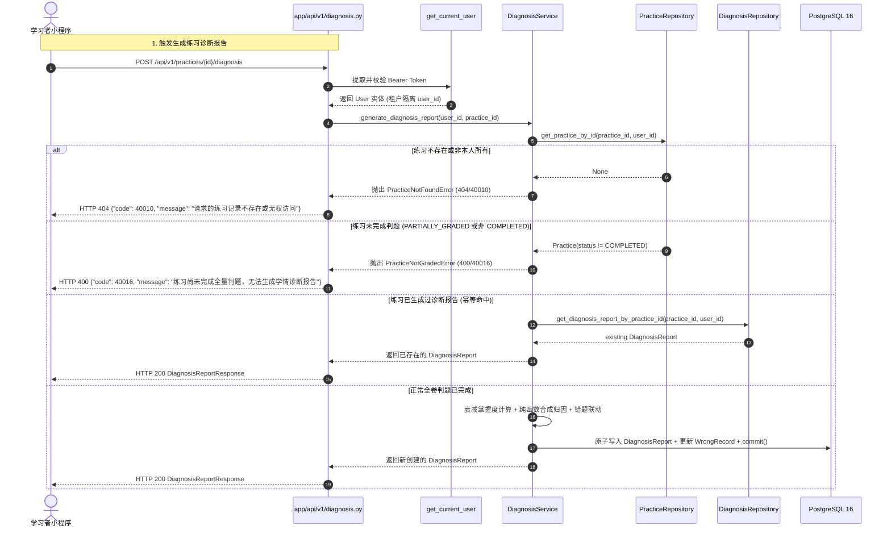

# Spec: 诊断报告与错题闭环 API 路由 - 技术契约

- **关联 Intent**: ZL-128
- **主导设计人**: TechLead
- **当前状态**: In-Review
- **任务分级**: Tier 2 (单模块特性演进 / 外部接口层适配增量)

---

## 1. 架构流向与设计方案

### 1.1 模块定位与分层依赖拓扑
本特性严格遵循系统 5 层单向架构：
`小程序客户端 / 外部请求` $\rightarrow$ `app/api/v1/diagnosis.py` (路由控制层) $\rightarrow$ `app/services/diagnosis.py` (`DiagnosisService` 事务编排) $\rightarrow$ `app/repositories/diagnosis.py` (数据持久化)。
纯函数计算核 `app/core/algorithms/diagnosis.py` 与 `app/core/algorithms/mastery.py` 保持物理隔离，仅由 Service 层调度。

```mermaid
flowchart TD
    subgraph ClientLayer["客户端 (Miniprogram / TestClient)"]
        Client[微信小程序 / 测试用例]
    end

    subgraph ApiLayer["API 控制与依赖注入层 (app/api)"]
        AuthDep["get_current_user (app/api/deps/auth)"]
        DiagDep["get_diagnosis_service (app/api/deps/diagnosis)"]
        DiagRouter["diagnosis.py (app/api/v1/diagnosis)"]
        DiagSchema["Pydantic v2 DTOs (app/schemas/diagnosis)"]
    end

    subgraph ServiceLayer["业务编排与事务层 (app/services)"]
        DiagService["DiagnosisService (app/services/diagnosis.py)"]
        TxBoundary["数据库事务 (session.commit / rollback)"]
    end

    subgraph PureAlgorithms["纯函数计算核 (app/core/algorithms)"]
        SynthesizeAlgo["synthesize_diagnosis_report"]
        MasteryAlgo["aggregate_mastery_scores"]
    end

    subgraph RepoLayer["数据仓储层 (app/repositories)"]
        DiagRepo["DiagnosisRepository"]
        PracRepo["PracticeRepository"]
        KnowRepo["KnowledgeRepository"]
    end

    Client -->|Bearer Token + HTTP 请求| DiagRouter
    DiagRouter -->|解析鉴权| AuthDep
    DiagRouter -->|获取服务实例| DiagDep
    DiagRouter -->|DTO 校验与序列化| DiagSchema
    DiagRouter -->|委托调用 (透传 user_id)| DiagService
    
    DiagService -->|纯数据结构入参| PureAlgorithms
    DiagService -->|封装事务边界| TxBoundary
    TxBoundary -->|带 user_id 查询/持久化| DiagRepo
    TxBoundary -->|校验练习归属| PracRepo
    TxBoundary -->|加载知识点元数据| KnowRepo
```

### 1.2 核心业务调用链与状态机防错流转



---

## 2. API 与数据契约设计

### 2.1 依赖注入工厂设计 (`app/api/deps/diagnosis.py`)
```python
"""FastAPI 学情诊断服务依赖注入模块。

提供解析与获取 DiagnosisService 业务编排服务实例的依赖项。
严格遵循 AGENTS.md 架构分层规范：
- 本模块严禁直接跨层导入仓储层 (app.repositories)；
- 缩写白名单仅限 api, id, url, ocr, llm, db, config, env。
"""

from app.services.diagnosis import DiagnosisService


def get_diagnosis_service() -> DiagnosisService:
    """FastAPI 依赖项：获取 DiagnosisService 服务实例。

    在生产环境下由服务装配工厂提供；
    在单元测试中通过 app.dependency_overrides[get_diagnosis_service] 注入。

    Returns:
        DiagnosisService: 诊断与错题联动编排服务。

    Raises:
        NotImplementedError: 在外部服务层装配前直接调用时提醒依赖注入覆盖。
    """
    raise NotImplementedError(
        "DiagnosisService 生产装配工厂尚未挂载，"
        "请在测试或路由中使用 dependency_overrides[get_diagnosis_service] 注入"
    )
```

### 2.2 数据传输对象 DTO (`app/schemas/diagnosis.py`)
Pydantic v2 模型定义，配置 `ConfigDict(from_attributes=True)`，严格遵守全英文标识符与 8 个缩写白名单。

#### 2.2.1 诊断报告相关 DTO
- `MistakeEvidenceItemDTO`: 关联错题证据
  - `question_id`: `uuid.UUID | str`
  - `is_negation_inversion`: `bool` (默认 `False`)
- `WeakKnowledgeItemDTO`: 主要薄弱知识点条目
  - `knowledge_id`: `str`
  - `knowledge_title`: `str`
  - `current_score`: `float`
  - `previous_score`: `float | None`
  - `score_delta`: `float`
  - `cause_type`: `str`
  - `cause_explanation`: `str`
  - `actionable_advice`: `str`
  - `associated_mistakes`: `list[MistakeEvidenceItemDTO]`
- `RegressedKnowledgeItemDTO`: 退步知识点条目
  - `knowledge_id`: `str`
  - `knowledge_title`: `str`
  - `current_score`: `float`
  - `previous_score`: `float | None`
  - `score_delta`: `float`
  - `cause_type`: `str`
  - `cause_explanation`: `str`
  - `actionable_advice`: `str`
- `AnalysisCauseItemDTO`: 归因详情
  - `knowledge_id`: `str`
  - `cause_type`: `str`
  - `explanation`: `str`
- `ActionableSuggestionItemDTO`: 复习行动建议
  - `action`: `str`
- `DiagnosisReportResponse`: 诊断报告整体响应
  - `id`: `uuid.UUID`
  - `practice_id`: `uuid.UUID`
  - `weak_knowledge_points`: `list[WeakKnowledgeItemDTO]`
  - `regressed_knowledge_points`: `list[RegressedKnowledgeItemDTO]`
  - `analysis_causes`: `list[AnalysisCauseItemDTO]`
  - `actionable_suggestions`: `list[ActionableSuggestionItemDTO]`
  - `unanswered_count`: `int`
  - `wrong_count`: `int`
  - `pending_regrade_count`: `int`
  - `total_questions`: `int`
  - `score_rate`: `float`
  - `is_structure_degraded`: `bool`
  - `created_at`: `datetime | None`
- `DiagnosisReportListResponse`: 诊断报告分页列表
  - `items`: `list[DiagnosisReportResponse]`
  - `total`: `int`
  - `page`: `int`
  - `page_size`: `int`

#### 2.2.2 掌握度相关 DTO
- `KnowledgeMasterySummaryResponse`: 单知识点掌握度汇总
  - `knowledge_point_id`: `uuid.UUID`
  - `knowledge_name`: `str`
  - `mastery_score`: `float`
  - `level`: `str`
  - `practice_count`: `int`
  - `correct_count`: `int`
  - `last_practiced_at`: `datetime | None`
- `UserMasteryOverviewResponse`: 用户资料掌握度总览
  - `material_id`: `uuid.UUID`
  - `overall_mastery_score`: `float`
  - `total_knowledge_points`: `int`
  - `unlearned_count`: `int`
  - `weak_count`: `int`
  - `basic_count`: `int`
  - `proficient_count`: `int`
  - `weak_knowledge_points`: `list[KnowledgeMasterySummaryResponse]`

#### 2.2.3 错题本相关 DTO
- `WrongRecordItemResponse`: 错题记录明细
  - `id`: `uuid.UUID`
  - `question_id`: `uuid.UUID | None`
  - `knowledge_point_id`: `uuid.UUID`
  - `practice_id`: `uuid.UUID`
  - `attempt_item_id`: `uuid.UUID`
  - `error_type`: `str`
  - `error_count`: `int`
  - `is_mastered`: `bool`
  - `question_snapshot`: `dict[str, Any]` (题干、选项、解析等完整快照)
  - `first_wrong_at`: `datetime`
  - `mastered_at`: `datetime | None`
  - `created_at`: `datetime | None`
  - `updated_at`: `datetime | None`
  - *(注: 严禁暴露 `last_wrong_answer` 给无需此字段的端点，或仅在学生复盘自己错题时按需脱敏输出)*
- `WrongRecordListResponse`: 错题记录列表响应
  - `items`: `list[WrongRecordItemResponse]`
  - `total`: `int`
  - `page`: `int`
  - `page_size`: `int`
- `MarkWrongRecordMasteredResponse`: 标记错题已掌握响应
  - `id`: `uuid.UUID`
  - `is_mastered`: `bool`
  - `mastered_at`: `datetime | None`
  - `message`: `str`
- `DeleteWrongRecordResponse`: 删除错题响应
  - `id`: `uuid.UUID`
  - `success`: `bool`
  - `message`: `str`

### 2.3 路由端点设计清单 (`app/api/v1/diagnosis.py`)

| 方法 | 路由路径 | 状态码 | 请求参数 / Query / Body | 响应模型 | 异常抛出与映射 | 职责与防越权 |
| :--- | :--- | :--- | :--- | :--- | :--- | :--- |
| `POST` | `/practices/{id}/diagnosis` | `200 OK` | 路径参数 `id: uuid.UUID` | `DiagnosisReportResponse` | 400 (40016), 404 (40010) | 触发生成学情诊断报告（全卷判题完成前阻断；已生成幂等返回） |
| `GET` | `/practices/{id}/diagnosis` | `200 OK` | 路径参数 `id: uuid.UUID` | `DiagnosisReportResponse` | 404 (40017) | 查询指定练习已生成的诊断报告 |
| `GET` | `/diagnosis/reports` | `200 OK` | `page: int = 1`, `page_size: int = 20` | `DiagnosisReportListResponse` | - | 分页查询当前用户的所有历史学情诊断报告 |
| `GET` | `/diagnosis/reports/{id}` | `200 OK` | 路径参数 `id: uuid.UUID` | `DiagnosisReportResponse` | 404 (40017) | 根据报告主键查询诊断报告详情 |
| `GET` | `/mastery/overview` | `200 OK` | Query: `material_id: uuid.UUID` | `UserMasteryOverviewResponse` | - | 获取用户在指定教材资料下的知识点掌握度全景 |
| `GET` | `/mastery/{knowledge_point_id}` | `200 OK` | 路径参数 `knowledge_point_id: uuid.UUID` | `KnowledgeMasterySummaryResponse` | 404 (40018) | 查询当前用户单个知识点的掌握度衰减聚合数据 |
| `GET` | `/wrong-records` | `200 OK` | Query: `material_id: uuid.UUID?`, `knowledge_point_id: uuid.UUID?`, `is_mastered: bool?`, `status: str?`, `page: int = 1`, `page_size: int = 20` | `WrongRecordListResponse` | - | 多维分页检索用户错题本 (带原题快照) |
| `POST` | `/wrong-records/{id}/master` | `200 OK` | 路径参数 `id: uuid.UUID` | `MarkWrongRecordMasteredResponse` | 404 (40019) | 手动将错题标记为已消灭/已攻克 |
| `DELETE` | `/wrong-records/{id}` | `200 OK` | 路径参数 `id: uuid.UUID` | `DeleteWrongRecordResponse` | 404 (40019) | 从错题本彻底移除错题记录 |

### 2.4 异常体系与 HTTP 映射矩阵
所有异常继承自 `app.core.errors.AppError`，由全局异常处理器拦截输出规范 JSON。

| 异常类 | 错误码 (Error Code) | HTTP 状态码 | 触发场景 | 面向用户提示文案 |
| :--- | :--- | :--- | :--- | :--- |
| `PracticeNotGradedError` | `40016` | `400 Bad Request` | 练习处于 `PARTIALLY_GRADED` 或存在待重判题目时调用生成报告 | 练习尚未完成全量判题，无法生成学情诊断报告 |
| `PracticeNotFoundError` | `40010` | `404 Not Found` | 请求的练习不存在或跨租户非法访问 | 请求的练习记录不存在或无权访问 |
| `DiagnosisReportNotFoundError` | `40017` | `404 Not Found` | 练习尚未生成诊断报告或通过报告 ID 检索不存在 | 学情诊断报告不存在或无权访问 |
| `MasteryRecordNotFoundError` | `40018` | `404 Not Found` | 指定知识点尚无作答记录且未形成掌握度档案 | 该知识点尚未产生掌握度评估记录 |
| `WrongRecordNotFoundError` | `40019` | `404 Not Found` | 操作的错题记录不存在或属于其他租户 | 错题记录不存在或无权访问 |
| `AuthenticationError` | `20001` | `401 Unauthorized` | 缺少 Authorization 请求头或 Token 签名失效/过期 | 认证凭据无效或已过期，请重新登录 |

---

## 3. 可测性设计 (Design for Testability)

### 3.1 独立纯函数计算核隔离验证
- 本 API 路由依赖底层已交付的两个无副作用纯函数：
  1. `app.core.algorithms.diagnosis.synthesize_diagnosis_report`（退步判定、四类认知成因归因）；
  2. `app.core.algorithms.mastery.aggregate_mastery_scores`（30 天半衰期时间衰减掌握度）。
- 路由层不直接调用上述算法，而是由 `DiagnosisService` 协调调度，保持路由控制逻辑与算法逻辑解耦。

### 3.2 依赖注入与测试 Mock 策略
1. **网络与数据库绝对隔离**: 单元测试中不建立真实 PostgreSQL 连接，不消耗真实网络连接；
2. **FastAPI Dependency Overrides**:
   - `app.dependency_overrides[get_current_user]`: 注入标准 `User(id=fixed_uuid, ...)` 实体；
   - `app.dependency_overrides[get_diagnosis_service]`: 注入 `unittest.mock.MagicMock(spec=DiagnosisService)`；
3. **测试覆盖矩阵设计 (`backend/tests/unit/api/test_diagnosis_router.py`)**:
   - `test_generate_diagnosis_report_success`: 成功生成诊断报告，校验 HTTP 200 与各个字段序列化；
   - `test_generate_diagnosis_report_practice_not_graded_400`: 模拟 `PracticeNotGradedError`，校验 HTTP 400 与错误码 40016；
   - `test_generate_diagnosis_report_practice_not_found_404`: 模拟 `PracticeNotFoundError`，校验 HTTP 404 与错误码 40010；
   - `test_get_diagnosis_report_by_practice_success`: 根据练习 ID 查询诊断报告成功；
   - `test_get_diagnosis_report_by_practice_not_found_404`: 模拟 `DiagnosisReportNotFoundError`，校验 HTTP 404 与错误码 40017；
   - `test_list_diagnosis_reports_success`: 分页查询报告列表；
   - `test_get_diagnosis_report_by_id_success`: 根据报告主键查询成功与 404；
   - `test_get_mastery_overview_success`: 查询资料掌握度全景，验证四档数量统计与薄弱知识点列表；
   - `test_get_single_knowledge_mastery_success`: 查询单知识点掌握度与 404 容错；
   - `test_list_wrong_records_filters_and_pagination`: 验证按 `material_id`, `is_mastered`, `status` 等组合过滤；
   - `test_mark_wrong_record_mastered_success_and_not_found`: 验证错题攻克标记 200 与 404；
   - `test_delete_wrong_record_success_and_not_found`: 验证错题删除 200 与 404；
   - `test_unauthenticated_requests_401`: 验证无 Token 访问被标准拦截 401。

---

## 4. 替代方案与权衡考量 (Alternatives Considered & Trade-offs)

### 4.1 方案对比
| 维度 | 方案 A: 路由拆解三文件 (`practices_diagnosis.py`, `mastery.py`, `wrong_records.py`) | 方案 B (采纳): 统一收敛至 `diagnosis.py` | 方案 C: 将诊断生成挂入 `practices.py`，错题独立 |
| :--- | :--- | :--- | :--- |
| **文件数量与架构清晰度** | 增加 3 个路由文件与 3 个依赖注入文件，较为分散 | 单个文件约 250 行，聚合在 `diagnosis.py`，职责内聚统一 | 拆裂了诊断报告与练习结果的内聚流转 |
| **状态机与错题闭环内聚性** | 跨文件相互引用依赖工厂，易产生循环依赖隐患 | 在同一个服务门面 `DiagnosisService` 与路由下闭环，清晰紧凑 | 错题本孤立，难以感知练习诊断上下文 |
| **KISS 原则与维护成本** | 产生大量过度样板代码 (Boilerplate) | **严格符合 KISS 原则**，单文件控制在 300 行内，易维护 | 混合在 400+ 行的 practices.py 中加剧臃肿 |

**采纳裁决**: 采纳方案 B。学情诊断、掌握度衰减沉淀与错题消灭构成了完整的学习反馈回路，收敛在 `app/api/v1/diagnosis.py`，代码量适中且保持了强内聚。

---

## 5. 动态风险核验与回滚预案 (Risk & Rollback Verification)

### 5.1 7 维动态风险核验
1. **Affected Files (受影响文件)**:
   - 新增 `backend/app/schemas/diagnosis.py` (DTO 定义)；
   - 新增 `backend/app/api/deps/diagnosis.py` (依赖注入工厂)；
   - 新增 `backend/app/api/v1/diagnosis.py` (RESTful 路由)；
   - 修改 `backend/app/api/v1/__init__.py` (路由汇聚挂载)；
   - 修改 `backend/app/core/errors.py` (补充 `WrongRecordNotFoundError` 404/40019)；
   - 新增 `backend/tests/unit/api/test_diagnosis_router.py` (全量单测用例)。
   *(文件范围严格控制在 API 控制层、依赖层与单测)*
2. **Public API (对外契约)**:
   - 全新增 RESTful 端点，完全向前兼容，无破坏性变更。
3. **Data Schema (持久化存储)**:
   - 0 数据库变更。底层表 `diagnosis_reports`, `mastery_records`, `wrong_records` 均已在先前迁移中就绪。
4. **Auth & Security (安全与隔离)**:
   - 全部端点均注入 `Depends(get_current_user)`，提取 `current_user.id` 传递给底层 Service，强力阻断水平越权；
   - 绝密脱敏红线：响应 DTO 绝不输出未经允许的敏感字段，错题本仅下发题目快照供前端渲染。
5. **Dependencies (外部依赖)**:
   - 0 新增外部依赖，完全基于现有 FastAPI 与 Pydantic v2。
6. **Rollback Difficulty (回滚难度)**:
   - 极低（纯增量代码）。若上线异常，仅需在 `app/api/v1/__init__.py` 中注释掉 `include_router(diagnosis_router)` 并重新部署，可在 1 分钟内完成无损回滚。
7. **Blast Radius (爆炸半径)**:
   - 局限于 `/api/v1/practices/{id}/diagnosis`、`/api/v1/mastery`、`/api/v1/wrong-records` 路径，完全不影响现有资料解析、出题组卷和答卷判题核心链路。

### 5.2 实施与回滚应急策略
- **上线前验证**:
  - 本地执行 `python3 tooling/check_layers.py --root backend/app` 验证单向分层 0 违规；
  - 本地执行 `pytest tests/unit/api/test_diagnosis_router.py` 覆盖率 $\ge 90\%$；
  - 执行 `cd backend && ruff format --check . && ruff check . && mypy app && bandit -r app -ll` 全绿。
- **回滚操作步骤**:
  - 执行 `git revert <commit-sha>`；
  - 触发 CI/CD 自动重新部署。

---

## 6. 阶段准出签批 (Gate 2 Sign-off)
- [x] 架构流向与 API 契约已冻结
- [x] 替代方案已完成推演与权衡
- [x] 7 维风险已核验且具备明确回滚预案
- **审查结论**: Approved
- **签批人 / 日期**: TechLead / 2026-09-24 21:55

