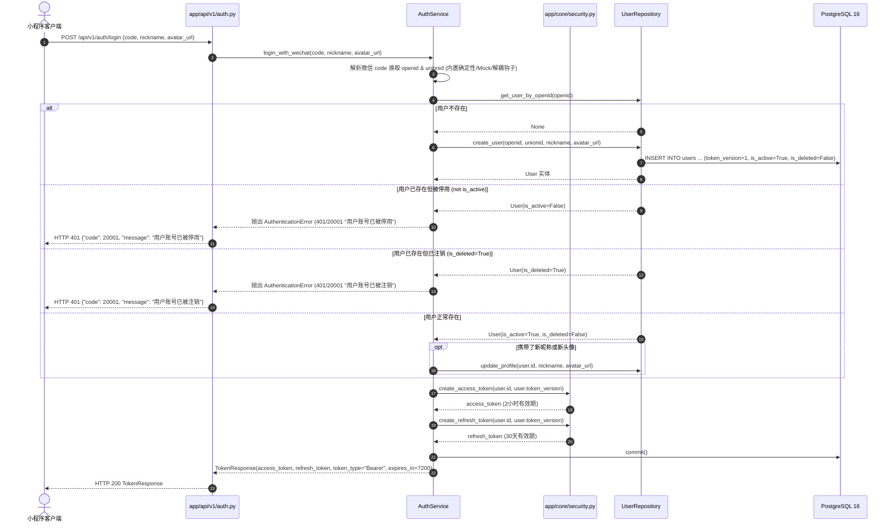
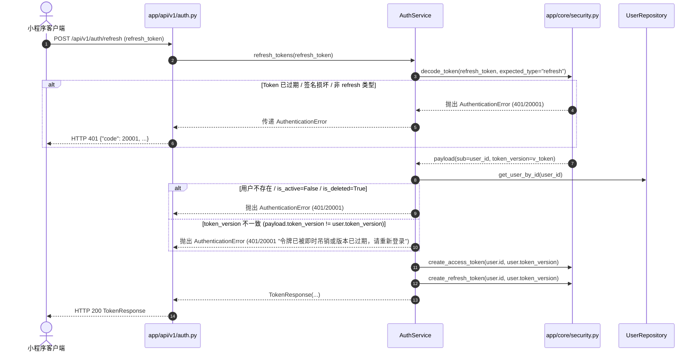
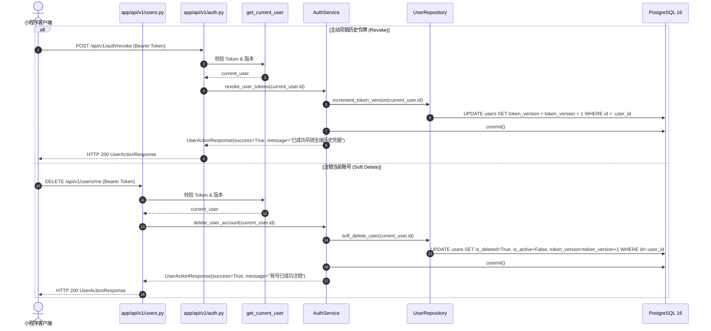

# Spec: 认证授权与用户管理 API 路由 - 技术契约

- **关联 Intent**: ZL-129
- **主导设计人**: TechLead
- **当前状态**: Draft / In-Review / Approved

---

## 1. 架构流向与设计方案

### 1.1 模块定位与分层依赖拓扑
本特性严格遵循系统 5 层单向架构：
`小程序客户端 / 外部请求` $\rightarrow$ `app/api/v1/auth.py` & `app/api/v1/users.py` (路由控制层) $\rightarrow$ `app/services/auth.py` (`AuthService` 事务编排) $\rightarrow$ `app/repositories/user.py` (`UserRepository` 数据持久化)。
纯函数计算核 `app/core/security.py`（无状态 JWT 签发/解码、版本校验与日志脱敏）保持物理隔离，由 Service 层与依赖注入层调用。

```mermaid
flowchart TD
    subgraph ClientLayer["客户端 (Miniprogram / TestClient)"]
        Client[微信小程序 / 测试客户端]
    end

    subgraph ApiLayer["API 控制与依赖注入层 (app/api)"]
        AuthRouter["auth.py (app/api/v1/auth)"]
        UsersRouter["users.py (app/api/v1/users)"]
        AuthDep["get_current_user / get_current_token_payload (app/api/deps/auth)"]
        AuthServiceDep["get_auth_service (app/api/deps/auth)"]
        UserServiceDep["get_user_service (app/api/deps/user)"]
        AuthSchemas["Pydantic v2 DTOs (app/schemas/auth & user)"]
    end

    subgraph ServiceLayer["业务编排与事务层 (app/services)"]
        AuthService["AuthService (app/services/auth.py)"]
        TxBoundary["数据库事务 (session.commit / rollback)"]
    end

    subgraph PureCore["纯函数计算核 (app/core)"]
        Security["app/core/security.py (create_access_token, decode_token, verify_token_version)"]
        Errors["app/core/errors.py (AppError, AuthenticationError)"]
    end

    subgraph RepoLayer["数据仓储层 (app/repositories)"]
        UserRepo["UserRepository (app/repositories/user.py)"]
        DB[(PostgreSQL 16 users 表)]
    end

    Client -->|HTTP POST /api/v1/auth/login,refresh,revoke| AuthRouter
    Client -->|HTTP GET/DELETE /api/v1/users/me| UsersRouter

    AuthRouter -->|依赖注入| AuthServiceDep
    UsersRouter -->|租户鉴权依赖| AuthDep
    UsersRouter -->|依赖注入| UserServiceDep
    AuthRouter -->|DTO 校验| AuthSchemas
    UsersRouter -->|DTO 校验| AuthSchemas

    AuthDep -->|验签与版本核验| Security
    AuthRouter -->|业务编排| AuthService
    UsersRouter -->|业务编排| AuthService

    AuthService -->|签发令牌/日志脱敏| Security
    AuthService -->|事务控制| TxBoundary
    TxBoundary -->|ORM 操作 (强制 user_id / openid)| UserRepo
    UserRepo -->|SQL 交互| DB
```

### 1.2 核心业务调用链与状态机防错流转

#### 1.2.1 微信登录与新用户注册 / 登录态换取


#### 1.2.2 令牌静默刷新 (Refresh Token -> 双新令牌)


#### 1.2.3 令牌版本主动吊销与账号注销 (Revoke & Soft Delete)


---

## 2. API 与数据契约设计

### 2.1 依赖注入工厂设计

#### 2.1.1 认证服务依赖注入工厂 (`app/api/deps/auth.py`)
在现有 `app/api/deps/auth.py` 中补充 `get_auth_service` 依赖工厂：
```python
def get_auth_service() -> AuthService:
    """FastAPI 依赖项：获取 AuthService 服务实例。

    在生产环境下由服务装配工厂提供；
    在单元测试中通过 app.dependency_overrides[get_auth_service] 注入。

    Returns:
        AuthService: 认证与账号管理业务编排服务。

    Raises:
        NotImplementedError: 在外部服务层装配前直接调用时提醒依赖注入覆盖。
    """
    raise NotImplementedError(
        "AuthService 生产装配工厂尚未挂载，"
        "请在测试或路由中使用 dependency_overrides[get_auth_service] 注入"
    )
```

#### 2.1.2 用户服务依赖注入工厂 (`app/api/deps/user.py`)
创建 `app/api/deps/user.py`，提供 `get_user_service` 依赖工厂（指向 `AuthService` 作为统一服务门面）：
```python
"""FastAPI 用户管理服务依赖注入模块。

提供解析与获取用户管理服务的依赖项。
严格遵循 AGENTS.md 架构分层规范：
- 本模块严禁直接跨层导入仓储层 (app.repositories)；
- 缩写白名单仅限 api, id, url, ocr, llm, db, config, env。
"""

from app.services.auth import AuthService


def get_user_service() -> AuthService:
    """FastAPI 依赖项：获取用户管理服务实例 (AuthService 门面)。

    Returns:
        AuthService: 用户管理编排服务。

    Raises:
        NotImplementedError: 在服务装配前直接调用时抛出。
    """
    raise NotImplementedError(
        "AuthService 生产装配工厂尚未挂载，"
        "请在测试或路由中使用 dependency_overrides[get_user_service] 注入"
    )


__all__ = ["get_user_service"]
```

### 2.2 数据传输对象 DTO (`app/schemas/auth.py` & `app/schemas/user.py`)

#### 2.2.1 认证 DTO (`app/schemas/auth.py`)
```python
"""认证与授权相关 Pydantic v2 数据契约与 DTO 定义。

严格遵循 AGENTS.md 规范：
- 字段类型完全标注，支持 Pydantic v2 与 from_attributes；
- 缩写白名单仅限 8 个 (api, id, url, ocr, llm, db, config, env)。
"""

from pydantic import BaseModel, ConfigDict, Field


class WechatLoginRequest(BaseModel):
    """微信登录置换令牌请求契约。"""

    model_config = ConfigDict(extra="forbid")

    code: str = Field(..., min_length=1, max_length=128, description="微信小程序临时登录凭据 code")
    nickname: str | None = Field(default=None, max_length=64, description="用户微信昵称 (可选)")
    avatar_url: str | None = Field(default=None, max_length=512, description="用户头像 URL (可选)")


class RefreshTokenRequest(BaseModel):
    """刷新令牌请求契约。"""

    model_config = ConfigDict(extra="forbid")

    refresh_token: str = Field(..., min_length=16, description="长效 Refresh Token 凭据")


class TokenResponse(BaseModel):
    """JWT 双令牌发放成功响应。"""

    model_config = ConfigDict(from_attributes=True)

    access_token: str = Field(..., description="短期访问凭证 Access Token (2小时有效)")
    refresh_token: str = Field(..., description="长期刷新凭证 Refresh Token (30天有效)")
    token_type: str = Field(default="Bearer", description="令牌类型，固定为 Bearer")
    expires_in: int = Field(default=7200, description="Access Token 过期剩余秒数 (默认 7200 秒)")
```

#### 2.2.2 用户管理 DTO (`app/schemas/user.py`)
```python
"""用户管理与画像响应 Pydantic v2 数据契约。

严格遵循 AGENTS.md 规范：
- 字段类型完全标注，支持 Pydantic v2 与 from_attributes；
- 缩写白名单仅限 8 个 (api, id, url, ocr, llm, db, config, env)。
"""

import uuid
from datetime import datetime

from pydantic import BaseModel, ConfigDict, Field


class UserProfileResponse(BaseModel):
    """用户个人画像与资料详情响应。"""

    model_config = ConfigDict(from_attributes=True)

    id: uuid.UUID = Field(..., description="用户唯一标识 UUIDv4")
    nickname: str = Field(..., description="用户昵称")
    avatar_url: str = Field(..., description="用户头像 URL")
    created_at: datetime | None = Field(default=None, description="账号创建时间")


class UserActionResponse(BaseModel):
    """用户通用操作结果响应契约 (如注销、吊销令牌等)。"""

    model_config = ConfigDict(from_attributes=True)

    success: bool = Field(..., description="操作是否执行成功")
    message: str = Field(..., description="面向用户的操作结果提示文案")
```

### 2.3 仓储层契约 (`app/repositories/user.py`)
```python
"""用户实体领域数据仓储模块。

封装针对 users 数据表的数据库原子操作。
严格遵循 AGENTS.md 规范：
- 涉及个人数据的方法必须以 user_id / openid 为基准条件，确保租户隔离；
- 仓储层严禁导入 fastapi 与 app.integrations；
- 缩写白名单仅限 8 个 (api, id, url, ocr, llm, db, config, env)。
"""

import uuid
from sqlalchemy.orm import Session

from app.models.user import User


class UserRepository:
    """用户领域数据仓储。"""

    def __init__(self, session: Session) -> None:
        self.session = session

    def create_user(
        self,
        *,
        openid: str,
        unionid: str | None = None,
        nickname: str = "",
        avatar_url: str = "",
    ) -> User:
        """创建新用户实体并 flush。"""
        ...

    def get_user_by_id(self, user_id: uuid.UUID) -> User | None:
        """根据用户主键 UUID 检索用户。"""
        ...

    def get_user_by_openid(self, openid: str) -> User | None:
        """根据微信 OpenID 检索用户。"""
        ...

    def update_profile(
        self,
        user_id: uuid.UUID,
        *,
        nickname: str | None = None,
        avatar_url: str | None = None,
    ) -> User | None:
        """更新用户基础画像资料 (昵称、头像)。"""
        ...

    def increment_token_version(self, user_id: uuid.UUID) -> int:
        """原子递增用户的 token_version，用于全端历史凭据即时失效。返回最新版本号。"""
        ...

    def soft_delete_user(self, user_id: uuid.UUID) -> bool:
        """将用户标记为软删除 (is_deleted=True, is_active=False)，并同时递增 token_version。"""
        ...
```

### 2.4 服务层契约 (`app/services/auth.py`)
```python
"""认证与账号管理业务编排服务模块。

负责统一编排事务、微信身份换取、JWT 双令牌签发、刷新、主动吊销及账号注销。
严格遵循 AGENTS.md 规范：
- 全系统唯一允许开启数据库事务的层；
- 结构化日志 8 要素输出，绝密脱敏红线严禁向日志记录明文密钥、Token 全文或明文 user_id；
- 缩写白名单仅限 8 个 (api, id, url, ocr, llm, db, config, env)。
"""

import uuid
from typing import Any
from sqlalchemy.orm import Session

from app.models.user import User
from app.repositories.user import UserRepository


class AuthService:
    """认证与用户管理领域编排服务。"""

    def __init__(
        self,
        session: Session,
        user_repository: UserRepository | None = None,
    ) -> None:
        self.session = session
        self.user_repository = user_repository or UserRepository(session)

    def login_with_wechat(
        self,
        code: str,
        nickname: str | None = None,
        avatar_url: str | None = None,
    ) -> tuple[User, str, str]:
        """通过微信临时凭证 code 登录，必要时创建新用户，签发双令牌并提交事务。

        Returns:
            tuple[User, str, str]: (用户实体, access_token, refresh_token)
        """
        ...

    def refresh_tokens(self, refresh_token: str) -> tuple[User, str, str]:
        """使用有效 Refresh Token 校验版本并置换新的一套双令牌。

        Returns:
            tuple[User, str, str]: (用户实体, access_token, refresh_token)
        """
        ...

    def revoke_user_tokens(self, user_id: uuid.UUID) -> None:
        """主动递增 token_version 使当前用户所有历史签发凭据立即失效。"""
        ...

    def get_user_profile(self, user_id: uuid.UUID) -> User:
        """获取当前用户画像信息，严格校验活跃与删除状态。"""
        ...

    def delete_user_account(self, user_id: uuid.UUID) -> None:
        """软删除用户账号并递增 token_version 立即作废所有凭据。"""
        ...
```

### 2.5 路由端点设计清单 (`app/api/v1/auth.py` & `app/api/v1/users.py`)

| 模块 | 方法 | 路由路径 | 状态码 | 请求入参 / Header | 响应模型 | 异常抛出与映射 | 职责与防越权 |
| :--- | :--- | :--- | :--- | :--- | :--- | :--- | :--- |
| `auth` | `POST` | `/api/v1/auth/login` | `200 OK` | Body: `WechatLoginRequest` | `TokenResponse` | 400 (10001), 401 (20001) | 微信 code 换取身份；新用户自动注册，返回双令牌 |
| `auth` | `POST` | `/api/v1/auth/refresh` | `200 OK` | Body: `RefreshTokenRequest` | `TokenResponse` | 400 (10001), 401 (20001) | 使用 Refresh Token 置换新令牌；核查签名与 `token_version` |
| `auth` | `POST` | `/api/v1/auth/revoke` | `200 OK` | Header: `Bearer Token` | `UserActionResponse` | 401 (20001) | 主动吊销当前租户全端历史令牌 (`token_version + 1`) |
| `users` | `GET` | `/api/v1/users/me` | `200 OK` | Header: `Bearer Token` | `UserProfileResponse` | 401 (20001), 404 (20002) | 查询当前登录用户的画像信息 (昵称、头像、创建时间) |
| `users` | `DELETE` | `/api/v1/users/me` | `200 OK` | Header: `Bearer Token` | `UserActionResponse` | 401 (20001), 404 (20002) | 软删除当前登录账号，并即时作废全端令牌 |

### 2.6 异常体系与 HTTP 映射矩阵
所有异常统一继承自 `app.core.errors.AppError`，由全局异常处理器统一拦截并输出规范 JSON 结构：
`{"code": int, "message": str, "details": dict, "data": null}`。

| 异常类 | 错误码 (Error Code) | HTTP 状态码 | 触发场景 | 面向用户提示文案 |
| :--- | :--- | :--- | :--- | :--- |
| `AuthenticationError` | `20001` | `401 Unauthorized` | 缺少 Authorization 头、Bearer 格式错误、JWT 格式错误、Token 已过期、签名损坏、Token 类型不匹配 (如在 refresh 接口传入 access_token)、`token_version` 不一致、用户已被停用 (`is_active=False`)、用户已被注销 (`is_deleted=True`) | 身份认证失败或凭证已过期 |
| `PermissionDeniedError` | `20002` | `403 Forbidden` | 跨租户水平越权访问非本人用户资源 | 无权访问此资源 |
| `UserNotFoundError` *(设计映射)* | `20002` (或复用 `AuthenticationError`) | `404 Not Found` / `401 Unauthorized` | 数据库中无法检索到与当前令牌 `sub` 对应的用户实体 | 用户不存在或已被移除 |
| `AppError` (通用请求校验) | `10001` / `422` | `422 Unprocessable Entity` / `400 Bad Request` | Pydantic 校验失败 (如 code 为空、refresh_token 过短) | 参数校验失败 |

*(注：系统安全基线规定，对于携带失效凭证找不到用户的场景，统一返回 HTTP 401 / 20001 `AuthenticationError`，防止通过接口探测已注销用户 ID)*

---

## 3. 可测性设计 (Design for Testability)

### 3.1 微信凭证交互解耦与纯函数可测性
- 微信 code 换取 openid / unionid 逻辑在 `AuthService` 中采用可注入适配函数或解析协议（例如 `resolve_wechat_code(code: str) -> tuple[str, str | None]`）；
- 默认实现支持通过环境变量/配置识别测试 code（如 `mock_code_user1` $\rightarrow$ `openid_user1`），使单元测试无需真实网络通信，执行时间保持在毫秒级。

### 3.2 依赖注入与测试 Mock 策略
1. **测试网络阻断保证**: `conftest.py` 阻止任何向外部微信开放平台的真实网络连接；
2. **FastAPI Dependency Overrides 隔离验证**:
   - `app.dependency_overrides[get_auth_service]`: 注入 Mock 化的 `AuthService` 门面；
   - `app.dependency_overrides[get_user_service]`: 注入 Mock 化的 `AuthService`；
   - `app.dependency_overrides[get_current_user]`: 注入确定性的 `User` 对象；
   - `app.dependency_overrides[get_current_token_payload]`: 注入预构造的 payload；
3. **测试用例全量覆盖矩阵 (`backend/tests/unit/api/test_auth_router.py` & `test_users_router.py`)**:
   - `test_login_new_user_success`: 新微信用户登录，验证返回 200 与双令牌；
   - `test_login_existing_user_update_profile`: 老用户重新登录并更新头像昵称；
   - `test_login_user_inactive_401`: 停用用户登录返回 401 / 20001；
   - `test_login_user_deleted_401`: 已注销用户登录返回 401 / 20001；
   - `test_login_invalid_request_422`: 缺少 code 触发 Pydantic 参数校验拦截；
   - `test_refresh_tokens_success`: 携带合法 refresh_token 换取新令牌对；
   - `test_refresh_tokens_expired_or_invalid_401`: 携带过期/损坏 refresh_token 返回 401；
   - `test_refresh_tokens_type_mismatch_401`: 误将 access_token 传入 refresh 端点返回 401；
   - `test_refresh_tokens_version_mismatched_401`: 令牌版本滞后返回 401；
   - `test_revoke_tokens_success`: 认证用户请求 revoke 成功，返回 200；
   - `test_revoke_tokens_unauthenticated_401`: 无凭证访问 revoke 返回 401；
   - `test_get_users_me_success`: 查询自身画像返回 200 与字段正确映射；
   - `test_get_users_me_unauthenticated_401`: 未认证访问 me 返回 401；
   - `test_delete_users_me_success`: 请求软删除当前账号返回 200；
   - `test_delete_users_me_unauthenticated_401`: 未认证请求注销账号返回 401。

---

## 4. 替代方案与权衡考量 (Alternatives Considered & Trade-offs)

### 4.1 方案对比
| 维度 | 方案 A: 单一路由文件 `auth.py` 承载所有认证与用户管理 | 方案 B (采纳): 拆分为 `auth.py` 与 `users.py` 两个路由 | 方案 C: 将用户管理并入全局公共路由并引入第三方 OAuth2 库 |
| :--- | :--- | :--- | :--- |
| **RESTful 资源语义清晰度** | 路由混合，`/auth/me` 不符合标准 RESTful 资源规范 | `/auth/*` 处理凭证发放与吊销，`/users/*` 处理用户资源，语义清晰明了 | 引入重型第三方库破坏轻量 KISS 原则 |
| **单文件行数与维护成本** | 文件膨胀到 300 行以上 | 两个文件各自控制在 100~150 行以内，极其轻量整洁 | 增加维护复杂度与依赖漏洞风险 |
| **分层契约与依赖注入** | 容易将用户画像查询与令牌签发混杂在一个大函数中 | `AuthService` 作为底层门面，路由按依赖项清晰注入 | 破坏现有 5 层单向架构约定 |

**采纳裁决**: 采纳方案 B。严格遵循 RESTful 规范，将身份鉴权与用户资源操作明确正交解耦为 `auth.py` 与 `users.py`，保持代码简洁、高内聚、低耦合。

---

## 5. 动态风险核验与回滚预案 (Risk & Rollback Verification)

### 5.1 7 维动态风险扫描
1. **Affected Files (受影响文件清单)**:
   - 新增 `backend/app/schemas/auth.py` (认证 DTO：微信登录、令牌刷新、双令牌响应)；
   - 新增 `backend/app/schemas/user.py` (用户管理 DTO：用户画像、操作结果响应)；
   - 新增 `backend/app/repositories/user.py` (用户数据仓储 `UserRepository`)；
   - 新增 `backend/app/services/auth.py` (认证与用户服务 `AuthService`)；
   - 修改 `backend/app/api/deps/auth.py` (补充 `get_auth_service` 依赖工厂)；
   - 新增 `backend/app/api/deps/user.py` (提供 `get_user_service` 依赖工厂)；
   - 新增 `backend/app/api/v1/auth.py` (认证端点：`/login`, `/refresh`, `/revoke`)；
   - 新增 `backend/app/api/v1/users.py` (用户管理端点：`GET /me`, `DELETE /me`)；
   - 修改 `backend/app/api/v1/__init__.py` (挂载 `auth_router` 与 `users_router`)；
   - 新增 `backend/tests/unit/repositories/test_user_repo.py` (仓储单测)；
   - 新增 `backend/tests/unit/services/test_auth_service.py` (服务编排单测)；
   - 新增 `backend/tests/unit/api/test_auth_router.py` (认证端点单测)；
   - 新增 `backend/tests/unit/api/test_users_router.py` (用户端点单测)。
   *(涉及 9 个业务源码文件与 4 个测试文件，架构层级覆盖 Repo/Service/Deps/Schemas/API)*
2. **Public API (对外接口契约)**:
   - 全新增 RESTful 路由端点 (`/api/v1/auth/*`, `/api/v1/users/*`)，无存量接口破坏性变更。
3. **Data Schema (数据表结构与持久化)**:
   - 0 数据表变更。`users` 数据表结构（字段包含 `id`, `openid`, `unionid`, `nickname`, `avatar_url`, `token_version`, `is_active`, `is_deleted`）在项目初始迁移中已完整具备。
4. **Auth & Security (安全与隔离)**:
   - 绝密脱敏红线：响应 DTO 绝不输出 `openid`, `unionid`, `token_version`；日志 8 要素中严格使用 `generate_user_ref(user_id)` 产生的 8 位脱敏摘要，严禁记录明文凭据与 Token；
   - 令牌版本即时吊销：`revoke` 与 `DELETE /me` 均原子累加 `token_version`，确保已下发令牌毫秒级失效；
   - 水平越权防护：所有与当前用户绑定的操作均通过 `Depends(get_current_user)` 获取租户身份，严禁客户端以 Body 参数伪造用户 ID。
5. **Dependencies (第三方依赖)**:
   - 0 新增外部依赖，完全复用现有 `fastapi`, `pydantic`, `pyjwt`, `sqlalchemy`。
6. **Rollback Difficulty (回滚难度)**:
   - 极低（纯增量路由与服务）。若上线异常，仅需在 `backend/app/api/v1/__init__.py` 中注释掉 `include_router(auth_router)` 与 `include_router(users_router)` 并重新部署，1 分钟内即可完全拔除入口。
7. **Blast Radius (爆炸半径)**:
   - 局限于 `/api/v1/auth/*` 与 `/api/v1/users/*` 命名空间。不修改现有资料、题目、练习、判题及诊断的路由逻辑与仓储逻辑。

### 5.2 实施与回滚应急策略
- **实施验证判据 (Proof & Gates)**:
  1. `python3 tooling/check_layers.py --root backend/app` 必须 0 违规，路由层严禁跨层导入 `app.repositories`；
  2. `ruff format --check .`、`ruff check .`、`mypy app`、`bandit -r app -ll`、`pip-audit --strict` 全绿；
  3. 全量测试通过：`pytest tests/unit/repositories/test_user_repo.py tests/unit/services/test_auth_service.py tests/unit/api/test_auth_router.py tests/unit/api/test_users_router.py --cov=app --cov-branch --cov-fail-under=80`。
- **回滚操作步骤**:
  - `git revert <commit-sha>` 撤销提交并触发流水线自动部署。

---

## 6. 阶段准出签批 (Gate 2 Sign-off)
- [x] 架构流向与 API 契约已冻结
- [x] 替代方案已完成推演与权衡
- [x] 7 维风险已核验且具备明确回滚预案
- **审查结论**: Approved
- **签批人 / 日期**: TechLead / 2026-09-24 22:36
