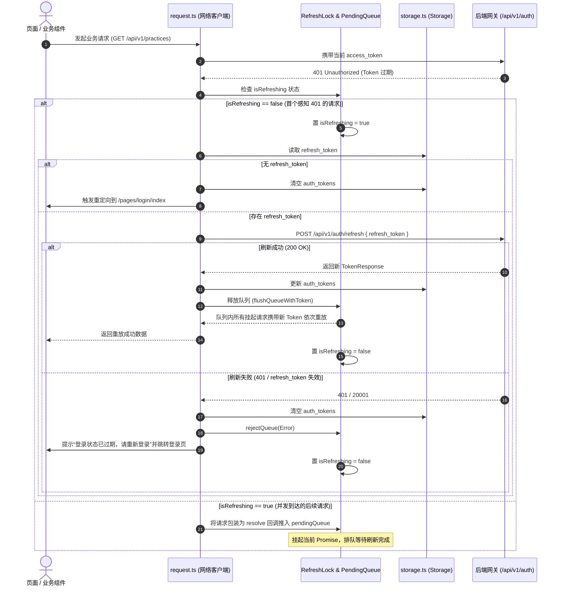
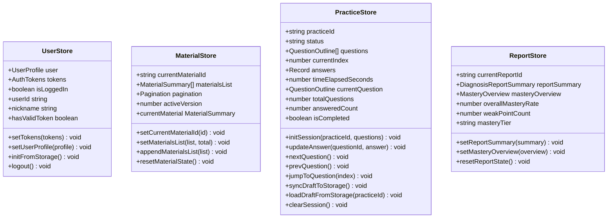

# Spec: 小程序基础脚手架、Pinia 4-Store与Storage白名单封装 - 技术契约

- **关联 Intent**: ZL-131
- **主导设计人**: TechLead
- **当前状态**: Approved
- **Change Tier**: Tier 2 (单模块特性演进 / 前端应用入口与状态底座)

---

## 1. 架构流向与设计方案

本模块作为智练小程序端（`miniprogram/`）的基座底座，负责工程脚手架、网络请求层、Pinia 4-Store 状态流转以及本地 Storage 白名单防护机制。

严格遵循 `AGENTS.md` 与 `docs/DESIGN.md` 核心架构与工程红线：
1. **纯净单向数据流**：页面组件 $\rightarrow$ 触发用户交互 $\rightarrow$ 调用 `src/api` 发起请求 $\rightarrow$ 响应数据驱动 Pinia Store 状态变更 $\rightarrow$ 视图响应式渲染；
2. **Store 无网络请求铁律**：Pinia Store 内绝对禁止直接调用底层网络接口，数据拉取与提交统一由 `src/api` 承载，Store 仅负责跨页面内存状态管理与快照派生；
3. **敏感凭据与数据隔离**：严禁持久化学习资料全文、题目全文与参考答案；本地 Storage 仅允许写入 3 类白名单项（`auth_tokens`, `practice_drafts`, `user_settings`）；
4. **单文件代码行数与包体积门禁**：所有 `.vue`、`.ts` 单文件严格控制在 300 行以内；主包体积严格控制在 2.0MB 以内，资料与报告页面规划至独立分包；
5. **视觉零表情包与低饱和色盘**：全系统严禁使用 Unicode Emoji，严格适配 Wot Design Uni SCSS 变量与冷灰护眼色盘（背景 `#F8FAFC`、主交互色 `#2563EB`）。

### 1.1 前端整体分层架构与调用拓扑

```mermaid
flowchart TD
    subgraph View_Layer[视图与交互层 (Pages & Components)]
        P1["主包页面 (pages/index, practice, login, profile)"]
        P2["分包页面 (subpackages/material, subpackages/report)"]
        C1["公共业务组件 (components/* <= 300行)"]
    end

    subgraph State_Layer[状态管理层 (Pinia 4-Store)]
        direction TB
        S1["useUserStore (登录态/用户信息/Token)"]
        S2["useMaterialStore (活跃资料元数据/版本/分页)"]
        S3["usePracticeStore (练习题列/作答进度/草稿)"]
        S4["useReportStore (诊断报告摘要/掌握度看板)"]
    end

    subgraph Api_Layer[统一 API 契约层 (src/api/*)]
        direction TB
        A1["auth.ts (login, refresh, revoke)"]
        A2["user.ts (getProfile, deleteAccount)"]
        A3["material.ts (upload, list, detail)"]
        A4["practice.ts (create, submit, saveDraft)"]
        A5["diagnosis.ts (getReport, getMastery)"]
    end

    subgraph Core_Client[网络通信与安全存储 (src/utils/*)]
        direction TB
        R1["request.ts (Promise 封装 / 401 排队静默刷新 / 业务错误码映射)"]
        ST["storage.ts (Storage 白名单强校验 / 违规注入拦截)"]
    end

    subgraph Native_Runtime[微信小程序宿主环境]
        UReq["uni.request API"]
        USto["uni.setStorageSync / uni.getStorageSync"]
    end

    P1 & P2 & C1 --> State_Layer
    P1 & P2 & C1 --> Api_Layer
    Api_Layer --> R1
    State_Layer -. 读写草稿/凭据 .-> ST
    R1 -. 读写 Token .-> ST
    R1 --> UReq
    ST --> USto
```

### 1.2 工程目录组织规范 (`miniprogram/`)

工程严格按照 uni-app (Vue 3 + Vite 5 + TypeScript) 标准分层组织：

```text
miniprogram/
├── index.html
├── package.json               # 核心依赖: vue, pinia, wot-design-uni, vitest
├── vite.config.ts             # uni 插件与 Vitest 测试环境配置
├── tsconfig.json              # TypeScript 严格模式配置
├── src/
│   ├── main.ts                # 应用入口: 装配 Pinia, Wot Design Uni
│   ├── App.vue                # 小程序根组件生命周期监听
│   ├── pages.json             # 路由配置、TabBar、分包规则
│   ├── uni.scss               # 全局样式与 Wot Design Uni 主题色 Token 覆盖
│   ├── api/                   # 纯函数 API 契约调用层
│   │   ├── auth.ts            # 认证登录、双令牌置换与吊销
│   │   ├── user.ts            # 用户画像与账号注销
│   │   ├── material.ts        # 资料上传、状态轮询与列表
│   │   ├── practice.ts        # 组卷、草稿暂存与强幂等交卷
│   │   └── diagnosis.ts       # 学情诊断报告与艾宾浩斯掌握度看板
│   ├── pages/                 # 主包页面 (控制在 2.0MB 以内)
│   │   ├── index/index.vue    # 智练工作台首页
│   │   ├── login/index.vue    # 微信一键授权登录
│   │   ├── practice/          # 练习主流程页面
│   │   └── profile/index.vue  # 个人中心设置
│   ├── subpackages/           # 业务独立分包
│   │   ├── material/          # 资料管理分包
│   │   └── report/            # 学情诊断与错题消灭分包
│   ├── components/            # 公共复用原子与分子组件 (严禁 > 300 行)
│   │   ├── OptionCard.vue     # 单选/多选/判断选项卡片组件
│   │   └── BottomActionBar.vue# 吸底安全区操作栏组件
│   ├── composables/           # 组合式业务逻辑 (无状态/轻量状态 hooks)
│   ├── stores/                # Pinia 4-Store 状态树
│   │   ├── user.ts            # useUserStore
│   │   ├── material.ts        # useMaterialStore
│   │   ├── practice.ts        # usePracticeStore
│   │   └── report.ts          # useReportStore
│   ├── types/                 # 前端 TypeScript 数据契约
│   │   ├── api.d.ts           # 统一响应包与分页包装
│   │   ├── auth.d.ts          # 登录凭证与 Token 契约
│   │   ├── practice.d.ts      # 题目大纲与作答契约
│   │   └── storage.d.ts       # Storage 白名单类型定义
│   └── utils/                 # 核心基础工具
│       ├── request.ts         # 网络请求客户端 (双令牌401重放队列)
│       ├── storage.ts         # 本地存储白名单保护器
│       ├── error.ts           # 5位业务错误码与零度文案对照字典
│       └── logger.ts          # 脱敏前端日志记录器
└── tests/                     # 自动化测试套件
    ├── setup.ts               # uni-app 全局桩 (uni.request, uni.storage)
    └── unit/
        ├── request.spec.ts    # 401 拦截、排队、并发重试单测
        ├── storage.spec.ts    # 白名单防护、非法注入拦截单测
        └── stores/            # 4-Store 状态变迁与隔离单测
```

---

## 2. API 与数据契约设计

### 2.1 网络请求层数据契约与接口 (`src/utils/request.ts`)

#### (1) 统一响应包接口契约 (`types/api.d.ts`)

```typescript
export interface ApiResponse<T = any> {
  code: number;          // 0 或 200 表示成功，5位整数为业务错误码
  message: string;       // 面向用户的提示文案
  data: T;               // 业务响应载荷
  details?: Record<string, any>; // 错误详情辅助诊断信息
}

export interface RequestOptions {
  url: string;
  method?: 'GET' | 'POST' | 'PUT' | 'DELETE';
  data?: any;
  headers?: Record<string, string>;
  skipAuth?: boolean;    // 是否免除注入 Authorization Header
  timeout?: number;      // 毫秒，默认 15000
}
```

#### (2) 双令牌存储结构 (`types/auth.d.ts`)

```typescript
export interface AuthTokens {
  access_token: string;
  refresh_token: string;
  token_type: string;    // 固定 "Bearer"
  expires_in: number;    // 秒，如 7200
  expires_at: number;    // 绝对过期时间戳 (毫秒)
}
```

#### (3) 401 拦截、静默刷新锁与请求排队重放机制

当发起请求遇到 `401 Unauthorized` 或后端返回业务错误码 `20001` 时，客户端启动以下状态机：



#### (4) 5 位业务错误码到零度自然文案映射字典 (`src/utils/error.ts`)

严格对齐 `backend/app/core/errors.py` 与 `docs/DESIGN.md` 第 5 节，严禁展示底层算法或开发黑话：

| 错误码范围 / Code | 场景与异常类 | 面向用户的自然文案 (零表情包) | 处理策略 |
| :--- | :--- | :--- | :--- |
| `10001 ~ 10999` | 参数校验与请求格式问题 | `输入信息格式有误，请核对后重试` | Toast 提示，不阻断路由 |
| `20001` | `AuthenticationError` (401) | `登录状态已过期，请重新登录` | 触发刷新令牌；若刷新失败则清理凭证并跳转登录页 |
| `20002` | `PermissionDeniedError` (403) | `无权访问此内容` | Toast 提示，阻止继续操作 |
| `30001 / 30004` | `StorageError` / `OCRError` | `图片识别或解析未完成，请重试或重新拍摄` | 引导用户检查图片清晰度并重试 |
| `30010 / 30011` | `SearchError` / `LLMError` | `智能分析暂不可用，请稍后重试` | Toast 提示降级，记录日志 |
| `40001` | `MaterialInvalidError` | `资料清晰度不足或内容过少，请重新拍摄` | 返回资料上传页重拍 |
| `40002` | `ReshootLimitExceededError` | `重拍次数已达上限，请重新选择资料` | 引导重新选择学习资料 |
| `40004` | `MaterialNotFoundError` | `当前学习资料不存在或已被移除` | 返回资料列表 |
| `40010` | `PracticeNotFoundError` | `练习记录不存在或已被移除` | 返回练习列表 |
| `40011` | `PracticeStatusError` | `当前练习已提交或已关闭，无法继续作答` | 跳转对应练习报告页 |
| `40016` | `PracticeNotGradedError` | `练习正在批改中，请稍候查看结果` | 启动静默轮询 |
| `50000 ~ 59999` | 系统内部故障与未知错误 | `系统繁忙，请稍后重试` | 阻断并上报错误信息 |
| `NETWORK_FAIL` | 网络断连 / 超时 | `网络连接异常，请检查网络设置` | Toast 提示重试按钮 |

---

### 2.2 Storage 白名单保护器设计 (`src/utils/storage.ts`)

#### (1) 白名单常数与强类型契约 (`types/storage.d.ts`)

```typescript
export const STORAGE_WHITELIST = [
  'auth_tokens',
  'practice_drafts',
  'user_settings'
] as const;

export type StorageKey = typeof STORAGE_WHITELIST[number];

export interface StorageDataMap {
  auth_tokens: AuthTokens;
  practice_drafts: Record<string, {
    practice_id: string;
    answers: Record<string, string | string[]>;
    updated_at: number;
  }>;
  user_settings: {
    theme: 'light';
    sound_enabled: boolean;
    font_scale: number;
  };
}
```

#### (2) 运行时安全阻断与注入检测规则

1. **白名单键校验**：
   - 凡执行 `storage.setItem(key, value)`，首先断言 `STORAGE_WHITELIST.includes(key as StorageKey)`；
   - 若不命中白名单，严禁写入底层 `uni.setStorageSync`，立即抛出 `StorageViolationError: Key '${key}' is prohibited by storage whitelist policy`。
2. **全文注入拦截防泄露红线**：
   - 严禁在 Storage 中存储学习资料全文与题目全文；
   - 在 `setItem` 序列化前，执行深度特征扫描：
     - 若对象包含高危全文键名：`material_content`, `raw_text`, `full_content`, `question_text`, `reference_answer`, `snippets`；
     - 或单字段字符串长度超过 `1000` 字符（除 token 字段外）；
     - 触发拦截并抛出 `StorageSecurityError: Storing raw materials or full questions in local storage is strictly prohibited`。
3. **接口定义**：
   - `getItem<K extends StorageKey>(key: K): StorageDataMap[K] | null`
   - `setItem<K extends StorageKey>(key: K, value: StorageDataMap[K]): void`
   - `removeItem(key: StorageKey): void`
   - `clearWhitelistStorage(): void` (仅清理白名单键，严禁无差别清空小程序其他宿主配置)

---

### 2.3 Pinia 4-Store 状态契约与流向设计 (`src/stores/*`)

系统仅允许存在以下 4 个 Store，严格遵循 Store 内不直调接口的铁律：



#### (1) `useUserStore` (`src/stores/user.ts`)
- **State**:
  - `user: UserProfile | null` (包含 id, nickname, avatar_url, created_at)
  - `tokens: AuthTokens | null`
- **Getters**:
  - `isLoggedIn: (state) => !!state.tokens?.access_token`
  - `userId: (state) => state.user?.id ?? ''`
  - `avatarUrl: (state) => state.user?.avatar_url ?? ''`
- **Actions**:
  - `setTokens(tokens: AuthTokens)`: 同步更新内存与 `storage.setItem('auth_tokens', tokens)`
  - `setUserProfile(profile: UserProfile)`: 更新用户信息
  - `initFromStorage()`: 应用启动时从 Storage 加载 `auth_tokens`
  - `logout()`: 清空内存状态，调用 `storage.removeItem('auth_tokens')`

#### (2) `useMaterialStore` (`src/stores/material.ts`)
- **State**:
  - `currentMaterialId: string | null`
  - `materialsList: MaterialSummary[]`
  - `pagination: { page: number; pageSize: number; total: number }`
  - `activeVersion: number | null`
- **Getters**:
  - `currentMaterial: (state) => state.materialsList.find(m => m.id === state.currentMaterialId) ?? null`
  - `totalCount: (state) => state.pagination.total`
- **Actions**:
  - `setCurrentMaterialId(id: string | null)`
  - `setMaterialsList(list: MaterialSummary[], total: number)`
  - `appendMaterialsList(list: MaterialSummary[])`: 分页追加
  - `resetMaterialState()`: 重置列表

#### (3) `usePracticeStore` (`src/stores/practice.ts`)
- **State**:
  - `practiceId: string | null`
  - `status: 'idle' | 'in_progress' | 'paused' | 'submitted' | 'graded'`
  - `questions: QuestionOutline[]` (仅存储 `id`, `type`, `stem`, `options`, `order_index`；严禁存储参考答案)
  - `currentIndex: number`
  - `answers: Record<string, string | string[]>` (以 question_id 为键的当前作答草稿)
  - `timeElapsedSeconds: number`
- **Getters**:
  - `currentQuestion: (state) => state.questions[state.currentIndex] ?? null`
  - `totalQuestions: (state) => state.questions.length`
  - `answeredCount: (state) => Object.keys(state.answers).filter(k => !!state.answers[k]).length`
  - `isCompleted: (state) => state.questions.length > 0 && state.answeredCount === state.questions.length`
- **Actions**:
  - `initSession(practiceId: string, questions: QuestionOutline[])`
  - `updateAnswer(questionId: string, answer: string | string[])`
  - `nextQuestion()`, `prevQuestion()`, `jumpToQuestion(index: number)`
  - `syncDraftToStorage()`: 自动保存草稿至 `storage.setItem('practice_drafts', drafts)`
  - `loadDraftFromStorage(practiceId: string)`: 页面恢复时从 Storage 加载未提交的作答
  - `clearSession()`: 提交成功后清空草稿与会话

#### (4) `useReportStore` (`src/stores/report.ts`)
- **State**:
  - `currentReportId: string | null`
  - `reportSummary: DiagnosisReportSummary | null` (包含总题数、正确率、掌握度增量、薄弱知识点清单)
  - `masteryOverview: MasteryOverview | null` (艾宾浩斯四级掌握度全景分布)
- **Getters**:
  - `overallScore: (state) => state.reportSummary?.overall_score ?? 0`
  - `weakPoints: (state) => state.reportSummary?.weak_knowledge_points ?? []`
  - `masteryTier: (state) => state.reportSummary?.mastery_tier ?? '未学'`
- **Actions**:
  - `setReportSummary(summary: DiagnosisReportSummary)`
  - `setMasteryOverview(overview: MasteryOverview)`
  - `resetReportState()`

---

## 3. 可测性设计 (Design for Testability)

### 3.1 独立纯函数计算核
1. **错误码与文案映射函数** (`mapErrorCodeToMessage(code: number, fallback?: string): string`)：
   - 输入整数错误码，输出纯文本提示；
   - 100% 覆盖全部 5 位错误码范围与边界值（10000, 20001, 20002, 30001, 40001, 50000, 未知码）。
2. **Storage 注入扫描纯函数** (`validateStoragePayload(key: string, value: any): void`)：
   - 独立纯函数，输入 key 与待序列化对象，纯内存扫描递归深度与敏感键名，违规时抛出异常；
   - 便于以纳秒级速度进行白盒断言，分支覆盖率达 100%。

### 3.2 外部依赖与 Mock 策略
1. **微信小程基础 API 桩 (`tests/setup.ts`)**：
   - 使用 Vitest 全局模拟 `uni.request`, `uni.getStorageSync`, `uni.setStorageSync`, `uni.removeStorageSync`, `uni.showToast`；
   - 桩函数内部记录调用参数与次数，支持精准校验 401 并发时 `uni.request` 发起 `/api/v1/auth/refresh` 的唯一性。
2. **网络隔离与零外部开销**：
   - 单测严格在 Node.js / happy-dom 虚拟环境中运行，无真实网络请求；
   - 单用例执行时间控制在 20ms 以内，全部前端单元测试 5 秒内完成。

---

## 4. 替代方案与权衡考量 (Alternatives Considered & Trade-offs)

### 4.1 网络请求库：Axios (小程序适配版) vs 原生 `uni.request` 极简 Promise 封装
- **备选方案**：引入 `axios` 与 `axios-miniprogram-adapter`；
- **放弃原因**：
  1. Axios 适配器体积大（增加约 45KB），违反主包 2.0MB 极致压榨原则；
  2. Axios 的双令牌 401 拦截器排队机制在并发场景下对小程序 `Promise` 事件循环存在兼容差异；
- **选定决策**：基于 `uni.request` 封装极简原生 Promise 客户端，体积小于 2KB，对 401 队列重放具有 100% 掌控度。

### 4.2 状态管理：单一庞大 Root Store vs 领域收敛 4-Store
- **备选方案**：使用单个 `useAppStore` 统一管理所有状态；
- **放弃原因**：
  1. 智练包含资料、练习、报告与用户 4 个独立生命周期的业务域，混合后状态膨胀，代码必然突破 300 行红线；
  2. 跨页面数据流紊乱，无法实现退出练习或退出登录时的局部状态精准重置；
- **选定决策**：严格限定 4 个 Store，单一职责，且禁止 Store 直调接口。

### 4.3 本地存储：原生透传 vs 白名单强校验拦截器
- **备选方案**：直接在业务中调用 `uni.setStorageSync`；
- **放弃原因**：
  1. 前端业务开发容易随手持久化资料全文、题目大文本，极易发生本地存储容量爆满（微信 10MB 上限）；
  2. 题目与资料全文存入本地 Storage 存在作弊与版权安全风险；
- **选定决策**：实现 `src/utils/storage.ts` 白名单保护器，非白名单或大文本注入直接抛错阻断。

---

## 5. 动态风险核验与回滚预案 (Risk & Rollback Verification)

### 5.1 7 大风险维度动态扫描
1. **Affected Files**：仅涉及 `miniprogram/` 新增脚手架、配置、工具与 Pinia 状态树，预计约 15 个文件。
2. **Public API**：不改动后端任何现有 API 契约；前端请求格式与字段 100% 对齐后端 `/api/v1/auth`, `/users`, `/materials`, `/practices`, `/diagnosis`。
3. **Data Schema**：无后端数据库变更；前端 Storage 仅严格定义 3 个 Schema 键，具备强类型校验。
4. **Auth & Security**：涉及双令牌自动刷新与存储。风险点在于并发 401 重放导致死循环；设计了 `isRefreshing` 锁与 `pendingQueue`，刷新失败立即清除本地凭证并强制登出，彻底切断重放风暴。
5. **Dependencies**：核心引入 `vue@3.4+`, `pinia@2+`, `wot-design-uni@1.3+`, `sass`, `typescript`, `vitest`。全部为高活跃度主流开源库，无安全高危漏洞。
6. **Rollback Difficulty**：极低。由于是前端独立代码库的初次脚手架搭建，尚未影响生产发布产物，可通过 Git Revert 秒级完整撤销。
7. **Blast Radius**：仅限于前端小程序运行时；若请求客户端有缺陷，可能导致前端无法登录或拉取数据，依靠 100% 单元测试保障无缺陷。

### 5.2 回滚与故障应急策略
若前端脚手架在构建或微信真机编译中出现语法、样式兼容性阻塞：
1. 立即利用 Git 恢复至基线分支；
2. 保持后端 1013 个通过的单元测试与 API 路由完全不受影响；
3. 排查 uni-app Vite 插件与 TypeScript 配置后重新提交。

---

## 6. 阶段准出签批 (Gate 2 Sign-off)
- [x] 架构流向与 API 契约已冻结
- [x] 替代方案已完成推演与权衡
- [x] 7 维风险已核验且具备明确回滚预案
- **审查结论**: Accepted
- **签批人 / 日期**: TechLead (人类授权推进模式) / 2026-09-25 01:25
