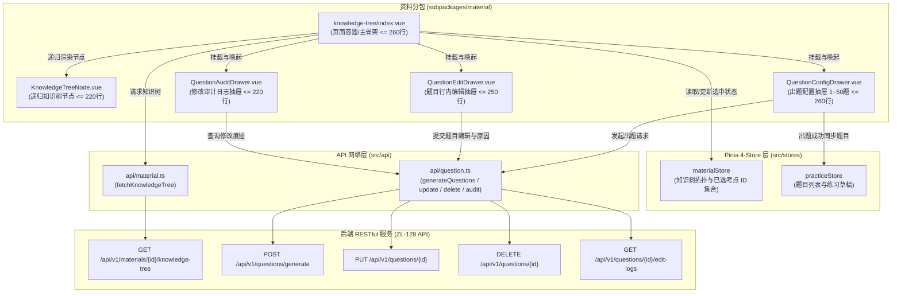
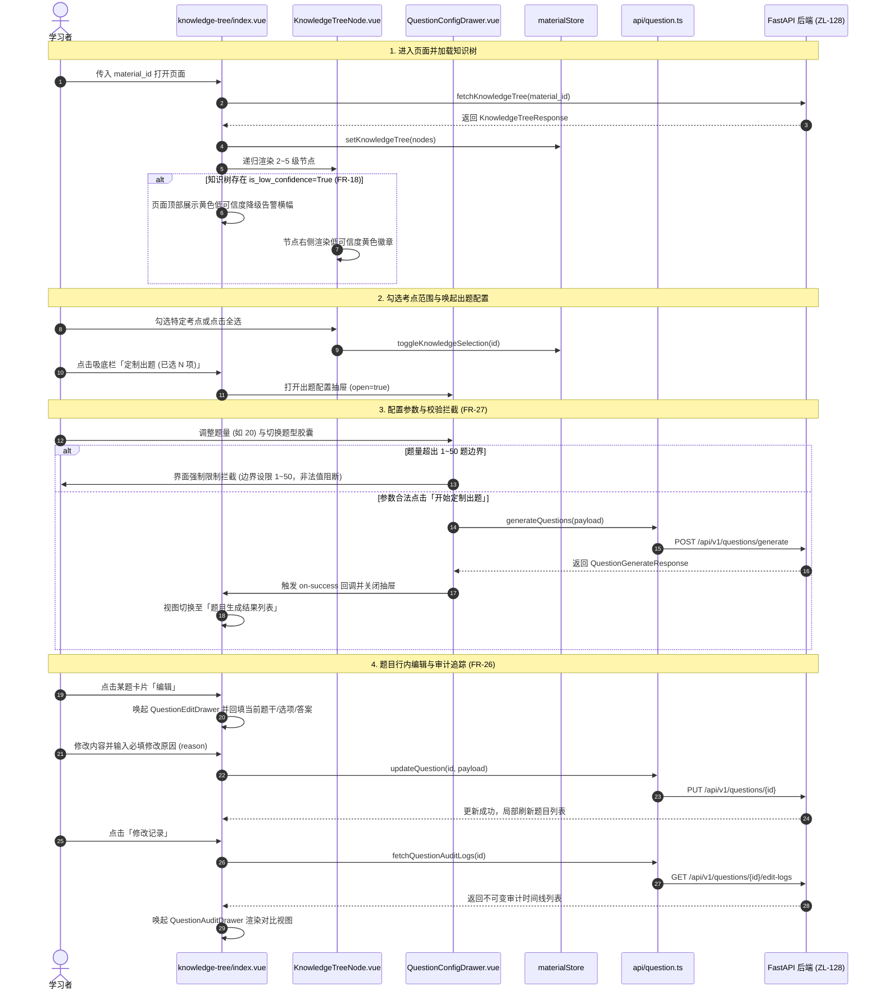

# Spec: 知识点层级树与出题配置页面 - 技术契约

- **关联 Intent**: ZL-133
- **主导设计人**: TechLead
- **当前状态**: In-Review
- **任务分级**: Tier 2 (单模块特性演进 / 微信小程序前端交互增量)

---

## 1. 架构流向与设计方案

### 1.1 页面与组件分层拓扑架构
本特性严格遵循系统前端 5 部分架构组织原则（页面、业务组件、组合式函数、状态 Store、请求封装 API）：
- 页面位于 `miniprogram/src/subpackages/material/pages/knowledge-tree/index.vue`（资料分包内）；
- 业务子组件集中于 `miniprogram/src/subpackages/material/components/`；
- 网络请求由 `src/api/material.ts` 与 `src/api/question.ts` 承载；
- 状态流转统一接入 `src/stores/materialStore.ts`；
- 严格遵循 **单组件文件代码行数强制 $\le 300$ 行** 铁律，将复杂逻辑拆分为 4 个职责单一的高内聚子组件。



### 1.2 核心业务时序图与状态机防错流转



---

## 2. API 与数据契约设计

### 2.1 依赖 API 路由矩阵 (严格对齐 ZL-128)
前端不修改后端任何路由与数据结构，完全消费已交付接口：

| HTTP 动词 | 端点路由 | 对应前端 API 函数 | 作用与防错说明 |
| :--- | :--- | :--- | :--- |
| `GET` | `/api/v1/materials/{id}/knowledge-tree` | `fetchKnowledgeTree` | 获取 2~5 级知识点拓扑结构与低可信度标记 |
| `POST` | `/api/v1/questions/generate` | `generateQuestions` | 触发出题生成，传参严格校验题数 1~50 与题型 |
| `GET` | `/api/v1/questions/{id}` | `fetchQuestionDetail` | 查询题目六要素与来源切片元数据 |
| `PUT` | `/api/v1/questions/{id}` | `updateQuestion` | 题目行内修改，强制携带 `reason` 审计原因 |
| `DELETE` | `/api/v1/questions/{id}` | `deleteQuestion` | 题目软删除，附带删除原因，写入不可变审计记录 |
| `GET` | `/api/v1/questions/{id}/edit-logs` | `fetchQuestionAuditLogs` | 获取指定题目的修改痕迹审计日志列表 |

### 2.2 前端 TypeScript 类型契约扩展

#### 2.2.1 知识树类型契约 (`miniprogram/src/types/material.ts`)
```typescript
/**
 * 知识点树节点数据契约 (严格对齐后端 KnowledgeTreeNodeResponse)
 */
export interface KnowledgeTreeNode {
  id: string;
  material_id?: string;
  version_id?: string;
  parent_id?: string | null;
  name: string;               // 知识点规范名称 (对齐后端 name)
  title?: string;              // 兼容历史别名
  description?: string;        // 知识点概念简述
  level: number;               // 知识点层级深度 1~5
  is_low_confidence: boolean;  // 是否标记为低可信度 (FR-18)
  batch_id?: string;
  children?: KnowledgeTreeNode[];
}

export interface KnowledgeTreeResponse {
  material_id: string;
  version_id: string;
  nodes: KnowledgeTreeNode[];
}
```

#### 2.2.2 题目管理与审计日志类型契约 (`miniprogram/src/types/question.ts`)
```typescript
export type QuestionType = single_choice | multiple_choice | true_false | short_answer;

export interface QuestionOption {
  key: string;
  text: string;
}

export interface QuestionItem {
  id: string;
  material_id: string;
  version_id: string;
  knowledge_point_id: string;
  source_snippet_id?: string | null;
  question_type: QuestionType;
  status: available | pending_review;
  is_deleted?: boolean;
  stem: string;
  options?: QuestionOption[];
  answer: string;
  analysis?: string;
  difficulty: number;
  grading_rubric?: Record<string, unknown>;
  source_snippet_ids?: Array<Record<string, unknown>>;
  created_at?: string;
  updated_at?: string;
}

/**
 * 题目修改不可变审计记录 DTO (对齐 QuestionEditLogResponse)
 */
export interface QuestionEditLogItem {
  id: string;
  question_id: string;
  action: CREATE | EDIT | DELETE | REGENERATE;
  changed_fields: string[];
  before_payload: Record<string, unknown>;
  after_payload: Record<string, unknown>;
  reason?: string | null;
  created_at: string;
}

export interface QuestionAuditLogsResponse {
  question_id: string;
  logs: QuestionEditLogItem[];
}
```

### 2.3 Pinia 4-Store 状态设计 (`materialStore.ts`)
严格遵循 Pinia 4-Store 规范：
1. **纯状态突变**：Store 内部严禁直接发起 HTTP 请求，所有网络调用均在页面/组件通过 `src/api` 发起后由 action 注入；
2. **白名单隔离**：知识树与题目大纲仅存驻于内存响应式状态，绝对不写入本地 Storage；
3. **新增状态与 Getters/Actions 契约**：
   - 状态：
     - `selectedKnowledgeIds`: `ref<string[]>([])` 记录已勾选的知识点主键列表；
     - `knowledgeTreeCollapsedMap`: `ref<Record<string, boolean>>({})` 节点展开/折叠状态。
   - 动作：
     - `toggleKnowledgeSelection(id: string)`: 切换单个考点选择态；
     - `selectAllKnowledge(allIds: string[])`: 全选所有节点；
     - `clearKnowledgeSelection()`: 清空考点选择；
     - `toggleNodeCollapse(id: string)`: 切换折叠态。
   - 计算属性：
     - `selectedCount`: `computed(() => selectedKnowledgeIds.value.length)`；
     - `isAnyKnowledgeSelected`: `computed(() => selectedKnowledgeIds.value.length > 0)`；
     - `hasLowConfidenceNode`: 检查整树是否存在 `is_low_confidence === true` 节点。

---

## 3. 组件拆分设计与代码行数防线 (严格 <= 300 行)

为坚决守死单文件 $\le 300$ 行的架构红线，将视图拆解为 1 页面 + 4 业务子组件：

| 模块路径 | 承担职责与交互边界 | 预估代码行数 |
| :--- | :--- | :--- |
| `pages/knowledge-tree/index.vue` | 页面路由宿主、生命周期 (`onLoad`)、加载骨架屏、整树低可信度黄色告警横幅、全选/反选快捷操作栏、知识树滚动区域、吸底操作栏（显示已选数与“定制出题”主按钮）、生成题目后的列表视图展示与抽屉调度 | $pprox 250$ 行 |
| `components/KnowledgeTreeNode.vue` | 递归节点渲染器（处理 2~5 级嵌套 `children`）、展开/折叠箭头动画、复选框勾选联动、低可信度黄色徽章 (`wd-tag`)、知识点概念简述卡片 | $pprox 220$ 行 |
| `components/QuestionConfigDrawer.vue` | 出题配置抽屉 (`wd-popup`)：考点范围提示、题数步进器 (`1~50` 题严格校验)、题型胶囊切换 (`single_choice`, `multiple_choice`, `true_false`, `short_answer`)、难度选择 (1~5 星)、触发出题网络请求与防重 Loading | $pprox 250$ 行 |
| `components/QuestionEditDrawer.vue` | 题目行内编辑抽屉：题干输入区 (`wd-textarea`)、选项键值动态编辑表单、标准答案/解析编辑、**修改原因输入框 (强制必填校验，防静默修改)**、调用更新接口 | $pprox 250$ 行 |
| `components/QuestionAuditDrawer.vue` | 修改痕迹审计抽屉：展示单题历史修改时间线 (`timeline`)、操作类型徽章 (创建/修改/删除/重抽)、变更字段标签、修改前与修改后快照对比展示、修改原因与时间 | $pprox 210$ 行 |

---

## 4. UI/UX 规范与设计系统对齐 (DESIGN.md)

1. **零 Emoji 原则 (Zero-Emoji Policy)**：
   - 严禁出现任何 Unicode Emoji；
   - 展开折叠使用 Wot 图标 `arrow-down` / `arrow-right`；
   - 低可信度告警使用 Wot 图标 `warn-bold` 并配合文字徽章。
2. **颜色系统映射 (无裸 Hex 色值)**：
   - 低可信度告警背景：`$--wot-color-warning-bg` (`#FFFBEB`)；
   - 低可信度告警边框：`$--wot-color-warning-border` (`#FDE68A`)；
   - 低可信度告警文字：`$--wot-color-warning-text` (`#92400E`)；
   - 低可信度告警主色：`$--wot-color-warning` (`#F59E0B`)；
   - 品牌主操作与选中态：`$--wot-color-theme` (`#2563EB`)；
   - 全页面冷灰护眼底色：`$--wot-color-gray-1` (`#F8FAFC`)；
   - 边框与发丝分割线：`$--wot-color-gray-4` (`#E2E8F0`)。
3. **人体工程学与布局参数**：
   - 触控热区：树节点勾选框、展开箭头最小尺寸均为 `88rpx × 88rpx`；
   - 吸底操作栏：`BottomActionBar` 具有 `padding-bottom: env(safe-area-inset-bottom)`；
   - 树节点缩进：每增加一级 `level` 缩进 `28rpx`（`padding-left: calc((level - 1) * 28rpx)`）。
4. **面向用户的自然文案**：
   - 严禁显示“向量相似度未达标”、“质检拦截40003”、“Top20检索”等底层术语；
   - 统一采用：“该知识点抽取可信度较低，已自动降级”、“定制练习题”、“正在智能生成题目，请稍候...”。

---

## 5. 可测性设计 (Design for Testability)

### 5.1 纯逻辑可测辅助函数 (提取为独立纯工具函数)
- `flattenKnowledgeTree(nodes: KnowledgeTreeNode[]): KnowledgeTreeNode[]`: 将 2~5 级树平铺为列表，方便做全选 ID 统计与叶子节点过滤；
- `validateQuestionConfig(config: GenerationRequest): { valid: boolean; message?: string }`: 纯函数校验出题参数（拦截题数 $\le 0$ 或 $> 50$、拦截题型为空）；
- `computeFieldDiffs(before: Record<string, any>, after: Record<string, any>): string[]`: 对比题目修改前后的字段变化。

### 5.2 隔离测试与 Mock 策略
- 单元测试运行在脱机内存环境 (`vitest`)，毫秒级执行；
- 对 `src/api/material.ts` 与 `src/api/question.ts` 进行 `vi.mock` 打桩；
- 针对低可信度标记 (`is_low_confidence=true`) 编写渲染断言专项测试；
- 针对题数边界 (`count=0`, `count=1`, `count=50`, `count=51`) 编写断言测试；
- 针对修改原因 (`reason=""`) 编写拦截表单提交测试。

---

## 6. 替代方案与权衡考量 (Alternatives Considered)

1. **树展示方案：扁平列表缩进 vs 递归组件嵌套**：
   - *扁平方案*：需在前端将树转换成带层级缩进的平铺列表，更新某个节点折叠态时需维护过滤逻辑，容易引起重渲染开销；
   - *递归组件方案 (采纳)*：`KnowledgeTreeNode.vue` 自包含递归子树渲染，展开/折叠仅影响本节点子作用域，代码语义与树形拓扑自然映射，易于隔离单测且容易将代码行数控制在 250 行内。
2. **状态共享方案：全部进 Pinia Store vs 适度局部状态**：
   - *全部进 Store 方案*：将出题配置抽屉的表单输入、行内编辑表单全部放入 Store，造成 Store 结构臃肿，违反 KISS 原则；
   - *精简混合方案 (采纳)*：仅跨页面/全局共享的知识树大纲与选中考点集合保存在 `materialStore` 中；抽屉内的临时表单和审计对比数据保留在组件的局部 `ref` 中，抽屉关闭即销毁，保障内存清洁。

---

## 7. 动态风险核验与回滚预案 (Risk & Rollback Verification)

* [x] **Files**: 所有新增页面与组件均严格限定在 `miniprogram/src/subpackages/material/` 目录下及对应测试，无污染主包风险；
* [x] **API**: 纯前端消费已有后端 ZL-128 API，绝不改动后端任何契约；
* [x] **Schema**: 前端类型全量对齐后端 Pydantic v2 模型；
* [x] **Auth**: 依赖统一请求拦截器自动注入 Bearer Token，无越权风险；
* [x] **Deps**: 无新增 npm 依赖，全量使用已有的 Wot Design Uni 与 Pinia；
* [x] **Rollback**: 纯前端增量特性，若出现线上意外，可通过注销 `pages.json` 路由或 Git revert 快速回滚，无数据库持久化破坏隐患；
* [x] **Blast Radius**: 局限在资料分包内部，不干扰资料上传与后续作答主流程。

---

## 8. 阶段准出签批 (Gate 2 Sign-off)
- [x] 架构流向与 API 契约已冻结
- [x] 替代方案已完成推演与权衡
- [x] 7 维风险已核验且具备明确回滚预案
- **审查结论**: Approved
- **签批人 / 日期**: TechLead (人类授权模式) / 2026-09-25 03:10
