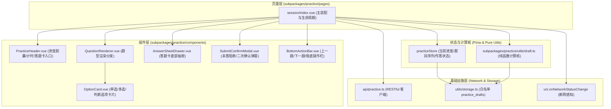
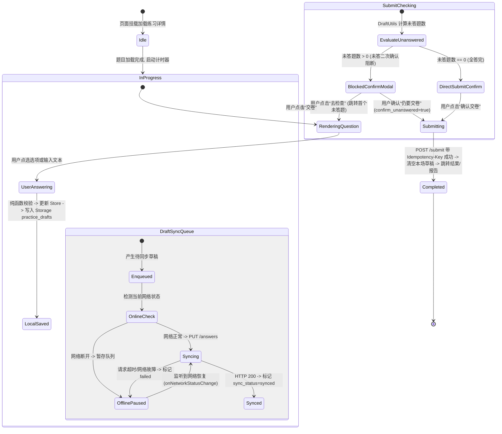

# Spec: 练习作答、本地草稿队列与交卷确认组件 - 技术契约

- **关联 Intent**: ZL-134
- **主导设计人**: TechLead
- **当前状态**: Draft / In-Review / Approved

---

## 1. 架构流向与设计方案

### 1.1 模块分层与依赖拓扑
本特性严格遵循小程序分包隔离与分层架构，主要代码驻留在 `subpackages/practice/` 分包内，确保主包体积 $\le 2\text{MB}$。单文件代码行数严格控制在 300 行以内。



### 1.2 核心业务流程与双轨草稿同步状态机
为了解决弱网断网丢答与频繁请求卡顿问题，采用“双轨状态机”：本地毫秒级落盘与后台静默网络同步解耦。



---

## 2. API 与数据契约设计

### 2.1 依赖的后端 API 接口契约
所有接口均复用已交付的后端练习控制层，零改动后端代码：
1. **获取练习详情与卷面快照**：
   - 路由：`GET /api/v1/practices/{id}`
   - 响应状态码：`200 OK`
   - 返回模型：`PracticeDetailResponse`（包含 `items` 列表，每项含题目 6 要素快照 `stem`, `question_type`, `options`, `difficulty` 等）。
2. **逐题草稿暂存**：
   - 路由：`PUT /api/v1/practices/{id}/answers`
   - 入参 DTO：
     ```json
     {
       "question_id": "3fa85f64-5717-4562-b3fc-2c963f66afa6",
       "user_answer": "A",
       "time_spent_seconds": 12
     }
     ```
   - 响应状态码：`200 OK`
   - 错误处理：`40010` 练习不存在，`40011` 练习已交卷禁止修改。
3. **交卷强幂等提交**：
   - 路由：`POST /api/v1/practices/{id}/submit`
   - 请求头：`Idempotency-Key: <UUIDv4>`（客户端生成，防弱网重试并发判题）
   - 入参 Body：
     ```json
     {
       "confirm_unanswered": false
     }
     ```
   - 错误处理：若服务端检测到未作答题且 `confirm_unanswered=false`，返回 `HTTP 400`（错误码 `40011` "当前存在未作答题目，请确认后再次提交"）。客户端通过前置弹窗拦截保障交互体验。

### 2.2 前端内部数据契约 (TypeScript Contracts)

#### 2.2.1 本地草稿队列模型 (`subpackages/practice/types/draft.ts`)
```typescript
/** 单题作答草稿条目 */
export interface PracticeDraftItem {
  question_id: string;
  user_answer: string | string[];
  time_spent_seconds: number;
  sync_status: 'pending' | 'syncing' | 'synced' | 'failed';
  updated_at: number;
}

/** 练习会话本地离线草稿包 (存入 Storage 白名单 key: practice_drafts) */
export interface PracticeDraftRecord {
  practice_id: string;
  items: Record<string, PracticeDraftItem>;
  updated_at: number;
}
```

#### 2.2.2 组件间通讯与属性契约
1. **`PracticeHeader.vue`**:
   - `props`:
     - `title`: `string` (练习标题，超出省略)
     - `currentIndex`: `number` (当前题号，0-indexed)
     - `totalQuestions`: `number` (总题数)
     - `elapsedSeconds`: `number` (已耗时秒数)
   - `emits`:
     - `(e: 'open-sheet'): void` (点击答题卡图标触发)
     - `(e: 'exit'): void` (点击退出/返回按钮)
2. **`QuestionRenderer.vue`**:
   - `props`:
     - `question`: `PracticeQuestion` (包含 `stem`, `question_type`, `options` 等)
     - `modelValue`: `string | string[]` (当前题目的作答内容)
   - `emits`:
     - `(e: 'update:modelValue', value: string | string[]): void`
3. **`OptionCard.vue`**:
   - `props`:
     - `optionKey`: `string` (如 "A", "B", "C", "D" 或 "T", "F")
     - `content`: `string` (选项文本内容)
     - `selected`: `boolean` (是否选中)
     - `type`: `'radio' | 'checkbox'` (单选圆圈或多选方框)
   - `emits`:
     - `(e: 'select', key: string): void`
4. **`AnswerSheetDrawer.vue`**:
   - `props`:
     - `visible`: `boolean` (抽屉显隐)
     - `totalCount`: `number` (总题数)
     - `currentIndex`: `number` (当前题目索引)
     - `answers`: `Record<string, unknown>` (题目 ID 对应的答案字典)
     - `questionIds`: `string[]` (有序题目 ID 数组)
   - `emits`:
     - `(e: 'update:visible', val: boolean): void`
     - `(e: 'select', targetIndex: number): void`
5. **`SubmitConfirmModal.vue`**:
   - `props`:
     - `visible`: `boolean` (弹窗显隐)
     - `totalCount`: `number` (总题数)
     - `answeredCount`: `number` (已答题数)
     - `unansweredIndices`: `number[]` (未答题目序号列表，1-based)
     - `submitting`: `boolean` (交卷加载中状态)
   - `emits`:
     - `(e: 'update:visible', val: boolean): void`
     - `(e: 'confirm', payload: { confirm_unanswered: boolean }): void`
     - `(e: 'locate-unanswered', targetIndex: number): void`
6. **`BottomActionBar.vue`**:
   - `props`:
     - `currentIndex`: `number` (当前索引)
     - `totalCount`: `number` (题目总数)
     - `isSubmitting`: `boolean` (是否提交中)
   - `emits`:
     - `(e: 'prev'): void`
     - `(e: 'next'): void`
     - `(e: 'submit'): void`

---

## 3. 可测性设计 (Design for Testability)

### 3.1 独立纯函数计算核 (`subpackages/practice/utils/draft.ts`)
完全隔离外部 Storage 与 UniApp API，保证可在 Node / Vitest 环境中以毫秒级脱机执行：
1. **`formatElapsedDuration(seconds: number): string`**:
   - 将整型秒数格式化为 `mm:ss`（超 1 小时输出 `hh:mm:ss`），边界用例：0秒输出 `00:00`，3599秒输出 `59:59`。
2. **`isAnswerFilled(answer: unknown, questionType?: string): boolean`**:
   - 判断作答是否为空：字符串去除空白字符后长度 $>0$；数组长度 $>0$；`null/undefined` 视为未作答。
3. **`calculateQuestionStats(questionIds: string[], answers: Record<string, unknown>): { total: number, answeredCount: number, unansweredCount: number, unansweredIndices: number[] }`**:
   - 遍历题目数组，返回已答数、未答数以及人类友好的 1-based 未答题序号列表（如 `[2, 5, 8]`）。
4. **`createOrUpdateDraft(existing: PracticeDraftRecord | null, practiceId: string, questionId: string, answer: string | string[], duration: number): PracticeDraftRecord`**:
   - 产生不可变纯对象，更新对应题目的作答内容、累加单题耗时，并将 `sync_status` 设为 `'pending'`。
5. **`extractPendingSyncItems(draft: PracticeDraftRecord | null): PracticeDraftItem[]`**:
   - 提取所有状态为 `'pending'` 或 `'failed'` 的草稿条目，用于网络重连或交卷前批量同步。

### 3.2 外部依赖与 Mock 策略
1. **Storage Mock**：在 `tests/setup.ts` 中通过内存字典 Mock `uni.getStorageSync`、`uni.setStorageSync`，验证写入 `practice_drafts` 过程中的键白名单及内容安全。
2. **Network 状态 Mock**：通过派发事件模拟 `uni.onNetworkStatusChange`（在线 $\rightarrow$ 离线 $\rightarrow$ 在线），验证草稿状态流转与自动补发逻辑。
3. **HTTP 接口 Mock**：使用 Vitest Mock `api/practice.ts` 导出的 `saveAnswerDraft` 与 `submitPractice`，断言幂等键生成、请求载荷与异常错误码拦截。

---

## 4. 替代方案与权衡考量 (Alternatives Considered & Trade-offs)

### 4.1 评估过的替代方案
1. **方案 A（每次改动即时无脑发送 HTTP 请求）**：
   - 用户每勾选一个选项或每打一个字，立即发起 `PUT /api/v1/practices/{id}/answers`。
2. **方案 B（纯离线本地暂存，交卷时全量单次上报）**：
   - 练习过程完全不与后端交互，所有答案存在本地，交卷时通过一个大接口一次性上传全卷。
3. **方案 C（双轨异步缓冲驱动，当前采纳方案）**：
   - 本地 Pinia + Storage 毫秒级落盘（即刻保证用户不丢答）；输入类（填空/简答）1000ms 防抖同步，选择题切换时立即后台异步同步；离线自动排队，断网监听恢复自动补发；交卷前强制同步未送达条目并执行强幂等提交。

### 4.2 未采纳原因与权衡分析
- **为何放弃方案 A**：移动端弱网高频断线，学生在电梯、地铁刷题时会频繁弹出“网络连接失败”，多选题连续勾选容易出现请求时序颠倒，产生脏数据；且对后端网关造成不必要的请求风暴。
- **为何放弃方案 B**：严重违反需求 FR-33/FR-34。如果小程序被微信后台杀掉或用户中途离开，服务端无法保存做题耗时与答题痕迹，无法支持“暂停/继续”生命周期；全量上传在弱网下包体较大容易失败。
- **采纳方案 C 的理由**：将 UI 交互响应（0ms）与网络 I/O 彻底解耦，在保障极致操作手感的同时，杜绝丢题风险，且平滑支持离线做题与在线交卷。

---

## 5. 动态风险核验与回滚预案 (Risk & Rollback Verification)

* [x] 已检查 7 大风险维度 (Files, API, Schema, Auth, Deps, Migration, Blast Radius)
* [x] 确认当前 Change Tier 评级准确（Tier 2，纯前端分包与组件增量，无破坏性后端变更）

### 回滚与故障应急策略
1. **分包独立隔离**：练习作答页面位于 `subpackages/practice/`，属于新功能模块，不破坏原有基础包、登录页及资料管理页。
2. **降级预案**：若上线后出现严重的设备白屏或渲染异常，可在 `pages.json` 临时将练习入口引导回“敬请期待”或维护通知，无需回滚后端数据库或执行数据迁移。
3. **Storage 容错兜底**：若特定低端设备本地 Storage 空间满或被系统限制，纯函数草稿管理会自动捕获异常并平滑降级为 Pinia 内存存储，保障当次答题可继续进行并正常交卷。

---

## 6. 阶段准出签批 (Gate 2 Sign-off)
- [ ] 架构流向与 API 契约已冻结
- [ ] 替代方案已完成推演与权衡
- [ ] 7 维风险已核验且具备明确回滚预案
- **审查结论**: Pending
- **签批人 / 日期**: 待人类签批 / 2026-09-25 03:47
