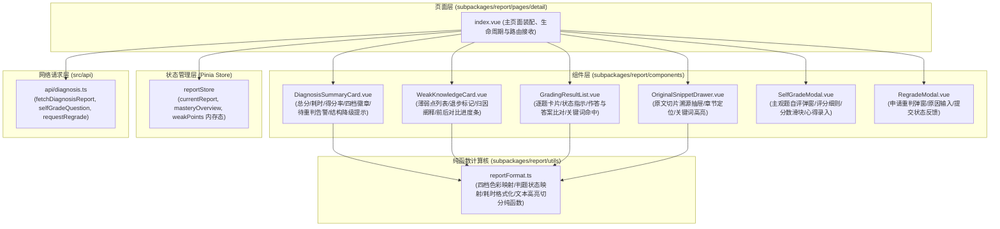
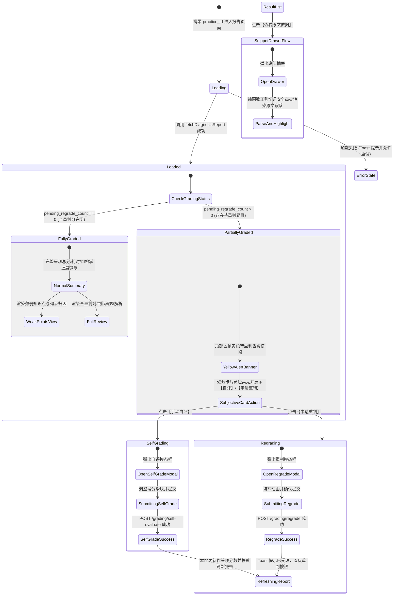

# Spec: 判题反馈、主观题自评/重判与诊断报告组件 - 技术契约

- **关联 Intent**: ZL-135
- **主导设计人**: TechLead
- **当前状态**: Draft / In-Review / Approved

---

## 1. 架构流向与设计方案

### 1.1 模块分层与依赖拓扑
本特性严格遵循小程序分包隔离与分层架构，所有视图与业务组件驻留在 `subpackages/report/` 独立分包内，保障小程序主包体积维持在 2MB 以下。各组件文件严格遵守代码行数 $\le 300$ 行的架构底线，逻辑与样式分离（抽取同名 SCSS 文件）。



### 1.2 核心业务流程与判题反馈状态机
前端在进入诊断页面时，根据后端两阶段状态机（`COMPLETED` 全量判完 vs `PARTIALLY_GRADED` 存在待重判题目）进行差异化呈现与动态流转：



### 1.3 核心组件拆分与职责规范 (均 $\le 300$ 行)
1. **`DiagnosisSummaryCard.vue`**：
   - 展现综合总分（`overall_score` / `total_score`）、答题耗时、得分率；
   - 动态渲染四档掌握度评级徽章（精通、良好、需巩固、未学）；
   - **待重新判题黄色告警条**：当 `pending_regrade_count > 0` 时，呈现醒目黄色告警卡片（`#F59E0B` 背景轻量色与边框），提示“当前有 X 道主观题待重新判题，您可以进行手动自评或等待系统重判”；
   - **低可信度降级提示**：当 `is_structure_degraded=True` 时，以黄色标签提示“当前资料知识结构处于降级模式，掌握度可信度略低”。
2. **`WeakKnowledgeCard.vue`**：
   - 提取主要薄弱知识点列表（按优先级降序）；
   - 标注显著退步徽章（若 $\Delta \ge 0.05$ 或 `score_delta < -0.05`，标为“退步”）；
   - 展现掌握度前后对比进度条（历史得分 vs 当前得分）；
   - 呈现认知成因详细阐释与可执行行动建议；
   - 遵循 FR-50：无本次错题的薄弱点特殊标注“【证据来源：历史掌握度低/时间衰减】”。
3. **`GradingResultList.vue`**：
   - 遍历练习作答题目列表，按题号渲染卡片；
   - 状态指示：判对（`#10B981` 绿色）、判错（`#EF4444` 红色）、待重新判题（`#F59E0B` 黄色警告）；
   - 题干、用户作答内容与参考标准答案对比展示；
   - 命中关键词（`hit_keywords` 绿色微胶囊）与遗漏核心要点（`missing_keywords` 橙红色微胶囊）；
   - 交互操作入口：主观题/待重判题触发“自评”或“重判”，点击“查看原文依据”触发溯源抽屉。
4. **`OriginalSnippetDrawer.vue`**：
   - 底部半屏抽屉展示题目关联的切片原文；
   - 显示切片元数据：章节名称（`chapter_title`）、页码（`page_index`）；
   - 采用纯函数切词算法，对包含的关键词进行高亮标注（背景浅黄、加粗深色），严禁直接注入非安全 HTML。
5. **`SelfGradeModal.vue`**：
   - 居中模态弹窗，展示主观题标准答案与评分细则说明（`grading_rubric`）；
   - 分数调节：提供 0 到满分的滑动选择器（Slider）或步进器，精确到 0.5 分；
   - 心得反馈：可选输入框（字数上限 500）；
   - 点击“确认提交自评”，调用 `selfGradeQuestion`，成功后派发事件更新本地数据。
6. **`RegradeModal.vue`**：
   - 居中模态弹窗，针对大模型判题异常或待重判题目输入申诉理由（可选，上限 200 字）；
   - 点击“提交重判申请”，调用 `requestRegrade`，成功后派发事件并展示受理状态。

---

## 2. API 与数据契约设计

### 2.1 依赖的后端 API 接口契约
所有端点均已由后端（ZL-123、ZL-124、ZL-130）实现，前端严格只读复用：

1. **获取学情诊断报告**：
   - **路由**: `GET /api/v1/practices/{id}/diagnosis`
   - **响应**: `DiagnosisReportResponse`
   ```json
   {
     "id": "c1f7a8b0-8b1e-4b2a-9f1e-8b1e4b2a9f1e",
     "practice_id": "d2f8b9c1-9c2f-5c3b-0a2f-9c2f5c3b0a2f",
     "mastery_before": 0.65,
     "mastery_after": 0.72,
     "overall_score": 85.0,
     "score_rate": 0.85,
     "total_questions": 10,
     "unanswered_count": 0,
     "wrong_count": 2,
     "pending_regrade_count": 1,
     "is_structure_degraded": false,
     "weak_knowledge_points": [
       {
         "knowledge_point_id": "k1",
         "knowledge_name": "二叉树中序遍历",
         "current_score": 0.38,
         "previous_score": 0.55,
         "score_delta": -0.17,
         "priority": 1,
         "cause_type": "conceptual",
         "cause_explanation": "基本概念盲区，递归出口判定不熟练",
         "actionable_advice": "建议重点复习递归回溯基础定义",
         "associated_mistakes": [{ "question_id": "q1", "is_negation_inversion": false }]
       }
     ],
     "created_at": "2026-09-25T11:00:00Z"
   }
   ```

2. **主观题用户自主评分**：
   - **路由**: `POST /api/v1/grading/self-evaluate`
   - **入参**:
   ```json
   {
     "attempt_item_id": "a1b2c3d4-e5f6-7a8b-9c0d-1e2f3a4b5c6d",
     "score": 4.5,
     "feedback": "对照细则回答了核心定理与边界条件，扣除格式分"
   }
   ```
   - **响应**: `SelfEvaluateResponse` (`{ grading_record_id, score, is_final, channel: "user_self" }`)

3. **主观题申请重新判题**：
   - **路由**: `POST /api/v1/grading/regrade`
   - **入参**:
   ```json
   {
     "attempt_item_id": "a1b2c3d4-e5f6-7a8b-9c0d-1e2f3a4b5c6d",
     "reason": "大模型超时未判定，答案已包含全部要点"
   }
   ```
   - **响应**: `RegradeResponse` (`{ attempt_item_id, status: "pending_regrade", message: "重判请求已受理" }`)

4. **查询练习会话详情（包含题目快照与作答记录）**：
   - **路由**: `GET /api/v1/practices/{id}`
   - **响应**: `PracticeDetailResponse`，包含 `items: PracticeItemDetailResponse[]`，提取单题的 `question_snapshot`、`score`、`user_answer`、`status`、`time_spent_seconds`。

### 2.2 前端类型定义扩充（`miniprogram/src/types/report.ts`）
在原有类型基础上，扩充对齐后端字段：
```typescript
export type MasteryTier = 'mastered' | 'proficient' | 'weak' | 'unlearned';

export type GradingChannel = 'offline' | 'ai' | 'user_self';

export type ItemGradingStatus = 'correct' | 'wrong' | 'pending_regrade' | 'unanswered';

export interface AssociatedMistake {
  question_id: string;
  is_negation_inversion?: boolean;
}

export interface WeakPoint {
  knowledge_point_id: string;
  knowledge_name: string;
  current_score: number;
  previous_score?: number | null;
  score_delta?: number;
  priority?: number | string;
  cause_type?: string;
  cause_explanation?: string;
  actionable_advice?: string;
  associated_mistakes?: AssociatedMistake[];
}

export interface DiagnosisReport {
  id: string;
  practice_id: string;
  mastery_before?: number | null;
  mastery_after?: number | null;
  overall_score: number;
  score_rate?: number;
  mastery_rate: number;
  total_questions?: number;
  unanswered_count?: number;
  wrong_count?: number;
  pending_regrade_count?: number;
  is_structure_degraded?: boolean;
  weak_points: WeakPoint[];
  summary?: string | null;
  created_at: string;
}

export interface SnippetHighlightPart {
  text: string;
  isHighlight: boolean;
}
```

### 2.3 组件 Props & Emits 契约详细定义
1. **`DiagnosisSummaryCard.vue`**:
   - `props`:
     - `report`: `DiagnosisReport` (必传)
     - `durationSeconds`: `number` (练习总耗时秒数，缺省 0)
   - `emits`: 无。
2. **`WeakKnowledgeCard.vue`**:
   - `props`:
     - `weakPoints`: `WeakPoint[]` (必传)
   - `emits`:
     - `click-point`: `(point: WeakPoint) => void`
3. **`GradingResultList.vue`**:
   - `props`:
     - `items`: `PracticeItemDetailResponse[]` (必传)
   - `emits`:
     - `view-snippet`: `(item: PracticeItemDetailResponse) => void`
     - `self-grade`: `(item: PracticeItemDetailResponse) => void`
     - `regrade`: `(item: PracticeItemDetailResponse) => void`
4. **`OriginalSnippetDrawer.vue`**:
   - `props`:
     - `visible`: `boolean` (必传)
     - `snippetContent`: `string` (切片正文)
     - `chapterTitle`: `string` (章节标题)
     - `pageIndex`: `number` (页码)
     - `highlightKeywords`: `string[]` (高亮关键词列表)
   - `emits`:
     - `update:visible`: `(visible: boolean) => void`
     - `close`: `() => void`
5. **`SelfGradeModal.vue`**:
   - `props`:
     - `visible`: `boolean` (必传)
     - `attemptItemId`: `string` (作答项主键)
     - `standardAnswer`: `string` (标准答案)
     - `userAnswer`: `string` (用户作答)
     - `maxScore`: `number` (本题满分，缺省 5.0)
     - `currentScore`: `number` (当前得分，缺省 0)
     - `rubric`: `Record<string, any>` (评分细则字典)
     - `submitting`: `boolean` (提交中状态)
   - `emits`:
     - `update:visible`: `(visible: boolean) => void`
     - `submit`: `(payload: { attempt_item_id: string; score: number; feedback: string }) => void`
6. **`RegradeModal.vue`**:
   - `props`:
     - `visible`: `boolean` (必传)
     - `attemptItemId`: `string` (作答项主键)
     - `submitting`: `boolean` (提交中状态)
   - `emits`:
     - `update:visible`: `(visible: boolean) => void`
     - `submit`: `(payload: { attempt_item_id: string; reason: string }) => void`

---

## 3. 可测性设计 (Design for Testability)

### 3.1 独立纯函数计算核 (`subpackages/report/utils/reportFormat.ts`)
解耦出所有无副作用纯函数，单测可脱离 DOM 与组件环境毫秒级运行，分支覆盖率要求 100%：
1. **`formatDuration(seconds: number): string`**：
   - 将秒数格式化为 `mm:ss` 或 `hh:mm:ss`（如 65s -> `01:05`，3665s -> `01:01:05`，防御负数与非数字返回 `00:00`）。
2. **`getMasteryTierInfo(scoreOrRate: number): { tier: MasteryTier; label: string; color: string; bgColor: string }`**：
   - 严格依据掌握度四档分级模型：
     - $\ge 0.85$ (或 85%): 精通 (`mastered`), 色值 `#7C3AED`, 浅底 `#F5F3FF`
     - $[0.70, 0.85)$: 良好 (`proficient`), 色值 `#059669`, 浅底 `#ECFDF5`
     - $[0.40, 0.70)$: 需巩固 (`weak`), 色值 `#B45309`, 浅底 `#FFFBEB`
     - $< 0.40$: 未学 (`unlearned`), 色值 `#64748B`, 浅底 `#F8FAFC`
3. **`getGradingStatusInfo(item: { status: string; score?: number | null; max_score?: number }): { status: ItemGradingStatus; label: string; color: string; bgColor: string }`**：
   - 状态映射：
     - 若 `status === 'pending_regrade'` 或 `score === null` 且已交卷：`pending_regrade`，文案“待重新判题”，色值 `#F59E0B`
     - 若 `score !== null && score >= max_score * 0.6`：`correct`，文案“判对”，色值 `#10B981`
     - 若 `score !== null && score < max_score * 0.6`：`wrong`，文案“判错”，色值 `#EF4444`
     - 否则：`unanswered`，文案“未作答”，色值 `#94A3B8`
4. **`highlightSnippetKeywords(content: string, keywords: string[]): SnippetHighlightPart[]`**：
   - 提取去重并过滤空字符的关键词列表；
   - 构造安全转义的正则表达式，将纯文本切割为 `{ text: string, isHighlight: boolean }` 结构片段；
   - 当无关键词或内容为空时，原样返回单一片段；杜绝任何 HTML 注入风险。
5. **`formatScoreDelta(delta: number): { text: string; isRegressed: boolean }`**：
   - 判定是否退步（`delta <= -0.05` 为显著退步，返回 `isRegressed: true`，文案如 `-15%` 或 `-0.15`）；平稳或上升返回 `isRegressed: false`。

### 3.2 外部依赖与 Mock 策略
1. **API Mock 替身**：
   - 在单元测试中，将 `src/api/diagnosis.ts` 的 `fetchDiagnosisReport`、`selfGradeQuestion`、`requestRegrade` 通过 `vi.mock` 替换为固定数据桩；
   - 严禁联网，单用例执行时间控制在 20ms 以内。
2. **Pinia 隔离测试**：
   - 每次单测初始化独立的 `setActivePinia(createPinia())`，验证 `reportStore.setReport` 与 getter 计算的隔离性。

---

## 4. 替代方案与权衡考量 (Alternatives Considered & Trade-offs)

### 方案 A：单大组件全量渲染 (Monolithic Page)
- **描述**: 在 `detail/index.vue` 单文件中把报告摘要、薄弱点、逐题解析、自评弹窗、溯源弹窗全部堆叠实现。
- **放弃原因**:
  - 代码量将超过 800 行，严重触犯 AGENTS.md “单组件文件强制 $\le 300$ 行”的底线；
  - 模板过大导致微信小程序 `setData` 序列化开销急剧增加，低端机存在滚动掉帧隐患；
  - 难以针对自评、重判、溯源抽屉编写独立聚焦的组件测试。

### 方案 B：高内聚 6 组件拆分 + 纯函数计算核 + SCSS 独立模块 (推荐采纳)
- **描述**:
  - 拆分 6 个高内聚单职组件（`DiagnosisSummaryCard`、`WeakKnowledgeCard`、`GradingResultList`、`OriginalSnippetDrawer`、`SelfGradeModal`、`RegradeModal`）；
  - 视图逻辑抽取至纯函数 `reportFormat.ts`；
  - 样式拆分为同名 `.scss` 文件；
  - 页面 `index.vue` 仅保留生命周期加载、状态装配与组件编排。
- **优势**:
  - 每个文件代码行数严格控制在 120~200 行之间，完全满足 $\le 300$ 行规范；
  - 纯函数计算核达到 100% 分支覆盖率，组件可进行孤立单元测试；
  - 交互边界清晰，便于后续错题本（ZL-136）复用解析与卡片组件。

---

## 5. 动态风险核验与回滚预案 (Risk & Rollback Verification)

* [x] **Files**: 改动与新增集中在 `miniprogram/src/subpackages/report/`、`pages.json` 与测试目录，零主包代码污染。
* [x] **API**: 完全使用后端已交付的 RESTful API，零新增接口变动。
* [x] **Schema**: 零数据库表与持久化结构变动；Storage 严格禁止写入报告。
* [x] **Auth**: 继承用户现有登录 Token，后端强校验防越权。
* [x] **Deps**: 零新增 npm 依赖，利用既有 UniApp、Pinia、Wot Design Uni。
* [x] **Rollback**: 回滚只需从 `pages.json` 还原分包路由，无脏数据残留风险。
* [x] **Blast Radius**: 局限在交卷后的学情反馈链路，不波及正在进行的练习答题。

### 回滚与故障应急策略
若上线后分包加载异常或组件发生运行时异常：
1. **客户端降级**：可通过路由拦截将 `/subpackages/report/pages/detail/index` 降级重定向回工作台首页或弹出网络提示；
2. **Git 快速回滚**：由于未改动后端持久化数据，直接 Git Revert 该前端分支并重新编译发布小程序主包即可秒级恢复。

---

## 6. 阶段准出签批 (Gate 2 Sign-off)
- [x] 架构流向与 API 契约已冻结
- [x] 替代方案已完成推演与权衡
- [x] 7 维风险已核验且具备明确回滚预案
- **审查结论**: Approved
- **签批人 / 日期**: TechLead / 2026-09-25 11:05
