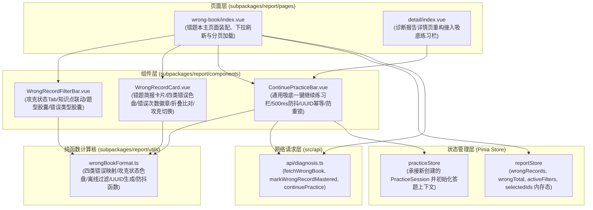
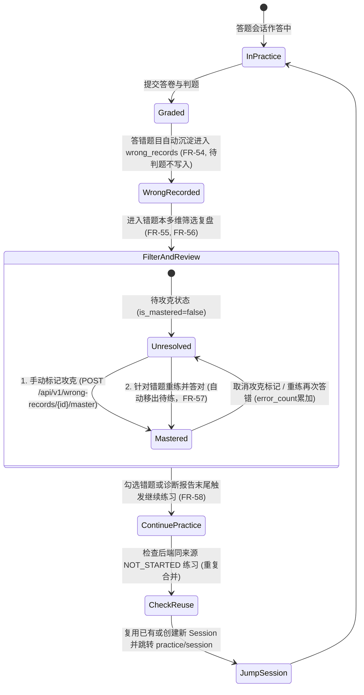

# Spec: 错题本与一键继续练习交互模块 - 技术契约

- **关联 Intent**: ZL-136
- **主导设计人**: TechLead
- **当前状态**: Draft / In-Review / Approved

---

## 1. 架构流向与设计方案

### 1.1 模块分层与依赖拓扑
本特性严格遵循小程序分包隔离与分层架构，所有视图与业务组件驻留在 `subpackages/report/` 独立分包内，保障小程序主包体积维持在 2MB 以下。各组件文件严格遵守代码行数 $\le 300$ 行的架构底线，逻辑与样式分离（抽取同名 SCSS 文件）。



### 1.2 核心业务流程与错题生命周期流转
学生在系统中答题、错题沉淀、筛选复盘、攻克标记到一键强化练习的完整生命周期状态机与流转时序如下：



---

## 2. 组件拆分与详细设计 (Single Component $\le 300$ Lines)

### 2.1 错题本主页面 (`subpackages/report/pages/wrong-book/index.vue` + `wrongBook.scss`)
* **设计职责**: 作为错题本的主容器，负责页面生命周期、路由入参解析（可接收可选的 `material_id` 与 `knowledge_point_id`）、下拉刷新与触底分页加载（每页 20 条，FR-56）、错题多选集维护、骨架屏与空状态占位展示。
* **规模控制**: 页面总行数控制在 220 行以内，复杂布局与样式提取至同级 `wrongBook.scss`。
* **数据流转**:
  - `onLoad`/`onMounted`: 初始化筛选条件，调用 `fetchWrongBook` 获取错题列表，写入 `reportStore`；
  - `onPullDownRefresh`: 重置页码为 1，清空多选状态，重新拉取列表；
  - `onReachBottom`: 页码自增，追加下一页错题数据；
  - 勾选与批量操作: 维护 `selectedRecordIds` 集合，底部 `ContinuePracticeBar` 动态展示已选数量文案（如“巩固已选 3 道错题”或“一键巩固待攻克错题”）。

### 2.2 多维筛选栏 (`subpackages/report/components/WrongRecordFilterBar.vue` + `WrongRecordFilterBar.scss`)
* **设计职责**: 提供四维联动筛选交互，实现 FR-56 规定的精准检索能力：
  1. **攻克状态 Tab**: 全部 / 待攻克 (`is_mastered=false`) / 已攻克 (`is_mastered=true`)，基于 Wot Design Uni 规范设计；
  2. **知识点筛选器**: 支持在当前资料或全局知识点中下拉联动切换；
  3. **题型筛选胶囊**: 单选、多选、判断、填空、简答；
  4. **错误类型胶囊**: 概念性错误、表述不全、审题偏差、未作答（FR-55），高亮呈现对应低饱和语义色彩。
* **事件交互**:
  - 暴露 `filter-change` 事件，入参为 `WrongRecordQueryParams` 结构体；
  - 点击 Tab 或胶囊立即触发事件，由父页面重置页码并重新检索；
  - 组件单文件代码行数控制在 160 行以内。

### 2.3 错题简报卡片 (`subpackages/report/components/WrongRecordCard.vue` + `WrongRecordCard.scss`)
* **设计职责**: 独立封装单条错题的卡片视图（FR-54, FR-55, FR-57）：
  - **题型与错误类型标签**: 顶部并排展示题型标签（单选/多选/判断等）与四类错误类型胶囊（概念性错误、表述不全、审题偏差、未作答）；
  - **错误次数与时间徽章**: 醒目呈现连续答错累计次数（`error_count` / `wrong_count`，如“累计答错 2 次”），以及最后答错时间（格式化友好文本）；
  - **题干与原题快照**: 展示题目题干内容与选项列表；
  - **答案与解析折叠区**: 默认折叠，点击展开查看“您的作答”（标红）与“正确答案”（标绿）对比，以及详细题目解析；
  - **攻克状态切换按键**: 提供一键攻克切换按钮（“标为已攻克” / “移出已攻克”），带轻量加载态与 `scale(0.985)` 触控微反馈；
  - **勾选复选框**: 多选模式下提供选择圆圈，触发 `toggle-select` 事件；
  - 单文件代码行数严格控制在 240 行以内。

### 2.4 吸底防抖防重继续练习操作栏 (`subpackages/report/components/ContinuePracticeBar.vue` + `ContinuePracticeBar.scss`)
* **设计职责**: 通用吸底操作栏，同时服务于诊断报告详情页与错题本页面（FR-58）：
  - **防抖机制**: 内置 500ms 纯函数防抖闭包，拦截高频重复点击；
  - **UUID v4 幂等键**: 每次点击生成全局唯一 UUID v4 幂等键，写入请求头或请求载荷；
  - **状态与防重锁**: `isSubmitting` 状态期间禁用按钮并展示加载动画，防止物理连击与弱网超时重发；
  - **同来源未开始练习防重合并**: 携带 `source_report_id` 与 `source_type`，后端复用已有 `NOT_STARTED` 会话或组装新卷；
  - **无缝流转**: 成功创建后由 `practiceStore` 同步会话状态，直接通过 `uni.navigateTo` 流转至 `subpackages/practice/pages/session/index?id=${newSession.id}`；
  - 单文件代码行数控制在 180 行以内。

### 2.5 诊断报告详情页重构接驳 (`subpackages/report/pages/detail/index.vue`)
* **重构目标**:
  - 原 `subpackages/report/pages/detail/index.vue` 为 297 行，已临近 300 行红线；
  - 引入 `ContinuePracticeBar.vue` 替换原行内吸底按钮与行内 `handleContinuePractice` 函数；
  - 页面行数直接降至 240 行左右，显著提升代码可读性与结构韧性，彻底消除行数超标风险。

---

## 3. 纯函数计算核设计 (`subpackages/report/utils/wrongBookFormat.ts`)

纯函数计算核独立于 UI 框架与网络层，仅依赖标准原生数据结构，确保 100% 分支覆盖与毫秒级单测可测性。

### 3.1 核心纯函数契约清单
1. **错误类型映射 (`getErrorTypeInfo`)**:
   - 输入: `error_type?: string` (如 `conceptual`, `incomplete`, `deviation`, `unanswered`);
   - 输出: `{ type: ErrorType, label: string, color: string, bgColor: string, borderColor: string }`;
   - 规则:
     - `conceptual` $\to$ 概念性错误 (颜色: `#EF4444`, 背景: `#FEF2F2`, 边框: `#FECACA`);
     - `incomplete` $\to$ 表述不全 (颜色: `#F59E0B`, 背景: `#FFFBEB`, 边框: `#FDE68A`);
     - `deviation` $\to$ 审题偏差 (颜色: `#3B82F6`, 背景: `#EFF6FF`, 边框: `#BFDBFE`);
     - `unanswered` $\to$ 未作答 (颜色: `#64748B`, 背景: `#F1F5F9`, 边框: `#E2E8F0`);
     - 缺省或未知类型安全降级为 `conceptual`。

2. **攻克状态映射 (`getResolvedStatusInfo`)**:
   - 输入: `isMastered: boolean`;
   - 输出: `{ label: string, color: string, bgColor: string, isMastered: boolean }`;
   - 规则:
     - `true` $\to$ 已攻克 (颜色: `#10B981`, 背景: `#ECFDF5`);
     - `false` $\to$ 待攻克 (颜色: `#F59E0B`, 背景: `#FFFBEB`)。

3. **累计答错次数格式化 (`formatWrongCount`)**:
   - 输入: `count?: number | null`;
   - 输出: `string` (如 `答错 1 次`, `答错 3 次`, 边界防御 `<= 0` 或 `null` 均返回 `答错 1 次`)。

4. **纯函数离线过滤器 (`filterWrongRecords`)**:
   - 输入: `records: WrongRecordItem[], filters: WrongRecordQueryParams`;
   - 输出: `WrongRecordItem[]`;
   - 规则: 纯函数链式过滤，依次比对 `knowledge_point_id`、`question_type`、`error_type`、`is_mastered`。

5. **UUID v4 幂等键生成纯函数 (`generateIdempotencyKey`)**:
   - 输出: 标准 UUID v4 格式字符串 (`xxxxxxxx-xxxx-4xxx-yxxx-xxxxxxxxxxxx`)，用于接口防重与请求追踪。

6. **纯函数通用防抖函数 (`debounce`)**:
   - 闭包实现标准防抖器，默认 `delay = 500ms`，返回包含 `cancel()` 清理能力的可执行防抖代理。

### 3.2 复杂度与质量约束
- 所有纯函数 McCabe 环路复杂度 $V(G) \le 8$；
- 单元测试分支覆盖率必须达到 100%。

---

## 4. API 契约与网络层设计 (`src/api/diagnosis.ts`, `src/types/report.ts`)

### 4.1 接口契约定义
1. **多维条件分页检索错题本记录**:
   - `GET /api/v1/wrong-records`
   - 查询参数 (`WrongRecordQueryParams`):
     - `material_id?: string` (UUID 字符串)
     - `knowledge_point_id?: string` (UUID 字符串)
     - `question_type?: string` (题型过滤)
     - `error_type?: string` (四类错误过滤)
     - `is_mastered?: boolean` (攻克状态过滤)
     - `page?: number` (默认 1)
     - `page_size?: number` (默认 20, 上限 100)
   - 响应模型: `ApiResponse<PageResult<WrongRecordItem>>`

2. **错题攻克标记切换**:
   - `POST /api/v1/wrong-records/{id}/master`
   - 路径参数: `id: string` (错题记录主键 UUID)
   - 响应模型: `ApiResponse<{ id: string; is_mastered: boolean; mastered_at: string | null; message: string }>`

3. **错题删除 (可选安全清理)**:
   - `DELETE /api/v1/wrong-records/{id}`
   - 路径参数: `id: string` (错题记录主键 UUID)
   - 响应模型: `ApiResponse<{ id: string; removed: boolean; message: string }>`

4. **继续强化练习 / 错题巩固组卷 (带防重合并)**:
   - `POST /api/v1/practices`
   - 请求载荷:
     ```typescript
     {
       title: string;
       material_id?: string;
       knowledge_point_ids: string[];
       source_report_id?: string;
       source_type: "weakness" | "wrong_record";
       mode: "weak_points" | "random";
       question_count?: number;
     }
     ```
   - 响应模型: `ApiResponse<PracticeSession>`
   - 幂等防重机制: 后端服务若发现同用户、同来源 (`source_report_id`) 且处于 `NOT_STARTED` 的练习，直接复用并返回已有会话对象（FR-58）。

### 4.2 异常映射与容灾处理
- `40019` (`WrongRecordNotFoundError`): 提示“错题记录不存在或已被移除”，自动刷新本地列表；
- `40012` (`PracticeEmptyQuestionsError`): 提示“所选范围内暂无可用题目，请调整筛选后重试”；
- `30017` (`IdempotencyConflictError`): 提示“练习正在创建中，请勿重复点击”。

---

## 5. 状态管理与数据隔离规范 (Pinia & Storage)

### 5.1 Pinia `reportStore` 错题状态扩展与 `practiceStore` 承接
遵循 AGENTS.md 规范，全系统严格限定 4-Store，Store 内部严禁直接发起 HTTP 请求：
* **`reportStore` 扩展字段**:
  - `wrongRecords`: `ref<WrongRecordItem[]>([])` 错题列表缓存；
  - `wrongRecordTotal`: `ref<number>(0)` 错题总条数；
  - `selectedRecordIds`: `ref<string[]>([])` 批量勾选的错题 ID 列表；
  - `wrongFilters`: `ref<WrongRecordQueryParams>({})` 当前活跃筛选器；
* **`reportStore` 纯 Mutation Actions**:
  - `setWrongRecords(items: WrongRecordItem[], total: number)`: 全量替换列表与总数；
  - `appendWrongRecords(items: WrongRecordItem[])`: 分页触底追加；
  - `updateWrongRecordMastered(id: string, isMastered: boolean)`: 乐观更新单条错题攻克状态；
  - `toggleSelectRecord(id: string)`: 切换单题勾选状态；
  - `selectAllRecords(ids: string[])`: 全选/全不选；
  - `clearSelectedRecords()`: 清空勾选集；
* **`practiceStore` 跨 Store 承接**:
  - `continuePractice` 创建成功返回 `PracticeSession` 时，直接调用 `practiceStore.initSession(newSession.id, newSession.questions)` 完成上下文加载，随后触发页面跳转。

### 5.2 Storage 白名单安全红线
* 本地 Storage 白名单**仅限三类**:
  1. 用户登录态与 Token；
  2. 未交卷答题草稿 (`AnswerDraft`)；
  3. 用户偏好设置。
* **绝密红线**: 错题本记录、题干文本、选项内容与解析**绝对严禁**写入本地持久化 Storage。页面重新进入必须由 API 重新拉取或从 Pinia 内存读取。

---

## 6. 界面视觉与微交互规范 (Wot Design Uni & DESIGN.md)

### 6.1 零 Unicode Emoji 与色彩矩阵
- 全模块严禁使用 Unicode Emoji，所有图标均采用 Wot Design Uni 矢量图标（如 `wd-icon name="check-circle"`、`wd-icon name="filter"` 等）；
- 严格遵循低饱和色盘：
  - 待攻克 / 需巩固: `#F59E0B` (背景 `#FFFBEB`，边框 `#FDE68A`)；
  - 已攻克 / 良好: `#10B981` (背景 `#ECFDF5`，边框 `#A7F3D0`)；
  - 概念性错误: `#EF4444` (背景 `#FEF2F2`，边框 `#FECACA`)；
  - 表述不全: `#F59E0B` (背景 `#FFFBEB`，边框 `#FDE68A`)；
  - 审题偏差: `#3B82F6` (背景 `#EFF6FF`，边框 `#BFDBFE`)；
  - 未作答: `#64748B` (背景 `#F1F5F9`，边框 `#E2E8F0`)。

### 6.2 动效与触控反馈
- 卡片与按钮点击态必须添加 `transform: scale(0.985); transition: transform 0.15s ease;` 微反馈；
- 卡片圆角统一为 `20rpx`，外层卡片间距采用 `--spacing-md (16rpx)` 与 `--spacing-lg (24rpx)`。

---

## 7. 替代方案评估与权衡 (Trade-offs)

### 方案 A (采纳方案): 纯函数防抖 + UUID 幂等键 + 服务端同来源未开始练习防重合并
- **优点**: 客户端通过 500ms 防抖阻断高频双击，UUID 幂等键防并发，服务端通过 `source_report_id` 自动合并未开始练习（FR-58），前后端两道防线协同；
- **缺点**: 需要前端生成 UUID 并统一参数传递；
- **结论**: 完全对齐 FR-58 与 NFR-07，架构健壮性最高。

### 方案 B (未采纳): 纯前端布尔标志位防重
- **缺点**: 无法防御快速页面返回再进入连击，弱网环境下多请求到达后端仍会创建多份重复练习，且违背 FR-58 关于“同来源未开始练习不得重复创建”的业务约束；
- **未采纳原因**: 可靠性差，无法满足生产级防重需求。

---

## 8. 回滚与故障应急策略 (Rollback & Contingency)

1. **降级开关与快速回滚**: 若新版错题本页面上线发生不可预知异常，可直接在 `pages.json` 中卸载 `subpackages/report/pages/wrong-book/index` 路由入口，降级回控制台导航，无后端数据库与数据迁移回滚风险。
2. **诊断报告页独立性**: `detail/index.vue` 中接入的 `ContinuePracticeBar` 若发生调用异常，仅影响“继续练习”按钮，不会影响诊断报告已生成的得分率、薄弱知识点及逐题卡片的查看。

---

## 9. 阶段准出签批 (Gate 2 Sign-off)
- [x] 技术架构拓扑与组件拆分已确认 (单组件 <= 300 行)
- [x] 多维筛选、攻克标记与防重继续练习机制清晰完备
- [x] 纯函数核与 Pinia 状态流转契约明确
- **准出结论**: Approved
- **签批人 / 日期**: TechLead / 2026-09-25 11:42
