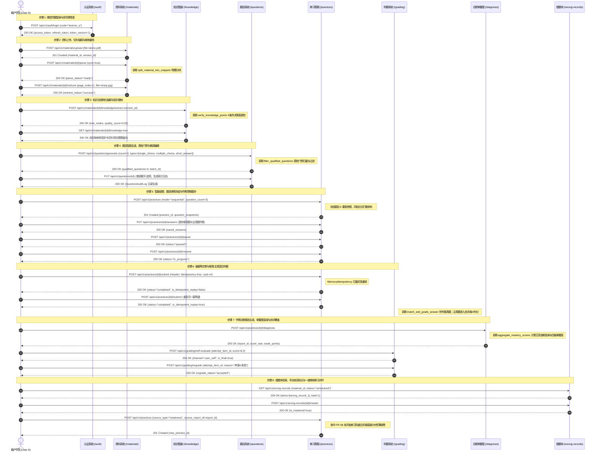

# Spec: P0 端到端全链路闭环集成与质量门禁审计 - 技术契约

- **关联 Intent**: ZL-137
- **主导设计人**: Dev
- **当前状态**: Draft / In-Review / Approved

---

## 1. 架构流向与 8 步正向业务流拓扑

### 1.1 总体架构与端到端测试拓扑
本规范定义智练平台 P0 核心业务端到端全链路闭环集成测试架构（`backend/tests/integration/test_p0_full_chain_e2e.py`）。测试套件基于 ASGI 内存传输通道 (`httpx.AsyncClient`)，在严格遵循 `AGENTS.md` 零外部网络与毫秒级单用例执行红线的前提下，装配真实的五层单向架构依赖。通过 SQLite 纯内存数据库与纯内存外设适配器，串联完整 8 大业务节点，贯穿 5 块纯函数计算核的物理调用，并在每一阶段注入多租户水平越权攻击校验。

```mermaid
flowchart TD
    subgraph ClientLayer ["客户端调用与传输层 (httpx.AsyncClient + ASGI Transport)"]
        UserAClient["User A 正常租户客户端\n(携带 Bearer Token A)"]
        UserBClient["User B 恶意租户攻击客户端\n(携带 Bearer Token B)"]
    end

    subgraph ApiLayer ["FastAPI 统一路由控制层 (/api/v1)"]
        AuthRouter["/auth\n(login, refresh)"]
        MaterialRouter["/materials\n(upload, parse, reshoot, status)"]
        KnowledgeRouter["/knowledge\n(tree, detail, extract)"]
        QuestionRouter["/questions\n(generate, update, detail, audit)"]
        PracticeRouter["/practices\n(create, answers, pause, resume, submit)"]
        GradingRouter["/grading\n(grading, self-evaluate, regrade)"]
        DiagnosisRouter["/diagnosis & /wrong-records\n(reports, mastery, wrong-records, master)"]
    end

    subgraph ServiceLayer ["业务服务编排层 (app.services)"]
        AuthSvc["AuthService"]
        MatSvc["MaterialService"]
        KnowSvc["KnowledgeService"]
        QuestSvc["QuestionService"]
        PractSvc["PracticeService"]
        GradSvc["GradingService"]
        DiagSvc["DiagnosisService"]
    end

    subgraph PureAlgorithms ["纯函数计算核 (app.core.algorithms - 真实物理调用/零Mock)"]
        AlgoChunk["split_material_into_snippets\n(切片分块/边界截断/合并)"]
        AlgoKnowQual["verify_knowledge_points\n(知识点4条件决策表质检)"]
        AlgoQuestQual["filter_qualified_questions\n(题目排重/冲突/无源门禁)"]
        AlgoGrading["match_and_grade_answer\n(客观题规则秒判/双阈值/否定反转)"]
        AlgoMastery["aggregate_mastery_scores\n(艾宾浩斯30天半衰期/四级状态离散)"]
    end

    subgraph StorageLayer ["内存适配器与持久化层 (app.integrations + SQLite in-memory)"]
        MemoryStorage["MemoryStorageAdapter\n(纯内存文件对象存储)"]
        FakeOCR["FakeOCRAdapter\n(确定性文本与清晰度打分)"]
        FakeLLM["FakeLLMAdapter\n(结构化强类型出题与主观判题)"]
        FakeEmbed["FakeEmbeddingAdapter\n(确定性向量化适配器)"]
        MemoryQueue["MemoryQueueAdapter\n(纯内存异步任务队列)"]
        MemoryIdempotency["MemoryIdempotencyAdapter\n(分布式防重幂等锁)"]
        SqliteDB[("SQLite in-memory DB\n(Base.metadata 实体表 + TenantModelMixin 强隔离)")]
    end

    UserAClient --> ApiLayer
    UserBClient -.->|越权攻击探测 (404/403/401 阻断)| ApiLayer

    AuthRouter --> AuthSvc
    MaterialRouter --> MatSvc
    KnowledgeRouter --> KnowSvc
    QuestionRouter --> QuestSvc
    PracticeRouter --> PractSvc
    GradingRouter --> GradSvc
    DiagnosisRouter --> DiagSvc

    MatSvc --> AlgoChunk
    MatSvc --> MemoryStorage
    MatSvc --> FakeOCR
    MatSvc --> FakeEmbed

    KnowSvc --> AlgoKnowQual
    KnowSvc --> FakeLLM
    KnowSvc --> FakeEmbed

    QuestSvc --> AlgoQuestQual
    QuestSvc --> FakeLLM
    QuestSvc --> FakeEmbed

    PractSvc --> MemoryIdempotency
    PractSvc --> MemoryQueue

    GradSvc --> AlgoGrading
    GradSvc --> FakeLLM

    DiagSvc --> AlgoMastery

    ServiceLayer --> SqliteDB
```

### 1.2 完整 8 步正向业务流拓扑时序
全链路闭环严格模拟真实用户端到端生命周期，包含以下 8 步顺次流转：



---

## 2. 多租户数据隔离与越权攻击测试矩阵

系统建立在多租户声明式隔离基线（`TenantModelMixin`）之上，仓储层所有 SQL 查询强制携带 `user_id`。为检验多租户绝对隔离与防越权能力，端到端测试套件将在业务 8 步的每个环节均注入来自攻击者 User B（携带合法 Token B）的越权攻击探测，验证系统 100% 阻断且绝密脱敏：

| 序号 | 业务阶段 | 攻击对象与目标资源 | User B 越权攻击操作 | 触发 API 接口与方法 | 预期阻断结果 (HTTP 状态码 / 错误码) | 数据安全与脱敏断言 |
| :--- | :--- | :--- | :--- | :--- | :--- | :--- |
| **AT-01** | 资料阶段 | User A 上传的资料详情 | 尝试偷窥 User A 的资料元数据 | `GET /api/v1/materials/{a_mat_id}` | `404 Not Found` (错误码 `40010`) | 响应绝不泄露资料标题、文件大小及版本信息 |
| **AT-02** | 资料阶段 | User A 的资料文件版本 | 尝试删除或重拍 User A 的资料 | `POST /api/v1/materials/{a_mat_id}/reshoot` | `404 Not Found` (错误码 `40010`) | 磁盘存储与版本记录物理不产生任何写入与状态变更 |
| **AT-03** | 知识树阶段 | User A 的知识树大纲 | 尝试拉取 User A 专属资料知识树 | `GET /api/v1/materials/{a_mat_id}/knowledge-tree` | `404 Not Found` (错误码 `40010`) | 不返回任何树形节点或切片溯源信息 |
| **AT-04** | 知识树阶段 | User A 的具体知识点 | 尝试读取 User A 提取的知识点详情 | `GET /api/v1/knowledge/{a_point_id}` | `404 Not Found` (错误码 `40007`) | 严禁返回知识点名称、描述与关联切片标识 |
| **AT-05** | 题目阶段 | User A 生成的题目库 | 尝试窃取 User A 的题目题干与参考答案 | `GET /api/v1/questions/{a_quest_id}` | `404 Not Found` (错误码 `40008`) | 绝密脱敏红线：题干、选项、答案与解析零返回 |
| **AT-06** | 题目阶段 | User A 的题目内容 | 尝试篡改或软删除 User A 的题目 | `PUT /api/v1/questions/{a_quest_id}` | `404 Not Found` (错误码 `40008`) | 不得产生任何修改审计日志或数据覆盖 |
| **AT-07** | 练习阶段 | User A 正在作答的练习 | 尝试查看 User A 的练习卷面快照 | `GET /api/v1/practices/{a_prac_id}` | `404 Not Found` (错误码 `40010`) | 卷面题目快照与作答状态严格保密 |
| **AT-08** | 练习阶段 | User A 的作答进度 | 尝试覆盖 User A 的作答草稿或暂停练习 | `PUT /api/v1/practices/{a_prac_id}/answers` | `404 Not Found` (错误码 `40010`) | 无法篡改任何 attempt_item 作答记录 |
| **AT-09** | 练习阶段 | User A 的交卷会话 | 尝试越权提前交卷 User A 练习 | `POST /api/v1/practices/{a_prac_id}/submit` | `404 Not Found` (错误码 `40010`) | 无法触发判题任务或改变会话生命周期 |
| **AT-10** | 判题阶段 | User A 提交的作答项 | 尝试读取 User A 的作答判题记录 | `GET /api/v1/attempts/{a_item_id}/grading` | `404 Not Found` (错误码 `40013`) | 得分、判题通道、评语及匹配详情零泄漏 |
| **AT-11** | 判题阶段 | User A 的主观题作答项 | 尝试替 User A 主观题打分自评 | `POST /api/v1/grading/self-evaluate` | `404 Not Found` (错误码 `40013`) | 无法生成恶意评分或覆盖正式判题结果 |
| **AT-12** | 判题阶段 | User A 的已判题目 | 尝试针对 User A 题目恶意发起重新判题 | `POST /api/v1/grading/regrade` | `404 Not Found` (错误码 `40013`) | 无法消耗系统重判配额或触发重判流水线 |
| **AT-13** | 诊断阶段 | User A 的学情诊断报告 | 尝试获取 User A 的综合得分与薄弱分析 | `GET /api/v1/practices/{a_prac_id}/diagnosis` | `404 Not Found` (错误码 `40017`) | 得分率、知识点掌握度与诊断总结绝密隔离 |
| **AT-14** | 掌握度阶段 | User A 的宏观掌握看板 | 尝试查询 User A 的艾宾浩斯全景掌握度 | `GET /api/v1/mastery?material_id={a_mat_id}` | `200 OK` (返回空看板，total=0, weak=0) | 仅能按 User B 自身 ID 聚合，查不出 A 的任何数据 |
| **AT-15** | 错题本阶段 | User A 的错题沉淀本 | 尝试拉取 User A 专属错题列表 | `GET /api/v1/wrong-records?material_id={a_mat_id}` | `200 OK` (列表 items 为空，total=0) | 错题列表绝对隔离，防止学员隐私被窥探 |
| **AT-16** | 错题本阶段 | User A 的错题实体 | 尝试将 User A 的错题标记为已消灭/已掌握 | `POST /api/v1/wrong-records/{a_wrong_id}/master` | `404 Not Found` (错误码 `40019`) | 无法篡改任何错题攻克状态与复习计数 |

---

## 3. 5 块纯函数计算核在真实链路中的集成与白盒覆盖检验

端到端集成测试直接集成业务服务真实调用的纯函数算法核，**严禁对算法核内部打桩或 Mock 替身**，必须通过全链路真实传参验证其契约闭环与边界鲁棒性：

### 3.1 资料切片分块算法 (`split_material_into_snippets`)
- **调用位置**: `MaterialService.trigger_parse` / `parse_material`
- **白盒覆盖验证**:
  1. 片段长度边界：单段超长强制按 `snippet_size=500` 截断，重叠区 `overlap=50` 保障上下文连贯；
  2. 孤立短段合并：小于 `min_length=20` 的碎片段落自动向上合并入上一切片；
  3. 空白与特殊字符：处理零长度、纯换行符与多页混合边界，确保生成切片的连续性与索引完整性；
  4. 环路复杂度门限：$V(G) \le 12$，行覆盖率 $\ge 95\%$，分支覆盖率 $100\%$。

### 3.2 知识点决策表质检算法 (`verify_knowledge_points`)
- **调用位置**: `KnowledgeService.extract_knowledge_tree` / 知识抽取质检网关
- **白盒覆盖验证**:
  1. 决策表 4 条件全面组合：抽取知识点数量区间 (`count in [1, 50]`)、树形层级深度 (`depth <= 3`)、命名可读性（无数字编号、长度 2~30 字符）、章节切片覆盖率 ($\ge 80\%$)；
  2. 达标与阻断判定：达标时放行建树，任意一维不达标时返回质量检查失败及修复建议；
  3. 判定覆盖率要求：$100\%$ 判定覆盖率，环路复杂度 $V(G) \le 10$。

### 3.3 题目质检过滤算法 (`filter_qualified_questions`)
- **调用位置**: `QuestionService.generate_questions`
- **白盒覆盖验证**:
  1. 4 类异常全面拦截：重复题干（Levenshtein 相似度超阈值）、答案冲突（客观题选项中无正确答案或多答案冲突）、缺少来源切片溯源关联、题干表述歧义；
  2. 题目状态流转：通过门禁的题目置为 `AVAILABLE`，存疑题目置为 `PENDING` 并写入 `QuestionQualityCheck`；
  3. 覆盖率要求：条件组合全覆盖，行覆盖率 $\ge 95\%$。

### 3.4 判题匹配决策核 (`match_and_grade_answer`)
- **调用位置**: `GradingService.grade_practice_submission` / `grade_attempt_item`
- **白盒覆盖验证**:
  1. 双阈值判题边界：文本相似度 $\ge 0.85$ 判定全对（得分 1.0）；相似度 $< 0.40$ 判定全错（得分 0.0）；介于 $0.40 \le score < 0.85$ 触发转 AI 语义裁定；
  2. 成对否定词反转测试：当作答与标准答案仅否定词（如“不是”、“不属于”、“没有”）相反时，得分方向严格反转，严禁误判；
  3. 环路复杂度门限：$V(G) \le 10$，条件组合全覆盖。

### 3.5 艾宾浩斯掌握度衰减聚合核 (`aggregate_mastery_scores`)
- **调用位置**: `DiagnosisService.generate_diagnosis_report` / `get_user_mastery_overview`
- **白盒覆盖验证**:
  1. 时间衰减模型：加权得分乘衰减因子 $e^{-\lambda \cdot \Delta t}$，默认半衰期 30 天；
  2. 多来源渠道权重：离线规则秒判权重 $1.0$、AI 智能判题权重 $0.8$、用户自评与重判权重 $0.5$；
  3. 四级状态临界值：无作答记录返回“未学 (`0.00`)”；$0.00 < score < 0.40$ 为“需巩固”；$0.40 \le score < 0.70$ 为“良好”；$score \ge 0.70$ 为“精通”；
  4. 环路复杂度门限：$V(G) \le 8$，分支覆盖率 $100\%$。

---

## 4. 前后端全量质量门禁审计方案

在端到端全链路闭环用例通过后，必须在终端实际物理执行全量质量门禁基线检查，退出码为 0 作为交付唯一准出标准：

### 4.1 后端工程质量门禁基线
进入 `backend` 目录，执行以下全量验证命令流水线：

```bash
cd backend && \
ruff format --check . && \
ruff check . && \
mypy app && \
bandit -r app -ll && \
pip-audit --strict && \
python3 ../tooling/check_layers.py --root app && \
pytest tests/integration/test_p0_full_chain_e2e.py -v && \
pytest tests --cov=app --cov-branch --cov-fail-under=80
```

- **Ruff Format & Check**: 强制行宽 100，规范导入排序，零 PEP 8 警告；
- **Mypy Strict**: 严格静态类型检查，涵盖所有函数参数与返回值类型注解，零未标注违规；
- **Bandit Security**: 高危安全隐患必须为 0，杜绝 SQL 拼接、凭据硬编码及危险反序列化；
- **Pip-Audit**: 严格依赖安全漏洞审计，零已知 CVE 漏洞；
- **Check Layers**: 自动化扫描架构单向依赖，路由、服务、仓储、纯计算核之间零跨层逆向导入；
- **Pytest E2E & Full Coverage**: 全量端到端用例全绿，全局后端行覆盖率 $\ge 80\%$、分支覆盖率 $\ge 70\%$，纯计算核行覆盖率 $\ge 95\%$、分支覆盖率 $\ge 90\%$。

### 4.2 前端工程质量门禁基线
进入 `miniprogram` 目录，执行以下全量验证命令流水线：

```bash
cd miniprogram && \
pnpm run lint && \
pnpm run type-check && \
pnpm run test:unit && \
pnpm run build:mp-weixin
```

- **ESLint & Prettier**: 强制代码规范，单组件代码行数严格 $\le 300$ 行；
- **Vue-tsc Type Check**: 模板属性与 TypeScript 静态类型 0 报错；
- **Vitest Unit**: 全部前端单元测试毫秒级 100% 通过；
- **MP-Weixin Build**: 微信小程序编译构建 0 错误，主包体积 $\le 2\text{MB}$，零 Unicode Emoji 表情符号。

### 4.3 SDLC 流程与工具链合规审计
在项目根目录下执行：

```bash
python3 -m unittest discover tests && \
python3 tooling/check_sdlc_integrity.py
```

- 验证脚手架生命周期与统计工具完整可用；
- 验证当前任务（ZL-137）在各工件（`intent.md`, `spec.md`, `plan.md`）中的状态一致性，拦截占位符残留与违规跳步。

---

## 5. 替代方案与权衡考量 (Alternatives Considered & Trade-offs)

### 方案 A (采纳方案): 基于 ASGI 传输层 + 内存 SQLite + 纯内存适配器的物理闭环集成测试
- **实现机制**: 使用 `httpx.AsyncClient(transport=ASGITransport(app=test_app))`，挂载完整 `api_v1_router` 和 `AppError` 异常处理器，使用纯内存 SQLite 运行真实 SQLAlchemy 模型，外设（S3/MinIO、OCR、LLM、Redis）采用已有的纯内存 Fake/Stub 适配器。
- **优点**:
  1. 100% 遵从 `AGENTS.md`“自动化测试严禁联网、单用例毫秒级通过”的铁律；
  2. 真实穿越完整的 FastAPI 路由解析、Pydantic DTO 校验、依赖注入链路与 HTTP 状态码映射；
  3. 数据隔离与事务完全在独立内存会话中自闭环，无外部资源泄露与并发脏数据风险；
  4. 支持毫秒级重置与极速执行，CI/CD 流水线执行耗时可在 60 秒内完成。
- **缺点**: 无法测试实际跨机网络延迟与高并发连接池打满等极端压力场景。
- **结论**: 生产级单测与集成测试的最优实践，全面兼顾真实性、确定性与极速反馈。

### 方案 B (未采纳): 依赖 Docker Compose 启动真实 PostgreSQL + Redis + MinIO 容器环境
- **实现机制**: 自动化脚本拉起外部 Docker 容器组，向本地暴露端口并执行真实网络通信与集成测试。
- **未采纳原因**:
  1. 环境启动耗时过长（每次冷启动 15~30 秒），严重拖慢本地研发与 CI 门禁效率；
  2. 外部端口可能在宿主机上发生冲突（如 5432, 6379），降低跨开发机运行的确定性；
  3. 触碰 `AGENTS.md` 单元与集成测试网络隔离红线，增加了无意义的基础设施维护成本。

### 方案 C (未采纳): 仅在 Service 层编写跨服务方法调用的“逻辑伪集成”
- **实现机制**: 跳过 FastAPI 路由层与 HTTP 客户端，在 Python 代码中依次实例化各 Service 并直接调用其内部方法。
- **未采纳原因**:
  1. 完全绕过了 HTTP 路由装配、URL 前缀匹配、请求头解析（如 `Idempotency-Key`）、Token 验签注入（`get_current_user`）以及 Pydantic 请求体验证；
  2. 无法验证 `AppError` 转换到 HTTP 404/403/400 状态码与统一 JSON 包装的正确性；
  3. 无法有效检验越权攻击时由路由依赖层触发的拦截行为，集成置信度极低。

---

## 6. 7 维动态风险核验与回滚预案 (Risk & Rollback Verification)

### 6.1 7 维动态风险核验扫描

| 维度 | 风险等级 | 扫描分析与防护策略 |
| :--- | :--- | :--- |
| **1. Files (文件)** | 低风险 | 仅新增集成测试文件 `backend/tests/integration/test_p0_full_chain_e2e.py` 与 SDLC 工件，严禁修改任何已有业务代码与接口定义。 |
| **2. API (接口契约)** | 零风险 | 纯只读使用已冻结的 v1 API 契约（`/auth`, `/materials`, `/knowledge`, `/questions`, `/practices`, `/grading`, `/diagnosis`, `/wrong-records`），不变更任何 HTTP 路径、入参或出参结构。 |
| **3. Schema (数据库)** | 零风险 | 不涉及任何数据表结构变更或 Alembic 迁移脚本，测试在独立内存 SQLite 中动态构建，对生产与预发持久化环境零破坏。 |
| **4. Auth (鉴权隔离)** | 低风险 | 深度审计鉴权依赖项与租户隔离，采用 User A 与 User B 独立双 Token 进行正向与负向攻击测试，确保隔离逻辑 100% 严密。 |
| **5. Deps (外部依赖)** | 零风险 | 完全基于现有依赖库（pytest, httpx, fastapi, sqlalchemy, pydantic, ruff, mypy, bandit），不引入任何新的 pip 或 npm 依赖项。 |
| **6. Migration/Rollback (迁移与回滚)** | 零风险 | 无数据迁移与持久化状态变更，回滚操作极度轻量，只需删除或还原测试用例文件即可。 |
| **7. Blast Radius (爆炸半径)** | 零风险 | 变更范围严格限制在自动化测试套件与质量检查脚本内，对正在运行的任何微服务、小程序前端或数据表均无破坏面。 |

### 6.2 回滚与故障应急策略
1. **测试用例失败应急处理**: 若端到端全链路集成测试在某些步骤发生非预期断言失败，首先通过错误日志 8 要素定位具体是路由依赖覆盖（`dependency_overrides`）还是纯函数算法核临界值未达成，在保持公共 API 契约完全不变的前提下修正集成编排；
2. **零代码破坏回滚**: 本任务不修改任何生产业务逻辑代码，若端到端测试用例需要废弃或调整，可直接执行 `git checkout` 撤销 `backend/tests/integration/test_p0_full_chain_e2e.py`，系统立即可回退至稳定基线，零迁移负担。

---

## 7. 阶段准出签批 (Gate 2 Sign-off)
- [x] 架构流向与 API 契约已冻结
- [x] 替代方案已完成推演与权衡
- [x] 7 维风险已核验且具备明确回滚预案
- **审查结论**: Approved
- **签批人 / 日期**: yezisama / 2026-09-25 17:15
