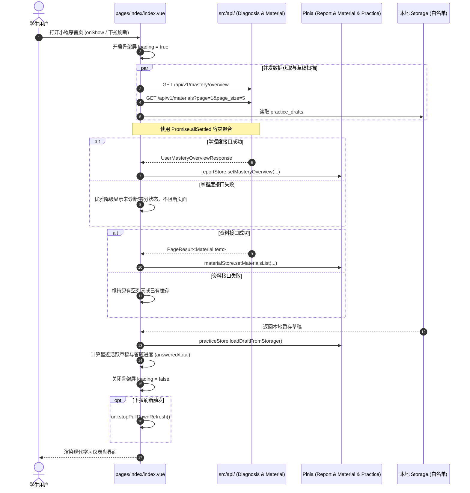

# Spec: 首页工作台UI重构与状态栏/快捷上传/最近学习流组件 - 技术契约

- **关联 Intent**: ZL-138
- **主导设计人**: TechLead
- **当前状态**: Approved

---

## 1. 架构流向与设计方案

### 1.1 模块分层与依赖拓扑
本方案依据项目单一职责规范与分层矩阵，将首页工作台由原有杂糅单文件重构为“容器-业务组件-状态-接口”单向清晰的数据拓扑：
- 页面容器 (`miniprogram/src/pages/index/index.vue`) 纯粹负责生命周期编排、多路并发容灾、下拉刷新与骨架屏切换；
- 业务子组件均驻留在 `miniprogram/src/components/home/` 独立目录中，单文件代码行数严格 $\le 300$ 行，配套同名 SCSS 样式表；
- 快捷上传直接集成复用现有的 `subpackages/material/components/MaterialUpload.vue`，实现跨包复用与零重复造轮子。

```mermaid
flowchart TD
    subgraph PageLayer ["页面容器层 (pages/index)"]
        IndexPage["index.vue\n(生命周期/Promise.allSettled并发/wd-skeleton骨架屏/下拉刷新)"]
        IndexStyle["index.scss\n(页面级布局约束/低饱和样式tokens)"]
    end

    subgraph HomeComponents ["首页专属组件层 (components/home)"]
        MasteryBar["MasteryDashboardBar.vue & .scss\n(大号总分/四档徽章/紧凑四档横条/跳转诊断详情)"]
        QuickUpload["QuickUploadBar.vue & .scss\n(一体化上传横幅/微信文件或相册选单/高触控区)"]
        RecentSection["RecentLearningSection.vue & .scss\n(智能双轨流: 继续练习置顶卡 + 最近资料2份)"]
        NewbieCard["NewbieGuideCard.vue & .scss\n(零数据温和引导/3步学习指引/快速开启学习)"]
    end

    subgraph ReusableModule ["复用子包组件 (subpackages/material/components)"]
        MaterialUploadModal["MaterialUpload.vue\n(微信文件选取/拍照相册/MinIO直传/解析调度)"]
    end

    subgraph StateLayer ["状态管理层 (Pinia 4-Store)"]
        UserStore["userStore (用户资料与登录态)"]
        ReportStore["reportStore (masteryOverview 宏观四档统计)"]
        MaterialStore["materialStore (materialsList 资料列表)"]
        PracticeStore["practiceStore (drafts 本地答题草稿与会话)"]
    end

    subgraph ApiLayer ["网络请求层 (src/api)"]
        DiagnosisApi["api/diagnosis.ts (fetchMasteryOverview)"]
        MaterialApi["api/material.ts (fetchMaterialList)"]
    end

    subgraph StorageLayer ["本地持久化 (Storage 白名单)"]
        PracticeDrafts["practice_drafts (本地未交卷草稿暂存)"]
    end

    IndexPage --> MasteryBar
    IndexPage --> QuickUpload
    IndexPage --> RecentSection
    IndexPage --> NewbieCard
    QuickUpload --> MaterialUploadModal

    IndexPage --> DiagnosisApi
    IndexPage --> MaterialApi
    IndexPage --> ReportStore
    IndexPage --> MaterialStore
    IndexPage --> UserStore
    IndexPage --> PracticeStore

    PracticeStore --> PracticeDrafts
    IndexPage -.-> IndexStyle
```



### 1.2 页面生命周期并发与数据流转时序图
页面加载与下拉刷新严格采用 `Promise.allSettled` 并发调度，即使掌握度服务发生网络抖动，资料列表与本地草稿依然能正常渲染，保证高可用容灾。



---

## 2. API 与数据契约设计

### 2.1 依赖的外部与后端 API 端点契约
本模块零新增后端接口，完全复用已有标准化 RESTful 契约：

1. **用户掌握度全景概览接口**：
   - **路由**: `GET /api/v1/mastery/overview`
   - **入参**: 可选 Query `material_id?: string`
   - **出参 (UserMasteryOverviewResponse)**:
     ```typescript
     export interface UserMasteryOverview {
       mastered_count: number;    // 精通知识点数 (score >= 0.70)
       proficient_count: number;  // 良好知识点数 (0.40 <= score < 0.70)
       weak_count: number;        // 需巩固知识点数 (0.00 < score < 0.40)
       unlearned_count: number;   // 未学知识点数 (score == 0.00)
       overall_score?: number;    // 宏观平均分 (0.0~1.0 或 0~100)
       weak_points?: WeakPoint[]; // 薄弱知识点列表
     }
     ```
   - **异常与错误码**: `20001` 未登录返回空态；网络超时或服务端降级时前端安全兜底展示未诊断。

2. **学习资料分页检索接口**：
   - **路由**: `GET /api/v1/materials`
   - **入参**: `MaterialListQueryParams` (`page: 1`, `page_size: 5`)
   - **出参 (PageResult<MaterialItem>)**:
     ```typescript
     export interface MaterialItem {
       id: string;
       title: string;
       file_format: string;       // pdf / docx / txt / image
       file_size: number;
       status: MaterialStatus;    // ready / parsing / pending / retake_required
       created_at: string;
       versions_count?: number;
     }
     ```

3. **本地作答草稿白名单契约 (Storage)**：
   - **Storage Key**: `practice_drafts` (白名单允许)
   - **结构**: `Record<string, AnswerDraft>`，包含 `practice_id`, `answers`, `updated_at`，由此派生提取最近活跃练习。

### 2.2 核心组件 Props / Emits 契约

#### 1. `MasteryDashboardBar.vue` (掌握度状态栏组件)
- **Props**:
  - `overview`: `UserMasteryOverview | null` (宏观掌握度统计对象，缺省为 null)
  - `loading`: `boolean` (是否处于数据加载中，默认 false)
- **Emits**:
  - `tap-detail`: `() => void` (点击整卡时触发，默认导航至 `/subpackages/report/pages/detail/index`)
- **排版参数与色彩规范**:
  - 卡片底色: `#FFFFFF`，圆角: `24rpx` (`$radius-lg`)，阴影: `$shadow-card`；
  - 左侧: 综合得分字号 `44rpx`，字重 `800`，得分文案如 `85分` 或 `--`；四档徽章文字依据最高或当前综合档次显示（精通/良好/需巩固/未学）；
  - 右侧: 紧凑四档考点分布横条，高度 `16rpx`，圆角 `8rpx`；
    - 精通段: `$mastery-mastered-fill: #8B5CF6`
    - 良好段: `$mastery-proficient-fill: #10B981`
    - 需巩固段: `$mastery-weak-fill: #F59E0B`
    - 未学段: `$mastery-unlearned-fill: #94A3B8`
  - 横条下方数值紧凑排布：精通 12 · 良好 8 · 需巩固 3 · 未学 15。

#### 2. `QuickUploadBar.vue` (快捷上传行动栏组件)
- **Props**:
  - `disabled`: `boolean` (可选，是否禁用上传，默认 false)
- **Emits**:
  - `upload-success`: `(material: MaterialUploadResponse) => void` (资料上传成功且后端已受理)
- **交互与弹窗集成**:
  - 一体化横幅卡片，浅主题蓝背景 (`$--wot-color-theme-light: #EFF6FF`)，主题蓝发丝边框 (`$--wot-color-theme-border: #BFDBFE`)；
  - 触控热区 $\ge 88\text{rpx}$，按压弹性缩放 `transform: scale(0.985)`；
  - 点击横幅内部呼出 `MaterialUpload.vue` 模态框，支持微信聊天文件导入与相册拍照上传，上传完成后通知父容器并发刷新资料。

#### 3. `RecentLearningSection.vue` (最近学习内容流组件)
- **Props**:
  - `activePractice`: `{ practiceId: string; title: string; answeredCount: number; totalCount: number; updatedAtText: string } | null`
  - `recentMaterials`: `MaterialItem[]` (最多展示 2 份)
  - `loading`: `boolean`
- **Emits**:
  - `continue-practice`: `(practiceId: string) => void` (点击继续练习，跳转至 `/subpackages/practice/pages/session/index`)
  - `quick-quiz`: `(material: MaterialItem) => void` (快捷出题，跳转至出题配置/知识树页)
  - `view-material`: `(materialId: string) => void` (查看资料详情，跳转至 `/subpackages/material/pages/detail/index?id=xxx`)
  - `view-all-materials`: `() => void` (查看全部资料，跳转至 `/subpackages/material/pages/list/index`)
- **智能双轨流排版**:
  - 轨 1【置顶继续练习卡】：当 `activePractice` 存在时渲染，展示清晰进度条与“已答 3/10 题”，右侧“继续练习”醒目按钮；
  - 轨 2【最近资料列表】：展示资料标题、格式图标胶囊（PDF/DOCX/TXT/IMG）、解析状态标签（绿色“已就绪”、黄色“解析中”、红色“待重拍”）、知识点数，附带【快捷出题】动作。

#### 4. `NewbieGuideCard.vue` (新手引导指南卡)
- **Props**:
  - `visible`: `boolean` (当资料数 == 0 且无练习草稿时激活)
- **Emits**:
  - `start-first`: `() => void` (引导点击“开始第一次学习”，唤起资料上传)
- **排版**:
  - 3 步可视化步骤卡片：
    - 步骤 1: 导入学习资料 (支持 PDF/Word/照片)
    - 步骤 2: 考点智能提炼 (AI 结构化解析核心考点)
    - 步骤 3: 自适应练习与诊断 (基于艾宾浩斯动态评测)

---

## 3. 可测性设计 (Design for Testability)

### 3.1 独立纯函数计算核
解耦出以下纯函数（可位于辅助工具函数或组件内部 pure logic），便于 100% 分支覆盖率单测：
1. **四档考点分布百分比与归一化计算 (`calculateTierPercentages`)**：
   - 输入: `{ mastered_count, proficient_count, weak_count, unlearned_count }`
   - 处理: 计算总数并防零除，若总数为 0 则默认未学 100%；将比例归一化为百分比整数且总和严格为 100%；
   - 输出: `{ masteredPct, proficientPct, weakPct, unlearnedPct }`。
2. **综合得分与掌握度档次判定 (`resolveOverallTier`)**：
   - 输入: `overallScore: number | undefined`
   - 边界对齐: $\ge 0.70$ 为 `mastered`，$\ge 0.40$ 为 `proficient`，$> 0$ 为 `weak`，$= 0$ 或 `undefined` 为 `unlearned`；
   - 输出: `{ tier, label, color, bgColor }`。
3. **最近活跃草稿提取 (`extractLatestDraftPractice`)**：
   - 输入: `drafts: Record<string, AnswerDraft>`, `materials: MaterialItem[]`
   - 处理: 过滤出有效草稿，按 `updated_at` 倒序排序取最新一条，计算已答题目数量与格式化更新时间；
   - 输出: `ActivePracticeInfo | null`。

### 3.2 外部依赖与 Mock 策略
在 Vitest 单元测试环境下对以下网络与全局依赖统一打桩（Mock）：
- `src/api/diagnosis.ts`: Mock `fetchMasteryOverview` 返回标准四档统计或异常失败；
- `src/api/material.ts`: Mock `fetchMaterialList` 返回模拟资料列表或空数组；
- `uni.navigateTo`: 使用 Vitest Spy 验证页面跳转路径与 query 参数；
- `uni.stopPullDownRefresh`: Spy 验证下拉刷新闭环调用；
- `Pinia Stores`: 在 `beforeEach` 中使用 `setActivePinia(createPinia())` 确保测试用例间状态隔离。

---

## 4. 替代方案与权衡考量 (Alternatives Considered & Trade-offs)

### 4.1 掌握度可视化方案：纯 CSS 四档横条 vs Canvas/ECharts 雷达图
- **评估过的替代方案**: 引入图表库或使用原生微信小程序 Canvas 绘制掌握度雷达图/环形图。
- **未采纳原因与权衡分析**:
  1. 微信小程序原生 Canvas 存在层级穿透、机型兼容性及绘制上下文异步丢失风险；
  2. 引入第三方 ECharts 小程序库将增加超过 400KB 的包体积，直接威胁 2MB 主包体积门禁红线；
  3. 四档分布横条以最紧凑的 16rpx 高度即实现了精通/良好/需巩固/未学分布比例的极致呈现，信息密度与加载性能更优。

### 4.2 快捷上传交互：全新独立上传组件 vs 复用 `MaterialUpload.vue`
- **评估过的替代方案**: 在首页重新编写独立的快捷上传弹窗与网络请求逻辑。
- **未采纳原因与权衡分析**:
  1. `subpackages/material/components/MaterialUpload.vue` 已高度稳定，经过了多格式魔数校验、直传 MinIO 与解析轮询的严格测试；
  2. 重复编写不仅产生重复冗余代码，还增加维护成本，违反 KISS 原则与 DRY 原则；因此本方案直接通过组件引入复用。

---

## 5. 动态风险核验与回滚预案 (Risk & Rollback Verification)

* [x] 已检查 7 大风险维度 (Files, API, Schema, Auth, Deps, Migration, Blast Radius)
* [x] 确认当前 Change Tier 评级准确为 Tier 2（单一模块特性演进与组件重塑）
* **回滚与故障应急策略**:
  - 本次变更完全集中在前端 `pages/index/` 及新增组件，零后端迁移与数据库变更；
  - 若上线后发现严重兼容性或不可逆异常，仅需在 Git 中执行 `git revert` 撤销该次提交并发布，老版首页即可无缝恢复，学生已有的资料数据与练习记录完好无损。

---

## 6. 阶段准出签批 (Gate 2 Sign-off)
- [x] 架构流向与 API 契约已冻结
- [x] 替代方案已完成推演与权衡
- [x] 7 维风险已核验且具备明确回滚预案
- **审查结论**: Approved
- **签批人 / 日期**: TechLead / 2026-09-25 13:10
