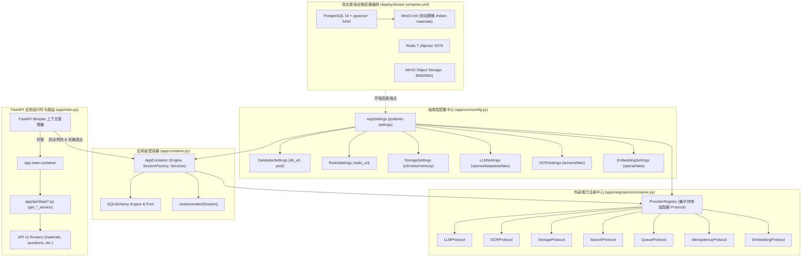
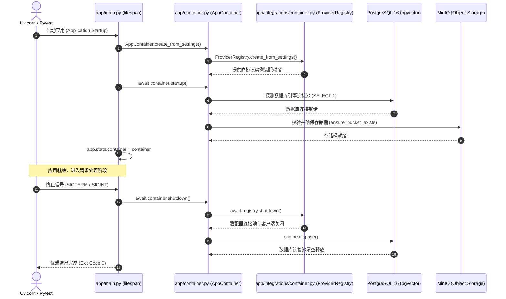

# Spec: 真实基础设施容器化编排与分层提供商注册中心 - 技术契约

- **关联 Intent**: ZL-139
- **主导设计人**: Dev
- **当前状态**: In-Review
- **Change Tier**: Tier 3 (Cross-Domain Rewiring)

---

## 1. 架构流向与设计方案

### 1.1 核心演化动因与设计原则
在既有实现中，应用入口 `backend/app/main.py` 在模块加载顶层硬编码了 SQLite 内存库、直接执行 `Base.metadata.create_all`，并零散初始化了 Fake/Memory 适配器。
本技术契约遵循已达成的架构决议与 `AGENTS.md` 铁律，实现从原型开发向生产级真实基础设施的跨越：
1. **分层防腐与单向依赖**：外部能力适配与业务领域组装解耦为双层注册中心。外部适配器集中于 `app/integrations/container.py`（严格阻断业务服务反向导入）；领域服务与连接池装配集中于 `app/container.py`；
2. **凭据收敛与强类型契约**：彻底消除业务代码中散落的 `os.environ`，通过 `pydantic-settings` 提供强类型、具备脱敏保护与分环境覆写的配置中心；
3. **受控生命周期管理**：全面采用现代 FastAPI `lifespan` 异步上下文管理器接管初始化与优雅退出，消除模块顶层副作用；
4. **容器基础设施编排与向量迁移**：提供编排 PostgreSQL 16 (pgvector)、Redis 7、MinIO 的完整 Compose 栈，并通过 Alembic 标准版本化脚本幂等管理数据库模式。

### 1.2 系统架构拓扑图
下图展示从容器基础设施、强类型配置、双层注册中心到 FastAPI Lifespan 与领域服务的分层流向：



### 1.3 双层注册中心机制契约
为杜绝违反 `tooling/check_layers.py` 中“外部适配层严禁反向导入服务层 (`app.services`)”的铁律，注册中心严格切分为两层：

| 特性维度 | 外部适配器注册中心 (`ProviderRegistry`) | 应用顶层装配容器 (`AppContainer`) |
| :--- | :--- | :--- |
| **所属模块文件** | `backend/app/integrations/container.py` | `backend/app/container.py` |
| **架构分层** | `app/integrations` (外部适配层) | `app` 顶级应用装配层 |
| **依赖导入权限** | 仅依赖 `app.core` 与各适配器工厂，**绝对禁止导入 `app.services`** | 协调依赖 `app.core`, `app.integrations`, `app.services`, `app.repositories` |
| **核心职责** | 生产与持有 7 块协议实例 (LLM, OCR, Storage, Search, Queue, Idempotency, Embedding) | 管理数据库引擎连接池、Session 工厂、领域服务生命周期注入与健康探测 |
| **生命周期接口** | `async def shutdown() -> None` (关闭外部网络客户端) | `async def startup() -> None` 与 `async def shutdown() -> None` |

### 1.4 应用生命周期与 Lifespan 时序流转
生命周期彻底移出全局 import 顶层，由 FastAPI Lifespan 单向顺序推进：



---

## 2. API 与数据契约设计

### 2.1 强类型配置中心契约 (`backend/app/core/config.py`)
严格遵循 8 个缩写白名单 (`api`, `id`, `url`, `ocr`, `llm`, `db`, `config`, `env`)，杜绝散落 `os.environ`：

```python
from functools import lru_cache
from typing import Literal
from pydantic import Field, SecretStr
from pydantic_settings import BaseSettings, SettingsConfigDict


class DatabaseSettings(BaseSettings):
    """数据库连接与连接池配置。"""
    db_url: str = Field(default="sqlite:///./zhilian_dev.db", description="数据库连接 URI")
    echo: bool = Field(default=False, description="是否打印 SQLAlchemy SQL 日志")
    pool_size: int = Field(default=10, description="连接池常驻连接数")
    max_overflow: int = Field(default=20, description="连接池突发最大溢出数")
    pool_pre_ping: bool = Field(default=True, description="连接借出前连通性检测")


class RedisSettings(BaseSettings):
    """Redis 缓存与消息队列连接配置。"""
    redis_url: str = Field(default="redis://localhost:6379/0", description="Redis 连接 URL")


class StorageSettings(BaseSettings):
    """对象存储配置契约。"""
    provider: Literal["memory", "s3", "minio"] = Field(default="memory", description="存储提供商")
    endpoint_url: str | None = Field(default=None, description="S3/MinIO 端点地址")
    access_key: SecretStr | None = Field(default=None, description="访问密钥 ID")
    secret_key: SecretStr | None = Field(default=None, description="秘密访问密钥")
    bucket_name: str = Field(default="zhilian-materials", description="默认资料存储桶")
    region: str = Field(default="us-east-1", description="存储地域")
    secure: bool = Field(default=False, description="是否启用 HTTPS")


class LLMSettings(BaseSettings):
    """大语言模型统一兼容层配置契约。"""
    provider: Literal["fake", "openai", "dashscope", "deepseek", "siliconflow"] = Field(
        default="fake", description="LLM 适配提供商"
    )
    api_key: SecretStr | None = Field(default=None, description="大模型 API Key 凭证")
    base_url: str | None = Field(default=None, description="兼容端点基础地址")
    model: str = Field(default="qwen-max", description="模型名称")
    timeout: float = Field(default=30.0, description="请求超时上限（秒）")
    max_retries: int = Field(default=3, description="失败最大重试次数")


class OCRSettings(BaseSettings):
    """OCR 统一兼容层配置契约。"""
    provider: Literal["fake", "tencent"] = Field(default="fake", description="OCR 提供商")
    secret_id: SecretStr | None = Field(default=None, description="云服务 SecretId")
    secret_key: SecretStr | None = Field(default=None, description="云服务 SecretKey")
    region: str = Field(default="ap-guangzhou", description="云服务地域")
    endpoint: str = Field(default="ocr.tencentcloudapi.com", description="接口端点")
    timeout: float = Field(default=20.0, description="请求超时上限（秒）")
    max_retries: int = Field(default=3, description="失败最大重试次数")


class EmbeddingSettings(BaseSettings):
    """向量化模型统一配置契约。"""
    provider: Literal["fake", "openai", "dashscope"] = Field(default="fake", description="向量提供商")
    api_key: SecretStr | None = Field(default=None, description="向量化 API Key")
    base_url: str | None = Field(default=None, description="向量化基础地址")
    model: str = Field(default="text-embedding-v3", description="向量模型名称")
    dimensions: int = Field(default=1024, description="向量特征维度")
    timeout: float = Field(default=20.0, description="请求超时上限（秒）")
    max_retries: int = Field(default=3, description="失败最大重试次数")


class QueueSettings(BaseSettings):
    """任务队列适配器配置契约。"""
    provider: Literal["memory", "redis"] = Field(default="memory", description="队列类型")
    immediate_mode: bool = Field(default=False, description="是否同步即时执行")


class IdempotencySettings(BaseSettings):
    """分布式幂等拦截器配置契约。"""
    provider: Literal["memory", "redis"] = Field(default="memory", description="幂等拦截提供商")


class SearchSettings(BaseSettings):
    """混合检索适配器配置契约。"""
    provider: Literal["fake", "pgvector"] = Field(default="fake", description="检索后端")


class AppSettings(BaseSettings):
    """智练平台全局强类型配置中心。"""
    env: Literal["development", "test", "production"] = Field(
        default="development", description="当前运行环境"
    )
    debug: bool = Field(default=False, description="是否开启调试模式")
    secret_key: SecretStr = Field(
        default=SecretStr("zhilian-development-secret-key-32bytes-min!"),
        description="系统 JWT 签名私钥",
    )

    db: DatabaseSettings = Field(default_factory=DatabaseSettings)
    redis: RedisSettings = Field(default_factory=RedisSettings)
    storage: StorageSettings = Field(default_factory=StorageSettings)
    llm: LLMSettings = Field(default_factory=LLMSettings)
    ocr: OCRSettings = Field(default_factory=OCRSettings)
    embedding: EmbeddingSettings = Field(default_factory=EmbeddingSettings)
    queue: QueueSettings = Field(default_factory=QueueSettings)
    idempotency: IdempotencySettings = Field(default_factory=IdempotencySettings)
    search: SearchSettings = Field(default_factory=SearchSettings)

    model_config = SettingsConfigDict(
        env_prefix="ZHILIAN_",
        env_nested_delimiter="__",
        env_file=".env",
        extra="ignore",
    )


@lru_cache(maxsize=1)
def get_settings() -> AppSettings:
    """获取单例全局配置项。"""
    return AppSettings()
```

### 2.2 基础设施提供商注册中心契约 (`backend/app/integrations/container.py`)
```python
from dataclasses import dataclass
from typing import Any
from app.core.config import AppSettings
from app.integrations.embedding.protocol import EmbeddingProtocol
from app.integrations.idempotency.protocol import IdempotencyProtocol
from app.integrations.llm.protocol import LLMProtocol
from app.integrations.ocr.protocol import OCRProtocol
from app.integrations.queue.protocol import QueueProtocol
from app.integrations.search.protocol import SearchProtocol
from app.integrations.storage.protocol import StorageProtocol


@dataclass(frozen=True)
class ProviderRegistry:
    """外部基础设施协议适配器不可变注册表。"""
    llm: LLMProtocol
    ocr: OCRProtocol
    storage: StorageProtocol
    search: SearchProtocol
    queue: QueueProtocol
    idempotency: IdempotencyProtocol
    embedding: EmbeddingProtocol

    @classmethod
    def create_from_settings(
        cls, settings: AppSettings, session_factory: Any | None = None
    ) -> "ProviderRegistry":
        """根据强类型配置实例化全套符合 Protocol 契约的适配器。"""
        ...

    async def shutdown(self) -> None:
        """清理外部客户端连接与后台资源。"""
        ...
```

### 2.3 应用顶层装配容器契约 (`backend/app/container.py`)
```python
from collections.abc import Generator
from sqlalchemy.engine import Engine
from sqlalchemy.orm import Session, sessionmaker
from app.core.config import AppSettings
from app.integrations.container import ProviderRegistry
from app.services.auth import AuthService
from app.services.diagnosis import DiagnosisService
from app.services.grading import GradingService
from app.services.knowledge import KnowledgeService
from app.services.material import MaterialService
from app.services.practice import PracticeService
from app.services.question import QuestionService


class AppContainer:
    """应用全局装配容器：管理连接池、会话工厂与领域服务。"""

    def __init__(
        self,
        settings: AppSettings,
        engine: Engine,
        session_factory: sessionmaker[Session],
        providers: ProviderRegistry,
    ) -> None:
        self.settings = settings
        self.engine = engine
        self.session_factory = session_factory
        self.providers = providers

    @classmethod
    def create_from_settings(cls, settings: AppSettings | None = None) -> "AppContainer":
        """自底向上根据配置装配连接池、注册中心与容器实例。"""
        ...

    def get_db_session(self) -> Generator[Session, None, None]:
        """产出单请求生命周期的独立数据库会话上下文。"""
        session = self.session_factory()
        try:
            yield session
        finally:
            session.close()

    # 领域服务工厂方法
    def get_auth_service(self, session: Session) -> AuthService: ...
    def get_material_service(self, session: Session) -> MaterialService: ...
    def get_knowledge_service(self, session: Session) -> KnowledgeService: ...
    def get_question_service(self, session: Session) -> QuestionService: ...
    def get_practice_service(self, session: Session) -> PracticeService: ...
    def get_grading_service(self, session: Session) -> GradingService: ...
    def get_diagnosis_service(self, session: Session) -> DiagnosisService: ...

    async def startup(self) -> None:
        """容器启动预热钩子：验证 DB 连通性、确保 MinIO 初始 Bucket 存在。"""
        ...

    async def shutdown(self) -> None:
        """容器优雅停机钩子：释放 ProviderRegistry 客户端并销毁连接池。"""
        await self.providers.shutdown()
        self.engine.dispose()
```

### 2.4 FastAPI Lifespan 与依赖注入桥接契约 (`backend/app/main.py`)
```python
from collections.abc import AsyncGenerator
from contextlib import asynccontextmanager
from fastapi import FastAPI, Request
from app.container import AppContainer
from app.core.config import get_settings


@asynccontextmanager
async def lifespan(app: FastAPI) -> AsyncGenerator[None, None]:
    """FastAPI 应用全局生命周期异步上下文管理器。"""
    settings = get_settings()
    container = AppContainer.create_from_settings(settings)
    await container.startup()
    app.state.container = container
    yield
    await container.shutdown()


app = FastAPI(
    title="智练自主学习平台 API",
    description="智练平台后端核心领域服务与 RESTful API 总线",
    version="1.0.0",
    lifespan=lifespan,
)


def get_container(request: Request) -> AppContainer:
    """从请求上下文安全获取全局装配容器。"""
    return request.app.state.container
```

各 `backend/app/api/deps/*.py` 的 `get_*_service()` 保持签名不变，作为 FastAPI `Depends` 声明锚点；其具体执行通过 `main.py` 的依赖绑定直接映射到 `container.get_*_service(session)`，并在测试中保持 `app.dependency_overrides` 100% 兼容。

### 2.5 容器化编排契约 (`deploy/docker-compose.yml`)
严格满足 PG16(pgvector)、Redis 7、MinIO 独立健康检查与开箱即用建桶：

```yaml
version: '3.8'

services:
  postgres:
    image: pgvector/pgvector:pg16
    container_name: zhilian-postgres
    restart: unless-stopped
    ports:
      - "5432:5432"
    environment:
      POSTGRES_USER: ${ZHILIAN_DB__USER:-postgres}
      POSTGRES_PASSWORD: ${ZHILIAN_DB__PASSWORD:-postgres}
      POSTGRES_DB: ${ZHILIAN_DB__NAME:-zhilian}
    volumes:
      - pgdata:/var/lib/postgresql/data
    healthcheck:
      test: ["CMD-SHELL", "pg_isready -U postgres -d zhilian"]
      interval: 5s
      timeout: 5s
      retries: 5
    networks:
      - zhilian-net

  redis:
    image: redis:7-alpine
    container_name: zhilian-redis
    restart: unless-stopped
    ports:
      - "6379:6379"
    volumes:
      - redisdata:/data
    healthcheck:
      test: ["CMD", "redis-cli", "ping"]
      interval: 5s
      timeout: 3s
      retries: 5
    networks:
      - zhilian-net

  minio:
    image: minio/minio:latest
    container_name: zhilian-minio
    restart: unless-stopped
    command: server /data --console-address ":9001"
    ports:
      - "9000:9000"
      - "9001:9001"
    environment:
      MINIO_ROOT_USER: ${ZHILIAN_STORAGE__ACCESS_KEY:-minioadmin}
      MINIO_ROOT_PASSWORD: ${ZHILIAN_STORAGE__SECRET_KEY:-minioadmin}
    volumes:
      - miniodata:/data
    healthcheck:
      test: ["CMD", "mc", "ready", "local"]
      interval: 5s
      timeout: 5s
      retries: 5
    networks:
      - zhilian-net

  minio-init:
    image: minio/mc:latest
    container_name: zhilian-minio-init
    depends_on:
      minio:
        condition: service_healthy
    entrypoint: >
      /bin/sh -c "
      mc alias set local http://minio:9000 minioadmin minioadmin;
      mc mb local/zhilian-materials --ignore-existing;
      exit 0;
      "
    networks:
      - zhilian-net

volumes:
  pgdata:
    driver: local
  redisdata:
    driver: local
  miniodata:
    driver: local

networks:
  zhilian-net:
    driver: bridge
```

### 2.6 健康检查增强契约 (`GET /health`)
`/health` 端点增强为多组件结构化就绪状态诊断：

* **响应状态码**: `200 OK` (正常/降级) 或 `503 Service Unavailable` (核心 DB 失联)
* **响应 Schema**:
```json
{
  "status": "ok",
  "app": "ZhiLian",
  "environment": "development",
  "database": {
    "status": "connected",
    "dialect": "postgresql"
  },
  "storage": {
    "provider": "minio",
    "bucket": "zhilian-materials"
  },
  "providers": {
    "llm": "fake",
    "ocr": "fake",
    "embedding": "fake",
    "search": "fake",
    "queue": "memory"
  }
}
```

---

## 3. 可测性设计 (Design for Testability)

### 3.1 零外部网络隔离红线与适配器降级
1. **测试隔离红线**：所有针对 `AppContainer` 与 `ProviderRegistry` 的单元测试在运行期间必须受到 `conftest.py` 中 `socket.connect` 网络阻断 Fixture 严格监管；
2. **纯内存/Fake 模式自闭环**：单测默认配置使用 `provider="fake"` / `provider="memory"` 与 SQLite 内存模式 (`sqlite:///:memory:`)，执行耗时严格保持在毫秒级；
3. **真实集成测试**：在独立集成测试文件中验证容器基础设施（PG16+pgvector、Redis、MinIO）的物理连通性、Alembic 迁移升级与 HNSW 向量索引创建。

### 3.2 纯函数计算核独立性
5 大核心算法纯函数（资料分块、知识点质检、题目质检、判题阈值匹配、掌握度衰减聚合）严禁引入任何容器或配置对象，保持 100% 纯函数与独立单测覆盖率门槛：
* `split_material_into_snippets`: 分支覆盖率 100%；
* `verify_knowledge_points`: 判定覆盖率 100%；
* `filter_qualified_questions`: 条件组合覆盖；
* `match_and_grade_answer`: 条件组合覆盖；
* `aggregate_mastery_scores`: 分支覆盖率 100%。

### 3.3 自动化测试验收矩阵

| 用例编号 | 测试目标 | 涉及模块 | 断言与验证标准 |
| :--- | :--- | :--- | :--- |
| **UT-CFG-01** | 强类型默认配置加载 | `app.core.config` | 各子 Settings 正确赋初值，敏感属性为 `SecretStr` |
| **UT-CFG-02** | 环境变量前缀与嵌套覆盖 | `app.core.config` | `ZHILIAN_STORAGE__PROVIDER=minio` 正确反序列化 |
| **UT-REG-01** | ProviderRegistry 装配分发 | `app.integrations.container` | 根据 Settings 生产对应 Protocol 实现，各适配器就绪 |
| **UT-REG-02** | ProviderRegistry 优雅清理 | `app.integrations.container` | `shutdown()` 被调用且正常退出，无悬挂句柄 |
| **UT-CTR-01** | AppContainer 完整生命周期 | `app.container` | `startup()` 校验通过，`get_db_session()` 产出会话，`shutdown()` 释放连接池 |
| **UT-CTR-02** | 领域服务依赖注入正确性 | `app.container` | 各 Service 工厂生成实例，且底层依赖注入与 Protocol 对齐 |
| **UT-LIFE-01** | FastAPI Lifespan 状态挂载 | `app.main` | 模拟 Lifespan 启动后 `app.state.container` 存在，应用关闭时触发清理 |
| **UT-LAY-01** | 分层架构单向依赖校验 | `tooling/check_layers.py` | 扫描 `backend/app`，违规导入数必须为 0 |
| **IT-PGV-01** | PG16 pgvector 迁移幂等性 | `backend/migrations` | 执行 `alembic upgrade head`，验证 vector 扩展已激活且表结构就绪 |

---

## 4. 替代方案与权衡考量 (Alternatives Considered & Trade-offs)

### 4.1 单体容器 vs 分层双注册中心 (ProviderRegistry + AppContainer)
* **替代方案**: 将所有适配器实例、数据库引擎和领域服务全部揉在一个 `app/container.py` 或 `app/core/container.py` 中。
* **未采纳原因**:
  - `tooling/check_layers.py` 规定：`app/integrations` 外部适配层严禁反向导入 `app.services`；`app/core` 严禁导入 `app.services`；
  - 若在 `app/core` 中组装业务服务，会直接触犯架构门禁红线；
  - 将适配器注册收敛于 `app/integrations/container.py`，将应用全量服务装配收敛于 `app/container.py`，保持清晰单向流向：`api` -> `container` -> `services` & `integrations` -> `core`。

### 4.2 零散 `os.environ` 访问 vs `pydantic-settings` 集中配置
* **替代方案**: 继续在各工厂函数中直接调用 `os.environ.get(...)`。
* **未采纳原因**:
  - 零散调用导致配置不可靠、不可测试，且无法在启动阶段快速发现拼写错误或类型异常；
  - 缺乏敏感凭证隔离保护（容易误在日志中打印）；
  - `pydantic-settings` 提供强类型验证、嵌套结构反序列化和敏感字段自动遮罩，是生产级唯一正解。

### 4.3 模块级启动执行 vs FastAPI `lifespan` 上下文机制
* **替代方案**: 继续保留 `Base.metadata.create_all(engine)` 在 `main.py` 模块加载时执行。
* **未采纳原因**:
  - 导入模块即执行 I/O 是 Python 工程大忌，阻断了惰性加载与多进程 fork，使离线静态分析工具与单元测试启动变慢或报错；
  - `lifespan` 上下文管理器提供了标准优雅退出机制，确保 Uvicorn 在接收到关闭信号时连接池被物理回收。

---

## 5. 动态风险核验与回滚预案 (7-Dimensional Dynamic Risk Assessment)

### 5.1 7 维动态风险扫描矩阵

| 维度 (Dimension) | 风险研判 (Analysis) | 规避与隔离措施 (Mitigation) |
| :--- | :--- | :--- |
| **1. Files** | 变动触及配置、容器、生命周期与主入口等 7+ 核心文件 | 严格限定仅增加/修改装配层，严禁触碰业务核心逻辑与纯函数计算核 |
| **2. Public API** | 现有所有 RESTful API 路由契约保持 100% 兼容；`/health` 增量丰富 | 现有 API 字段不删除不改名；健康检查保持顶层 `{"status": "ok"}` 兼容旧探针 |
| **3. Data Schema** | 迁移由 Alembic 管理，在真实 PG16 下激活 pgvector 扩展 | 现有 0001~0003 迁移脚本保持幂等 (`CREATE EXTENSION IF NOT EXISTS vector`) |
| **4. Auth & Security** | 敏感密码、SecretKey 与 API Key 集中管理 | 配置类使用 `SecretStr`；日志打印强制执行脱敏过滤，严禁记录私钥全文 |
| **5. Dependencies** | 需补充生产环境数据库驱动 (`psycopg[binary]>=3.1.0`) | 在 `pyproject.toml` 正式登记；单元测试仍使用本地内存驱动保证脱机零网络 |
| **6. Rollback Difficulty** | 装配容器解耦清晰，回滚成本极低 | 遇紧急异常可将 `main.py` 瞬间切回 SQLite+Fake 适配器；docker-compose 可一键停止 |
| **7. Blast Radius** | 全局启动与请求依赖注入链（Bootstrap & Lifecycle） | 全量单测与既有 `test_p0_full_chain_e2e.py` 端到端必须 100% 通过无断言削弱 |

### 5.2 回滚与故障应急策略
1. **配置级即时回退**：若真实基础设施或外部服务出现网络抖动，无需重新编译，仅需设置环境变量：
   ```bash
   export ZHILIAN_DB__DB_URL="sqlite:///./zhilian_dev.db"
   export ZHILIAN_STORAGE__PROVIDER="memory"
   export ZHILIAN_LLM__PROVIDER="fake"
   export ZHILIAN_OCR__PROVIDER="fake"
   ```
   应用自动降级为完全自闭环的开发模式；
2. **代码级快速回滚**：所有变更集中在容器编排、配置与装配层，可通过 `git revert` 单次原子提交瞬间回滚，不破坏既有数据库持久化数据与业务模型。

---

## 6. 阶段准出签批 (Gate 2 Sign-off)

- [x] 架构流向与 API 契约已冻结
- [x] 替代方案已完成推演与权衡
- [x] 7 维风险已核验且具备明确回滚预案
- **审查结论**: Accepted
- **签批人 / 日期**: User / 2026-09-25 20:50
